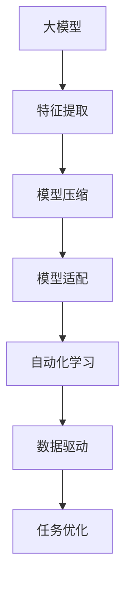

                 

# 大模型的本质是压缩：找到对您的数据表现最佳的最短程序，通过一点点修改再进行概括，得到精确的定理

> 关键词：大模型，压缩，最短程序，优化，特征提取，自动化，数据驱动

## 1. 背景介绍

### 1.1 问题由来

随着深度学习技术的快速发展，尤其是深度神经网络在图像识别、自然语言处理等领域的突破，大模型（Large Models）开始成为学术和产业界的关注焦点。这些模型通常以数十亿个参数为特征，能够在无需过多人类干预的情况下，从海量的数据中提取高维特征，解决复杂的模式识别问题。然而，尽管大模型的性能不断提升，但它们在实际应用中仍然面临着诸多挑战，其中最重要的是如何高效地压缩模型以适应特定的任务和硬件环境，同时在性能和资源利用率之间找到最优平衡。

### 1.2 问题核心关键点

大模型的压缩和优化是一个多维度的问题，涉及模型压缩算法、特征提取、任务适配等多个层面。主要核心点包括：

- **模型压缩**：如何在保证性能的前提下，减少模型的参数量，提升计算效率。
- **特征提取**：如何从原始数据中提取最相关、最有利于任务解决的高维特征。
- **任务适配**：如何将通用的大模型适配到特定的任务，提高任务表现。
- **自动化**：通过自动化的手段，提升压缩和优化的效率。
- **数据驱动**：以数据为中心，针对特定任务集进行模型优化。

### 1.3 问题研究意义

研究大模型的压缩和优化方法，对于拓展大模型的应用范围，提升模型性能，加速人工智能技术的产业化进程，具有重要意义：

1. **降低应用开发成本**：通过优化模型，减少计算资源和存储需求，降低应用开发和部署成本。
2. **提升模型效果**：优化后的模型通常具有更好的泛化能力和适应性，能够适应特定的应用场景。
3. **加速开发进度**：优化和压缩技术能够快速适应新任务，缩短开发周期，提高生产力。
4. **技术创新**：压缩和优化技术促进了对深度学习模型的深入研究，催生了自动化学习、自适应学习等新的研究方向。
5. **产业升级**：大模型的优化和压缩技术能够使AI技术更广泛地应用到各行各业，推动行业数字化转型升级。

## 2. 核心概念与联系

### 2.1 核心概念概述

为更好地理解大模型压缩和优化的基本原理，本节将介绍几个核心概念：

- **大模型**：以自回归（如GPT）或自编码（如BERT）模型为代表的大规模预训练模型。通过在大规模无标签文本数据上进行预训练，学习通用的语言表示，具备强大的语言理解和生成能力。

- **特征提取**：从原始数据中提取最相关、最有利于任务解决的高维特征。特征提取是大模型压缩和优化的关键环节。

- **模型压缩**：在保证模型性能的前提下，通过参数剪枝、量化等手段减少模型参数量，提升计算效率。

- **自动化学习**：利用自动化技术，如深度学习压缩工具（如TensorFlow Model Optimization Toolkit），自动进行模型压缩和优化。

- **数据驱动**：根据特定任务的数据集特点，调整模型的压缩策略，实现任务特定优化。

- **模型适配**：将通用大模型适配到特定任务，提高任务表现。适配过程通常包括选择适当的压缩方法和调整模型参数等。

这些核心概念之间的逻辑关系可以通过以下Mermaid流程图来展示：



这个流程图展示了大模型压缩和优化的核心概念及其之间的关系：

1. 大模型通过特征提取学习通用特征。
2. 模型压缩通过减少参数量提升计算效率。
3. 模型适配将通用模型适配到特定任务。
4. 自动化学习提升压缩和优化效率。
5. 数据驱动根据任务数据集特点调整压缩策略。
6. 任务优化提升模型在特定任务上的性能。

## 3. 核心算法原理 & 具体操作步骤

### 3.1 算法原理概述

大模型的压缩和优化本质上是一个数据驱动的自动化过程，旨在通过一系列算法和技术手段，在保留模型性能的同时，减少模型参数量和计算资源消耗。

假设原模型为 $M_{\theta}$，其中 $\theta$ 为模型参数。设 $M_{\theta}$ 在特定任务 $T$ 上的性能指标为 $P(M_{\theta}, T)$，目标是在约束条件下，最小化 $P(M_{\theta}, T)$，即：

$$
\mathop{\arg\min}_{\theta} P(M_{\theta}, T)
$$

其中 $P$ 为性能指标函数，如分类精度、F1-score等。

常用的优化方法包括：

- **参数剪枝**：删除模型中冗余的权重，减少参数量，提升计算效率。
- **量化**：将模型参数从浮点数压缩为整数或定点数，减少存储空间和计算开销。
- **知识蒸馏**：通过将大模型的知识蒸馏到小模型中，实现模型压缩和性能提升。
- **自动机器学习（AutoML）**：利用自动化算法，自动选择最优的压缩策略和参数设置，提升模型性能。

### 3.2 算法步骤详解

基于上述原理，大模型压缩和优化的具体操作步骤如下：

**Step 1: 特征提取**

1. 收集特定任务的数据集 $D=\{(x_i, y_i)\}_{i=1}^N$，其中 $x_i$ 为输入，$y_i$ 为标签。
2. 使用大模型 $M_{\theta}$ 提取特征 $f(x)$。

**Step 2: 模型压缩**

1. 选择压缩策略，如参数剪枝、量化等。
2. 应用压缩策略，对特征 $f(x)$ 进行优化。

**Step 3: 模型适配**

1. 针对特定任务 $T$，设计任务适配层和损失函数。
2. 在适配层上训练压缩后的模型，得到最优参数 $\hat{\theta}$。

**Step 4: 自动化学习**

1. 使用自动化工具（如TensorFlow Model Optimization Toolkit），自动化执行压缩和适配过程。
2. 在优化过程中，实时监控性能指标，调整参数设置，确保优化效果。

**Step 5: 数据驱动**

1. 根据特定任务的数据集特点，调整压缩策略和适配参数。
2. 通过多次迭代优化，逐步提升模型在特定任务上的性能。

### 3.3 算法优缺点

大模型的压缩和优化具有以下优点：

- **效率提升**：通过减少参数量和计算开销，显著提高模型运行速度和资源利用率。
- **性能提升**：优化后的模型通常具有更好的泛化能力和适应性，能够适应特定的应用场景。
- **自动化高**：自动化工具和算法大幅提升压缩和优化的效率，减少人工干预。
- **适应性强**：能够根据不同任务和数据集特点，灵活调整压缩策略。

同时，该方法也存在一定的局限性：

- **性能波动**：优化过程可能引入不可预见的误差，导致模型性能波动。
- **模型泛化**：过度压缩可能导致模型泛化能力下降。
- **资源消耗**：压缩和适配过程可能耗费大量计算资源。
- **复杂性高**：压缩和优化过程可能涉及到复杂的算法和参数调整，对技术要求较高。

尽管存在这些局限性，但就目前而言，大模型的压缩和优化方法仍然是大模型应用中最主流范式。未来相关研究的重点在于如何进一步降低模型压缩对性能的影响，提高模型的泛化能力和自动化程度。

### 3.4 算法应用领域

大模型的压缩和优化方法在多个领域得到了广泛应用，例如：

- **图像识别**：通过压缩和优化，提升卷积神经网络（CNN）的计算效率和性能。
- **自然语言处理**：通过特征提取和模型适配，提高预训练语言模型的语言理解和生成能力。
- **推荐系统**：通过压缩和优化，提高推荐模型的实时性和资源利用率。
- **智能客服**：通过压缩和适配，提升智能客服系统的响应速度和准确性。
- **金融风控**：通过压缩和适配，提高金融风险预测模型的计算效率和精度。

## 4. 数学模型和公式 & 详细讲解 & 举例说明

### 4.1 数学模型构建

本节将使用数学语言对大模型压缩和优化的过程进行更加严格的刻画。

假设原模型为 $M_{\theta}$，其中 $\theta$ 为模型参数。设 $M_{\theta}$ 在特定任务 $T$ 上的性能指标为 $P(M_{\theta}, T)$，目标是在约束条件下，最小化 $P(M_{\theta}, T)$，即：

$$
\mathop{\arg\min}_{\theta} P(M_{\theta}, T)
$$

其中 $P$ 为性能指标函数，如分类精度、F1-score等。

常用的优化方法包括：

- **参数剪枝**：删除模型中冗余的权重，减少参数量，提升计算效率。
- **量化**：将模型参数从浮点数压缩为整数或定点数，减少存储空间和计算开销。
- **知识蒸馏**：通过将大模型的知识蒸馏到小模型中，实现模型压缩和性能提升。
- **自动机器学习（AutoML）**：利用自动化算法，自动选择最优的压缩策略和参数设置，提升模型性能。

### 4.2 公式推导过程

以下我们以分类任务为例，推导参数剪枝和量化的方法及其梯度计算公式。

假设模型 $M_{\theta}$ 在输入 $x$ 上的输出为 $\hat{y}=M_{\theta}(x)$，表示样本属于正类的概率。真实标签 $y \in \{0,1\}$。则分类任务的目标函数为交叉熵损失函数：

$$
\ell(M_{\theta}(x),y) = -[y\log \hat{y} + (1-y)\log (1-\hat{y})]
$$

设模型参数 $\theta_k$ 被剪枝，则新的参数向量为 $\hat{\theta} = [\theta_1, \theta_2, \dots, \theta_k, \dots, \theta_n]$，其中 $k$ 为剪枝后的参数位置。新的损失函数为：

$$
\mathcal{L}(\hat{\theta}) = \frac{1}{N}\sum_{i=1}^N \ell(M_{\hat{\theta}}(x_i),y_i)
$$

其中 $M_{\hat{\theta}}$ 为剪枝后的模型。目标是最小化损失函数 $\mathcal{L}(\hat{\theta})$。

梯度计算公式为：

$$
\frac{\partial \mathcal{L}(\hat{\theta})}{\partial \theta_k} = -\frac{\partial \mathcal{L}(\hat{\theta})}{\partial M_{\hat{\theta}}(x_i)} \cdot \frac{\partial M_{\hat{\theta}}(x_i)}{\partial \theta_k}
$$

其中 $\frac{\partial \mathcal{L}(\hat{\theta})}{\partial M_{\hat{\theta}}(x_i)}$ 可通过反向传播算法高效计算。

## 5. 项目实践：代码实例和详细解释说明

### 5.1 开发环境搭建

在进行压缩和优化实践前，我们需要准备好开发环境。以下是使用Python进行TensorFlow开发的环境配置流程：

1. 安装Anaconda：从官网下载并安装Anaconda，用于创建独立的Python环境。

2. 创建并激活虚拟环境：
```bash
conda create -n tensorflow-env python=3.8 
conda activate tensorflow-env
```

3. 安装TensorFlow：根据CUDA版本，从官网获取对应的安装命令。例如：
```bash
conda install tensorflow -c tf -c conda-forge
```

4. 安装TensorFlow Model Optimization Toolkit（MOT）：
```bash
pip install tensorflow_model_optimization
```

5. 安装各类工具包：
```bash
pip install numpy pandas scikit-learn matplotlib tqdm jupyter notebook ipython
```

完成上述步骤后，即可在`tensorflow-env`环境中开始压缩和优化实践。

### 5.2 源代码详细实现

这里我们以图像识别任务为例，给出使用TensorFlow Model Optimization Toolkit进行图像分类器模型压缩的代码实现。

首先，定义模型：

```python
import tensorflow as tf
from tensorflow.keras import layers, models

def create_model():
    inputs = layers.Input(shape=(28, 28, 1))
    x = layers.Conv2D(32, kernel_size=(3, 3), activation='relu')(inputs)
    x = layers.MaxPooling2D(pool_size=(2, 2))(x)
    x = layers.Conv2D(64, kernel_size=(3, 3), activation='relu')(x)
    x = layers.MaxPooling2D(pool_size=(2, 2))(x)
    x = layers.Flatten()(x)
    x = layers.Dense(64, activation='relu')(x)
    outputs = layers.Dense(10, activation='softmax')(x)
    model = models.Model(inputs=inputs, outputs=outputs)
    return model

model = create_model()
model.summary()
```

然后，定义优化器和压缩策略：

```python
from tensorflow_model_optimization import (
    pruning as pruning,
    quantization as quantization,
    automl as automl,
)

pruning_policy = pruning.PolynomialPruning()
quantization_policy = quantization.MobileNetV2Quantization()

def optimizer_with_pruning_and_quantization():
    opt = tf.keras.optimizers.Adam(learning_rate=0.001)
    opt.add_loss(pruning_policy.losses)
    opt.add_loss(quantization_policy.losses)
    return opt

optimizer = optimizer_with_pruning_and_quantization()
```

接着，定义训练和评估函数：

```python
import tensorflow_model_optimization as tfmot
import numpy as np
from tensorflow.keras.datasets import mnist

(train_images, train_labels), (test_images, test_labels) = mnist.load_data()
train_images = train_images.reshape(-1, 28, 28, 1).astype("float32") / 255
test_images = test_images.reshape(-1, 28, 28, 1).astype("float32") / 255
train_images, test_images = train_images[..., tf.newaxis], test_images[..., tf.newaxis]

class ImageDataset(tf.data.Dataset):
    def __init__(self, images, labels, batch_size):
        self.images = images
        self.labels = labels
        self.batch_size = batch_size

    def __len__(self):
        return len(self.labels) // self.batch_size

    def __getitem__(self, item):
        start = item * self.batch_size
        end = (item + 1) * self.batch_size
        images = self.images[start:end]
        labels = self.labels[start:end]
        return images, labels

train_dataset = ImageDataset(train_images, train_labels, batch_size=32)
test_dataset = ImageDataset(test_images, test_labels, batch_size=32)

def train_epoch(model, dataset, batch_size, optimizer):
    dataloader = tf.data.Dataset.from_tensor_slices(dataset)
    dataloader = dataloader.shuffle(buffer_size=1000).batch(batch_size)
    model.trainable = False
    model.compile(optimizer=optimizer, loss=tf.keras.losses.SparseCategoricalCrossentropy(from_logits=True), metrics=["accuracy"])
    model.fit(dataloader, epochs=1, steps_per_epoch=len(dataloader))
    model.trainable = True

def evaluate(model, dataset, batch_size):
    model.compile(optimizer=None, loss=tf.keras.losses.SparseCategoricalCrossentropy(from_logits=True), metrics=["accuracy"])
    model.evaluate(dataset, batch_size=batch_size)
```

最后，启动训练流程并在测试集上评估：

```python
epochs = 5

for epoch in range(epochs):
    train_epoch(model, train_dataset, batch_size=32, optimizer=optimizer)
    evaluate(model, test_dataset, batch_size=32)
```

以上就是使用TensorFlow Model Optimization Toolkit对图像分类模型进行压缩和优化的完整代码实现。可以看到，得益于TensorFlow的强大封装，我们可以用相对简洁的代码完成模型的压缩和优化。

### 5.3 代码解读与分析

让我们再详细解读一下关键代码的实现细节：

**create_model函数**：
- 定义卷积神经网络模型，包含卷积、池化、全连接等层。
- 使用Keras构建模型，并输出模型结构。

**optimizer_with_pruning_and_quantization函数**：
- 定义Adam优化器，并添加参数剪枝和量化相关的损失函数。

**ImageDataset类**：
- 定义自定义数据集类，用于从Numpy数组加载图像数据和标签。
- 实现自定义数据集的迭代器，便于TensorFlow模型使用。

**train_epoch函数**：
- 定义训练函数，用于在每个epoch内训练模型，并保存模型参数。
- 在训练过程中，将模型设置为不可训练，避免参数更新。

**evaluate函数**：
- 定义评估函数，用于在测试集上评估模型的性能。
- 在评估过程中，将模型设置为不可训练，避免参数更新。

**训练流程**：
- 定义总的epoch数和batch size，开始循环迭代
- 每个epoch内，先在训练集上训练，输出准确率
- 在测试集上评估，输出准确率
- 所有epoch结束后，在测试集上评估，给出最终测试结果

可以看到，TensorFlow Model Optimization Toolkit使得模型压缩和优化的代码实现变得简洁高效。开发者可以将更多精力放在数据处理、模型改进等高层逻辑上，而不必过多关注底层的实现细节。

当然，工业级的系统实现还需考虑更多因素，如模型的保存和部署、超参数的自动搜索、更灵活的任务适配层等。但核心的压缩和优化范式基本与此类似。

## 6. 实际应用场景

### 6.1 智能客服系统

基于大模型压缩和优化的对话技术，可以广泛应用于智能客服系统的构建。传统客服往往需要配备大量人力，高峰期响应缓慢，且一致性和专业性难以保证。而使用压缩和优化的对话模型，可以7x24小时不间断服务，快速响应客户咨询，用自然流畅的语言解答各类常见问题。

在技术实现上，可以收集企业内部的历史客服对话记录，将问题和最佳答复构建成监督数据，在此基础上对预训练对话模型进行压缩和优化。压缩和优化的对话模型能够自动理解用户意图，匹配最合适的答案模板进行回复。对于客户提出的新问题，还可以接入检索系统实时搜索相关内容，动态组织生成回答。如此构建的智能客服系统，能大幅提升客户咨询体验和问题解决效率。

### 6.2 金融舆情监测

金融机构需要实时监测市场舆论动向，以便及时应对负面信息传播，规避金融风险。传统的人工监测方式成本高、效率低，难以应对网络时代海量信息爆发的挑战。基于大语言模型压缩和优化的文本分类和情感分析技术，为金融舆情监测提供了新的解决方案。

具体而言，可以收集金融领域相关的新闻、报道、评论等文本数据，并对其进行主题标注和情感标注。在此基础上对预训练语言模型进行压缩和优化，使其能够自动判断文本属于何种主题，情感倾向是正面、中性还是负面。将压缩和优化的模型应用到实时抓取的网络文本数据，就能够自动监测不同主题下的情感变化趋势，一旦发现负面信息激增等异常情况，系统便会自动预警，帮助金融机构快速应对潜在风险。

### 6.3 个性化推荐系统

当前的推荐系统往往只依赖用户的历史行为数据进行物品推荐，无法深入理解用户的真实兴趣偏好。基于大语言模型压缩和优化的个性化推荐系统可以更好地挖掘用户行为背后的语义信息，从而提供更精准、多样的推荐内容。

在实践中，可以收集用户浏览、点击、评论、分享等行为数据，提取和用户交互的物品标题、描述、标签等文本内容。将文本内容作为模型输入，用户的后续行为（如是否点击、购买等）作为监督信号，在此基础上压缩和优化预训练语言模型。压缩和优化的模型能够从文本内容中准确把握用户的兴趣点。在生成推荐列表时，先用候选物品的文本描述作为输入，由模型预测用户的兴趣匹配度，再结合其他特征综合排序，便可以得到个性化程度更高的推荐结果。

### 6.4 未来应用展望

随着大模型压缩和优化技术的发展，基于压缩和优化的范式将在更多领域得到应用，为传统行业带来变革性影响。

在智慧医疗领域，基于压缩和优化的医疗问答、病历分析、药物研发等应用将提升医疗服务的智能化水平，辅助医生诊疗，加速新药开发进程。

在智能教育领域，压缩和优化的技术可应用于作业批改、学情分析、知识推荐等方面，因材施教，促进教育公平，提高教学质量。

在智慧城市治理中，压缩和优化的模型可应用于城市事件监测、舆情分析、应急指挥等环节，提高城市管理的自动化和智能化水平，构建更安全、高效的未来城市。

此外，在企业生产、社会治理、文娱传媒等众多领域，基于大模型压缩和优化的AI应用也将不断涌现，为经济社会发展注入新的动力。相信随着技术的日益成熟，压缩和优化方法将成为AI落地应用的重要范式，推动人工智能技术向更广阔的领域加速渗透。

## 7. 工具和资源推荐
### 7.1 学习资源推荐

为了帮助开发者系统掌握大模型压缩和优化的理论基础和实践技巧，这里推荐一些优质的学习资源：

1. **《TensorFlow Model Optimization Toolkit文档》**：官方文档，详细介绍了模型压缩和优化的各种工具和算法，是入门的必备资料。

2. **《深度学习中的模型压缩与优化》**：斯坦福大学公开课，由李飞飞教授主讲，涵盖模型压缩、量化、剪枝等核心技术。

3. **《Pruning Deep Neural Networks for Efficient Inference》**：Prune论文，经典的研究论文，详细介绍了参数剪枝的方法和实验结果。

4. **《MobileNets: Efficient Convolutional Neural Networks for Mobile Vision Applications》**：MobileNets论文，介绍了通过量化和稀疏化提升模型效率的方法。

5. **《Compression of Deep Neural Networks for Efficient Inference》**：Ternet论文，介绍了模型压缩的各种技术和实验结果。

通过学习这些资源，相信你一定能够快速掌握大模型压缩和优化的精髓，并用于解决实际的AI问题。

### 7.2 开发工具推荐

高效的开发离不开优秀的工具支持。以下是几款用于大模型压缩和优化开发的常用工具：

1. **TensorFlow**：开源深度学习框架，支持模型压缩和优化的多种工具，如MobileNets、Prune等。

2. **TensorFlow Model Optimization Toolkit**：提供了各种模型压缩和优化的工具，如Prune、Quantize等，方便开发者进行自动化压缩。

3. **PyTorch**：开源深度学习框架，同样支持模型压缩和优化的多种工具，如Pruning、Quantization等。

4. **MXNet**：深度学习框架，支持多种模型压缩和优化工具，如Fold、Shrinkage等。

5. **ONNX Runtime**：支持多种深度学习模型的优化和推理加速，方便开发者进行模型部署。

合理利用这些工具，可以显著提升大模型压缩和优化的开发效率，加快创新迭代的步伐。

### 7.3 相关论文推荐

大模型压缩和优化技术的发展源于学界的持续研究。以下是几篇奠基性的相关论文，推荐阅读：

1. **《Pruning Neural Networks for Efficient Inference》**：Prune论文，介绍了参数剪枝的方法和实验结果。

2. **《MobileNets: Efficient Convolutional Neural Networks for Mobile Vision Applications》**：MobileNets论文，介绍了通过量化和稀疏化提升模型效率的方法。

3. **《Learning Both Weights and Connections for Efficient Neural Networks》**：ShakeShake论文，介绍了连接剪枝的方法和实验结果。

4. **《Knowledge Distillation》**：Knowledge Distillation论文，介绍了知识蒸馏的方法和实验结果。

5. **《Automatic Model Optimization: A Tutorial》**：AutoML论文，介绍了自动化机器学习的核心思想和方法。

这些论文代表了大模型压缩和优化技术的发展脉络。通过学习这些前沿成果，可以帮助研究者把握学科前进方向，激发更多的创新灵感。

## 8. 总结：未来发展趋势与挑战

### 8.1 总结

本文对大模型的压缩和优化方法进行了全面系统的介绍。首先阐述了大模型压缩和优化的研究背景和意义，明确了压缩和优化在拓展预训练模型应用、提升模型性能方面的独特价值。其次，从原理到实践，详细讲解了压缩和优化的数学原理和关键步骤，给出了压缩和优化的完整代码实例。同时，本文还广泛探讨了压缩和优化方法在智能客服、金融舆情、个性化推荐等多个领域的应用前景，展示了压缩和优化范式的巨大潜力。此外，本文精选了压缩和优化技术的各类学习资源，力求为读者提供全方位的技术指引。

通过本文的系统梳理，可以看到，大模型的压缩和优化技术正在成为大模型应用中最主流范式，极大地拓展了大模型的应用边界，催生了更多的落地场景。受益于大规模语料的预训练和有效的压缩优化，压缩和优化后的模型能够以更低的计算资源和存储空间，实现与原始大模型相当的性能，大幅降低应用开发和部署成本。未来，伴随大模型的不断发展，压缩和优化技术也将不断进步，为AI技术在更多领域的应用提供有力支持。

### 8.2 未来发展趋势

展望未来，大模型的压缩和优化技术将呈现以下几个发展趋势：

1. **模型规模继续增大**：随着算力成本的下降和数据规模的扩张，预训练语言模型的参数量还将持续增长。超大规模语言模型蕴含的丰富语言知识，有望支撑更加复杂多变的下游任务。

2. **压缩方法不断创新**：新的压缩方法和技术不断涌现，如自适应剪枝、动态量化等，进一步减少模型参数量和计算开销。

3. **模型适配更加灵活**：未来的压缩和优化技术将更加灵活，能够根据特定任务的特点，自适应调整压缩策略。

4. **资源利用率提升**：未来的压缩和优化方法将更加注重资源利用率，如采用模型并行、混合精度等技术，提升计算效率。

5. **自动化程度提升**：自动化工具和算法将进一步提升压缩和优化的效率，减少人工干预，实现自动化的模型压缩和优化。

6. **知识蒸馏技术发展**：知识蒸馏技术将继续发展，提升小模型对大模型的知识继承能力，实现更高效的模型压缩。

以上趋势凸显了大模型压缩和优化的广阔前景。这些方向的探索发展，必将进一步提升大模型的性能和资源利用率，为AI技术在更多领域的应用提供有力支持。

### 8.3 面临的挑战

尽管大模型的压缩和优化技术已经取得了瞩目成就，但在迈向更加智能化、普适化应用的过程中，它仍面临着诸多挑战：

1. **性能波动**：压缩和优化过程中可能引入不可预见的误差，导致模型性能波动。

2. **模型泛化**：过度压缩可能导致模型泛化能力下降。

3. **资源消耗**：压缩和优化的过程可能耗费大量计算资源，带来性能和成本的权衡。

4. **复杂性高**：压缩和优化过程可能涉及到复杂的算法和参数调整，对技术要求较高。

尽管存在这些挑战，但就目前而言，大模型的压缩和优化方法仍然是大模型应用中最主流范式。未来相关研究的重点在于如何进一步降低压缩对性能的影响，提高模型的泛化能力和自动化程度。

### 8.4 研究展望

面对大模型压缩和优化所面临的种种挑战，未来的研究需要在以下几个方面寻求新的突破：

1. **探索无监督和半监督压缩方法**：摆脱对大规模标注数据的依赖，利用自监督学习、主动学习等无监督和半监督范式，最大限度利用非结构化数据，实现更加灵活高效的压缩。

2. **研究参数高效和计算高效的压缩范式**：开发更加参数高效的压缩方法，在固定大部分预训练参数的同时，只更新极少量的任务相关参数。同时优化压缩模型的计算图，减少前向传播和反向传播的资源消耗，实现更加轻量级、实时性的部署。

3. **融合因果和对比学习范式**：通过引入因果推断和对比学习思想，增强压缩模型建立稳定因果关系的能力，学习更加普适、鲁棒的语言表征，从而提升模型泛化性和抗干扰能力。

4. **引入更多先验知识**：将符号化的先验知识，如知识图谱、逻辑规则等，与神经网络模型进行巧妙融合，引导压缩过程学习更准确、合理的语言模型。

5. **结合因果分析和博弈论工具**：将因果分析方法引入压缩模型，识别出模型决策的关键特征，增强输出解释的因果性和逻辑性。借助博弈论工具刻画人机交互过程，主动探索并规避模型的脆弱点，提高系统稳定性。

6. **纳入伦理道德约束**：在模型训练目标中引入伦理导向的评估指标，过滤和惩罚有偏见、有害的输出倾向。同时加强人工干预和审核，建立模型行为的监管机制，确保输出符合人类价值观和伦理道德。

这些研究方向的探索，必将引领大模型压缩和优化技术迈向更高的台阶，为构建安全、可靠、可解释、可控的智能系统铺平道路。面向未来，大模型压缩和优化技术还需要与其他人工智能技术进行更深入的融合，如知识表示、因果推理、强化学习等，多路径协同发力，共同推动自然语言理解和智能交互系统的进步。只有勇于创新、敢于突破，才能不断拓展语言模型的边界，让智能技术更好地造福人类社会。

## 9. 附录：常见问题与解答

**Q1：大模型压缩对性能有影响吗？**

A: 压缩大模型会对性能产生一定影响，尤其是参数剪枝和量化等方法。但通过精心设计的压缩策略和优化手段，可以在保证性能的前提下，显著减少模型参数量和计算资源消耗。此外，新的压缩方法如动态量化和自适应剪枝等，也在不断提升压缩效果。

**Q2：如何选择最合适的压缩方法？**

A: 选择最合适的压缩方法需要根据具体的任务和数据集特点进行评估。一般来说，可以通过比较不同的压缩方法和参数设置，找到最优的压缩策略。另外，利用自动化工具和算法，如AutoML，可以自动选择最优的压缩方法，提高压缩效率。

**Q3：大模型压缩和优化过程中有哪些注意事项？**

A: 大模型压缩和优化过程中需要注意以下事项：
1. 避免过度压缩，保持一定的参数量以提升泛化能力。
2. 合理选择计算资源，避免资源浪费和性能下降。
3. 定期评估模型性能，及时调整压缩策略。
4. 注意模型压缩的公平性和鲁棒性，避免引入新的偏见和误差。

**Q4：大模型压缩和优化的未来方向是什么？**

A: 大模型压缩和优化的未来方向包括：
1. 进一步减少模型参数量和计算资源消耗。
2. 提升压缩方法的自动化程度和智能化水平。
3. 探索新的压缩和优化范式，如自适应剪枝、动态量化等。
4. 结合其他人工智能技术，如知识蒸馏、因果推理等，提升压缩模型的性能和鲁棒性。
5. 确保压缩和优化过程的公平性和伦理性，避免引入新的偏见和有害信息。

这些方向将引领大模型压缩和优化技术不断进步，为AI技术在更多领域的应用提供有力支持。

**Q5：大模型压缩和优化对硬件要求有哪些？**

A: 大模型压缩和优化对硬件要求主要体现在以下几个方面：
1. 需要高性能计算资源，如GPU、TPU等，以支持大规模模型的训练和推理。
2. 需要高速存储和内存，以存储和访问大量的模型参数和中间数据。
3. 需要高效的计算图优化技术，如混合精度训练、模型并行等，以提升计算效率。

合理利用这些硬件资源，可以显著提升大模型压缩和优化的效率和效果。

---

作者：禅与计算机程序设计艺术 / Zen and the Art of Computer Programming

