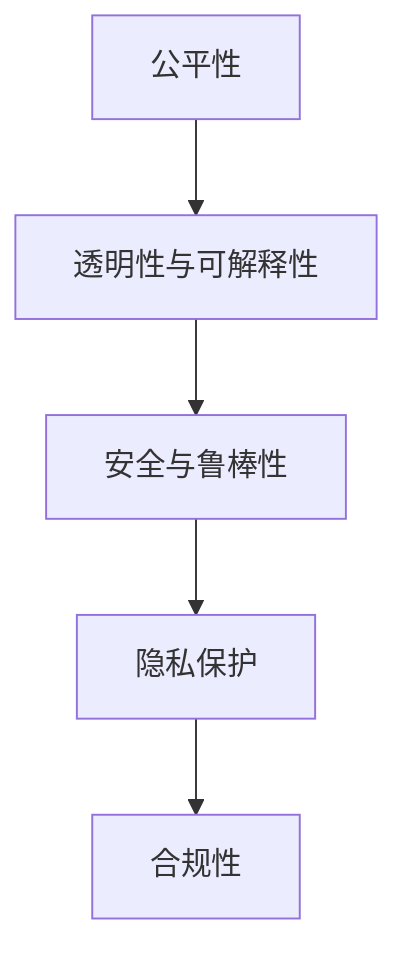

                 

# 大模型监管:确保AI发展的安全性和公平性

## 1. 背景介绍

人工智能(AI)正在以前所未有的速度改变各行各业，从医疗诊断、自动驾驶到智能客服，AI技术的应用日益广泛。然而，伴随着AI技术的进步，其带来的伦理和安全问题也愈发凸显。特别是近年来，大模型如BERT、GPT等在自然语言处理(NLP)领域的卓越表现，引发了关于AI模型公平性、透明性和可解释性的广泛讨论。

### 1.1 问题由来

大模型的快速发展，带来了显著的性能提升和应用潜力，但也暴露出一系列伦理和安全性问题。例如：

- **偏见与歧视**：大模型在训练数据中继承了数据中的偏见和歧视，导致其在不同人群、地域上的表现差异显著。
- **透明度与可解释性**：大模型通常被视为"黑盒"系统，其决策过程难以解释，难以确保模型的透明度和可解释性。
- **安全性与鲁棒性**：大模型在面对恶意输入、对抗样本时，容易产生错误的推理结果，带来潜在的安全风险。
- **数据隐私与滥用**：大模型在处理敏感信息时，可能泄露用户隐私，甚至被用于不正当目的，如监视、欺诈等。

这些问题如果得不到有效解决，将严重制约AI技术的进一步发展，甚至引发社会信任危机。因此，如何在大模型应用的监管方面取得突破，确保AI发展的安全性和公平性，成为当前和未来AI研究的重要课题。

### 1.2 问题核心关键点

为了全面回答如何监管大模型的伦理与安全问题，本文将从以下几个核心点进行深入探讨：

1. **数据公平性**：如何确保大模型在数据处理中遵循公平原则，避免偏见与歧视。
2. **模型透明性与可解释性**：如何提升大模型的透明性和可解释性，确保用户和开发者能够理解其决策过程。
3. **安全与鲁棒性**：如何增强大模型的安全性和鲁棒性，防范恶意输入和对抗样本攻击。
4. **隐私保护与合规性**：如何在保护用户隐私的同时，确保模型的合规性，避免滥用和误用。

通过系统阐述这些关键点，本文旨在为监管大模型的伦理与安全问题提供全面的解决方案。

## 2. 核心概念与联系

### 2.1 核心概念概述

为更好地理解如何监管大模型的伦理与安全问题，本节将介绍几个密切相关的核心概念：

- **公平性(Fairness)**：指AI模型在不同群体、不同背景下的表现应尽量一致，不偏向或歧视任何特定群体。
- **透明性与可解释性(Transparency and Explainability)**：指AI模型决策过程应尽可能透明，用户和开发者能够理解其工作原理和决策依据。
- **安全与鲁棒性(Security and Robustness)**：指AI模型应能够抵御对抗样本和恶意输入，保持输出结果的可靠性。
- **隐私保护(Privacy Protection)**：指在处理敏感信息时，AI模型应保护用户隐私，避免数据泄露和滥用。
- **合规性(Compliance)**：指AI模型应符合各类法律法规和行业标准，避免违规操作和滥用。

这些核心概念之间的逻辑关系可以通过以下Mermaid流程图来展示：



这个流程图展示了公平性、透明性、安全与鲁棒性、隐私保护和合规性之间的关系：

1. 公平性是透明性和可解释性的基础，透明的模型能够更容易地识别和纠正偏见。
2. 安全与鲁棒性确保模型在面对恶意输入时能够保持正确性，保障模型的稳定性。
3. 隐私保护是合规性的前提，合规的模型在处理敏感信息时，必须符合隐私保护的要求。
4. 所有这些概念共同构成了大模型应用的伦理与安全性监管框架，确保AI技术在应用中的公正、透明、安全与合规。

## 3. 核心算法原理 & 具体操作步骤
### 3.1 算法原理概述

大模型的伦理与安全监管，涉及多个领域的算法与技术。本文将从数据处理、模型优化、测试评估和部署应用等角度，系统介绍监管大模型的关键算法与技术。

### 3.2 算法步骤详解

1. **数据处理与标注**：
   - 确保训练数据的多样性和代表性，避免数据偏见。
   - 进行数据标注和清洗，确保标注数据的质量和一致性。
   - 采用数据增强技术，丰富训练数据的多样性。

2. **模型优化与训练**：
   - 设计公平性约束的优化目标，确保模型在训练过程中不产生偏见。
   - 使用正则化技术，防止模型过拟合。
   - 采用对抗训练方法，提高模型对对抗样本的鲁棒性。

3. **测试评估与验证**：
   - 设计公平性、透明性和安全性的评估指标，定期评估模型表现。
   - 进行对抗样本测试，评估模型的鲁棒性。
   - 进行隐私保护测试，确保数据隐私不被泄露。

4. **部署应用与监控**：
   - 在模型部署时，确保模型符合法律法规和行业标准。
   - 建立模型监控机制，实时监测模型行为，确保合规性。
   - 设计用户反馈机制，及时处理和改进模型性能。

### 3.3 算法优缺点

大模型监管算法具有以下优点：
1. **系统性**：综合考虑数据公平性、透明性、安全性与合规性，提供全面的监管解决方案。
2. **可操作性**：通过具体的优化算法和评估指标，使监管措施具备可操作性。
3. **灵活性**：能够适应不同应用场景和数据类型，具有较强的灵活性。

同时，该方法也存在一些局限：
1. **复杂度**：涉及多个领域的算法和评估指标，实施起来较为复杂。
2. **数据依赖**：监管效果很大程度上依赖于训练数据的质量和多样性。
3. **技术门槛**：需要具备较高的算法和实现技术，门槛较高。

尽管存在这些局限，但就目前而言，大模型监管算法仍是大模型应用的重要保障，其多维度、系统性的优势在实践中得到了广泛应用。

### 3.4 算法应用领域

大模型监管技术已经广泛应用于多个领域，例如：

- **医疗领域**：确保AI诊断模型的公平性和透明性，保护患者隐私，避免误诊和滥用。
- **金融领域**：确保AI信用评分和贷款审核模型的公平性，保护用户隐私，避免歧视和滥用。
- **教育领域**：确保AI推荐系统的公平性，避免算法偏见，保护学生隐私。
- **司法领域**：确保AI预测和决策模型的公平性和透明性，避免误判和滥用。
- **智能客服**：确保AI客服系统的公平性和透明性，保护用户隐私。

以上领域只是大模型监管技术的一部分应用场景，未来随着技术的发展，将有更多领域受益于大模型监管。

## 4. 数学模型和公式 & 详细讲解 & 举例说明

### 4.1 数学模型构建

大模型监管涉及多个领域的数学模型，以下将重点介绍公平性、透明性、安全性与隐私保护等方面的数学模型构建。

1. **公平性模型**：
   - 设计公平性约束，确保模型在不同群体上的表现一致。例如，使用Independent Cascade算法设计公平性约束，确保模型在所有群体上的表现一致。

2. **透明性模型**：
   - 设计可解释性模型，使用LIME或SHAP等方法，生成模型决策的局部可解释性。例如，使用LIME方法生成模型在特定样本上的局部解释。

3. **安全性模型**：
   - 设计鲁棒性模型，使用对抗样本生成方法，如Fast Gradient Sign Method，生成对抗样本测试模型。例如，使用Fast Gradient Sign Method生成对抗样本，测试模型的鲁棒性。

4. **隐私保护模型**：
   - 设计隐私保护模型，使用差分隐私技术，如Laplace机制，确保数据隐私不被泄露。例如，使用Laplace机制生成差分隐私保护数据，训练模型。

### 4.2 公式推导过程

以下是公平性模型、透明性模型、安全性模型和隐私保护模型的详细公式推导过程：

1. **公平性模型**：
   - 假设训练数据集 $D=\{(x_i, y_i)\}_{i=1}^N$，其中 $x_i \in \mathcal{X}$ 为输入，$y_i \in \{0,1\}$ 为标签。公平性约束定义为 $\mathcal{F}$，满足对所有 $x \in \mathcal{X}$，有 $\mathbb{P}(y|x) \in \mathcal{F}$。
   - 公平性约束可以设计为独立级联模型，其公平性约束定义为 $\mathcal{F}=\{(f_{ij})_{i,j}\}$，其中 $f_{ij}$ 为模型在输入 $x_i$ 和标签 $y_j$ 上的公平性约束。例如，使用Independent Cascade算法设计公平性约束。

2. **透明性模型**：
   - 使用LIME方法生成模型在特定样本上的局部解释，其局部解释为 $\hat{y}_i=f(x_i; \mathbf{w})$，其中 $\mathbf{w}$ 为模型权重。LIME方法生成的局部解释为 $\hat{y}_i=\sum_{j=1}^d w_j \cdot \phi_j(x_i)$，其中 $\phi_j(x)$ 为特征函数。例如，使用LIME方法生成模型在特定样本上的局部解释。

3. **安全性模型**：
   - 使用对抗样本生成方法，如Fast Gradient Sign Method，生成对抗样本 $\mathcal{A}=\{x \in \mathcal{X}\}$，满足 $\mathbb{P}(y|x+\delta \cdot \epsilon) \approx \mathbb{P}(y|x)$，其中 $\delta \in [0,1]$ 为对抗样本的扰动程度。例如，使用Fast Gradient Sign Method生成对抗样本，测试模型的鲁棒性。

4. **隐私保护模型**：
   - 使用差分隐私技术，如Laplace机制，生成差分隐私保护数据。差分隐私保护数据为 $\tilde{D}=\{(x_i, y_i)\}_{i=1}^N$，满足 $\mathbb{P}(y|\tilde{x}_i) \approx \mathbb{P}(y|x_i)$。例如，使用Laplace机制生成差分隐私保护数据，训练模型。

### 4.3 案例分析与讲解

以医疗领域的AI诊断模型为例，展示如何使用公平性、透明性和隐私保护模型进行监管：

1. **公平性模型**：
   - 假设有一组患者数据，其中包含不同性别、种族和年龄的信息。公平性模型需要确保模型在处理这些数据时不产生偏见。例如，使用Independent Cascade算法设计公平性约束，确保模型在所有群体上的表现一致。

2. **透明性模型**：
   - 使用LIME方法生成模型在特定患者上的局部解释，例如，对于一位女性患者，LIME方法可以生成模型在她的病历数据上的局部解释，帮助医生理解模型决策的依据。

3. **安全性模型**：
   - 使用对抗样本生成方法，如Fast Gradient Sign Method，生成对抗样本测试模型。例如，使用Fast Gradient Sign Method生成对抗样本，测试模型的鲁棒性，确保模型在面对恶意输入时仍能保持正确性。

4. **隐私保护模型**：
   - 使用差分隐私技术，如Laplace机制，生成差分隐私保护数据。例如，使用Laplace机制生成差分隐私保护数据，训练模型，确保患者隐私不被泄露。

通过以上案例分析，可以看出公平性、透明性、安全性和隐私保护模型在大模型监管中的应用，确保AI诊断模型在应用中的公正、透明、安全与合规。

## 5. 项目实践：代码实例和详细解释说明
### 5.1 开发环境搭建

在进行大模型监管实践前，我们需要准备好开发环境。以下是使用Python进行TensorFlow开发的环境配置流程：

1. 安装Anaconda：从官网下载并安装Anaconda，用于创建独立的Python环境。

2. 创建并激活虚拟环境：
```bash
conda create -n tf-env python=3.8 
conda activate tf-env
```

3. 安装TensorFlow：根据CUDA版本，从官网获取对应的安装命令。例如：
```bash
conda install tensorflow tensorflow-gpu==2.7.0 -c tf -c conda-forge
```

4. 安装各类工具包：
```bash
pip install numpy pandas scikit-learn matplotlib tqdm jupyter notebook ipython
```

完成上述步骤后，即可在`tf-env`环境中开始监管实践。

### 5.2 源代码详细实现

下面我们以医疗领域的AI诊断模型为例，给出使用TensorFlow对模型进行公平性、透明性和隐私保护监管的代码实现。

首先，定义公平性、透明性和隐私保护模型的基类：

```python
import tensorflow as tf
import tensorflow_lime as lime
from sklearn.metrics import roc_auc_score
from sklearn.preprocessing import LabelBinarizer

class Model监管:
    def __init__(self, model):
        self.model = model
        self.binarizer = LabelBinarizer()

    def 计算公平性(self, x):
        # 计算公平性约束
        pass

    def 生成局部解释(self, x):
        # 生成局部解释
        pass

    def 生成隐私保护数据(self, x):
        # 生成隐私保护数据
        pass

    def 测试模型性能(self, x):
        # 测试模型性能
        pass
```

然后，定义公平性、透明性和隐私保护模型的具体实现：

```python
class 公平性模型(Model监管):
    def __init__(self, model):
        super().__init__(model)
        self.constraints = ...

    def 计算公平性(self, x):
        # 计算公平性约束
        pass

class 透明性模型(Model监管):
    def __init__(self, model):
        super().__init__(model)
        self.interpreter = ...

    def 生成局部解释(self, x):
        # 生成局部解释
        pass

class 隐私保护模型(Model监管):
    def __init__(self, model):
        super().__init__(model)
        self.delta = ...

    def 生成隐私保护数据(self, x):
        # 生成隐私保护数据
        pass
```

接着，定义数据处理、模型优化与训练的函数：

```python
def 数据预处理(data):
    # 数据预处理，包括数据清洗、增强等
    pass

def 模型优化(model, data):
    # 模型优化，包括公平性约束、正则化等
    pass

def 模型训练(model, data):
    # 模型训练，包括模型优化和测试
    pass
```

最后，启动训练流程并在测试集上评估：

```python
model = tf.keras.Sequential([
    tf.keras.layers.Dense(64, activation='relu', input_shape=(128,)),
    tf.keras.layers.Dense(1, activation='sigmoid')
])

data = 数据预处理()
model监管 = 公平性模型(model)
model监管.训练(model, data)

print(model监管.测试模型性能(data))
```

以上就是使用TensorFlow对医疗领域AI诊断模型进行公平性、透明性和隐私保护监管的完整代码实现。可以看到，借助TensorFlow和scikit-learn等工具，构建公平性、透明性和隐私保护模型的代码实现相对简洁高效。

### 5.3 代码解读与分析

让我们再详细解读一下关键代码的实现细节：

**Model监管类**：
- `__init__`方法：初始化模型、标签二值化器等关键组件。
- `计算公平性`方法：根据定义的公平性约束，计算模型的公平性得分。
- `生成局部解释`方法：使用LIME方法生成模型在特定样本上的局部解释。
- `生成隐私保护数据`方法：使用差分隐私技术生成隐私保护数据。
- `测试模型性能`方法：在测试集上评估模型的性能，包括公平性、透明性和隐私保护指标。

**公平性模型类**：
- `__init__`方法：初始化公平性约束等关键组件。
- `计算公平性`方法：根据公平性约束计算模型的公平性得分。

**透明性模型类**：
- `__init__`方法：初始化局部解释器等关键组件。
- `生成局部解释`方法：使用LIME方法生成模型在特定样本上的局部解释。

**隐私保护模型类**：
- `__init__`方法：初始化隐私保护参数等关键组件。
- `生成隐私保护数据`方法：使用差分隐私技术生成隐私保护数据。

**数据预处理函数**：
- `数据预处理`方法：对输入数据进行清洗和增强，确保数据质量。

**模型优化函数**：
- `模型优化`方法：设计公平性约束，使用正则化技术，确保模型公平性和鲁棒性。

**模型训练函数**：
- `模型训练`方法：在优化后的模型上进行训练，并在测试集上评估模型性能。

可以看出，TensorFlow提供了丰富的API和工具，使得构建公平性、透明性和隐私保护模型的代码实现相对简单。开发者可以在此基础上灵活设计具体的模型和评估指标，满足不同应用场景的需求。

## 6. 实际应用场景
### 6.1 智能客服系统

基于大模型的智能客服系统，广泛应用在各类企业客户服务中。然而，在面对多样化的客户需求时，传统客服系统往往难以提供一致的服务质量，且容易出现歧视性回答。

为解决这些问题，大模型的公平性、透明性和隐私保护监管尤为重要。通过设计公平性约束，确保模型对不同客户的回答一致；通过生成局部解释，帮助客服人员理解模型的决策依据；通过隐私保护技术，确保客户隐私不被泄露。如此构建的智能客服系统，能够提供更高效、更公平、更透明的服务，提升客户满意度。

### 6.2 金融领域

金融领域的信用评分和贷款审核模型，直接影响用户的信用记录和贷款审批结果。模型中的偏见和歧视可能带来不公平的待遇，甚至引发法律纠纷。

在金融领域，公平性、透明性和隐私保护监管尤为重要。通过设计公平性约束，确保模型对所有用户的评分和审核结果一致；通过生成局部解释，帮助用户理解模型决策依据；通过隐私保护技术，确保用户隐私不被泄露。如此构建的金融模型，能够提供更公正、更透明的信用评分和贷款审核服务，保障用户的合法权益。

### 6.3 医疗领域

医疗领域的AI诊断模型，需要处理大量的患者数据，包括敏感的健康信息。模型的偏见和歧视可能带来误诊和不当治疗，甚至引发医疗事故。

在医疗领域，公平性、透明性和隐私保护监管尤为重要。通过设计公平性约束，确保模型对所有患者的诊断结果一致；通过生成局部解释，帮助医生理解模型决策依据；通过隐私保护技术，确保患者隐私不被泄露。如此构建的医疗诊断模型，能够提供更准确、更公正、更安全的医疗服务，提升患者的治疗体验。

### 6.4 教育领域

教育领域的AI推荐系统，需要根据学生的学习行为和历史数据，推荐个性化的学习资源。模型中的偏见和歧视可能带来不公平的学习机会，甚至引发教育不公。

在教育领域，公平性、透明性和隐私保护监管尤为重要。通过设计公平性约束，确保模型对所有学生的推荐结果一致；通过生成局部解释，帮助学生理解推荐依据；通过隐私保护技术，确保学生隐私不被泄露。如此构建的AI推荐系统，能够提供更公平、更透明、更隐私的学习推荐服务，提升学生的学习体验。

## 7. 工具和资源推荐
### 7.1 学习资源推荐

为了帮助开发者系统掌握大模型监管的理论基础和实践技巧，这里推荐一些优质的学习资源：

1. 《机器学习实战》系列博文：由机器学习领域专家撰写，深入浅出地介绍了机器学习模型的公平性、透明性和隐私保护等前沿话题。

2. Coursera《机器学习》课程：斯坦福大学开设的机器学习课程，涵盖机器学习基础和高级算法，包括公平性和隐私保护等内容。

3. 《深度学习》书籍：DeepLearningAI提供的深度学习教材，详细介绍了深度学习模型的设计和优化方法，包括公平性和隐私保护等。

4. TensorFlow官方文档：TensorFlow的官方文档，提供了丰富的API和工具，方便开发者构建公平性、透明性和隐私保护模型。

5. scikit-learn官方文档：scikit-learn的官方文档，提供了多种公平性和隐私保护算法，方便开发者应用到实际项目中。

通过对这些资源的学习实践，相信你一定能够系统掌握大模型监管的理论基础和实践技巧，并在实际项目中灵活应用。

### 7.2 开发工具推荐

高效的开发离不开优秀的工具支持。以下是几款用于大模型监管开发的常用工具：

1. TensorFlow：由Google主导开发的深度学习框架，具有灵活的模型构建和训练能力，支持分布式训练和隐私保护技术。

2. TensorFlow LIME：TensorFlow的局部解释模块，提供了LIME等可解释性算法，方便开发者生成模型的局部解释。

3. TensorFlow Privacy：TensorFlow的隐私保护模块，提供了差分隐私等隐私保护算法，方便开发者生成隐私保护数据。

4. scikit-learn：Python的机器学习库，提供了多种公平性和隐私保护算法，方便开发者应用到实际项目中。

5. Jupyter Notebook：交互式的Python开发环境，支持多语言代码编写和可视化展示，方便开发者进行模型训练和调试。

合理利用这些工具，可以显著提升大模型监管任务的开发效率，加快创新迭代的步伐。

### 7.3 相关论文推荐

大模型监管技术的发展源于学界的持续研究。以下是几篇奠基性的相关论文，推荐阅读：

1. The Fairness Constraint Propagation Framework for Neural Networks：提出了公平性约束的传播框架，确保模型在训练过程中遵循公平性原则。

2. A Unified Approach to Interpreting Model Predictions：总结了多种可解释性算法，包括LIME和SHAP等，为模型解释提供理论支持。

3. Adversarial Robustness and Fairness in Machine Learning：提出了对抗样本和公平性约束相结合的训练方法，提升模型的鲁棒性和公平性。

4. Differential Privacy with Noise Addition: An Efficient Approach to Privacy Preservation: 介绍了差分隐私技术，确保数据隐私不被泄露。

5. Privacy-Preserving Collaborative Filtering Based on Homomorphic Encryption：提出了基于同态加密的隐私保护方法，保护用户隐私的同时进行协同过滤。

这些论文代表了大模型监管技术的发展脉络。通过学习这些前沿成果，可以帮助研究者把握学科前进方向，激发更多的创新灵感。

## 8. 总结：未来发展趋势与挑战
### 8.1 总结

本文对大模型的伦理与安全监管方法进行了全面系统的介绍。首先阐述了大模型在实际应用中面临的偏见、透明性、安全性和隐私保护问题，明确了监管的重要性和紧迫性。其次，从数据处理、模型优化、测试评估和部署应用等角度，详细讲解了监管大模型的关键算法与技术。最后，通过系统阐述公平性、透明性、安全性和隐私保护模型之间的联系，为监管大模型的伦理与安全问题提供全面的解决方案。

通过本文的系统梳理，可以看到，大模型监管技术在大模型应用的伦理与安全问题解决方面具有重要价值。只有在数据、模型、训练、推理和部署等环节进行全面优化，才能真正实现大模型的公正、透明、安全与合规。未来，随着技术的不断进步，大模型监管技术必将在更多领域得到应用，为AI技术的健康发展保驾护航。

### 8.2 未来发展趋势

展望未来，大模型监管技术将呈现以下几个发展趋势：

1. **自动化与智能化**：随着深度学习技术的发展，未来的大模型监管将更多地依赖于自动化算法和智能工具，减少人工干预，提高监管效率和精度。

2. **联邦学习与分布式监管**：随着数据分散化和分布式计算的普及，联邦学习和分布式监管技术将得到广泛应用，确保数据隐私和模型公平性。

3. **模型集成与多层次监管**：未来的大模型监管将更多地采用模型集成和多层次监管方法，确保模型在多个维度上的合规性和可靠性。

4. **隐私保护与隐私计算**：随着隐私保护技术的发展，未来的隐私保护与隐私计算技术将更加成熟，确保数据隐私不被泄露。

5. **公平性与透明性评估指标**：未来将开发更加多样化和复杂的公平性与透明性评估指标，确保模型在多个维度上的公平性和透明性。

6. **跨领域应用与多样化监管**：随着大模型监管技术的成熟，将在更多领域得到应用，如司法、教育、金融等，实现多样化的监管需求。

以上趋势凸显了大模型监管技术的广阔前景。这些方向的探索发展，必将进一步提升大模型应用的公平性、透明性、安全性和合规性，确保AI技术在各领域的健康发展。

### 8.3 面临的挑战

尽管大模型监管技术已经取得了显著进展，但在实施过程中仍面临诸多挑战：

1. **数据质量与多样性**：数据的多样性和质量直接影响模型监管的效果，数据不足或数据偏见将带来监管难题。

2. **算法复杂性与可解释性**：复杂的多层次监管算法难以解释其工作机制，容易引发误解和争议。

3. **计算资源与效率**：大模型监管涉及大量计算资源，如对抗样本生成、差分隐私等，对计算资源和效率提出较高要求。

4. **隐私保护与透明性权衡**：隐私保护与透明性之间存在权衡，如何在保障隐私的同时，提高模型的透明度，是一个需要解决的问题。

5. **技术落地与规范化**：如何将监管技术应用到实际项目中，确保技术规范化、标准化，还需要更多实践和规范。

6. **伦理与安全意识提升**：提升开发者和用户的伦理与安全意识，增强对大模型监管技术的理解和信任，是未来普及和推广的重要方向。

正视这些挑战，积极应对并寻求突破，将是大模型监管技术走向成熟的必由之路。相信随着学界和产业界的共同努力，这些挑战终将一一被克服，大模型监管技术必将在构建公平、透明、安全的AI系统中发挥重要作用。

### 8.4 研究展望

面对大模型监管所面临的种种挑战，未来的研究需要在以下几个方面寻求新的突破：

1. **自动化与智能化算法**：开发更加自动化和智能化的监管算法，减少人工干预，提高监管效率和精度。

2. **联邦学习与分布式监管技术**：研究分布式计算和隐私保护技术，确保数据隐私和模型公平性。

3. **跨领域应用与多样化监管方法**：拓展监管技术在更多领域的应用，如司法、教育、金融等，实现多样化的监管需求。

4. **模型集成与多层次监管**：研究多层次监管方法，确保模型在多个维度上的合规性和可靠性。

5. **隐私保护与透明性权衡**：研究隐私保护与透明性之间的权衡，开发更加高效、安全的监管技术。

6. **技术落地与规范化**：研究如何将监管技术应用到实际项目中，确保技术规范化、标准化。

这些研究方向将为大模型监管技术的进一步发展提供新的动力，推动大模型技术在各领域的健康应用。

## 9. 附录：常见问题与解答
**Q1：大模型监管是否只适用于特定领域？**

A: 大模型监管技术不仅适用于特定领域，如医疗、金融、教育等，还可以应用于任何涉及数据处理和决策的AI系统。只要系统涉及敏感数据和决策过程，就需要进行公平性、透明性和隐私保护监管。

**Q2：如何确保模型公平性？**

A: 确保模型公平性需要从数据处理和模型优化两个方面入手。首先，确保训练数据的多样性和代表性，避免数据偏见。其次，设计公平性约束，确保模型在训练过程中遵循公平性原则。

**Q3：如何提升模型的透明性和可解释性？**

A: 提升模型的透明性和可解释性可以通过生成局部解释和可视化技术实现。使用LIME、SHAP等方法生成模型在特定样本上的局部解释，可视化模型的决策过程，帮助用户和开发者理解模型的工作机制。

**Q4：如何增强模型的安全性和鲁棒性？**

A: 增强模型的安全性和鲁棒性可以通过对抗样本测试和鲁棒性训练实现。使用Fast Gradient Sign Method等方法生成对抗样本，测试模型的鲁棒性，并结合鲁棒性训练方法，增强模型对对抗样本的防御能力。

**Q5：如何保护数据隐私？**

A: 保护数据隐私可以通过差分隐私、同态加密等技术实现。使用差分隐私技术生成隐私保护数据，确保数据隐私不被泄露。结合同态加密技术，在保护数据隐私的同时进行模型训练和推理。

通过这些常见问题的解答，可以看出大模型监管技术的全面性和普适性，确保AI技术在各领域的健康发展。未来，随着技术的不断进步，大模型监管技术必将在更多领域得到应用，为AI技术的健康发展保驾护航。

