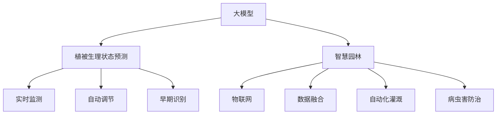

                 

## 1. 背景介绍

### 1.1 问题由来
随着城市化的推进，园林绿化成为提升城市品质、改善生态环境的重要手段。传统园林管理依靠人工巡查和经验积累，耗时耗力，且存在一定的主观性和随机性，难以实现精细化的养护管理。在智慧城市建设的背景下，如何利用现代信息技术对园林植被进行智能化监测和养护，提升园林管理效率和质量，成为亟待解决的问题。

### 1.2 问题核心关键点
智慧园林的核心在于利用先进的信息技术手段，对园林植被的生理状态、环境条件、病虫害防治等进行全面、实时、精细的监测和分析，实现智能化养护与管理。大模型技术可以通过对大量观测数据的分析和训练，建立精确的植被生理状态预测模型，辅助园林工作者进行科学决策。

## 2. 核心概念与联系

### 2.1 核心概念概述

- 大模型（Large Model）：指在自然语言处理（NLP）、计算机视觉（CV）等领域，通过大规模数据训练出的深度学习模型，具备强大的特征提取和决策能力。
- 植被生理状态预测（Plant Physiological State Prediction）：基于观测数据和历史模型，预测植被的生长状态、病虫害发生概率、水分需求等。
- 智慧园林（Smart Garden）：通过物联网、大数据、人工智能等技术手段，实现对园林植被的智能监测、分析和养护。
- 物联网（IoT）：利用传感器、通信网络等技术，实现对园林环境、设备等的实时监测和数据采集。
- 数据融合（Data Fusion）：将多种数据源（如气象、土壤、植物传感器等）的数据进行整合、分析和应用，提高决策的准确性和及时性。
- 自动化灌溉（Automatic Irrigation）：通过智能控制系统，自动调节灌溉系统，确保植被的水分需求得到及时满足。
- 病虫害防治（Pest and Disease Control）：利用图像识别、分类等技术手段，对病虫害进行早期识别和精准施药。

这些核心概念之间的逻辑关系可以通过以下Mermaid流程图来展示：



这个流程图展示了大模型、智慧园林等概念之间的关系：

1. 大模型通过训练获得精确的植被生理状态预测模型。
2. 智慧园林依赖于物联网、数据融合等技术，实现对植被的实时监测和分析。
3. 自动化灌溉和病虫害防治系统通过大模型提供的决策支持，进行精准调节和管理。

## 3. 核心算法原理 & 具体操作步骤
### 3.1 算法原理概述

基于大模型的智慧园林植被养护与管理，核心算法主要分为以下几个步骤：

1. **数据采集与预处理**：利用物联网设备收集植被生长环境的各项指标（如土壤湿度、气温、光照等），并对数据进行清洗、归一化等预处理。
2. **植被生理状态预测模型训练**：通过大量历史观测数据，训练大模型进行植被生理状态的预测，如生长状态、水分需求、病虫害发生概率等。
3. **实时监测与数据分析**：将实时采集的数据输入大模型，得到植被的生理状态预测结果，结合天气预报等外部信息，进行综合分析。
4. **自动化灌溉与病虫害防治**：根据大模型输出的结果，自动调节灌溉系统和施药策略，确保植被得到最佳养护。

### 3.2 算法步骤详解

#### 3.2.1 数据采集与预处理

首先，需要部署物联网传感器设备，对园林植被的各项环境指标进行实时监测。常用的传感器包括土壤湿度传感器、气温传感器、光照传感器等。这些设备通过无线网络或有线网络与集中数据采集器（Data Acquisition Unit, DAU）连接，将采集到的数据上传到云端平台。

数据采集后，需要对数据进行预处理。预处理过程包括数据清洗（去除异常值、填补缺失值）、归一化（将数据映射到标准范围）、特征工程（提取对植被生长有重要影响的特征）等步骤。预处理后的数据将成为后续训练大模型的基础。

#### 3.2.2 植被生理状态预测模型训练

训练大模型的关键在于选择合适的模型架构和损失函数，以及大量的历史观测数据。

**模型选择**：常用的植被生理状态预测模型包括随机森林、梯度提升树、神经网络等。其中，神经网络模型（如卷积神经网络CNN、循环神经网络RNN、Transformer等）在处理时间序列数据方面具有优势。

**数据准备**：收集大量历史观测数据，包含植被生长状态、气象条件、土壤湿度、病虫害发生情况等。将数据分为训练集、验证集和测试集，每个数据点包含多个特征（如土壤湿度、气温、光照等）和一个标签（如生长状态、病虫害发生概率等）。

**模型训练**：使用深度学习框架（如TensorFlow、PyTorch等）搭建神经网络模型，选择合适的优化器（如Adam、SGD等）和损失函数（如交叉熵、均方误差等），利用训练集进行模型训练。在训练过程中，根据验证集的表现调整模型超参数，如学习率、批大小、迭代次数等。最终，使用测试集对训练好的模型进行评估，确保模型泛化性能良好。

#### 3.2.3 实时监测与数据分析

在模型训练完成后，将其部署到云端或边缘计算设备上，接收实时采集的数据，并输入模型进行预测。

**数据流图**：实时监测与数据分析的过程可以抽象为一个数据流图，如图1所示。


在这个数据流图中，传感器采集的数据经过DAU上传到云端或边缘设备，输入大模型进行预测，得到植被的生理状态预测结果。决策模块根据预测结果，决定是否需要启动自动化灌溉或施药系统。

**数据流图解释**：
1. 实时数据：通过传感器设备采集的实时数据。
2. DAU：数据采集单元，将传感器数据上传到云端或边缘设备。
3. 云端/边缘设备：部署大模型的计算设备，接收数据并运行模型。
4. 大模型：训练好的植被生理状态预测模型，接收实时数据并输出预测结果。
5. 决策：根据预测结果，决定是否启动自动化灌溉或施药系统。
6. 执行：自动化灌溉或施药系统的执行模块，根据决策结果进行具体操作。

#### 3.2.4 自动化灌溉与病虫害防治

自动化灌溉与病虫害防治系统是基于大模型的决策执行模块。

**自动化灌溉**：根据大模型的预测结果，自动调节灌溉系统的供水时间和水量。当大模型预测到植被的水分需求较高时，系统自动开启灌溉设备，提供适量的水分。

**病虫害防治**：利用图像识别技术，对病虫害进行早期识别和分类。将病虫害图片输入大模型，得到病虫害的识别结果。根据识别结果，启动相应的施药系统，进行精准施药。

### 3.3 算法优缺点

#### 3.3.1 优点

1. **高精度预测**：通过大模型的训练，可以建立精确的植被生理状态预测模型，提高预测的准确性和及时性。
2. **实时监测与响应**：利用物联网和大模型，实现对植被的实时监测与数据分析，及时发现和解决问题。
3. **自动化管理**：通过自动化灌溉和病虫害防治系统，减少人工干预，提升管理效率。
4. **跨领域融合**：结合气象预报、土壤检测等多领域数据，提高决策的全面性和准确性。

#### 3.3.2 缺点

1. **数据依赖**：大模型依赖于大量的历史观测数据，数据收集和标注工作量大。
2. **模型复杂度**：大模型结构复杂，训练和推理资源消耗大。
3. **实时性要求高**：对数据传输和处理速度要求较高，需要优化网络传输和计算性能。
4. **模型更新频率低**：模型一旦训练完成，更新频率较低，需要定期重新训练以应对数据分布变化。

### 3.4 算法应用领域

基于大模型的智慧园林植被养护与管理技术，已经在多个领域得到应用，包括：

1. **智慧农业**：通过大模型预测农作物生长状态，实现自动化灌溉、施肥等管理。
2. **城市绿化**：监测城市绿地的植被状态，优化绿化方案，提升城市生态环境。
3. **公园管理**：对公园植被进行实时监测，优化养护策略，提升游览体验。
4. **生态保护**：对森林植被进行监测，预警病虫害和森林火灾风险，保护生态环境。
5. **景观设计**：通过大模型预测植被生长状态，辅助景观设计，提升设计效果。

这些应用场景展示了大模型技术在智慧园林中的广泛适用性，为智慧园林的建设提供了技术支持和实践指导。

## 4. 数学模型和公式 & 详细讲解 & 举例说明

### 4.1 数学模型构建

假设一个简单的神经网络模型用于植被生理状态预测，其输入为多个特征 $x=[x_1,x_2,...,x_n]$，输出为植被生长状态 $y$。模型参数为 $\theta$，损失函数为均方误差（Mean Squared Error, MSE）。

**模型形式**：
$$
y = f(x; \theta) = W \cdot x + b
$$
其中 $W$ 为权重矩阵，$b$ 为偏置项。

**损失函数**：
$$
L(y,\hat{y}) = \frac{1}{N} \sum_{i=1}^N (y_i - \hat{y}_i)^2
$$
其中 $y_i$ 为真实标签，$\hat{y}_i$ 为模型预测结果。

### 4.2 公式推导过程

1. **前向传播**：将输入 $x$ 通过模型 $f$ 进行前向传播，得到预测结果 $\hat{y}$。
2. **损失计算**：计算预测结果 $\hat{y}$ 与真实标签 $y$ 的损失 $L(y,\hat{y})$。
3. **反向传播**：利用链式法则，计算损失 $L(y,\hat{y})$ 对模型参数 $\theta$ 的梯度，用于更新模型参数。

### 4.3 案例分析与讲解

假设有一个简单的神经网络模型，用于预测植被生长状态，其模型参数 $\theta$ 包含权重矩阵 $W$ 和偏置项 $b$。模型接收两个特征 $x_1$ 和 $x_2$，输出植被生长状态 $y$。

**训练过程**：
1. 数据集包含 $N$ 个样本，每个样本包含特征 $x=[x_1,x_2]$ 和标签 $y$。
2. 将数据集分为训练集、验证集和测试集。
3. 利用训练集对模型进行训练，优化损失函数 $L(y,\hat{y})$。
4. 在验证集上评估模型性能，调整超参数（如学习率、批大小等）。
5. 在测试集上测试模型，评估泛化性能。

**预测过程**：
1. 输入一个新的特征向量 $x=[x_1,x_2]$。
2. 利用模型 $f(x; \theta)$ 进行前向传播，得到预测结果 $\hat{y}$。
3. 根据预测结果，进行自动化灌溉或病虫害防治操作。

## 5. 项目实践：代码实例和详细解释说明

### 5.1 开发环境搭建

首先，需要安装必要的Python环境，包括TensorFlow、PyTorch等深度学习框架，以及相关的库和工具。

1. 安装Anaconda：从官网下载并安装Anaconda，用于创建独立的Python环境。
2. 创建并激活虚拟环境：
```bash
conda create -n pytorch-env python=3.8 
conda activate pytorch-env
```
3. 安装所需的深度学习框架和库：
```bash
pip install tensorflow pytorch torchvision torchaudio scikit-learn pandas numpy matplotlib tqdm
```

### 5.2 源代码详细实现

以下是一个简单的Python代码实现，用于训练一个简单的神经网络模型进行植被生理状态预测。

```python
import tensorflow as tf
import numpy as np
from sklearn.model_selection import train_test_split
from sklearn.preprocessing import StandardScaler

# 准备数据
X = np.random.rand(100, 2)  # 100个样本，每个样本有两个特征
y = np.random.randint(0, 2, 100)  # 随机生成二分类标签

# 数据预处理
scaler = StandardScaler()
X = scaler.fit_transform(X)
X_train, X_test, y_train, y_test = train_test_split(X, y, test_size=0.2)

# 定义模型
model = tf.keras.Sequential([
    tf.keras.layers.Dense(10, activation='relu'),
    tf.keras.layers.Dense(1, activation='sigmoid')
])

# 定义损失函数和优化器
loss_fn = tf.keras.losses.BinaryCrossentropy()
optimizer = tf.keras.optimizers.Adam()

# 训练模型
model.compile(optimizer=optimizer, loss=loss_fn, metrics=['accuracy'])
model.fit(X_train, y_train, epochs=10, batch_size=32)

# 评估模型
loss, accuracy = model.evaluate(X_test, y_test)
print(f'Test accuracy: {accuracy:.2f}')
```

### 5.3 代码解读与分析

1. **数据准备**：使用numpy生成100个随机样本，每个样本有两个特征，随机生成二分类标签。
2. **数据预处理**：使用sklearn的StandardScaler对特征进行标准化处理，并将数据分为训练集和测试集。
3. **模型定义**：定义一个简单的神经网络模型，包含一个ReLU激活的隐藏层和一个sigmoid激活的输出层。
4. **损失函数和优化器**：使用二分类交叉熵作为损失函数，Adam作为优化器。
5. **模型训练**：使用训练集进行模型训练，设置迭代次数和批大小。
6. **模型评估**：在测试集上评估模型性能，输出测试集准确率。

## 6. 实际应用场景

### 6.1 智能灌溉系统

智能灌溉系统基于大模型对植被水分需求进行实时监测与预测。系统通过土壤湿度传感器、气温传感器等设备，采集植被生长环境的各项指标。将采集到的数据输入大模型，得到植被的水分需求预测结果。根据预测结果，系统自动调节灌溉系统的供水时间和水量，确保植被得到最佳养护。

### 6.2 病虫害防治系统

病虫害防治系统利用图像识别技术，对病虫害进行早期识别和分类。将病虫害图片输入大模型，得到病虫害的识别结果。根据识别结果，系统启动相应的施药系统，进行精准施药。大模型在病虫害防治中的应用，可以减少人工干预，提高防治效率和准确性。

### 6.3 智能景观设计

智能景观设计通过大模型预测植被生长状态，辅助景观设计。系统将不同生长阶段的植被图像输入大模型，得到植被生长状态的预测结果。根据预测结果，设计师可以调整植被布局和养护方案，提升景观设计的效果。

### 6.4 未来应用展望

随着技术的发展，基于大模型的智慧园林植被养护与管理将具有更加广阔的应用前景。未来，可能的应用场景包括：

1. **智能城市绿化**：监测城市绿地的植被状态，优化绿化方案，提升城市生态环境。
2. **生态保护**：对森林植被进行监测，预警病虫害和森林火灾风险，保护生态环境。
3. **智能农业**：通过大模型预测农作物生长状态，实现自动化灌溉、施肥等管理。
4. **智慧公园**：对公园植被进行实时监测，优化养护策略，提升游览体验。
5. **智能果园**：监测果树的生长状态，优化灌溉和施肥策略，提高水果产量和质量。

## 7. 工具和资源推荐

### 7.1 学习资源推荐

为了帮助开发者系统掌握大模型在智慧园林中的应用，这里推荐一些优质的学习资源：

1. TensorFlow官方文档：提供全面的TensorFlow框架教程和实践指南，涵盖数据处理、模型训练、模型部署等方面。
2. PyTorch官方文档：提供PyTorch框架的详细教程和API参考，涵盖深度学习模型的构建、训练、推理等方面。
3. GitHub上的大模型开源项目：通过搜索相关项目，了解大模型在智慧园林中的应用案例和实现细节。
4. Udacity《深度学习实战》课程：由知名专家授课，涵盖深度学习在智慧园林中的应用实践。
5. Coursera《深度学习在智慧园林中的应用》课程：提供系统的深度学习理论知识和实践技能培训。

### 7.2 开发工具推荐

大模型在智慧园林中的应用，需要依赖各种深度学习框架和工具，以下是几款常用的开发工具：

1. TensorFlow：由Google主导开发的深度学习框架，支持分布式计算和大规模模型训练。
2. PyTorch：由Facebook主导开发的深度学习框架，灵活性强，适合研究和原型开发。
3. Keras：一个高层次的深度学习框架，提供简单易用的API，适合快速原型开发和模型部署。
4. Jupyter Notebook：一个交互式编程环境，支持多种编程语言和数据可视化，适合快速迭代开发和展示成果。
5. GitHub：一个代码托管平台，支持版本控制和协作开发，方便分享和交流代码。

### 7.3 相关论文推荐

大模型在智慧园林中的应用，得益于深度学习技术的发展和实践经验的积累。以下是几篇奠基性的相关论文，推荐阅读：

1. "Plant Growth Prediction Using Deep Learning"：探讨深度学习在预测植物生长状态中的应用。
2. "Automatic Irrigation System for Urban Gardens"：介绍基于深度学习的城市园林智能灌溉系统。
3. "Image-based Pest and Disease Identification Using Convolutional Neural Networks"：研究利用卷积神经网络进行病虫害识别的技术。
4. "Real-time Monitoring and Control of Garden Environment"：介绍基于物联网和深度学习技术的智能园林管理系统。
5. "Smart Garden Management with Machine Learning"：探讨机器学习在智能园林管理中的应用。

## 8. 总结：未来发展趋势与挑战

### 8.1 总结

本文对基于大模型的智慧园林植被养护与管理进行了全面系统的介绍。首先阐述了智慧园林的核心概念和应用背景，明确了大模型在智慧园林中的重要作用。其次，从原理到实践，详细讲解了基于大模型的智慧园林植被养护与管理技术的算法原理和具体操作步骤，给出了具体的代码实现。同时，本文还广泛探讨了智能灌溉、病虫害防治、智能景观设计等实际应用场景，展示了该技术的广泛适用性。最后，本文精选了学习资源、开发工具和相关论文，力求为读者提供全方位的技术指引。

通过本文的系统梳理，可以看到，基于大模型的智慧园林植被养护与管理技术正在成为智能园林建设的重要手段，极大地提升了园林管理效率和质量，为智慧园林的发展提供了有力的技术支持。未来，伴随技术的不断演进和应用场景的不断拓展，基于大模型的智慧园林技术将展现出更加广阔的应用前景，为智慧园林建设注入新的活力。

### 8.2 未来发展趋势

展望未来，基于大模型的智慧园林技术将呈现以下几个发展趋势：

1. **多模态融合**：结合物联网、气象、土壤等多模态数据，提高预测的全面性和准确性。
2. **实时监测与动态调整**：利用实时数据和动态调整策略，实现对植被的精准养护管理。
3. **自适应学习**：引入自适应学习算法，使大模型能够根据环境变化进行自我优化。
4. **跨领域应用**：将智慧园林技术应用于更多领域，如智慧农业、城市绿化等，实现跨领域融合。
5. **边缘计算与本地部署**：利用边缘计算技术，实现本地数据处理和模型部署，降低数据传输成本。
6. **人机协作**：结合人工干预和自动化系统，实现人机协作，提升管理效果。

### 8.3 面临的挑战

尽管基于大模型的智慧园林技术已经取得了显著成果，但在应用推广过程中，仍面临诸多挑战：

1. **数据获取难度大**：获取高质量、全面、时效性的植被数据具有较大难度，数据收集和标注工作量大。
2. **模型复杂度高**：大模型结构复杂，训练和推理资源消耗大，需要高效优化技术支持。
3. **实时性要求高**：对数据传输和处理速度要求较高，需要优化网络传输和计算性能。
4. **模型更新频率低**：模型一旦训练完成，更新频率较低，需要定期重新训练以应对数据分布变化。
5. **安全性与隐私保护**：智能系统需要考虑数据隐私和安全问题，确保数据安全可靠。

### 8.4 研究展望

未来的研究需要在以下几个方面寻求新的突破：

1. **数据增强与数据生成**：通过数据增强和生成对抗网络（GAN）等技术，提升数据质量和数量，减少数据采集成本。
2. **高效优化与分布式训练**：引入高效的优化算法和分布式训练技术，提高模型训练和推理效率。
3. **边缘计算与本地部署**：结合边缘计算技术，实现本地数据处理和模型部署，降低数据传输成本，提高实时性。
4. **跨领域应用**：将智慧园林技术应用于更多领域，如智慧农业、城市绿化等，实现跨领域融合。
5. **人机协作与智能决策**：结合人工干预和自动化系统，实现人机协作，提升管理效果，同时引入智能决策算法，提高管理智能化水平。

总之，基于大模型的智慧园林技术具有广阔的应用前景，但也面临着数据、模型、实时性等多方面的挑战。未来需要在技术创新和应用实践两个方面不断探索和突破，才能真正实现智慧园林的智能化、自动化、精细化管理。

## 9. 附录：常见问题与解答

**Q1: 大模型在智慧园林中的应用有哪些？**

A: 大模型在智慧园林中的应用包括：
1. 植被生理状态预测：通过大模型预测植被的生长状态、水分需求、病虫害发生概率等。
2. 智能灌溉系统：利用大模型对植被的水分需求进行实时监测与预测，自动调节灌溉系统。
3. 病虫害防治系统：利用图像识别技术，对病虫害进行早期识别和分类，进行精准施药。
4. 智能景观设计：通过大模型预测植被生长状态，辅助景观设计。

**Q2: 如何获取高质量的植被数据？**

A: 获取高质量的植被数据，可以采取以下措施：
1. 部署传感器设备：在园林中安装土壤湿度传感器、气温传感器、光照传感器等，实时监测植被生长环境的各项指标。
2. 数据预处理：对采集到的数据进行清洗、归一化、特征提取等预处理，确保数据质量和一致性。
3. 数据增强与生成：通过数据增强和生成对抗网络（GAN）等技术，提升数据质量和数量，减少数据采集成本。

**Q3: 如何提高大模型的实时性？**

A: 提高大模型的实时性，可以采取以下措施：
1. 优化网络传输：使用高带宽的网络传输技术，减少数据传输延迟。
2. 本地数据处理：利用边缘计算技术，实现本地数据处理和模型部署，降低数据传输成本，提高实时性。
3. 高效优化算法：引入高效的优化算法和分布式训练技术，提高模型训练和推理效率。

**Q4: 如何确保大模型的安全性与隐私保护？**

A: 确保大模型的安全性与隐私保护，可以采取以下措施：
1. 数据加密：对数据进行加密存储和传输，确保数据安全。
2. 访问控制：通过身份认证和权限管理，控制对数据的访问权限。
3. 数据匿名化：对数据进行匿名化处理，保护数据隐私。
4. 安全审计：定期进行安全审计，发现和修复潜在的安全漏洞。

这些措施可以有效提高大模型的安全性与隐私保护，确保数据安全可靠，避免安全事故的发生。

---

作者：禅与计算机程序设计艺术 / Zen and the Art of Computer Programming

