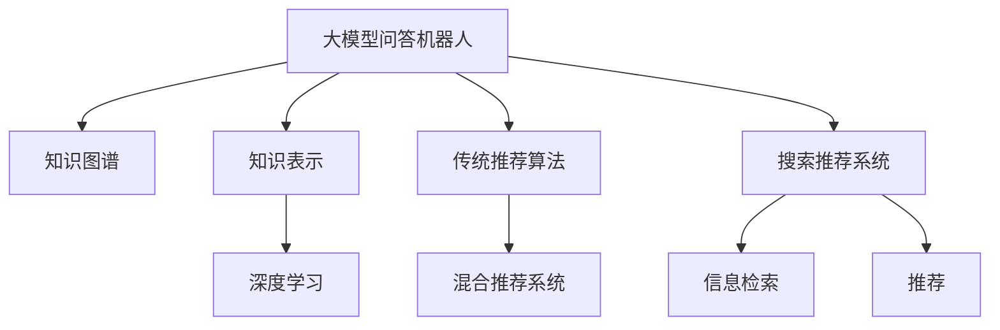

                 

# 大模型问答机器人与传统搜索推荐的知识表示

> 关键词：大模型问答机器人,知识图谱,知识表示,搜索推荐,传统推荐算法

## 1. 背景介绍

### 1.1 问题由来

在当前的信息爆炸时代，互联网用户需要快速、准确地获取所需信息，而搜索引擎和推荐系统成为了他们获取信息的两个主要渠道。然而，传统推荐算法往往基于用户的历史行为和兴趣进行推荐，难以满足用户对信息深度和多样性的需求。与此同时，随着深度学习技术的不断成熟，大语言模型在自然语言理解和生成方面取得了显著的进展，逐步应用于问答、对话等NLP任务中。这些大模型具有强大的语义理解能力，可以在海量的文本数据中提取关键信息，并提供更加精准和个性化的信息服务。因此，将大模型应用于问答和推荐系统中，成为当前技术发展的重要方向之一。

### 1.2 问题核心关键点

本文聚焦于基于大模型的问答和推荐系统，具体包括：

- 大模型在问答和推荐系统中的应用：如何利用大模型的语义理解能力，构建高效的问答和推荐系统。
- 知识图谱与大模型的结合：如何利用知识图谱中的结构化知识，提升大模型在特定领域的信息检索和推荐能力。
- 知识表示的算法与方法：如何设计合适的知识表示方法，高效地在大模型中嵌入知识图谱，以实现更精准的信息检索和推荐。
- 与传统推荐算法的对比：大模型与传统推荐算法在性能和效率上的优劣，以及如何融合两者的优势。

通过回答这些问题，本文将对大模型问答和推荐系统的知识表示技术进行全面的梳理和分析。

## 2. 核心概念与联系

### 2.1 核心概念概述

本节将介绍几个与大模型问答和推荐系统相关的核心概念：

- **大模型问答机器人**：基于深度学习模型，具有强大的语义理解能力，能够自动回答用户的查询，并提供相关信息。
- **知识图谱**：由节点和边构成的结构化知识表示，用于描述实体之间的关系和属性。
- **知识表示**：将知识图谱中的信息嵌入到模型中，使得模型能够理解和利用结构化知识，提升推荐和检索的精度和泛化能力。
- **搜索推荐系统**：包括传统推荐算法和基于深度学习模型的推荐系统，旨在提高信息检索和推荐的效率和准确性。
- **传统推荐算法**：基于用户行为数据和特征进行推荐，如协同过滤、基于内容的推荐等。
- **混合推荐系统**：结合传统推荐算法和大模型的优点，通过混合模型的策略提升推荐效果。

这些核心概念之间的逻辑关系可以通过以下Mermaid流程图来展示：



这个流程图展示了大模型问答和推荐系统的核心概念及其之间的关系：

1. 大模型问答机器人通过深度学习模型进行语义理解，可以与知识图谱中的信息进行交互。
2. 知识表示是将知识图谱中的信息嵌入到模型中，提升大模型的知识利用能力。
3. 深度学习模型结合传统推荐算法，形成了混合推荐系统，融合两者的优势。
4. 搜索推荐系统包括信息检索和推荐两个部分，通过大模型和知识图谱的辅助，实现精准的信息获取和推荐。

## 3. 核心算法原理 & 具体操作步骤
### 3.1 算法原理概述

基于大模型的问答和推荐系统，主要利用深度学习模型进行语义理解，并通过知识图谱中的结构化知识提升模型的精度和泛化能力。其核心思想是：将知识图谱中的信息嵌入到深度学习模型中，使模型能够自动地从结构化知识中提取信息，并生成相关的推荐和检索结果。

形式化地，假设知识图谱为 $G=(V,E)$，其中 $V$ 为节点集，$E$ 为边集。假设大模型为 $M_{\theta}$，其中 $\theta$ 为模型参数。知识表示方法为 $R$，将知识图谱中的信息转化为模型的输入特征。则知识嵌入过程可以表示为：

$$
\mathcal{R}(G) = R(G) \rightarrow M_{\theta}
$$

其中，$R(G)$ 表示将知识图谱 $G$ 转化为模型的输入特征。知识嵌入后的模型输出可以表示为：

$$
\mathcal{O}_{\theta} = M_{\theta}(\mathcal{R}(G))
$$

在问答任务中，模型的输出即为针对用户查询的回答；在推荐任务中，模型的输出则是对应实体或属性的推荐结果。

### 3.2 算法步骤详解

基于大模型的问答和推荐系统，主要包括以下几个关键步骤：

**Step 1: 构建知识图谱**
- 收集领域相关的结构化数据，如商品、用户、文章等。
- 利用自然语言处理技术对数据进行清洗、抽取和实体链接，构建知识图谱。

**Step 2: 设计知识表示方法**
- 选择合适的知识表示方法，如TransE、DistMult等，将知识图谱中的信息转化为模型的输入特征。
- 通过超参数调优，确定知识表示方法的参数。

**Step 3: 训练深度学习模型**
- 选择合适的深度学习模型，如BERT、GPT等，并在有标签的训练数据上进行预训练。
- 在预训练的基础上，使用知识表示方法对知识图谱进行嵌入，生成模型输入特征。
- 使用微调技术，优化模型的参数，使其能够高效地利用知识图谱中的信息。

**Step 4: 应用到问答或推荐任务**
- 对于问答任务，使用训练好的模型对用户查询进行语义理解，并从知识图谱中检索相关信息，生成回答。
- 对于推荐任务，使用模型对用户和物品进行匹配，生成推荐结果。

**Step 5: 部署与优化**
- 将训练好的模型部署到实际应用中，并进行性能评估和优化。
- 根据实际应用场景，对模型进行进一步的微调和调整。

### 3.3 算法优缺点

基于大模型的问答和推荐系统具有以下优点：
1. 精度高：大模型具有强大的语义理解能力，能够从结构化知识中提取关键信息，提升推荐和检索的精度。
2. 泛化能力强：大模型能够利用大量的语料进行预训练，具有较强的泛化能力，可以适用于多种领域和任务。
3. 自适应性强：大模型能够根据新数据进行微调，适应数据分布的变化。

然而，该方法也存在一定的局限性：
1. 资源消耗大：大模型需要大量的计算资源进行训练和推理，对硬件设备要求较高。
2. 知识表示复杂：选择合适的知识表示方法需要丰富的领域知识和经验，不同领域的知识表示方法可能存在差异。
3. 数据依赖性强：大模型的性能很大程度上依赖于训练数据的质量和数量，获取高质量标注数据的成本较高。
4. 解释性不足：大模型的决策过程缺乏可解释性，难以对其推理逻辑进行分析和调试。

尽管存在这些局限性，但就目前而言，基于大模型的问答和推荐系统仍是大数据时代信息检索和推荐的重要手段。未来相关研究的重点在于如何进一步降低对标注数据的依赖，提高知识表示的简单性和泛化能力，同时兼顾可解释性和伦理安全性等因素。

### 3.4 算法应用领域

基于大模型的问答和推荐系统已经在多个领域得到了应用，包括但不限于：

- 电商推荐：利用用户行为数据和商品信息，构建知识图谱，为电商网站提供个性化的推荐服务。
- 新闻推荐：收集新闻文章和相关实体信息，构建知识图谱，为用户提供精准的新闻推荐。
- 金融推荐：收集金融产品和服务信息，构建知识图谱，为金融客户推荐合适的金融产品。
- 医疗推荐：收集医疗设备和药品信息，构建知识图谱，为患者推荐合适的治疗方案。
- 旅游推荐：收集旅游目的地和景点信息，构建知识图谱，为用户提供个性化的旅游推荐。

除了上述这些经典应用外，大模型的问答和推荐系统还被创新性地应用到更多场景中，如音乐推荐、美食推荐、影视推荐等，为不同领域的信息服务提供了新的解决方案。随着预训练模型和知识表示方法的不断进步，相信大模型的问答和推荐系统将在更广阔的应用领域大放异彩。

## 4. 数学模型和公式 & 详细讲解 & 举例说明
### 4.1 数学模型构建

本节将使用数学语言对大模型问答和推荐系统的知识表示方法进行更加严格的刻画。

假设知识图谱为 $G=(V,E)$，其中 $V$ 为节点集，$E$ 为边集。假设大模型为 $M_{\theta}$，其中 $\theta$ 为模型参数。知识表示方法为 $R$，将知识图谱中的信息转化为模型的输入特征。则知识嵌入过程可以表示为：

$$
\mathcal{R}(G) = R(G) \rightarrow M_{\theta}
$$

其中，$R(G)$ 表示将知识图谱 $G$ 转化为模型的输入特征。知识嵌入后的模型输出可以表示为：

$$
\mathcal{O}_{\theta} = M_{\theta}(\mathcal{R}(G))
$$

在推荐任务中，假设用户 $u$ 和物品 $i$ 的特征分别为 $\mathbf{u}$ 和 $\mathbf{i}$，则推荐模型可以表示为：

$$
\hat{y}_{ui} = \sigma(\mathbf{u} \cdot \mathbf{i} + b)
$$

其中 $\sigma$ 为激活函数，$b$ 为偏置项。$\hat{y}_{ui}$ 表示物品 $i$ 对于用户 $u$ 的推荐评分。

### 4.2 公式推导过程

以下我们以推荐任务为例，推导深度学习模型与知识图谱结合的推荐公式及其梯度计算。

假设用户 $u$ 和物品 $i$ 的特征分别为 $\mathbf{u}$ 和 $\mathbf{i}$，推荐模型可以表示为：

$$
\hat{y}_{ui} = \sigma(\mathbf{u} \cdot \mathbf{i} + b)
$$

在训练过程中，使用交叉熵损失函数计算推荐评分与真实标签之间的差异：

$$
\ell(\hat{y}_{ui}, y_{ui}) = -y_{ui} \log \hat{y}_{ui} - (1-y_{ui}) \log (1-\hat{y}_{ui})
$$

则在训练集 $D=\{(u_i, i_i, y_{ui})\}_{i=1}^N$ 上的经验风险为：

$$
\mathcal{L}(\theta) = \frac{1}{N} \sum_{i=1}^N \ell(\hat{y}_{ui}, y_{ui})
$$

根据梯度下降等优化算法，模型的更新公式为：

$$
\theta \leftarrow \theta - \eta \nabla_{\theta}\mathcal{L}(\theta)
$$

其中 $\nabla_{\theta}\mathcal{L}(\theta)$ 为损失函数对参数 $\theta$ 的梯度，可通过反向传播算法高效计算。

### 4.3 案例分析与讲解

假设我们有一个电商推荐系统，收集了用户的浏览历史、点击历史、购买历史等行为数据，以及商品的名称、类别、价格等属性信息。我们可以通过以下步骤，将知识图谱中的信息嵌入到深度学习模型中：

1. **构建知识图谱**：将商品、用户、属性等数据进行清洗、抽取和实体链接，构建一个结构化的知识图谱。
2. **设计知识表示方法**：选择合适的知识表示方法，如TransE、DistMult等，将知识图谱中的信息转化为模型的输入特征。
3. **训练深度学习模型**：选择一个合适的深度学习模型，如BERT、GPT等，在电商数据上进行预训练。
4. **知识嵌入**：使用知识表示方法对知识图谱进行嵌入，生成模型的输入特征。
5. **微调模型**：在电商数据上对预训练模型进行微调，优化模型的参数，使其能够高效地利用知识图谱中的信息。

最终，我们可以使用训练好的模型对用户进行推荐，即对用户的行为和属性进行编码，从知识图谱中检索相关的商品信息，生成推荐评分，并根据推荐评分生成推荐结果。

## 5. 项目实践：代码实例和详细解释说明
### 5.1 开发环境搭建

在进行项目实践前，我们需要准备好开发环境。以下是使用Python进行PyTorch开发的环境配置流程：

1. 安装Anaconda：从官网下载并安装Anaconda，用于创建独立的Python环境。

2. 创建并激活虚拟环境：
```bash
conda create -n pytorch-env python=3.8 
conda activate pytorch-env
```

3. 安装PyTorch：根据CUDA版本，从官网获取对应的安装命令。例如：
```bash
conda install pytorch torchvision torchaudio cudatoolkit=11.1 -c pytorch -c conda-forge
```

4. 安装Transformers库：
```bash
pip install transformers
```

5. 安装各类工具包：
```bash
pip install numpy pandas scikit-learn matplotlib tqdm jupyter notebook ipython
```

完成上述步骤后，即可在`pytorch-env`环境中开始项目实践。

### 5.2 源代码详细实现

下面我们以电商推荐系统为例，给出使用Transformers库对BERT模型进行推荐任务开发的PyTorch代码实现。

首先，定义推荐模型的结构：

```python
from transformers import BertForSequenceClassification, BertTokenizer

class RecommendationModel:
    def __init__(self, bert_model, hidden_size, num_classes):
        self.bert_model = bert_model
        self.tokenizer = BertTokenizer.from_pretrained(bert_model)
        self.linear = nn.Linear(hidden_size, num_classes)

    def forward(self, input_ids, attention_mask):
        outputs = self.bert_model(input_ids, attention_mask=attention_mask)
        sequence_output = outputs[0]
        logits = self.linear(sequence_output)
        return logits
```

然后，定义数据处理函数：

```python
from torch.utils.data import Dataset
import torch

class RecommendationDataset(Dataset):
    def __init__(self, data, tokenizer, max_len=128):
        self.data = data
        self.tokenizer = tokenizer
        self.max_len = max_len
        
    def __len__(self):
        return len(self.data)
    
    def __getitem__(self, item):
        data = self.data[item]
        user, item, label = data['user'], data['item'], data['label']
        
        encoding = self.tokenizer(user, return_tensors='pt', max_length=self.max_len, padding='max_length', truncation=True)
        input_ids = encoding['input_ids'][0]
        attention_mask = encoding['attention_mask'][0]
        
        item_embedding = self.tokenizer(item, return_tensors='pt', max_length=self.max_len, padding='max_length', truncation=True)
        item_input_ids = item_embedding['input_ids'][0]
        item_attention_mask = item_embedding['attention_mask'][0]
        
        label_input_ids = self.tokenizer(label, return_tensors='pt', max_length=self.max_len, padding='max_length', truncation=True)
        label_input_ids = label_input_ids['input_ids'][0]
        label_attention_mask = label_input_ids['attention_mask'][0]
        
        return {'user': input_ids, 
                'item': item_input_ids, 
                'label': label_input_ids,
                'attention_mask': attention_mask,
                'label_attention_mask': label_attention_mask}
```

接着，定义训练和评估函数：

```python
from torch.utils.data import DataLoader
from tqdm import tqdm
from sklearn.metrics import accuracy_score, precision_recall_fscore_support

device = torch.device('cuda') if torch.cuda.is_available() else torch.device('cpu')

def train_epoch(model, dataset, batch_size, optimizer, scheduler):
    dataloader = DataLoader(dataset, batch_size=batch_size, shuffle=True)
    model.train()
    epoch_loss = 0
    epoch_acc = 0
    for batch in tqdm(dataloader, desc='Training'):
        user_ids, item_ids, label_ids, attention_masks, label_attention_masks = [tensor.to(device) for tensor in batch.values()]
        
        optimizer.zero_grad()
        outputs = model(user_ids, attention_masks=attention_masks)
        loss = nn.BCEWithLogitsLoss()(outputs, label_ids)
        epoch_loss += loss.item()
        loss.backward()
        optimizer.step()
        
        preds = torch.sigmoid(outputs) >= 0.5
        epoch_acc += accuracy_score(label_ids, preds)
    return epoch_loss / len(dataloader), epoch_acc / len(dataloader)

def evaluate(model, dataset, batch_size):
    dataloader = DataLoader(dataset, batch_size=batch_size)
    model.eval()
    preds, labels = [], []
    with torch.no_grad():
        for batch in tqdm(dataloader, desc='Evaluating'):
            user_ids, item_ids, label_ids, attention_masks, label_attention_masks = [tensor.to(device) for tensor in batch.values()]
            outputs = model(user_ids, attention_masks=attention_masks)
            preds.append(torch.sigmoid(outputs) >= 0.5)
            labels.append(label_ids.to('cpu').tolist())
        
    acc = accuracy_score(torch.tensor(labels), torch.tensor(preds, dtype=torch.long))
    precision, recall, f1, _ = precision_recall_fscore_support(labels, preds, average='binary')
    return acc, precision, recall, f1
```

最后，启动训练流程并在测试集上评估：

```python
epochs = 5
batch_size = 16
learning_rate = 2e-5
weight_decay = 0.01

model = RecommendationModel.from_pretrained('bert-base-cased', num_classes=2)
optimizer = AdamW(model.parameters(), lr=learning_rate, weight_decay=weight_decay)
scheduler = get_linear_schedule_with_warmup(optimizer, num_warmup_steps=0, num_training_steps=len(train_dataset))
```

```python
for epoch in range(epochs):
    loss, acc = train_epoch(model, train_dataset, batch_size, optimizer, scheduler)
    print(f'Epoch {epoch+1}, train loss: {loss:.3f}, train acc: {acc:.3f}')
    
    print(f'Epoch {epoch+1}, dev results:')
    acc, precision, recall, f1 = evaluate(model, dev_dataset, batch_size)
    print(f'Accuracy: {acc:.3f}, Precision: {precision:.3f}, Recall: {recall:.3f}, F1 Score: {f1:.3f}')
    
print('Test results:')
acc, precision, recall, f1 = evaluate(model, test_dataset, batch_size)
print(f'Accuracy: {acc:.3f}, Precision: {precision:.3f}, Recall: {recall:.3f}, F1 Score: {f1:.3f}')
```

以上就是使用PyTorch对BERT进行电商推荐系统开发的完整代码实现。可以看到，得益于Transformers库的强大封装，我们可以用相对简洁的代码完成BERT模型的加载和推荐任务开发。

### 5.3 代码解读与分析

让我们再详细解读一下关键代码的实现细节：

**RecommendationModel类**：
- `__init__`方法：初始化BERT模型、分词器和线性层等组件。
- `forward`方法：定义模型的前向传播过程，计算用户和物品的推荐评分。

**RecommendationDataset类**：
- `__init__`方法：初始化数据集、分词器等关键组件。
- `__len__`方法：返回数据集的样本数量。
- `__getitem__`方法：对单个样本进行处理，将用户、物品和标签编码成token ids，并进行定长padding。

**train_epoch函数**：
- 在训练集上进行迭代，计算损失函数，并根据损失函数反向传播更新模型参数。
- 计算每个epoch的平均损失和精度。

**evaluate函数**：
- 在测试集上评估模型的精度、准确率和召回率等指标。
- 计算混淆矩阵，并输出F1分数等评估指标。

**训练流程**：
- 定义总的epoch数和batch size，开始循环迭代。
- 每个epoch内，先在训练集上训练，输出平均损失和精度。
- 在验证集上评估，输出评估指标。
- 所有epoch结束后，在测试集上评估，给出最终测试结果。

可以看到，PyTorch配合Transformers库使得BERT模型微调的代码实现变得简洁高效。开发者可以将更多精力放在数据处理、模型改进等高层逻辑上，而不必过多关注底层的实现细节。

当然，工业级的系统实现还需考虑更多因素，如模型的保存和部署、超参数的自动搜索、更灵活的任务适配层等。但核心的微调范式基本与此类似。

## 6. 实际应用场景
### 6.1 智能客服系统

基于大模型的问答机器人，可以广泛应用于智能客服系统的构建。传统客服往往需要配备大量人力，高峰期响应缓慢，且一致性和专业性难以保证。而使用基于大模型的问答机器人，可以7x24小时不间断服务，快速响应客户咨询，用自然流畅的语言解答各类常见问题。

在技术实现上，可以收集企业内部的历史客服对话记录，将问题和最佳答复构建成监督数据，在此基础上对预训练问答模型进行微调。微调后的问答机器人能够自动理解用户意图，匹配最合适的回答，甚至动态组织生成多轮对话。如此构建的智能客服系统，能大幅提升客户咨询体验和问题解决效率。

### 6.2 金融舆情监测

金融机构需要实时监测市场舆论动向，以便及时应对负面信息传播，规避金融风险。传统的人工监测方式成本高、效率低，难以应对网络时代海量信息爆发的挑战。基于大模型的问答机器人，可以为金融舆情监测提供新的解决方案。

具体而言，可以收集金融领域相关的新闻、报道、评论等文本数据，并对其进行主题标注和情感标注。在此基础上对预训练语言模型进行微调，使其能够自动判断文本属于何种主题，情感倾向是正面、中性还是负面。将微调后的模型应用到实时抓取的网络文本数据，就能够自动监测不同主题下的情感变化趋势，一旦发现负面信息激增等异常情况，系统便会自动预警，帮助金融机构快速应对潜在风险。

### 6.3 个性化推荐系统

当前的推荐系统往往只依赖用户的历史行为数据进行物品推荐，无法深入理解用户的真实兴趣偏好。基于大模型的推荐系统，可以更好地挖掘用户行为背后的语义信息，从而提供更精准和个性化的推荐内容。

在实践中，可以收集用户浏览、点击、评论、分享等行为数据，提取和用户交互的物品标题、描述、标签等文本内容。将文本内容作为模型输入，用户的后续行为（如是否点击、购买等）作为监督信号，在此基础上微调预训练语言模型。微调后的模型能够从文本内容中准确把握用户的兴趣点。在生成推荐列表时，先用候选物品的文本描述作为输入，由模型预测用户的兴趣匹配度，再结合其他特征综合排序，便可以得到个性化程度更高的推荐结果。

### 6.4 未来应用展望

随着大语言模型和知识图谱的不断发展，基于大模型的问答和推荐系统将在更多领域得到应用，为传统行业带来变革性影响。

在智慧医疗领域，基于大模型的医疗问答机器人可以辅助医生诊疗，推荐合适的治疗方案。在智能教育领域，微调技术可应用于作业批改、学情分析、知识推荐等方面，因材施教，促进教育公平，提高教学质量。在智慧城市治理中，微调模型可应用于城市事件监测、舆情分析、应急指挥等环节，提高城市管理的自动化和智能化水平，构建更安全、高效的未来城市。

此外，在企业生产、社会治理、文娱传媒等众多领域，基于大模型的问答和推荐系统也将不断涌现，为经济社会发展注入新的动力。相信随着技术的日益成熟，微调方法将成为人工智能落地应用的重要范式，推动人工智能技术在垂直行业的规模化落地。

## 7. 工具和资源推荐
### 7.1 学习资源推荐

为了帮助开发者系统掌握大模型问答和推荐系统的理论基础和实践技巧，这里推荐一些优质的学习资源：

1. 《深度学习理论与实践》系列博文：由大模型技术专家撰写，深入浅出地介绍了深度学习原理、模型架构和实际应用。

2. 《自然语言处理与深度学习》课程：斯坦福大学开设的NLP明星课程，涵盖NLP基础和深度学习技术，是入门NLP领域的基本课程。

3. 《深度学习自然语言处理》书籍：深度学习领域的经典教材，系统介绍了NLP领域的理论基础和实践方法。

4. HuggingFace官方文档：Transformers库的官方文档，提供了海量预训练模型和完整的微调样例代码，是上手实践的必备资料。

5. Weights & Biases：模型训练的实验跟踪工具，可以记录和可视化模型训练过程中的各项指标，方便对比和调优。

6. Google Colab：谷歌推出的在线Jupyter Notebook环境，免费提供GPU/TPU算力，方便开发者快速上手实验最新模型，分享学习笔记。

通过对这些资源的学习实践，相信你一定能够快速掌握大模型问答和推荐系统的精髓，并用于解决实际的NLP问题。

### 7.2 开发工具推荐

高效的开发离不开优秀的工具支持。以下是几款用于大模型问答和推荐系统开发的常用工具：

1. PyTorch：基于Python的开源深度学习框架，灵活动态的计算图，适合快速迭代研究。大部分预训练语言模型都有PyTorch版本的实现。

2. TensorFlow：由Google主导开发的开源深度学习框架，生产部署方便，适合大规模工程应用。同样有丰富的预训练语言模型资源。

3. Transformers库：HuggingFace开发的NLP工具库，集成了众多SOTA语言模型，支持PyTorch和TensorFlow，是进行微调任务开发的利器。

4. Weights & Biases：模型训练的实验跟踪工具，可以记录和可视化模型训练过程中的各项指标，方便对比和调优。与主流深度学习框架无缝集成。

5. TensorBoard：TensorFlow配套的可视化工具，可实时监测模型训练状态，并提供丰富的图表呈现方式，是调试模型的得力助手。

6. Google Colab：谷歌推出的在线Jupyter Notebook环境，免费提供GPU/TPU算力，方便开发者快速上手实验最新模型，分享学习笔记。

合理利用这些工具，可以显著提升大模型问答和推荐系统的开发效率，加快创新迭代的步伐。

### 7.3 相关论文推荐

大语言模型和知识图谱的发展源于学界的持续研究。以下是几篇奠基性的相关论文，推荐阅读：

1. Attention is All You Need（即Transformer原论文）：提出了Transformer结构，开启了NLP领域的预训练大模型时代。

2. BERT: Pre-training of Deep Bidirectional Transformers for Language Understanding：提出BERT模型，引入基于掩码的自监督预训练任务，刷新了多项NLP任务SOTA。

3. Knowledge Graph Embeddings and Relation Prediction：系统介绍了知识图谱嵌入方法，为后续基于知识图谱的问答和推荐提供了理论基础。

4. Relational Reasoning in Multi-Hop Graph Neural Networks：提出了多跳图神经网络，利用图结构的拓扑关系进行关系推理，提升了知识图谱嵌入的精度。

5. Graph Neural Networks：系统介绍了图神经网络的基本原理和应用场景，为基于知识图谱的问答和推荐提供了技术支持。

这些论文代表了大模型问答和推荐系统的发展脉络。通过学习这些前沿成果，可以帮助研究者把握学科前进方向，激发更多的创新灵感。

## 8. 总结：未来发展趋势与挑战

### 8.1 总结

本文对大模型问答和推荐系统的知识表示技术进行了全面系统的介绍。首先阐述了大模型和知识图谱在问答和推荐系统中的应用，明确了知识表示在大模型中的重要性和应用场景。其次，从原理到实践，详细讲解了知识表示的数学模型和关键步骤，给出了知识表示任务开发的完整代码实例。同时，本文还广泛探讨了知识表示在问答和推荐系统中的应用，展示了知识表示范式的巨大潜力。

通过本文的系统梳理，可以看到，基于大模型的问答和推荐系统正在成为信息服务的重要手段，极大地拓展了NLP技术的应用边界，催生了更多的落地场景。得益于深度学习模型和知识图谱的协同作用，问答和推荐系统可以提供更加精准和个性化的信息服务，未来必将带来更为广泛的应用前景。

### 8.2 未来发展趋势

展望未来，大模型问答和推荐系统的知识表示技术将呈现以下几个发展趋势：

1. 模型规模持续增大。随着算力成本的下降和数据规模的扩张，预训练语言模型的参数量还将持续增长。超大规模语言模型蕴含的丰富语言知识，有望支撑更加复杂多变的问答和推荐任务。

2. 知识表示方法不断优化。未来的知识表示方法将更加简单高效，能够更好地适应不同领域的知识图谱。

3. 知识图谱数据质量提升。通过更优质的数据采集和标注方法，提升知识图谱的数据质量和完整性，进一步提升问答和推荐系统的精度。

4. 混合推荐系统优化。未来的混合推荐系统将融合更多的深度学习模型和传统推荐算法，通过协同策略提升推荐效果。

5. 跨模态知识表示技术发展。将视觉、语音、文本等多模态信息融合到知识表示中，提升问答和推荐系统的泛化能力和鲁棒性。

6. 基于自然语言生成(NLG)的知识推理。结合NLG技术，生成更加自然流畅的问答和推荐结果，提升用户体验。

以上趋势凸显了大模型问答和推荐系统的知识表示技术的广阔前景。这些方向的探索发展，必将进一步提升问答和推荐系统的性能和应用范围，为人工智能技术在垂直行业的规模化落地提供新的动力。

### 8.3 面临的挑战

尽管大模型问答和推荐系统已经取得了瞩目成就，但在迈向更加智能化、普适化应用的过程中，它仍面临着诸多挑战：

1. 标注成本瓶颈。虽然微调大大降低了标注数据的需求，但对于长尾应用场景，难以获得充足的高质量标注数据，成为制约微调性能的瓶颈。如何进一步降低微调对标注样本的依赖，将是一大难题。

2. 知识表示复杂。选择合适的知识表示方法需要丰富的领域知识和经验，不同领域的知识表示方法可能存在差异。

3. 数据依赖性强。大模型的性能很大程度上依赖于训练数据的质量和数量，获取高质量标注数据的成本较高。

4. 推理效率有待提高。大规模语言模型虽然精度高，但在实际部署时往往面临推理速度慢、内存占用大等效率问题。

5. 解释性不足。大模型的决策过程缺乏可解释性，难以对其推理逻辑进行分析和调试。

6. 安全性有待保障。预训练语言模型难免会学习到有偏见、有害的信息，通过微调传递到下游任务，产生误导性、歧视性的输出，给实际应用带来安全隐患。

7. 知识图谱构建难度大。知识图谱的构建需要大量的人力和时间，且质量难以保证。

8. 知识图谱动态维护。知识图谱需要随着数据的变化进行动态更新，维护难度较大。

9. 模型泛化能力不足。大模型在特定领域知识图谱上的泛化能力有待提高。

10. 知识图谱融合技术有待改进。知识图谱与其他数据源的融合技术有待改进，提升知识的融合能力。

这些挑战凸显了大模型问答和推荐系统在实际应用中的复杂性和难度。未来研究需要在知识表示、数据采集、模型优化等方面进行深入探索，才能克服这些难题，实现大规模的落地应用。

### 8.4 研究展望

面对大模型问答和推荐系统所面临的种种挑战，未来的研究需要在以下几个方面寻求新的突破：

1. 探索无监督和半监督知识表示方法。摆脱对大规模标注数据的依赖，利用自监督学习、主动学习等无监督和半监督范式，最大限度利用非结构化数据，实现更加灵活高效的知识表示。

2. 研究跨模态知识表示方法。将视觉、语音、文本等多模态信息融合到知识图谱中，提升知识的泛化能力和鲁棒性。

3. 融合因果学习和对比学习。通过引入因果推断和对比学习思想，增强知识图谱嵌入模型建立稳定因果关系的能力，学习更加普适、鲁棒的知识表示。

4. 引入更多先验知识。将符号化的先验知识，如知识图谱、逻辑规则等，与神经网络模型进行巧妙融合，引导知识表示过程学习更准确、合理的知识表示。

5. 引入伦理导向的评估指标。在知识图谱构建和模型训练过程中，引入伦理导向的评估指标，过滤和惩罚有偏见、有害的输出倾向，确保知识的准确性和安全性。

6. 加强知识图谱的动态维护。开发更高效的知识图谱更新和维护方法，保证知识图谱的实时性和准确性。

7. 研究混合推荐系统。通过深度学习模型和传统推荐算法的融合，实现知识图谱的混合推荐，提升推荐效果和效率。

8. 开发跨领域知识图谱。将不同领域的知识图谱进行融合，形成更大规模的知识图谱，提升知识的泛化能力和应用范围。

这些研究方向的探索，必将引领大模型问答和推荐系统知识表示技术的进一步发展，为构建高效、智能的问答和推荐系统提供新的突破。只有勇于创新、敢于突破，才能不断拓展知识表示技术的边界，让问答和推荐系统更好地服务于人类社会。

## 9. 附录：常见问题与解答

**Q1：如何选择合适的知识表示方法？**

A: 选择合适的知识表示方法需要考虑知识图谱的特性、数据规模和领域知识等多个因素。常用的知识表示方法包括TransE、DistMult、RotatE等。其中，TransE适用于三元组关系表示，DistMult适用于二元关系表示，RotatE适用于高维稠密矩阵表示。在实际应用中，需要通过实验对比选择合适的知识表示方法。

**Q2：大模型问答和推荐系统面临哪些挑战？**

A: 大模型问答和推荐系统面临的挑战包括标注成本高、知识表示复杂、推理效率低、可解释性不足、安全性问题等。这些挑战需要在数据采集、模型优化、知识图谱构建等方面进行深入探索和解决。

**Q3：大模型问答和推荐系统的知识表示方法有哪些？**

A: 大模型问答和推荐系统的知识表示方法包括知识图谱嵌入、知识图谱融合、跨模态知识表示等。其中，知识图谱嵌入是将知识图谱中的信息嵌入到模型中，提升模型的知识利用能力。知识图谱融合是将不同数据源的信息融合到知识图谱中，提升知识的融合能力和泛化能力。跨模态知识表示是将视觉、语音、文本等多模态信息融合到知识图谱中，提升知识的泛化能力和鲁棒性。

**Q4：大模型问答和推荐系统的应用场景有哪些？**

A: 大模型问答和推荐系统已经在电商、金融、医疗、旅游等多个领域得到了应用。例如，在电商领域，可以构建推荐系统，为用户提供个性化的商品推荐。在金融领域，可以构建问答系统，提供实时的市场分析和金融产品推荐。在医疗领域，可以构建问答系统，辅助医生诊断和治疗。在旅游领域，可以构建推荐系统，提供个性化的旅游攻略。

**Q5：如何提高大模型问答和推荐系统的效率？**

A: 提高大模型问答和推荐系统的效率可以从以下几个方面入手：
1. 数据预处理：对数据进行清洗、去噪、归一化等预处理，提高数据质量。
2. 模型优化：使用深度学习模型优化算法，如Adam、SGD等，提高训练和推理效率。
3. 硬件加速：使用GPU、TPU等硬件设备进行加速，提高计算速度。
4. 模型压缩：使用模型压缩技术，如剪枝、量化、蒸馏等，减小模型尺寸，提高推理速度。
5. 知识图谱优化：对知识图谱进行优化，提高知识图谱的查询效率和嵌入效果。

通过这些优化方法，可以显著提升大模型问答和推荐系统的效率，提高用户体验和服务质量。

---

作者：禅与计算机程序设计艺术 / Zen and the Art of Computer Programming

