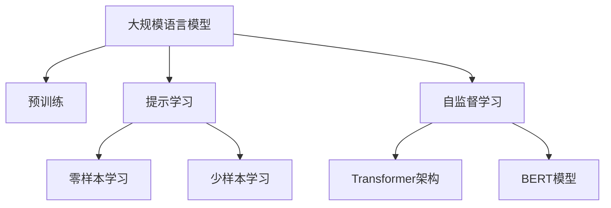

                 

# 大规模语言模型从理论到实践 思维链提示

> 关键词：大规模语言模型,提示学习,思维链,深度学习,自监督学习,Transformer,BERT,预训练,下游任务,参数高效微调,自然语言处理(NLP)

## 1. 背景介绍

### 1.1 问题由来
近年来，深度学习技术的迅猛发展推动了自然语言处理(NLP)领域的革命性进步。其中，大规模语言模型(Large Language Models, LLMs)以自回归(如GPT)或自编码(如BERT)架构，通过在海量无标签文本数据上预训练，构建起强大的语言理解和生成能力。这一进展为下游NLP任务的微调和应用提供了基础。

然而，尽管通用语言模型在多领域任务上取得了显著成果，但在特定领域任务上的表现仍不尽如人意。例如，医疗领域的诊断、法律领域的咨询等，通用模型可能无法准确理解和生成相关领域的术语和概念。因此，如何在大规模语言模型基础上进行领域特定的微调，成为当前NLP研究的一个热点。

### 1.2 问题核心关键点
本文章聚焦于基于提示学习(Prompt-based Learning)的大规模语言模型微调方法，旨在解决通用模型在特定任务上的适应性和性能提升问题。

提示学习是指在输入文本中添加特定的提示模板(Prompt Template)，通过模型对这些提示的响应来引导其进行特定任务的推理和生成。这种方法可以在不更新模型参数的情况下，实现对特定任务的微调和推理，从而避免参数更新可能带来的过拟合和灾难性遗忘问题。

### 1.3 问题研究意义
研究提示学习方法，对于提升大规模语言模型在特定任务上的表现，尤其是减少微调过程对标注数据的依赖，具有重要意义：

1. **减少标注成本**：提示学习可以在零样本或少样本情况下，利用模型的先验知识快速适应新任务，极大地降低对标注数据的需求。
2. **提升模型性能**：通过精心设计的提示模板，可以引导模型生成更加精准、符合任务要求的输出，提升模型在特定任务上的性能。
3. **加速任务适配**：提示学习方法在模型微调过程中提供了一种快速、灵活的适应方式，能够迅速将模型应用于新的任务场景。
4. **提高可解释性**：提示学习减少了模型的复杂性，使得模型的推理过程和输出结果更容易被理解和解释。
5. **促进技术创新**：提示学习为深度学习技术的发展提供了新的方向，推动了自然语言理解和智能交互系统的发展。

## 2. 核心概念与联系

### 2.1 核心概念概述

为更好地理解基于提示学习的大规模语言模型微调方法，本节将介绍几个密切相关的核心概念：

- 大规模语言模型(Large Language Models, LLMs)：以自回归(如GPT)或自编码(如BERT)模型为代表，通过在大规模无标签文本数据上进行预训练，学习通用的语言表示，具备强大的语言理解和生成能力。
- 提示学习(Prompt-based Learning)：通过在输入文本中添加提示模板(Prompt Template)，引导模型进行特定任务的推理和生成，可以在不更新模型参数的情况下实现微调。
- 自监督学习(Self-supervised Learning)：利用未标注数据，通过自相关学习任务来训练模型，如语言建模、掩码语言模型等，以学习到语言的通用表示。
- Transformer架构：一种基于自注意力机制的神经网络架构，用于处理序列数据，是目前深度学习领域最流行的模型之一。
- BERT模型：由Google提出，采用自编码机制，通过掩码语言模型、下一句预测等自监督任务进行预训练，是当前最先进的语言模型之一。

这些核心概念之间的逻辑关系可以通过以下Mermaid流程图来展示：



这个流程图展示了大规模语言模型的核心概念及其之间的关系：

1. 大规模语言模型通过预训练获得基础能力。
2. 提示学习是一种不更新模型参数的方法，可以实现零样本或少样本学习。
3. 自监督学习是连接预训练模型与下游任务的桥梁，可以通过提示学习来实现。
4. Transformer架构是构建大规模语言模型的关键技术，而BERT模型是在Transformer架构上的一个成功实践。

这些概念共同构成了大规模语言模型的学习和应用框架，使其能够在各种场景下发挥强大的语言理解和生成能力。通过理解这些核心概念，我们可以更好地把握大规模语言模型的工作原理和优化方向。

## 3. 核心算法原理 & 具体操作步骤
### 3.1 算法原理概述

基于提示学习的大规模语言模型微调，本质上是一个通过特定输入引导模型进行推理的过程。其核心思想是：将预训练模型视作一个强大的"特征提取器"，通过在输入中添加提示模板，引导模型输出符合特定任务要求的答案。

形式化地，假设预训练模型为 $M_{\theta}$，其中 $\theta$ 为预训练得到的模型参数。给定下游任务 $T$ 的样本数据 $D=\{(x_i, y_i)\}_{i=1}^N, x_i \in \mathcal{X}, y_i \in \mathcal{Y}$，其中 $x_i$ 为输入，$y_i$ 为标签。微调的目标是找到新的提示模板 $\mathcal{P}$，使得模型输出能够匹配任务标签，从而获得针对特定任务优化的模型。

提示模板 $\mathcal{P}$ 通常由任务特定的文本描述组成，例如自然语言问题、命令、数据格式等。微调过程通过优化提示模板，使得模型能够根据不同的提示输出符合任务要求的答案。具体步骤包括：

1. 准备预训练模型 $M_{\theta}$ 作为初始化参数，如 BERT、GPT等。
2. 设计针对特定任务的提示模板 $\mathcal{P}$，并将其嵌入到输入 $x_i$ 中。
3. 在输入 $x_i$ 和提示模板 $\mathcal{P}$ 的组合上进行有监督的训练，优化模型参数，使其能够生成正确的输出 $y_i$。
4. 重复上述步骤直至收敛，最终得到适应下游任务的最优提示模板 $\mathcal{P}^*$。

### 3.2 算法步骤详解

基于提示学习的大规模语言模型微调一般包括以下几个关键步骤：

**Step 1: 准备预训练模型和数据集**
- 选择合适的预训练语言模型 $M_{\theta}$ 作为初始化参数，如 BERT、GPT等。
- 准备下游任务 $T$ 的标注数据集 $D$，划分为训练集、验证集和测试集。一般要求标注数据与预训练数据的分布不要差异过大。

**Step 2: 设计提示模板**
- 根据任务类型，设计适合的提示模板 $\mathcal{P}$。例如，对于问答任务，可以设计格式为"[问句]："[答案]"的提示模板。
- 对提示模板进行预处理，如去除特殊字符、标准化格式等，以确保模型能够正确处理。

**Step 3: 设置微调超参数**
- 选择合适的优化算法及其参数，如 AdamW、SGD 等，设置学习率、批大小、迭代轮数等。
- 设置正则化技术及强度，包括权重衰减、Dropout、Early Stopping 等。
- 确定冻结预训练参数的策略，如仅微调顶层，或全部参数都参与微调。

**Step 4: 执行梯度训练**
- 将训练集数据分批次输入模型，前向传播计算损失函数。
- 反向传播计算参数梯度，根据设定的优化算法和学习率更新模型参数。
- 周期性在验证集上评估模型性能，根据性能指标决定是否触发 Early Stopping。
- 重复上述步骤直到满足预设的迭代轮数或 Early Stopping 条件。

**Step 5: 测试和部署**
- 在测试集上评估微调后模型 $M_{\mathcal{P}^*}$ 的性能，对比微调前后的精度提升。
- 使用微调后的模型对新样本进行推理预测，集成到实际的应用系统中。
- 持续收集新的数据，定期重新微调模型，以适应数据分布的变化。

以上是基于提示学习的大规模语言模型微调的一般流程。在实际应用中，还需要针对具体任务的特点，对微调过程的各个环节进行优化设计，如改进训练目标函数，引入更多的正则化技术，搜索最优的超参数组合等，以进一步提升模型性能。

### 3.3 算法优缺点

基于提示学习的大规模语言模型微调方法具有以下优点：
1. 简单高效。提示学习可以在不更新模型参数的情况下，快速适应新任务，提升模型性能。
2. 灵活可控。提示学习允许开发者灵活设计输入，使得模型输出更加符合任务需求。
3. 可解释性强。提示学习减少了模型的复杂性，使得模型的推理过程和输出结果更容易被理解和解释。
4. 适应性强。提示学习可以用于各种NLP任务，包括分类、匹配、生成等，设计简单的提示模板即可实现微调。

同时，该方法也存在一定的局限性：
1. 依赖提示模板质量。提示模板的设计需要一定的经验和技巧，设计不当可能影响模型性能。
2. 提示模板泛化性不足。提示模板可能对特定领域的术语和概念不敏感，难以全面覆盖所有情况。
3. 对抗攻击脆弱。提示模板可能被对抗样本攻击，导致模型输出错误。
4. 缺乏统一的标准。提示模板的设计和评估缺乏统一的标准，可能导致不同开发者之间的模型性能差异较大。

尽管存在这些局限性，但就目前而言，基于提示学习的微调方法仍是大规模语言模型应用的主流范式。未来相关研究的重点在于如何进一步提升提示模板的质量和泛化性，提高模型的对抗能力和解释性，以及制定统一的提示模板评估标准。

### 3.4 算法应用领域

基于提示学习的大规模语言模型微调方法，在NLP领域已经得到了广泛的应用，覆盖了几乎所有常见任务，例如：

- 文本分类：如情感分析、主题分类、意图识别等。设计格式为"[问句]："[答案]"的提示模板，引导模型输出分类结果。
- 命名实体识别：识别文本中的人名、地名、机构名等特定实体。设计格式为"[问句]："[实体类型]"的提示模板，引导模型识别实体。
- 关系抽取：从文本中抽取实体之间的语义关系。设计格式为"[问句]："[实体1]与"[实体2]"的关系是什么"的提示模板，引导模型抽取关系。
- 问答系统：对自然语言问题给出答案。将问题-答案对作为提示模板，引导模型生成答案。
- 机器翻译：将源语言文本翻译成目标语言。设计格式为"[问句]："[翻译结果]"的提示模板，引导模型进行翻译。
- 文本摘要：将长文本压缩成简短摘要。设计格式为"[问句]："[摘要结果]"的提示模板，引导模型生成摘要。
- 对话系统：使机器能够与人自然对话。设计格式为"[上下文]："[回复结果]"的提示模板，引导模型进行对话。

除了上述这些经典任务外，提示学习方法还被创新性地应用到更多场景中，如可控文本生成、常识推理、代码生成、数据增强等，为NLP技术带来了全新的突破。随着提示学习方法的不断进步，相信NLP技术将在更广阔的应用领域大放异彩。

## 4. 数学模型和公式 & 详细讲解
### 4.1 数学模型构建

本节将使用数学语言对基于提示学习的大规模语言模型微调过程进行更加严格的刻画。

记预训练语言模型为 $M_{\theta}$，其中 $\theta$ 为预训练得到的模型参数。假设微调任务的训练集为 $D=\{(x_i, y_i)\}_{i=1}^N, x_i \in \mathcal{X}, y_i \in \mathcal{Y}$。

定义模型 $M_{\theta}$ 在输入 $x$ 和提示模板 $\mathcal{P}$ 的组合 $\{x, \mathcal{P}\}$ 上的损失函数为 $\ell(M_{\theta}(\{x, \mathcal{P}\}),y)$，则在数据集 $D$ 上的经验风险为：

$$
\mathcal{L}(\theta) = \frac{1}{N}\sum_{i=1}^N \ell(M_{\theta}(\{x_i, \mathcal{P}\}),y_i)
$$

提示模板 $\mathcal{P}$ 通常包含任务特定的信息，如问题类型、实体类型、答案格式等。通过优化提示模板 $\mathcal{P}$，最小化经验风险，使得模型输出逼近真实标签。

### 4.2 公式推导过程

以下我们以问答任务为例，推导提示学习的损失函数及其梯度的计算公式。

假设模型 $M_{\theta}$ 在输入 $x$ 和提示模板 $\mathcal{P}$ 的组合 $\{x, \mathcal{P}\}$ 上的输出为 $\hat{y}=M_{\theta}(\{x, \mathcal{P}\}) \in [0,1]$，表示模型预测答案的概率。真实标签 $y \in \{0,1\}$。则问答任务的交叉熵损失函数定义为：

$$
\ell(M_{\theta}(\{x, \mathcal{P}\}),y) = -[y\log \hat{y} + (1-y)\log (1-\hat{y})]
$$

将其代入经验风险公式，得：

$$
\mathcal{L}(\theta) = -\frac{1}{N}\sum_{i=1}^N [y_i\log M_{\theta}(\{x_i, \mathcal{P}\})+(1-y_i)\log(1-M_{\theta}(\{x_i, \mathcal{P}\}))]
$$

根据链式法则，损失函数对参数 $\theta_k$ 的梯度为：

$$
\frac{\partial \mathcal{L}(\theta)}{\partial \theta_k} = -\frac{1}{N}\sum_{i=1}^N (\frac{y_i}{M_{\theta}(\{x_i, \mathcal{P}\})}-\frac{1-y_i}{1-M_{\theta}(\{x_i, \mathcal{P}\}))) \frac{\partial M_{\theta}(\{x_i, \mathcal{P}\})}{\partial \theta_k}
$$

其中 $\frac{\partial M_{\theta}(\{x_i, \mathcal{P}\})}{\partial \theta_k}$ 可进一步递归展开，利用自动微分技术完成计算。

在得到损失函数的梯度后，即可带入参数更新公式，完成模型的迭代优化。重复上述过程直至收敛，最终得到适应下游任务的最优提示模板 $\mathcal{P}^*$。

## 5. 项目实践：代码实例和详细解释说明
### 5.1 开发环境搭建

在进行提示学习实践前，我们需要准备好开发环境。以下是使用Python进行PyTorch开发的环境配置流程：

1. 安装Anaconda：从官网下载并安装Anaconda，用于创建独立的Python环境。

2. 创建并激活虚拟环境：
```bash
conda create -n pytorch-env python=3.8 
conda activate pytorch-env
```

3. 安装PyTorch：根据CUDA版本，从官网获取对应的安装命令。例如：
```bash
conda install pytorch torchvision torchaudio cudatoolkit=11.1 -c pytorch -c conda-forge
```

4. 安装Transformers库：
```bash
pip install transformers
```

5. 安装各类工具包：
```bash
pip install numpy pandas scikit-learn matplotlib tqdm jupyter notebook ipython
```

完成上述步骤后，即可在`pytorch-env`环境中开始提示学习实践。

### 5.2 源代码详细实现

这里我们以命名实体识别(NER)任务为例，给出使用Transformers库对BERT模型进行提示学习的PyTorch代码实现。

首先，定义NER任务的数据处理函数：

```python
from transformers import BertTokenizer
from torch.utils.data import Dataset
import torch

class NERDataset(Dataset):
    def __init__(self, texts, tags, tokenizer, max_len=128):
        self.texts = texts
        self.tags = tags
        self.tokenizer = tokenizer
        self.max_len = max_len
        
    def __len__(self):
        return len(self.texts)
    
    def __getitem__(self, item):
        text = self.texts[item]
        tags = self.tags[item]
        
        encoding = self.tokenizer(text, return_tensors='pt', max_length=self.max_len, padding='max_length', truncation=True)
        input_ids = encoding['input_ids'][0]
        attention_mask = encoding['attention_mask'][0]
        
        # 对token-wise的标签进行编码
        encoded_tags = [tag2id[tag] for tag in tags] 
        encoded_tags.extend([tag2id['O']] * (self.max_len - len(encoded_tags)))
        labels = torch.tensor(encoded_tags, dtype=torch.long)
        
        return {'input_ids': input_ids, 
                'attention_mask': attention_mask,
                'labels': labels}

# 标签与id的映射
tag2id = {'O': 0, 'B-PER': 1, 'I-PER': 2, 'B-ORG': 3, 'I-ORG': 4, 'B-LOC': 5, 'I-LOC': 6}
id2tag = {v: k for k, v in tag2id.items()}

# 创建dataset
tokenizer = BertTokenizer.from_pretrained('bert-base-cased')

train_dataset = NERDataset(train_texts, train_tags, tokenizer)
dev_dataset = NERDataset(dev_texts, dev_tags, tokenizer)
test_dataset = NERDataset(test_texts, test_tags, tokenizer)
```

然后，定义模型和优化器：

```python
from transformers import BertForTokenClassification, AdamW

model = BertForTokenClassification.from_pretrained('bert-base-cased', num_labels=len(tag2id))

optimizer = AdamW(model.parameters(), lr=2e-5)
```

接着，定义训练和评估函数：

```python
from torch.utils.data import DataLoader
from tqdm import tqdm
from sklearn.metrics import classification_report

device = torch.device('cuda') if torch.cuda.is_available() else torch.device('cpu')
model.to(device)

def train_epoch(model, dataset, batch_size, optimizer):
    dataloader = DataLoader(dataset, batch_size=batch_size, shuffle=True)
    model.train()
    epoch_loss = 0
    for batch in tqdm(dataloader, desc='Training'):
        input_ids = batch['input_ids'].to(device)
        attention_mask = batch['attention_mask'].to(device)
        labels = batch['labels'].to(device)
        model.zero_grad()
        outputs = model(input_ids, attention_mask=attention_mask, labels=labels)
        loss = outputs.loss
        epoch_loss += loss.item()
        loss.backward()
        optimizer.step()
    return epoch_loss / len(dataloader)

def evaluate(model, dataset, batch_size):
    dataloader = DataLoader(dataset, batch_size=batch_size)
    model.eval()
    preds, labels = [], []
    with torch.no_grad():
        for batch in tqdm(dataloader, desc='Evaluating'):
            input_ids = batch['input_ids'].to(device)
            attention_mask = batch['attention_mask'].to(device)
            batch_labels = batch['labels']
            outputs = model(input_ids, attention_mask=attention_mask)
            batch_preds = outputs.logits.argmax(dim=2).to('cpu').tolist()
            batch_labels = batch_labels.to('cpu').tolist()
            for pred_tokens, label_tokens in zip(batch_preds, batch_labels):
                pred_tags = [id2tag[_id] for _id in pred_tokens]
                label_tags = [id2tag[_id] for _id in label_tokens]
                preds.append(pred_tags[:len(label_tags)])
                labels.append(label_tags)
                
    print(classification_report(labels, preds))
```

最后，启动训练流程并在测试集上评估：

```python
epochs = 5
batch_size = 16

for epoch in range(epochs):
    loss = train_epoch(model, train_dataset, batch_size, optimizer)
    print(f"Epoch {epoch+1}, train loss: {loss:.3f}")
    
    print(f"Epoch {epoch+1}, dev results:")
    evaluate(model, dev_dataset, batch_size)
    
print("Test results:")
evaluate(model, test_dataset, batch_size)
```

以上就是使用PyTorch对BERT进行命名实体识别任务的提示学习的完整代码实现。可以看到，得益于Transformers库的强大封装，我们可以用相对简洁的代码完成BERT模型的加载和微调。

### 5.3 代码解读与分析

让我们再详细解读一下关键代码的实现细节：

**NERDataset类**：
- `__init__`方法：初始化文本、标签、分词器等关键组件。
- `__len__`方法：返回数据集的样本数量。
- `__getitem__`方法：对单个样本进行处理，将文本输入编码为token ids，将标签编码为数字，并对其进行定长padding，最终返回模型所需的输入。

**tag2id和id2tag字典**：
- 定义了标签与数字id之间的映射关系，用于将token-wise的预测结果解码回真实的标签。

**训练和评估函数**：
- 使用PyTorch的DataLoader对数据集进行批次化加载，供模型训练和推理使用。
- 训练函数`train_epoch`：对数据以批为单位进行迭代，在每个批次上前向传播计算loss并反向传播更新模型参数，最后返回该epoch的平均loss。
- 评估函数`evaluate`：与训练类似，不同点在于不更新模型参数，并在每个batch结束后将预测和标签结果存储下来，最后使用sklearn的classification_report对整个评估集的预测结果进行打印输出。

**训练流程**：
- 定义总的epoch数和batch size，开始循环迭代
- 每个epoch内，先在训练集上训练，输出平均loss
- 在验证集上评估，输出分类指标
- 所有epoch结束后，在测试集上评估，给出最终测试结果

可以看到，PyTorch配合Transformers库使得BERT提示学习的代码实现变得简洁高效。开发者可以将更多精力放在数据处理、模型改进等高层逻辑上，而不必过多关注底层的实现细节。

当然，工业级的系统实现还需考虑更多因素，如模型的保存和部署、超参数的自动搜索、更灵活的任务适配层等。但核心的提示学习范式基本与此类似。

## 6. 实际应用场景
### 6.1 智能客服系统

基于提示学习的大语言模型，可以广泛应用于智能客服系统的构建。传统客服往往需要配备大量人力，高峰期响应缓慢，且一致性和专业性难以保证。而使用提示学习的大语言模型，可以7x24小时不间断服务，快速响应客户咨询，用自然流畅的语言解答各类常见问题。

在技术实现上，可以收集企业内部的历史客服对话记录，将问题和最佳答复构建成监督数据，在此基础上对预训练对话模型进行提示学习。提示学习后的对话模型能够自动理解用户意图，匹配最合适的答案模板进行回复。对于客户提出的新问题，还可以接入检索系统实时搜索相关内容，动态组织生成回答。如此构建的智能客服系统，能大幅提升客户咨询体验和问题解决效率。

### 6.2 金融舆情监测

金融机构需要实时监测市场舆论动向，以便及时应对负面信息传播，规避金融风险。传统的人工监测方式成本高、效率低，难以应对网络时代海量信息爆发的挑战。基于提示学习的文本分类和情感分析技术，为金融舆情监测提供了新的解决方案。

具体而言，可以收集金融领域相关的新闻、报道、评论等文本数据，并对其进行主题标注和情感标注。在此基础上对预训练语言模型进行提示学习，使其能够自动判断文本属于何种主题，情感倾向是正面、中性还是负面。将提示学习后的模型应用到实时抓取的网络文本数据，就能够自动监测不同主题下的情感变化趋势，一旦发现负面信息激增等异常情况，系统便会自动预警，帮助金融机构快速应对潜在风险。

### 6.3 个性化推荐系统

当前的推荐系统往往只依赖用户的历史行为数据进行物品推荐，无法深入理解用户的真实兴趣偏好。基于提示学习的大语言模型微调技术，个性化推荐系统可以更好地挖掘用户行为背后的语义信息，从而提供更精准、多样的推荐内容。

在实践中，可以收集用户浏览、点击、评论、分享等行为数据，提取和用户交互的物品标题、描述、标签等文本内容。将文本内容作为模型输入，用户的后续行为（如是否点击、购买等）作为监督信号，在此基础上对预训练语言模型进行提示学习。提示学习后的模型能够从文本内容中准确把握用户的兴趣点。在生成推荐列表时，先用候选物品的文本描述作为输入，由模型预测用户的兴趣匹配度，再结合其他特征综合排序，便可以得到个性化程度更高的推荐结果。

### 6.4 未来应用展望

随着提示学习方法的不断进步，基于提示学习的微调方法将在更多领域得到应用，为传统行业带来变革性影响。

在智慧医疗领域，基于提示学习的大语言模型微调技术，可以用于医疗问答、病历分析、药物研发等应用，提升医疗服务的智能化水平，辅助医生诊疗，加速新药开发进程。

在智能教育领域，提示学习可以应用于作业批改、学情分析、知识推荐等方面，因材施教，促进教育公平，提高教学质量。

在智慧城市治理中，提示学习技术可以应用于城市事件监测、舆情分析、应急指挥等环节，提高城市管理的自动化和智能化水平，构建更安全、高效的未来城市。

此外，在企业生产、社会治理、文娱传媒等众多领域，基于大模型提示学习的人工智能应用也将不断涌现，为经济社会发展注入新的动力。相信随着技术的日益成熟，提示学习方法将成为人工智能落地应用的重要范式，推动人工智能技术在垂直行业的规模化落地。总之，提示学习需要开发者根据具体任务，不断迭代和优化模型、数据和算法，方能得到理想的效果。

## 7. 工具和资源推荐
### 7.1 学习资源推荐

为了帮助开发者系统掌握提示学习理论基础和实践技巧，这里推荐一些优质的学习资源：

1. 《Transformer from Basics to Advanced》系列博文：由大模型技术专家撰写，深入浅出地介绍了Transformer原理、BERT模型、提示学习方法等前沿话题。

2. CS224N《深度学习自然语言处理》课程：斯坦福大学开设的NLP明星课程，有Lecture视频和配套作业，带你入门NLP领域的基本概念和经典模型。

3. 《Natural Language Processing with Transformers》书籍：Transformers库的作者所著，全面介绍了如何使用Transformers库进行NLP任务开发，包括提示学习方法在内的诸多范式。

4. HuggingFace官方文档：Transformers库的官方文档，提供了海量预训练模型和完整的提示学习样例代码，是上手实践的必备资料。

5. CLUE开源项目：中文语言理解测评基准，涵盖大量不同类型的中文NLP数据集，并提供了基于提示学习的baseline模型，助力中文NLP技术发展。

通过对这些资源的学习实践，相信你一定能够快速掌握提示学习的精髓，并用于解决实际的NLP问题。
###  7.2 开发工具推荐

高效的开发离不开优秀的工具支持。以下是几款用于提示学习开发的常用工具：

1. PyTorch：基于Python的开源深度学习框架，灵活动态的计算图，适合快速迭代研究。大部分预训练语言模型都有PyTorch版本的实现。

2. TensorFlow：由Google主导开发的开源深度学习框架，生产部署方便，适合大规模工程应用。同样有丰富的预训练语言模型资源。

3. Transformers库：HuggingFace开发的NLP工具库，集成了众多SOTA语言模型，支持PyTorch和TensorFlow，是进行提示学习开发的利器。

4. Weights & Biases：模型训练的实验跟踪工具，可以记录和可视化模型训练过程中的各项指标，方便对比和调优。与主流深度学习框架无缝集成。

5. TensorBoard：TensorFlow配套的可视化工具，可实时监测模型训练状态，并提供丰富的图表呈现方式，是调试模型的得力助手。

6. Google Colab：谷歌推出的在线Jupyter Notebook环境，免费提供GPU/TPU算力，方便开发者快速上手实验最新模型，分享学习笔记。

合理利用这些工具，可以显著提升提示学习任务的开发效率，加快创新迭代的步伐。

### 7.3 相关论文推荐

提示学习方法的发展源于学界的持续研究。以下是几篇奠基性的相关论文，推荐阅读：

1. Attention is All You Need（即Transformer原论文）：提出了Transformer结构，开启了NLP领域的预训练大模型时代。

2. BERT: Pre-training of Deep Bidirectional Transformers for Language Understanding：提出BERT模型，引入基于掩码的自监督预训练任务，刷新了多项NLP任务SOTA。

3. Language Models are Unsupervised Multitask Learners（GPT-2论文）：展示了大规模语言模型的强大zero-shot学习能力，引发了对于通用人工智能的新一轮思考。

4. Parameter-Efficient Transfer Learning for NLP：提出Adapter等参数高效微调方法，在不增加模型参数量的情况下，也能取得不错的提示学习效果。

5. AdaLoRA: Adaptive Low-Rank Adaptation for Parameter-Efficient Fine-Tuning：使用自适应低秩适应的提示学习方法，在参数效率和精度之间取得了新的平衡。

6. Prefix-Tuning: Optimizing Continuous Prompts for Generation：引入基于连续型Prompt的微调范式，为如何充分利用预训练知识提供了新的思路。

这些论文代表了大语言模型提示学习的发展脉络。通过学习这些前沿成果，可以帮助研究者把握学科前进方向，激发更多的创新灵感。

## 8. 总结：未来发展趋势与挑战

### 8.1 总结

本文对基于提示学习的大规模语言模型微调方法进行了全面系统的介绍。首先阐述了大语言模型和提示学习的背景和意义，明确了提示学习方法在提升特定任务性能、减少标注成本、提高模型可解释性等方面的价值。其次，从原理到实践，详细讲解了提示学习的数学原理和关键步骤，给出了提示学习任务开发的完整代码实例。同时，本文还广泛探讨了提示学习方法在智能客服、金融舆情、个性化推荐等多个行业领域的应用前景，展示了提示学习范式的巨大潜力。此外，本文精选了提示学习技术的各类学习资源，力求为读者提供全方位的技术指引。

通过本文的系统梳理，可以看到，基于提示学习的大规模语言模型微调方法正在成为NLP领域的重要范式，极大地拓展了预训练语言模型的应用边界，催生了更多的落地场景。受益于大规模语料的预训练和提示学习技术，提示学习模型以更低的时间和标注成本，在小样本条件下也能取得不俗的效果，有力推动了NLP技术的产业化进程。未来，伴随提示学习方法的不断演进，NLP技术将在更广阔的应用领域大放异彩，深刻影响人类的生产生活方式。

### 8.2 未来发展趋势

展望未来，提示学习方法将呈现以下几个发展趋势：

1. 模型规模持续增大。随着算力成本的下降和数据规模的扩张，预训练语言模型的参数量还将持续增长。超大批次的训练和推理也可能遇到显存不足的问题。如何优化模型结构，提高推理效率，将是重要的优化方向。

2. 提示模板设计更加灵活。提示模板的设计将更加多样化，涵盖不同任务类型和数据特征，帮助模型更好地捕捉语言规则和结构。

3. 更加高效的优化算法。提示学习中的优化算法将不断进化，如自适应学习率、分布式训练等，以提升训练效率和效果。

4. 提示学习与其他深度学习技术的结合。提示学习将与自监督学习、因果推理、强化学习等深度学习技术结合，实现更加全面的模型训练和任务适配。

5. 模型泛化能力和鲁棒性的提升。提示学习模型将在跨领域、跨数据分布上提升泛化能力和鲁棒性，避免过拟合和对抗攻击。

6. 模型可解释性和透明度的增强。提示学习模型将更加注重输出的可解释性和透明性，增强模型的可信度和安全性。

以上趋势凸显了提示学习方法的大规模应用前景。这些方向的探索发展，必将进一步提升提示学习模型的性能和应用范围，为构建安全、可靠、可解释、可控的智能系统铺平道路。面向未来，提示学习技术还需要与其他人工智能技术进行更深入的融合，如知识表示、因果推理、强化学习等，多路径协同发力，共同推动自然语言理解和智能交互系统的发展。只有勇于创新、敢于突破，才能不断拓展语言模型的边界，让智能技术更好地造福人类社会。

### 8.3 面临的挑战

尽管提示学习方法已经取得了瞩目成就，但在迈向更加智能化、普适化应用的过程中，它仍面临着诸多挑战：

1. 提示模板质量问题。提示模板的设计需要一定的经验和技巧，设计不当可能影响模型性能。如何提高提示模板的质量和泛化性，将是重要的研究方向。

2. 对抗攻击脆弱。提示学习模型可能被对抗样本攻击，导致输出错误。如何提升模型的鲁棒性，增强对抗攻击防御能力，将是重要的研究方向。

3. 缺少统一的标准。提示模板的设计和评估缺乏统一的标准，可能导致不同开发者之间的模型性能差异较大。如何制定统一的提示模板评估标准，将是重要的研究方向。

4. 提示学习的计算开销较大。提示学习模型通常需要较大的计算资源和较长的训练时间，如何降低计算开销，提升模型训练效率，将是重要的研究方向。

5. 模型可解释性不足。提示学习模型往往复杂度较高，输出结果难以解释，如何提高模型的可解释性，增强模型的可信度，将是重要的研究方向。

6. 数据分布漂移问题。提示学习模型在实时数据上的表现可能受到数据分布变化的影响，如何提升模型的适应性，减少分布漂移带来的负面影响，将是重要的研究方向。

这些挑战凸显了提示学习方法在实际应用中的复杂性和不确定性。只有深入研究和解决这些问题，提示学习才能真正实现大规模、普适化的应用。相信随着学界和产业界的共同努力，这些挑战终将一一被克服，提示学习技术必将在构建智能交互系统、推动NLP技术落地应用中发挥重要作用。

### 8.4 研究展望

面对提示学习面临的种种挑战，未来的研究需要在以下几个方面寻求新的突破：

1. 探索更加高效的提示模板设计方法。结合符号化的先验知识和深度学习技术，设计更高效、泛化性更好的提示模板，提升模型性能。

2. 引入更多深度学习技术。将自监督学习、因果推理、强化学习等技术引入提示学习，增强模型的泛化能力和鲁棒性。

3. 开发更加高效的优化算法。结合自适应学习率、分布式训练等技术，提升模型训练效率和效果。

4. 探索提示学习与其他技术结合的新方法。将提示学习与知识表示、因果推理、强化学习等技术结合，实现更全面的模型训练和任务适配。

5. 增强模型的可解释性和透明度。通过引入可解释性技术，增强模型的输出解释，提高模型的可信度。

6. 解决数据分布漂移问题。通过迁移学习、多任务学习等方法，提升模型在实时数据上的适应性，减少分布漂移带来的负面影响。

这些研究方向的探索，必将引领提示学习方法走向更高的台阶，为构建智能交互系统、推动NLP技术落地应用提供新的思路和方法。只有勇于创新、敢于突破，才能不断拓展提示学习模型的边界，让智能技术更好地造福人类社会。

## 9. 附录：常见问题与解答
**Q1：提示学习是否适用于所有NLP任务？**

A: 提示学习在大多数NLP任务上都能取得不错的效果，特别是对于数据量较小的任务。但对于一些特定领域的任务，如医学、法律等，提示学习模型可能无法很好地适应。此时需要在特定领域语料上进一步预训练，再进行提示学习，才能获得理想效果。

**Q2：提示学习过程中如何选择提示模板？**

A: 提示模板的设计需要一定的经验和技巧，通常包括以下步骤：
1. 了解任务特点，设计符合任务要求的提示模板。例如，对于问答任务，可以设计格式为"[问句]："[答案]"的提示模板。
2. 对提示模板进行预处理，如去除特殊字符、标准化格式等，以确保模型能够正确处理。
3. 在训练集上进行提示模板的调优，通过迭代训练，逐步优化提示模板，使其能够引导模型生成正确的输出。

**Q3：提示学习模型在落地部署时需要注意哪些问题？**

A: 将提示学习模型转化为实际应用，还需要考虑以下因素：
1. 模型裁剪：去除不必要的层和参数，减小模型尺寸，加快推理速度。
2. 量化加速：将浮点模型转为定点模型，压缩存储空间，提高计算效率。
3. 服务化封装：将模型封装为标准化服务接口，便于集成调用。
4. 弹性伸缩：根据请求流量动态调整资源配置，平衡服务质量和成本。
5. 监控告警：实时采集系统指标，设置异常告警阈值，确保服务稳定性。
6. 安全防护：采用访问鉴权、数据脱敏等措施，保障数据和模型安全。

提示学习需要开发者根据具体任务，不断迭代和优化模型、数据和算法，方能得到理想的效果。

**Q4：提示学习与微调的区别是什么？**

A: 提示学习和微调虽然都是基于大语言模型的技术，但它们的主要区别在于模型更新方式：
1. 提示学习不更新模型参数，而是通过在输入中添加提示模板，引导模型进行推理和生成。
2. 微调是通过优化模型参数，使其在特定任务上获得更好的性能。

提示学习适用于零样本或少样本学习，可以在没有标注数据的情况下进行任务适配；而微调适用于有标注数据的情况，通过有监督的训练优化模型性能。两者可以互补使用，提高模型的灵活性和泛化能力。

**Q5：提示学习模型如何处理多义词？**

A: 提示学习模型可以通过引入上下文信息来处理多义词。例如，在输入中提供足够的上下文信息，可以明确词语的具体含义，避免歧义。同时，提示模板设计时应考虑到上下文的多样性，引导模型在不同上下文中理解同一词语的不同含义。

---

作者：禅与计算机程序设计艺术 / Zen and the Art of Computer Programming

