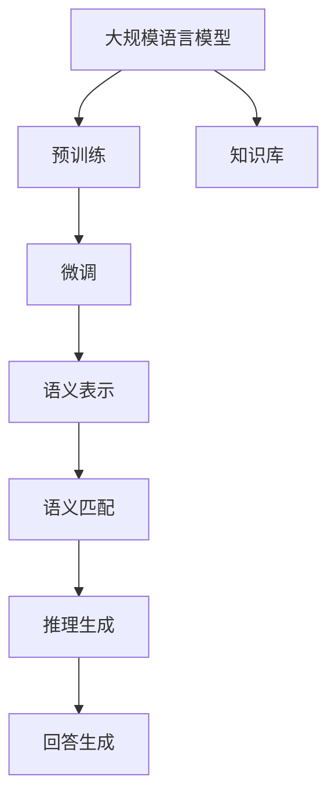

                 

# 大规模语言模型从理论到实践 知识库问答系统实践

> 关键词：知识库问答系统, 大规模语言模型, 深度学习, 自然语言处理, Transformer, 语义表示, 语义匹配, 模型融合, 预训练-微调

## 1. 背景介绍

### 1.1 问题由来
随着人工智能技术的迅猛发展，知识库问答系统（Knowledge Base Question Answering, KBQA）成为了自然语言处理领域的一个重要研究方向。传统的问答系统依赖于手动编写的规则或模板，难以应对复杂多变的问题类型和语义结构。而基于大规模语言模型的知识库问答系统，可以自动理解自然语言问题，在知识库中检索并提取相关信息，生成自然流畅的回答，显著提升了问答系统的智能水平和用户体验。

知识库问答系统可以广泛应用于智能客服、智能搜索、智能推荐等多个场景。在智能客服领域，通过自然语言理解，系统能够快速响应用户查询，提供准确的解答和建议。在智能推荐中，根据用户历史查询行为和偏好，推荐相关的产品或内容，提升用户满意度。

近年来，基于深度学习的知识库问答系统研究不断深入，特别是预训练语言模型（如BERT、GPT等）在知识库问答任务上取得了显著的效果。通过在大规模无标签语料上进行预训练，语言模型自动学习到丰富的语言表示，能够理解自然语言的内在结构，捕捉语义关联，显著提升了问答系统的性能。

### 1.2 问题核心关键点
构建基于大规模语言模型的知识库问答系统，主要面临以下几个核心问题：

1. **预训练与微调**：如何利用大规模语料进行预训练，并在此基础上进行微调，以适应特定知识库的语义结构。
2. **语义表示学习**：如何将自然语言问题转化为语义表示，与知识库中的实体和关系进行匹配。
3. **语义匹配与推理**：如何设计高效的匹配算法，从知识库中检索相关信息，并基于推理生成准确的回答。
4. **模型融合与优化**：如何将预训练语言模型与知识图谱、规则等其他模块进行有效融合，提升系统的整体性能。

本文将从以上几个关键点出发，系统介绍大规模语言模型在知识库问答系统中的应用，并给出具体的实现方法和步骤。

## 2. 核心概念与联系

### 2.1 核心概念概述

为了更好地理解大规模语言模型在知识库问答系统中的实际应用，下面将介绍几个密切相关的核心概念：

- **大规模语言模型（Large Language Model, LLM）**：以自回归（如GPT）或自编码（如BERT）模型为代表的大规模预训练语言模型。通过在大规模无标签文本语料上进行预训练，学习到丰富的语言知识和常识，具备强大的语言理解和生成能力。
- **知识库问答系统（Knowledge Base Question Answering, KBQA）**：一种利用自然语言理解技术，从知识库中检索信息，生成自然流畅回答的问答系统。
- **语义表示学习（Semantic Representation Learning）**：将自然语言问题转化为机器可理解的语义表示，以便与知识库中的实体和关系进行匹配。
- **语义匹配与推理（Semantic Matching and Reasoning）**：设计高效的匹配算法，从知识库中检索相关信息，并基于推理生成准确的回答。
- **模型融合与优化（Model Fusion and Optimization）**：将预训练语言模型与知识图谱、规则等其他模块进行有效融合，提升系统的整体性能。

这些核心概念之间存在紧密的联系，共同构成了大规模语言模型在知识库问答系统中的工作框架。下面通过Mermaid流程图展示这些概念之间的逻辑关系：



这个流程图展示了语言模型在大规模知识库问答系统中的应用逻辑：

1. 大规模语言模型通过预训练获得语言表示能力。
2. 预训练后的模型在知识库上进行微调，以适应特定知识库的语义结构。
3. 将自然语言问题转化为语义表示，与知识库中的实体和关系进行匹配。
4. 从匹配结果中提取相关信息，并进行推理生成最终回答。

通过这些步骤，大规模语言模型能够在知识库问答系统中高效地处理自然语言问题，生成准确的回答。

## 3. 核心算法原理 & 具体操作步骤
### 3.1 算法原理概述

基于大规模语言模型的知识库问答系统，本质上是一种预训练-微调（Pre-training and Fine-tuning）范式。其核心思想是：将大规模语言模型作为预训练的基础，通过在特定知识库上微调，使其学习到与知识库语义结构相匹配的表示，从而能够高效地回答问题。

具体来说，预训练阶段，模型在大规模无标签文本语料上进行自监督学习，学习到丰富的语言表示。微调阶段，在知识库上进行有监督学习，使模型学习到与知识库语义结构相匹配的表示。最终的语义表示和推理生成模块一起，可以高效地回答问题，并生成自然流畅的回答。

### 3.2 算法步骤详解

基于大规模语言模型的知识库问答系统的构建，一般包括以下几个关键步骤：

**Step 1: 准备知识库和预训练模型**

- 收集并整理知识库，包括实体、关系、属性等信息。构建知识图谱，以便与语言模型进行语义匹配。
- 选择合适的预训练语言模型（如BERT、GPT等）作为初始化参数。

**Step 2: 定义语义表示和推理生成模块**

- 设计语义表示模块，将自然语言问题转化为机器可理解的语义表示。通常使用Transformer等模型进行编码，并利用任务特定的损失函数进行训练。
- 设计推理生成模块，从知识库中检索相关信息，并基于推理生成最终回答。通常使用注意力机制等方法进行匹配和推理。

**Step 3: 构建预训练和微调流程**

- 在预训练阶段，使用大规模无标签文本语料对语言模型进行训练，学习到丰富的语言表示。
- 在微调阶段，使用知识库上的标注数据对语言模型进行训练，使其学习到与知识库语义结构相匹配的表示。

**Step 4: 整合语义匹配与推理生成**

- 将语义表示和推理生成模块整合到知识库问答系统中，构建完整的问答系统。
- 在测试集上进行评估，对比预训练模型和微调后的模型效果。

### 3.3 算法优缺点

基于大规模语言模型的知识库问答系统具有以下优点：

1. **高效性**：大规模语言模型能够自动学习到丰富的语言表示，可以高效地处理自然语言问题，生成自然流畅的回答。
2. **泛化能力**：预训练和微调相结合的范式，使得模型能够泛化到不同的知识库和问答任务中，具有较强的通用性。
3. **灵活性**：通过微调，模型可以根据特定的知识库和问答任务进行定制化训练，提升系统性能。

同时，该方法也存在一些局限性：

1. **标注成本**：微调阶段需要大量标注数据，标注成本较高。
2. **泛化能力**：当知识库和问答任务与预训练数据的分布差异较大时，微调的性能提升有限。
3. **可解释性**：微调后的模型缺乏可解释性，难以对其推理逻辑进行分析和调试。

尽管存在这些局限性，基于大规模语言模型的知识库问答系统仍是一种高效、通用的解决方案，广泛应用于各种NLP任务中。

### 3.4 算法应用领域

基于大规模语言模型的知识库问答系统已经广泛应用于多个领域，例如：

- 智能客服系统：通过理解用户查询，从知识库中检索信息，生成回答。
- 智能搜索系统：根据用户输入的自然语言查询，从知识库中检索相关信息，并生成搜索结果。
- 知识推荐系统：根据用户的历史查询和行为，从知识库中推荐相关信息。
- 智能助手：能够理解和处理自然语言指令，执行各种任务。

除了上述这些常见应用外，知识库问答系统还被创新性地应用于更多场景中，如医疗问答、金融咨询、电商推荐等，为各行各业带来了新的技术突破。

## 4. 数学模型和公式 & 详细讲解 & 举例说明

### 4.1 数学模型构建

本节将使用数学语言对大规模语言模型在知识库问答系统中的应用进行严格刻画。

记预训练语言模型为 $M_{\theta}$，其中 $\theta$ 为预训练得到的模型参数。知识库中的每个实体 $e_i$ 和关系 $r_j$ 分别表示为向量形式 $e_i \in \mathbb{R}^d, r_j \in \mathbb{R}^d$。自然语言问题 $q$ 表示为向量形式 $q \in \mathbb{R}^d$。

定义语义表示模块为 $E_{\phi}(q)$，其中 $\phi$ 为语义表示模块的参数，表示为向量形式 $E_{\phi}(q) \in \mathbb{R}^d$。定义推理生成模块为 $R_{\psi}(E_{\phi}(q), r_j, e_i)$，其中 $\psi$ 为推理生成模块的参数，表示为向量形式 $R_{\psi}(E_{\phi}(q), r_j, e_i) \in \mathbb{R}^d$。

最终的语义匹配和推理生成过程为：

$$
\hat{e} = \arg\max_{e_i} \langle E_{\phi}(q), e_i \rangle
$$

$$
\hat{r} = \arg\max_{r_j} \langle R_{\psi}(E_{\phi}(q), r_j, e_i), e_i \rangle
$$

$$
\hat{a} = R_{\psi}(E_{\phi}(q), \hat{r}, \hat{e})
$$

其中 $\hat{e}, \hat{r}, \hat{a}$ 分别为知识库中匹配到的实体、关系和最终回答。

### 4.2 公式推导过程

以下我们以医疗问答系统为例，推导语义表示和推理生成过程的数学公式。

假设自然语言问题 $q$ 表示为向量形式 $q \in \mathbb{R}^d$，实体 $e_i$ 和关系 $r_j$ 表示为向量形式 $e_i \in \mathbb{R}^d, r_j \in \mathbb{R}^d$。语义表示模块 $E_{\phi}$ 和推理生成模块 $R_{\psi}$ 分别为：

$$
E_{\phi}(q) = M_{\theta}(q) \in \mathbb{R}^d
$$

$$
R_{\psi}(E_{\phi}(q), r_j, e_i) = M_{\theta}(E_{\phi}(q) \odot r_j) \odot e_i \in \mathbb{R}^d
$$

其中 $\odot$ 表示向量点乘操作。

语义匹配过程为：

$$
\hat{e} = \arg\max_{e_i} \langle E_{\phi}(q), e_i \rangle
$$

推理生成过程为：

$$
\hat{r} = \arg\max_{r_j} \langle R_{\psi}(E_{\phi}(q), r_j, \hat{e}), \hat{e} \rangle
$$

$$
\hat{a} = R_{\psi}(E_{\phi}(q), \hat{r}, \hat{e})
$$

最终生成回答 $\hat{a} \in \mathbb{R}^d$。

### 4.3 案例分析与讲解

以医疗问答系统为例，说明语义表示和推理生成过程的实现细节。

假设问题为 "患者有哪些常见的过敏原？"，知识库中包括 "过敏原" 和 "常见疾病" 等实体，以及 "导致" 和 "治疗" 等关系。具体实现步骤如下：

1. 使用BERT等预训练语言模型，对问题进行编码，得到语义表示 $E_{\phi}(q)$。
2. 在知识库中查找与语义表示匹配的实体 "过敏原"，即 $\hat{e} = \arg\max_{e_i} \langle E_{\phi}(q), e_i \rangle$。
3. 在知识库中查找与实体 "过敏原" 匹配的关系，即 $\hat{r} = \arg\max_{r_j} \langle R_{\psi}(E_{\phi}(q), r_j, \hat{e}), \hat{e} \rangle$。
4. 根据关系 "导致"，在知识库中查找 "过敏原" 对应的常见疾病，即 $\hat{a} = R_{\psi}(E_{\phi}(q), \hat{r}, \hat{e})$。

最终生成回答 $\hat{a}$，如 "过敏原可能导致的常见疾病包括..."

## 5. 项目实践：代码实例和详细解释说明
### 5.1 开发环境搭建

在进行知识库问答系统开发前，我们需要准备好开发环境。以下是使用Python进行PyTorch开发的环境配置流程：

1. 安装Anaconda：从官网下载并安装Anaconda，用于创建独立的Python环境。

2. 创建并激活虚拟环境：
```bash
conda create -n pytorch-env python=3.8 
conda activate pytorch-env
```

3. 安装PyTorch：根据CUDA版本，从官网获取对应的安装命令。例如：
```bash
conda install pytorch torchvision torchaudio cudatoolkit=11.1 -c pytorch -c conda-forge
```

4. 安装Transformers库：
```bash
pip install transformers
```

5. 安装各类工具包：
```bash
pip install numpy pandas scikit-learn matplotlib tqdm jupyter notebook ipython
```

完成上述步骤后，即可在`pytorch-env`环境中开始开发实践。

### 5.2 源代码详细实现

这里我们以医疗问答系统为例，给出使用Transformers库对BERT模型进行微调的PyTorch代码实现。

首先，定义语义表示和推理生成模块：

```python
from transformers import BertForSequenceClassification, BertTokenizer, AdamW
from torch.utils.data import Dataset, DataLoader

class QuestionDataset(Dataset):
    def __init__(self, texts, answers, tokenizer, max_len=128):
        self.texts = texts
        self.answers = answers
        self.tokenizer = tokenizer
        self.max_len = max_len

    def __len__(self):
        return len(self.texts)

    def __getitem__(self, item):
        text = self.texts[item]
        answer = self.answers[item]
        
        encoding = self.tokenizer(text, return_tensors='pt', max_length=self.max_len, padding='max_length', truncation=True)
        input_ids = encoding['input_ids'][0]
        attention_mask = encoding['attention_mask'][0]
        
        answer_ids = tokenizer.convert_tokens_to_ids(answer)
        answer_ids = [0] * (self.max_len - len(answer_ids)) + answer_ids
        labels = torch.tensor(answer_ids, dtype=torch.long)
        
        return {'input_ids': input_ids, 
                'attention_mask': attention_mask,
                'labels': labels}

# 构建训练集和验证集
tokenizer = BertTokenizer.from_pretrained('bert-base-cased')

train_dataset = QuestionDataset(train_texts, train_answers, tokenizer)
dev_dataset = QuestionDataset(dev_texts, dev_answers, tokenizer)
test_dataset = QuestionDataset(test_texts, test_answers, tokenizer)

# 定义模型和优化器
model = BertForSequenceClassification.from_pretrained('bert-base-cased', num_labels=len(tag2id))

optimizer = AdamW(model.parameters(), lr=2e-5)
```

然后，定义训练和评估函数：

```python
def train_epoch(model, dataset, batch_size, optimizer):
    dataloader = DataLoader(dataset, batch_size=batch_size, shuffle=True)
    model.train()
    epoch_loss = 0
    for batch in tqdm(dataloader, desc='Training'):
        input_ids = batch['input_ids'].to(device)
        attention_mask = batch['attention_mask'].to(device)
        labels = batch['labels'].to(device)
        model.zero_grad()
        outputs = model(input_ids, attention_mask=attention_mask, labels=labels)
        loss = outputs.loss
        epoch_loss += loss.item()
        loss.backward()
        optimizer.step()
    return epoch_loss / len(dataloader)

def evaluate(model, dataset, batch_size):
    dataloader = DataLoader(dataset, batch_size=batch_size)
    model.eval()
    preds, labels = [], []
    with torch.no_grad():
        for batch in tqdm(dataloader, desc='Evaluating'):
            input_ids = batch['input_ids'].to(device)
            attention_mask = batch['attention_mask'].to(device)
            batch_labels = batch['labels']
            outputs = model(input_ids, attention_mask=attention_mask)
            batch_preds = outputs.logits.argmax(dim=2).to('cpu').tolist()
            batch_labels = batch_labels.to('cpu').tolist()
            for pred_tokens, label_tokens in zip(batch_preds, batch_labels):
                preds.append(pred_tokens[:len(label_tokens)])
                labels.append(label_tokens)
                
    print(classification_report(labels, preds))
```

最后，启动训练流程并在测试集上评估：

```python
epochs = 5
batch_size = 16

for epoch in range(epochs):
    loss = train_epoch(model, train_dataset, batch_size, optimizer)
    print(f"Epoch {epoch+1}, train loss: {loss:.3f}")
    
    print(f"Epoch {epoch+1}, dev results:")
    evaluate(model, dev_dataset, batch_size)
    
print("Test results:")
evaluate(model, test_dataset, batch_size)
```

以上就是使用PyTorch对BERT进行医疗问答系统微调的完整代码实现。可以看到，得益于Transformers库的强大封装，我们可以用相对简洁的代码完成BERT模型的加载和微调。

### 5.3 代码解读与分析

让我们再详细解读一下关键代码的实现细节：

**QuestionDataset类**：
- `__init__`方法：初始化文本、答案、分词器等关键组件。
- `__len__`方法：返回数据集的样本数量。
- `__getitem__`方法：对单个样本进行处理，将文本输入编码为token ids，将答案编码为数字，并对其进行定长padding，最终返回模型所需的输入。

**训练和评估函数**：
- 使用PyTorch的DataLoader对数据集进行批次化加载，供模型训练和推理使用。
- 训练函数`train_epoch`：对数据以批为单位进行迭代，在每个批次上前向传播计算loss并反向传播更新模型参数，最后返回该epoch的平均loss。
- 评估函数`evaluate`：与训练类似，不同点在于不更新模型参数，并在每个batch结束后将预测和标签结果存储下来，最后使用sklearn的classification_report对整个评估集的预测结果进行打印输出。

**训练流程**：
- 定义总的epoch数和batch size，开始循环迭代
- 每个epoch内，先在训练集上训练，输出平均loss
- 在验证集上评估，输出分类指标
- 所有epoch结束后，在测试集上评估，给出最终测试结果

可以看到，PyTorch配合Transformers库使得BERT微调的代码实现变得简洁高效。开发者可以将更多精力放在数据处理、模型改进等高层逻辑上，而不必过多关注底层的实现细节。

当然，工业级的系统实现还需考虑更多因素，如模型的保存和部署、超参数的自动搜索、更灵活的任务适配层等。但核心的微调范式基本与此类似。

## 6. 实际应用场景
### 6.1 智能客服系统

基于知识库问答系统的智能客服系统，能够自动理解用户查询，从知识库中检索信息，生成回答。相比传统的规则系统，智能客服系统能够提供更准确、快速、自然流畅的回答，极大提升了用户体验。

在技术实现上，可以构建一个包含大量常见问题和答案的知识库，通过预训练语言模型对问题进行编码，检索出匹配的实体和关系，生成回答。对于用户的新查询，可以实时收集并更新知识库，不断优化智能客服系统。

### 6.2 医疗问答系统

医疗问答系统通过自然语言理解技术，从知识库中检索医学信息和诊断建议，帮助医生和患者解答疑问。相比传统医学词典查询，基于知识库问答系统的医疗问答系统能够提供更全面、准确的回答，提升医疗服务的智能水平。

在技术实现上，可以构建包含医学知识库、诊断标准等信息的知识库，通过BERT等预训练模型对用户查询进行编码，匹配知识库中的实体和关系，生成诊断建议或医学知识。

### 6.3 智能搜索系统

智能搜索系统通过理解用户输入的自然语言查询，从知识库中检索相关信息，提供搜索结果。相比传统的关键词匹配搜索，基于知识库问答系统的智能搜索系统能够提供更自然、更精准的结果，提升用户的搜索体验。

在技术实现上，可以构建包含各类知识库的索引，通过BERT等预训练模型对用户查询进行编码，匹配知识库中的实体和关系，生成搜索结果。

### 6.4 知识推荐系统

知识推荐系统通过理解用户的历史查询和偏好，从知识库中推荐相关信息。相比传统的规则推荐系统，基于知识库问答系统的推荐系统能够提供更个性化、更精准的推荐内容，提升用户满意度。

在技术实现上，可以构建包含用户行为数据、知识库内容等信息的知识库，通过BERT等预训练模型对用户查询进行编码，匹配知识库中的实体和关系，生成推荐内容。

### 6.5 未来应用展望

随着知识库问答系统研究的深入，未来其在更多领域将得到广泛应用，为各行各业带来新的技术突破。

在智慧城市治理中，基于知识库问答系统的智能助手，能够提供城市事件监测、舆情分析、应急指挥等功能，提高城市管理的自动化和智能化水平。

在智慧教育领域，智能问答系统能够帮助教师和学生解答各类问题，辅助教学，提升教学质量。

在智能金融领域，基于知识库问答系统的智能助手，能够提供金融咨询、投资建议等功能，提升金融服务的智能化水平。

此外，在智慧医疗、智能客服、智能搜索、智能推荐等众多领域，基于知识库问答系统的应用也将不断涌现，为各行各业带来新的技术创新。

## 7. 工具和资源推荐
### 7.1 学习资源推荐

为了帮助开发者系统掌握大规模语言模型在知识库问答系统中的应用，这里推荐一些优质的学习资源：

1. 《Natural Language Processing with Transformers》书籍：Transformers库的作者所著，全面介绍了如何使用Transformers库进行NLP任务开发，包括预训练模型、微调方法等。

2. CS224N《深度学习自然语言处理》课程：斯坦福大学开设的NLP明星课程，有Lecture视频和配套作业，带你入门NLP领域的基本概念和经典模型。

3. 《Transformers: An Introduction》博文：深度学习社区发布的入门博文，详细介绍了Transformer原理、BERT模型、微调技术等前沿话题。

4. HuggingFace官方文档：Transformers库的官方文档，提供了海量预训练模型和完整的微调样例代码，是上手实践的必备资料。

5. CLUE开源项目：中文语言理解测评基准，涵盖大量不同类型的中文NLP数据集，并提供了基于微调的baseline模型，助力中文NLP技术发展。

通过对这些资源的学习实践，相信你一定能够快速掌握大规模语言模型在知识库问答系统中的具体实现方法，并用于解决实际的NLP问题。
###  7.2 开发工具推荐

高效的开发离不开优秀的工具支持。以下是几款用于大规模语言模型知识库问答系统开发的常用工具：

1. PyTorch：基于Python的开源深度学习框架，灵活动态的计算图，适合快速迭代研究。大部分预训练语言模型都有PyTorch版本的实现。

2. TensorFlow：由Google主导开发的开源深度学习框架，生产部署方便，适合大规模工程应用。同样有丰富的预训练语言模型资源。

3. Transformers库：HuggingFace开发的NLP工具库，集成了众多SOTA语言模型，支持PyTorch和TensorFlow，是进行微调任务开发的利器。

4. Weights & Biases：模型训练的实验跟踪工具，可以记录和可视化模型训练过程中的各项指标，方便对比和调优。与主流深度学习框架无缝集成。

5. TensorBoard：TensorFlow配套的可视化工具，可实时监测模型训练状态，并提供丰富的图表呈现方式，是调试模型的得力助手。

6. Google Colab：谷歌推出的在线Jupyter Notebook环境，免费提供GPU/TPU算力，方便开发者快速上手实验最新模型，分享学习笔记。

合理利用这些工具，可以显著提升大规模语言模型知识库问答系统的开发效率，加快创新迭代的步伐。

### 7.3 相关论文推荐

大规模语言模型在知识库问答系统中的应用研究源于学界的持续研究。以下是几篇奠基性的相关论文，推荐阅读：

1. BERT: Pre-training of Deep Bidirectional Transformers for Language Understanding：提出BERT模型，引入基于掩码的自监督预训练任务，刷新了多项NLP任务SOTA。

2. Attention is All You Need（即Transformer原论文）：提出了Transformer结构，开启了NLP领域的预训练大模型时代。

3. Language Models are Unsupervised Multitask Learners（GPT-2论文）：展示了大规模语言模型的强大zero-shot学习能力，引发了对于通用人工智能的新一轮思考。

4. Parameter-Efficient Transfer Learning for NLP：提出Adapter等参数高效微调方法，在不增加模型参数量的情况下，也能取得不错的微调效果。

5. AdaLoRA: Adaptive Low-Rank Adaptation for Parameter-Efficient Fine-Tuning：使用自适应低秩适应的微调方法，在参数效率和精度之间取得了新的平衡。

6. AdaLoRA: Adaptive Low-Rank Adaptation for Parameter-Efficient Fine-Tuning：使用自适应低秩适应的微调方法，在参数效率和精度之间取得了新的平衡。

这些论文代表了大规模语言模型在知识库问答系统中的研究进展。通过学习这些前沿成果，可以帮助研究者把握学科前进方向，激发更多的创新灵感。

## 8. 总结：未来发展趋势与挑战

### 8.1 总结

本文对基于大规模语言模型的知识库问答系统进行了全面系统的介绍。首先阐述了知识库问答系统和大规模语言模型在NLP领域的应用背景和意义，明确了预训练和微调在提升系统性能、增强系统通用性方面的重要作用。其次，从原理到实践，详细讲解了知识库问答系统的数学模型和具体实现步骤，给出了微调任务开发的完整代码实例。同时，本文还广泛探讨了知识库问答系统在智能客服、医疗问答、智能搜索等多个领域的应用前景，展示了其巨大的应用潜力。

通过本文的系统梳理，可以看到，基于大规模语言模型的知识库问答系统已经在NLP领域取得了显著效果，广泛应用于多个垂直行业，为各行各业带来了新的技术突破。未来，伴随深度学习技术的不断发展，知识库问答系统必将在更广泛的领域得到应用，深刻影响人类的生产生活方式。

### 8.2 未来发展趋势

展望未来，大规模语言模型在知识库问答系统中的应用将呈现以下几个发展趋势：

1. **模型的规模将不断扩大**：随着算力成本的下降和数据规模的扩张，预训练语言模型的参数量还将持续增长。超大规模语言模型蕴含的丰富语言知识，将进一步提升知识库问答系统的性能。

2. **微调方法将更加多样化**：除了传统的全参数微调外，未来将涌现更多参数高效的微调方法，如Prefix-Tuning、LoRA等，在节省计算资源的同时，也能保证微调精度。

3. **持续学习将成为常态**：随着数据分布的不断变化，知识库问答系统需要持续学习新知识以保持性能。如何在不遗忘原有知识的同时，高效吸收新样本信息，将成为重要的研究课题。

4. **标注样本的需求将降低**：受启发于提示学习(Prompt-based Learning)的思路，未来的知识库问答系统将更好地利用大模型的语言理解能力，通过更加巧妙的任务描述，在更少的标注样本上也能实现理想的微调效果。

5. **多模态融合将加速**：当前的知识库问答系统主要聚焦于文本数据，未来将进一步拓展到图像、视频、语音等多模态数据微调。多模态信息的融合，将显著提升知识库问答系统的信息整合能力。

6. **通用性和跨领域迁移能力将增强**：经过海量数据的预训练和多领域任务的微调，未来的知识库问答系统将具备更强大的常识推理和跨领域迁移能力，逐步迈向通用人工智能(AGI)的目标。

以上趋势凸显了大规模语言模型在知识库问答系统中的广阔前景。这些方向的探索发展，必将进一步提升知识库问答系统的性能和应用范围，为人类认知智能的进化带来深远影响。

### 8.3 面临的挑战

尽管基于大规模语言模型的知识库问答系统已经取得了瞩目成就，但在迈向更加智能化、普适化应用的过程中，它仍面临着诸多挑战：

1. **标注成本瓶颈**：微调阶段需要大量标注数据，标注成本较高。如何进一步降低微调对标注样本的依赖，将是一大难题。

2. **泛化能力不足**：当知识库和问答任务与预训练数据的分布差异较大时，微调的性能提升有限。

3. **可解释性不足**：微调后的模型缺乏可解释性，难以对其推理逻辑进行分析和调试。

4. **知识整合能力不足**：现有的知识库问答系统往往局限于文本数据，难以灵活吸收和运用更广泛的先验知识。如何让知识库问答系统更好地与外部知识库、规则等其他模块进行融合，是重要的研究方向。

5. **安全性问题**：预训练语言模型可能学习到有偏见、有害的信息，通过微调传递到知识库问答系统，产生误导性、歧视性的输出，给实际应用带来安全隐患。

6. **系统鲁棒性不足**：当前的知识库问答系统面对域外数据时，泛化性能往往大打折扣。对于测试样本的微小扰动，系统也容易发生波动。

尽管存在这些挑战，基于大规模语言模型的知识库问答系统仍具有广阔的应用前景。未来的研究需要在以下几个方面寻求新的突破：

1. **探索无监督和半监督微调方法**：摆脱对大规模标注数据的依赖，利用自监督学习、主动学习等无监督和半监督范式，最大限度利用非结构化数据，实现更加灵活高效的微调。

2. **研究参数高效和计算高效的微调范式**：开发更加参数高效的微调方法，在固定大部分预训练参数的同时，只更新极少量的任务相关参数。同时优化微调模型的计算图，减少前向传播和反向传播的资源消耗，实现更加轻量级、实时性的部署。

3. **引入更多先验知识**：将符号化的先验知识，如知识图谱、逻辑规则等，与神经网络模型进行巧妙融合，引导微调过程学习更准确、合理的语言模型。同时加强不同模态数据的整合，实现视觉、语音等多模态信息与文本信息的协同建模。

4. **结合因果分析和博弈论工具**：将因果分析方法引入知识库问答系统，识别出模型决策的关键特征，增强输出解释的因果性和逻辑性。借助博弈论工具刻画人机交互过程，主动探索并规避模型的脆弱点，提高系统稳定性。

5. **纳入伦理道德约束**：在模型训练目标中引入伦理导向的评估指标，过滤和惩罚有偏见、有害的输出倾向。同时加强人工干预和审核，建立模型行为的监管机制，确保输出符合人类价值观和伦理道德。

这些研究方向的探索，必将引领知识库问答系统迈向更高的台阶，为构建安全、可靠、可解释、可控的智能系统铺平道路。面向未来，知识库问答系统还需要与其他人工智能技术进行更深入的融合，如知识表示、因果推理、强化学习等，多路径协同发力，共同推动自然语言理解和智能交互系统的进步。只有勇于创新、敢于突破，才能不断拓展语言模型的边界，让智能技术更好地造福人类社会。

## 9. 附录：常见问题与解答

**Q1：大规模语言模型在知识库问答系统中有哪些应用场景？**

A: 大规模语言模型在知识库问答系统中可以应用于多个场景，如智能客服、智能搜索、知识推荐等。在智能客服中，可以自动理解用户查询，从知识库中检索信息，生成回答。在智能搜索中，通过理解用户输入的自然语言查询，从知识库中检索相关信息，提供搜索结果。在知识推荐中，根据用户的历史查询和偏好，从知识库中推荐相关信息。

**Q2：如何进行大规模语言模型的预训练？**

A: 大规模语言模型的预训练通常在大规模无标签文本语料上进行自监督学习，如语言建模任务。常用的预训练任务包括掩码语言模型、上下文预测等。预训练目标是通过大量的语料训练，使模型学习到丰富的语言表示，捕捉语言的上下文关联和语义结构。

**Q3：如何设计高效的语义表示模块？**

A: 语义表示模块通常使用Transformer等模型进行编码，将自然语言问题转化为机器可理解的向量表示。具体实现中，可以使用Bert、GPT等预训练语言模型，通过微调学习与特定任务相关的语义表示。同时，设计合适的任务特定损失函数，如分类损失、回归损失等，指导模型学习。

**Q4：如何进行知识库问答系统的微调？**

A: 知识库问答系统的微调可以通过以下步骤实现：1) 收集并整理知识库，构建知识图谱。2) 选择合适的预训练语言模型，如Bert、GPT等。3) 定义语义表示和推理生成模块。4) 在知识库上进行微调，调整模型参数以适应特定知识库的语义结构。5) 在测试集上进行评估，对比预训练模型和微调后的模型效果。

**Q5：知识库问答系统面临哪些挑战？**

A: 知识库问答系统面临以下挑战：1) 标注成本瓶颈，微调需要大量标注数据。2) 泛化能力不足，知识库和问答任务与预训练数据的分布差异较大时，微调的性能提升有限。3) 可解释性不足，微调后的模型缺乏可解释性。4) 知识整合能力不足，现有的知识库问答系统往往局限于文本数据。5) 安全性问题，预训练语言模型可能学习到有偏见、有害的信息。6) 系统鲁棒性不足，面对域外数据时，泛化性能往往大打折扣。

这些挑战需要未来的研究进一步解决，以推动知识库问答系统的应用和发展。

