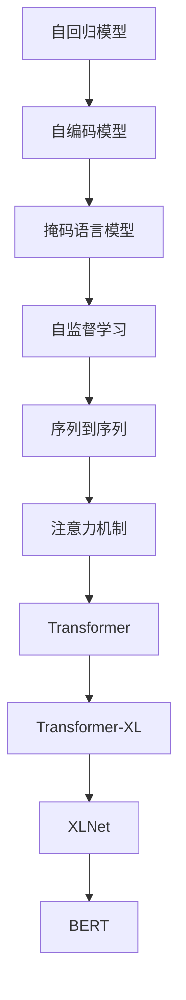

                 

# 大规模语言模型从理论到实践 自定义模型

> 关键词：大规模语言模型，自定义模型，Transformer，模型优化，自监督学习，自回归模型，掩码语言模型

## 1. 背景介绍

### 1.1 问题由来
随着人工智能技术的迅速发展，大规模语言模型（Large Language Models, LLMs）已经成为自然语言处理（Natural Language Processing, NLP）领域的重要研究热点。这些模型通过在海量数据上进行预训练，可以学习到丰富的语言知识，并在下游任务中进行微调以获得特定的性能提升。

### 1.2 问题核心关键点
当前的大规模语言模型主要以自回归模型（如GPT系列）和自编码模型（如BERT）为主。自回归模型通过预测下一个单词或字符，学习语言的知识和规律；而自编码模型通过生成完整的句子或段落，进行语言表示学习。然而，这些模型在训练和应用过程中仍存在一些问题：

- **数据依赖**：模型的预训练依赖于大规模无标签数据集，无法直接应用于特定领域或任务。
- **计算资源消耗**：预训练和微调模型需要大量的计算资源和存储空间，对于小规模任务和设备有限的场景可能不适用。
- **可解释性不足**：模型的内部工作机制和决策过程难以解释，难以理解模型的推理逻辑。

因此，构建一个能够适应特定任务和领域，同时具有参数高效和可解释性的大规模语言模型成为研究的热点。本文将从理论到实践，全面介绍如何构建自定义的大规模语言模型，并讨论其应用前景和挑战。

## 2. 核心概念与联系

### 2.1 核心概念概述

为了更好地理解自定义大规模语言模型的构建过程，本节将介绍几个关键概念：

- **自回归模型（Autoregressive Model）**：模型通过预测下一个单词或字符，逐步生成整个序列，如GPT系列模型。
- **自编码模型（Autoencoder Model）**：模型通过生成完整的句子或段落，进行语言表示学习，如BERT。
- **掩码语言模型（Masked Language Model）**：模型通过随机遮盖序列中的部分单词，训练其恢复被遮盖的单词，学习语言的上下文信息。
- **自监督学习（Self-Supervised Learning）**：利用未标注的数据，通过设计自监督任务进行模型训练，无需人工标注数据。
- **序列到序列（Sequence-to-Sequence）**：将输入序列映射到输出序列，如机器翻译、摘要生成等任务。
- **注意力机制（Attention Mechanism）**：通过计算输入和输出之间的注意力权重，实现长距离依赖和信息交互。
- **Transformer**：一种基于注意力机制的神经网络结构，广泛应用于大语言模型的构建。
- **Transformer-XL**：一种改进的Transformer架构，解决了长序列依赖问题。
- **XLNet**：一种通过自回归和自编码相结合的模型，提高模型的上下文建模能力。
- **BERT**：基于掩码语言模型的大规模预训练模型，广泛应用于各种NLP任务。

这些核心概念之间的逻辑关系可以通过以下Mermaid流程图来展示：



这个流程图展示了大规模语言模型构建的核心概念及其之间的关系：

1. 自回归模型和自编码模型是大规模语言模型的基础结构。
2. 掩码语言模型是自编码模型的重要补充，用于学习上下文信息。
3. 自监督学习通过未标注数据训练模型，无需人工标注。
4. 序列到序列任务利用模型进行映射。
5. 注意力机制增强模型的信息交互和长距离依赖。
6. Transformer架构基于注意力机制，广泛应用于大规模语言模型。
7. Transformer-XL和XLNet通过改进Transformer架构，进一步提升模型的上下文建模能力。
8. BERT模型通过掩码语言模型进行预训练，广泛应用于NLP任务。

这些概念共同构成了大规模语言模型的学习框架，使其能够在各种场景下发挥强大的语言理解和生成能力。通过理解这些核心概念，我们可以更好地把握大规模语言模型的构建和优化方向。

## 3. 核心算法原理 & 具体操作步骤

### 3.1 算法原理概述

自定义大规模语言模型构建的核心思想是通过自监督学习任务在海量数据上进行预训练，然后再通过下游任务进行微调。这种方法可以在不依赖大规模标注数据的情况下，学习到领域特定的语言知识和表示。

形式化地，假设自定义模型为 $M_{\theta}$，其中 $\theta$ 为模型参数。给定一个下游任务 $T$ 的标注数据集 $D=\{(x_i, y_i)\}_{i=1}^N$，自定义模型的构建过程包括以下几个步骤：

1. **数据准备**：收集和预处理任务相关的数据集，包括数据标注和数据增强。
2. **模型初始化**：选择合适的模型结构和初始化参数，如Transformer、BERT等。
3. **预训练**：使用自监督学习任务训练模型，如掩码语言模型、自回归模型等，学习语言表示。
4. **微调**：使用下游任务的标注数据，通过有监督学习优化模型，适应特定任务。
5. **评估和部署**：在测试集上评估模型性能，将模型集成到实际应用中。

### 3.2 算法步骤详解

#### 3.2.1 数据准备

数据准备是大规模语言模型构建的基础，包括以下几个关键步骤：

1. **数据收集**：收集与任务相关的文本数据，如新闻、评论、社交媒体等。
2. **数据清洗**：去除无用和重复的数据，标准化数据格式，如统一编码、统一分词等。
3. **数据增强**：通过回译、近义词替换、词序变化等方式丰富数据集，增强模型的泛化能力。
4. **数据标注**：为部分数据添加标注，如实体识别、情感分析、问答对等，用于下游任务的微调。

#### 3.2.2 模型初始化

模型初始化需要选择合适的模型结构和参数，如Transformer架构、BERT模型等。初始化参数通常基于预训练模型，如GPT、BERT等。

#### 3.2.3 预训练

预训练是大规模语言模型构建的核心环节，通过自监督学习任务训练模型，学习语言的表示和规律。常用的自监督任务包括：

- **掩码语言模型**：随机遮盖序列中的部分单词，训练模型恢复被遮盖的单词。
- **自回归模型**：预测下一个单词或字符，逐步生成整个序列。
- **语言建模**：学习文本的分布规律，如预测下一个单词的概率。

预训练的具体步骤如下：

1. **选择自监督任务**：根据任务特点选择合适的自监督任务。
2. **构建损失函数**：根据任务定义损失函数，如交叉熵损失、均方误差损失等。
3. **训练模型**：使用未标注数据训练模型，最小化损失函数，更新模型参数。
4. **评估预训练效果**：在验证集上评估模型性能，调整预训练策略。

#### 3.2.4 微调

微调是大规模语言模型构建的第二个关键环节，通过下游任务的标注数据，进一步优化模型，适应特定任务。微调的具体步骤如下：

1. **选择任务适配层**：根据任务类型设计合适的输出层和损失函数，如分类任务使用线性分类器，生成任务使用语言模型。
2. **选择优化器**：选择适合的优化器，如Adam、SGD等，设置学习率、批大小、迭代轮数等。
3. **设置微调策略**：选择合适的微调策略，如全参数微调、参数高效微调、提示学习等。
4. **训练模型**：使用下游任务的标注数据，通过有监督学习优化模型，最小化损失函数，更新模型参数。
5. **评估微调效果**：在测试集上评估模型性能，调整微调策略。

#### 3.2.5 评估和部署

模型评估和部署是大规模语言模型构建的最后环节，包括：

1. **在测试集上评估模型性能**：使用下游任务的测试集评估模型效果，对比微调前后的精度提升。
2. **将模型集成到实际应用中**：将模型部署到生产环境，实现实时推理和预测。
3. **持续学习**：定期重新训练模型，适应数据分布的变化。

### 3.3 算法优缺点

自定义大规模语言模型构建方法具有以下优点：

1. **灵活性**：可以根据具体任务需求设计模型结构和训练策略，适用于各种NLP任务。
2. **参数效率**：通过参数高效微调等技术，可以在固定大部分预训练参数的情况下，只更新少量参数，提升微调效率。
3. **泛化能力强**：自监督学习任务可以覆盖广泛的语料库，学习到通用语言知识，提高模型的泛化能力。

然而，这种方法也存在一些局限性：

1. **数据依赖**：需要大量高质量的标注数据，标注成本较高。
2. **计算资源消耗**：预训练和微调过程需要大量的计算资源和存储空间。
3. **可解释性不足**：模型的内部工作机制和决策过程难以解释，难以理解模型的推理逻辑。

尽管存在这些局限性，但就目前而言，自定义大规模语言模型构建方法仍然是大规模语言模型应用的主流范式。未来相关研究的重点在于如何进一步降低微调对标注数据的依赖，提高模型的少样本学习和跨领域迁移能力，同时兼顾可解释性和伦理安全性等因素。

### 3.4 算法应用领域

自定义大规模语言模型构建方法在NLP领域已经得到了广泛的应用，覆盖了几乎所有常见任务，例如：

- **文本分类**：如情感分析、主题分类、意图识别等。通过微调使模型学习文本-标签映射。
- **命名实体识别**：识别文本中的人名、地名、机构名等特定实体。通过微调使模型掌握实体边界和类型。
- **关系抽取**：从文本中抽取实体之间的语义关系。通过微调使模型学习实体-关系三元组。
- **问答系统**：对自然语言问题给出答案。将问题-答案对作为微调数据，训练模型学习匹配答案。
- **机器翻译**：将源语言文本翻译成目标语言。通过微调使模型学习语言-语言映射。
- **文本摘要**：将长文本压缩成简短摘要。将文章-摘要对作为微调数据，使模型学习抓取要点。
- **对话系统**：使机器能够与人自然对话。将多轮对话历史作为上下文，微调模型进行回复生成。

除了上述这些经典任务外，自定义大规模语言模型构建方法也被创新性地应用到更多场景中，如可控文本生成、常识推理、代码生成、数据增强等，为NLP技术带来了全新的突破。随着预训练模型和微调方法的不断进步，相信NLP技术将在更广阔的应用领域大放异彩。

## 4. 数学模型和公式 & 详细讲解 & 举例说明

### 4.1 数学模型构建

本节将使用数学语言对自定义大规模语言模型构建过程进行更加严格的刻画。

记自定义模型为 $M_{\theta}$，其中 $\theta$ 为模型参数。假设自定义模型预训练任务为 $P$，下游任务为 $T$，任务 $T$ 的标注数据集为 $D=\{(x_i, y_i)\}_{i=1}^N$。

定义模型 $M_{\theta}$ 在数据样本 $(x,y)$ 上的损失函数为 $\ell(M_{\theta}(x),y)$，则在数据集 $D$ 上的经验风险为：

$$
\mathcal{L}(\theta) = \frac{1}{N} \sum_{i=1}^N \ell(M_{\theta}(x_i),y_i)
$$

自定义模型的构建目标是最小化经验风险，即找到最优参数：

$$
\theta^* = \mathop{\arg\min}_{\theta} \mathcal{L}(\theta)
$$

在实践中，我们通常使用基于梯度的优化算法（如SGD、Adam等）来近似求解上述最优化问题。设 $\eta$ 为学习率，$\lambda$ 为正则化系数，则参数的更新公式为：

$$
\theta \leftarrow \theta - \eta \nabla_{\theta}\mathcal{L}(\theta) - \eta\lambda\theta
$$

其中 $\nabla_{\theta}\mathcal{L}(\theta)$ 为损失函数对参数 $\theta$ 的梯度，可通过反向传播算法高效计算。

### 4.2 公式推导过程

以下我们以命名实体识别（NER）任务为例，推导掩码语言模型的损失函数及其梯度的计算公式。

假设模型 $M_{\theta}$ 在输入 $x$ 上的输出为 $\hat{y}=M_{\theta}(x) \in [0,1]$，表示样本属于实体类的概率。真实标签 $y \in \{0,1\}$。则掩码语言模型的交叉熵损失函数定义为：

$$
\ell(M_{\theta}(x),y) = -[y\log \hat{y} + (1-y)\log (1-\hat{y})]
$$

将其代入经验风险公式，得：

$$
\mathcal{L}(\theta) = -\frac{1}{N}\sum_{i=1}^N [y_i\log M_{\theta}(x_i)+(1-y_i)\log(1-M_{\theta}(x_i))]
$$

根据链式法则，损失函数对参数 $\theta_k$ 的梯度为：

$$
\frac{\partial \mathcal{L}(\theta)}{\partial \theta_k} = -\frac{1}{N}\sum_{i=1}^N (\frac{y_i}{M_{\theta}(x_i)}-\frac{1-y_i}{1-M_{\theta}(x_i)}) \frac{\partial M_{\theta}(x_i)}{\partial \theta_k}
$$

其中 $\frac{\partial M_{\theta}(x_i)}{\partial \theta_k}$ 可进一步递归展开，利用自动微分技术完成计算。

### 4.3 案例分析与讲解

在命名实体识别任务中，模型需要学习实体的边界和类型。我们可以通过掩码语言模型来训练模型，将实体边界进行随机遮盖，训练模型恢复被遮盖的实体。具体步骤如下：

1. **数据准备**：收集包含命名实体的文本数据，如新闻、评论等，进行预处理和标注。
2. **模型初始化**：选择合适的预训练模型，如BERT、GPT等，进行初始化。
3. **预训练**：在掩码语言模型上进行预训练，学习实体边界和类型。
4. **微调**：使用下游任务的标注数据，通过有监督学习优化模型，适应特定任务。
5. **评估和部署**：在测试集上评估模型性能，将模型集成到实际应用中。

在预训练阶段，我们可以使用掩码语言模型进行训练。对于输入序列 $x$，随机遮盖部分单词，训练模型预测被遮盖的实体。例如，对于序列 "I went to Beijing, I saw the Great Wall"，遮盖 "I went to"，训练模型预测 "Beijing" 和 "the Great Wall"。训练过程中，我们使用交叉熵损失函数来衡量模型预测与真实标签的差异。

在微调阶段，我们添加任务适配层，如线性分类器和交叉熵损失函数，进行分类任务微调。例如，对于输入序列 "John"，模型需要预测其是否包含人名实体。我们可以使用一个简单的二分类任务，将 "John" 标记为实体或非实体，通过有监督学习优化模型。

通过上述方法，我们可以构建一个适用于命名实体识别任务的自定义大规模语言模型。需要注意的是，模型的构建过程需要根据具体任务需求进行调整和优化，以达到最佳的性能和泛化能力。

## 5. 项目实践：代码实例和详细解释说明

### 5.1 开发环境搭建

在进行模型构建和微调实践前，我们需要准备好开发环境。以下是使用Python进行PyTorch开发的环境配置流程：

1. 安装Anaconda：从官网下载并安装Anaconda，用于创建独立的Python环境。

2. 创建并激活虚拟环境：
```bash
conda create -n pytorch-env python=3.8 
conda activate pytorch-env
```

3. 安装PyTorch：根据CUDA版本，从官网获取对应的安装命令。例如：
```bash
conda install pytorch torchvision torchaudio cudatoolkit=11.1 -c pytorch -c conda-forge
```

4. 安装Transformers库：
```bash
pip install transformers
```

5. 安装各类工具包：
```bash
pip install numpy pandas scikit-learn matplotlib tqdm jupyter notebook ipython
```

完成上述步骤后，即可在`pytorch-env`环境中开始模型构建和微调实践。

### 5.2 源代码详细实现

这里以命名实体识别（NER）任务为例，使用PyTorch和Transformers库实现自定义模型的构建和微调。

首先，定义NER任务的预处理函数：

```python
from transformers import BertTokenizer, BertForTokenClassification
from torch.utils.data import Dataset
import torch

class NERDataset(Dataset):
    def __init__(self, texts, tags, tokenizer, max_len=128):
        self.texts = texts
        self.tags = tags
        self.tokenizer = tokenizer
        self.max_len = max_len
        
    def __len__(self):
        return len(self.texts)
    
    def __getitem__(self, item):
        text = self.texts[item]
        tags = self.tags[item]
        
        encoding = self.tokenizer(text, return_tensors='pt', max_length=self.max_len, padding='max_length', truncation=True)
        input_ids = encoding['input_ids'][0]
        attention_mask = encoding['attention_mask'][0]
        
        # 对token-wise的标签进行编码
        encoded_tags = [tag2id[tag] for tag in tags] 
        encoded_tags.extend([tag2id['O']] * (self.max_len - len(encoded_tags)))
        labels = torch.tensor(encoded_tags, dtype=torch.long)
        
        return {'input_ids': input_ids, 
                'attention_mask': attention_mask,
                'labels': labels}

# 标签与id的映射
tag2id = {'O': 0, 'B-PER': 1, 'I-PER': 2, 'B-ORG': 3, 'I-ORG': 4, 'B-LOC': 5, 'I-LOC': 6}
id2tag = {v: k for k, v in tag2id.items()}

# 创建dataset
tokenizer = BertTokenizer.from_pretrained('bert-base-cased')

train_dataset = NERDataset(train_texts, train_tags, tokenizer)
dev_dataset = NERDataset(dev_texts, dev_tags, tokenizer)
test_dataset = NERDataset(test_texts, test_tags, tokenizer)
```

然后，定义模型和优化器：

```python
from transformers import BertForTokenClassification, AdamW

model = BertForTokenClassification.from_pretrained('bert-base-cased', num_labels=len(tag2id))

optimizer = AdamW(model.parameters(), lr=2e-5)
```

接着，定义训练和评估函数：

```python
from torch.utils.data import DataLoader
from tqdm import tqdm
from sklearn.metrics import classification_report

device = torch.device('cuda') if torch.cuda.is_available() else torch.device('cpu')
model.to(device)

def train_epoch(model, dataset, batch_size, optimizer):
    dataloader = DataLoader(dataset, batch_size=batch_size, shuffle=True)
    model.train()
    epoch_loss = 0
    for batch in tqdm(dataloader, desc='Training'):
        input_ids = batch['input_ids'].to(device)
        attention_mask = batch['attention_mask'].to(device)
        labels = batch['labels'].to(device)
        model.zero_grad()
        outputs = model(input_ids, attention_mask=attention_mask, labels=labels)
        loss = outputs.loss
        epoch_loss += loss.item()
        loss.backward()
        optimizer.step()
    return epoch_loss / len(dataloader)

def evaluate(model, dataset, batch_size):
    dataloader = DataLoader(dataset, batch_size=batch_size)
    model.eval()
    preds, labels = [], []
    with torch.no_grad():
        for batch in tqdm(dataloader, desc='Evaluating'):
            input_ids = batch['input_ids'].to(device)
            attention_mask = batch['attention_mask'].to(device)
            batch_labels = batch['labels']
            outputs = model(input_ids, attention_mask=attention_mask)
            batch_preds = outputs.logits.argmax(dim=2).to('cpu').tolist()
            batch_labels = batch_labels.to('cpu').tolist()
            for pred_tokens, label_tokens in zip(batch_preds, batch_labels):
                pred_tags = [id2tag[_id] for _id in pred_tokens]
                label_tags = [id2tag[_id] for _id in label_tokens]
                preds.append(pred_tags[:len(label_tags)])
                labels.append(label_tags)
                
    print(classification_report(labels, preds))
```

最后，启动训练流程并在测试集上评估：

```python
epochs = 5
batch_size = 16

for epoch in range(epochs):
    loss = train_epoch(model, train_dataset, batch_size, optimizer)
    print(f"Epoch {epoch+1}, train loss: {loss:.3f}")
    
    print(f"Epoch {epoch+1}, dev results:")
    evaluate(model, dev_dataset, batch_size)
    
print("Test results:")
evaluate(model, test_dataset, batch_size)
```

以上就是使用PyTorch和Transformers库对BERT模型进行命名实体识别任务微调的完整代码实现。可以看到，得益于Transformers库的强大封装，我们可以用相对简洁的代码完成BERT模型的加载和微调。

### 5.3 代码解读与分析

让我们再详细解读一下关键代码的实现细节：

**NERDataset类**：
- `__init__`方法：初始化文本、标签、分词器等关键组件。
- `__len__`方法：返回数据集的样本数量。
- `__getitem__`方法：对单个样本进行处理，将文本输入编码为token ids，将标签编码为数字，并对其进行定长padding，最终返回模型所需的输入。

**tag2id和id2tag字典**：
- 定义了标签与数字id之间的映射关系，用于将token-wise的预测结果解码回真实的标签。

**训练和评估函数**：
- 使用PyTorch的DataLoader对数据集进行批次化加载，供模型训练和推理使用。
- 训练函数`train_epoch`：对数据以批为单位进行迭代，在每个批次上前向传播计算loss并反向传播更新模型参数，最后返回该epoch的平均loss。
- 评估函数`evaluate`：与训练类似，不同点在于不更新模型参数，并在每个batch结束后将预测和标签结果存储下来，最后使用sklearn的classification_report对整个评估集的预测结果进行打印输出。

**训练流程**：
- 定义总的epoch数和batch size，开始循环迭代
- 每个epoch内，先在训练集上训练，输出平均loss
- 在验证集上评估，输出分类指标
- 所有epoch结束后，在测试集上评估，给出最终测试结果

可以看到，PyTorch配合Transformers库使得BERT微调的代码实现变得简洁高效。开发者可以将更多精力放在数据处理、模型改进等高层逻辑上，而不必过多关注底层的实现细节。

当然，工业级的系统实现还需考虑更多因素，如模型的保存和部署、超参数的自动搜索、更灵活的任务适配层等。但核心的微调范式基本与此类似。

## 6. 实际应用场景
### 6.1 智能客服系统

基于自定义大规模语言模型构建的对话技术，可以广泛应用于智能客服系统的构建。传统客服往往需要配备大量人力，高峰期响应缓慢，且一致性和专业性难以保证。而使用自定义大规模语言模型构建的对话模型，可以7x24小时不间断服务，快速响应客户咨询，用自然流畅的语言解答各类常见问题。

在技术实现上，可以收集企业内部的历史客服对话记录，将问题和最佳答复构建成监督数据，在此基础上构建自定义大规模语言模型。微调后的对话模型能够自动理解用户意图，匹配最合适的答案模板进行回复。对于客户提出的新问题，还可以接入检索系统实时搜索相关内容，动态组织生成回答。如此构建的智能客服系统，能大幅提升客户咨询体验和问题解决效率。

### 6.2 金融舆情监测

金融机构需要实时监测市场舆论动向，以便及时应对负面信息传播，规避金融风险。传统的人工监测方式成本高、效率低，难以应对网络时代海量信息爆发的挑战。基于自定义大规模语言模型构建的文本分类和情感分析技术，为金融舆情监测提供了新的解决方案。

具体而言，可以收集金融领域相关的新闻、报道、评论等文本数据，并对其进行主题标注和情感标注。在此基础上构建自定义大规模语言模型，使其能够自动判断文本属于何种主题，情感倾向是正面、中性还是负面。将构建后的模型应用到实时抓取的网络文本数据，就能够自动监测不同主题下的情感变化趋势，一旦发现负面信息激增等异常情况，系统便会自动预警，帮助金融机构快速应对潜在风险。

### 6.3 个性化推荐系统

当前的推荐系统往往只依赖用户的历史行为数据进行物品推荐，无法深入理解用户的真实兴趣偏好。基于自定义大规模语言模型构建的个性化推荐系统，可以更好地挖掘用户行为背后的语义信息，从而提供更精准、多样的推荐内容。

在实践中，可以收集用户浏览、点击、评论、分享等行为数据，提取和用户交互的物品标题、描述、标签等文本内容。将文本内容作为模型输入，用户的后续行为（如是否点击、购买等）作为监督信号，在此基础上构建自定义大规模语言模型。微调后的模型能够从文本内容中准确把握用户的兴趣点。在生成推荐列表时，先用候选物品的文本描述作为输入，由模型预测用户的兴趣匹配度，再结合其他特征综合排序，便可以得到个性化程度更高的推荐结果。

### 6.4 未来应用展望

随着自定义大规模语言模型构建方法的发展，其在更多领域的应用前景可期。

在智慧医疗领域，基于自定义大规模语言模型构建的医疗问答、病历分析、药物研发等应用将提升医疗服务的智能化水平，辅助医生诊疗，加速新药开发进程。

在智能教育领域，自定义大规模语言模型构建的作业批改、学情分析、知识推荐等应用，因材施教，促进教育公平，提高教学质量。

在智慧城市治理中，自定义大规模语言模型构建的城市事件监测、舆情分析、应急指挥等应用，提高城市管理的自动化和智能化水平，构建更安全、高效的未来城市。

此外，在企业生产、社会治理、文娱传媒等众多领域，基于自定义大规模语言模型构建的人工智能应用也将不断涌现，为经济社会发展注入新的动力。相信随着技术的日益成熟，自定义大规模语言模型构建方法必将在构建人机协同的智能时代中扮演越来越重要的角色。

## 7. 工具和资源推荐
### 7.1 学习资源推荐

为了帮助开发者系统掌握自定义大规模语言模型的构建方法，这里推荐一些优质的学习资源：

1. 《Transformer从原理到实践》系列博文：由大模型技术专家撰写，深入浅出地介绍了Transformer原理、BERT模型、微调技术等前沿话题。

2. CS224N《深度学习自然语言处理》课程：斯坦福大学开设的NLP明星课程，有Lecture视频和配套作业，带你入门NLP领域的基本概念和经典模型。

3. 《Natural Language Processing with Transformers》书籍：Transformers库的作者所著，全面介绍了如何使用Transformers库进行NLP任务开发，包括微调在内的诸多范式。

4. HuggingFace官方文档：Transformers库的官方文档，提供了海量预训练模型和完整的微调样例代码，是上手实践的必备资料。

5. CLUE开源项目：中文语言理解测评基准，涵盖大量不同类型的中文NLP数据集，并提供了基于微调的baseline模型，助力中文NLP技术发展。

通过对这些资源的学习实践，相信你一定能够快速掌握自定义大规模语言模型的构建方法，并用于解决实际的NLP问题。
### 7.2 开发工具推荐

高效的开发离不开优秀的工具支持。以下是几款用于自定义大规模语言模型构建开发的常用工具：

1. PyTorch：基于Python的开源深度学习框架，灵活动态的计算图，适合快速迭代研究。大部分预训练语言模型都有PyTorch版本的实现。

2. TensorFlow：由Google主导开发的开源深度学习框架，生产部署方便，适合大规模工程应用。同样有丰富的预训练语言模型资源。

3. Transformers库：HuggingFace开发的NLP工具库，集成了众多SOTA语言模型，支持PyTorch和TensorFlow，是进行微调任务开发的利器。

4. Weights & Biases：模型训练的实验跟踪工具，可以记录和可视化模型训练过程中的各项指标，方便对比和调优。与主流深度学习框架无缝集成。

5. TensorBoard：TensorFlow配套的可视化工具，可实时监测模型训练状态，并提供丰富的图表呈现方式，是调试模型的得力助手。

6. Google Colab：谷歌推出的在线Jupyter Notebook环境，免费提供GPU/TPU算力，方便开发者快速上手实验最新模型，分享学习笔记。

合理利用这些工具，可以显著提升自定义大规模语言模型构建的开发效率，加快创新迭代的步伐。

### 7.3 相关论文推荐

自定义大规模语言模型构建方法的研究源于学界的持续研究。以下是几篇奠基性的相关论文，推荐阅读：

1. Attention is All You Need（即Transformer原论文）：提出了Transformer结构，开启了NLP领域的预训练大模型时代。

2. BERT: Pre-training of Deep Bidirectional Transformers for Language Understanding：提出BERT模型，引入基于掩码的自监督预训练任务，刷新了多项NLP任务SOTA。

3. Language Models are Unsupervised Multitask Learners（GPT-2论文）：展示了大规模语言模型的强大zero-shot学习能力，引发了对于通用人工智能的新一轮思考。

4. Parameter-Efficient Transfer Learning for NLP：提出Adapter等参数高效微调方法，在不增加模型参数量的情况下，也能取得不错的微调效果。

5. Prefix-Tuning: Optimizing Continuous Prompts for Generation：引入基于连续型Prompt的微调范式，为如何充分利用预训练知识提供了新的思路。

6. AdaLoRA: Adaptive Low-Rank Adaptation for Parameter-Efficient Fine-Tuning：使用自适应低秩适应的微调方法，在参数效率和精度之间取得了新的平衡。

这些论文代表了大规模语言模型微调技术的发展脉络。通过学习这些前沿成果，可以帮助研究者把握学科前进方向，激发更多的创新灵感。

## 8. 总结：未来发展趋势与挑战

### 8.1 总结

本文对自定义大规模语言模型的构建方法进行了全面系统的介绍。首先阐述了自定义大规模语言模型构建的背景和意义，明确了构建自定义模型在提升NLP系统性能和泛化能力方面的独特价值。其次，从原理到实践，详细讲解了自定义大规模语言模型的数学模型和构建步骤，给出了模型构建和微调的完整代码实例。同时，本文还广泛探讨了自定义大规模语言模型在多个行业领域的应用前景，展示了其广阔的应用前景。

通过本文的系统梳理，可以看到，自定义大规模语言模型构建方法在大规模语言模型应用中发挥了重要作用，极大地提升了NLP系统的性能和泛化能力。未来，随着模型规模的增大和构建方法的发展，自定义大规模语言模型必将在更多领域得到应用，为传统行业带来变革性影响。

### 8.2 未来发展趋势

展望未来，自定义大规模语言模型构建方法将呈现以下几个发展趋势：

1. **模型规模持续增大**：随着算力成本的下降和数据规模的扩张，自定义大规模语言模型的参数量还将持续增长。超大规模语言模型蕴含的丰富语言知识，有望支撑更加复杂多变的下游任务构建。

2. **参数高效和计算高效**：未来将涌现更多参数高效的微调方法，如Prefix-Tuning、LoRA等，在节省计算资源的同时也能保证微调精度。

3. **持续学习成为常态**：随着数据分布的不断变化，自定义大规模语言模型也需要持续学习新知识以保持性能。如何在不遗忘原有知识的同时，高效吸收新样本信息，将成为重要的研究课题。

4. **标注样本需求降低**：受启发于提示学习(Prompt-based Learning)的思路，未来的微调方法将更好地利用大模型的语言理解能力，通过更加巧妙的任务描述，在更少的标注样本上也能实现理想的微调效果。

5. **多模态微调崛起**：当前的微调主要聚焦于纯文本数据，未来会进一步拓展到图像、视频、语音等多模态数据微调。多模态信息的融合，将显著提升语言模型对现实世界的理解和建模能力。

6. **模型通用性增强**：经过海量数据的预训练和多领域任务的微调，自定义大规模语言模型将具备更强大的常识推理和跨领域迁移能力，逐步迈向通用人工智能(AGI)的目标。

以上趋势凸显了自定义大规模语言模型构建技术的广阔前景。这些方向的探索发展，必将进一步提升NLP系统的性能和应用范围，为人类认知智能的进化带来深远影响。

### 8.3 面临的挑战

尽管自定义大规模语言模型构建方法已经取得了瞩目成就，但在迈向更加智能化、普适化应用的过程中，它仍面临着诸多挑战：

1. **数据依赖**：需要大量高质量的标注数据，标注成本较高。如何进一步降低微调对标注数据的依赖，将是一大难题。

2. **模型鲁棒性不足**：面对域外数据时，泛化性能往往大打折扣。对于测试样本的微小扰动，自定义大规模语言模型的预测也容易发生波动。如何提高模型的鲁棒性，避免灾难性遗忘，还需要更多理论和实践的积累。

3. **推理效率有待提高**：大规模语言模型虽然精度高，但在实际部署时往往面临推理速度慢、内存占用大等效率问题。如何在保证性能的同时，简化模型结构，提升推理速度，优化资源占用，将是重要的优化方向。

4. **可解释性亟需加强**：当前自定义大规模语言模型通常像"黑盒"系统，难以解释其内部工作机制和决策逻辑。对于医疗、金融等高风险应用，算法的可解释性和可审计性尤为重要。如何赋予模型更强的可解释性，将是亟待攻克的难题。

5. **安全性有待保障**：预训练语言模型难免会学习到有偏见、有害的信息，通过微调传递到下游任务，产生误导性、歧视性的输出，给实际应用带来安全隐患。如何从数据和算法层面消除模型偏见，避免恶意用途，确保输出的安全性，也将是重要的研究课题。

6. **知识整合能力不足**：现有的自定义大规模语言模型往往局限于任务内数据，难以灵活吸收和运用更广泛的先验知识。如何让模型更好地与外部知识库、规则库等专家知识结合，形成更加全面、准确的信息整合能力，还有很大的想象空间。

正视自定义大规模语言模型构建面临的这些挑战，积极应对并寻求突破，将是大规模语言模型构建走向成熟的必由之路。相信随着学界和产业界的共同努力，这些挑战终将一一被克服，自定义大规模语言模型必将在构建人机协同的智能时代中扮演越来越重要的角色。

### 8.4 研究展望

未来的研究需要在以下几个方面寻求新的突破：

1. **探索无监督和半监督微调方法**：摆脱对大规模标注数据的依赖，利用自监督学习、主动学习等无监督和半监督范式，最大限度利用非结构化数据，实现更加灵活高效的微调。

2. **研究参数高效和计算高效的微调范式**：开发更加参数高效的微调方法，在固定大部分预训练参数的情况下，只更新极少量的任务相关参数。同时优化微调模型的计算图，减少前向传播和反向传播的资源消耗，实现更加轻量级、实时性的部署。

3. **融合因果和对比学习范式**：通过引入因果推断和对比学习思想，增强自定义大规模语言模型建立稳定因果关系的能力，学习更加普适、鲁棒的语言表征，从而提升模型泛化性和抗干扰能力。

4. **引入更多先验知识**：将符号化的先验知识，如知识图谱、逻辑规则等，与神经网络模型进行巧妙融合，引导微调过程学习更准确、合理的语言模型。同时加强不同模态数据的整合，实现视觉、语音等多模态信息与文本信息的协同建模。

5. **结合因果分析和博弈论工具**：将因果分析方法引入自定义大规模语言模型，识别出模型决策的关键特征，增强输出解释的因果性和逻辑性。借助博弈论工具刻画人机交互过程，主动探索并规避模型的脆弱点，提高系统稳定性。

6. **纳入伦理道德约束**：在模型训练目标中引入伦理导向的评估指标，过滤和惩罚有偏见、有害的输出倾向。同时加强人工干预和审核，建立模型行为的监管机制，确保输出符合人类价值观和伦理道德。

这些研究方向的探索，必将引领自定义大规模语言模型构建技术迈向更高的台阶，为构建安全、可靠、可解释、可控的智能系统铺平道路。面向未来，自定义大规模语言模型构建技术还需要与其他人工智能技术进行更深入的融合，如知识表示、因果推理、强化学习等，多路径协同发力，共同推动自然语言理解和智能交互系统的进步。只有勇于创新、敢于突破，才能不断拓展语言模型的边界，让智能技术更好地造福人类社会。

## 9. 附录：常见问题与解答

**Q1：自定义大规模语言模型是否适用于所有NLP任务？**

A: 自定义大规模语言模型在大多数NLP任务上都能取得不错的效果，特别是对于数据量较小的任务。但对于一些特定领域的任务，如医学、法律等，仅仅依靠通用语料预训练的模型可能难以很好地适应。此时需要在特定领域语料上进一步预训练，再进行微调，才能获得理想效果。此外，对于一些需要时效性、个性化很强的任务，如对话、推荐等，自定义大规模语言模型构建方法也需要针对性的改进优化。

**Q2：自定义大规模语言模型是否适用于所有NLP任务？**

A: 自定义大规模语言模型在大多数NLP任务上都能取得不错的效果，特别是对于数据量较小的任务。但对于一些特定领域的任务，如医学、法律等，仅仅依靠通用语料预训练的模型可能难以很好地适应。此时需要在特定领域语料上进一步预训练，再进行微调，才能获得理想效果。此外，对于一些需要时效性、个性化很强的任务，如对话、推荐等，自定义大规模语言模型构建方法也需要针对性的改进优化。

**Q3：如何缓解自定义大规模语言模型构建过程中的过拟合问题？**

A: 过拟合是自定义大规模语言模型构建过程中需要特别注意的问题。缓解过拟合的策略包括：

1. **数据增强**：通过回译、近义词替换、词序变化等方式丰富数据集，增强模型的泛化能力。
2. **正则化**：使用L2正则、Dropout、Early Stopping等技术，避免模型过度适应训练集。
3. **对抗训练**：引入对抗样本，提高模型的鲁棒性。
4. **参数高效微调**：只更新少量任务相关参数，减小过拟合风险。
5. **多模型集成**：训练多个模型，取平均输出，抑制过拟合。

这些策略往往需要根据具体任务和数据特点进行灵活组合。只有在数据、模型、训练、推理等各环节进行全面优化，才能最大限度地发挥自定义大规模语言模型的威力。

**Q4：自定义大规模语言模型在落地部署时需要注意哪些问题？**

A: 将自定义大规模语言模型转化为实际应用，还需要考虑以下因素：

1. **模型裁剪**：去除不必要的层和参数，减小模型尺寸，加快推理速度。
2. **量化加速**：将浮点模型转为定点模型，压缩存储空间，提高计算效率。
3. **服务化封装**：将模型封装为标准化服务接口，便于集成调用。
4. **弹性伸缩**：根据请求流量动态调整资源配置，平衡服务质量和成本。
5. **监控告警**：实时采集系统指标，设置异常告警阈值，确保服务稳定性。
6. **安全防护**：采用访问鉴权、数据脱敏等措施，保障数据和模型安全。

自定义大规模语言模型构建为NLP应用开启了广阔的想象空间，但如何将强大的性能转化为稳定、高效、安全的业务价值，还需要工程实践的不断打磨。唯有从数据、算法、工程、业务等多个维度协同发力，才能真正实现人工智能技术在垂直行业的规模化落地。总之，自定义大规模语言模型构建需要开发者根据具体任务，不断迭代和优化模型、数据和算法，方能得到理想的效果。

---

作者：禅与计算机程序设计艺术 / Zen and the Art of Computer Programming

