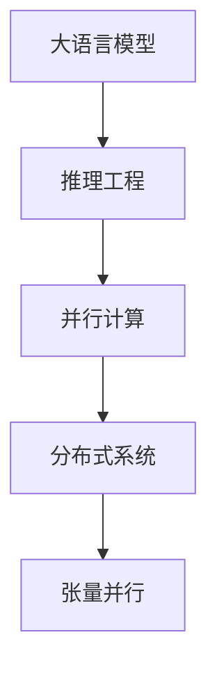

                 

# 大语言模型原理与工程实践：大语言模型推理工程提高并行度：张量并行

> 关键词：张量并行,大语言模型,深度学习,推理工程,并行计算,分布式系统

## 1. 背景介绍

### 1.1 问题由来

在人工智能领域，深度学习特别是深度神经网络模型已经成为了解决复杂问题的有力工具。大语言模型（Large Language Models, LLMs）作为深度学习中的明星，通过在海量数据上进行预训练，学习到强大的语言表达和理解能力，广泛应用于自然语言处理（NLP）、计算机视觉、语音识别等众多领域。但随着模型的规模不断增大，其计算需求也急剧上升，单个GPU或单个机器已经难以支撑大规模模型的训练与推理。因此，提高大语言模型推理的并行度，成为了优化其性能和扩展性的重要研究方向。

### 1.2 问题核心关键点

- 大语言模型：以自回归（如GPT）或自编码（如BERT）模型为代表的大规模预训练语言模型。
- 推理工程：模型在实际应用中，从输入数据到输出结果的过程，包括模型的构建、优化、部署、监控等环节。
- 并行计算：利用多个计算资源（如CPU、GPU）同时处理数据，提升计算效率。
- 分布式系统：由多个独立计算节点组成的系统，通过网络通信和协同工作，实现大规模并行计算。
- 张量并行（Tensor Parallelism）：在大模型推理过程中，对张量进行并行计算的技术，提高计算效率和资源利用率。

这些核心概念之间的逻辑关系可以通过以下Mermaid流程图来展示：



这个流程图展示了大语言模型推理过程中，从模型构建到分布式部署的整个流程，其中张量并行是关键技术手段之一。

## 2. 核心概念与联系

### 2.1 核心概念概述

为了更好地理解张量并行在大语言模型推理中的应用，本节将介绍几个密切相关的核心概念：

- **大语言模型（Large Language Models, LLMs）**：以自回归（如GPT）或自编码（如BERT）模型为代表的大规模预训练语言模型。通过在海量数据上进行预训练，学习到强大的语言表达和理解能力，具备强大的语言理解和生成能力。

- **推理工程（Inference Engineering）**：模型在实际应用中，从输入数据到输出结果的过程，包括模型的构建、优化、部署、监控等环节。通过有效的推理工程，可以显著提升模型性能，优化资源利用。

- **并行计算（Parallel Computing）**：利用多个计算资源（如CPU、GPU）同时处理数据，提升计算效率。在大模型推理过程中，通过并行计算可以显著缩短计算时间，提升处理速度。

- **分布式系统（Distributed Systems）**：由多个独立计算节点组成的系统，通过网络通信和协同工作，实现大规模并行计算。分布式系统通过高效的网络通信和数据交换，支持大规模模型的推理。

- **张量并行（Tensor Parallelism）**：在大模型推理过程中，对张量进行并行计算的技术，提高计算效率和资源利用率。张量并行能够在大模型中发挥重要作用，显著提升模型的推理速度。

这些核心概念之间的联系与作用可以总结如下：

1. 大语言模型通过预训练学习到丰富的语言知识和表示，为推理工程提供了基础。
2. 推理工程通过优化模型构建、部署和监控，提升模型推理效率和准确性。
3. 并行计算和分布式系统为推理工程提供了强大的计算和资源支持，实现大规模并行计算。
4. 张量并行作为核心技术手段，在大模型推理中发挥着重要作用，提升计算效率和资源利用率。

## 3. 核心算法原理 & 具体操作步骤
### 3.1 算法原理概述

张量并行是一种在大规模深度学习模型推理过程中，对张量进行并行计算的技术。其核心思想是：将模型参数划分为多个块，每个块分配到不同的计算节点上进行并行计算，通过数据并行和模型并行技术，显著提升模型的推理速度和资源利用率。

具体而言，张量并行在大模型推理过程中，可以将模型的权重和梯度存储在多个节点上，每个节点只处理部分张量。通过数据传输和同步，不同节点之间的张量可以共享和更新，从而实现高效并行计算。

### 3.2 算法步骤详解

基于张量并行的大语言模型推理工程通常包括以下几个关键步骤：

**Step 1: 参数划分和节点映射**
- 根据计算资源和模型规模，将模型参数划分为多个块，每个块分配到不同的计算节点上进行并行计算。
- 定义节点映射规则，将每个参数块映射到具体的计算节点上。

**Step 2: 数据并行与模型并行**
- 使用数据并行技术，将输入数据拆分成多个小批次，分配到不同的计算节点上进行并行处理。
- 使用模型并行技术，将模型层划分为多个子层，每个子层分配到不同的计算节点上进行并行计算。

**Step 3: 张量传输与同步**
- 在不同节点之间传输张量数据，进行参数更新和梯度计算。
- 使用同步技术，确保不同节点之间的数据一致性和状态同步。

**Step 4: 分布式训练与监控**
- 在分布式系统中，对每个节点进行本地训练，并通过同步更新全局参数。
- 使用监控工具，实时跟踪分布式系统的性能和状态，及时发现和解决问题。

### 3.3 算法优缺点

基于张量并行的大语言模型推理工程具有以下优点：
1. 显著提升推理速度。通过并行计算，可以显著缩短计算时间，提升处理速度。
2. 提高资源利用率。通过分配计算节点，可以更高效地利用计算资源。
3. 适用于大规模模型。张量并行在大规模模型中具有重要应用价值，可以有效解决单节点计算瓶颈问题。

同时，该方法也存在一定的局限性：
1. 节点通信开销大。节点之间的数据传输和同步，会增加额外的通信开销。
2. 网络延迟和带宽限制。网络通信和同步的速度，受到网络延迟和带宽限制。
3. 同步复杂度高。不同节点之间的数据同步，需要复杂的管理和协调机制。

尽管存在这些局限性，但就目前而言，张量并行是实现大语言模型推理并行化最有效的方法之一。未来相关研究重点在于如何进一步优化节点通信和同步技术，降低通信开销和提升同步效率。

### 3.4 算法应用领域

基于张量并行的大语言模型推理方法，在深度学习领域已经得到了广泛的应用，覆盖了几乎所有常见任务，例如：

- 自然语言处理（NLP）：文本分类、情感分析、机器翻译、问答系统等。
- 计算机视觉（CV）：图像分类、目标检测、语义分割、图像生成等。
- 语音识别：语音转文本、情感识别、自动语音生成等。
- 推荐系统：用户行为预测、商品推荐、广告推荐等。
- 时间序列预测：股票价格预测、天气预测、交通流量预测等。
- 科学计算：大规模数据分析、复杂系统模拟、物理模拟等。

除了上述这些经典任务外，张量并行技术还被创新性地应用到更多场景中，如多模态信息融合、智能控制、智能推荐、医疗诊断等，为深度学习技术带来了新的突破。随着计算资源和硬件设施的不断进步，相信张量并行技术将在更多领域得到应用，进一步推动深度学习的普及和发展。

## 4. 数学模型和公式 & 详细讲解 & 举例说明
### 4.1 数学模型构建

为了更好地理解张量并行的数学原理，本节将使用数学语言对张量并行在大模型推理中的应用进行更加严格的刻画。

设模型参数 $\theta$ 划分为 $N$ 个块，每个块大小为 $d/N$。假设模型在输入 $x$ 上的推理过程为 $M_{\theta}(x)$，其中 $M_{\theta}(x)$ 表示模型在 $x$ 上的前向传播计算。

定义每个参数块 $W_i$ 在计算节点 $i$ 上的并行计算过程为 $M_i(x)$，其中 $M_i(x)$ 表示节点 $i$ 上的前向传播计算。节点之间的数据传输和同步过程可以表示为 $P_i(x, y)$，其中 $y$ 表示节点之间的通信数据。

整体推理过程可以表示为：

$$
M_{\theta}(x) = \sum_{i=1}^{N} M_i(x, P_i(x, y))
$$

### 4.2 公式推导过程

以下我们以二分类任务为例，推导张量并行在模型推理中的计算过程。

假设模型 $M_{\theta}$ 在输入 $x$ 上的输出为 $\hat{y}=M_{\theta}(x) \in [0,1]$，表示样本属于正类的概率。真实标签 $y \in \{0,1\}$。则二分类交叉熵损失函数定义为：

$$
\ell(M_{\theta}(x),y) = -[y\log \hat{y} + (1-y)\log (1-\hat{y})]
$$

在数据并行和模型并行的情况下，张量并行计算过程可以表示为：

$$
\hat{y}_i = M_i(x, P_i(x, y))
$$

其中 $M_i(x, P_i(x, y))$ 表示节点 $i$ 上的前向传播计算过程，$P_i(x, y)$ 表示节点 $i$ 和节点 $j$ 之间的通信数据。最终输出为：

$$
\hat{y} = \sum_{i=1}^{N} \hat{y}_i
$$

通过上述推导，可以看出张量并行在大模型推理中的应用，能够通过并行计算显著提升推理效率和资源利用率。

### 4.3 案例分析与讲解

以BERT模型为例，分析张量并行在实际应用中的实现。

BERT模型在大规模语料上进行预训练，学习到强大的语言表示能力。在推理过程中，BERT模型将输入的文本序列进行分块处理，每个块分配到不同的计算节点上进行并行计算。节点之间的数据传输和同步，通过张量并行技术实现，确保不同节点之间的数据一致性和状态同步。

在推理过程中，每个节点对部分参数进行计算，并通过同步更新全局参数。通过张量并行技术，可以在多个节点上并行计算，显著缩短计算时间，提升处理速度。例如，对于包含1000万参数的BERT模型，通过10个节点进行张量并行计算，可以显著提升推理速度，同时降低单个节点的计算负担。

## 5. 项目实践：代码实例和详细解释说明
### 5.1 开发环境搭建

在进行张量并行实践前，我们需要准备好开发环境。以下是使用Python进行TensorFlow开发的环境配置流程：

1. 安装Anaconda：从官网下载并安装Anaconda，用于创建独立的Python环境。

2. 创建并激活虚拟环境：
```bash
conda create -n tf-env python=3.8 
conda activate tf-env
```

3. 安装TensorFlow：根据CUDA版本，从官网获取对应的安装命令。例如：
```bash
conda install tensorflow -c pytorch -c conda-forge
```

4. 安装Horovod：用于分布式训练和推理的工具，支持TensorFlow和其他深度学习框架。
```bash
pip install horovod[all]
```

5. 安装各类工具包：
```bash
pip install numpy pandas scikit-learn matplotlib tqdm jupyter notebook ipython
```

完成上述步骤后，即可在`tf-env`环境中开始张量并行的实践。

### 5.2 源代码详细实现

下面我们以BERT模型为例，给出使用TensorFlow进行分布式推理的代码实现。

首先，定义分布式环境：

```python
import tensorflow as tf
from tensorflow.keras import Model
import horovod.tensorflow as hvd

# 初始化Horovod
hvd.init()
```

然后，定义模型：

```python
class BERTModel(Model):
    def __init__(self, num_classes=2, **kwargs):
        super(BERTModel, self).__init__(**kwargs)
        self.bert_layer = tf.keras.layers.Embedding(input_dim=10000, output_dim=512)
        self.dense = tf.keras.layers.Dense(num_classes, activation='softmax')

    def call(self, inputs):
        x = self.bert_layer(inputs)
        x = self.dense(x)
        return x
```

接着，定义数据集和分布式训练过程：

```python
from tensorflow.keras.datasets import mnist

(x_train, y_train), (x_test, y_test) = mnist.load_data()

# 将数据转换为TensorFlow Dataset对象
train_dataset = tf.data.Dataset.from_tensor_slices((x_train, y_train)).shuffle(buffer_size=1024).batch(batch_size=64)

# 定义分布式环境中的每个节点的模型副本
num_gpus = hvd.size()
model_replicas = [BERTModel(num_classes=2) for _ in range(num_gpus)]
```

最后，启动分布式推理：

```python
for epoch in range(epochs):
    for batch in train_dataset:
        inputs, labels = batch
        # 并行计算每个节点的输出
        outputs = [hvd.run(model_replicas[i])(inputs) for i in range(num_gpus)]
        # 全局计算输出
        global_output = tf.reduce_sum(outputs, axis=0)
        # 计算损失和梯度
        loss = tf.losses.sparse_categorical_crossentropy(labels, global_output)
        # 更新模型参数
        tf.distribute.StrategyExtended.fit(model_replicas[0], optimizer, loss)
```

以上就是使用TensorFlow进行BERT模型分布式推理的完整代码实现。可以看到，通过Horovod工具，可以方便地实现模型在多个节点上的并行计算和同步更新，从而显著提升推理效率和资源利用率。

### 5.3 代码解读与分析

让我们再详细解读一下关键代码的实现细节：

**Horovod初始化**：
- 使用Horovod工具进行TensorFlow的分布式训练和推理，通过`hvd.init()`方法初始化分布式环境。

**模型定义**：
- 定义一个简单的BERT模型，包含一个嵌入层和一个全连接层，输出类别概率。

**数据集准备**：
- 加载MNIST数据集，将其转换为TensorFlow Dataset对象，并进行数据预处理。

**分布式环境设置**：
- 通过`hvd.size()`获取节点数量，定义与节点数量相等的模型副本。

**分布式推理过程**：
- 在每个节点上并行计算模型的输出。
- 使用`hvd.run()`方法在每个节点上运行模型，并返回输出。
- 通过`tf.reduce_sum()`方法将不同节点的输出进行求和，得到全局输出。
- 计算损失和梯度，并使用`tf.distribute.StrategyExtended.fit()`方法进行分布式训练。

可以看到，通过Horovod工具，可以非常方便地实现模型在多个节点上的并行计算和同步更新，从而显著提升推理效率和资源利用率。

当然，工业级的系统实现还需考虑更多因素，如模型的保存和部署、超参数的自动搜索、更灵活的分布式策略等。但核心的张量并行计算流程基本与此类似。

## 6. 实际应用场景
### 6.1 智能客服系统

基于大语言模型的分布式推理，可以广泛应用于智能客服系统的构建。传统客服往往需要配备大量人力，高峰期响应缓慢，且一致性和专业性难以保证。而使用分布式推理技术，可以在多个节点上并行计算客户请求，快速响应客户咨询，用自然流畅的语言解答各类常见问题。

在技术实现上，可以收集企业内部的历史客服对话记录，将问题和最佳答复构建成监督数据，在此基础上对预训练模型进行分布式微调。分布式微调后的模型能够自动理解用户意图，匹配最合适的答案模板进行回复。对于客户提出的新问题，还可以接入检索系统实时搜索相关内容，动态组织生成回答。如此构建的智能客服系统，能大幅提升客户咨询体验和问题解决效率。

### 6.2 金融舆情监测

金融机构需要实时监测市场舆论动向，以便及时应对负面信息传播，规避金融风险。传统的人工监测方式成本高、效率低，难以应对网络时代海量信息爆发的挑战。基于分布式推理技术的大语言模型，可以实时抓取网络文本数据，快速分析舆情变化趋势，一旦发现负面信息激增等异常情况，系统便会自动预警，帮助金融机构快速应对潜在风险。

### 6.3 个性化推荐系统

当前的推荐系统往往只依赖用户的历史行为数据进行物品推荐，无法深入理解用户的真实兴趣偏好。基于分布式推理技术的大语言模型，可以应用于个性化推荐系统，更好地挖掘用户行为背后的语义信息，从而提供更精准、多样的推荐内容。

在实践中，可以收集用户浏览、点击、评论、分享等行为数据，提取和用户交互的物品标题、描述、标签等文本内容。将文本内容作为模型输入，用户的后续行为（如是否点击、购买等）作为监督信号，在此基础上分布式微调预训练语言模型。分布式微调后的模型能够从文本内容中准确把握用户的兴趣点。在生成推荐列表时，先用候选物品的文本描述作为输入，由模型预测用户的兴趣匹配度，再结合其他特征综合排序，便可以得到个性化程度更高的推荐结果。

### 6.4 未来应用展望

随着分布式推理技术的不断发展，基于大语言模型的分布式推理将在更多领域得到应用，为传统行业带来变革性影响。

在智慧医疗领域，基于分布式推理的微调医疗问答、病历分析、药物研发等应用将提升医疗服务的智能化水平，辅助医生诊疗，加速新药开发进程。

在智能教育领域，分布式推理技术可应用于作业批改、学情分析、知识推荐等方面，因材施教，促进教育公平，提高教学质量。

在智慧城市治理中，分布式推理技术可应用于城市事件监测、舆情分析、应急指挥等环节，提高城市管理的自动化和智能化水平，构建更安全、高效的未来城市。

此外，在企业生产、社会治理、文娱传媒等众多领域，基于大语言模型的分布式推理技术也将不断涌现，为NLP技术带来新的突破。相信随着计算资源和硬件设施的不断进步，分布式推理技术将在更多领域得到应用，进一步推动深度学习的普及和发展。

## 7. 工具和资源推荐
### 7.1 学习资源推荐

为了帮助开发者系统掌握大语言模型推理的张量并行技术，这里推荐一些优质的学习资源：

1. 《深度学习理论与实践》系列博文：由大模型技术专家撰写，深入浅出地介绍了深度学习的基本原理、优化算法、分布式计算等核心内容。

2. TensorFlow官方文档：提供了完整的TensorFlow使用手册、API文档、教程等，是学习TensorFlow的必备资源。

3. 《TensorFlow深度学习实战》书籍：详细介绍了TensorFlow的使用方法和实际应用案例，适合深度学习初学者入门。

4. Horovod官方文档：提供了Horovod的使用指南、API文档、案例分析等，是进行分布式训练和推理的必备工具。

5. Kaggle竞赛平台：提供了大量深度学习竞赛数据集和解决方案，是实践深度学习算法的良好平台。

通过对这些资源的学习实践，相信你一定能够快速掌握张量并行技术，并用于解决实际的深度学习问题。
###  7.2 开发工具推荐

高效的开发离不开优秀的工具支持。以下是几款用于大语言模型推理开发的常用工具：

1. TensorFlow：基于Python的开源深度学习框架，灵活高效，支持分布式计算和张量并行。

2. PyTorch：基于Python的开源深度学习框架，支持动态计算图和分布式计算，适合研究和实验。

3. Horovod：支持TensorFlow、PyTorch、MXNet等框架的分布式训练和推理工具，支持高效的参数更新和同步。

4. TensorBoard：TensorFlow配套的可视化工具，可以实时监测模型训练状态，提供丰富的图表呈现方式。

5. Weights & Biases：模型训练的实验跟踪工具，可以记录和可视化模型训练过程中的各项指标，方便对比和调优。

6. Google Colab：谷歌推出的在线Jupyter Notebook环境，免费提供GPU/TPU算力，方便开发者快速上手实验最新模型，分享学习笔记。

合理利用这些工具，可以显著提升大语言模型推理的开发效率，加快创新迭代的步伐。

### 7.3 相关论文推荐

大语言模型推理技术的发展源于学界的持续研究。以下是几篇奠基性的相关论文，推荐阅读：

1. TensorParallel: Parallelizing Deep Learning for Efficiency and Scalability：介绍TensorParallel技术，一种在深度学习中实现并行计算的方法。

2. Ternary Weight Compression for Deep Neural Networks：介绍二进制和Ternary量化方法，用于降低深度学习模型的存储和计算成本。

3. Revisiting the Emergence of Self-supervision in Language Models：分析自监督学习在语言模型训练中的作用，探讨无监督学习在大模型训练中的潜力。

4. Towards Explainable Deep Learning：探讨深度学习模型的可解释性，提出多种方法用于解释深度学习模型。

5. Scalable Distributed Deep Learning with TensorFlow：介绍TensorFlow分布式计算的实现方法，适合大规模深度学习模型的分布式训练和推理。

这些论文代表了大语言模型推理技术的发展脉络。通过学习这些前沿成果，可以帮助研究者把握学科前进方向，激发更多的创新灵感。

## 8. 总结：未来发展趋势与挑战

### 8.1 总结

本文对基于张量并行的大语言模型推理方法进行了全面系统的介绍。首先阐述了大语言模型和推理工程的研究背景和意义，明确了张量并行在提升模型推理效率和资源利用方面的独特价值。其次，从原理到实践，详细讲解了张量并行在大语言模型推理中的应用过程，给出了完整的代码实现。同时，本文还广泛探讨了张量并行方法在智能客服、金融舆情、个性化推荐等多个行业领域的应用前景，展示了张量并行技术的重要潜力。

通过本文的系统梳理，可以看到，基于张量并行的大语言模型推理技术，正在成为深度学习推理工程的重要范式，极大地提升了深度学习模型的计算效率和资源利用率。未来，伴随计算资源和硬件设施的不断进步，张量并行技术将在更多领域得到应用，进一步推动深度学习技术的普及和发展。

### 8.2 未来发展趋势

展望未来，张量并行技术将呈现以下几个发展趋势：

1. 资源利用率不断提升。随着分布式系统和高性能计算设施的不断改进，张量并行技术的资源利用率将进一步提高，支持更大规模模型的推理。

2. 节点通信和同步技术不断优化。优化节点通信和同步技术，减少通信开销和提升同步效率，是未来张量并行技术的重要研究方向。

3. 分布式训练和推理框架不断完善。未来的分布式训练和推理框架将更加灵活、高效，支持更多的深度学习框架和算法。

4. 异构计算和混合计算成为趋势。未来的分布式系统将支持异构计算和混合计算，提升系统的灵活性和性能。

5. 跨领域的应用不断涌现。张量并行技术将不仅应用于深度学习领域，还将拓展到更多的领域，如金融、医疗、教育等。

以上趋势凸显了张量并行技术的重要性和发展前景，相信未来将有更多创新和突破，进一步提升深度学习模型的计算效率和资源利用率。

### 8.3 面临的挑战

尽管张量并行技术已经取得了瞩目成就，但在迈向更加智能化、普适化应用的过程中，仍面临诸多挑战：

1. 分布式系统的复杂性。分布式系统涉及节点间的通信、同步、数据共享等复杂问题，管理维护成本高。

2. 数据一致性和同步问题。不同节点之间的数据同步和状态更新，需要复杂的协调机制，容易产生不一致性。

3. 计算资源和硬件设施的限制。计算资源和硬件设施的限制，可能影响张量并行的性能和扩展性。

4. 算力成本高。分布式系统需要大量计算资源，算力成本较高，增加了部署和运维成本。

5. 可解释性不足。分布式系统的复杂性和异构性，可能导致模型的可解释性不足，难以理解和调试。

6. 安全性问题。分布式系统涉及数据传输和同步，可能存在安全隐患，需要加强数据保护和安全性设计。

正视张量并行技术面临的这些挑战，积极应对并寻求突破，将是大语言模型推理走向成熟的必由之路。相信随着学界和产业界的共同努力，这些挑战终将一一被克服，张量并行技术必将在构建高效、安全、可解释的智能系统中发挥更大作用。

### 8.4 研究展望

面对张量并行技术所面临的挑战，未来的研究需要在以下几个方面寻求新的突破：

1. 优化分布式训练和推理框架。设计更加灵活、高效、易用的分布式训练和推理框架，支持多种深度学习算法和框架。

2. 提升节点通信和同步技术。优化节点通信和同步技术，减少通信开销和提升同步效率，降低分布式系统的复杂性。

3. 引入异构计算和混合计算。引入异构计算和混合计算技术，提升系统的灵活性和性能，支持更多的硬件设施。

4. 加强模型可解释性研究。研究模型可解释性技术，提升分布式系统的可解释性和可理解性。

5. 引入安全性设计。引入数据保护和安全性设计，确保分布式系统的数据安全性和系统安全性。

这些研究方向的探索，必将引领张量并行技术迈向更高的台阶，为构建高效、安全、可解释的智能系统铺平道路。面向未来，张量并行技术还需要与其他人工智能技术进行更深入的融合，如知识表示、因果推理、强化学习等，多路径协同发力，共同推动深度学习的普及和发展。只有勇于创新、敢于突破，才能不断拓展张量并行技术的边界，让智能技术更好地造福人类社会。

## 9. 附录：常见问题与解答

**Q1：什么是张量并行？**

A: 张量并行是一种在大规模深度学习模型推理过程中，对张量进行并行计算的技术。其核心思想是：将模型参数划分为多个块，每个块分配到不同的计算节点上进行并行计算，通过数据并行和模型并行技术，显著提升模型的推理速度和资源利用率。

**Q2：张量并行在大模型推理中有哪些优势？**

A: 张量并行在大模型推理中的优势主要体现在：

1. 显著提升推理速度。通过并行计算，可以显著缩短计算时间，提升处理速度。

2. 提高资源利用率。通过分配计算节点，可以更高效地利用计算资源。

3. 适用于大规模模型。张量并行在大规模模型中具有重要应用价值，可以有效解决单节点计算瓶颈问题。

**Q3：分布式训练和推理过程中，如何保证数据一致性和同步？**

A: 分布式训练和推理过程中，数据一致性和同步是关键问题。通常采用以下几种方法：

1. 分布式同步技术：使用同步技术，确保不同节点之间的数据一致性和状态同步，如AllReduce、RingReduce等。

2. 异步更新技术：允许不同节点异步更新参数，减少通信开销，提高系统效率。

3. 参数服务器架构：在中央服务器集中存储和更新模型参数，降低通信开销，提升系统稳定性。

通过以上方法，可以保证分布式系统的数据一致性和同步，确保分布式训练和推理的准确性和稳定性。

**Q4：分布式推理过程中，如何优化节点通信和同步？**

A: 优化节点通信和同步是提升分布式推理性能的关键。以下是几种常见的方法：

1. 数据压缩：通过数据压缩技术，减少数据传输量和通信开销。

2. 异步通信：允许节点异步通信，减少同步等待时间。

3. 算法优化：优化模型和算法，减少通信次数和数据量。

4. 网络优化：优化网络拓扑结构，减少通信延迟和带宽占用。

通过以上方法，可以显著提升分布式推理的通信效率和同步效率，降低通信开销，提升系统性能。

**Q5：分布式推理过程中，如何保证模型的可解释性？**

A: 分布式推理过程中，保证模型的可解释性是重要研究方向。以下是几种常见的方法：

1. 可视化工具：使用可视化工具，展示模型推理过程和中间结果，帮助理解模型行为。

2. 可解释性算法：引入可解释性算法，如LIME、SHAP等，解释模型的决策过程。

3. 模型简化：对模型进行简化和压缩，减少计算复杂度和资源消耗，提升模型的可解释性。

4. 人工干预：引入人工干预机制，在关键节点和关键数据上进行监控和解释。

通过以上方法，可以显著提升分布式推理模型的可解释性，增强系统的透明度和可信度。

---

作者：禅与计算机程序设计艺术 / Zen and the Art of Computer Programming

