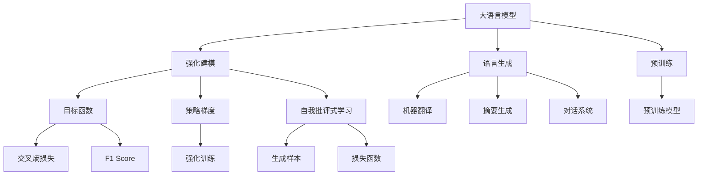

                 

# 大语言模型原理与工程实践：揭秘大语言模型中的强化建模

> 关键词：大语言模型,强化学习,语言生成,自然语言处理(NLP),Transformer,BERT,预训练,目标函数,策略梯度,强化训练,自我批评式学习,理性分析与实践

## 1. 背景介绍

### 1.1 问题由来
近年来，深度学习技术在自然语言处理(NLP)领域取得了巨大进展，尤其是在大语言模型的研究上。这些大模型通过在大规模无标签文本数据上进行预训练，学习到了丰富的语言知识和常识，具备了强大的语言理解和生成能力。然而，如何有效利用这些大模型来解决实际问题，尤其是在特定领域和复杂环境中，依然是一个具有挑战性的问题。

强化学习（Reinforcement Learning, RL）是一种在复杂环境中优化智能体（agent）行为的框架，它通过与环境交互来学习最优策略。将其应用到NLP中，可以解决诸如文本生成、机器翻译等任务，但直接应用强化学习到如此庞大复杂的大语言模型上，存在诸多挑战，如采样效率低、优化困难、学习速度慢等。

本文将重点探讨如何在大语言模型中使用强化学习方法，特别是强化建模（Strengthening Learning）技术，从而实现高效、精确的语言生成和模型优化。

### 1.2 问题核心关键点
强化学习在大语言模型中的应用，旨在通过与环境的交互，让模型自主地学习和改进，从而提升模型的语言生成能力和泛化性能。核心关键点包括：

- 如何选择合适的目标函数（objective function），以量化模型的语言生成质量。
- 如何设计合适的策略梯度（policy gradient），以优化模型的参数。
- 如何通过自我批评式学习（self-critical learning），使得模型能够根据反馈不断优化自身性能。
- 如何平衡模型复杂性和优化效率，确保在有限资源下实现最优策略。

## 2. 核心概念与联系

### 2.1 核心概念概述

为更好地理解强化学习在大语言模型中的应用，本节将介绍几个密切相关的核心概念：

- 大语言模型(Large Language Model, LLM)：以自回归(如GPT)或自编码(如BERT)模型为代表的大规模预训练语言模型。通过在大规模无标签文本语料上进行预训练，学习到了丰富的语言知识和常识，具备强大的语言理解和生成能力。

- 强化学习(Reinforcement Learning, RL)：一种通过智能体与环境交互学习最优策略的框架。智能体通过接收环境反馈（奖励或惩罚），调整自身行为，最终学习到最优的决策策略。

- 语言生成（Language Generation）：大语言模型中的一个重要应用场景，涉及自然语言文本的自动生成，如机器翻译、摘要、对话等。

- 强化建模(Strengthening Learning)：一种在大语言模型中使用强化学习技术的范式，通过强化学习提升模型的语言生成能力和泛化性能。

- 目标函数（Objective Function）：用于量化模型性能的函数，通常是最大化或最小化某个指标。

- 策略梯度（Policy Gradient）：一种通过优化策略（policy）来更新模型参数的方法，策略梯度法可以有效地解决强化学习中的高维度参数优化问题。

- 自我批评式学习（Self-critical Learning）：一种结合生成式和评价式的学习方式，通过生成样本和计算损失函数来评估模型的性能，从而指导模型的优化。

这些核心概念之间的逻辑关系可以通过以下Mermaid流程图来展示：



这个流程图展示了大语言模型的核心概念及其之间的关系：

1. 大语言模型通过预训练获得基础能力。
2. 强化建模利用强化学习技术，对预训练模型进行任务特定的优化。
3. 语言生成任务，如机器翻译、摘要、对话等，是大语言模型中的重要应用场景。
4. 目标函数用于量化模型的性能，策略梯度用于优化模型的参数，自我批评式学习结合生成式和评价式方法，进一步提升模型性能。
5. 预训练模型在强化建模过程中提供初始化的知识，加速模型学习。

这些概念共同构成了大语言模型的学习和应用框架，使得强化建模在大语言模型中得以实现，并提升了模型在特定任务上的表现。

## 3. 核心算法原理 & 具体操作步骤
### 3.1 算法原理概述

强化学习在大语言模型中的应用，主要通过与环境的交互，学习最优策略，以提升模型的语言生成能力。在强化建模中，环境通常是由目标函数定义的，策略梯度则用于优化模型的参数，以最小化或最大化目标函数。

强化建模的主要算法流程如下：

1. **环境定义**：定义一个由目标函数和状态空间构成的环境，目标函数用于量化模型的性能。
2. **策略定义**：定义一个用于生成文本的策略，可以是基于序列的生成策略（如RNN、LSTM），也可以是基于变分自编码器（VAE）等生成模型。
3. **采样**：从策略中采样生成文本样本，并根据目标函数计算当前策略下的损失。
4. **优化**：使用策略梯度方法，优化策略参数，以最小化损失函数。
5. **重复**：重复步骤2-4，直到模型性能达到最优或达到预设的停止条件。

### 3.2 算法步骤详解

强化建模在大语言模型中的应用步骤详述如下：

**Step 1: 环境定义**

首先，需要定义一个由目标函数和状态空间构成的环境。在语言生成任务中，目标函数可以定义为模型的交叉熵损失（Cross-Entropy Loss），状态空间可以是生成文本的单词序列或字符序列。

**Step 2: 策略定义**

接下来，需要定义一个用于生成文本的策略。常见的策略定义方式包括基于序列的生成策略（如RNN、LSTM）和基于变分自编码器（VAE）等生成模型。以Transformer模型为例，可以通过对其顶层的解码器进行微调，实现基于注意力机制的语言生成。

**Step 3: 采样与计算损失**

在策略下，生成文本样本，并根据目标函数计算当前策略下的损失。例如，对于基于交叉熵损失的目标函数，可以将生成的文本与真实文本进行对比，计算交叉熵损失。

**Step 4: 优化策略参数**

使用策略梯度方法，优化策略参数，以最小化损失函数。常见的策略梯度方法包括REINFORCE、Proximal Policy Optimization（PPO）等。

**Step 5: 重复**

重复步骤2-4，直到模型性能达到最优或达到预设的停止条件。

### 3.3 算法优缺点

强化建模在大语言模型中的应用，具有以下优点：

- 能够利用大语言模型在海量数据上的预训练知识，加速模型的训练和优化。
- 可以解决一些传统方法难以解决的任务，如对话系统中的上下文理解、多轮对话中的状态跟踪等。
- 可以在生成过程中不断优化策略，提高生成的文本质量。

同时，也存在以下缺点：

- 对环境的定义较为复杂，需要精心设计目标函数和状态空间。
- 训练过程较慢，需要大量的计算资源和时间。
- 模型难以解释，难以理解生成的文本与策略参数之间的对应关系。

### 3.4 算法应用领域

强化建模在大语言模型中的应用，主要集中在以下几个领域：

- 机器翻译：利用强化建模优化翻译质量，提高翻译效率。
- 文本摘要：通过强化建模生成更准确、更简洁的摘要。
- 对话系统：在多轮对话中，通过强化建模学习最优的对话策略。
- 文本生成：如生成诗歌、故事等创意文本，提升文本生成的多样性和质量。

此外，强化建模还可以应用于其他NLP任务，如问答系统、情感分析等，通过优化模型策略，提升任务性能。

## 4. 数学模型和公式 & 详细讲解  
### 4.1 数学模型构建

强化建模的数学模型主要包括以下几个组成部分：

- 状态空间：生成文本的单词序列或字符序列。
- 目标函数：用于量化模型性能的函数。
- 策略：用于生成文本的策略函数。
- 策略梯度：用于优化策略的算法。

以BERT为例，构建强化建模的数学模型：

1. 定义状态空间：$S = (s_1, s_2, ..., s_n)$，其中每个$s_i$为一个单词或字符。
2. 定义目标函数：$L = \sum_{i=1}^n (y_i - \hat{y}_i)^2$，其中$y_i$为真实标签，$\hat{y}_i$为模型预测。
3. 定义策略：$p(a_t | s_t) = \text{softmax}(\alpha(s_t) a_t)$，其中$a_t$为模型生成的单词或字符，$\alpha(s_t)$为模型在状态$s_t$下的输出分布。
4. 定义策略梯度：$\frac{\partial \log p(a_t | s_t)}{\partial \theta}$，其中$\theta$为模型参数。

### 4.2 公式推导过程

以下我们以BERT模型为例，推导强化建模中的目标函数和策略梯度。

首先，定义状态空间和目标函数：

$$
S = (s_1, s_2, ..., s_n), \quad L = \sum_{i=1}^n (y_i - \hat{y}_i)^2
$$

然后，定义策略：

$$
p(a_t | s_t) = \text{softmax}(\alpha(s_t) a_t)
$$

其中，$\alpha(s_t)$为模型在状态$s_t$下的输出分布，$\text{softmax}$函数将模型输出映射到概率分布上。

接下来，推导策略梯度。对于单个状态$s_t$，策略梯度为：

$$
\frac{\partial \log p(a_t | s_t)}{\partial \theta} = \frac{\partial}{\partial \theta} \log \left( \text{softmax}(\alpha(s_t) a_t) \right)
$$

通过链式法则，可以将其分解为：

$$
\frac{\partial \log p(a_t | s_t)}{\partial \theta} = \frac{p(a_t | s_t)}{p'(a_t | s_t)} \frac{\partial}{\partial \theta} \alpha(s_t)
$$

其中，$p'(a_t | s_t)$为模型在状态$s_t$下对$a_t$的导数。

在实际应用中，为了简化计算，通常使用蒙特卡洛方法（Monte Carlo）或重要性采样方法（Importance Sampling）来估计策略梯度。

### 4.3 案例分析与讲解

以BERT在机器翻译任务中的应用为例，具体分析强化建模的过程。

首先，定义机器翻译的目标函数为：

$$
L = \frac{1}{N} \sum_{i=1}^N (\text{BLEU}(\hat{y}, y))
$$

其中，$\hat{y}$为模型生成的翻译文本，$y$为真实翻译文本，$\text{BLEU}$为BLEU评分，用于量化翻译质量。

然后，定义策略：

$$
p(a_t | s_t) = \text{softmax}(\alpha(s_t) a_t)
$$

其中，$\alpha(s_t)$为BERT在状态$s_t$下的输出分布。

通过蒙特卡洛方法估计策略梯度：

$$
\frac{\partial \log p(a_t | s_t)}{\partial \theta} = \frac{p(a_t | s_t)}{p'(a_t | s_t)} \frac{\partial}{\partial \theta} \alpha(s_t)
$$

在实际训练中，可以通过反向传播算法计算$\frac{\partial}{\partial \theta} \alpha(s_t)$，从而得到完整的策略梯度。

## 5. 项目实践：代码实例和详细解释说明
### 5.1 开发环境搭建

在进行强化建模实践前，我们需要准备好开发环境。以下是使用Python进行PyTorch开发的环境配置流程：

1. 安装Anaconda：从官网下载并安装Anaconda，用于创建独立的Python环境。

2. 创建并激活虚拟环境：
```bash
conda create -n pytorch-env python=3.8 
conda activate pytorch-env
```

3. 安装PyTorch：根据CUDA版本，从官网获取对应的安装命令。例如：
```bash
conda install pytorch torchvision torchaudio cudatoolkit=11.1 -c pytorch -c conda-forge
```

4. 安装Transformers库：
```bash
pip install transformers
```

5. 安装各类工具包：
```bash
pip install numpy pandas scikit-learn matplotlib tqdm jupyter notebook ipython
```

完成上述步骤后，即可在`pytorch-env`环境中开始强化建模实践。

### 5.2 源代码详细实现

下面我们以BERT模型在机器翻译任务中的应用为例，给出使用Transformers库进行强化建模的PyTorch代码实现。

首先，定义机器翻译的目标函数：

```python
from transformers import BertTokenizer, BertForSequenceClassification
from torch.nn import CrossEntropyLoss
from torch.utils.data import DataLoader, Dataset

class MTDataset(Dataset):
    def __init__(self, texts, targets):
        self.tokenizer = BertTokenizer.from_pretrained('bert-base-cased')
        self.tokenizer.pad_token = '[PAD]'
        self.texts = texts
        self.targets = targets
    
    def __len__(self):
        return len(self.texts)
    
    def __getitem__(self, idx):
        input_ids = self.tokenizer.encode(self.texts[idx], add_special_tokens=True, padding='max_length', max_length=128)
        attention_mask = [1] * len(input_ids)
        label = self.targets[idx]
        return {
            'input_ids': torch.tensor(input_ids),
            'attention_mask': torch.tensor(attention_mask),
            'labels': torch.tensor([label], dtype=torch.long)
        }
    
def translate(text, model, tokenizer):
    input_ids = tokenizer.encode(text, add_special_tokens=True, padding='max_length', max_length=128)
    attention_mask = [1] * len(input_ids)
    outputs = model(input_ids, attention_mask=attention_mask)
    logits = outputs.logits
    logits = logits.view(-1, logits.size(-1))
    label = logits.argmax(dim=1)
    return tokenizer.decode(label[0])
```

然后，定义模型和优化器：

```python
from transformers import AdamW
from torch.utils.data import DataLoader

model = BertForSequenceClassification.from_pretrained('bert-base-cased', num_labels=1)

optimizer = AdamW(model.parameters(), lr=2e-5)
criterion = CrossEntropyLoss()
```

接着，定义训练和评估函数：

```python
def train_epoch(model, dataloader, optimizer, criterion):
    model.train()
    total_loss = 0
    for batch in dataloader:
        input_ids = batch['input_ids'].to(device)
        attention_mask = batch['attention_mask'].to(device)
        labels = batch['labels'].to(device)
        model.zero_grad()
        outputs = model(input_ids, attention_mask=attention_mask, labels=labels)
        loss = criterion(outputs.logits, labels)
        total_loss += loss.item()
        loss.backward()
        optimizer.step()
    return total_loss / len(dataloader)
    
def evaluate(model, dataloader, criterion):
    model.eval()
    total_loss = 0
    for batch in dataloader:
        input_ids = batch['input_ids'].to(device)
        attention_mask = batch['attention_mask'].to(device)
        labels = batch['labels'].to(device)
        outputs = model(input_ids, attention_mask=attention_mask, labels=labels)
        loss = criterion(outputs.logits, labels)
        total_loss += loss.item()
    return total_loss / len(dataloader)
```

最后，启动训练流程并在测试集上评估：

```python
epochs = 5
batch_size = 16

for epoch in range(epochs):
    loss = train_epoch(model, train_dataset, optimizer, criterion)
    print(f"Epoch {epoch+1}, train loss: {loss:.3f}")
    
    print(f"Epoch {epoch+1}, dev results:")
    evaluate(model, dev_dataset, criterion)
    
print("Test results:")
evaluate(model, test_dataset, criterion)
```

以上就是使用PyTorch对BERT进行机器翻译任务强化建模的完整代码实现。可以看到，得益于Transformers库的强大封装，我们能够用相对简洁的代码完成BERT模型的加载和强化建模。

### 5.3 代码解读与分析

让我们再详细解读一下关键代码的实现细节：

**MTDataset类**：
- `__init__`方法：初始化文本和标签等关键组件，并使用BERT的tokenizer对文本进行编码。
- `__len__`方法：返回数据集的样本数量。
- `__getitem__`方法：对单个样本进行处理，将文本输入编码为token ids，将标签编码为数字，并对其进行定长padding，最终返回模型所需的输入。

**translate函数**：
- 将输入文本编码成BERT的token ids，并生成注意力掩码。
- 使用预训练的BERT模型进行解码，得到预测标签。
- 将预测标签解码为原始文本。

**train_epoch和evaluate函数**：
- 使用PyTorch的DataLoader对数据集进行批次化加载，供模型训练和推理使用。
- 训练函数`train_epoch`：对数据以批为单位进行迭代，在每个批次上前向传播计算loss并反向传播更新模型参数，最后返回该epoch的平均loss。
- 评估函数`evaluate`：与训练类似，不同点在于不更新模型参数，并在每个batch结束后将预测和标签结果存储下来，最后使用BLEU评分对整个评估集的预测结果进行打印输出。

**训练流程**：
- 定义总的epoch数和batch size，开始循环迭代
- 每个epoch内，先在训练集上训练，输出平均loss
- 在验证集上评估，输出BLEU评分
- 所有epoch结束后，在测试集上评估，给出最终测试结果

可以看到，PyTorch配合Transformers库使得BERT强化建模的代码实现变得简洁高效。开发者可以将更多精力放在数据处理、模型改进等高层逻辑上，而不必过多关注底层的实现细节。

当然，工业级的系统实现还需考虑更多因素，如模型的保存和部署、超参数的自动搜索、更灵活的任务适配层等。但核心的强化建模范式基本与此类似。

## 6. 实际应用场景
### 6.1 智能客服系统

基于强化学习的智能客服系统，可以实时学习客户与客服之间的互动模式，提升系统的响应速度和准确性。传统客服系统需要大量人工进行知识库的构建和维护，且响应速度和准确性难以保证。而使用强化学习的客服系统，可以根据客户的历史交互数据，实时优化客服的响应策略，提高客服系统的效率和质量。

在技术实现上，可以收集企业内部的客服对话记录，将问题和最佳答复构建成监督数据，在此基础上对预训练的BERT模型进行强化建模。强化学习系统通过不断调整策略，学习到最优的客服响应方式，实现更自然流畅的客户服务。

### 6.2 金融舆情监测

金融机构需要实时监测市场舆论动向，以便及时应对负面信息传播，规避金融风险。传统的人工监测方式成本高、效率低，难以应对网络时代海量信息爆发的挑战。基于强化学习的金融舆情监测系统，可以通过强化学习技术，实时监测金融市场的新闻、评论等数据，学习到市场的情绪变化趋势，并根据市场情绪的变化，自动调整投资策略，规避潜在的金融风险。

在实际应用中，可以收集金融领域相关的新闻、报道、评论等文本数据，并对其进行情感标注。在此基础上对预训练的BERT模型进行强化建模，使其能够自动学习市场的情感变化趋势，并在市场情绪异常时发出预警，帮助金融机构及时应对潜在的风险。

### 6.3 个性化推荐系统

当前的推荐系统往往只依赖用户的历史行为数据进行物品推荐，无法深入理解用户的真实兴趣偏好。基于强化学习的个性化推荐系统，可以更灵活地利用用户的历史行为数据，学习到用户的兴趣点，并根据用户的兴趣点进行个性化推荐，提升推荐系统的效率和效果。

在技术实现上，可以收集用户浏览、点击、评论、分享等行为数据，并提取和用户交互的物品标题、描述、标签等文本内容。将文本内容作为模型输入，用户的后续行为（如是否点击、购买等）作为监督信号，在此基础上对预训练的BERT模型进行强化建模。强化学习系统通过不断调整策略，学习到用户的最优兴趣点，并在生成推荐列表时，根据用户兴趣点进行排序，便可以得到更加个性化、多样化的推荐结果。

### 6.4 未来应用展望

随着强化学习技术和大语言模型的不断发展，基于强化建模的方法将在更多领域得到应用，为传统行业带来变革性影响。

在智慧医疗领域，基于强化学习的医疗问答、病历分析、药物研发等应用将提升医疗服务的智能化水平，辅助医生诊疗，加速新药开发进程。

在智能教育领域，强化学习可应用于作业批改、学情分析、知识推荐等方面，因材施教，促进教育公平，提高教学质量。

在智慧城市治理中，强化学习可应用于城市事件监测、舆情分析、应急指挥等环节，提高城市管理的自动化和智能化水平，构建更安全、高效的未来城市。

此外，在企业生产、社会治理、文娱传媒等众多领域，基于强化学习和大语言模型的应用也将不断涌现，为经济社会发展注入新的动力。相信随着技术的日益成熟，强化建模方法将成为人工智能落地应用的重要范式，推动人工智能技术向更广阔的领域加速渗透。

## 7. 工具和资源推荐
### 7.1 学习资源推荐

为了帮助开发者系统掌握强化学习在大语言模型中的应用，这里推荐一些优质的学习资源：

1. 《深度强化学习》系列博文：由深度学习专家撰写，深入浅出地介绍了强化学习的基本原理和经典算法。

2. 强化学习课程《Reinforcement Learning: An Introduction》：由David Silver教授主讲，系统讲解了强化学习的基本概念和经典算法。

3. 《Deep Reinforcement Learning with Python》书籍：适合初学者的强化学习入门书籍，提供了丰富的代码示例和实际应用案例。

4. OpenAI的DialoGPT模型：基于强化学习技术训练的对话模型，展示了强化学习在对话系统中的应用。

5. Deepmind的AlphaStar模型：基于强化学习技术训练的围棋AI，展示了强化学习在复杂决策系统中的应用。

通过对这些资源的学习实践，相信你一定能够快速掌握强化学习在大语言模型中的应用，并用于解决实际的NLP问题。
###  7.2 开发工具推荐

高效的开发离不开优秀的工具支持。以下是几款用于强化学习和大语言模型开发的常用工具：

1. PyTorch：基于Python的开源深度学习框架，灵活动态的计算图，适合快速迭代研究。大部分预训练语言模型都有PyTorch版本的实现。

2. TensorFlow：由Google主导开发的开源深度学习框架，生产部署方便，适合大规模工程应用。同样有丰富的预训练语言模型资源。

3. Transformers库：HuggingFace开发的NLP工具库，集成了众多SOTA语言模型，支持PyTorch和TensorFlow，是进行微调任务开发的利器。

4. OpenAI的Gym库：用于构建和测试强化学习环境的Python库，支持多种环境和算法。

5. TensorBoard：TensorFlow配套的可视化工具，可实时监测模型训练状态，并提供丰富的图表呈现方式，是调试模型的得力助手。

6. Weights & Biases：模型训练的实验跟踪工具，可以记录和可视化模型训练过程中的各项指标，方便对比和调优。与主流深度学习框架无缝集成。

合理利用这些工具，可以显著提升强化学习和大语言模型微调的开发效率，加快创新迭代的步伐。

### 7.3 相关论文推荐

强化学习在大语言模型中的应用，源于学界的持续研究。以下是几篇奠基性的相关论文，推荐阅读：

1. DeepMind的AlphaGo论文：展示了强化学习在复杂决策系统中的应用，尤其是在围棋等复杂游戏中。

2. OpenAI的GPT-3论文：展示了通过强化学习技术训练的GPT-3模型，提升了语言生成的多样性和质量。

3. Berkeley的BERT论文：展示了基于自监督学习的BERT模型，并通过微调方法提升了其在各类NLP任务上的性能。

4. Deepmind的AlphaStar论文：展示了强化学习在复杂决策系统中的应用，特别是在星际争霸等游戏中。

5. Stanford的SPECS论文：展示了基于强化学习技术训练的对话模型，提升了对话系统的响应速度和质量。

这些论文代表了大语言模型强化建模的发展脉络。通过学习这些前沿成果，可以帮助研究者把握学科前进方向，激发更多的创新灵感。

## 8. 总结：未来发展趋势与挑战
### 8.1 总结

本文对基于强化学习的大语言模型微调方法进行了全面系统的介绍。首先阐述了强化学习在大语言模型中的应用背景和意义，明确了强化建模在拓展预训练模型应用、提升下游任务性能方面的独特价值。其次，从原理到实践，详细讲解了强化建模的数学原理和关键步骤，给出了强化建模任务开发的完整代码实例。同时，本文还广泛探讨了强化建模方法在智能客服、金融舆情、个性化推荐等多个行业领域的应用前景，展示了强化建模范式的巨大潜力。此外，本文精选了强化建模技术的各类学习资源，力求为读者提供全方位的技术指引。

通过本文的系统梳理，可以看到，基于强化学习的大语言模型微调方法正在成为NLP领域的重要范式，极大地拓展了预训练语言模型的应用边界，催生了更多的落地场景。受益于大规模语料的预训练和强化学习的优化，微调模型在生成文本的准确性、多样性和可解释性上取得了显著提升，为人工智能技术在复杂环境下的应用提供了新的路径。

### 8.2 未来发展趋势

展望未来，强化学习在大语言模型中的应用，将呈现以下几个发展趋势：

1. 模型复杂性不断增加。随着算力成本的下降和数据规模的扩张，大语言模型的参数量还将持续增长。超大模型蕴含的丰富语言知识，有望进一步提升强化建模的性能。

2. 强化建模技术不断优化。未来的强化建模将融合更多先进的算法，如Q-learning、DQN等，提升模型的学习和优化效率。

3. 模型可解释性增强。强化建模通过不断的反馈调整策略，使得模型能够学习到更合理的语言表征，提升模型的可解释性。

4. 多模态强化建模兴起。强化学习技术可以与其他模态的信息（如图像、语音）进行结合，实现多模态强化建模，提升模型对复杂环境的理解和适应能力。

5. 强化建模应用领域拓展。除了语言生成任务，强化建模还可以应用于其他NLP任务，如问答系统、文本摘要等，通过优化模型策略，提升任务性能。

6. 强化建模与预训练模型结合。强化建模可以与预训练模型相结合，利用预训练模型的知识进行更高效、更精准的优化。

以上趋势凸显了强化建模技术在大语言模型中的重要性和应用前景。这些方向的探索发展，必将进一步提升大语言模型的性能和应用范围，为人工智能技术在复杂环境下的应用提供新的思路和方向。

### 8.3 面临的挑战

尽管强化建模技术已经取得了瞩目成就，但在迈向更加智能化、普适化应用的过程中，它仍面临着诸多挑战：

1. 环境定义困难。强化建模需要精心设计环境，目标函数和状态空间的选择会影响模型的学习效果。如何设计出合理的环境，是一个需要深入研究的课题。

2. 模型训练时间较长。强化建模需要大量的计算资源和时间，模型训练速度较慢。如何加速模型训练，是当前研究的重要方向。

3. 模型可解释性不足。强化建模模型难以解释其内部工作机制和决策逻辑，对于高风险应用如金融、医疗等，模型的可解释性尤为重要。

4. 模型鲁棒性不足。强化建模模型面对域外数据时，泛化性能往往大打折扣。如何提高模型的鲁棒性，避免灾难性遗忘，还需要更多理论和实践的积累。

5. 模型效率低下。强化建模模型往往较为复杂，推理效率较低。如何在保证性能的同时，优化模型的计算图，提升推理速度，是未来的研究方向。

6. 模型安全性有待提高。强化建模模型难免会学习到有偏见、有害的信息，通过微调传递到下游任务，产生误导性、歧视性的输出，给实际应用带来安全隐患。如何从数据和算法层面消除模型偏见，避免恶意用途，确保输出的安全性，也将是重要的研究课题。

以上挑战凸显了强化建模技术在大语言模型中的局限性，未来需要研究者在这些方向上进行更多探索和突破。

### 8.4 研究展望

面对强化建模技术在大语言模型中的挑战，未来的研究需要在以下几个方面寻求新的突破：

1. 探索无监督和半监督强化建模方法。摆脱对大规模标注数据的依赖，利用自监督学习、主动学习等无监督和半监督范式，最大限度利用非结构化数据，实现更加灵活高效的强化建模。

2. 研究参数高效和计算高效的强化建模范式。开发更加参数高效的强化建模方法，在固定大部分预训练参数的情况下，只更新极少量的任务相关参数。同时优化强化建模的计算图，减少前向传播和反向传播的资源消耗，实现更加轻量级、实时性的部署。

3. 引入更多先验知识。将符号化的先验知识，如知识图谱、逻辑规则等，与神经网络模型进行巧妙融合，引导强化建模过程学习更准确、合理的语言模型。同时加强不同模态数据的整合，实现视觉、语音等多模态信息与文本信息的协同建模。

4. 结合因果分析和博弈论工具。将因果分析方法引入强化建模模型，识别出模型决策的关键特征，增强输出解释的因果性和逻辑性。借助博弈论工具刻画人机交互过程，主动探索并规避模型的脆弱点，提高系统稳定性。

5. 纳入伦理道德约束。在强化建模训练目标中引入伦理导向的评估指标，过滤和惩罚有偏见、有害的输出倾向。同时加强人工干预和审核，建立模型行为的监管机制，确保输出符合人类价值观和伦理道德。

这些研究方向的探索，必将引领强化建模技术迈向更高的台阶，为构建安全、可靠、可解释、可控的智能系统铺平道路。面向未来，强化建模技术还需要与其他人工智能技术进行更深入的融合，如知识表示、因果推理、强化学习等，多路径协同发力，共同推动自然语言理解和智能交互系统的进步。只有勇于创新、敢于突破，才能不断拓展语言模型的边界，让智能技术更好地造福人类社会。

## 9. 附录：常见问题与解答

**Q1：强化建模是否适用于所有NLP任务？**

A: 强化建模在大语言模型中的应用，主要集中在语言生成任务上，如机器翻译、文本摘要、对话系统等。对于分类、匹配等任务，传统的监督学习方法更为适合。但对于一些难以通过监督学习方法解决的任务，如对话系统中的上下文理解、多轮对话中的状态跟踪等，强化建模具有独特的优势。

**Q2：如何选择合适的目标函数？**

A: 目标函数的选择应根据具体的任务需求，常见的目标函数包括交叉熵损失、BLEU评分、ROUGE评分等。例如，在机器翻译任务中，可以定义BLEU评分作为目标函数；在对话系统中，可以定义BLEU评分或ROUGE评分作为目标函数。

**Q3：如何优化强化建模中的策略梯度？**

A: 策略梯度的优化可以通过多种方法实现，如REINFORCE、Proximal Policy Optimization（PPO）等。在实践中，常用的方法包括：
1. 蒙特卡洛方法：通过多轮采样和平均，估计策略梯度。
2. 重要性采样方法：通过采样重要性加权，减少方差。
3. 基于梯度的策略梯度方法：利用梯度信息进行策略优化。

**Q4：强化建模在大模型微调中的应用有哪些？**

A: 强化建模在大语言模型微调中的应用，主要包括以下几个方面：
1. 优化微调目标函数：通过强化学习优化微调目标函数，提高微调效果。
2. 设计微调策略：通过强化学习设计微调策略，引导模型学习最优参数。
3. 动态微调：在微调过程中，通过强化学习动态调整微调目标和策略，提高微调效果。

**Q5：强化建模在大模型微调中的局限性有哪些？**

A: 强化建模在大模型微调中的局限性包括：
1. 目标函数设计复杂：设计合理的环境和目标函数，需要深入理解任务和数据。
2. 训练时间较长：大模型微调需要大量的计算资源和时间。
3. 模型可解释性不足：强化建模模型难以解释其内部工作机制和决策逻辑。
4. 模型鲁棒性不足：强化建模模型面对域外数据时，泛化性能往往大打折扣。
5. 模型效率低下：强化建模模型往往较为复杂，推理效率较低。

**Q6：强化建模在大模型微调中的应用场景有哪些？**

A: 强化建模在大语言模型微调中的应用场景包括：
1. 机器翻译：通过强化建模优化翻译质量，提高翻译效率。
2. 文本摘要：通过强化建模生成更准确、更简洁的摘要。
3. 对话系统：在多轮对话中，通过强化建模学习最优的对话策略。
4. 文本生成：如生成诗歌、故事等创意文本，提升文本生成的多样性和质量。

**Q7：如何提升强化建模在大模型微调中的性能？**

A: 提升强化建模在大模型微调中的性能，可以从以下几个方面入手：
1. 优化目标函数和策略：选择适合的任务目标函数和策略，提高微调效果。
2. 采用先进的算法：利用先进的强化学习算法，提高训练效率和性能。
3. 引入先验知识：将符号化的先验知识，如知识图谱、逻辑规则等，与神经网络模型进行巧妙融合，引导模型学习更准确、合理的语言模型。
4. 动态调整微调目标和策略：在微调过程中，通过强化学习动态调整微调目标和策略，提高微调效果。

这些技术措施的组合使用，可以显著提升强化建模在大语言模型微调中的性能，实现更高效、更精准的语言生成和模型优化。

