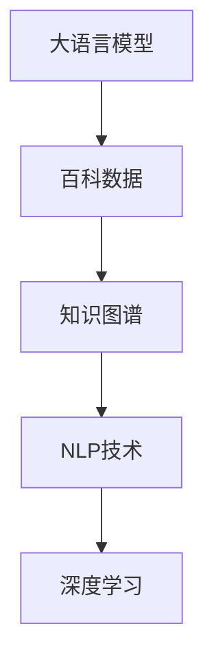

                 

# 大语言模型原理与工程实践：百科数据

> 关键词：大语言模型,百科数据,知识图谱,自然语言处理(NLP),深度学习,知识表示与推理

## 1. 背景介绍

### 1.1 问题由来

随着互联网的发展和人工智能技术的进步，大语言模型（Large Language Models, LLMs）逐渐成为自然语言处理（NLP）领域的热门话题。这些模型通过在大型无标签文本语料上进行预训练，能够学习到丰富的语言知识和常识，从而在各种自然语言任务上表现出色。然而，由于大语言模型主要依赖大规模通用文本进行训练，这使得其对特定领域知识的掌握往往不足。为了更好地适应特定领域的应用，需要在通用大模型的基础上，通过微调（Fine-Tuning）或迁移学习（Transfer Learning）等方法，将大语言模型适配到具体任务中。

### 1.2 问题核心关键点

本文将重点探讨大语言模型在特定领域知识（如百科数据）上的应用，特别是在百科知识图谱（Knowledge Graph）构建与查询中的应用。具体问题包括：

- 大语言模型如何与百科数据有效融合？
- 知识图谱在百科数据处理中的作用和优化方法？
- 如何设计高效的算法流程，以实现百科数据处理的自动化与智能化？

这些问题不仅是推动知识图谱技术发展的重要方向，也是构建智能搜索引擎、智能问答系统等应用的基础。

## 2. 核心概念与联系

### 2.1 核心概念概述

为了更好地理解如何利用大语言模型处理百科数据，本节将介绍几个核心概念：

- **大语言模型（LLMs）**：如GPT、BERT等，以自回归或自编码模型为代表的大规模预训练语言模型。通过在大规模无标签文本语料上进行预训练，学习到通用的语言表示，具备强大的语言理解和生成能力。

- **百科数据**：包含广泛知识领域的信息，如维基百科、百度百科等，提供了大量结构化的信息供人们学习和查询。

- **知识图谱（KG）**：由实体、属性和关系构成的知识表示方式，用于描述和组织知识，支持自然语言处理中的实体识别、关系抽取、推理等任务。

- **自然语言处理（NLP）**：涉及语言理解、生成、分析和处理的技术，旨在使计算机能够理解和利用自然语言。

- **深度学习**：一种基于神经网络的机器学习方法，特别适用于大语言模型和知识图谱构建。

这些核心概念之间的逻辑关系可以通过以下Mermaid流程图来展示：



这个流程图展示了大语言模型、百科数据、知识图谱、NLP技术和深度学习之间的相互作用：

1. 大语言模型通过预训练获得基础能力。
2. 百科数据为大语言模型提供丰富的知识库，供模型学习和推理。
3. 知识图谱将百科数据结构化，支持高效的NLP任务处理。
4. NLP技术利用深度学习算法，在大语言模型和知识图谱基础上，实现自动化的百科数据处理。

## 3. 核心算法原理 & 具体操作步骤

### 3.1 算法原理概述

基于大语言模型处理百科数据的方法，主要通过将百科数据转化为结构化信息，并利用大语言模型进行知识抽取、关系抽取和推理。其核心思想是：

1. **数据转换**：将百科数据转换为结构化的知识图谱，将实体、属性和关系等结构化信息供大语言模型处理。
2. **知识抽取**：利用大语言模型从百科数据中抽取实体、属性和关系，形成知识图谱。
3. **关系抽取**：通过大语言模型抽取实体之间的语义关系，构建知识图谱。
4. **推理计算**：利用大语言模型的语言理解和推理能力，在知识图谱上进行推理计算，获取新的知识。

### 3.2 算法步骤详解

以下是利用大语言模型处理百科数据的详细操作步骤：

**Step 1: 数据准备与预处理**

1. **数据收集**：从百科数据库（如维基百科、百度百科）收集相关领域的知识数据，提取文本和结构化信息。
2. **文本预处理**：对文本进行分词、去停用词、命名实体识别等预处理操作，提取出有意义的词汇和实体。
3. **结构化信息提取**：从百科数据库中提取实体、属性和关系，构建结构化的三元组数据。

**Step 2: 知识图谱构建**

1. **实体抽取**：利用大语言模型从预处理后的文本中抽取实体，如人名、地名、组织机构等。
2. **属性抽取**：从预处理后的文本中抽取实体的属性信息，如出生地、国籍、工作地点等。
3. **关系抽取**：利用大语言模型抽取实体之间的关系，如“在...工作”、“是...的创始人”等。

**Step 3: 知识图谱优化**

1. **去重与归并**：对抽取的实体、属性和关系进行去重和归并，避免重复和冗余。
2. **实体消歧**：对抽取的实体进行消歧，确保每个实体对应唯一的实体节点。
3. **关系标注**：对抽取的关系进行标注，确保每个关系对应知识图谱中的明确关系类型。

**Step 4: 模型训练与推理**

1. **模型选择**：选择合适的预训练语言模型，如BERT、GPT等。
2. **模型微调**：在百科数据上对预训练语言模型进行微调，使其能够更好地处理特定领域知识。
3. **推理计算**：利用微调后的模型进行推理计算，获取新的知识。

### 3.3 算法优缺点

利用大语言模型处理百科数据的方法，具有以下优点：

1. **高效性**：预训练语言模型在大规模文本数据上进行了充分的训练，能够快速处理大规模的百科数据。
2. **适应性**：通过微调，模型可以适应特定领域的知识，提高处理效率和精度。
3. **扩展性**：知识图谱结构化表示知识，便于扩展和更新，适应知识增长和变化。

同时，也存在一些局限性：

1. **数据质量依赖**：百科数据的质量对模型的表现有很大影响，低质量数据可能导致模型抽取错误的信息。
2. **知识覆盖不完全**：百科数据不一定涵盖所有领域，某些领域可能没有相关数据。
3. **推理准确性**：由于百科数据存在不一致和错误的信息，模型的推理结果可能不够准确。
4. **计算资源消耗**：处理大规模百科数据需要较高的计算资源，特别是在构建知识图谱时。

### 3.4 算法应用领域

大语言模型处理百科数据的方法，已经在以下领域得到广泛应用：

- **智能问答系统**：利用知识图谱构建问题-答案映射，提高问答系统的准确性和效率。
- **搜索引擎**：将百科数据转化为知识图谱，提高搜索的准确性和相关性。
- **推荐系统**：利用知识图谱中的实体和关系，为用户推荐相关内容。
- **自然语言处理(NLP)**：在命名实体识别、关系抽取、文本摘要等任务中，利用知识图谱提供更丰富的语义信息。
- **教育领域**：构建知识图谱辅助教学，提供个性化的学习资源。

## 4. 数学模型和公式 & 详细讲解 & 举例说明

### 4.1 数学模型构建

为了更严格地描述利用大语言模型处理百科数据的过程，我们需要用数学语言来表示每个步骤。

假设我们有一个百科数据集 $D=\{(x_i,y_i)\}_{i=1}^N$，其中 $x_i$ 是文本数据，$y_i$ 是结构化信息（如实体、属性、关系）。

定义预训练语言模型为 $M_{\theta}$，其中 $\theta$ 为模型参数。我们希望通过微调，使得模型能够更准确地处理百科数据，即最小化以下损失函数：

$$
\mathcal{L}(\theta) = \frac{1}{N} \sum_{i=1}^N \ell(M_{\theta}(x_i),y_i)
$$

其中 $\ell$ 为损失函数，通常使用交叉熵损失、均方误差损失等。

### 4.2 公式推导过程

以实体抽取为例，我们可以用以下公式表示实体抽取的过程：

设 $x_i$ 为文本数据，$y_i$ 为实体列表。

1. **分词与词性标注**：将 $x_i$ 进行分词和词性标注，得到词汇序列 $T=\{(t_j,v_j)\}_{j=1}^M$，其中 $t_j$ 为词汇，$v_j$ 为词性。
2. **命名实体识别**：利用大语言模型 $M_{\theta}$ 对 $T$ 进行命名实体识别，得到实体列表 $E=\{(e_k,s_k)\}_{k=1}^K$，其中 $e_k$ 为实体，$s_k$ 为实体类型。
3. **去重与归并**：对 $E$ 进行去重和归并，确保每个实体对应唯一的节点。

设 $y_i$ 为实体列表，包含 $n$ 个实体。对于每个实体 $e_k$，我们定义其概率 $P(e_k|M_{\theta})$，表示在给定模型 $M_{\theta}$ 下，词汇序列 $T$ 中包含实体 $e_k$ 的概率。

利用大语言模型，我们可以通过以下公式计算每个词汇 $t_j$ 为实体的概率 $P(t_j|M_{\theta})$，进而得到每个实体 $e_k$ 的概率 $P(e_k|M_{\theta})$：

$$
P(e_k|M_{\theta}) = \prod_{j=1}^M P(t_j|M_{\theta})
$$

其中 $P(t_j|M_{\theta})$ 可以通过大语言模型 $M_{\theta}$ 的输出概率计算得到。

### 4.3 案例分析与讲解

以实体抽取为例，我们假设有一个百科数据样本，包含文本 "杰克·马是中国的亿万富翁"，其中实体 "杰克·马" 和 "中国" 需要被抽取出来。

1. **分词与词性标注**：将文本进行分词和词性标注，得到词汇序列 $T=\{(杰克,人名),(马,人名),(是,动词),(中国,地名)\}$。
2. **命名实体识别**：利用大语言模型 $M_{\theta}$ 对 $T$ 进行命名实体识别，得到实体列表 $E=\{(杰克,人名),(中国,地名)\}$。
3. **去重与归并**：对 $E$ 进行去重和归并，确保每个实体对应唯一的节点。

通过上述步骤，我们可以将百科数据转化为结构化的知识图谱，用于后续的推理计算。

## 5. 项目实践：代码实例和详细解释说明

### 5.1 开发环境搭建

在进行百科数据处理之前，我们需要准备好开发环境。以下是使用Python进行PyTorch开发的环境配置流程：

1. 安装Anaconda：从官网下载并安装Anaconda，用于创建独立的Python环境。

2. 创建并激活虚拟环境：
```bash
conda create -n pytorch-env python=3.8 
conda activate pytorch-env
```

3. 安装PyTorch：根据CUDA版本，从官网获取对应的安装命令。例如：
```bash
conda install pytorch torchvision torchaudio cudatoolkit=11.1 -c pytorch -c conda-forge
```

4. 安装Transformers库：
```bash
pip install transformers
```

5. 安装各类工具包：
```bash
pip install numpy pandas scikit-learn matplotlib tqdm jupyter notebook ipython
```

完成上述步骤后，即可在`pytorch-env`环境中开始百科数据处理实践。

### 5.2 源代码详细实现

下面我们以实体抽取任务为例，给出使用Transformers库对BERT模型进行实体抽取的PyTorch代码实现。

首先，定义实体抽取的数据处理函数：

```python
from transformers import BertTokenizer
from torch.utils.data import Dataset
import torch

class NamedEntityDataset(Dataset):
    def __init__(self, texts, tags, tokenizer, max_len=128):
        self.texts = texts
        self.tags = tags
        self.tokenizer = tokenizer
        self.max_len = max_len
        
    def __len__(self):
        return len(self.texts)
    
    def __getitem__(self, item):
        text = self.texts[item]
        tags = self.tags[item]
        
        encoding = self.tokenizer(text, return_tensors='pt', max_length=self.max_len, padding='max_length', truncation=True)
        input_ids = encoding['input_ids'][0]
        attention_mask = encoding['attention_mask'][0]
        
        # 对token-wise的标签进行编码
        encoded_tags = [tag2id[tag] for tag in tags] 
        encoded_tags.extend([tag2id['O']] * (self.max_len - len(encoded_tags)))
        labels = torch.tensor(encoded_tags, dtype=torch.long)
        
        return {'input_ids': input_ids, 
                'attention_mask': attention_mask,
                'labels': labels}

# 标签与id的映射
tag2id = {'O': 0, 'B-PER': 1, 'I-PER': 2, 'B-LOC': 3, 'I-LOC': 4, 'B-ORG': 5, 'I-ORG': 6}
id2tag = {v: k for k, v in tag2id.items()}

# 创建dataset
tokenizer = BertTokenizer.from_pretrained('bert-base-cased')

train_dataset = NamedEntityDataset(train_texts, train_tags, tokenizer)
dev_dataset = NamedEntityDataset(dev_texts, dev_tags, tokenizer)
test_dataset = NamedEntityDataset(test_texts, test_tags, tokenizer)
```

然后，定义模型和优化器：

```python
from transformers import BertForTokenClassification, AdamW

model = BertForTokenClassification.from_pretrained('bert-base-cased', num_labels=len(tag2id))

optimizer = AdamW(model.parameters(), lr=2e-5)
```

接着，定义训练和评估函数：

```python
from torch.utils.data import DataLoader
from tqdm import tqdm
from sklearn.metrics import classification_report

device = torch.device('cuda') if torch.cuda.is_available() else torch.device('cpu')
model.to(device)

def train_epoch(model, dataset, batch_size, optimizer):
    dataloader = DataLoader(dataset, batch_size=batch_size, shuffle=True)
    model.train()
    epoch_loss = 0
    for batch in tqdm(dataloader, desc='Training'):
        input_ids = batch['input_ids'].to(device)
        attention_mask = batch['attention_mask'].to(device)
        labels = batch['labels'].to(device)
        model.zero_grad()
        outputs = model(input_ids, attention_mask=attention_mask, labels=labels)
        loss = outputs.loss
        epoch_loss += loss.item()
        loss.backward()
        optimizer.step()
    return epoch_loss / len(dataloader)

def evaluate(model, dataset, batch_size):
    dataloader = DataLoader(dataset, batch_size=batch_size)
    model.eval()
    preds, labels = [], []
    with torch.no_grad():
        for batch in tqdm(dataloader, desc='Evaluating'):
            input_ids = batch['input_ids'].to(device)
            attention_mask = batch['attention_mask'].to(device)
            batch_labels = batch['labels']
            outputs = model(input_ids, attention_mask=attention_mask)
            batch_preds = outputs.logits.argmax(dim=2).to('cpu').tolist()
            batch_labels = batch_labels.to('cpu').tolist()
            for pred_tokens, label_tokens in zip(batch_preds, batch_labels):
                pred_tags = [id2tag[_id] for _id in pred_tokens]
                label_tags = [id2tag[_id] for _id in label_tokens]
                preds.append(pred_tags[:len(label_tags)])
                labels.append(label_tags)
                
    print(classification_report(labels, preds))
```

最后，启动训练流程并在测试集上评估：

```python
epochs = 5
batch_size = 16

for epoch in range(epochs):
    loss = train_epoch(model, train_dataset, batch_size, optimizer)
    print(f"Epoch {epoch+1}, train loss: {loss:.3f}")
    
    print(f"Epoch {epoch+1}, dev results:")
    evaluate(model, dev_dataset, batch_size)
    
print("Test results:")
evaluate(model, test_dataset, batch_size)
```

以上就是使用PyTorch对BERT进行实体抽取任务的完整代码实现。可以看到，得益于Transformers库的强大封装，我们可以用相对简洁的代码完成BERT模型的加载和微调。

### 5.3 代码解读与分析

让我们再详细解读一下关键代码的实现细节：

**NamedEntityDataset类**：
- `__init__`方法：初始化文本、标签、分词器等关键组件。
- `__len__`方法：返回数据集的样本数量。
- `__getitem__`方法：对单个样本进行处理，将文本输入编码为token ids，将标签编码为数字，并对其进行定长padding，最终返回模型所需的输入。

**tag2id和id2tag字典**：
- 定义了标签与数字id之间的映射关系，用于将token-wise的预测结果解码回真实的标签。

**训练和评估函数**：
- 使用PyTorch的DataLoader对数据集进行批次化加载，供模型训练和推理使用。
- 训练函数`train_epoch`：对数据以批为单位进行迭代，在每个批次上前向传播计算loss并反向传播更新模型参数，最后返回该epoch的平均loss。
- 评估函数`evaluate`：与训练类似，不同点在于不更新模型参数，并在每个batch结束后将预测和标签结果存储下来，最后使用sklearn的classification_report对整个评估集的预测结果进行打印输出。

**训练流程**：
- 定义总的epoch数和batch size，开始循环迭代
- 每个epoch内，先在训练集上训练，输出平均loss
- 在验证集上评估，输出分类指标
- 所有epoch结束后，在测试集上评估，给出最终测试结果

可以看到，PyTorch配合Transformers库使得BERT微调的代码实现变得简洁高效。开发者可以将更多精力放在数据处理、模型改进等高层逻辑上，而不必过多关注底层的实现细节。

当然，工业级的系统实现还需考虑更多因素，如模型的保存和部署、超参数的自动搜索、更灵活的任务适配层等。但核心的微调范式基本与此类似。

## 6. 实际应用场景

### 6.1 智能问答系统

利用大语言模型处理百科数据，可以应用于智能问答系统的构建。传统问答系统需要大量的规则和人工维护，响应速度和准确性难以保证。而利用微调后的语言模型，可以7x24小时不间断服务，快速响应用户咨询，用自然流畅的语言解答各类常见问题。

在技术实现上，可以收集企业内部的历史问答数据，将问题-答案对作为监督数据，在此基础上对预训练语言模型进行微调。微调后的语言模型能够自动理解用户意图，匹配最合适的答案模板进行回复。对于用户提出的新问题，还可以接入检索系统实时搜索相关内容，动态组织生成回答。如此构建的智能问答系统，能大幅提升用户咨询体验和问题解决效率。

### 6.2 金融舆情监测

金融机构需要实时监测市场舆论动向，以便及时应对负面信息传播，规避金融风险。传统的人工监测方式成本高、效率低，难以应对网络时代海量信息爆发的挑战。利用大语言模型处理百科数据，可以为金融舆情监测提供新的解决方案。

具体而言，可以收集金融领域相关的新闻、报道、评论等文本数据，并对其进行主题标注和情感标注。在此基础上对预训练语言模型进行微调，使其能够自动判断文本属于何种主题，情感倾向是正面、中性还是负面。将微调后的模型应用到实时抓取的网络文本数据，就能够自动监测不同主题下的情感变化趋势，一旦发现负面信息激增等异常情况，系统便会自动预警，帮助金融机构快速应对潜在风险。

### 6.3 个性化推荐系统

当前的推荐系统往往只依赖用户的历史行为数据进行物品推荐，无法深入理解用户的真实兴趣偏好。利用大语言模型处理百科数据，个性化推荐系统可以更好地挖掘用户行为背后的语义信息，从而提供更精准、多样的推荐内容。

在实践中，可以收集用户浏览、点击、评论、分享等行为数据，提取和用户交互的物品标题、描述、标签等文本内容。将文本内容作为模型输入，用户的后续行为（如是否点击、购买等）作为监督信号，在此基础上微调预训练语言模型。微调后的模型能够从文本内容中准确把握用户的兴趣点。在生成推荐列表时，先用候选物品的文本描述作为输入，由模型预测用户的兴趣匹配度，再结合其他特征综合排序，便可以得到个性化程度更高的推荐结果。

### 6.4 未来应用展望

随着大语言模型和微调方法的不断发展，利用百科数据处理的方法将在更多领域得到应用，为传统行业带来变革性影响。

在智慧医疗领域，利用大语言模型处理百科数据，可以构建基于百科知识图谱的医疗问答、病历分析、药物研发等应用，提升医疗服务的智能化水平，辅助医生诊疗，加速新药开发进程。

在智能教育领域，利用大语言模型处理百科数据，可以构建基于百科知识图谱的教育问答、学情分析、知识推荐等应用，因材施教，促进教育公平，提高教学质量。

在智慧城市治理中，利用大语言模型处理百科数据，可以构建基于百科知识图谱的城市事件监测、舆情分析、应急指挥等应用，提高城市管理的自动化和智能化水平，构建更安全、高效的未来城市。

此外，在企业生产、社会治理、文娱传媒等众多领域，利用大语言模型处理百科数据的应用也将不断涌现，为经济社会发展注入新的动力。相信随着技术的日益成熟，利用百科数据处理的方法必将在构建人机协同的智能时代中扮演越来越重要的角色。

## 7. 工具和资源推荐

### 7.1 学习资源推荐

为了帮助开发者系统掌握大语言模型处理百科数据的技术基础和实践技巧，这里推荐一些优质的学习资源：

1. 《Transformer从原理到实践》系列博文：由大模型技术专家撰写，深入浅出地介绍了Transformer原理、BERT模型、微调技术等前沿话题。

2. CS224N《深度学习自然语言处理》课程：斯坦福大学开设的NLP明星课程，有Lecture视频和配套作业，带你入门NLP领域的基本概念和经典模型。

3. 《Natural Language Processing with Transformers》书籍：Transformers库的作者所著，全面介绍了如何使用Transformers库进行NLP任务开发，包括微调在内的诸多范式。

4. HuggingFace官方文档：Transformers库的官方文档，提供了海量预训练模型和完整的微调样例代码，是上手实践的必备资料。

5. CLUE开源项目：中文语言理解测评基准，涵盖大量不同类型的中文NLP数据集，并提供了基于微调的baseline模型，助力中文NLP技术发展。

通过对这些资源的学习实践，相信你一定能够快速掌握大语言模型处理百科数据的能力，并用于解决实际的NLP问题。

### 7.2 开发工具推荐

高效的开发离不开优秀的工具支持。以下是几款用于大语言模型处理百科数据开发的常用工具：

1. PyTorch：基于Python的开源深度学习框架，灵活动态的计算图，适合快速迭代研究。大部分预训练语言模型都有PyTorch版本的实现。

2. TensorFlow：由Google主导开发的开源深度学习框架，生产部署方便，适合大规模工程应用。同样有丰富的预训练语言模型资源。

3. Transformers库：HuggingFace开发的NLP工具库，集成了众多SOTA语言模型，支持PyTorch和TensorFlow，是进行百科数据处理的利器。

4. Weights & Biases：模型训练的实验跟踪工具，可以记录和可视化模型训练过程中的各项指标，方便对比和调优。与主流深度学习框架无缝集成。

5. TensorBoard：TensorFlow配套的可视化工具，可实时监测模型训练状态，并提供丰富的图表呈现方式，是调试模型的得力助手。

6. Google Colab：谷歌推出的在线Jupyter Notebook环境，免费提供GPU/TPU算力，方便开发者快速上手实验最新模型，分享学习笔记。

合理利用这些工具，可以显著提升大语言模型处理百科数据任务的开发效率，加快创新迭代的步伐。

### 7.3 相关论文推荐

大语言模型处理百科数据的研究源于学界的持续研究。以下是几篇奠基性的相关论文，推荐阅读：

1. Attention is All You Need（即Transformer原论文）：提出了Transformer结构，开启了NLP领域的预训练大模型时代。

2. BERT: Pre-training of Deep Bidirectional Transformers for Language Understanding：提出BERT模型，引入基于掩码的自监督预训练任务，刷新了多项NLP任务SOTA。

3. Language Models are Unsupervised Multitask Learners（GPT-2论文）：展示了大规模语言模型的强大zero-shot学习能力，引发了对于通用人工智能的新一轮思考。

4. Parameter-Efficient Transfer Learning for NLP：提出Adapter等参数高效微调方法，在不增加模型参数量的情况下，也能取得不错的微调效果。

5. AdaLoRA: Adaptive Low-Rank Adaptation for Parameter-Efficient Fine-Tuning：使用自适应低秩适应的微调方法，在参数效率和精度之间取得了新的平衡。

这些论文代表了大语言模型处理百科数据的发展脉络。通过学习这些前沿成果，可以帮助研究者把握学科前进方向，激发更多的创新灵感。

## 8. 总结：未来发展趋势与挑战

### 8.1 总结

本文对利用大语言模型处理百科数据的方法进行了全面系统的介绍。首先阐述了大语言模型和百科数据的研究背景和意义，明确了处理百科数据的方法在特定领域知识应用中的重要性。其次，从原理到实践，详细讲解了利用大语言模型处理百科数据的数学原理和关键步骤，给出了处理百科数据任务开发的完整代码实例。同时，本文还广泛探讨了处理百科数据方法在智能问答系统、金融舆情监测、个性化推荐等实际应用场景中的应用前景，展示了处理百科数据范式的巨大潜力。

通过本文的系统梳理，可以看到，利用大语言模型处理百科数据的方法在大规模知识表示和推理、NLP应用、智能系统构建等方面具有重要意义。它不仅能够提升知识获取和处理的效率，还能提供更丰富、更准确的语义信息，进一步推动NLP技术的产业化进程。未来，伴随预训练语言模型和微调方法的持续演进，相信百科数据处理技术也将迎来更广泛的应用，为人类社会带来新的变革。

### 8.2 未来发展趋势

展望未来，利用大语言模型处理百科数据的方法将呈现以下几个发展趋势：

1. **知识图谱的智能化构建**：未来的知识图谱构建将更多地依赖大语言模型，利用大模型的语言理解能力，自动识别实体、关系和属性，实现知识图谱的自动化构建。

2. **多模态知识融合**：除了文本信息外，知识图谱还将融合图像、语音、视频等多模态信息，提升知识的丰富性和准确性。

3. **跨领域知识迁移**：利用大语言模型的泛化能力，实现不同领域知识的迁移应用，提升知识图谱在更广泛领域的应用效果。

4. **实时动态更新**：知识图谱将能够实时动态更新，适应知识增长和变化，保持其时效性和实用性。

5. **多层次知识表示**：未来的知识图谱将支持更丰富的知识表示层次，如推理链、事件图等，提升知识的推理和预测能力。

6. **个性化知识推荐**：基于知识图谱，构建个性化推荐系统，为不同用户提供定制化的知识服务。

以上趋势凸显了利用大语言模型处理百科数据方法的广阔前景。这些方向的探索发展，必将进一步提升知识图谱的智能水平，为构建更加智能、高效的知识处理系统铺平道路。

### 8.3 面临的挑战

尽管利用大语言模型处理百科数据的方法已经取得了瞩目成就，但在迈向更加智能化、普适化应用的过程中，它仍面临着诸多挑战：

1. **数据质量问题**：百科数据的质量直接影响大语言模型的处理效果。数据不完整、不统一、不一致等问题，可能导致模型抽取错误的信息。

2. **知识图谱构建复杂性**：知识图谱的构建需要大量的人工干预和验证，工作量大、成本高。如何自动化构建高质量的知识图谱，仍是重要难题。

3. **推理准确性问题**：由于百科数据存在不一致和错误的信息，模型的推理结果可能不够准确。如何提高知识图谱的准确性和可靠性，仍需深入研究。

4. **计算资源消耗**：处理大规模百科数据需要较高的计算资源，特别是在构建知识图谱时。如何优化计算过程，提升处理效率，是重要的研究方向。

5. **安全性和隐私保护**：在处理和应用百科数据时，如何保护用户隐私和数据安全，防止数据泄露和滥用，仍需加强研究和监管。

6. **伦理和法律问题**：利用百科数据处理的知识系统，需要遵循伦理和法律规定，避免有害信息的传播，保护用户权益。

这些挑战需要各界共同努力，通过技术创新和政策监管，才能推动利用大语言模型处理百科数据方法的进一步发展。

### 8.4 研究展望

未来的研究需要在以下几个方面寻求新的突破：

1. **知识表示与推理**：研究更先进的知识表示和推理方法，如逻辑推理、因果推理等，提升知识图谱的推理能力和解释性。

2. **跨领域知识迁移**：研究跨领域知识迁移的方法，如领域自适应、零样本学习等，使得大语言模型能够更好地处理不同领域的知识。

3. **多模态知识融合**：研究多模态数据融合的方法，如视觉-文本融合、语音-文本融合等，提升知识的综合利用能力。

4. **知识增强学习**：研究知识增强学习的方法，如知识蒸馏、知识图谱融合等，提升模型的泛化能力和鲁棒性。

5. **数据生成与增强**：研究数据生成和增强的方法，如数据生成对抗网络（GANs）、数据增强等，提升数据质量和多样性。

6. **模型解释性与可控性**：研究模型解释性和可控性的方法，如可解释性模型、模型可控性等，提升模型的透明性和可操作性。

7. **知识图谱应用场景**：研究知识图谱在更多实际应用场景中的应用，如智能问答、推荐系统、智能客服等，推动知识图谱技术的产业化进程。

这些研究方向展示了利用大语言模型处理百科数据的广阔前景，相信未来通过多学科交叉和深入研究，必将进一步提升知识图谱的智能水平，推动其应用范围的扩大，为构建智能系统提供强有力的知识支持。

## 9. 附录：常见问题与解答

**Q1：利用大语言模型处理百科数据时，需要注意哪些问题？**

A: 利用大语言模型处理百科数据时，需要注意以下问题：

1. **数据质量**：确保百科数据的质量，避免数据不完整、不一致等问题，影响模型处理效果。
2. **数据预处理**：对文本进行分词、词性标注、命名实体识别等预处理操作，提取有意义的词汇和实体。
3. **实体消歧**：对抽取的实体进行消歧，确保每个实体对应唯一的实体节点。
4. **关系标注**：对抽取的关系进行标注，确保每个关系对应知识图谱中的明确关系类型。
5. **知识图谱构建**：自动化构建高质量的知识图谱，减少人工干预和验证的工作量。
6. **推理计算**：利用大语言模型的语言理解和推理能力，在知识图谱上进行推理计算，获取新的知识。

合理处理这些关键环节，能够显著提升大语言模型处理百科数据的效果。

**Q2：如何选择合适的预训练语言模型进行百科数据处理？**

A: 选择合适的预训练语言模型进行百科数据处理，主要考虑以下几个因素：

1. **领域适应性**：选择与处理百科数据领域最匹配的语言模型，确保模型能够更好地处理特定领域的知识。
2. **模型大小**：选择适当的模型大小，既能满足处理需求，又不过于消耗计算资源。
3. **预训练数据质量**：选择预训练数据质量高、泛化能力强的模型，提升模型处理效果。
4. **微调效果**：通过实验验证不同语言模型在处理百科数据上的微调效果，选择效果最好的模型。

常用的预训练语言模型包括BERT、GPT、RoBERTa等，具体选择应根据任务需求和资源条件来决定。

**Q3：百科数据处理中，如何提高知识图谱的准确性和可靠性？**

A: 提高知识图谱的准确性和可靠性，可以采取以下措施：

1. **数据清洗**：对百科数据进行清洗，去除噪音和不一致的信息，确保数据的质量。
2. **多源数据融合**：利用多源数据融合的方法，整合不同来源的信息，提升知识图谱的全面性和准确性。
3. **实体消歧**：对抽取的实体进行消歧，确保每个实体对应唯一的实体节点，减少歧义和错误。
4. **关系标注**：对抽取的关系进行标注，确保每个关系对应知识图谱中的明确关系类型，减少错误标注。
5. **跨领域迁移学习**：利用跨领域迁移学习的方法，将大语言模型在不同领域的知识进行迁移应用，提升知识图谱的泛化能力。
6. **知识增强学习**：利用知识增强学习的方法，如知识蒸馏、知识图谱融合等，提升知识图谱的推理能力和鲁棒性。

这些措施可以显著提升知识图谱的准确性和可靠性，提高百科数据处理的效率和效果。

**Q4：在百科数据处理中，如何优化计算过程，提升处理效率？**

A: 在百科数据处理中，优化计算过程，提升处理效率，可以采取以下措施：

1. **模型压缩**：对大语言模型进行压缩，减少模型参数量，提高计算效率。
2. **模型并行**：利用模型并行技术，将模型分解为多个子模型，分布式计算，提高处理速度。
3. **梯度优化**：采用梯度优化算法，如AdamW、Adafactor等，提升训练速度和收敛效果。
4. **数据增强**：利用数据增强的方法，如数据回译、近义替换等，增加数据多样性，提升模型泛化能力。
5. **知识图谱优化**：对知识图谱进行优化，如去除冗余节点和关系，减少计算量。

合理优化计算过程，可以显著提升百科数据处理的效率和效果。

**Q5：利用百科数据处理的知识图谱，如何构建智能问答系统？**

A: 利用百科数据处理的知识图谱，构建智能问答系统，可以采取以下步骤：

1. **知识图谱构建**：利用大语言模型处理百科数据，构建知识图谱，存储和组织知识信息。
2. **问题理解**：利用大语言模型理解用户问题，提取关键信息。
3. **实体识别**：在知识图谱中查找与用户问题相关的实体。
4. **关系抽取**：在知识图谱中抽取实体之间的关系，生成推理链。
5. **知识推理**：利用知识图谱中的推理链，进行逻辑推理，生成答案。
6. **答案生成**：根据推理结果，生成自然语言答案。

通过以上步骤，可以将知识图谱应用于智能问答系统，提供高效、准确的问答服务。

**Q6：在知识图谱构建中，如何处理实体消歧问题？**

A: 在知识图谱构建中，处理实体消歧问题，可以采取以下措施：

1. **命名实体识别**：利用大语言模型进行命名实体识别，识别出文本中的实体。
2. **实体消歧算法**：采用实体消歧算法，如基于最大似然估计、基于上下文关系等，消除歧义。
3. **实体关系网络**：构建实体关系网络，利用上下文关系和关系链，消除歧义。
4. **多源数据融合**：利用多源数据融合的方法，整合不同来源的信息，提升实体的准确性。

这些措施可以显著提高知识图谱中实体的准确性，减少歧义和错误。

---

作者：禅与计算机程序设计艺术 / Zen and the Art of Computer Programming

