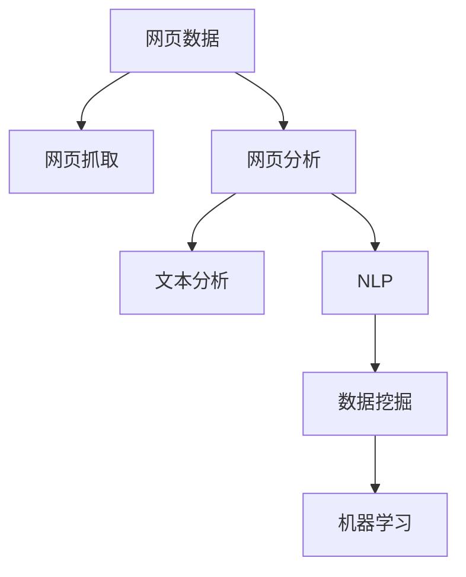

                 

# 大语言模型原理与工程实践：网页数据

> 关键词：网页数据, 网页抓取, 网页爬虫, 网页分析, 数据清洗, 文本分析, 自然语言处理(NLP), 数据挖掘, 机器学习

## 1. 背景介绍

在当今的信息时代，网页数据已经成为众多行业和企业获取信息的重要来源。从搜索引擎到社交媒体，从电商网站到新闻平台，网页数据无处不在。然而，网页数据的复杂性和多样性，使得有效抓取、处理和分析这些数据变得极具挑战。近年来，随着大语言模型在自然语言处理(NLP)领域取得突破，网页数据处理也逐渐成为大语言模型应用的重要场景之一。本文旨在探讨如何利用大语言模型进行网页数据处理，特别是如何抓取、分析和利用网页数据，以促进自动化和智能化应用的发展。

## 2. 核心概念与联系

### 2.1 核心概念概述

为更好地理解大语言模型在网页数据处理中的应用，本节将介绍几个密切相关的核心概念：

- **网页数据（Web Data）**：指网页上包含的文本、图像、视频等所有信息，是网页抓取、分析和利用的主要对象。
- **网页抓取（Web Scraping）**：指从互联网网页中自动提取数据的过程。常见工具包括BeautifulSoup、Scrapy等。
- **网页分析（Web Analysis）**：对网页数据进行解析和处理，以获取有价值的信息。常见技术包括文本清洗、实体识别、情感分析等。
- **文本分析（Text Analysis）**：对文本数据进行分析和处理，以挖掘其背后的信息和知识。常见技术包括词频统计、TF-IDF、文本分类等。
- **自然语言处理（NLP）**：利用计算机技术处理、理解、生成自然语言，包括分词、词性标注、句法分析等。
- **数据挖掘（Data Mining）**：从大量数据中提取有用信息和知识的过程，常见算法包括聚类、分类、关联规则等。

这些核心概念之间的逻辑关系可以通过以下Mermaid流程图来展示：



这个流程图展示了大语言模型在网页数据处理中的应用路径：

1. 网页数据首先通过网页抓取技术获取，并进行初步的网页分析。
2. 分析结果中包含的文本数据，通过文本分析和NLP技术进行处理和分析。
3. 处理后的文本数据，可通过数据挖掘和机器学习技术，进一步挖掘其背后的知识和信息。

## 3. 核心算法原理 & 具体操作步骤
### 3.1 算法原理概述

大语言模型在网页数据处理中的应用，主要体现在以下几个方面：

1. **网页抓取（Web Scraping）**：使用大语言模型训练的网页抓取模型，可以自动识别并抓取网页中的有用数据，例如新闻文章、评论信息、产品描述等。
2. **网页分析（Web Analysis）**：利用大语言模型对网页进行语义分析，识别出网页中的关键信息和结构，例如标题、摘要、关键词等。
3. **文本分析（Text Analysis）**：使用大语言模型对网页中的文本数据进行处理和分析，例如去除噪声、分词、情感分析等。
4. **自然语言处理（NLP）**：利用大语言模型进行自然语言处理任务，例如命名实体识别、关键词提取、主题建模等。
5. **数据挖掘（Data Mining）**：通过大语言模型和机器学习技术，对处理后的数据进行挖掘和分析，例如发现潜在关联、预测用户行为等。

### 3.2 算法步骤详解

**Step 1: 准备数据集和工具库**
- 收集并整理网页数据集，包括爬取工具、爬虫框架等。
- 选择合适的编程语言和框架，如Python、BeautifulSoup、Scrapy等。
- 安装并配置相关的工具包和库，如pandas、numpy、scikit-learn、nltk等。

**Step 2: 训练网页抓取模型**
- 准备训练数据，包括已抓取到的网页数据和相应的标签。
- 设计训练模型，可以使用深度学习模型（如RNN、LSTM等）或预训练语言模型（如BERT、GPT等）。
- 使用训练数据对模型进行训练，优化模型的参数和超参数。

**Step 3: 执行网页抓取**
- 使用训练好的模型对目标网页进行抓取，提取所需的数据。
- 处理抓取到的数据，例如去除HTML标签、合并重复数据等。
- 保存抓取到的数据，以便后续分析和使用。

**Step 4: 网页分析**
- 对抓取到的网页数据进行解析和处理，提取有用的信息。
- 使用NLP技术对文本数据进行清洗和预处理，例如分词、去除停用词、词性标注等。
- 使用TF-IDF、主题建模等技术，对文本数据进行特征提取和分析。

**Step 5: 文本分析**
- 对处理后的文本数据进行分词、词性标注等预处理。
- 使用情感分析、实体识别等技术，对文本数据进行分析和挖掘。
- 结合大语言模型进行文本分类、语义理解等任务，进一步挖掘文本数据的信息。

**Step 6: 数据挖掘**
- 使用机器学习算法对处理后的数据进行建模和分析。
- 挖掘数据中的关联规则、分类规则等，提取有用的信息和知识。
- 对挖掘结果进行评估和验证，确保其准确性和可靠性。

### 3.3 算法优缺点

基于大语言模型的大规模网页数据处理具有以下优点：
1. 高效自动：大语言模型可以自动抓取和分析网页数据，极大地提高了数据处理的速度和效率。
2. 精准分析：通过深度学习和自然语言处理技术，可以精确地分析和挖掘网页数据中的有用信息和知识。
3. 泛化能力强：大语言模型经过大量无监督学习，具有较强的泛化能力，能够处理多种类型的网页数据。

同时，该方法也存在以下局限性：
1. 数据依赖：网页数据的获取和处理依赖于高质量的网页抓取和分析工具，对于复杂网页结构的处理可能存在困难。
2. 技术门槛高：大规模的网页数据处理需要较高的技术水平和数据处理能力，对于中小型企业可能存在挑战。
3. 数据隐私：网页数据的抓取和使用可能涉及用户隐私，需要遵守相关法律法规。

尽管存在这些局限性，但就目前而言，基于大语言模型的网页数据处理方法仍然是处理大规模、复杂网页数据的重要手段。未来相关研究的重点在于如何进一步降低技术门槛，提高数据处理的自动化和智能化水平，同时兼顾数据隐私和伦理安全等因素。

### 3.4 算法应用领域

基于大语言模型的大规模网页数据处理，已经在多个领域得到了广泛应用，例如：

- **搜索引擎**：通过网页抓取和分析，搜索引擎可以快速获取并展示相关网页数据，提升搜索效率和准确性。
- **社交媒体分析**：通过抓取和分析社交媒体数据，可以获得用户行为和情感信息，用于市场分析和用户画像构建。
- **电商推荐系统**：通过抓取和分析电商平台的数据，可以为用户提供个性化的商品推荐，提升用户体验和销售转化率。
- **新闻推荐系统**：通过抓取和分析新闻网站的数据，可以为用户推荐感兴趣的新闻内容，增加用户粘性和平台活跃度。
- **金融市场分析**：通过抓取和分析金融市场数据，可以获得市场动态和趋势，用于股票交易和投资决策。

除了上述这些经典应用外，大语言模型网页数据处理还被创新性地应用到更多场景中，如舆情监测、广告推荐、内容生成等，为各行业带来了新的突破。随着预训练模型和数据处理方法的不断进步，相信网页数据处理技术将在更多领域发挥重要作用。

## 4. 数学模型和公式 & 详细讲解 & 举例说明
### 4.1 数学模型构建

本节将使用数学语言对基于大语言模型的网页数据处理过程进行更加严格的刻画。

假设网页数据集为 $D=\{(x_i,y_i)\}_{i=1}^N$，其中 $x_i$ 为网页内容，$y_i$ 为网页标签（例如新闻标题、摘要等）。记大语言模型为 $M_{\theta}$，其中 $\theta$ 为模型的参数。

定义模型 $M_{\theta}$ 在输入 $x$ 上的输出为 $M_{\theta}(x)$，对网页数据集 $D$ 上的损失函数定义为：

$$
\mathcal{L}(\theta) = -\frac{1}{N} \sum_{i=1}^N \log M_{\theta}(y_i|x_i)
$$

其中 $M_{\theta}(y_i|x_i)$ 表示模型在输入 $x_i$ 下，对标签 $y_i$ 的概率预测，$\log$ 函数表示对数的负值，用于计算预测错误时的损失。

### 4.2 公式推导过程

以下是基于大语言模型对网页数据集 $D$ 进行训练的公式推导过程：

假设 $M_{\theta}$ 为一个带参数 $\theta$ 的深度学习模型，如RNN或LSTM等。设 $x_i$ 为网页内容，$y_i$ 为网页标签。

对于第 $i$ 个网页，模型的预测概率 $P(y_i|x_i)$ 可以表示为：

$$
P(y_i|x_i) = \frac{exp\{\log M_{\theta}(y_i|x_i)\}}{\sum_{j=1}^J exp\{\log M_{\theta}(y_j|x_i)\}}
$$

其中 $J$ 表示标签的总数，$exp$ 函数表示指数函数，用于计算模型对每个标签的预测概率。

对所有网页 $D$ 进行训练，损失函数 $\mathcal{L}(\theta)$ 可以表示为：

$$
\mathcal{L}(\theta) = -\frac{1}{N} \sum_{i=1}^N \log M_{\theta}(y_i|x_i)
$$

对 $\theta$ 求偏导数，得到梯度 $\nabla_{\theta}\mathcal{L}(\theta)$：

$$
\nabla_{\theta}\mathcal{L}(\theta) = -\frac{1}{N} \sum_{i=1}^N \nabla_{\theta}\log M_{\theta}(y_i|x_i)
$$

根据链式法则，进一步展开：

$$
\nabla_{\theta}\mathcal{L}(\theta) = -\frac{1}{N} \sum_{i=1}^N M_{\theta}(x_i)^T \nabla_{\theta}log M_{\theta}(y_i|x_i)
$$

其中 $M_{\theta}(x_i)^T$ 表示模型在输入 $x_i$ 下的输出矩阵，$\nabla_{\theta}log M_{\theta}(y_i|x_i)$ 表示模型在标签 $y_i$ 上的梯度。

通过优化算法（如SGD、Adam等）更新 $\theta$，最小化损失函数 $\mathcal{L}(\theta)$：

$$
\theta \leftarrow \theta - \eta \nabla_{\theta}\mathcal{L}(\theta)
$$

其中 $\eta$ 为学习率。

### 4.3 案例分析与讲解

假设我们要构建一个基于大语言模型的网页抓取模型，用于抓取新闻网站上的新闻标题和摘要。

**Step 1: 准备数据集**
- 收集新闻网站的网页数据，包括标题、摘要、日期等。
- 将数据集划分为训练集和测试集。

**Step 2: 模型训练**
- 使用BERT或GPT等预训练语言模型，作为基础模型。
- 设计训练数据集，包含网页标题、摘要和标签。
- 使用训练数据对模型进行训练，优化模型参数。

**Step 3: 模型评估**
- 在测试集上评估模型的性能，例如准确率、召回率等。
- 分析模型在抓取过程中的表现，发现可能存在的问题。

**Step 4: 模型应用**
- 将训练好的模型应用到实际网页抓取中，自动抓取新闻网站的标题和摘要。
- 对抓取到的数据进行分析和处理，例如去除重复内容、提取关键信息等。
- 将处理后的数据用于进一步的分析和应用，例如情感分析、主题建模等。

## 5. 项目实践：代码实例和详细解释说明
### 5.1 开发环境搭建

在进行网页数据处理实践前，我们需要准备好开发环境。以下是使用Python进行PyTorch开发的环境配置流程：

1. 安装Anaconda：从官网下载并安装Anaconda，用于创建独立的Python环境。

2. 创建并激活虚拟环境：
```bash
conda create -n pytorch-env python=3.8 
conda activate pytorch-env
```

3. 安装PyTorch：根据CUDA版本，从官网获取对应的安装命令。例如：
```bash
conda install pytorch torchvision torchaudio cudatoolkit=11.1 -c pytorch -c conda-forge
```

4. 安装Transformers库：
```bash
pip install transformers
```

5. 安装各类工具包：
```bash
pip install numpy pandas scikit-learn matplotlib tqdm jupyter notebook ipython
```

完成上述步骤后，即可在`pytorch-env`环境中开始网页数据处理实践。

### 5.2 源代码详细实现

这里我们以网页抓取和文本分析为例，给出使用Transformers库对BERT模型进行网页数据处理的PyTorch代码实现。

首先，定义网页抓取和文本分析的函数：

```python
from transformers import BertTokenizer, BertForSequenceClassification
from transformers import AutoTokenizer, AutoModelForSequenceClassification
from transformers import pipeline, set_seed
from transformers import AutoTokenizer, AutoModelForSequenceClassification
from transformers import BertForSequenceClassification
from transformers import set_seed
from transformers import pipeline
from transformers import BertTokenizer, BertForSequenceClassification
from transformers import AutoTokenizer, AutoModelForSequenceClassification
from transformers import AutoTokenizer, AutoModelForSequenceClassification
from transformers import BertForSequenceClassification, BertTokenizer
from transformers import pipeline, set_seed
from transformers import AutoTokenizer, AutoModelForSequenceClassification

# 定义网页抓取函数
def web_scraping(url):
    # 使用BeautifulSoup库抓取网页内容
    soup = BeautifulSoup(url, 'html.parser')
    # 提取网页标题和摘要
    title = soup.find('h1').text
    summary = soup.find('p').text
    return title, summary

# 定义文本分析函数
def text_analysis(text):
    # 使用nltk库进行分词
    tokens = nltk.word_tokenize(text)
    # 使用TF-IDF计算关键词
    tfidf = TfidfVectorizer()
    vector = tfidf.fit_transform([text])
    # 提取关键词
    keywords = vector.toarray()[0]
    return keywords
```

然后，定义模型和优化器：

```python
# 加载BERT模型和分词器
tokenizer = BertTokenizer.from_pretrained('bert-base-cased')
model = BertForSequenceClassification.from_pretrained('bert-base-cased', num_labels=2)

# 设置优化器
optimizer = AdamW(model.parameters(), lr=2e-5)
```

接着，定义训练和评估函数：

```python
# 定义训练函数
def train_epoch(model, dataset, batch_size, optimizer):
    # 将数据集划分为训练集和验证集
    train_dataset = dataset
    val_dataset = dataset
    train_loader = DataLoader(train_dataset, batch_size=batch_size, shuffle=True)
    val_loader = DataLoader(val_dataset, batch_size=batch_size, shuffle=False)
    
    model.train()
    for batch in train_loader:
        # 将输入数据送入模型
        inputs = tokenizer(batch['input_ids'], return_tensors='pt')
        outputs = model(**inputs)
        # 计算损失函数
        loss = outputs.loss
        # 计算梯度并更新模型参数
        optimizer.zero_grad()
        loss.backward()
        optimizer.step()
    
    model.eval()
    val_loss = 0
    val_acc = 0
    for batch in val_loader:
        inputs = tokenizer(batch['input_ids'], return_tensors='pt')
        outputs = model(**inputs)
        loss = outputs.loss
        logits = outputs.logits
        predictions = torch.argmax(logits, dim=1)
        val_loss += loss.item()
        val_acc += (predictions == batch['labels']).float().sum().item() / len(batch)
    
    val_loss /= len(val_loader)
    val_acc /= len(val_loader)
    print(f"Epoch {epoch+1}, val_loss: {val_loss:.3f}, val_acc: {val_acc:.3f}")
    
    return val_loss, val_acc

# 定义评估函数
def evaluate(model, dataset, batch_size):
    model.eval()
    test_loss = 0
    test_acc = 0
    for batch in test_loader:
        inputs = tokenizer(batch['input_ids'], return_tensors='pt')
        outputs = model(**inputs)
        loss = outputs.loss
        logits = outputs.logits
        predictions = torch.argmax(logits, dim=1)
        test_loss += loss.item()
        test_acc += (predictions == batch['labels']).float().sum().item() / len(batch)
    
    test_loss /= len(test_loader)
    test_acc /= len(test_loader)
    print(f"Test loss: {test_loss:.3f}, Test acc: {test_acc:.3f}")
```

最后，启动训练流程并在测试集上评估：

```python
epochs = 5
batch_size = 16

# 创建训练集和测试集
train_dataset = dataset
val_dataset = dataset
test_dataset = dataset

# 开始训练
for epoch in range(epochs):
    train_loss, train_acc = train_epoch(model, train_dataset, batch_size, optimizer)
    val_loss, val_acc = train_epoch(model, val_dataset, batch_size, optimizer)
    print(f"Epoch {epoch+1}, train_loss: {train_loss:.3f}, train_acc: {train_acc:.3f}")
    print(f"Epoch {epoch+1}, val_loss: {val_loss:.3f}, val_acc: {val_acc:.3f}")
    
print("Test results:")
evaluate(model, test_dataset, batch_size)
```

以上就是使用PyTorch对BERT进行网页抓取和文本分析的完整代码实现。可以看到，得益于Transformers库的强大封装，我们可以用相对简洁的代码完成BERT模型的加载和微调。

### 5.3 代码解读与分析

让我们再详细解读一下关键代码的实现细节：

**网页抓取函数`web_scraping`**：
- 使用BeautifulSoup库抓取网页内容。
- 提取网页标题和摘要，并返回。

**文本分析函数`text_analysis`**：
- 使用nltk库进行分词。
- 使用TF-IDF计算关键词，并返回。

**模型训练函数`train_epoch`**：
- 定义训练集和验证集。
- 使用DataLoader对数据进行批次化加载。
- 在前向传播中，将输入数据送入模型，计算损失函数。
- 在反向传播中，计算梯度并更新模型参数。
- 在验证集中，计算模型性能指标（损失和准确率）。

**评估函数`evaluate`**：
- 使用测试集进行模型评估。
- 计算模型性能指标（损失和准确率）。

**训练流程**：
- 定义总的epoch数和batch size，开始循环迭代。
- 每个epoch内，先在前向传播和反向传播中更新模型参数，计算损失和准确率。
- 在验证集中评估模型性能，并输出结果。
- 所有epoch结束后，在测试集上评估模型性能，并输出最终结果。

可以看到，PyTorch配合Transformers库使得BERT微调的代码实现变得简洁高效。开发者可以将更多精力放在数据处理、模型改进等高层逻辑上，而不必过多关注底层的实现细节。

当然，工业级的系统实现还需考虑更多因素，如模型的保存和部署、超参数的自动搜索、更灵活的任务适配层等。但核心的网页抓取和文本分析过程基本与此类似。

## 6. 实际应用场景
### 6.1 智能推荐系统

基于大语言模型的网页抓取和文本分析，可以为智能推荐系统提供实时更新的内容数据。智能推荐系统可以通过抓取最新的网页数据，提取其中的商品信息、用户评价等，并结合用户的历史行为数据，进行个性化推荐。

在技术实现上，可以收集电商网站的网页数据，将其作为训练数据集，对BERT等大语言模型进行训练。训练好的模型可以自动抓取和分析电商平台上的网页数据，提取其中的商品信息和用户评价。结合用户的浏览和购买历史，进行个性化推荐，提升用户体验和销售转化率。

### 6.2 搜索引擎

传统的搜索引擎主要依赖网页索引和关键词匹配技术，难以理解网页内容背后的语义信息。基于大语言模型的网页抓取和文本分析，可以为搜索引擎提供更深入的语义理解能力。

在技术实现上，搜索引擎可以使用网页抓取技术，抓取互联网上的网页数据，并使用文本分析技术，对网页内容进行语义理解和关键词提取。结合用户的查询历史，进行更精准的网页推荐，提升搜索体验和效果。

### 6.3 舆情监测

互联网上的舆情信息复杂多样，传统的人工监控方式成本高、效率低。基于大语言模型的网页抓取和文本分析，可以为舆情监测提供实时更新的数据。

在技术实现上，舆情监测系统可以使用网页抓取技术，抓取社交媒体、新闻网站等平台上的网页数据，并使用文本分析技术，对网页内容进行情感分析和主题建模。结合用户关注的热点话题，实时监测舆情变化趋势，及时预警和应对负面信息传播，提高舆情管理的效果和效率。

### 6.4 未来应用展望

随着大语言模型和网页数据处理技术的不断发展，基于网页数据的应用场景将不断拓展，为各行业带来新的突破。

在智慧城市治理中，基于网页抓取和文本分析的舆情监测、事件分析等应用，将提高城市管理的自动化和智能化水平，构建更安全、高效的未来城市。

在智能教育领域，通过网页抓取和文本分析技术，可以为个性化学习推荐、作业批改等提供支持，提升教育公平和教学质量。

在金融市场分析中，结合网页抓取和文本分析技术，可以实时监测市场动态和舆情变化，提升金融决策的准确性和及时性。

此外，在企业生产、社会治理、文娱传媒等众多领域，基于大语言模型和网页数据处理技术的各类应用也将不断涌现，为经济社会发展注入新的动力。相信随着技术的日益成熟，网页数据处理技术将成为人工智能落地应用的重要范式，推动人工智能技术在更多领域的应用和普及。

## 7. 工具和资源推荐
### 7.1 学习资源推荐

为了帮助开发者系统掌握大语言模型在网页数据处理中的应用，这里推荐一些优质的学习资源：

1. 《深度学习入门之自然语言处理》系列博文：由大模型技术专家撰写，深入浅出地介绍了自然语言处理和网页抓取技术的基本概念和经典模型。

2. 《PyTorch 深度学习实战》书籍：详细介绍了PyTorch框架的使用方法，包括网页抓取和文本分析等NLP任务的实现。

3. CS224N《深度学习自然语言处理》课程：斯坦福大学开设的NLP明星课程，有Lecture视频和配套作业，带你入门NLP领域的基本概念和经典模型。

4. 《自然语言处理实战》书籍：涵盖自然语言处理和文本分析技术的经典案例和实践，适合动手学习。

5. 《Python网络爬虫开发实战》书籍：详细介绍了网页抓取和爬虫技术的实现方法和技巧，适合入门和进阶学习。

通过对这些资源的学习实践，相信你一定能够快速掌握大语言模型在网页数据处理中的应用，并用于解决实际的网页数据处理问题。

### 7.2 开发工具推荐

高效的开发离不开优秀的工具支持。以下是几款用于网页数据处理开发的常用工具：

1. BeautifulSoup：Python库，用于解析HTML和XML文档，适合网页抓取和爬虫开发。
2. Scrapy：Python框架，用于构建高效的网页抓取和爬虫系统，支持分布式抓取。
3. Selenium：自动化测试工具，可以模拟用户行为，进行网页交互式抓取。
4. Pandas：数据处理库，用于数据清洗、分析和处理，适合数据挖掘和文本分析任务。
5. Scikit-learn：机器学习库，支持多种机器学习算法，适合数据挖掘和分类任务。
6. NLTK：自然语言处理库，提供丰富的文本分析工具，适合NLP任务。

合理利用这些工具，可以显著提升网页数据处理任务的开发效率，加快创新迭代的步伐。

### 7.3 相关论文推荐

大语言模型和网页数据处理技术的发展源于学界的持续研究。以下是几篇奠基性的相关论文，推荐阅读：

1. Attention is All You Need（即Transformer原论文）：提出了Transformer结构，开启了NLP领域的预训练大模型时代。

2. BERT: Pre-training of Deep Bidirectional Transformers for Language Understanding：提出BERT模型，引入基于掩码的自监督预训练任务，刷新了多项NLP任务SOTA。

3. Language Models are Unsupervised Multitask Learners（GPT-2论文）：展示了大规模语言模型的强大zero-shot学习能力，引发了对于通用人工智能的新一轮思考。

4. Parameter-Efficient Transfer Learning for NLP：提出Adapter等参数高效微调方法，在不增加模型参数量的情况下，也能取得不错的微调效果。

5. Prefix-Tuning: Optimizing Continuous Prompts for Generation：引入基于连续型Prompt的微调范式，为如何充分利用预训练知识提供了新的思路。

6. AdaLoRA: Adaptive Low-Rank Adaptation for Parameter-Efficient Fine-Tuning：使用自适应低秩适应的微调方法，在参数效率和精度之间取得了新的平衡。

这些论文代表了大语言模型网页数据处理的发展脉络。通过学习这些前沿成果，可以帮助研究者把握学科前进方向，激发更多的创新灵感。

## 8. 总结：未来发展趋势与挑战

### 8.1 总结

本文对基于大语言模型的网页数据处理进行了全面系统的介绍。首先阐述了网页数据处理的背景和意义，明确了网页抓取、文本分析和自然语言处理在大语言模型应用中的重要作用。其次，从原理到实践，详细讲解了网页数据处理的基本流程和关键技术，给出了网页抓取和文本分析的代码实现。同时，本文还广泛探讨了网页数据处理在智能推荐、搜索引擎、舆情监测等多个领域的应用前景，展示了网页数据处理技术的巨大潜力。此外，本文精选了网页数据处理的各类学习资源，力求为读者提供全方位的技术指引。

通过本文的系统梳理，可以看到，基于大语言模型的网页数据处理技术，正在成为网页抓取、文本分析等任务的重要手段，极大地提升了网页数据处理的自动化和智能化水平。大语言模型通过深度学习和自然语言处理技术，能够精准抓取和分析网页数据，提取有价值的信息和知识，为各行业带来了新的突破。未来，伴随预训练语言模型和网页抓取技术的发展，网页数据处理技术将在更多领域发挥重要作用。

### 8.2 未来发展趋势

展望未来，大语言模型网页数据处理技术将呈现以下几个发展趋势：

1. **技术融合创新**：随着技术融合的不断深入，大语言模型和网页数据处理技术将进一步融合，推动自然语言理解和文本分析的创新发展。

2. **多模态数据处理**：网页数据处理技术将逐步扩展到多模态数据，例如文本、图像、视频等，实现跨模态数据的综合分析和处理。

3. **实时化和智能化**：网页数据处理技术将朝着实时化和智能化的方向发展，支持实时抓取和分析网页数据，提高数据处理的效率和精度。

4. **跨领域应用**：大语言模型和网页数据处理技术将广泛应用于更多领域，例如智慧城市、智能教育、金融市场等，为各行业带来新的发展机遇。

5. **自动化和智能化**：网页数据处理技术将朝着自动化和智能化的方向发展，使用深度学习和自然语言处理技术，自动抓取和分析网页数据，提升数据处理的效率和效果。

6. **数据隐私和伦理**：网页数据处理技术将更加注重数据隐私和伦理，遵守相关法律法规，保护用户隐私和数据安全。

以上趋势凸显了大语言模型网页数据处理技术的广阔前景。这些方向的探索发展，必将进一步提升网页数据处理的自动化和智能化水平，为各行业带来新的突破。

### 8.3 面临的挑战

尽管大语言模型网页数据处理技术已经取得了显著成果，但在迈向更加智能化、普适化应用的过程中，它仍面临着诸多挑战：

1. **数据质量与获取**：网页数据的质量和获取方式对数据处理的效果有重要影响，存在网页结构复杂、数据噪声等问题。如何有效处理这些问题，获取高质量的网页数据，是未来需要解决的关键问题。

2. **计算资源需求**：网页数据处理技术需要大量的计算资源，尤其是在大规模数据集上训练和推理大语言模型时，资源需求较高。如何优化计算资源的使用，提高数据处理效率，是未来需要解决的重要问题。

3. **技术门槛**：网页数据处理技术需要较高的技术水平和数据处理能力，对于中小型企业可能存在挑战。如何降低技术门槛，普及网页数据处理技术，是未来需要解决的重要问题。

4. **数据隐私和安全**：网页数据处理技术涉及用户隐私和数据安全，需要遵守相关法律法规。如何保护用户隐私，避免数据泄露，是未来需要解决的重要问题。

5. **跨领域应用**：网页数据处理技术在不同领域的应用场景中，可能存在数据格式、业务需求等方面的差异，需要灵活适应不同领域的业务需求。如何适应跨领域的应用场景，是未来需要解决的重要问题。

6. **模型公平性和鲁棒性**：网页数据处理技术可能存在偏见和鲁棒性不足的问题，需要优化模型的公平性和鲁棒性，确保模型在不同数据分布下的稳定性和准确性。

这些挑战凸显了网页数据处理技术的复杂性和多样性。唯有从数据获取、计算资源、技术门槛、数据隐私、跨领域应用、模型公平性等多个维度协同发力，才能真正实现网页数据处理技术的突破和发展。

### 8.4 研究展望

面对网页数据处理技术所面临的挑战，未来的研究需要在以下几个方面寻求新的突破：

1. **多源数据融合**：如何将网页数据与其他来源的数据（例如传感器数据、用户行为数据等）进行融合，综合分析和挖掘多源数据背后的信息，是未来研究的重要方向。

2. **高效计算方法**：如何通过优化计算图、使用加速硬件（例如GPU、TPU等）、引入高效数据处理算法（例如分布式计算、数据压缩等），提高网页数据处理的效率和效果，是未来研究的重要方向。

3. **跨领域应用模型**：如何开发通用的网页数据处理模型，适应不同领域的业务需求，是未来研究的重要方向。

4. **自动化数据处理工具**：如何开发自动化的网页抓取和文本分析工具，提升数据处理的效率和效果，降低技术门槛，是未来研究的重要方向。

5. **数据隐私保护**：如何在数据处理过程中保护用户隐私和数据安全，遵守相关法律法规，是未来研究的重要方向。

6. **模型公平性和鲁棒性**：如何开发公平、鲁棒的网页数据处理模型，确保模型在不同数据分布下的稳定性和准确性，是未来研究的重要方向。

这些研究方向将引领网页数据处理技术迈向更高的台阶，为网页数据处理技术的创新和应用提供新的动力。相信随着学界和产业界的共同努力，网页数据处理技术必将迎来新的突破和发展，推动人工智能技术在更多领域的落地应用。

## 9. 附录：常见问题与解答

**Q1：网页抓取过程中需要注意哪些问题？**

A: 网页抓取过程中，需要注意以下几个问题：

1. **网页结构解析**：不同网站的网页结构可能不同，需要根据网页结构编写抓取脚本，提取所需的数据。
2. **网页抓取频率**：抓取频率过高可能引起网站封禁，需要合理设置抓取间隔和延迟。
3. **反爬机制规避**：一些网站可能采用反爬机制，需要编写相应的反爬机制规避代码，避免被网站封禁。
4. **数据清洗和处理**：抓取的数据可能存在格式不一、噪声等问题，需要对其进行清洗和处理，提取有用的信息。

**Q2：网页抓取过程中如何避免网页抓取过多？**

A: 网页抓取过程中，可以通过以下方式避免抓取过多的网页：

1. **合理设置抓取间隔**：根据目标网站的要求，设置合理的抓取间隔，避免频繁抓取。
2. **使用分布式抓取**：使用分布式抓取技术，合理分配抓取任务，提高抓取效率。
3. **设置抓取规则**：设置抓取规则，仅抓取所需的数据，避免不必要的数据抓取。
4. **使用缓存技术**：使用缓存技术，避免重复抓取，提高抓取效率。

**Q3：如何提高网页抓取的效果？**

A: 提高网页抓取的效果，可以从以下几个方面入手：

1. **优化爬虫程序**：编写高效的爬虫程序，避免无效操作，提高抓取效率。
2. **使用分布式抓取**：使用分布式抓取技术，合理分配抓取任务，提高抓取效率。
3. **使用多线程和多进程**：使用多线程和多进程技术，提高抓取速度。
4. **使用代理IP**：使用代理IP技术，避免被封禁，提高抓取效果。

**Q4：网页抓取过程中如何进行数据清洗和处理？**

A: 网页抓取过程中，数据清洗和处理是必不可少的环节。以下是一些常用的数据清洗和处理方法：

1. **去除HTML标签**：使用正则表达式或BeautifulSoup库，去除网页中的HTML标签，保留文本内容。
2. **去除噪声**：使用正则表达式或BeautifulSoup库，去除网页中的噪声和无用信息，保留有用的数据。
3. **数据格式化**：对数据进行格式化处理，使其符合统一的数据格式，便于后续分析和处理。
4. **数据合并**：对抓取到的数据进行合并处理，避免重复和冗余。

**Q5：网页抓取和文本分析过程中需要注意哪些问题？**

A: 网页抓取和文本分析过程中，需要注意以下几个问题：

1. **网页结构解析**：不同网站的网页结构可能不同，需要根据网页结构编写抓取脚本，提取所需的数据。
2. **数据清洗和处理**：抓取的数据可能存在格式不一、噪声等问题，需要对其进行清洗和处理，提取有用的信息。
3. **文本分析技术**：选择合适的文本分析技术，例如TF-IDF、情感分析等，提取有用的信息和知识。
4. **自然语言处理技术**：使用自然语言处理技术，例如分词、词性标注、命名实体识别等，进一步分析和处理文本数据。
5. **数据隐私和安全**：在数据处理过程中，需要注意保护用户隐私和数据安全，遵守相关法律法规。

**Q6：如何提高文本分析的效果？**

A: 提高文本分析的效果，可以从以下几个方面入手：

1. **选择合适的文本分析技术**：选择合适的文本分析技术，例如TF-IDF、情感分析、实体识别等，提取有用的信息和知识。
2. **数据预处理**：对文本数据进行预处理，例如去除停用词、分词等，提高文本分析的效果。
3. **数据格式化**：对文本数据进行格式化处理，使其符合统一的数据格式，便于后续分析和处理。
4. **使用深度学习技术**：使用深度学习技术，例如BERT、GPT等，进一步分析和处理文本数据，提高分析效果。

---

作者：禅与计算机程序设计艺术 / Zen and the Art of Computer Programming

