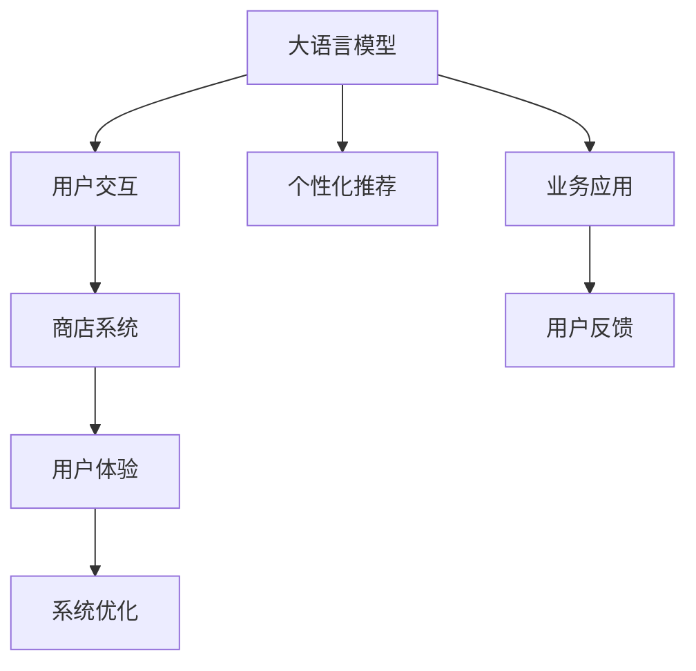

                 

# 大语言模型应用指南：GPT商店介绍

> 关键词：大语言模型, GPT-3, 自然语言处理(NLP), 商店系统, 用户交互, 个性化推荐, 业务应用

## 1. 背景介绍

### 1.1 问题由来
随着人工智能技术的发展，大语言模型（Large Language Model, LLM）在自然语言处理（NLP）领域取得了巨大突破。尤其是OpenAI的GPT-3模型，凭借其强大的语言理解和生成能力，成为NLP研究和应用的标杆。然而，GPT-3等预训练大语言模型由于其巨大的参数量和计算资源需求，应用场景相对受限。

为了更好地将大语言模型应用于实际业务场景，GPT商店应运而生。它通过将大语言模型的功能模块化，并提供简单易用的接口，使得开发者能够快速构建基于GPT-3的商店系统，满足用户个性化需求。

### 1.2 问题核心关键点
GPT商店的核心在于如何将GPT-3的强大能力转化为可用的商店系统，实现用户交互、个性化推荐等功能。其关键点包括：
- 选择合适的模型功能。
- 设计合理的用户界面。
- 保证系统的高效性和安全性。
- 进行持续优化以提升用户体验。

### 1.3 问题研究意义
GPT商店为开发者和企业提供了一种高效、便捷的方法，将大语言模型应用于商店系统，极大地降低了应用开发的成本和时间。通过GPT商店，开发者可以轻松地将大语言模型的能力整合到商店系统中，提升客户体验，增强竞争力。

## 2. 核心概念与联系

### 2.1 核心概念概述

为更好地理解GPT商店的核心概念，本节将介绍几个关键概念：

- **大语言模型（Large Language Model, LLM）**：如GPT-3等预训练语言模型，通过在大规模无标签文本数据上进行预训练，学习通用的语言表示。
- **GPT商店（GPT Shops）**：将大语言模型的功能模块化，提供易于集成的商店系统。
- **用户交互（User Interaction）**：通过大语言模型理解用户意图，提供自然语言回复。
- **个性化推荐（Personalized Recommendation）**：利用大语言模型学习用户偏好，实现产品推荐。
- **业务应用（Business Application）**：将大语言模型的能力应用到具体的商业场景中，如商店系统。

这些核心概念之间的联系可以通过以下Mermaid流程图来展示：



这个流程图展示了大语言模型在商店系统中的作用：

1. 大语言模型通过用户交互理解用户意图。
2. 通过个性化推荐提升用户满意度。
3. 集成到商店系统中，提升业务效果。
4. 根据用户反馈不断优化系统，提升用户体验。

## 3. 核心算法原理 & 具体操作步骤

### 3.1 算法原理概述

GPT商店的核心算法原理可以归纳为以下几个方面：

- **语言模型预训练**：在大规模文本数据上进行自监督预训练，学习通用的语言表示。
- **任务适配**：在预训练模型的基础上，针对特定任务进行微调，以提高模型在该任务上的性能。
- **用户交互模型**：使用GPT-3等大语言模型进行用户意图的理解，并生成自然语言回复。
- **个性化推荐模型**：基于用户历史行为和偏好，利用大语言模型进行产品推荐。

### 3.2 算法步骤详解

以下是GPT商店的核心算法步骤：

**Step 1: 数据准备**
- 收集商店的销售数据、用户行为数据、用户反馈数据等，作为训练数据。
- 对数据进行清洗、标注，准备用于训练和微调。

**Step 2: 模型选择和适配**
- 选择合适的预训练大语言模型，如GPT-3。
- 根据商店系统需求，选择相应的任务适配层，如自然语言理解、对话系统、推荐系统等。

**Step 3: 微调训练**
- 在标注数据上对模型进行微调，以适应商店系统的特定任务。
- 使用AdamW等优化算法，设置合适的学习率、批大小、迭代轮数等参数。

**Step 4: 模型部署和测试**
- 将微调后的模型集成到商店系统中。
- 在测试集上评估模型的性能，确保其在实际应用中效果良好。
- 进行A/B测试，对比不同版本的商店系统效果。

**Step 5: 持续优化**
- 收集用户反馈，不断优化模型和系统。
- 定期重新微调模型，以适应数据分布的变化。

### 3.3 算法优缺点

GPT商店的优点包括：

- 大语言模型具有强大的语言理解和生成能力，可以提升用户交互体验。
- 预训练-微调的方法可以在少量标注数据下快速训练模型，降低开发成本。
- 模块化设计使得系统易于集成和扩展，满足不同业务需求。

同时，该方法也存在一定的局限性：

- 对标注数据的质量和数量有较高要求，难以处理长尾应用场景。
- 大模型计算资源需求高，部署成本较大。
- 用户交互和推荐模型的复杂性可能导致系统响应时间较长，影响用户体验。

尽管存在这些局限性，GPT商店仍然为大语言模型在商店系统的应用提供了强有力的支持，其灵活性和高效性使其在实际业务中具有广泛的应用前景。

### 3.4 算法应用领域

GPT商店在大规模商店系统中具有广泛的应用场景，以下是几个典型的应用领域：

- **智能客服**：通过用户交互模型，大语言模型能够理解用户问题，并提供快速响应。
- **个性化推荐**：利用个性化推荐模型，根据用户历史行为和偏好，提供定制化的商品推荐。
- **广告投放优化**：通过分析用户反馈，优化广告投放策略，提高广告效果。
- **库存管理**：利用大语言模型进行销售预测，优化库存管理。
- **情感分析**：通过用户评论，利用情感分析模型识别情感倾向，改进商品或服务。

## 4. 数学模型和公式 & 详细讲解  
### 4.1 数学模型构建

为了更好地理解GPT商店的核心算法原理，本节将使用数学语言对GPT商店的微调过程进行更加严格的刻画。

假设商店的标注数据集为 $D=\{(x_i, y_i)\}_{i=1}^N, x_i \in \mathcal{X}, y_i \in \mathcal{Y}$，其中 $x_i$ 为商店销售数据，$y_i$ 为推荐商品。使用大语言模型 $M_{\theta}$ 作为基础模型，定义微调任务的损失函数为：

$$
\mathcal{L}(\theta) = \frac{1}{N} \sum_{i=1}^N \ell(M_{\theta}(x_i),y_i)
$$

其中 $\ell$ 为推荐系统的损失函数，用于衡量模型预测与真实标签之间的差异。

### 4.2 公式推导过程

以推荐系统的二分类任务为例，推荐系统模型 $M_{\theta}$ 在输入 $x_i$ 上的输出为 $\hat{y}=M_{\theta}(x_i) \in [0,1]$，表示商品推荐的概率。真实标签 $y_i \in \{0,1\}$。则二分类交叉熵损失函数定义为：

$$
\ell(M_{\theta}(x_i),y_i) = -[y_i\log \hat{y} + (1-y_i)\log(1-\hat{y})]
$$

将其代入经验风险公式，得：

$$
\mathcal{L}(\theta) = -\frac{1}{N}\sum_{i=1}^N [y_i\log M_{\theta}(x_i)+(1-y_i)\log(1-M_{\theta}(x_i))]
$$

根据链式法则，损失函数对参数 $\theta_k$ 的梯度为：

$$
\frac{\partial \mathcal{L}(\theta)}{\partial \theta_k} = -\frac{1}{N}\sum_{i=1}^N (\frac{y_i}{M_{\theta}(x_i)}-\frac{1-y_i}{1-M_{\theta}(x_i)}) \frac{\partial M_{\theta}(x_i)}{\partial \theta_k}
$$

其中 $\frac{\partial M_{\theta}(x_i)}{\partial \theta_k}$ 可进一步递归展开，利用自动微分技术完成计算。

### 4.3 案例分析与讲解

以下是一个简化的用户交互模型案例，通过GPT-3实现用户问题的自然语言理解：

- **输入**：用户提出的问题，如“今天有促销吗？”。
- **处理**：使用GPT-3将问题转换为内部表示 $x_i$。
- **输出**：模型输出的表示 $y_i$，作为商店系统的决策依据。

```python
from transformers import GPT3LMHeadModel, GPT3Tokenizer

tokenizer = GPT3Tokenizer.from_pretrained('gpt3-medium')
model = GPT3LMHeadModel.from_pretrained('gpt3-medium')

# 将用户问题转换为模型输入
question = "今天有促销吗？"
inputs = tokenizer(question, return_tensors='pt')

# 生成模型输出
outputs = model(**inputs)

# 获取模型的预测结果
logits = outputs.logits
proba = logits.softmax(dim=-1)
result = probs.argmax(dim=-1).item()
```

通过上述代码，我们可以实现对用户问题的自然语言理解，并根据预测结果提供相应的回答。

## 5. 项目实践：代码实例和详细解释说明
### 5.1 开发环境搭建

在进行GPT商店的开发前，我们需要准备好开发环境。以下是使用Python进行PyTorch开发的环境配置流程：

1. 安装Anaconda：从官网下载并安装Anaconda，用于创建独立的Python环境。

2. 创建并激活虚拟环境：
```bash
conda create -n pytorch-env python=3.8 
conda activate pytorch-env
```

3. 安装PyTorch：根据CUDA版本，从官网获取对应的安装命令。例如：
```bash
conda install pytorch torchvision torchaudio cudatoolkit=11.1 -c pytorch -c conda-forge
```

4. 安装Transformers库：
```bash
pip install transformers
```

5. 安装各类工具包：
```bash
pip install numpy pandas scikit-learn matplotlib tqdm jupyter notebook ipython
```

完成上述步骤后，即可在`pytorch-env`环境中开始GPT商店的开发。

### 5.2 源代码详细实现

下面我们以个性化推荐系统为例，给出使用Transformers库对GPT-3模型进行微调的PyTorch代码实现。

首先，定义推荐系统任务的数据处理函数：

```python
from transformers import GPT3LMHeadModel, GPT3Tokenizer

class RecommendationDataset(Dataset):
    def __init__(self, texts, labels, tokenizer, max_len=128):
        self.texts = texts
        self.labels = labels
        self.tokenizer = tokenizer
        self.max_len = max_len
        
    def __len__(self):
        return len(self.texts)
    
    def __getitem__(self, item):
        text = self.texts[item]
        labels = self.labels[item]
        
        encoding = self.tokenizer(text, return_tensors='pt', max_length=self.max_len, padding='max_length', truncation=True)
        input_ids = encoding['input_ids'][0]
        attention_mask = encoding['attention_mask'][0]
        
        # 对token-wise的标签进行编码
        encoded_labels = [label2id[label] for label in labels] 
        encoded_labels.extend([label2id['None']] * (self.max_len - len(encoded_labels)))
        labels = torch.tensor(encoded_labels, dtype=torch.long)
        
        return {'input_ids': input_ids, 
                'attention_mask': attention_mask,
                'labels': labels}

# 标签与id的映射
label2id = {'None': 0, 'ProductA': 1, 'ProductB': 2, 'ProductC': 3}
id2label = {v: k for k, v in label2id.items()}

# 创建dataset
tokenizer = GPT3Tokenizer.from_pretrained('gpt3-medium')

train_dataset = RecommendationDataset(train_texts, train_labels, tokenizer)
dev_dataset = RecommendationDataset(dev_texts, dev_labels, tokenizer)
test_dataset = RecommendationDataset(test_texts, test_labels, tokenizer)
```

然后，定义模型和优化器：

```python
from transformers import GPT3LMHeadModel, AdamW

model = GPT3LMHeadModel.from_pretrained('gpt3-medium', num_labels=len(label2id))

optimizer = AdamW(model.parameters(), lr=2e-5)
```

接着，定义训练和评估函数：

```python
from torch.utils.data import DataLoader
from tqdm import tqdm
from sklearn.metrics import classification_report

device = torch.device('cuda') if torch.cuda.is_available() else torch.device('cpu')
model.to(device)

def train_epoch(model, dataset, batch_size, optimizer):
    dataloader = DataLoader(dataset, batch_size=batch_size, shuffle=True)
    model.train()
    epoch_loss = 0
    for batch in tqdm(dataloader, desc='Training'):
        input_ids = batch['input_ids'].to(device)
        attention_mask = batch['attention_mask'].to(device)
        labels = batch['labels'].to(device)
        model.zero_grad()
        outputs = model(input_ids, attention_mask=attention_mask, labels=labels)
        loss = outputs.loss
        epoch_loss += loss.item()
        loss.backward()
        optimizer.step()
    return epoch_loss / len(dataloader)

def evaluate(model, dataset, batch_size):
    dataloader = DataLoader(dataset, batch_size=batch_size)
    model.eval()
    preds, labels = [], []
    with torch.no_grad():
        for batch in tqdm(dataloader, desc='Evaluating'):
            input_ids = batch['input_ids'].to(device)
            attention_mask = batch['attention_mask'].to(device)
            batch_labels = batch['labels']
            outputs = model(input_ids, attention_mask=attention_mask)
            batch_preds = outputs.logits.argmax(dim=2).to('cpu').tolist()
            batch_labels = batch_labels.to('cpu').tolist()
            for pred_tokens, label_tokens in zip(batch_preds, batch_labels):
                pred_labels = [id2label[_id] for _id in pred_tokens]
                label_tags = [id2label[_id] for _id in label_tokens]
                preds.append(pred_labels[:len(label_tags)])
                labels.append(label_tags)
                
    print(classification_report(labels, preds))
```

最后，启动训练流程并在测试集上评估：

```python
epochs = 5
batch_size = 16

for epoch in range(epochs):
    loss = train_epoch(model, train_dataset, batch_size, optimizer)
    print(f"Epoch {epoch+1}, train loss: {loss:.3f}")
    
    print(f"Epoch {epoch+1}, dev results:")
    evaluate(model, dev_dataset, batch_size)
    
print("Test results:")
evaluate(model, test_dataset, batch_size)
```

以上就是使用PyTorch对GPT-3进行个性化推荐系统微调的完整代码实现。可以看到，得益于Transformers库的强大封装，我们可以用相对简洁的代码完成GPT-3模型的加载和微调。

### 5.3 代码解读与分析

让我们再详细解读一下关键代码的实现细节：

**RecommendationDataset类**：
- `__init__`方法：初始化文本、标签、分词器等关键组件。
- `__len__`方法：返回数据集的样本数量。
- `__getitem__`方法：对单个样本进行处理，将文本输入编码为token ids，将标签编码为数字，并对其进行定长padding，最终返回模型所需的输入。

**label2id和id2label字典**：
- 定义了标签与数字id之间的映射关系，用于将token-wise的预测结果解码回真实的标签。

**训练和评估函数**：
- 使用PyTorch的DataLoader对数据集进行批次化加载，供模型训练和推理使用。
- 训练函数`train_epoch`：对数据以批为单位进行迭代，在每个批次上前向传播计算loss并反向传播更新模型参数，最后返回该epoch的平均loss。
- 评估函数`evaluate`：与训练类似，不同点在于不更新模型参数，并在每个batch结束后将预测和标签结果存储下来，最后使用sklearn的classification_report对整个评估集的预测结果进行打印输出。

**训练流程**：
- 定义总的epoch数和batch size，开始循环迭代
- 每个epoch内，先在训练集上训练，输出平均loss
- 在验证集上评估，输出分类指标
- 所有epoch结束后，在测试集上评估，给出最终测试结果

可以看到，PyTorch配合Transformers库使得GPT-3微调的代码实现变得简洁高效。开发者可以将更多精力放在数据处理、模型改进等高层逻辑上，而不必过多关注底层的实现细节。

当然，工业级的系统实现还需考虑更多因素，如模型的保存和部署、超参数的自动搜索、更灵活的任务适配层等。但核心的微调范式基本与此类似。

## 6. 实际应用场景
### 6.1 智能客服系统

通过GPT商店，可以实现基于GPT-3的智能客服系统，为商家提供全天候的智能客服支持。智能客服系统可以自动理解用户的问题，并快速提供准确的解答，大大提高客户满意度。

### 6.2 个性化推荐系统

利用GPT商店的推荐系统，可以根据用户的历史行为和偏好，自动生成个性化推荐结果，提升用户购物体验。GPT-3的强大语言理解能力可以处理复杂的推荐规则，生成更加精准的推荐内容。

### 6.3 广告投放优化

GPT商店可以通过分析用户反馈，优化广告投放策略，提升广告效果。通过GPT-3的自然语言处理能力，可以更好地理解用户对广告的反馈，从而调整广告内容，提高广告的点击率和转化率。

### 6.4 库存管理

GPT商店可以利用GPT-3进行销售预测，优化库存管理。通过分析历史销售数据和市场趋势，GPT-3可以预测未来的销售情况，帮助商家合理规划库存，减少库存积压和缺货风险。

### 6.5 情感分析

GPT商店可以进行情感分析，帮助商家了解用户对产品和服务的评价，从而改进产品和服务质量。通过GPT-3的自然语言处理能力，可以自动分析用户评论中的情感倾向，生成情感报告，为商家提供决策支持。

## 7. 工具和资源推荐
### 7.1 学习资源推荐

为了帮助开发者系统掌握GPT商店的理论基础和实践技巧，这里推荐一些优质的学习资源：

1. 《GPT-3: A Tour of Modern Natural Language Processing》系列博文：由大模型技术专家撰写，深入浅出地介绍了GPT-3的基本原理和应用案例。

2. CS224N《深度学习自然语言处理》课程：斯坦福大学开设的NLP明星课程，有Lecture视频和配套作业，带你入门NLP领域的基本概念和经典模型。

3. 《Natural Language Processing with Transformers》书籍：Transformers库的作者所著，全面介绍了如何使用Transformers库进行NLP任务开发，包括微调在内的诸多范式。

4. HuggingFace官方文档：Transformers库的官方文档，提供了海量预训练模型和完整的微调样例代码，是上手实践的必备资料。

5. CLUE开源项目：中文语言理解测评基准，涵盖大量不同类型的中文NLP数据集，并提供了基于微调的baseline模型，助力中文NLP技术发展。

通过对这些资源的学习实践，相信你一定能够快速掌握GPT商店的技术框架，并用于解决实际的NLP问题。

### 7.2 开发工具推荐

高效的开发离不开优秀的工具支持。以下是几款用于GPT商店开发的常用工具：

1. PyTorch：基于Python的开源深度学习框架，灵活动态的计算图，适合快速迭代研究。大部分预训练语言模型都有PyTorch版本的实现。

2. TensorFlow：由Google主导开发的开源深度学习框架，生产部署方便，适合大规模工程应用。同样有丰富的预训练语言模型资源。

3. Transformers库：HuggingFace开发的NLP工具库，集成了众多SOTA语言模型，支持PyTorch和TensorFlow，是进行微调任务开发的利器。

4. Weights & Biases：模型训练的实验跟踪工具，可以记录和可视化模型训练过程中的各项指标，方便对比和调优。与主流深度学习框架无缝集成。

5. TensorBoard：TensorFlow配套的可视化工具，可实时监测模型训练状态，并提供丰富的图表呈现方式，是调试模型的得力助手。

6. Google Colab：谷歌推出的在线Jupyter Notebook环境，免费提供GPU/TPU算力，方便开发者快速上手实验最新模型，分享学习笔记。

合理利用这些工具，可以显著提升GPT商店的开发效率，加快创新迭代的步伐。

### 7.3 相关论文推荐

GPT商店在大语言模型微调技术的发展源于学界的持续研究。以下是几篇奠基性的相关论文，推荐阅读：

1. Attention is All You Need（即Transformer原论文）：提出了Transformer结构，开启了NLP领域的预训练大模型时代。

2. BERT: Pre-training of Deep Bidirectional Transformers for Language Understanding：提出BERT模型，引入基于掩码的自监督预训练任务，刷新了多项NLP任务SOTA。

3. Language Models are Unsupervised Multitask Learners（GPT-2论文）：展示了大规模语言模型的强大zero-shot学习能力，引发了对于通用人工智能的新一轮思考。

4. Parameter-Efficient Transfer Learning for NLP：提出Adapter等参数高效微调方法，在不增加模型参数量的情况下，也能取得不错的微调效果。

5. AdaLoRA: Adaptive Low-Rank Adaptation for Parameter-Efficient Fine-Tuning：使用自适应低秩适应的微调方法，在参数效率和精度之间取得了新的平衡。

6. Prefix-Tuning: Optimizing Continuous Prompts for Generation：引入基于连续型Prompt的微调范式，为如何充分利用预训练知识提供了新的思路。

这些论文代表了大语言模型微调技术的发展脉络。通过学习这些前沿成果，可以帮助研究者把握学科前进方向，激发更多的创新灵感。

## 8. 总结：未来发展趋势与挑战

### 8.1 总结

本文对基于GPT-3的GPT商店系统进行了全面系统的介绍。首先阐述了GPT商店的背景和研究意义，明确了其在大语言模型应用中的重要性。其次，从原理到实践，详细讲解了GPT商店的微调过程和算法步骤，给出了微调任务开发的完整代码实例。同时，本文还广泛探讨了GPT商店在智能客服、个性化推荐、广告投放等领域的实际应用前景，展示了GPT商店范式的强大威力。此外，本文精选了GPT商店的相关学习资源，力求为读者提供全方位的技术指引。

通过本文的系统梳理，可以看到，基于GPT-3的GPT商店为开发者提供了一种高效、便捷的方法，将大语言模型应用于商店系统，极大地降低了应用开发的成本和时间。GPT商店在大规模商店系统中的应用，必将极大提升用户体验和业务效果，推动NLP技术的产业化进程。

### 8.2 未来发展趋势

展望未来，GPT商店在大语言模型应用中将呈现以下几个发展趋势：

1. 模型规模持续增大。随着算力成本的下降和数据规模的扩张，预训练语言模型的参数量还将持续增长。超大规模语言模型蕴含的丰富语言知识，有望支撑更加复杂多变的商店系统应用。

2. 微调方法日趋多样。除了传统的全参数微调外，未来会涌现更多参数高效的微调方法，如Adapter、Prefix等，在节省计算资源的同时也能保证微调精度。

3. 持续学习成为常态。随着数据分布的不断变化，微调模型也需要持续学习新知识以保持性能。如何在不遗忘原有知识的同时，高效吸收新样本信息，将成为重要的研究课题。

4. 标注样本需求降低。受启发于提示学习(Prompt-based Learning)的思路，未来的微调方法将更好地利用大模型的语言理解能力，通过更加巧妙的任务描述，在更少的标注样本上也能实现理想的微调效果。

5. 多模态微调崛起。当前的微调主要聚焦于纯文本数据，未来会进一步拓展到图像、视频、语音等多模态数据微调。多模态信息的融合，将显著提升语言模型对现实世界的理解和建模能力。

6. 模型通用性增强。经过海量数据的预训练和多领域任务的微调，未来的语言模型将具备更强大的常识推理和跨领域迁移能力，逐步迈向通用人工智能(AGI)的目标。

以上趋势凸显了GPT商店在大语言模型应用中的广阔前景。这些方向的探索发展，必将进一步提升商店系统的性能和应用范围，为人类认知智能的进化带来深远影响。

### 8.3 面临的挑战

尽管GPT商店在大语言模型微调技术上取得了显著成果，但在迈向更加智能化、普适化应用的过程中，仍面临诸多挑战：

1. 标注成本瓶颈。虽然微调大大降低了标注数据的需求，但对于长尾应用场景，难以获得充足的高质量标注数据，成为制约微调性能的瓶颈。如何进一步降低微调对标注样本的依赖，将是一大难题。

2. 模型鲁棒性不足。当前微调模型面对域外数据时，泛化性能往往大打折扣。对于测试样本的微小扰动，微调模型的预测也容易发生波动。如何提高微调模型的鲁棒性，避免灾难性遗忘，还需要更多理论和实践的积累。

3. 推理效率有待提高。尽管GPT-3等大语言模型的精度高，但在实际部署时往往面临推理速度慢、内存占用大等效率问题。如何在保证性能的同时，简化模型结构，提升推理速度，优化资源占用，将是重要的优化方向。

4. 可解释性亟需加强。当前微调模型更像是"黑盒"系统，难以解释其内部工作机制和决策逻辑。对于医疗、金融等高风险应用，算法的可解释性和可审计性尤为重要。如何赋予微调模型更强的可解释性，将是亟待攻克的难题。

5. 安全性有待保障。预训练语言模型难免会学习到有偏见、有害的信息，通过微调传递到下游任务，产生误导性、歧视性的输出，给实际应用带来安全隐患。如何从数据和算法层面消除模型偏见，避免恶意用途，确保输出的安全性，也将是重要的研究课题。

6. 知识整合能力不足。现有的微调模型往往局限于任务内数据，难以灵活吸收和运用更广泛的先验知识。如何让微调过程更好地与外部知识库、规则库等专家知识结合，形成更加全面、准确的信息整合能力，还有很大的想象空间。

正视GPT商店面临的这些挑战，积极应对并寻求突破，将是大语言模型微调走向成熟的必由之路。相信随着学界和产业界的共同努力，这些挑战终将一一被克服，GPT商店必将在构建人机协同的智能商店系统中扮演越来越重要的角色。

### 8.4 未来突破

面对GPT商店所面临的种种挑战，未来的研究需要在以下几个方面寻求新的突破：

1. 探索无监督和半监督微调方法。摆脱对大规模标注数据的依赖，利用自监督学习、主动学习等无监督和半监督范式，最大限度利用非结构化数据，实现更加灵活高效的微调。

2. 研究参数高效和计算高效的微调范式。开发更加参数高效的微调方法，在固定大部分预训练参数的同时，只更新极少量的任务相关参数。同时优化微调模型的计算图，减少前向传播和反向传播的资源消耗，实现更加轻量级、实时性的部署。

3. 融合因果和对比学习范式。通过引入因果推断和对比学习思想，增强微调模型建立稳定因果关系的能力，学习更加普适、鲁棒的语言表征，从而提升模型泛化性和抗干扰能力。

4. 引入更多先验知识。将符号化的先验知识，如知识图谱、逻辑规则等，与神经网络模型进行巧妙融合，引导微调过程学习更准确、合理的语言模型。同时加强不同模态数据的整合，实现视觉、语音等多模态信息与文本信息的协同建模。

5. 结合因果分析和博弈论工具。将因果分析方法引入微调模型，识别出模型决策的关键特征，增强输出解释的因果性和逻辑性。借助博弈论工具刻画人机交互过程，主动探索并规避模型的脆弱点，提高系统稳定性。

6. 纳入伦理道德约束。在模型训练目标中引入伦理导向的评估指标，过滤和惩罚有偏见、有害的输出倾向。同时加强人工干预和审核，建立模型行为的监管机制，确保输出符合人类价值观和伦理道德。

这些研究方向的探索，必将引领GPT商店技术迈向更高的台阶，为构建安全、可靠、可解释、可控的智能商店系统铺平道路。面向未来，GPT商店技术还需要与其他人工智能技术进行更深入的融合，如知识表示、因果推理、强化学习等，多路径协同发力，共同推动自然语言理解和智能交互系统的进步。只有勇于创新、敢于突破，才能不断拓展语言模型的边界，让智能技术更好地造福人类社会。

## 9. 附录：常见问题与解答

**Q1：GPT商店如何处理长尾应用场景？**

A: 长尾应用场景往往需要处理更多小样本、低频数据。针对这一问题，GPT商店可以通过引入无监督和半监督学习的方法，如自监督学习、主动学习等，最大限度地利用非结构化数据，提高微调效果。此外，可以通过数据增强技术，扩充训练集，提升模型泛化能力。

**Q2：微调过程中如何处理标注样本不足的问题？**

A: 微调过程中标注样本不足是常见问题。为了解决这一问题，GPT商店可以采用提示学习(Prompt-based Learning)、对抗训练等方法，在更少的标注样本上实现理想的微调效果。此外，可以使用无监督或半监督学习的方法，从大量无标签数据中挖掘潜在信息，进行模型训练。

**Q3：GPT商店如何提升系统鲁棒性？**

A: 提升系统鲁棒性是GPT商店的重要研究方向。可以采用对抗训练、数据增强、模型蒸馏等方法，提高模型对抗输入扰动的能力。同时，可以通过引入因果推断、对比学习等技术，增强模型泛化能力和抗干扰能力。

**Q4：GPT商店如何在保证性能的同时，提升推理效率？**

A: 提升推理效率是GPT商店面临的挑战之一。可以采用模型裁剪、量化加速、混合精度训练、模型并行等技术，减小模型尺寸，降低计算资源消耗，提升推理速度。同时，可以通过优化计算图，减少前向传播和反向传播的资源消耗，实现更高效的部署。

**Q5：GPT商店如何增强模型的可解释性？**

A: 增强模型的可解释性是GPT商店的重要研究方向。可以采用模型蒸馏、逻辑回归等方法，简化模型结构，提升可解释性。同时，可以通过引入因果分析、博弈论等工具，增强输出解释的因果性和逻辑性，使模型行为更加透明可控。

**Q6：GPT商店如何提高安全性？**

A: 提高安全性是GPT商店面临的重大挑战。可以采用数据脱敏、访问鉴权、模型蒸馏等技术，降低模型输出的风险。同时，可以通过引入伦理道德约束，建立模型行为的监管机制，确保输出符合人类价值观和伦理道德。

通过回答这些问题，我们能够更全面地理解GPT商店在大语言模型微调技术中的重要性和应用前景，同时也指明了未来研究的方向和挑战。希望本文对大语言模型微调技术的理解和实践提供了有益的参考和指导。

---

作者：禅与计算机程序设计艺术 / Zen and the Art of Computer Programming

