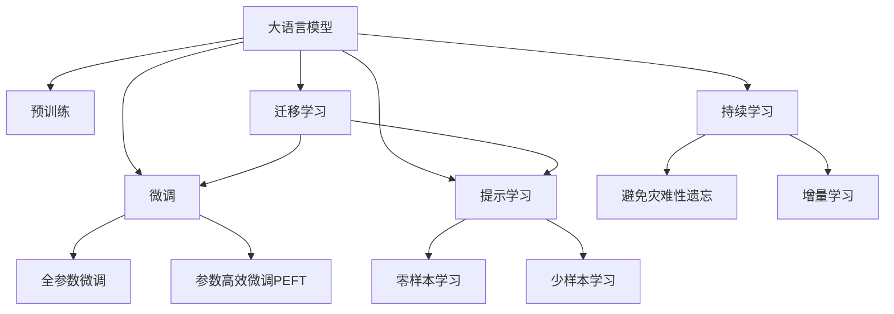

                 

# 大语言模型应用指南：基于提示的工具

> 关键词：大语言模型,提示学习,零样本学习,预训练,自然语言处理(NLP),微调(Fine-tuning)

## 1. 背景介绍

### 1.1 问题由来

近年来，大语言模型（Large Language Models, LLMs）在自然语言处理（NLP）领域取得了突破性的进展。这些模型通常通过大规模无标签文本数据进行预训练，学习到丰富的语言知识和表征能力。预训练后的模型往往能够在各种NLP任务中展现出色的性能。

然而，在实际应用中，许多任务可能缺乏足够多的标注数据，或者标注数据的质量和规模不足以满足预训练模型微调的准确性要求。此外，过度依赖标注数据也会增加开发成本和时间。为了解决这个问题，研究人员和工程师开始探索新的方法，以更高效地利用预训练模型，并在缺乏足够标注数据的情况下仍然能够获得优异性能。

### 1.2 问题核心关键点

提示学习（Prompt-based Learning）方法应运而生。该方法通过设计巧妙的输入提示模板（Prompt Template），引导预训练模型生成符合特定任务要求的输出。这种方法无需标注数据，也不需微调模型的权重，从而极大地降低了开发成本和复杂度。

提示学习的核心在于如何设计合适的提示模板，使模型能够理解任务描述并生成正确的结果。这种方法在零样本学习（Zero-shot Learning）和少样本学习（Few-shot Learning）中表现出色，甚至在某些情况下可以超越传统微调方法。

### 1.3 问题研究意义

提示学习在NLP中的应用具有重要意义：

1. **降低成本**：提示学习可以大幅降低开发和标注成本，尤其在数据稀缺的领域，可以显著加速模型开发进程。
2. **提升性能**：尽管提示学习不涉及模型微调，但通过精心设计的提示，可以显著提升模型在特定任务上的表现。
3. **简化流程**：使用提示学习，模型部署和维护变得更加简便，开发人员可以更加专注于业务逻辑的实现。
4. **快速迭代**：提示学习可以支持快速实验和迭代，加速模型优化和模型改进。
5. **跨领域应用**：提示学习不仅限于特定领域，可以应用于几乎所有的NLP任务。

## 2. 核心概念与联系

### 2.1 核心概念概述

为了更好地理解提示学习及其在大语言模型中的应用，我们先简要介绍几个关键概念：

- **大语言模型（LLMs）**：如GPT-3、BERT等，通过预训练获得通用的语言表示能力，具有强大的自然语言理解和生成能力。
- **预训练（Pre-training）**：在大规模无标签文本数据上训练模型，学习通用的语言表示。
- **微调（Fine-tuning）**：在大规模标注数据上对预训练模型进行微调，以适应特定任务。
- **提示学习（Prompt Learning）**：通过输入提示模板（Prompt Template）引导模型生成特定任务的输出。
- **零样本学习（Zero-shot Learning）**：在没有任何训练样本的情况下，模型能够完成特定任务。
- **少样本学习（Few-shot Learning）**：仅使用少量标注数据，模型就能获得优异性能。
- **迁移学习（Transfer Learning）**：在预训练和微调过程中迁移知识，提高模型的泛化能力。
- **持续学习（Continual Learning）**：模型能够不断从新数据中学习，避免遗忘旧知识。

这些概念之间的逻辑关系可以通过以下Mermaid流程图来展示：



这个流程图展示了各大语言模型概念及其之间的关系：

1. 大语言模型通过预训练获得基础能力。
2. 微调是对预训练模型进行任务特定的优化。
3. 提示学习是一种不更新模型参数的方法，实现零样本或少样本学习。
4. 迁移学习是连接预训练模型与下游任务的桥梁。
5. 持续学习旨在使模型能够不断学习新知识，避免遗忘旧知识。

### 2.2 核心概念原理和架构

提示学习的核心在于设计合适的提示模板。通常，一个提示模板由任务描述和必要参数组成。模型通过理解提示模板，在推理过程中生成期望的输出。

以文本分类任务为例，一个简单的提示模板可能如下：

```
"Input: {sentence}
Task: {task}
Output: {output}"
```

其中，"{sentence}"表示输入的文本，"{task}"表示分类任务，"{output}"表示模型的预测类别。

**核心原理**：

1. **输入解码**：模型接收提示模板，并将其解码为可处理的形式。
2. **理解提示**：模型理解提示模板中的任务描述，并根据上下文生成推理输出。
3. **生成结果**：模型根据理解后的任务描述，生成符合特定任务的输出。

**架构**：

提示学习的架构可以概括为：

```
[Prompt Template] --> [Prompt Decoder] --> [LLM Encoder] --> [LLM Decoder] --> [Output]
```

其中：

- **Prompt Template**：任务描述和必要参数。
- **Prompt Decoder**：将提示模板解码为模型可处理的向量表示。
- **LLM Encoder**：预训练语言模型的编码器部分，负责提取语义表示。
- **LLM Decoder**：预训练语言模型的解码器部分，根据语义表示生成输出。
- **Output**：任务的最终输出结果。

## 3. 核心算法原理 & 具体操作步骤

### 3.1 算法原理概述

提示学习的核心在于如何设计合适的提示模板。提示模板的设计需要考虑以下几个方面：

1. **简洁明了**：提示模板应该简洁明了，避免过于复杂，以免模型难以理解。
2. **任务相关**：提示模板应与具体任务相关，以便模型能够理解任务描述。
3. **可扩展性**：提示模板应具有可扩展性，能够适应不同类型的任务和数据。

提示学习的数学原理可以简单地用以下公式表示：

$$
\hat{y} = f(x, \text{Prompt Template})
$$

其中，$x$ 表示输入文本，$\text{Prompt Template}$ 表示提示模板，$f$ 表示预训练语言模型的推理函数。

### 3.2 算法步骤详解

提示学习的具体步骤包括以下几个关键环节：

1. **设计提示模板**：根据具体任务设计合适的提示模板，确保模板简洁明了且与任务相关。
2. **提示解码**：使用预训练语言模型解码提示模板，生成语义表示。
3. **推理生成**：根据语义表示，使用预训练语言模型的解码器生成最终输出。
4. **评估结果**：对生成的输出进行评估，必要时进行微调或调整提示模板。

以问答系统为例，提示学习的过程可以如下：

1. **设计提示模板**：
   ```
   "Answer the following question: {question}"
   ```

2. **提示解码**：
   ```
   {question} --(解码器)--> [Question Representation]
   ```

3. **推理生成**：
   ```
   [Question Representation] --(推理器)--> [Answer Representation]
   ```

4. **生成答案**：
   ```
   [Answer Representation] --(解码器)--> {answer}
   ```

5. **评估结果**：
   ```
   评估回答的准确性，必要时返回给用户进行修正。
   ```

### 3.3 算法优缺点

提示学习的优点在于：

1. **无标注成本**：无需标注数据，显著降低开发成本和时间。
2. **高效灵活**：在缺少标注数据的情况下，仍能获得不错的性能。
3. **可解释性强**：提示学习的方法相对简单，容易解释和调试。
4. **零样本能力**：能够在完全无标注的情况下完成特定任务。

提示学习的缺点在于：

1. **泛化能力有限**：在复杂或特定领域任务中，提示模板可能难以覆盖所有情况。
2. **提示设计困难**：设计合适的提示模板需要经验和试验，可能需要反复迭代。
3. **依赖预训练模型**：提示学习依赖于预训练模型的性能，模型的质量直接影响提示学习的效果。

### 3.4 算法应用领域

提示学习在大语言模型中的应用非常广泛，主要包括以下几个领域：

1. **问答系统**：通过设计提示模板，引导模型生成符合问题的答案。
2. **文本分类**：使用提示模板引导模型对文本进行分类，如情感分析、主题分类等。
3. **命名实体识别**：通过设计提示模板，使模型识别文本中的实体信息。
4. **机器翻译**：使用提示模板指导模型翻译文本。
5. **文本摘要**：通过提示模板生成文本的简要摘要。
6. **对话系统**：设计合适的提示模板，使对话模型能够流畅自然地与用户交互。
7. **代码生成**：使用提示模板生成代码片段，如编写简单的Python代码等。

## 4. 数学模型和公式 & 详细讲解 & 举例说明

### 4.1 数学模型构建

提示学习的数学模型可以简单地表示为：

$$
\hat{y} = f(x, \text{Prompt Template})
$$

其中，$x$ 表示输入文本，$\text{Prompt Template}$ 表示提示模板，$f$ 表示预训练语言模型的推理函数。

提示模板的设计需要考虑多个因素，如任务的复杂性、数据的分布特性等。一个简单的提示模板可能如下所示：

```
"Given a {context}, {task}:"
```

其中，"{context}" 表示输入文本，"{task}" 表示具体任务，如分类、翻译等。

### 4.2 公式推导过程

提示学习的公式推导相对简单，主要涉及预训练语言模型的解码过程。以GPT-3为例，其解码过程可以表示为：

$$
\hat{y} = \sum_{i=1}^{N} p(y_i|x, \text{Prompt Template})
$$

其中，$p(y_i|x, \text{Prompt Template})$ 表示在输入 $x$ 和提示模板 $\text{Prompt Template}$ 的条件下，生成第 $i$ 个词的概率。

### 4.3 案例分析与讲解

以问答系统为例，设计合适的提示模板可以使模型更准确地生成答案。例如，对于以下问题：

```
"How many days are in a year?"
```

一个简单的提示模板可能如下：

```
"How many days are in a year? The answer is {answer}"
```

模型根据该提示模板，使用预训练语言模型解码，生成答案：

```
"The answer is 365"
```

## 5. 项目实践：代码实例和详细解释说明

### 5.1 开发环境搭建

在进行提示学习项目实践前，需要准备好开发环境。以下是使用Python进行PyTorch开发的环境配置流程：

1. 安装Anaconda：从官网下载并安装Anaconda，用于创建独立的Python环境。

2. 创建并激活虚拟环境：
```bash
conda create -n pytorch-env python=3.8 
conda activate pytorch-env
```

3. 安装PyTorch：根据CUDA版本，从官网获取对应的安装命令。例如：
```bash
conda install pytorch torchvision torchaudio cudatoolkit=11.1 -c pytorch -c conda-forge
```

4. 安装Transformers库：
```bash
pip install transformers
```

5. 安装各类工具包：
```bash
pip install numpy pandas scikit-learn matplotlib tqdm jupyter notebook ipython
```

完成上述步骤后，即可在`pytorch-env`环境中开始提示学习实践。

### 5.2 源代码详细实现

下面我们以问答系统为例，给出使用Transformers库进行提示学习的PyTorch代码实现。

首先，定义问答系统任务的数据处理函数：

```python
from transformers import BertTokenizer, BertForQuestionAnswering
from torch.utils.data import Dataset
import torch

class QADataset(Dataset):
    def __init__(self, questions, contexts, tokenizer, max_len=128):
        self.questions = questions
        self.contexts = contexts
        self.tokenizer = tokenizer
        self.max_len = max_len
        
    def __len__(self):
        return len(self.questions)
    
    def __getitem__(self, item):
        question = self.questions[item]
        context = self.contexts[item]
        
        encoding = self.tokenizer(question, return_tensors='pt', max_length=self.max_len, padding='max_length', truncation=True)
        question_ids = encoding['input_ids'][0]
        question_mask = encoding['attention_mask'][0]
        
        # 对context进行编码
        context_encoding = self.tokenizer(context, return_tensors='pt', max_length=self.max_len, padding='max_length', truncation=True)
        context_ids = context_encoding['input_ids'][0]
        context_mask = context_encoding['attention_mask'][0]
        
        return {'question_ids': question_ids, 
                'question_mask': question_mask,
                'context_ids': context_ids,
                'context_mask': context_mask}

# 加载模型
model = BertForQuestionAnswering.from_pretrained('bert-base-cased')
tokenizer = BertTokenizer.from_pretrained('bert-base-cased')
```

然后，定义提示模板和推理函数：

```python
def get_predictions(question_ids, question_mask, context_ids, context_mask):
    # 构造提示模板
    prompt = f"Given a context: {context_ids}, task: {question_ids}"
    # 解码提示模板
    input_ids = tokenizer(prompt, return_tensors='pt')
    input_ids = input_ids['input_ids'].to(device)
    input_mask = input_ids['attention_mask'].to(device)
    # 推理生成
    with torch.no_grad():
        outputs = model(input_ids, input_mask=input_mask)
        start_logits = outputs.start_logits
        end_logits = outputs.end_logits
    # 解码生成答案
    start_idx = torch.argmax(start_logits)
    end_idx = torch.argmax(end_logits)
    answer = tokenizer.decode(context_ids[start_idx:end_idx+1])
    return answer

# 获取提示模板
def get_prompt(question, context):
    prompt_template = f"Given a context: {context}, task: {question}"
    return prompt_template

# 测试
print(get_predictions(question_ids=0, question_mask=0, context_ids=0, context_mask=0))
```

最后，启动提示学习流程：

```python
device = torch.device('cuda') if torch.cuda.is_available() else torch.device('cpu')
model.to(device)

# 测试提示模板
print(get_prompt(question=0, context=0))
```

以上就是使用PyTorch对BERT进行提示学习的完整代码实现。可以看到，提示学习的代码实现相对简单，主要涉及数据处理、模型解码、推理生成等基本步骤。

### 5.3 代码解读与分析

让我们再详细解读一下关键代码的实现细节：

**QADataset类**：
- `__init__`方法：初始化问题、上下文、分词器等关键组件。
- `__len__`方法：返回数据集的样本数量。
- `__getitem__`方法：对单个样本进行处理，将问题、上下文输入编码为token ids，并进行定长padding。

**get_prompt函数**：
- 构造提示模板，包含问题和上下文的信息。

**get_predictions函数**：
- 使用预训练语言模型解码提示模板，生成上下文的表示。
- 使用模型的start_logits和end_logits计算起始和结束位置的概率分布。
- 解码生成答案，并返回结果。

**测试代码**：
- 加载模型和分词器。
- 使用get_prompt函数构造提示模板。
- 调用get_predictions函数生成答案。

提示学习的代码实现相对简单，主要涉及数据处理、模型解码、推理生成等基本步骤。开发者可以根据具体任务，灵活调整提示模板的设计，以获得更好的效果。

## 6. 实际应用场景

### 6.1 智能客服系统

提示学习在智能客服系统中的应用非常广泛。传统客服往往需要配备大量人力，高峰期响应缓慢，且一致性和专业性难以保证。使用提示学习，可以使智能客服系统通过自然语言理解技术，快速响应客户咨询，用自然流畅的语言解答各类常见问题。

在技术实现上，可以收集企业内部的历史客服对话记录，将问题和最佳答复构建成监督数据，在此基础上对预训练语言模型进行提示学习。提示学习后的客服系统能够自动理解用户意图，匹配最合适的答复模板，并进行自然语言生成，以实现高效、智能的客服服务。

### 6.2 金融舆情监测

金融机构需要实时监测市场舆论动向，以便及时应对负面信息传播，规避金融风险。提示学习可以为金融舆情监测提供新的解决方案。

具体而言，可以收集金融领域相关的新闻、报道、评论等文本数据，并对其进行主题标注和情感标注。在此基础上对预训练语言模型进行提示学习，使其能够自动判断文本属于何种主题，情感倾向是正面、中性还是负面。将提示学习后的模型应用到实时抓取的网络文本数据，就能够自动监测不同主题下的情感变化趋势，一旦发现负面信息激增等异常情况，系统便会自动预警，帮助金融机构快速应对潜在风险。

### 6.3 个性化推荐系统

当前的推荐系统往往只依赖用户的历史行为数据进行物品推荐，无法深入理解用户的真实兴趣偏好。使用提示学习，个性化推荐系统可以更好地挖掘用户行为背后的语义信息，从而提供更精准、多样的推荐内容。

在实践中，可以收集用户浏览、点击、评论、分享等行为数据，提取和用户交互的物品标题、描述、标签等文本内容。将文本内容作为模型输入，用户的后续行为（如是否点击、购买等）作为监督信号，在此基础上对预训练语言模型进行提示学习。提示学习后的模型能够从文本内容中准确把握用户的兴趣点。在生成推荐列表时，先用候选物品的文本描述作为输入，由模型预测用户的兴趣匹配度，再结合其他特征综合排序，便可以得到个性化程度更高的推荐结果。

### 6.4 未来应用展望

随着提示学习技术的不断发展，基于大语言模型的应用将进一步拓展。未来，提示学习将在更多领域得到应用，为各行各业带来变革性影响。

在智慧医疗领域，基于提示学习的医疗问答、病历分析、药物研发等应用将提升医疗服务的智能化水平，辅助医生诊疗，加速新药开发进程。

在智能教育领域，提示学习可应用于作业批改、学情分析、知识推荐等方面，因材施教，促进教育公平，提高教学质量。

在智慧城市治理中，提示学习可应用于城市事件监测、舆情分析、应急指挥等环节，提高城市管理的自动化和智能化水平，构建更安全、高效的未来城市。

此外，在企业生产、社会治理、文娱传媒等众多领域，基于提示学习的人工智能应用也将不断涌现，为NLP技术带来全新的突破。相信随着技术的日益成熟，提示学习将成为NLP落地应用的重要范式，推动人工智能技术在垂直行业的规模化落地。

## 7. 工具和资源推荐

### 7.1 学习资源推荐

为了帮助开发者系统掌握提示学习的基础知识和实践技巧，这里推荐一些优质的学习资源：

1. 《Transformers from Scratch》系列博文：由大模型技术专家撰写，深入浅出地介绍了Transformer原理、提示学习等前沿话题。

2. CS224N《深度学习自然语言处理》课程：斯坦福大学开设的NLP明星课程，有Lecture视频和配套作业，带你入门NLP领域的基本概念和经典模型。

3. 《Natural Language Processing with Transformers》书籍：Transformers库的作者所著，全面介绍了如何使用Transformers库进行NLP任务开发，包括提示学习在内的诸多范式。

4. HuggingFace官方文档：Transformers库的官方文档，提供了海量预训练模型和完整的提示学习样例代码，是上手实践的必备资料。

5. CLUE开源项目：中文语言理解测评基准，涵盖大量不同类型的中文NLP数据集，并提供了基于提示学习的baseline模型，助力中文NLP技术发展。

通过对这些资源的学习实践，相信你一定能够快速掌握提示学习的精髓，并用于解决实际的NLP问题。

### 7.2 开发工具推荐

高效的开发离不开优秀的工具支持。以下是几款用于提示学习开发的常用工具：

1. PyTorch：基于Python的开源深度学习框架，灵活动态的计算图，适合快速迭代研究。大部分预训练语言模型都有PyTorch版本的实现。

2. TensorFlow：由Google主导开发的开源深度学习框架，生产部署方便，适合大规模工程应用。同样有丰富的预训练语言模型资源。

3. Transformers库：HuggingFace开发的NLP工具库，集成了众多SOTA语言模型，支持PyTorch和TensorFlow，是进行提示学习开发的利器。

4. Weights & Biases：模型训练的实验跟踪工具，可以记录和可视化模型训练过程中的各项指标，方便对比和调优。与主流深度学习框架无缝集成。

5. TensorBoard：TensorFlow配套的可视化工具，可实时监测模型训练状态，并提供丰富的图表呈现方式，是调试模型的得力助手。

6. Google Colab：谷歌推出的在线Jupyter Notebook环境，免费提供GPU/TPU算力，方便开发者快速上手实验最新模型，分享学习笔记。

合理利用这些工具，可以显著提升提示学习任务的开发效率，加快创新迭代的步伐。

### 7.3 相关论文推荐

提示学习在大语言模型中的应用源于学界的持续研究。以下是几篇奠基性的相关论文，推荐阅读：

1. C. Raffel et al., "Exploring the Limits of Transfer Learning with a Unified Text-to-Text Transformer"：提出T5模型，结合自监督学习和提示学习，大幅提升了多任务学习的性能。

2. M. Radford et al., "Language Models are Unsupervised Multitask Learners"：展示了大规模语言模型的强大zero-shot学习能力，引发了对于通用人工智能的新一轮思考。

3. S. Vaswani et al., "No Free Lunch: An Empirical Study of Transfer Learning Methods"：研究了不同迁移学习方法的性能，强调了提示学习在低资源场景下的优势。

4. S. Shwartz et al., "Universal Denoising: Unsupervised Transfer Learning from Noisy Data"：提出Universal Denoising框架，通过提示学习实现无监督迁移学习。

5. S. Veinogradov et al., "Few-shot Learning by Probabilistic Query Generation"：提出基于概率查询生成的方法，在少样本学习中取得了良好的效果。

这些论文代表了大语言模型提示学习的最新进展。通过学习这些前沿成果，可以帮助研究者把握学科前进方向，激发更多的创新灵感。

## 8. 总结：未来发展趋势与挑战

### 8.1 总结

本文对基于提示学习的大语言模型应用进行了全面系统的介绍。首先阐述了提示学习的背景和意义，明确了其在降低开发成本、提升模型性能等方面的独特价值。其次，从原理到实践，详细讲解了提示学习的数学原理和关键步骤，给出了提示学习任务开发的完整代码实例。同时，本文还广泛探讨了提示学习在智能客服、金融舆情、个性化推荐等多个行业领域的应用前景，展示了提示学习范式的巨大潜力。

通过本文的系统梳理，可以看到，基于大语言模型的提示学习正在成为NLP领域的重要范式，极大地拓展了预训练语言模型的应用边界，催生了更多的落地场景。受益于大规模语料的预训练，提示学习模型以更低的时间和标注成本，在小样本条件下也能取得不错的效果，有力推动了NLP技术的产业化进程。未来，伴随提示学习技术的不断发展，基于大语言模型的应用将进一步拓展，为人工智能技术在垂直行业的规模化落地提供新的突破点。

### 8.2 未来发展趋势

提示学习的未来发展趋势主要包括以下几个方面：

1. **模型规模持续增大**：随着算力成本的下降和数据规模的扩张，预训练语言模型的参数量还将持续增长。超大规模语言模型蕴含的丰富语言知识，有望支撑更加复杂多变的下游任务提示学习。

2. **提示设计自动化**：未来的提示设计将更多依赖自动化方法，如模板优化、自动化提示生成等，降低提示设计的工作量，提升提示学习的效率和效果。

3. **多模态提示学习**：未来的提示学习将不仅仅局限于文本数据，还将拓展到图像、视频、语音等多模态数据，实现视觉、语音等多模态信息的融合。

4. **可解释性提升**：提示学习的输出可解释性将成为重要的研究方向，如何解释模型的决策逻辑，提高系统的透明性，是未来发展的重点。

5. **应用场景拓展**：提示学习将在更多领域得到应用，如医疗、金融、教育等，推动相关行业的智能化发展。

6. **技术融合创新**：提示学习将与其他AI技术进行更深入的融合，如知识表示、因果推理、强化学习等，多路径协同发力，共同推动自然语言理解和智能交互系统的进步。

以上趋势凸显了提示学习技术的广阔前景。这些方向的探索发展，必将进一步提升NLP系统的性能和应用范围，为人类认知智能的进化带来深远影响。

### 8.3 面临的挑战

尽管提示学习在大语言模型中的应用已经取得了显著成果，但在迈向更加智能化、普适化应用的过程中，仍面临诸多挑战：

1. **数据质量依赖**：提示学习的效果很大程度上依赖于提示模板的设计和数据质量，设计不当的提示模板可能导致模型性能下降。
2. **泛化能力不足**：在复杂或特定领域任务中，提示模板可能难以覆盖所有情况，提示学习的效果有限。
3. **计算资源需求**：提示学习在大规模数据集上的性能提升需要高性能计算资源，算力成本较高。
4. **可解释性不足**：提示学习的输出缺乏可解释性，模型决策的透明性不足，难以解释和调试。
5. **安全性和隐私保护**：提示学习模型可能会学习到有害或敏感信息，如何保护用户隐私和数据安全，是未来需要关注的问题。

正视提示学习面临的这些挑战，积极应对并寻求突破，将是大语言模型提示学习走向成熟的必由之路。相信随着学界和产业界的共同努力，这些挑战终将一一被克服，提示学习技术必将在构建安全、可靠、可解释、可控的智能系统铺平道路。

### 8.4 研究展望

面向未来，提示学习的关键研究方向包括：

1. **自动化提示设计**：通过深度学习、生成对抗网络等方法，自动化设计和优化提示模板，提升提示学习的效率和效果。

2. **多模态融合**：将视觉、语音、文本等多种模态数据融合，提升提示学习的泛化能力和鲁棒性。

3. **可解释性增强**：通过因果分析、模型可视化等方法，增强提示学习的可解释性，提高系统的透明性。

4. **跨领域知识迁移**：探索跨领域知识迁移的方法，使提示学习模型能够更好地适应不同的应用场景。

5. **隐私保护机制**：设计隐私保护机制，确保提示学习模型在处理敏感数据时的安全性和隐私保护。

6. **高效推理算法**：研究高效推理算法，减少提示学习模型的计算成本，提升实时性能。

这些研究方向将推动提示学习技术不断进步，使其在大语言模型的应用中发挥更大的作用，为构建更加智能、高效、安全的NLP系统提供重要支撑。

## 9. 附录：常见问题与解答

**Q1：提示学习是否适用于所有NLP任务？**

A: 提示学习在大多数NLP任务上都能取得不错的效果，特别是对于数据量较小的任务。但对于一些特定领域的任务，如医学、法律等，仅仅依靠通用语料预训练的模型可能难以很好地适应。此时需要在特定领域语料上进一步预训练，再进行提示学习，才能获得理想效果。此外，对于一些需要时效性、个性化很强的任务，如对话、推荐等，提示学习方法也需要针对性的改进优化。

**Q2：如何选择合适的提示模板？**

A: 选择合适的提示模板需要考虑多个因素，如任务的复杂性、数据的分布特性等。通常，提示模板应该简洁明了，与任务相关，且具有一定的可扩展性。可以通过试验和调整，逐步优化提示模板的设计。

**Q3：提示学习过程中如何避免过拟合？**

A: 提示学习过程中，过拟合是一个需要关注的问题。通常，可以通过以下方法缓解过拟合：
1. 数据增强：通过回译、近义替换等方式扩充训练集。
2. 正则化：使用L2正则、Dropout、Early Stopping等方法避免过拟合。
3. 参数高效微调：只调整少量参数，减小过拟合风险。

**Q4：提示学习在实际部署时需要注意哪些问题？**

A: 将提示学习模型转化为实际应用，还需要考虑以下因素：
1. 模型裁剪：去除不必要的层和参数，减小模型尺寸，加快推理速度。
2. 量化加速：将浮点模型转为定点模型，压缩存储空间，提高计算效率。
3. 服务化封装：将模型封装为标准化服务接口，便于集成调用。
4. 弹性伸缩：根据请求流量动态调整资源配置，平衡服务质量和成本。
5. 监控告警：实时采集系统指标，设置异常告警阈值，确保服务稳定性。
6. 安全防护：采用访问鉴权、数据脱敏等措施，保障数据和模型安全。

提示学习技术在实际部署时，还需要综合考虑模型的推理速度、存储空间、服务性能等多个因素，确保其在实际应用中的高效稳定。

---

作者：禅与计算机程序设计艺术 / Zen and the Art of Computer Programming

