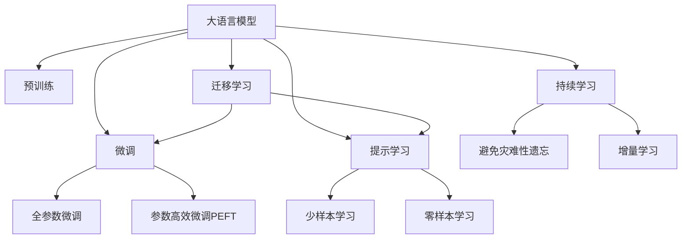

                 

# 大语言模型应用指南：高效参数微调

> 关键词：大语言模型,微调,参数高效微调(PEFT),自适应学习,超参数优化,语言理解,自然语言处理(NLP)

## 1. 背景介绍

### 1.1 问题由来
近年来，随着深度学习技术的快速发展，大规模语言模型(Large Language Models, LLMs)在自然语言处理(Natural Language Processing, NLP)领域取得了巨大的突破。这些大语言模型通过在海量无标签文本数据上进行预训练，学习到了丰富的语言知识和常识，可以通过少量的有标签样本在下游任务上进行微调(Fine-Tuning)，获得优异的性能。

然而，由于预训练语料的广泛性和泛化能力的不足，这些通用的大语言模型在特定领域应用时，效果往往难以达到实际应用的要求。因此，如何针对特定任务进行大模型微调，提升模型性能，成为了当前大语言模型研究和应用的一个热点问题。本文聚焦于参数高效微调(Parameter-Efficient Fine-Tuning, PEFT)方法，但同时也会兼顾参数微调和提示学习等前沿技术，以期对大语言模型微调实践提供更全面的指导。

### 1.2 问题核心关键点
当前，基于参数高效微调(PEFT)的方法在NLP领域得到了广泛的研究和应用。与传统的全参数微调方法相比，PEFT方法在固定大部分预训练权重的情况下，仅微调少量的模型参数，能够在减小参数量、提高微调效率的同时，保持较好的性能。这种方法在工业界和学术界取得了显著的成果，包括Google的BERT、Facebook的DistilBERT、OpenAI的T5等模型，都采用了参数高效微调技术。

PEFT的显著优势在于：

1. **参数高效性**：固定预训练权重，仅微调顶层或任务相关参数，减小了计算资源消耗，提高了微调效率。
2. **泛化性能**：预训练权重中的通用知识得以保留，新的微调层仅学习特定的任务知识，有助于模型更好地泛化到未见过的数据上。
3. **灵活性**：可以在保持模型结构不变的情况下，动态地加入新的微调层，适应不断变化的领域和任务需求。
4. **鲁棒性**：由于大部分预训练参数保持不变，微调模型的鲁棒性更强，较少受到微调数据的影响。

### 1.3 问题研究意义
研究大语言模型的参数高效微调方法，对于拓展大模型的应用范围，提升下游任务的性能，加速NLP技术的产业化进程，具有重要意义：

1. **降低应用开发成本**：基于成熟的大模型进行微调，可以显著减少从头开发所需的数据、计算和人力等成本投入。
2. **提升模型效果**：微调使得通用大模型更好地适应特定任务，在应用场景中取得更优表现。
3. **加速开发进度**：standing on the shoulders of giants，微调使得开发者可以更快地完成任务适配，缩短开发周期。
4. **带来技术创新**：PEFT方法促进了对预训练-微调的深入研究，催生了提示学习、少样本学习等新的研究方向。
5. **赋能产业升级**：微调使得NLP技术更容易被各行各业所采用，为传统行业数字化转型升级提供新的技术路径。

## 2. 核心概念与联系

### 2.1 核心概念概述

为更好地理解参数高效微调方法，本节将介绍几个密切相关的核心概念：

- 大语言模型(Large Language Model, LLM)：以自回归(如GPT)或自编码(如BERT)模型为代表的大规模预训练语言模型。通过在大规模无标签文本语料上进行预训练，学习通用的语言表示，具备强大的语言理解和生成能力。

- 预训练(Pre-training)：指在大规模无标签文本语料上，通过自监督学习任务训练通用语言模型的过程。常见的预训练任务包括言语建模、遮挡语言模型等。预训练使得模型学习到语言的通用表示。

- 微调(Fine-tuning)：指在预训练模型的基础上，使用下游任务的少量标注数据，通过有监督学习优化模型在特定任务上的性能。通常只需要调整顶层分类器或解码器，并以较小的学习率更新全部或部分的模型参数。

- 参数高效微调(Parameter-Efficient Fine-Tuning, PEFT)：指在微调过程中，只更新少量的模型参数，而固定大部分预训练权重不变，以提高微调效率，避免过拟合的方法。

- 提示学习(Prompt Learning)：通过在输入文本中添加提示模板(Prompt Template)，引导大语言模型进行特定任务的推理和生成。可以在不更新模型参数的情况下，实现零样本或少样本学习。

- 少样本学习(Few-shot Learning)：指在只有少量标注样本的情况下，模型能够快速适应新任务的学习方法。在大语言模型中，通常通过在输入中提供少量示例来实现，无需更新模型参数。

- 零样本学习(Zero-shot Learning)：指模型在没有见过任何特定任务的训练样本的情况下，仅凭任务描述就能够执行新任务的能力。大语言模型通过预训练获得的广泛知识，使其能够理解任务指令并生成相应输出。

- 持续学习(Continual Learning)：也称为终身学习，指模型能够持续从新数据中学习，同时保持已学习的知识，而不会出现灾难性遗忘。这对于保持大语言模型的时效性和适应性至关重要。

这些核心概念之间的逻辑关系可以通过以下Mermaid流程图来展示：



这个流程图展示了大语言模型的核心概念及其之间的关系：

1. 大语言模型通过预训练获得基础能力。
2. 微调是对预训练模型进行任务特定的优化，可以分为全参数微调和参数高效微调（PEFT）。
3. 提示学习是一种不更新模型参数的方法，可以实现少样本学习和零样本学习。
4. 迁移学习是连接预训练模型与下游任务的桥梁，可以通过微调或提示学习来实现。
5. 持续学习旨在使模型能够不断学习新知识，同时避免遗忘旧知识。

这些概念共同构成了大语言模型的学习和应用框架，使其能够在各种场景下发挥强大的语言理解和生成能力。通过理解这些核心概念，我们可以更好地把握大语言模型的工作原理和优化方向。

## 3. 核心算法原理 & 具体操作步骤
### 3.1 算法原理概述

参数高效微调方法基于以下原理：

1. **模型结构分解**：将预训练模型分解为底层的固定参数部分和顶层的可微调部分。底层部分通常包括编码器或解码器，而顶层部分为分类器或解码器，用于处理特定的任务。

2. **微调层插入**：在顶层部分添加或修改微调层，以适应特定的下游任务。这些微调层可以是新的全连接层、注意力层或序列模型，也可以是现有层的参数调整。

3. **参数冻结策略**：通常，底层参数保持不变，仅微调顶层部分。这一策略有助于保留预训练模型中的通用知识，提高模型的泛化能力。

4. **微调目标设计**：根据任务类型设计相应的损失函数和优化目标，如分类任务使用交叉熵损失，生成任务使用负对数似然损失等。

5. **超参数调优**：选择合适的学习率、批大小、迭代轮数等超参数，以优化微调效果。

6. **正则化技术应用**：应用L2正则、Dropout、Early Stopping等正则化技术，防止模型过拟合。

### 3.2 算法步骤详解

参数高效微调方法的一般步骤如下：

**Step 1: 准备预训练模型和数据集**
- 选择合适的预训练语言模型 $M_{\theta}$ 作为初始化参数，如 BERT、GPT等。
- 准备下游任务 $T$ 的标注数据集 $D=\{(x_i,y_i)\}_{i=1}^N, x_i \in \mathcal{X}, y_i \in \mathcal{Y}$。

**Step 2: 添加任务适配层**
- 根据任务类型，在预训练模型顶层设计合适的输出层和损失函数。
- 对于分类任务，通常在顶层添加线性分类器或注意力层，以处理文本分类问题。
- 对于生成任务，通常使用语言模型的解码器输出概率分布，并以负对数似然为损失函数。

**Step 3: 设置微调超参数**
- 选择合适的优化算法及其参数，如 AdamW、SGD 等，设置学习率、批大小、迭代轮数等。
- 设置正则化技术及强度，包括权重衰减、Dropout、Early Stopping等。
- 确定冻结预训练参数的策略，如仅微调顶层，或全部参数都参与微调。

**Step 4: 执行梯度训练**
- 将训练集数据分批次输入模型，前向传播计算损失函数。
- 反向传播计算参数梯度，根据设定的优化算法和学习率更新模型参数。
- 周期性在验证集上评估模型性能，根据性能指标决定是否触发 Early Stopping。
- 重复上述步骤直至满足预设的迭代轮数或 Early Stopping 条件。

**Step 5: 测试和部署**
- 在测试集上评估微调后模型 $M_{\hat{\theta}}$ 的性能，对比微调前后的精度提升。
- 使用微调后的模型对新样本进行推理预测，集成到实际的应用系统中。
- 持续收集新的数据，定期重新微调模型，以适应数据分布的变化。

以上是参数高效微调方法的一般流程。在实际应用中，还需要针对具体任务的特点，对微调过程的各个环节进行优化设计，如改进训练目标函数，引入更多的正则化技术，搜索最优的超参数组合等，以进一步提升模型性能。

### 3.3 算法优缺点

参数高效微调方法具有以下优点：
1. **参数高效性**：仅微调顶层参数，保持预训练权重不变，显著减小计算资源消耗。
2. **泛化性能**：预训练权重中的通用知识得以保留，新的微调层仅学习特定的任务知识，有助于模型更好地泛化到未见过的数据上。
3. **灵活性**：可以在保持模型结构不变的情况下，动态地加入新的微调层，适应不断变化的领域和任务需求。
4. **鲁棒性**：由于大部分预训练参数保持不变，微调模型的鲁棒性更强，较少受到微调数据的影响。

同时，该方法也存在一定的局限性：
1. **参数更新开销**：顶层微调层的参数更新仍需消耗一定的计算资源。
2. **微调层设计复杂**：顶层微调层的参数设置需要依据任务特点进行调整，设计复杂。
3. **模型结构复杂**：顶层微调层的引入可能导致模型结构复杂度增加，影响模型的可解释性。

尽管存在这些局限性，但参数高效微调方法仍是大语言模型微调的主要范式之一，尤其在处理大规模数据集和资源有限的情况下，具有显著的优势。未来研究的方向可能在于进一步简化微调层设计，提升微调效率，同时保持模型的泛化性能。

### 3.4 算法应用领域

参数高效微调方法在NLP领域已经得到了广泛的应用，覆盖了几乎所有常见任务，例如：

- 文本分类：如情感分析、主题分类、意图识别等。通过微调使模型学习文本-标签映射。
- 命名实体识别：识别文本中的人名、地名、机构名等特定实体。通过微调使模型掌握实体边界和类型。
- 关系抽取：从文本中抽取实体之间的语义关系。通过微调使模型学习实体-关系三元组。
- 问答系统：对自然语言问题给出答案。将问题-答案对作为微调数据，训练模型学习匹配答案。
- 机器翻译：将源语言文本翻译成目标语言。通过微调使模型学习语言-语言映射。
- 文本摘要：将长文本压缩成简短摘要。将文章-摘要对作为微调数据，使模型学习抓取要点。
- 对话系统：使机器能够与人自然对话。将多轮对话历史作为上下文，微调模型进行回复生成。

除了上述这些经典任务外，参数高效微调方法也被创新性地应用到更多场景中，如可控文本生成、常识推理、代码生成、数据增强等，为NLP技术带来了全新的突破。随着预训练模型和微调方法的不断进步，相信参数高效微调方法将在更多领域得到应用，为NLP技术的发展注入新的动力。

## 4. 数学模型和公式 & 详细讲解  
### 4.1 数学模型构建

本节将使用数学语言对参数高效微调方法进行更加严格的刻画。

记预训练语言模型为 $M_{\theta}$，其中 $\theta$ 为预训练得到的模型参数。假设微调任务的训练集为 $D=\{(x_i,y_i)\}_{i=1}^N, x_i \in \mathcal{X}, y_i \in \mathcal{Y}$。

定义模型 $M_{\theta}$ 在输入 $x$ 上的输出为 $\hat{y}=M_{\theta}(x) \in [0,1]$，表示样本属于正类的概率。真实标签 $y \in \{0,1\}$。则二分类交叉熵损失函数定义为：

$$
\ell(M_{\theta}(x),y) = -[y\log \hat{y} + (1-y)\log (1-\hat{y})]
$$

将其代入经验风险公式，得：

$$
\mathcal{L}(\theta) = -\frac{1}{N}\sum_{i=1}^N [y_i\log M_{\theta}(x_i)+(1-y_i)\log(1-M_{\theta}(x_i))]
$$

在实践中，我们通常使用基于梯度的优化算法（如SGD、Adam等）来近似求解上述最优化问题。设 $\eta$ 为学习率，$\lambda$ 为正则化系数，则参数的更新公式为：

$$
\theta \leftarrow \theta - \eta \nabla_{\theta}\mathcal{L}(\theta) - \eta\lambda\theta
$$

其中 $\nabla_{\theta}\mathcal{L}(\theta)$ 为损失函数对参数 $\theta$ 的梯度，可通过反向传播算法高效计算。

### 4.2 公式推导过程

以下我们以二分类任务为例，推导交叉熵损失函数及其梯度的计算公式。

假设模型 $M_{\theta}$ 在输入 $x$ 上的输出为 $\hat{y}=M_{\theta}(x) \in [0,1]$，表示样本属于正类的概率。真实标签 $y \in \{0,1\}$。则二分类交叉熵损失函数定义为：

$$
\ell(M_{\theta}(x),y) = -[y\log \hat{y} + (1-y)\log (1-\hat{y})]
$$

将其代入经验风险公式，得：

$$
\mathcal{L}(\theta) = -\frac{1}{N}\sum_{i=1}^N [y_i\log M_{\theta}(x_i)+(1-y_i)\log(1-M_{\theta}(x_i))]
$$

根据链式法则，损失函数对参数 $\theta_k$ 的梯度为：

$$
\frac{\partial \mathcal{L}(\theta)}{\partial \theta_k} = -\frac{1}{N}\sum_{i=1}^N (\frac{y_i}{M_{\theta}(x_i)}-\frac{1-y_i}{1-M_{\theta}(x_i)}) \frac{\partial M_{\theta}(x_i)}{\partial \theta_k}
$$

其中 $\frac{\partial M_{\theta}(x_i)}{\partial \theta_k}$ 可进一步递归展开，利用自动微分技术完成计算。

在得到损失函数的梯度后，即可带入参数更新公式，完成模型的迭代优化。重复上述过程直至收敛，最终得到适应下游任务的最优模型参数 $\theta^*$。

## 5. 项目实践：代码实例和详细解释说明
### 5.1 开发环境搭建

在进行微调实践前，我们需要准备好开发环境。以下是使用Python进行PyTorch开发的环境配置流程：

1. 安装Anaconda：从官网下载并安装Anaconda，用于创建独立的Python环境。

2. 创建并激活虚拟环境：
```bash
conda create -n pytorch-env python=3.8 
conda activate pytorch-env
```

3. 安装PyTorch：根据CUDA版本，从官网获取对应的安装命令。例如：
```bash
conda install pytorch torchvision torchaudio cudatoolkit=11.1 -c pytorch -c conda-forge
```

4. 安装Transformers库：
```bash
pip install transformers
```

5. 安装各类工具包：
```bash
pip install numpy pandas scikit-learn matplotlib tqdm jupyter notebook ipython
```

完成上述步骤后，即可在`pytorch-env`环境中开始微调实践。

### 5.2 源代码详细实现

下面我们以命名实体识别(NER)任务为例，给出使用Transformers库对BERT模型进行参数高效微调的PyTorch代码实现。

首先，定义NER任务的数据处理函数：

```python
from transformers import BertTokenizer
from torch.utils.data import Dataset
import torch

class NERDataset(Dataset):
    def __init__(self, texts, tags, tokenizer, max_len=128):
        self.texts = texts
        self.tags = tags
        self.tokenizer = tokenizer
        self.max_len = max_len
        
    def __len__(self):
        return len(self.texts)
    
    def __getitem__(self, item):
        text = self.texts[item]
        tags = self.tags[item]
        
        encoding = self.tokenizer(text, return_tensors='pt', max_length=self.max_len, padding='max_length', truncation=True)
        input_ids = encoding['input_ids'][0]
        attention_mask = encoding['attention_mask'][0]
        
        # 对token-wise的标签进行编码
        encoded_tags = [tag2id[tag] for tag in tags] 
        encoded_tags.extend([tag2id['O']] * (self.max_len - len(encoded_tags)))
        labels = torch.tensor(encoded_tags, dtype=torch.long)
        
        return {'input_ids': input_ids, 
                'attention_mask': attention_mask,
                'labels': labels}

# 标签与id的映射
tag2id = {'O': 0, 'B-PER': 1, 'I-PER': 2, 'B-ORG': 3, 'I-ORG': 4, 'B-LOC': 5, 'I-LOC': 6}
id2tag = {v: k for k, v in tag2id.items()}

# 创建dataset
tokenizer = BertTokenizer.from_pretrained('bert-base-cased')

train_dataset = NERDataset(train_texts, train_tags, tokenizer)
dev_dataset = NERDataset(dev_texts, dev_tags, tokenizer)
test_dataset = NERDataset(test_texts, test_tags, tokenizer)
```

然后，定义模型和优化器：

```python
from transformers import BertForTokenClassification, AdamW

model = BertForTokenClassification.from_pretrained('bert-base-cased', num_labels=len(tag2id))

optimizer = AdamW(model.parameters(), lr=2e-5)
```

接着，定义训练和评估函数：

```python
from torch.utils.data import DataLoader
from tqdm import tqdm
from sklearn.metrics import classification_report

device = torch.device('cuda') if torch.cuda.is_available() else torch.device('cpu')
model.to(device)

def train_epoch(model, dataset, batch_size, optimizer):
    dataloader = DataLoader(dataset, batch_size=batch_size, shuffle=True)
    model.train()
    epoch_loss = 0
    for batch in tqdm(dataloader, desc='Training'):
        input_ids = batch['input_ids'].to(device)
        attention_mask = batch['attention_mask'].to(device)
        labels = batch['labels'].to(device)
        model.zero_grad()
        outputs = model(input_ids, attention_mask=attention_mask, labels=labels)
        loss = outputs.loss
        epoch_loss += loss.item()
        loss.backward()
        optimizer.step()
    return epoch_loss / len(dataloader)

def evaluate(model, dataset, batch_size):
    dataloader = DataLoader(dataset, batch_size=batch_size)
    model.eval()
    preds, labels = [], []
    with torch.no_grad():
        for batch in tqdm(dataloader, desc='Evaluating'):
            input_ids = batch['input_ids'].to(device)
            attention_mask = batch['attention_mask'].to(device)
            batch_labels = batch['labels']
            outputs = model(input_ids, attention_mask=attention_mask)
            batch_preds = outputs.logits.argmax(dim=2).to('cpu').tolist()
            batch_labels = batch_labels.to('cpu').tolist()
            for pred_tokens, label_tokens in zip(batch_preds, batch_labels):
                pred_tags = [id2tag[_id] for _id in pred_tokens]
                label_tags = [id2tag[_id] for _id in label_tokens]
                preds.append(pred_tags[:len(label_tags)])
                labels.append(label_tags)
                
    print(classification_report(labels, preds))
```

最后，启动训练流程并在测试集上评估：

```python
epochs = 5
batch_size = 16

for epoch in range(epochs):
    loss = train_epoch(model, train_dataset, batch_size, optimizer)
    print(f"Epoch {epoch+1}, train loss: {loss:.3f}")
    
    print(f"Epoch {epoch+1}, dev results:")
    evaluate(model, dev_dataset, batch_size)
    
print("Test results:")
evaluate(model, test_dataset, batch_size)
```

以上就是使用PyTorch对BERT进行命名实体识别任务参数高效微调的完整代码实现。可以看到，得益于Transformers库的强大封装，我们可以用相对简洁的代码完成BERT模型的加载和微调。

### 5.3 代码解读与分析

让我们再详细解读一下关键代码的实现细节：

**NERDataset类**：
- `__init__`方法：初始化文本、标签、分词器等关键组件。
- `__len__`方法：返回数据集的样本数量。
- `__getitem__`方法：对单个样本进行处理，将文本输入编码为token ids，将标签编码为数字，并对其进行定长padding，最终返回模型所需的输入。

**tag2id和id2tag字典**：
- 定义了标签与数字id之间的映射关系，用于将token-wise的预测结果解码回真实的标签。

**训练和评估函数**：
- 使用PyTorch的DataLoader对数据集进行批次化加载，供模型训练和推理使用。
- 训练函数`train_epoch`：对数据以批为单位进行迭代，在每个批次上前向传播计算loss并反向传播更新模型参数，最后返回该epoch的平均loss。
- 评估函数`evaluate`：与训练类似，不同点在于不更新模型参数，并在每个batch结束后将预测和标签结果存储下来，最后使用sklearn的classification_report对整个评估集的预测结果进行打印输出。

**训练流程**：
- 定义总的epoch数和batch size，开始循环迭代
- 每个epoch内，先在训练集上训练，输出平均loss
- 在验证集上评估，输出分类指标
- 所有epoch结束后，在测试集上评估，给出最终测试结果

可以看到，PyTorch配合Transformers库使得BERT微调的代码实现变得简洁高效。开发者可以将更多精力放在数据处理、模型改进等高层逻辑上，而不必过多关注底层的实现细节。

当然，工业级的系统实现还需考虑更多因素，如模型的保存和部署、超参数的自动搜索、更灵活的任务适配层等。但核心的参数高效微调范式基本与此类似。

## 6. 实际应用场景
### 6.1 智能客服系统

基于大语言模型参数高效微调的对话技术，可以广泛应用于智能客服系统的构建。传统客服往往需要配备大量人力，高峰期响应缓慢，且一致性和专业性难以保证。而使用参数高效微调的对话模型，可以7x24小时不间断服务，快速响应客户咨询，用自然流畅的语言解答各类常见问题。

在技术实现上，可以收集企业内部的历史客服对话记录，将问题和最佳答复构建成监督数据，在此基础上对预训练对话模型进行参数高效微调。微调后的对话模型能够自动理解用户意图，匹配最合适的答案模板进行回复。对于客户提出的新问题，还可以接入检索系统实时搜索相关内容，动态组织生成回答。如此构建的智能客服系统，能大幅提升客户咨询体验和问题解决效率。

### 6.2 金融舆情监测

金融机构需要实时监测市场舆论动向，以便及时应对负面信息传播，规避金融风险。传统的人工监测方式成本高、效率低，难以应对网络时代海量信息爆发的挑战。基于参数高效微调的文本分类和情感分析技术，为金融舆情监测提供了新的解决方案。

具体而言，可以收集金融领域相关的新闻、报道、评论等文本数据，并对其进行主题标注和情感标注。在此基础上对预训练语言模型进行参数高效微调，使其能够自动判断文本属于何种主题，情感倾向是正面、中性还是负面。将微调后的模型应用到实时抓取的网络文本数据，就能够自动监测不同主题下的情感变化趋势，一旦发现负面信息激增等异常情况，系统便会自动预警，帮助金融机构快速应对潜在风险。

### 6.3 个性化推荐系统

当前的推荐系统往往只依赖用户的历史行为数据进行物品推荐，无法深入理解用户的真实兴趣偏好。基于参数高效微调技术，个性化推荐系统可以更好地挖掘用户行为背后的语义信息，从而提供更精准、多样的推荐内容。

在实践中，可以收集用户浏览、点击、评论、分享等行为数据，提取和用户交互的物品标题、描述、标签等文本内容。将文本内容作为模型输入，用户的后续行为（如是否点击、购买等）作为监督信号，在此基础上微调预训练语言模型。微调后的模型能够从文本内容中准确把握用户的兴趣点。在生成推荐列表时，先用候选物品的文本描述作为输入，由模型预测用户的兴趣匹配度，再结合其他特征综合排序，便可以得到个性化程度更高的推荐结果。

### 6.4 未来应用展望

随着参数高效微调方法的发展，其在NLP领域的潜在应用场景还将进一步拓展，为各行各业带来变革性影响。

在智慧医疗领域，基于参数高效微调的问答、病历分析、药物研发等应用将提升医疗服务的智能化水平，辅助医生诊疗，加速新药开发进程。

在智能教育领域，参数高效微调技术可应用于作业批改、学情分析、知识推荐等方面，因材施教，促进教育公平，提高教学质量。

在智慧城市治理中，参数高效微调模型可应用于城市事件监测、舆情分析、应急指挥等环节，提高城市管理的自动化和智能化水平，构建更安全、高效的未来城市。

此外，在企业生产、社会治理、文娱传媒等众多领域，基于参数高效微调的人工智能应用也将不断涌现，为经济社会发展注入新的动力。相信随着技术的日益成熟，参数高效微调方法将成为人工智能落地应用的重要范式，推动人工智能技术向更广阔的领域加速渗透。

## 7. 工具和资源推荐
### 7.1 学习资源推荐

为了帮助开发者系统掌握参数高效微调的理论基础和实践技巧，这里推荐一些优质的学习资源：

1. 《Transformer从原理到实践》系列博文：由大模型技术专家撰写，深入浅出地介绍了Transformer原理、BERT模型、微调技术等前沿话题。

2. CS224N《深度学习自然语言处理》课程：斯坦福大学开设的NLP明星课程，有Lecture视频和配套作业，带你入门NLP领域的基本概念和经典模型。

3. 《Natural Language Processing with Transformers》书籍：Transformers库的作者所著，全面介绍了如何使用Transformers库进行NLP任务开发，包括参数高效微调在内的诸多范式。

4. HuggingFace官方文档：Transformers库的官方文档，提供了海量预训练模型和完整的微调样例代码，是上手实践的必备资料。

5. CLUE开源项目：中文语言理解测评基准，涵盖大量不同类型的中文NLP数据集，并提供了基于参数高效微调的baseline模型，助力中文NLP技术发展。

通过对这些资源的学习实践，相信你一定能够快速掌握参数高效微调的精髓，并用于解决实际的NLP问题。
###  7.2 开发工具推荐

高效的开发离不开优秀的工具支持。以下是几款用于参数高效微调开发的常用工具：

1. PyTorch：基于Python的开源深度学习框架，灵活动态的计算图，适合快速迭代研究。大部分预训练语言模型都有PyTorch版本的实现。

2. TensorFlow：由Google主导开发的开源深度学习框架，生产部署方便，适合大规模工程应用。同样有丰富的预训练语言模型资源。

3. Transformers库：HuggingFace开发的NLP工具库，集成了众多SOTA语言模型，支持PyTorch和TensorFlow，是进行参数高效微调任务的开发的利器。

4. Weights & Biases：模型训练的实验跟踪工具，可以记录和可视化模型训练过程中的各项指标，方便对比和调优。与主流深度学习框架无缝集成。

5. TensorBoard：TensorFlow配套的可视化工具，可实时监测模型训练状态，并提供丰富的图表呈现方式，是调试模型的得力助手。

6. Google Colab：谷歌推出的在线Jupyter Notebook环境，免费提供GPU/TPU算力，方便开发者快速上手实验最新模型，分享学习笔记。

合理利用这些工具，可以显著提升参数高效微调任务的开发效率，加快创新迭代的步伐。

### 7.3 相关论文推荐

参数高效微调方法的发展源于学界的持续研究。以下是几篇奠基性的相关论文，推荐阅读：

1. Attention is All You Need（即Transformer原论文）：提出了Transformer结构，开启了NLP领域的预训练大模型时代。

2. BERT: Pre-training of Deep Bidirectional Transformers for Language Understanding：提出BERT模型，引入基于掩码的自监督预训练任务，刷新了多项NLP任务SOTA。

3. Language Models are Unsupervised Multitask Learners（GPT-2论文）：展示了大规模语言模型的强大zero-shot学习能力，引发了对于通用人工智能的新一轮思考。

4. Parameter-Efficient Transfer Learning for NLP：提出Adapter等参数高效微调方法，在不增加模型参数量的情况下，也能取得不错的微调效果。

5. Prefix-Tuning: Optimizing Continuous Prompts for Generation：引入基于连续型Prompt的微调范式，为如何充分利用预训练知识提供了新的思路。

6. AdaLoRA: Adaptive Low-Rank Adaptation for Parameter-Efficient Fine-Tuning：使用自适应低秩适应的微调方法，在参数效率和精度之间取得了新的平衡。

这些论文代表了大语言模型参数高效微调技术的发展脉络。通过学习这些前沿成果，可以帮助研究者把握学科前进方向，激发更多的创新灵感。

## 8. 总结：未来发展趋势与挑战

### 8.1 总结

本文对参数高效微调方法进行了全面系统的介绍。首先阐述了参数高效微调方法的研究背景和意义，明确了其在降低开发成本、提升性能、加速开发进度等方面的价值。其次，从原理到实践，详细讲解了参数高效微调的数学原理和关键步骤，给出了参数高效微调任务开发的完整代码实例。同时，本文还广泛探讨了参数高效微调方法在智能客服、金融舆情、个性化推荐等多个行业领域的应用前景，展示了其广阔的潜在应用空间。此外，本文精选了参数高效微调技术的各类学习资源，力求为读者提供全方位的技术指引。

通过本文的系统梳理，可以看到，参数高效微调方法在大语言模型的微调过程中扮演了重要角色，具有显著的参数高效性和泛化性能，使得大模型微调更加灵活和高效。未来，伴随预训练模型和微调方法的不断进步，参数高效微调方法必将在更多领域得到应用，为NLP技术的发展注入新的动力。

### 8.2 未来发展趋势

展望未来，参数高效微调方法将呈现以下几个发展趋势：

1. **参数压缩技术进步**：随着硬件计算能力的提升，预训练模型的参数规模还将进一步扩大，这将对微调参数压缩技术提出更高要求。未来，参数压缩技术有望在减少计算资源消耗的同时，进一步提高微调效率和效果。

2. **预训练-微调范式改进**：除了参数高效微调，未来还将涌现更多基于自适应学习、对抗训练等前沿技术的微调方法，提升模型在不同领域、不同数据分布下的泛化性能。

3. **超参数自动化优化**：由于微调过程涉及大量超参数调整，未来有望通过自动化方法优化超参数，提升微调过程的鲁棒性和性能。

4. **元学习框架整合**：元学习框架可以帮助模型快速适应新任务，未来可能将其与参数高效微调方法结合，进一步提升模型的迁移学习能力。

5. **跨领域知识融合**：随着知识图谱、语义表示等技术的成熟，未来模型有望在微调过程中融合更多领域知识，提升模型在跨领域迁移和推理上的表现。

6. **零样本和少样本学习推广**：基于参数高效微调的零样本学习和少样本学习技术有望在更多领域得到应用，特别是在数据稀缺、任务多样化的场景中。

这些趋势凸显了参数高效微调方法的巨大潜力和发展前景，预示着其在未来的NLP研究和应用中将扮演更加重要的角色。

### 8.3 面临的挑战

尽管参数高效微调方法已经取得了显著的成果，但在迈向更加智能化、普适化应用的过程中，它仍面临诸多挑战：

1. **参数更新开销**：尽管顶层微调层的参数更新减少了计算资源消耗，但在大规模数据集上仍可能面临显著的参数更新开销。如何平衡计算资源和微调效果，仍是一个值得研究的课题。

2. **微调层设计复杂**：顶层微调层的参数设置需要依据任务特点进行调整，设计复杂。如何设计出高效、通用的微调层，仍是未来的研究难点。

3. **模型结构复杂**：顶层微调层的引入可能导致模型结构复杂度增加，影响模型的可解释性。如何在保留微调能力的同时，降低模型复杂度，是一个重要的研究方向。

4. **微调效果依赖数据**：微调模型的性能很大程度上依赖于微调数据的质量和数量。对于特定领域或数据分布的任务，如何提高微调数据的质量和数量，仍是一个需要克服的难题。

5. **鲁棒性有待加强**：微调模型在面对新的、未见过的数据时，泛化性能可能下降。如何提高模型的鲁棒性，使其在不同的数据分布下都能表现良好，是一个重要的研究方向。

6. **伦理和安全问题**：微调模型可能学习到有偏见、有害的信息，如何确保模型输出的伦理和安全，是一个需要严格监管和控制的课题。

这些挑战需要学界和工业界共同努力，通过不断的技术创新和实践探索，才能逐步解决。相信随着研究的深入和技术的成熟，参数高效微调方法将在大语言模型的微调实践中发挥更大的作用。

### 8.4 研究展望

未来，在参数高效微调技术的研究和应用中，以下几个方向值得重点关注：

1. **自适应学习技术**：通过引入自适应学习机制，让模型在微调过程中能够动态调整参数，提升对新数据的适应能力。

2. **对抗训练与鲁棒性**：通过对抗训练等方法，提高模型对输入扰动的鲁棒性，防止模型过拟合训练数据。

3. **知识融合与跨领域迁移**：将知识图谱、语义表示等领域的知识与语言模型结合，提升模型的跨领域迁移能力和推理能力。

4. **元学习与零样本学习**：结合元学习框架和零样本学习技术，使模型能够快速适应新任务，减少对标注数据的依赖。

5. **多模态数据融合**：将视觉、语音等多模态数据与文本数据结合，提升模型的全面理解能力。

6. **伦理学与隐私保护**：在模型训练和应用中，引入伦理学和隐私保护机制，确保模型的输出符合社会价值观和伦理规范。

这些研究方向将推动参数高效微调技术向更深层次发展，使其在大语言模型的微调过程中发挥更大的作用，为构建更加智能、安全、可解释的NLP系统提供技术支持。

## 9. 附录：常见问题与解答

**Q1：参数高效微调与传统的全参数微调相比，有什么优势？**

A: 参数高效微调方法主要优势在于：

1. **参数高效性**：仅微调顶层参数，保持预训练权重不变，显著减小计算资源消耗。
2. **泛化性能**：预训练权重中的通用知识得以保留，新的微调层仅学习特定的任务知识，有助于模型更好地泛化到未见过的数据上。
3. **灵活性**：可以在保持模型结构不变的情况下，动态地加入新的微调层，适应不断变化的领域和任务需求。
4. **鲁棒性**：由于大部分预训练参数保持不变，微调模型的鲁棒性更强，较少受到微调数据的影响。

**Q2：参数高效微调方法有哪些常见应用？**

A: 参数高效微调方法在NLP领域已经得到了广泛的应用，覆盖了几乎所有常见任务，例如：

1. 文本分类：如情感分析、主题分类、意图识别等。通过微调使模型学习文本-标签映射。
2. 命名实体识别：识别文本中的人名、地名、机构名等特定实体。通过微调使模型掌握实体边界和类型。
3. 关系抽取：从文本中抽取实体之间的语义关系。通过微调使模型学习实体-关系三元组。
4. 问答系统：对自然语言问题给出答案。将问题-答案对作为微调数据，训练模型学习匹配答案。
5. 机器翻译：将源语言文本翻译成目标语言。通过微调使模型学习语言-语言映射。
6. 文本摘要：将长文本压缩成简短摘要。将文章-摘要对作为微调数据，使模型学习抓取要点。
7. 对话系统：使机器能够与人自然对话。将多轮对话历史作为上下文，微调模型进行回复生成。

除了上述这些经典任务外，参数高效微调方法也被创新性地应用到更多场景中，如可控文本生成、常识推理、代码生成、数据增强等，为NLP技术带来了全新的突破。

**Q3：参数高效微调方法在实际应用中需要注意哪些问题？**

A: 在实际应用中，参数高效微调方法还需要注意以下问题：

1. **数据准备**：高质量、多样化的标注数据是微调成功的前提，需要精心设计标注样本，确保样本具有代表性。
2. **模型设计**：微调层的设计需要考虑任务的复杂度，通常以层次化结构设计微调层，以减少计算复杂度。
3. **超参数调优**：选择合适的学习率、批大小、迭代轮数等超参数，以优化微调效果。
4. **正则化技术**：应用L2正则、Dropout、Early Stopping等正则化技术，防止模型过拟合。
5. **模型评估**：在验证集和测试集上评估模型的性能，及时发现并解决模型过拟合问题。
6. **持续学习**：随着数据分布的变化，微调模型需要持续学习新知识，以保持性能的稳定性和适用性。

这些问题是参数高效微调方法在实际应用中常见的挑战，需要开发者在实践中进行充分的考虑和优化。

**Q4：参数高效微调方法在未来有哪些发展方向？**

A: 参数高效微调方法在未来的发展方向可能包括：

1. **参数压缩技术进步**：随着硬件计算能力的提升，预训练模型的参数规模还将进一步扩大，这将对微调参数压缩技术提出更高要求。未来，参数压缩技术有望在减少计算资源消耗的同时，进一步提高微调效率和效果。
2. **预训练-微调范式改进**：除了参数高效微调，未来还将涌现更多基于自适应学习、对抗训练等前沿技术的微调方法，提升模型在不同领域、不同数据分布下的泛化性能。
3. **超参数自动化优化**：由于微调过程涉及大量超参数调整，未来有望通过自动化方法优化超参数，提升微调过程的鲁棒性和性能。
4. **元学习框架整合**：元学习框架可以帮助模型快速适应新任务，未来可能将其与参数高效微调方法结合，进一步提升模型的迁移学习能力。
5. **跨领域知识融合**：随着知识图谱、语义表示等技术的成熟，未来模型有望在微调过程中融合更多领域知识，提升模型在跨领域迁移和推理上的表现。
6. **零样本和少样本学习推广**：基于参数高效微调的零样本学习和少样本学习技术有望在更多领域

