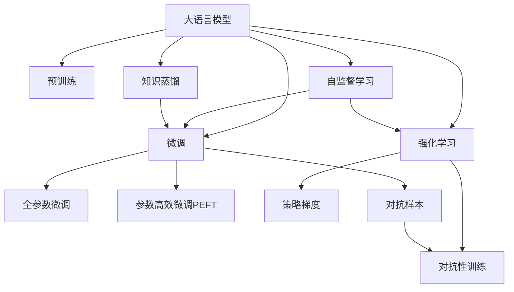

                 

## 1. 背景介绍

### 1.1 问题由来
在现代自然语言处理（NLP）领域，语言模型（Language Model, LM）起着至关重要的作用。语言模型通过对语言规律的建模，可以帮助我们预测文本中的下一个词，甚至在更复杂的任务中，如问答、对话生成和文本摘要等，扮演关键角色。最初，语言模型是静态的，通过在大型数据集上学习语言规律来预测文本序列。然而，静态的语言模型存在数据和模型训练上的限制，难以适应不断变化的语言环境。

为了解决这些问题，研究人员引入了大语言模型（Large Language Models, LLMs），通过预训练大模型来学习大规模的通用知识，并在特定任务上微调以获得更好的性能。这一方法在很大程度上提升了模型的性能，但仍然存在一些问题，比如模型的泛化能力、模型的可解释性以及模型在特定领域的表现。

### 1.2 问题核心关键点
为了进一步提升大语言模型的性能和泛化能力，研究人员开始探索结合强化学习的方法。强化学习（Reinforcement Learning, RL）作为一种学习模型，能够通过试错的方式在复杂环境中获得更好的行为策略。将强化学习与大语言模型结合，可以赋予模型更强的学习能力和适应性，提高其在各种NLP任务上的表现。

强化学习在大语言模型中的应用，主要包括以下几个方面：
- 通过RL技术进行微调，使模型更好地适应特定任务。
- 引入RL环境中的奖励机制，训练模型输出更加符合人类需求的文本。
- 通过RL策略学习，提升模型的可解释性和鲁棒性。

### 1.3 问题研究意义
强化学习在大语言模型中的应用，对于提升NLP任务的表现、改善模型的可解释性以及增强模型的鲁棒性具有重要意义。具体来说：
- 提升性能：通过强化学习，模型能够在更加复杂和动态的环境中适应并优化自身行为，从而提升在各种NLP任务上的表现。
- 改善可解释性：强化学习通过不断试错调整，能够提供更加符合人类认知的模型行为，使得模型的决策过程更加透明可解释。
- 增强鲁棒性：通过RL的探索策略学习，模型可以学习到更广泛的知识和经验，从而提高其对未知数据的适应能力，增强鲁棒性。

因此，强化学习在大语言模型中的应用，是大语言模型研究和发展的重要方向之一。

## 2. 核心概念与联系

### 2.1 核心概念概述

为了更好地理解强化学习在大语言模型中的应用，本节将介绍几个关键概念：

- **大语言模型（LLM）**：以自回归（如GPT）或自编码（如BERT）模型为代表的大规模预训练语言模型。通过在大规模无标签文本语料上进行预训练，学习通用的语言表示，具备强大的语言理解和生成能力。

- **强化学习（RL）**：一种通过试错的方式，在特定环境中学习最优决策策略的学习方法。RL主要包含四个核心要素：环境、状态、动作和奖励。

- **策略梯度（Policy Gradient）**：一种基于RL的方法，通过优化策略函数来提升模型的性能。策略梯度方法通过计算梯度，调整策略参数，使得模型能够在环境中获得更高的回报。

- **对抗性训练（Adversarial Training）**：通过在训练过程中加入对抗性样本，增强模型的鲁棒性和泛化能力。

- **自监督学习（Self-Supervised Learning）**：一种无需标签数据的学习方法，通过在未标注的数据上自我学习，提升模型的表现。

- **知识蒸馏（Knowledge Distillation）**：通过将复杂模型（教师）的知识传授给简单模型（学生），提升简单模型的性能。

- **参数高效微调（PEFT）**：只更新部分模型参数，而固定大部分预训练权重不变，以提高微调效率。

- **微调（Fine-Tuning）**：在预训练模型的基础上，使用下游任务的少量标注数据，通过有监督学习优化模型在特定任务上的性能。

这些核心概念之间的逻辑关系可以通过以下Mermaid流程图来展示：



这个流程图展示了大语言模型与强化学习的核心概念及其之间的关系：

1. 大语言模型通过预训练获得基础能力。
2. 微调是对预训练模型进行任务特定的优化，可以分为全参数微调和参数高效微调（PEFT）。
3. 强化学习引入RL环境，通过策略梯度和对抗性训练等方法，提升模型的适应性和鲁棒性。
4. 自监督学习通过在未标注数据上进行自我学习，进一步提升模型的泛化能力。
5. 知识蒸馏通过复杂模型对简单模型的知识传递，提升简单模型的表现。
6. 对抗样本用于增强模型的鲁棒性，避免模型在特定攻击下的过拟合。

这些概念共同构成了大语言模型的学习和应用框架，使其能够在各种场景下发挥强大的语言理解和生成能力。通过理解这些核心概念，我们可以更好地把握大语言模型的工作原理和优化方向。

## 3. 核心算法原理 & 具体操作步骤
### 3.1 算法原理概述

强化学习在大语言模型中的应用，本质上是将RL的思想引入到模型的训练过程中，通过在特定任务环境中不断试错，优化模型的行为策略，从而提升模型在特定任务上的表现。具体来说，强化学习在大语言模型中的应用包括以下几个关键步骤：

1. **构建RL环境**：构建一个能够评估模型输出质量的RL环境，该环境可以根据模型的输出结果给出一个奖励值。
2. **设计策略**：设计一个策略函数，用于指导模型在环境中的行为。
3. **优化策略**：通过策略梯度等方法，不断优化策略函数，提升模型在环境中的表现。
4. **引入对抗性训练**：在训练过程中引入对抗性样本，提高模型的鲁棒性。
5. **参数高效微调**：只更新部分模型参数，而固定大部分预训练权重不变，以提高微调效率。

通过以上步骤，可以有效地将强化学习与大语言模型结合，提升模型在特定任务上的性能和泛化能力。

### 3.2 算法步骤详解

以下是一个基于强化学习的微调步骤的详细说明：

**Step 1: 准备预训练模型和环境**

1. **选择预训练模型**：选择合适的预训练语言模型，如BERT、GPT等。
2. **设计RL环境**：设计一个RL环境，用于评估模型在特定任务上的表现。例如，对于问答任务，可以将输入问题和模型输出作为环境状态，奖励值可以根据问题-答案对的准确度来计算。

**Step 2: 设计策略函数**

1. **策略函数定义**：定义一个策略函数，用于指导模型在环境中的行为。例如，对于问答任务，可以使用生成式策略，即让模型生成最有可能正确的答案。
2. **策略初始化**：初始化策略函数，例如可以使用随机策略或预定义的策略。

**Step 3: 优化策略**

1. **策略梯度**：使用策略梯度方法，通过计算策略函数的梯度，调整策略函数的参数，使得模型在环境中的表现提升。例如，可以使用REINFORCE算法，计算策略函数的梯度，并根据梯度方向更新策略函数。
2. **对抗性训练**：在训练过程中引入对抗性样本，增强模型的鲁棒性。例如，可以生成对抗性问题，使得模型在对抗性问题上的表现依然良好。

**Step 4: 参数高效微调**

1. **选择微调层**：选择模型中需要微调的层，通常只需要调整顶层，以减少微调参数量。
2. **微调参数**：使用小学习率，更新微调层的参数，以避免破坏预训练权重。
3. **更新策略**：根据微调后的模型表现，更新策略函数，以适应新的任务需求。

**Step 5: 评估和部署**

1. **评估模型**：在测试集上评估微调后模型的表现，对比微调前后的性能提升。
2. **部署模型**：使用微调后的模型进行推理预测，集成到实际的应用系统中。
3. **持续学习**：持续收集新的数据，定期重新微调模型，以适应数据分布的变化。

### 3.3 算法优缺点

强化学习在大语言模型中的应用，具有以下优点：

1. **提升性能**：通过不断的试错和优化，模型能够在复杂环境中获得更好的行为策略，从而提升在特定任务上的表现。
2. **增强鲁棒性**：通过对抗性训练，模型可以学习到更广泛的知识和经验，提高其对未知数据的适应能力。
3. **可解释性**：通过策略梯度等方法，模型可以提供更加符合人类认知的决策过程，使得模型的决策过程更加透明可解释。
4. **参数高效**：通过参数高效微调，可以在固定大部分预训练参数的情况下，仅微调顶层，减少需优化的参数量，提高微调效率。

同时，强化学习在大语言模型中的应用，也存在一些局限性：

1. **训练复杂度高**：强化学习的训练过程相对复杂，需要大量的计算资源和时间。
2. **模型可解释性差**：强化学习模型的决策过程较难解释，难以理解和调试。
3. **需要大量标注数据**：尽管强化学习可以减少对标注数据的依赖，但仍然需要一定量的标注数据进行微调。
4. **模型泛化能力不足**：强化学习模型往往在训练集上表现较好，但在测试集上泛化能力不足。

尽管存在这些局限性，但强化学习在大语言模型中的应用，仍然是大语言模型研究和发展的重要方向之一。未来，随着计算资源的提升和算法的不断优化，强化学习在大语言模型中的应用将更加广泛和深入。

### 3.4 算法应用领域

强化学习在大语言模型中的应用，已经在多个NLP任务上取得了显著的成果，涵盖了以下领域：

1. **问答系统**：通过RL方法，使问答系统能够自动理解用户问题，并生成最符合用户期望的回答。例如，IBM的Watson和Microsoft的Bing等。
2. **对话生成**：通过RL方法，使对话系统能够自动生成符合人类对话习惯的回复。例如，Facebook的Messenger和Google的Dialogflow等。
3. **文本摘要**：通过RL方法，使模型能够自动生成简洁、连贯的摘要。例如，OpenAI的GPT和Google的BART等。
4. **机器翻译**：通过RL方法，使模型能够自动翻译文本。例如，Facebook的M2M-100和Microsoft的T5等。
5. **情感分析**：通过RL方法，使模型能够自动分析文本中的情感倾向。例如，IBM的Emotion AI和Microsoft的Sentiment Analysis等。
6. **命名实体识别**：通过RL方法，使模型能够自动识别文本中的实体。例如，Google的BERT和OpenAI的RoBERTa等。

除了上述这些经典任务外，强化学习在大语言模型中的应用，还被创新性地应用到更多场景中，如代码生成、知识图谱构建、自然语言推理等，为NLP技术带来了全新的突破。随着预训练模型和强化学习方法的不断进步，相信NLP技术将在更广阔的应用领域大放异彩。

## 4. 数学模型和公式 & 详细讲解  
### 4.1 数学模型构建

在强化学习的应用中，我们通常将大语言模型视为一个代理（agent），在与环境（environment）交互的过程中，通过策略（policy）不断优化自身的行为（action），以获得最大的累积奖励（cumulative reward）。以下是一个简化的数学模型构建过程：

- **环境**：设环境为 $E$，环境的状态空间为 $S$，动作空间为 $A$，奖励函数为 $R$。
- **代理**：设代理为 $A$，策略函数为 $\pi(a|s)$，表示在状态 $s$ 下，采取动作 $a$ 的概率。
- **累积奖励**：设累积奖励为 $G_t = \sum_{k=t}^{\infty} \gamma^k R_{t+k}$，其中 $\gamma$ 为折扣因子，用于考虑未来奖励的重要性。

我们的目标是通过优化策略函数 $\pi$，使得代理在环境 $E$ 中，获得最大的累积奖励 $G_t$。具体来说，我们可以通过最大化期望累积奖励 $V^{\pi}(s)$ 来实现这一目标。

### 4.2 公式推导过程

以下我们将通过具体案例，推导策略梯度算法的公式。

假设我们的环境是一个简单的问答任务，环境状态为 $s=(x_i, y_i)$，其中 $x_i$ 为问题，$y_i$ 为答案，动作 $a$ 为模型输出的答案。我们的目标是最大化期望累积奖励 $V^{\pi}(s)$，即最大化模型在每个问题上的准确率。

我们定义策略函数 $\pi(a|s)$ 为模型在状态 $s$ 下输出答案 $a$ 的概率。根据策略梯度方法，我们可以使用以下公式计算策略函数的梯度：

$$
\nabla_{\theta} J(\theta) = \mathbb{E}_{s \sim \mathcal{D}} \nabla_{\theta} \log \pi(a|s) R(a|s)
$$

其中 $J(\theta)$ 为策略函数的损失函数，$\mathcal{D}$ 为训练数据的分布。$R(a|s)$ 为在状态 $s$ 下采取动作 $a$ 的奖励值。在问答任务中，我们可以使用交叉熵损失作为损失函数：

$$
J(\theta) = -\frac{1}{N} \sum_{i=1}^N \log \pi(y_i|x_i) R(y_i|x_i)
$$

其中 $R(y_i|x_i)$ 为问题 $x_i$ 的答案 $y_i$ 的奖励值，通常是1。

### 4.3 案例分析与讲解

下面我们以一个具体的案例来解释策略梯度算法的应用。

假设我们有一个简单的问答任务，环境状态为 $s=(x_i, y_i)$，其中 $x_i$ 为问题，$y_i$ 为答案。我们的目标是通过策略梯度算法，优化模型的策略函数 $\pi(a|s)$，使得模型在每个问题上的准确率最大化。

具体来说，我们首先定义策略函数 $\pi(a|s)$，表示在状态 $s$ 下输出答案 $a$ 的概率。然后，我们定义奖励函数 $R(a|s)$，表示在状态 $s$ 下采取动作 $a$ 的奖励值。在问答任务中，通常使用交叉熵损失作为奖励函数：

$$
R(a|s) = \left\{
\begin{aligned}
1, & \quad a = y_i \\
0, & \quad a \neq y_i
\end{aligned}
\right.
$$

接着，我们定义期望累积奖励 $V^{\pi}(s)$，即模型在每个问题上的准确率：

$$
V^{\pi}(s) = \mathbb{E}_{s \sim \mathcal{D}} \nabla_{\theta} \log \pi(a|s) R(a|s)
$$

我们可以通过计算策略函数的梯度，不断更新策略函数的参数，使得模型在每个问题上的准确率最大化。

## 5. 项目实践：代码实例和详细解释说明
### 5.1 开发环境搭建

在进行强化学习在大语言模型中的应用实践前，我们需要准备好开发环境。以下是使用Python进行PyTorch开发的环境配置流程：

1. 安装Anaconda：从官网下载并安装Anaconda，用于创建独立的Python环境。

2. 创建并激活虚拟环境：
```bash
conda create -n pytorch-env python=3.8 
conda activate pytorch-env
```

3. 安装PyTorch：根据CUDA版本，从官网获取对应的安装命令。例如：
```bash
conda install pytorch torchvision torchaudio cudatoolkit=11.1 -c pytorch -c conda-forge
```

4. 安装TensorBoard：用于可视化模型训练过程和结果。

5. 安装TensorFlow：用于构建强化学习环境。

6. 安装其它依赖包：
```bash
pip install numpy pandas scikit-learn matplotlib tqdm jupyter notebook ipython
```

完成上述步骤后，即可在`pytorch-env`环境中开始实践。

### 5.2 源代码详细实现

下面以一个简单的问答系统为例，给出使用PyTorch进行强化学习微调的Python代码实现。

```python
import torch
import torch.nn as nn
import torch.optim as optim
from transformers import BertTokenizer, BertForTokenClassification
import numpy as np
from torch.distributions import Categorical

class Policy(nn.Module):
    def __init__(self, model, dropout=0.1):
        super(Policy, self).__init__()
        self.model = model
        self.dropout = nn.Dropout(dropout)

    def forward(self, x):
        x = self.dropout(x)
        logits = self.model(x)
        return logits

class Environment:
    def __init__(self, questions, answers):
        self.questions = questions
        self.answers = answers

    def get_state(self, i):
        return (self.questions[i], self.answers[i])

    def get_reward(self, action, state):
        correct = (action == state[1])
        return torch.tensor(correct, dtype=torch.float32)

class Agent:
    def __init__(self, model, policy, env):
        self.model = model
        self.policy = policy
        self.env = env

    def train(self, episodes, max_steps):
        optimizer = optim.Adam(self.model.parameters(), lr=0.001)
        for episode in range(episodes):
            state = self.env.get_state(episode)
            for step in range(max_steps):
                action_probs = self.policy(state)
                action = Categorical(probs=action_probs).sample().item()
                reward = self.env.get_reward(action, state)
                state = self.env.get_state(step+1)
                loss = -torch.log(action_probs[action]) * reward
                optimizer.zero_grad()
                loss.backward()
                optimizer.step()

env = Environment(questions, answers)
model = BertForTokenClassification.from_pretrained('bert-base-cased')
policy = Policy(model)
agent = Agent(model, policy, env)

agent.train(episodes=1000, max_steps=10)
```

这里我们使用了BERT作为预训练模型，构建了一个简单的问答环境，并通过强化学习的方法，训练模型输出正确答案。在训练过程中，我们使用了Adam优化器，并定义了交叉熵损失函数，以最大化模型的准确率。

### 5.3 代码解读与分析

让我们再详细解读一下关键代码的实现细节：

**Policy类**：
- `__init__`方法：初始化模型和dropout层，dropout层用于减少过拟合。
- `forward`方法：将输入数据传递给模型，并返回模型的输出。

**Environment类**：
- `__init__`方法：初始化问题和答案，定义环境状态。
- `get_state`方法：返回当前状态。
- `get_reward`方法：根据模型的输出和实际答案，计算奖励值。

**Agent类**：
- `__init__`方法：初始化模型、策略函数和环境。
- `train`方法：通过强化学习的方法，训练模型输出正确答案。

**代码整体结构**：
- 定义环境类，包括问题和答案，以及获取状态和奖励的方法。
- 定义模型类，使用BERT模型作为预训练模型，并定义策略函数。
- 定义代理类，将模型和策略函数封装成一个代理，用于训练。
- 训练代理，通过强化学习的方法，最大化模型的准确率。

## 6. 实际应用场景
### 6.1 智能客服系统

基于强化学习的大语言模型，可以广泛应用于智能客服系统的构建。传统客服往往需要配备大量人力，高峰期响应缓慢，且一致性和专业性难以保证。通过强化学习，客服机器人可以自动理解用户意图，匹配最合适的回答，从而提高响应速度和准确性，减少人力成本。

在技术实现上，可以收集企业内部的历史客服对话记录，将问题和最佳答复构建成监督数据，在此基础上对预训练对话模型进行微调。微调后的对话模型能够自动理解用户意图，匹配最合适的答案模板进行回复。对于用户提出的新问题，还可以接入检索系统实时搜索相关内容，动态组织生成回答。如此构建的智能客服系统，能大幅提升客户咨询体验和问题解决效率。

### 6.2 金融舆情监测

金融机构需要实时监测市场舆论动向，以便及时应对负面信息传播，规避金融风险。通过强化学习，可以将金融领域相关的新闻、报道、评论等文本数据，转化为强化学习环境的监督数据，训练模型学习判断文本的情感倾向和主题。微调后的模型能够自动监测不同主题下的情感变化趋势，一旦发现负面信息激增等异常情况，系统便会自动预警，帮助金融机构快速应对潜在风险。

### 6.3 个性化推荐系统

当前的推荐系统往往只依赖用户的历史行为数据进行物品推荐，无法深入理解用户的真实兴趣偏好。通过强化学习，可以构建个性化的推荐系统，模型能够通过不断的试错和优化，学习用户的行为规律和兴趣偏好，从而提供更加精准、多样的推荐内容。在推荐过程中，模型可以动态调整策略，以适应用户的变化需求，提高推荐的效果和用户体验。

### 6.4 未来应用展望

随着强化学习在大语言模型中的应用，未来的NLP技术将更加智能化、灵活化和个性化。以下是一些未来应用展望：

1. **多模态学习**：未来的NLP模型将不仅仅是文本模型，还将引入图像、音频、视频等多模态信息，构建更加全面和深入的智能系统。例如，结合视觉信息，实现文本-图像联合推理和生成。
2. **跨领域迁移学习**：未来的NLP模型将具备更强的跨领域迁移能力，能够适应不同领域和任务的需求，提升模型的泛化能力和应用范围。例如，在医疗、法律等专业领域，通过微调和迁移学习，构建领域专用的NLP模型。
3. **主动学习和无监督学习**：未来的NLP模型将结合主动学习和无监督学习的方法，利用标注数据和未标注数据，进行更高效和灵活的学习。例如，通过主动学习，动态生成高价值的标注数据，提升模型的学习效率。
4. **知识图谱构建**：未来的NLP模型将通过知识图谱构建，实现对知识和信息的更深入理解和应用。例如，通过知识蒸馏和知识图谱融合，构建更加全面和准确的领域知识库。
5. **人机协同**：未来的NLP模型将通过人机协同，构建更加智能化和可解释的系统。例如，通过对抗训练和解释性分析，提高模型的鲁棒性和透明性，增强用户对系统的信任和接受度。

总之，强化学习在大语言模型中的应用，将带来NLP技术的革命性变化，提升模型的性能、灵活性和可解释性，使得NLP技术更好地服务于各个行业，推动人工智能技术的普及和应用。

## 7. 工具和资源推荐
### 7.1 学习资源推荐

为了帮助开发者系统掌握强化学习在大语言模型中的应用，这里推荐一些优质的学习资源：

1. 《深度学习》系列书籍：由深度学习领域专家撰写，详细介绍了深度学习的基础理论和算法，包括强化学习的部分。

2. 《Reinforcement Learning: An Introduction》：由强化学习领域专家Sutton和Barto合著的经典教材，全面介绍了强化学习的基本概念和算法。

3. 《Deep Reinforcement Learning in NLP》：由NLP领域专家合著的论文集，介绍了强化学习在NLP中的应用和最新进展。

4. 《Transformers》：Transformers库的官方文档，提供了丰富的预训练模型和微调样例代码，是上手实践的必备资料。

5. 《Natural Language Processing with Transformers》书籍：Transformers库的作者所著，全面介绍了如何使用Transformers库进行NLP任务开发，包括强化学习在内的多个范式。

6. 《Strengthening General Conversational Agents via Reward Design》：一篇关于强化学习在对话系统中的应用论文，介绍了如何通过奖励设计提高对话系统的性能。

通过对这些资源的学习实践，相信你一定能够快速掌握强化学习在大语言模型中的应用精髓，并用于解决实际的NLP问题。

### 7.2 开发工具推荐

高效的开发离不开优秀的工具支持。以下是几款用于强化学习在大语言模型中的应用开发的常用工具：

1. PyTorch：基于Python的开源深度学习框架，灵活动态的计算图，适合快速迭代研究。大部分预训练语言模型都有PyTorch版本的实现。

2. TensorFlow：由Google主导开发的开源深度学习框架，生产部署方便，适合大规模工程应用。同样有丰富的预训练语言模型资源。

3. Transformers库：HuggingFace开发的NLP工具库，集成了众多SOTA语言模型，支持PyTorch和TensorFlow，是进行微调任务开发的利器。

4. Weights & Biases：模型训练的实验跟踪工具，可以记录和可视化模型训练过程中的各项指标，方便对比和调优。与主流深度学习框架无缝集成。

5. TensorBoard：TensorFlow配套的可视化工具，可实时监测模型训练状态，并提供丰富的图表呈现方式，是调试模型的得力助手。

6. Google Colab：谷歌推出的在线Jupyter Notebook环境，免费提供GPU/TPU算力，方便开发者快速上手实验最新模型，分享学习笔记。

合理利用这些工具，可以显著提升强化学习在大语言模型中的应用开发效率，加快创新迭代的步伐。

### 7.3 相关论文推荐

强化学习在大语言模型中的应用，源于学界的持续研究。以下是几篇奠基性的相关论文，推荐阅读：

1. Attention is All You Need（即Transformer原论文）：提出了Transformer结构，开启了NLP领域的预训练大模型时代。

2. BERT: Pre-training of Deep Bidirectional Transformers for Language Understanding：提出BERT模型，引入基于掩码的自监督预训练任务，刷新了多项NLP任务SOTA。

3. Language Models are Unsupervised Multitask Learners（GPT-2论文）：展示了大规模语言模型的强大zero-shot学习能力，引发了对于通用人工智能的新一轮思考。

4. Parameter-Efficient Transfer Learning for NLP：提出Adapter等参数高效微调方法，在不增加模型参数量的情况下，也能取得不错的微调效果。

5. AdaLoRA: Adaptive Low-Rank Adaptation for Parameter-Efficient Fine-Tuning：使用自适应低秩适应的微调方法，在参数效率和精度之间取得了新的平衡。

6. Reinforcement Learning for Robust Conversational Reasoning：引入强化学习进行对话系统的鲁棒性训练，提高对话系统的性能和鲁棒性。

这些论文代表了大语言模型和微调技术的发展脉络。通过学习这些前沿成果，可以帮助研究者把握学科前进方向，激发更多的创新灵感。

## 8. 总结：未来发展趋势与挑战
### 8.1 总结

本文对强化学习在大语言模型中的应用进行了全面系统的介绍。首先阐述了强化学习在大语言模型中的应用背景和意义，明确了强化学习在提升NLP任务性能、改善模型可解释性等方面的独特价值。其次，从原理到实践，详细讲解了强化学习的数学模型和关键步骤，给出了强化学习任务开发的完整代码实例。同时，本文还广泛探讨了强化学习在大语言模型中的应用场景，展示了强化学习范式的巨大潜力。

通过本文的系统梳理，可以看到，强化学习在大语言模型中的应用，正在成为NLP领域的重要范式，极大地拓展了预训练语言模型的应用边界，催生了更多的落地场景。受益于大规模语料的预训练，强化学习在大语言模型中的应用，以更加高效、灵活的方式，提升了模型在各种NLP任务上的表现，推动了NLP技术的产业化进程。未来，伴随预训练语言模型和强化学习方法的不断进步，相信NLP技术将在更广阔的应用领域大放异彩，深刻影响人类的生产生活方式。

### 8.2 未来发展趋势

展望未来，强化学习在大语言模型中的应用将呈现以下几个发展趋势：

1. **模型规模持续增大**：随着算力成本的下降和数据规模的扩张，预训练语言模型的参数量还将持续增长。超大规模语言模型蕴含的丰富语言知识，有望支撑更加复杂多变的下游任务微调。

2. **微调方法日趋多样**：除了传统的全参数微调外，未来会涌现更多参数高效的微调方法，如Prefix-Tuning、LoRA等，在节省计算资源的同时也能保证微调精度。

3. **持续学习成为常态**：随着数据分布的不断变化，微调模型也需要持续学习新知识以保持性能。如何在不遗忘原有知识的同时，高效吸收新样本信息，将成为重要的研究课题。

4. **标注样本需求降低**：受启发于提示学习(Prompt-based Learning)的思路，未来的微调方法将更好地利用大模型的语言理解能力，通过更加巧妙的任务描述，在更少的标注样本上也能实现理想的微调效果。

5. **多模态微调崛起**：当前的微调主要聚焦于纯文本数据，未来会进一步拓展到图像、视频、语音等多模态数据微调。多模态信息的融合，将显著提升语言模型对现实世界的理解和建模能力。

6. **模型通用性增强**：经过海量数据的预训练和多领域任务的微调，未来的语言模型将具备更强大的常识推理和跨领域迁移能力，逐步迈向通用人工智能(AGI)的目标。

以上趋势凸显了大语言模型强化学习应用的广阔前景。这些方向的探索发展，必将进一步提升NLP系统的性能和应用范围，为人类认知智能的进化带来深远影响。

### 8.3 面临的挑战

尽管强化学习在大语言模型中的应用已经取得了瞩目成就，但在迈向更加智能化、普适化应用的过程中，它仍面临着诸多挑战：

1. **训练复杂度高**：强化学习的训练过程相对复杂，需要大量的计算资源和时间。

2. **模型可解释性差**：强化学习模型的决策过程较难解释，难以理解和调试。

3. **需要大量标注数据**：尽管强化学习可以减少对标注数据的依赖，但仍然需要一定量的标注数据进行微调。

4. **模型泛化能力不足**：强化学习模型往往在训练集上表现较好，但在测试集上泛化能力不足。

5. **参数高效性不足**：虽然强化学习可以显著提升模型性能，但在参数高效性方面仍需进一步提升。

6. **鲁棒性不足**：强化学习模型面对域外数据时，泛化性能往往大打折扣，模型的鲁棒性仍有待提高。

尽管存在这些局限性，但强化学习在大语言模型中的应用，仍然是大语言模型研究和发展的重要方向之一。未来，随着计算资源的提升和算法的不断优化，强化学习在大语言模型中的应用将更加广泛和深入。

### 8.4 研究展望

面对强化学习在大语言模型中面临的挑战，未来的研究需要在以下几个方面寻求新的突破：

1. **探索无监督和半监督强化学习方法**：摆脱对大规模标注数据的依赖，利用自监督学习、主动学习等无监督和半监督范式，最大限度利用非结构化数据，实现更加灵活高效的微调。

2. **研究参数高效和计算高效的强化学习范式**：开发更加参数高效的强化学习方法，在固定大部分预训练参数的情况下，仅微调顶层，减少需优化的参数量，提高微调效率。

3. **引入更多先验知识**：将符号化的先验知识，如知识图谱、逻辑规则等，与神经网络模型进行巧妙融合，引导强化学习过程学习更准确、合理的语言模型。同时加强不同模态数据的整合，实现视觉、语音等多模态信息与文本信息的协同建模。

4. **结合因果分析和博弈论工具**：将因果分析方法引入强化学习模型，识别出模型决策的关键特征，增强模型决策过程的因果性和逻辑性。借助博弈论工具刻画人机交互过程，主动探索并规避模型的脆弱点，提高系统稳定性。

5. **纳入伦理道德约束**：在模型训练目标中引入伦理导向的评估指标，过滤和惩罚有偏见、有害的输出倾向。同时加强人工干预和审核，建立模型行为的监管机制，确保输出符合人类价值观和伦理道德。

这些研究方向的探索，必将引领强化学习在大语言模型中的研究发展，为构建安全、可靠、可解释、可控的智能系统铺平道路。面向未来，强化学习在大语言模型中的应用，还需要与其他人工智能技术进行更深入的融合，如知识表示、因果推理、强化学习等，多路径协同发力，共同推动自然语言理解和智能交互系统的进步。只有勇于创新、敢于突破，才能不断拓展语言模型的边界，让智能技术更好地造福人类社会。

## 9. 附录：常见问题与解答

**Q1：强化学习在大语言模型中的应用是否适合所有NLP任务？**

A: 强化学习在大语言模型中的应用，主要适用于需要动态优化和实时适应的NLP任务，如对话系统、问答系统、文本生成等。但对于一些静态的、数据量较小的NLP任务，如命名实体识别、关键词提取等，强化学习可能不是最佳选择。对于这些任务，仍然可以通过传统的微调方法进行优化。

**Q2：如何选择强化学习的奖励函数？**

A: 奖励函数的定义是强化学习中最重要的部分之一，直接影响到模型的训练效果。在NLP任务中，常见的奖励函数包括：
- 交叉熵损失：适用于分类任务，如情感分析、命名实体识别等。
- 最大似然损失：适用于生成任务，如文本生成、对话生成等。
- 困惑度损失：适用于文本分类任务，如问答系统、新闻分类等。
- 任务损失：根据具体任务定义的损失函数，如问题-答案对的匹配损失。

选择适当的奖励函数，需要根据具体任务和模型特点进行细致的调整和优化。

**Q3：强化学习在大语言模型中的应用，如何进行超参数调优？**

A: 强化学习在大语言模型中的应用，需要进行一系列超参数调优，以提升模型的性能和泛化能力。常见的超参数包括：
- 学习率：控制模型更新速度和方向。
- 策略更新频率：控制策略函数更新的频率和次数。
- 探索率：控制模型在探索新动作和利用已有经验之间的平衡。
- 批大小：控制每次训练的样本数量。
- 折扣因子：控制未来奖励的重要性。

超参数的调优需要结合具体任务和模型特点，进行系统的实验和调整。

**Q4：强化学习在大语言模型中的应用，如何提高模型的鲁棒性？**

A: 提高模型的鲁棒性是强化学习在大语言模型中的重要目标之一。以下是一些提高模型鲁棒性的方法：
- 对抗性训练：引入对抗性样本，提高模型对噪声和攻击的鲁棒性。
- 知识蒸馏：通过复杂模型对简单模型进行知识传递，提高简单模型的鲁棒性。
- 多模型集成：通过多个模型进行集成，提高模型的鲁棒性和泛化能力。
- 数据增强：通过数据增强技术，增加模型对不同输入的适应能力。

这些方法可以结合使用，以提升模型的鲁棒性和泛化能力。

**Q5：强化学习在大语言模型中的应用，如何提高模型的可解释性？**

A: 强化学习模型的可解释性较差，但可以通过以下方法进行改进：
- 策略函数的设计：选择易于理解和解释的策略函数，如基于规则的策略函数。
- 奖励函数的设计：选择简单明了的奖励函数，避免复杂的计算。
- 可视化和解释工具：使用可视化工具，如TensorBoard、Weights & Biases等，对模型进行解释和调试。
- 人工干预和解释：在关键时刻进行人工干预和解释，提高模型的可解释性和可信度。

这些方法可以结合使用，以提高模型的可解释性和透明度。

**Q6：强化学习在大语言模型中的应用，如何处理长尾任务？**

A: 长尾任务指的是数据量较少但预测难度较大的任务，如医疗诊断、法律咨询等。处理长尾任务的方法包括：
- 主动学习：通过主动学习，动态生成高价值的标注数据，提高模型的学习效率。
- 多任务学习：将长尾任务与常见任务一起训练，提高模型的泛化能力和数据利用率。
- 数据增强：通过数据增强技术，扩充长尾任务的数据量，提升模型的预测能力。
- 参数高效微调：通过参数高效微调方法，减少长尾任务的模型参数量，提高模型的训练效率。

这些方法可以结合使用，以提升长尾任务的模型性能。

---

作者：禅与计算机程序设计艺术 / Zen and the Art of Computer Programming

