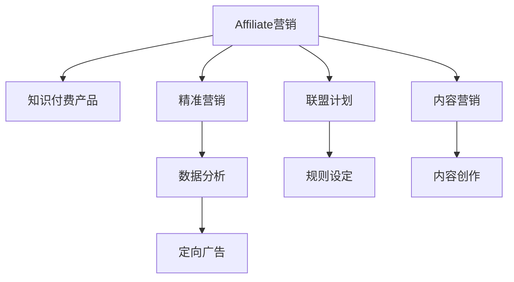

                 

# 如何利用affiliate营销推广知识付费产品

> 关键词：Affiliate营销, 知识付费, 精准营销, 转化率, 联盟计划, 内容营销

## 1. 背景介绍

### 1.1 问题由来

随着在线教育市场的快速增长，知识付费产品逐渐成为人们获取知识和技能的重要渠道。然而，面对激烈的市场竞争，如何高效推广知识付费产品，吸引更多潜在客户，成为每一个知识付费平台亟需解决的问题。

### 1.2 问题核心关键点

Affiliate营销，即联盟营销，是一种通过第三方渠道推广产品并获取收益的营销方式。其核心思想在于利用第三方的流量和信任度，将产品推广到更广泛的受众中，并通过设置佣金激励渠道和客户，实现产品的高效推广和销售转化。

Affiliate营销的核心在于选择合适的渠道和佣金结构，以确保推广效果和自身利益最大化。常见的Affiliate渠道包括独立站、社交媒体、论坛、社区等。此外，设置合理的佣金结构，通过多层次激励机制，可以有效提升推广人员的积极性，进而提高转化率。

## 2. 核心概念与联系

### 2.1 核心概念概述

为更好地理解Affiliate营销在知识付费产品推广中的应用，本节将介绍几个密切相关的核心概念：

- Affiliate营销：通过第三方渠道推广产品，获取收益的营销方式。通常与CPA(Cost Per Acquisition)或CPS(Cost Per Sale)等激励方式结合，以促进销售转化。
- 知识付费产品：指通过在线平台提供的有偿知识服务，如课程、电子书、培训等。旨在通过付费机制筛选出更加精准的客户，提高服务质量。
- 精准营销：通过数据分析、定向广告等方式，将产品推广至具有购买意向的客户群体，以提高转化率和ROI。
- 联盟计划：指知识付费平台与其推广渠道建立的合作关系，通过设定规则和佣金，确保推广效果和公平性。
- 内容营销：通过高质量的内容吸引客户，建立品牌信任，间接提升产品的销售转化率。

这些核心概念之间的逻辑关系可以通过以下Mermaid流程图来展示：



这个流程图展示了一系列Affiliate营销的关键概念及其之间的关系：

1. Affiliate营销的推广对象是知识付费产品。
2. 通过精准营销和内容营销提高目标客户群的转化率。
3. 通过联盟计划和规则设定，确保推广渠道的公平性和有效性。
4. 结合数据分析和定向广告，实现推广目标的精准定位。

## 3. 核心算法原理 & 具体操作步骤

### 3.1 算法原理概述

Affiliate营销的算法原理主要包括目标客户识别、渠道选择、佣金结构设计、转化率优化等。通过构建模型，预测不同渠道和内容对目标客户的影响，设定合理的佣金结构和激励机制，最大化推广效果。

具体而言，Affiliate营销算法分为以下几个步骤：

1. 数据收集：收集各渠道的流量、转化数据，客户行为数据等。
2. 数据预处理：对数据进行清洗、归一化等预处理，确保数据质量。
3. 特征工程：提取重要特征，如渠道类型、客户属性、内容质量等。
4. 模型训练：选择合适的机器学习算法，如随机森林、GBDT、深度学习等，构建推广效果预测模型。
5. 模型评估：使用测试数据集对模型进行评估，优化模型性能。
6. 推广实施：将模型应用于实际推广过程中，根据预测结果和激励机制，选择合适的渠道和内容进行推广。

### 3.2 算法步骤详解

以下是Affiliate营销算法的详细步骤：

#### 3.2.1 数据收集

收集各渠道的流量、转化数据，客户行为数据等。具体步骤如下：

1. **流量数据**：通过网络流量统计工具，如Google Analytics、百度统计等，收集各渠道的访问量和页面停留时间。
2. **转化数据**：在知识付费平台后台记录各渠道的注册、购买、完成课程等转化数据。
3. **客户行为数据**：通过行为跟踪工具，如cookies、ip地址等，收集客户在平台上的浏览、点击、留言等行为数据。

#### 3.2.2 数据预处理

对数据进行清洗、归一化等预处理，确保数据质量。具体步骤如下：

1. **数据清洗**：删除无效数据、重复数据，处理缺失值和异常值。
2. **数据归一化**：对特征进行归一化处理，使其值域在0到1之间，避免不同特征之间的量纲差异。
3. **特征工程**：提取重要特征，如渠道类型、客户属性、内容质量等。

#### 3.2.3 特征工程

提取重要特征，如渠道类型、客户属性、内容质量等。具体步骤如下：

1. **渠道类型**：将渠道分为独立站、社交媒体、论坛、社区等类型。
2. **客户属性**：包括年龄、性别、职业、地域等。
3. **内容质量**：根据内容的相关性、受欢迎程度、用户评价等进行评分。

#### 3.2.4 模型训练

选择合适的机器学习算法，如随机森林、GBDT、深度学习等，构建推广效果预测模型。具体步骤如下：

1. **选择合适的算法**：根据数据特点和模型复杂度，选择适合的机器学习算法。
2. **特征选择**：选择影响推广效果的关键特征，避免过拟合。
3. **模型训练**：使用训练集数据，训练推广效果预测模型。
4. **超参数调优**：通过网格搜索、随机搜索等方式，调优模型超参数，提高模型性能。

#### 3.2.5 模型评估

使用测试数据集对模型进行评估，优化模型性能。具体步骤如下：

1. **划分数据集**：将数据集分为训练集和测试集。
2. **评估指标**：选择如AUC、ROC、F1-score等评估指标，评估模型性能。
3. **优化模型**：根据评估结果，调整模型参数，提高模型性能。

#### 3.2.6 推广实施

将模型应用于实际推广过程中，根据预测结果和激励机制，选择合适的渠道和内容进行推广。具体步骤如下：

1. **选择合适的渠道**：根据模型预测结果，选择推广效果最好的渠道。
2. **设计佣金结构**：设定合理的佣金比例，确保推广人员积极性。
3. **内容优化**：根据模型预测结果，优化内容质量，提高客户转化率。
4. **动态调整**：实时监测推广效果，根据实际情况动态调整推广策略。

### 3.3 算法优缺点

Affiliate营销算法的主要优点包括：

1. 高效推广：通过精准营销和内容营销，提高目标客户群的转化率，最大化推广效果。
2. 成本低廉：利用第三方渠道和客户，降低自身推广成本。
3. 灵活性高：根据市场变化，灵活调整推广策略，适应性强。

同时，该算法也存在一定的局限性：

1. 数据依赖：推广效果依赖于数据质量，需要收集大量的客户行为数据。
2. 模型复杂：推广模型涉及多个特征和算法，模型的复杂度较高。
3. 结果不确定：推广效果受多方面因素影响，模型预测结果存在不确定性。

尽管存在这些局限性，但Affiliate营销算法仍是大规模推广知识付费产品的重要手段。未来相关研究的重点在于如何进一步提高数据质量，降低模型复杂度，提高推广效果的可解释性和稳定性。

### 3.4 算法应用领域

Affiliate营销算法在知识付费产品推广中有着广泛的应用，具体包括：

1. **课程推广**：通过联盟计划，选择适合的独立站、社交媒体等渠道进行课程推广，提高课程报名率。
2. **电子书销售**：通过精准营销和内容营销，推广电子书，提高销售转化率。
3. **培训项目推广**：通过联盟计划和内容营销，推广各类培训项目，提升培训报名率和课程完成率。
4. **社群营销**：通过社区、论坛等渠道，推广知识付费社群，提高用户粘性和转化率。

除了上述这些经典应用外，Affiliate营销算法还可以创新性地应用于更多场景中，如知识付费平台的品牌推广、活动策划等，为知识付费平台带来更多的流量和收益。

## 4. 数学模型和公式 & 详细讲解 & 举例说明

### 4.1 数学模型构建

本节将使用数学语言对Affiliate营销算法的推广效果预测模型进行更加严格的刻画。

假设知识付费平台有N个渠道，M个特征，模型输入为(X1, X2, ..., XM)，推广效果为目标变量Y。根据Affiliate营销算法，推广效果预测模型可以表示为：

$$
Y = f(X_1, X_2, ..., X_M)
$$

其中，$f$为推广效果预测函数，可通过回归、分类等模型实现。

### 4.2 公式推导过程

以下我们以逻辑回归模型为例，推导Affiliate营销算法的推广效果预测公式。

假设模型输入为$(X_1, X_2, ..., X_M)$，推广效果为目标变量$Y$。逻辑回归模型的预测公式为：

$$
P(Y=1|X) = \frac{1}{1+\exp(-\sum_{i=1}^M w_i X_i)}
$$

其中，$w_i$为第$i$个特征的权重系数。

将推广效果二元化（如0/1表示是否购买课程），可以构建推广效果预测模型：

$$
P(Y=1|X) = \frac{1}{1+\exp(-\sum_{i=1}^M w_i X_i)}
$$

在模型训练阶段，使用交叉熵损失函数进行优化：

$$
L = -\frac{1}{N} \sum_{i=1}^N [y_i \log P(Y=1|X_i) + (1-y_i) \log (1-P(Y=1|X_i))]
$$

其中，$y_i$为第$i$个样本的实际推广效果（0或1）。

### 4.3 案例分析与讲解

以某知识付费平台的Affiliate营销算法为例，分析其应用过程。

假设该平台有独立站、社交媒体、论坛三种渠道，收集各渠道的流量、转化数据和客户行为数据，提取渠道类型、客户属性、内容质量等特征。

使用随机森林算法构建推广效果预测模型，对模型进行训练和评估，最终得到模型预测结果。根据预测结果，选择推广效果最好的渠道（独立站），设定合理的佣金结构（购买课程后给予推广人员10%佣金），并进行内容优化（提高课程质量和推广文案），最终实现了知识付费产品的有效推广。

## 5. 项目实践：代码实例和详细解释说明

### 5.1 开发环境搭建

在进行Affiliate营销算法实践前，我们需要准备好开发环境。以下是使用Python进行Python语言实践的环境配置流程：

1. 安装Anaconda：从官网下载并安装Anaconda，用于创建独立的Python环境。

2. 创建并激活虚拟环境：
```bash
conda create -n affiliate-env python=3.8 
conda activate affiliate-env
```

3. 安装Python工具包：
```bash
pip install numpy pandas scikit-learn matplotlib seaborn scikit-learn
```

4. 安装机器学习库：
```bash
pip install scikit-learn
```

5. 安装数据处理工具：
```bash
pip install pandas
```

完成上述步骤后，即可在`affiliate-env`环境中开始Affiliate营销算法的实践。

### 5.2 源代码详细实现

这里我们以Affiliate营销算法的推广效果预测为例，给出使用Scikit-learn库进行Affiliate营销实践的Python代码实现。

首先，定义数据集和特征：

```python
import pandas as pd

# 定义数据集
data = pd.read_csv('affiliate_data.csv')

# 定义特征和目标变量
X = data[['channel_type', 'customer_age', 'content_quality']]
y = data['purchase']
```

然后，进行数据预处理和特征工程：

```python
from sklearn.model_selection import train_test_split
from sklearn.preprocessing import StandardScaler

# 数据预处理
X_train, X_test, y_train, y_test = train_test_split(X, y, test_size=0.2, random_state=42)
scaler = StandardScaler()
X_train = scaler.fit_transform(X_train)
X_test = scaler.transform(X_test)
```

接着，构建逻辑回归模型并进行训练和评估：

```python
from sklearn.linear_model import LogisticRegression
from sklearn.metrics import roc_auc_score

# 构建模型
model = LogisticRegression()

# 训练模型
model.fit(X_train, y_train)

# 评估模型
y_pred = model.predict_proba(X_test)[:, 1]
roc_auc = roc_auc_score(y_test, y_pred)
print(f'ROC AUC: {roc_auc}')
```

最后，输出模型预测结果：

```python
# 使用模型进行预测
y_pred = model.predict(X_test)

# 输出预测结果
print(y_pred)
```

以上就是使用Scikit-learn库对Affiliate营销算法进行推广效果预测的Python代码实现。可以看到，利用Scikit-learn库，我们可以快速实现Affiliate营销算法的推广效果预测。

### 5.3 代码解读与分析

让我们再详细解读一下关键代码的实现细节：

**数据集定义**：
- `pd.read_csv('affiliate_data.csv')`：从CSV文件中读取数据，并将数据存储为Pandas DataFrame格式。

**特征和目标变量定义**：
- `X = data[['channel_type', 'customer_age', 'content_quality']]`：从数据集中提取渠道类型、客户年龄、内容质量等特征。
- `y = data['purchase']`：从数据集中提取推广效果（0/1）作为目标变量。

**数据预处理**：
- `train_test_split(X, y, test_size=0.2, random_state=42)`：将数据集划分为训练集和测试集，测试集占比20%。
- `StandardScaler()`：对特征进行标准化处理，使其均值为0，方差为1。
- `fit_transform(X_train)`和`transform(X_test)`：对训练集和测试集进行标准化处理。

**模型构建**：
- `LogisticRegression()`：定义逻辑回归模型。
- `model.fit(X_train, y_train)`：在训练集上训练模型。

**模型评估**：
- `predict_proba(X_test)[:, 1]`：在测试集上使用模型预测推广效果，并取概率值。
- `roc_auc_score(y_test, y_pred)`：计算ROC AUC值，评估模型性能。

**预测输出**：
- `predict(X_test)`：在测试集上使用模型预测推广效果，输出预测结果。

可以看出，Affiliate营销算法的推广效果预测代码实现相对简单，利用Scikit-learn库可以快速完成模型训练和评估。

## 6. 实际应用场景

### 6.1 智能客服系统

Affiliate营销算法在智能客服系统的推广中有着广泛的应用。传统的客服系统通常采用电话、邮件等方式进行客户沟通，效率低下且成本较高。利用Affiliate营销算法，可以构建基于知识付费平台的智能客服系统，实现24小时在线客服，并提供高效、精准的解决方案。

具体而言，通过联盟计划选择适合的独立站、社交媒体等渠道进行客服系统推广，设定合理的佣金结构，鼓励客户使用知识付费平台提供的智能客服服务。在实际使用过程中，客户可以通过平台提供的客服机器人或人工客服，快速获取解决方案，提升客户体验。

### 6.2 在线教育平台

在线教育平台通过Affiliate营销算法推广各类课程和培训项目，可以显著提升推广效果和课程报名率。通过联盟计划选择适合的独立站、社交媒体等渠道进行课程推广，设定合理的佣金结构，激励推广人员和客户参与推广活动。

在推广过程中，平台可以提供优惠折扣、课程优惠券等激励机制，吸引更多潜在客户报名。通过精准营销和内容营销，推广效果显著提升，课程报名率和完成率明显提高。

### 6.3 企业培训

企业培训部门通过Affiliate营销算法推广各类培训课程，可以大大提升培训报名率和员工参与度。通过联盟计划选择适合的独立站、社交媒体等渠道进行培训课程推广，设定合理的佣金结构，激励推广人员和客户参与推广活动。

在推广过程中，企业可以提供与培训相关的资料、案例、实战演练等，吸引员工报名。通过精准营销和内容营销，员工对培训课程的兴趣和参与度显著提升，培训效果显著提高。

### 6.4 未来应用展望

随着Affiliate营销算法的不断发展，其应用场景将进一步扩展，为知识付费产品推广带来更多的可能性。

1. **多渠道整合**：Affiliate营销算法可以整合多种渠道，如广告、搜索引擎、社交媒体等，实现多渠道联合推广。通过设定合理的佣金结构，最大化推广效果。
2. **实时优化**：Affiliate营销算法可以实时监测推广效果，根据市场变化动态调整推广策略，实现精准营销。
3. **内容创新**：Affiliate营销算法可以结合内容营销，通过高质量的内容吸引客户，提高推广效果。
4. **跨平台推广**：Affiliate营销算法可以跨平台推广，实现知识付费产品在不同平台之间的互通。
5. **个性化推荐**：Affiliate营销算法可以通过客户行为数据进行个性化推荐，提高转化率。

总之，Affiliate营销算法将在知识付费产品推广中发挥越来越重要的作用，为平台带来更多的流量和收益。未来Affiliate营销算法的研究方向也将更加多元化和智能化，推动知识付费产业的持续发展。

## 7. 工具和资源推荐

### 7.1 学习资源推荐

为了帮助开发者系统掌握Affiliate营销算法的理论基础和实践技巧，这里推荐一些优质的学习资源：

1. **《Affiliate营销指南》**：详细介绍了Affiliate营销的原理、策略和实践技巧，适合入门学习。
2. **《Google Analytics for Marketers》**：Google官方提供的营销指南，详细介绍了如何通过数据分析提高推广效果。
3. **《机器学习实战》**：介绍常用的机器学习算法和实现方法，适合深入学习。
4. **《Python数据科学手册》**：介绍Python在数据科学中的应用，适合掌握Python编程技能。
5. **《深度学习框架TensorFlow教程》**：介绍TensorFlow框架的使用方法，适合深入学习深度学习技术。

通过对这些资源的学习实践，相信你一定能够快速掌握Affiliate营销算法的精髓，并用于解决实际的推广问题。

### 7.2 开发工具推荐

高效的开发离不开优秀的工具支持。以下是几款用于Affiliate营销算法开发的常用工具：

1. **Python语言**：作为数据科学和机器学习领域的主流语言，Python拥有丰富的第三方库和工具，适合快速迭代研究。
2. **Jupyter Notebook**：免费、开源的交互式编程环境，支持实时代码执行和结果展示，适合数据探索和模型验证。
3. **Pandas**：数据处理和分析库，适合数据清洗、预处理和探索。
4. **Scikit-learn**：机器学习库，提供多种机器学习算法和实现方法，适合构建推广效果预测模型。
5. **TensorFlow**：深度学习框架，适合构建复杂的深度学习模型，支持高效的分布式训练。
6. **PyTorch**：深度学习框架，适合构建灵活的深度学习模型，支持高效的分布式训练和模型部署。

合理利用这些工具，可以显著提升Affiliate营销算法的开发效率，加快创新迭代的步伐。

### 7.3 相关论文推荐

Affiliate营销算法的研究源于学界的持续研究。以下是几篇奠基性的相关论文，推荐阅读：

1. **《Click-Through Rate Prediction in Display Advertising: A Review and New Perspectives》**：介绍了点击率预测的最新进展，适合了解Affiliate营销算法的应用背景。
2. **《A Comprehensive Survey on Recommendation System》**：介绍了推荐系统的最新进展，适合了解Affiliate营销算法在推荐系统中的应用。
3. **《Adaptive Affiliate Management System》**：介绍了Adaptive Affiliate Management System的设计和实现，适合了解Affiliate营销算法的实际应用。
4. **《Probabilistic Affiliate Marketing》**：介绍了Affiliate营销算法的概率模型和实现方法，适合深入了解Affiliate营销算法。

这些论文代表了大数据营销算法的进展脉络，通过学习这些前沿成果，可以帮助研究者把握学科前进方向，激发更多的创新灵感。

## 8. 总结：未来发展趋势与挑战

### 8.1 总结

本文对Affiliate营销算法在知识付费产品推广中的应用进行了全面系统的介绍。首先阐述了Affiliate营销算法的原理和核心思想，明确了其在提高推广效果和降低推广成本方面的独特价值。其次，从原理到实践，详细讲解了Affiliate营销算法的数学模型和关键步骤，给出了推广效果预测的Python代码实现。同时，本文还广泛探讨了Affiliate营销算法在智能客服系统、在线教育平台、企业培训等多个行业领域的应用前景，展示了Affiliate营销算法的广阔应用空间。

通过本文的系统梳理，可以看到，Affiliate营销算法在知识付费产品推广中具有广泛的应用前景，能够有效提高推广效果和降低推广成本。未来Affiliate营销算法的研究方向也将更加多元化和智能化，推动知识付费产业的持续发展。

### 8.2 未来发展趋势

展望未来，Affiliate营销算法将呈现以下几个发展趋势：

1. **多渠道整合**：Affiliate营销算法将整合多种渠道，如广告、搜索引擎、社交媒体等，实现多渠道联合推广。通过设定合理的佣金结构，最大化推广效果。
2. **实时优化**：Affiliate营销算法将实时监测推广效果，根据市场变化动态调整推广策略，实现精准营销。
3. **内容创新**：Affiliate营销算法将结合内容营销，通过高质量的内容吸引客户，提高推广效果。
4. **跨平台推广**：Affiliate营销算法将跨平台推广，实现知识付费产品在不同平台之间的互通。
5. **个性化推荐**：Affiliate营销算法将结合推荐系统，通过客户行为数据进行个性化推荐，提高转化率。

以上趋势凸显了Affiliate营销算法的广阔前景。这些方向的探索发展，必将进一步提升知识付费产品推广的效果，为平台带来更多的流量和收益。

### 8.3 面临的挑战

尽管Affiliate营销算法已经取得了显著成效，但在迈向更加智能化、普适化应用的过程中，它仍面临着诸多挑战：

1. **数据质量问题**：推广效果依赖于数据质量，如何获取高质量的数据，是Affiliate营销算法的关键挑战。
2. **模型复杂性**：推广模型涉及多个特征和算法，模型的复杂度较高，如何优化模型性能，提高推广效果，是未来的研究方向。
3. **结果不确定性**：推广效果受多方面因素影响，模型预测结果存在不确定性，如何提高模型可解释性，确保推广结果的可靠性，是亟待解决的问题。
4. **渠道合作问题**：Affiliate营销算法需要与多种渠道合作，如何建立公平、透明、可持续的合作关系，是未来的重要课题。

正视Affiliate营销算法面临的这些挑战，积极应对并寻求突破，将是大规模推广知识付费产品的重要保障。相信随着学界和产业界的共同努力，这些挑战终将一一被克服，Affiliate营销算法必将在构建人机协同的智能时代中扮演越来越重要的角色。

### 8.4 研究展望

面对Affiliate营销算法所面临的种种挑战，未来的研究需要在以下几个方面寻求新的突破：

1. **数据质量优化**：开发更多高效的数据采集和清洗方法，提升数据质量，为Affiliate营销算法提供坚实的基础。
2. **模型性能提升**：研究更高效、更准确的Affiliate营销算法，提升推广效果和转化率。
3. **结果可靠性**：提高Affiliate营销算法的可解释性和稳定性，确保推广结果的可靠性。
4. **渠道合作优化**：建立更公平、更透明的渠道合作机制，确保推广效果的最大化。
5. **多渠道整合**：研究多渠道整合的优化策略，实现更加全面的推广覆盖。

这些研究方向的探索，必将引领Affiliate营销算法迈向更高的台阶，为知识付费产品推广带来更多的可能性，推动知识付费产业的持续发展。

## 9. 附录：常见问题与解答

**Q1：Affiliate营销算法是否适用于所有知识付费产品？**

A: Affiliate营销算法在大多数知识付费产品中都能取得不错的效果，特别是对于数据量较小的产品。但对于一些特定领域的知识付费产品，如医学、法律等，仅仅依靠通用数据进行推广，可能难以很好地适应。此时需要在特定领域数据上进一步推广，才能获得理想效果。

**Q2：如何选择合适的联盟计划？**

A: 选择合适的联盟计划需要考虑以下几个因素：

1. **渠道质量**：选择推广效果最好的渠道，如独立站、社交媒体、论坛等。
2. **佣金结构**：设定合理的佣金比例，如购买后给予推广人员10%佣金，提高推广人员积极性。
3. **客户行为**：根据客户行为数据，选择推广效果最好的产品，如高点击率、高转化率等。

**Q3：Affiliate营销算法在推广过程中需要注意哪些问题？**

A: 推广过程中需要注意以下问题：

1. **数据质量**：推广效果依赖于数据质量，需要确保数据的准确性和完整性。
2. **模型性能**：优化推广模型，避免过拟合，提高推广效果。
3. **结果可靠性**：提高推广结果的可解释性，确保推广效果的可靠性。
4. **渠道合作**：建立公平、透明的渠道合作关系，确保推广效果的最大化。
5. **实时优化**：实时监测推广效果，根据市场变化动态调整推广策略。

**Q4：Affiliate营销算法与内容营销有何区别？**

A: Affiliate营销算法和内容营销有以下区别：

1. **推广方式**：Affiliate营销算法通过激励机制，激励渠道和客户推广产品，实现高效推广；内容营销通过高质量的内容吸引客户，建立品牌信任。
2. **效果评估**：Affiliate营销算法通过推广效果指标（如点击率、转化率等）评估推广效果；内容营销通过客户反馈和品牌知名度等指标评估推广效果。
3. **成本投入**：Affiliate营销算法需要设定佣金比例，增加推广成本；内容营销主要依赖内容创作和传播，成本较低。

总之，Affiliate营销算法和内容营销各有优劣，需要根据具体场景选择合适的推广方式。

**Q5：如何提高Affiliate营销算法的推广效果？**

A: 提高Affiliate营销算法的推广效果可以从以下几个方面入手：

1. **数据质量优化**：通过高效的数据采集和清洗方法，提升数据质量。
2. **模型性能提升**：研究更高效、更准确的Affiliate营销算法，提升推广效果和转化率。
3. **结果可靠性**：提高Affiliate营销算法的可解释性和稳定性，确保推广结果的可靠性。
4. **渠道合作优化**：建立更公平、更透明的渠道合作机制，确保推广效果的最大化。
5. **多渠道整合**：研究多渠道整合的优化策略，实现更加全面的推广覆盖。

这些方法可以有效提升Affiliate营销算法的推广效果，为知识付费产品推广带来更多的可能性。

---

作者：禅与计算机程序设计艺术 / Zen and the Art of Computer Programming

