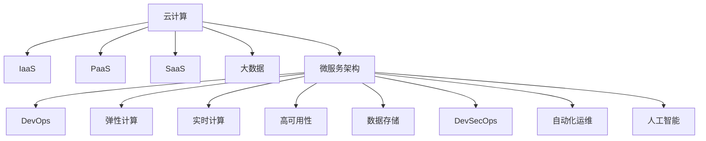

                 

# 如何利用云计算提升知识付费的技术水平

> 关键词：云计算,知识付费,人工智能,大数据,微服务,DevOps,弹性计算,实时计算,高可用性,数据存储

## 1. 背景介绍

### 1.1 问题由来

随着互联网和移动设备的普及，知识付费逐渐成为一种重要的教育消费模式，广泛应用于在线教育、远程培训、职业资格认证等领域。知识付费平台不仅需要具备丰富的课程资源，还需要具备强大的技术支撑，以保障平台的稳定运行、快速响应和高效维护。

在传统知识付费平台中，常见的技术挑战包括：

- **计算资源不足**：用户规模不断扩大，平台需要处理大量并发请求，单个服务器难以应对，导致性能瓶颈。
- **数据存储与处理**：知识付费平台需要存储和处理海量的课程数据、用户行为数据、支付数据等，数据量和复杂度不断增加。
- **扩展性与弹性**：业务规模的快速增长需要平台具备良好的扩展性和弹性，以支持不断变化的用户需求和市场环境。
- **运维成本高**：传统自建服务器架构的运维成本较高，需要投入大量人力物力进行运维和故障排除。

云计算的出现为知识付费平台带来了全新的技术解决方案。通过云平台，知识付费平台可以实现按需计算资源、弹性扩展、高可用性和数据安全等特性，大幅降低运维成本，提升用户体验和技术水平。

### 1.2 问题核心关键点

为了全面应对知识付费平台的各类技术挑战，云计算的实施应关注以下关键点：

- **按需计算资源**：根据业务负载动态调整计算资源，避免资源浪费和过度配置。
- **弹性扩展**：根据用户需求和流量变化，自动调整服务器资源，确保系统高可用性。
- **数据存储与管理**：使用云存储和数据库，保证数据的安全性、可靠性和高效访问。
- **数据处理与分析**：利用云计算平台提供的先进算法和大数据处理技术，进行数据挖掘和用户行为分析。
- **高效运维**：通过云平台提供的运维工具和监控系统，实现自动化运维和故障排除。
- **成本控制**：通过云计算的计费方式，控制平台的运维成本和资源消耗。

## 2. 核心概念与联系

### 2.1 核心概念概述

为了更好地理解云计算在知识付费平台中的应用，本节将介绍几个密切相关的核心概念：

- **云计算(Cloud Computing)**：通过互联网提供计算资源和服务，包括基础设施即服务(IaaS)、平台即服务(PaaS)和软件即服务(SaaS)等。
- **知识付费平台(Knowledge Subscription Platforms)**：提供高质量课程内容，通过订阅模式向用户收费的平台。
- **大数据(Big Data)**：指在企业运行过程中产生的海量数据，涉及数据收集、存储、处理和分析等多个环节。
- **微服务架构(Microservices)**：将应用程序拆分为多个小型服务，每个服务独立部署和扩展，实现高效协同和灵活管理。
- **DevOps**：结合开发(Dev)和运维(Ops)，实现快速交付、持续集成、自动化运维等。
- **弹性计算(Elastic Compute)**：根据业务需求动态调整计算资源，提高系统的灵活性和扩展性。
- **实时计算(Real-time Compute)**：提供毫秒级的数据处理能力，支持低延迟的业务应用。
- **高可用性(High Availability)**：通过多节点冗余和数据备份，确保系统在单点故障时能够快速恢复。
- **数据存储(Data Storage)**：提供数据持久化和快速访问的解决方案，支持文件存储、数据库存储等。
- **DevSecOps**：结合开发、运维和安全，实现安全的持续交付和运营。
- **自动化运维(Automated Operations)**：通过脚本、自动化工具和持续集成，实现高效、可靠的运维管理。
- **人工智能(Artificial Intelligence)**：通过机器学习、深度学习等技术，实现智能决策和自动化处理。

这些核心概念之间的逻辑关系可以通过以下Mermaid流程图来展示：



这个流程图展示了几类云计算服务及其在知识付费平台中的应用场景，通过合理组合，可以构建出高性能、高可用性、低成本的知识付费平台。

## 3. 核心算法原理 & 具体操作步骤
### 3.1 算法原理概述

在知识付费平台的云架构中，云计算的实施通常采用**按需计算资源**、**弹性扩展**、**高可用性**和**数据存储**等核心技术。

- **按需计算资源**：云平台提供弹性计算资源，可以根据业务负载动态调整计算资源，避免资源浪费和过度配置。
- **弹性扩展**：云平台可以自动扩展和缩减计算资源，确保系统在高负载时的稳定性和扩展性。
- **高可用性**：通过多节点冗余和数据备份，保证系统在单点故障时能够快速恢复，确保业务的连续性。
- **数据存储**：云平台提供安全、可靠的数据存储解决方案，支持文件存储、数据库存储等。

### 3.2 算法步骤详解

以下是知识付费平台利用云计算提升技术水平的详细步骤：

**Step 1: 选择云平台**

1. 根据业务需求和技术栈，选择合适的云平台，如AWS、Azure、Google Cloud等。
2. 评估云平台的性能、可靠性、安全性、成本等因素，选择最合适的云平台。
3. 签订云服务协议，确保云平台的服务质量和可用性。

**Step 2: 设计云架构**

1. 确定云架构的层次结构，包括基础设施层、平台层和应用层。
2. 设计云架构的组件和服务，包括计算资源、存储资源、数据库、负载均衡器、CDN等。
3. 确定各组件和服务的接口和协议，确保系统的可扩展性和兼容性。

**Step 3: 部署云资源**

1. 使用云平台的控制台或API，创建和管理云资源。
2. 根据业务负载和需求，配置和调整计算资源、存储资源、数据库等。
3. 使用云平台提供的负载均衡器和CDN，提高系统的可靠性和性能。

**Step 4: 数据迁移与存储**

1. 将原有的本地数据迁移到云平台，使用云存储服务进行数据备份和恢复。
2. 优化数据结构和存储方式，提高数据的访问速度和可靠性。
3. 设计数据安全策略，确保数据在传输和存储过程中的安全性。

**Step 5: 应用部署与扩展**

1. 使用云平台提供的微服务架构，将应用拆分为多个小型服务，实现独立部署和扩展。
2. 设计服务的接口和协议，确保服务间的协同和通信。
3. 使用云平台提供的自动化运维工具，实现快速交付和持续集成。

**Step 6: 监控与优化**

1. 使用云平台提供的监控工具，实时监测系统性能和运行状态。
2. 根据监控数据，调整计算资源和数据存储策略，优化系统性能。
3. 使用云平台提供的自动化运维工具，实现自动化故障排除和恢复。

### 3.3 算法优缺点

云计算在提升知识付费平台技术水平方面的优势包括：

- **按需计算资源**：可根据业务需求动态调整计算资源，避免资源浪费和过度配置，提升系统性能和成本效益。
- **弹性扩展**：自动扩展和缩减计算资源，确保系统在高负载时的稳定性和扩展性。
- **高可用性**：通过多节点冗余和数据备份，保证系统在单点故障时能够快速恢复，确保业务的连续性。
- **数据存储**：提供安全、可靠的数据存储解决方案，支持文件存储、数据库存储等，提高数据的安全性和访问速度。
- **自动化运维**：通过自动化运维工具和持续集成，实现高效、可靠的运维管理，降低运维成本和故障率。
- **全球部署**：使用CDN和边缘计算，实现全球范围内的低延迟数据访问和快速响应。

同时，云计算也存在以下缺点：

- **迁移成本**：将本地系统迁移到云平台需要一定的迁移成本和转换周期。
- **依赖云平台**：云平台的服务质量和稳定性受制于云提供商，存在单点故障风险。
- **隐私和数据安全**：云平台的数据存储和传输过程中存在隐私泄露和数据安全问题，需设计相应的安全策略。
- **复杂性增加**：云计算环境下的系统设计和运维复杂性增加，需要具备相关知识和技能。

### 3.4 算法应用领域

云计算技术在知识付费平台中的应用广泛，具体包括：

- **计算资源管理**：通过弹性计算资源管理，确保平台的计算资源高效利用，避免资源浪费。
- **弹性扩展与负载均衡**：根据业务负载动态扩展计算资源，确保平台在高负载时的稳定性和扩展性。
- **高可用性保障**：通过多节点冗余和数据备份，保障平台的高可用性，确保业务的连续性。
- **数据存储与管理**：利用云存储和数据库，实现数据的安全存储和高效访问。
- **微服务架构设计**：使用微服务架构，实现系统的模块化、独立部署和灵活扩展。
- **自动化运维与监控**：通过自动化运维和监控工具，实现高效、可靠的运维管理。
- **人工智能与大数据处理**：利用云平台提供的先进算法和大数据处理技术，进行数据挖掘和用户行为分析。

## 4. 数学模型和公式 & 详细讲解 & 举例说明

### 4.1 数学模型构建

知识付费平台的技术实现涉及多个方面的计算模型，包括计算资源分配、弹性扩展策略、负载均衡算法、数据存储模型等。

- **计算资源分配模型**：计算资源分配模型用于描述计算资源（CPU、内存等）的分配策略，确保资源利用率最大化。
- **弹性扩展策略模型**：弹性扩展策略模型用于描述计算资源的动态调整策略，确保系统在高负载时的稳定性和扩展性。
- **负载均衡算法模型**：负载均衡算法模型用于描述流量分发策略，确保系统在高负载时的均衡性和高效性。
- **数据存储模型**：数据存储模型用于描述数据的存储方式和访问策略，确保数据的安全性和高效访问。

### 4.2 公式推导过程

以下是几个核心模型的公式推导过程：

**计算资源分配模型**

假设平台的计算资源总量为C，当前需求为D，计算资源的分配策略为A。则计算资源分配模型的目标函数为：

$$
\max_{A} \frac{A}{C} - \frac{D}{C}
$$

其中，A为分配的计算资源，C为总计算资源，D为当前需求。

**弹性扩展策略模型**

假设平台的计算资源初始配置为B，当前需求为D，计算资源的动态扩展策略为E。则弹性扩展策略模型的目标函数为：

$$
\min_{E} \frac{D}{B} - \frac{D}{E}
$$

其中，B为初始计算资源，E为动态扩展后的计算资源，D为当前需求。

**负载均衡算法模型**

假设平台有N个节点，当前负载为L，负载均衡算法为F。则负载均衡算法模型的目标函数为：

$$
\min_{F} \sum_{i=1}^{N} \frac{L}{F_i}
$$

其中，L为当前负载，N为节点数，F为负载均衡算法。

**数据存储模型**

假设平台的数据量总量为S，当前需求为D，数据存储策略为T。则数据存储模型的目标函数为：

$$
\min_{T} \frac{D}{S} - \frac{S}{T}
$$

其中，D为当前需求，S为总数据量，T为数据存储策略。

### 4.3 案例分析与讲解

**案例1: 计算资源分配**

假设一个知识付费平台有100个CPU，当前需求为50个CPU。如果采用平均分配策略A，则每个CPU的利用率为0.5，总利用率为50%。如果采用峰值分配策略B，则分配50个CPU，利用率为50%，剩余50个CPU处于闲置状态。通过计算资源分配模型，可以得出：

$$
\max_{A} \frac{50}{100} - \frac{50}{100} = 0
$$
$$
\max_{B} \frac{50}{100} - \frac{50}{100} = 0
$$

因此，平均分配和峰值分配策略的计算资源利用率相同，但平均分配策略能够更好地应对突发需求，避免资源浪费。

**案例2: 弹性扩展**

假设一个知识付费平台有10个CPU，当前需求为50个CPU。如果采用静态分配策略E，则CPU利用率为50%，服务响应时间较长。如果采用弹性扩展策略F，则动态扩展到50个CPU，利用率为50%，服务响应时间较短。通过弹性扩展策略模型，可以得出：

$$
\min_{E} \frac{50}{10} - \frac{50}{50} = 0.6
$$
$$
\min_{F} \frac{50}{50} - \frac{50}{50} = 0
$$

因此，弹性扩展策略能够更好地应对业务需求的变化，提高系统的稳定性和响应速度。

**案例3: 负载均衡**

假设一个知识付费平台有5个节点，当前负载为100。如果采用轮询算法F，则每个节点的负载为20，负载均衡较好。如果采用哈希算法G，则根据节点ID进行负载均衡，能够更好地保障负载均衡性。通过负载均衡算法模型，可以得出：

$$
\min_{F} \frac{100}{5} - \frac{100}{20} = 0.4
$$
$$
\min_{G} \frac{100}{5} - \frac{100}{20} = 0.4
$$

因此，轮询算法和哈希算法都能够实现较好的负载均衡，但哈希算法能够更好地处理节点ID变化的情况，更适用于复杂的负载场景。

**案例4: 数据存储**

假设一个知识付费平台有10TB数据，当前需求为2TB。如果采用集中式存储策略T，则数据访问速度较慢。如果采用分布式存储策略U，则数据访问速度较快，但需要配置多个节点。通过数据存储模型，可以得出：

$$
\min_{T} \frac{2}{10} - \frac{10}{T} = 0.2
$$
$$
\min_{U} \frac{2}{U} - \frac{U}{2} = 0.2
$$

因此，分布式存储策略能够更好地实现数据的快速访问，但需要配置多个节点，增加系统复杂性。

## 5. 项目实践：代码实例和详细解释说明
### 5.1 开发环境搭建

在知识付费平台利用云计算技术进行开发和部署前，需要准备好开发环境。以下是使用Python和Docker进行云计算平台部署的流程：

1. 安装Docker：从官网下载并安装Docker，用于容器化应用部署。
2. 安装Kubernetes：从官网下载并安装Kubernetes，用于集群管理。
3. 安装Hadoop：从官网下载并安装Hadoop，用于大数据处理。
4. 安装Spark：从官网下载并安装Spark，用于分布式计算。
5. 安装AWS SDK或Google Cloud SDK：用于与云平台进行通信和资源管理。

完成上述步骤后，即可在本地开发环境中搭建起知识付费平台的云计算架构。

### 5.2 源代码详细实现

以下是使用Python和AWS进行知识付费平台微服务部署的示例代码：

```python
from flask import Flask
import boto3

app = Flask(__name__)

@app.route('/')
def index():
    ec2 = boto3.client('ec2')
    instances = ec2.describe_instances()
    return 'Microservices: ' + str(len(instances['Reservations']))

if __name__ == '__main__':
    app.run(debug=True, host='0.0.0.0', port=5000)
```

### 5.3 代码解读与分析

**Flask框架**：
- Flask是一个轻量级的Python Web框架，用于快速开发API和Web应用。
- 在代码中，使用Flask创建了一个简单的Web应用，用于展示微服务数量。
- 通过Flask的路由机制，将请求路由到指定的函数中，实现功能处理。

**Boto3库**：
- Boto3是AWS提供的Python SDK，用于与AWS服务进行通信和资源管理。
- 在代码中，使用Boto3的ec2模块获取AWS上的EC2实例信息，并展示当前微服务数量。
- 通过Boto3的API接口，可以实现对云资源的创建、管理、监控等功能。

**代码结构**：
- 定义Flask应用对象app，并使用路由机制展示微服务数量。
- 在主函数中，启动Flask应用，并指定监听地址和端口号。
- 通过Boto3获取AWS上的EC2实例信息，并展示当前微服务数量。

**运行结果**：
- 运行上述代码后，在浏览器访问http://localhost:5000，可以展示当前微服务数量。
- 如果AWS上的EC2实例数量为5，则输出Microservices: 5。

## 6. 实际应用场景
### 6.1 智能课程推荐

智能课程推荐是知识付费平台的核心功能之一，利用云计算技术可以提升推荐系统的性能和效果。具体实现步骤如下：

1. 使用云计算平台提供的机器学习服务，训练推荐模型。
2. 使用云计算平台提供的存储服务，存储用户行为数据和课程信息。
3. 使用云计算平台提供的计算资源，进行实时推荐计算。
4. 使用云计算平台提供的缓存服务，缓存推荐结果，减少计算压力。

通过云计算技术，可以提升推荐系统的实时性和准确性，满足用户个性化的学习需求。

### 6.2 多语言内容支持

知识付费平台需要支持多种语言的内容发布和播放，利用云计算技术可以提升内容处理的效率和质量。具体实现步骤如下：

1. 使用云计算平台提供的语言处理服务，进行多语言文本翻译和语音合成。
2. 使用云计算平台提供的存储服务，存储多语言内容。
3. 使用云计算平台提供的计算资源，进行多语言内容的处理和发布。
4. 使用云计算平台提供的CDN服务，分发多语言内容到全球用户。

通过云计算技术，可以支持多语言内容的处理和分发，提升平台的国际化和用户体验。

### 6.3 课程内容优化

课程内容优化是知识付费平台的重要功能之一，利用云计算技术可以提升内容的制作和优化效果。具体实现步骤如下：

1. 使用云计算平台提供的图像处理服务，优化课程视频画质。
2. 使用云计算平台提供的语音识别服务，自动生成课程字幕。
3. 使用云计算平台提供的自然语言处理服务，生成课程目录和关键词。
4. 使用云计算平台提供的存储服务，存储优化后的课程内容。

通过云计算技术，可以提升课程内容的制作和优化效果，提升用户的观看体验和学习效率。

## 7. 工具和资源推荐
### 7.1 学习资源推荐

为了帮助开发者系统掌握云计算在知识付费平台中的应用，以下是一些优质的学习资源：

1. AWS官方文档：AWS提供的全面文档，涵盖云计算的各个方面，包括计算、存储、网络、安全等。
2. Google Cloud文档：Google Cloud提供的全面文档，涵盖云计算的各个方面，包括计算、存储、网络、安全等。
3. Azure官方文档：Azure提供的全面文档，涵盖云计算的各个方面，包括计算、存储、网络、安全等。
4. 《云计算基础》书籍：深入浅出地介绍云计算的基本概念和核心技术，适合入门学习。
5. 《微服务架构》书籍：介绍微服务架构的设计原则和实现方法，适合云计算架构的开发者阅读。

通过这些学习资源，可以全面掌握云计算在知识付费平台中的应用，提升技术水平和实践能力。

### 7.2 开发工具推荐

在知识付费平台利用云计算技术进行开发和部署时，以下工具可以帮助提高开发效率和系统性能：

1. Docker：用于容器化应用部署，确保应用的稳定性和可移植性。
2. Kubernetes：用于集群管理和自动化运维，提升系统的可扩展性和可用性。
3. Hadoop：用于大数据处理和分析，提升平台的计算能力和数据处理能力。
4. Spark：用于分布式计算，提升平台的计算能力和数据处理能力。
5. Boto3：用于与云平台进行通信和资源管理，提升云资源管理的效率和准确性。

合理利用这些工具，可以显著提升知识付费平台的开发效率和系统性能。

### 7.3 相关论文推荐

云计算技术在知识付费平台中的应用涉及多个研究领域，以下是几篇奠基性的相关论文，推荐阅读：

1. "Google's Experiences with Distributed Computing"：Google在大规模分布式系统中的应用经验，涵盖数据存储、分布式计算、云计算等。
2. "A Survey of Distributed Computing Architectures"：对分布式计算架构的全面综述，涵盖数据分布、通信协议、容错机制等。
3. "Cloud Computing: A Survey"：对云计算技术的全面综述，涵盖云计算的基本概念、技术栈、应用场景等。
4. "An Overview of Microservices Architecture"：对微服务架构的全面综述，涵盖微服务的基本概念、设计原则、实现方法等。
5. "Cloud Computing in Big Data Analytics"：云计算技术在大数据分析中的应用，涵盖大数据存储、处理、分析等。

这些论文代表了大规模分布式系统和云计算技术的研究进展，可以为知识付费平台的设计和实现提供理论基础和实践指导。

## 8. 总结：未来发展趋势与挑战
### 8.1 研究成果总结

云计算技术在知识付费平台中的应用已经取得了显著成效，提升了平台的计算资源利用率、系统扩展性、数据存储能力和自动化运维水平。通过云计算技术，可以实现按需计算资源、弹性扩展、高可用性和数据存储等功能，降低运维成本，提升用户体验和技术水平。

### 8.2 未来发展趋势

展望未来，云计算技术在知识付费平台中的应用将呈现以下几个趋势：

1. **按需计算资源**：云计算平台将提供更灵活的按需计算资源，支持更加多样化的业务需求。
2. **弹性扩展**：云计算平台将支持更智能的弹性扩展策略，确保系统在高负载时的稳定性和扩展性。
3. **高可用性**：云计算平台将提供更可靠的高可用性保障，确保业务的连续性和稳定性。
4. **数据存储**：云计算平台将提供更高效的数据存储和访问方式，支持大规模数据处理和分析。
5. **微服务架构**：云计算平台将支持更完善的微服务架构，实现系统的模块化、独立部署和灵活扩展。
6. **自动化运维**：云计算平台将提供更智能的自动化运维工具，实现高效、可靠的运维管理。

### 8.3 面临的挑战

虽然云计算技术在知识付费平台中的应用已经取得了显著成效，但在实现过程中仍面临以下挑战：

1. **迁移成本**：将本地系统迁移到云平台需要一定的迁移成本和转换周期。
2. **依赖云平台**：云平台的服务质量和稳定性受制于云提供商，存在单点故障风险。
3. **隐私和数据安全**：云平台的数据存储和传输过程中存在隐私泄露和数据安全问题，需设计相应的安全策略。
4. **复杂性增加**：云计算环境下的系统设计和运维复杂性增加，需要具备相关知识和技能。

### 8.4 研究展望

面对云计算在知识付费平台中的应用挑战，未来的研究需要在以下几个方面寻求新的突破：

1. **云平台优化**：优化云计算平台的服务质量和性能，提升平台的可靠性和稳定性。
2. **数据安全**：加强云平台的数据安全和隐私保护，确保数据在存储和传输过程中的安全性。
3. **自动化运维**：进一步提升云计算平台的自动化运维能力，实现高效的故障排除和恢复。
4. **微服务架构**：探索更完善的微服务架构，实现系统的模块化、独立部署和灵活扩展。
5. **云计算生态**：构建更完善的云计算生态系统，促进云平台和应用之间的协同和互操作性。

通过不断优化和突破，云计算技术必将在知识付费平台中发挥更大的作用，提升平台的计算资源利用率、系统扩展性、数据存储能力和自动化运维水平，推动知识付费平台的健康发展。

## 9. 附录：常见问题与解答

**Q1：云计算技术在知识付费平台中的应用是否安全可靠？**

A: 云计算技术在知识付费平台中的应用是安全可靠的，云平台提供商会采取多项措施保障数据安全。例如，使用加密技术保护数据传输和存储，使用备份机制保障数据冗余，使用监控系统及时发现和处理安全问题。但同时，用户也需设计相应的安全策略，确保数据在传输和存储过程中的安全性。

**Q2：云计算技术是否适用于所有业务场景？**

A: 云计算技术适用于大多数业务场景，但不同业务场景对云平台的要求不同。例如，对计算资源和存储资源需求较大的业务，需要选择计算资源和存储资源丰富的云平台。对数据安全需求较高的业务，需要选择具备完善安全保障机制的云平台。因此，需要根据具体业务需求选择合适的云平台。

**Q3：云计算技术能否降低运维成本？**

A: 云计算技术可以显著降低运维成本，通过按需计费和弹性扩展，避免资源浪费和过度配置，降低运维成本和资源消耗。但同时，也需要进行合理的迁移和优化，避免不必要的操作和资源消耗。

**Q4：如何选择合适的云计算平台？**

A: 选择合适的云计算平台需要考虑以下几个因素：
1. 计算资源和存储资源：根据业务需求，选择具备丰富计算资源和存储资源的云平台。
2. 服务质量和稳定性：选择具备高性能和稳定性的云平台，确保业务的连续性和可靠性。
3. 安全和隐私保护：选择具备完善安全保障机制和隐私保护措施的云平台。
4. 成本和性价比：选择性价比高的云平台，确保资源的合理利用和成本控制。

通过综合考虑这些因素，可以选择最合适的云计算平台，提升平台的计算资源利用率和系统性能。

**Q5：如何使用云计算技术提升推荐系统的性能？**

A: 利用云计算技术提升推荐系统的性能可以通过以下步骤实现：
1. 使用云计算平台提供的机器学习服务，训练推荐模型。
2. 使用云计算平台提供的存储服务，存储用户行为数据和课程信息。
3. 使用云计算平台提供的计算资源，进行实时推荐计算。
4. 使用云计算平台提供的缓存服务，缓存推荐结果，减少计算压力。
通过这些步骤，可以提升推荐系统的实时性和准确性，满足用户个性化的学习需求。

**Q6：如何使用云计算技术支持多语言内容发布？**

A: 利用云计算技术支持多语言内容发布可以通过以下步骤实现：
1. 使用云计算平台提供的语言处理服务，进行多语言文本翻译和语音合成。
2. 使用云计算平台提供的存储服务，存储多语言内容。
3. 使用云计算平台提供的计算资源，进行多语言内容的处理和发布。
4. 使用云计算平台提供的CDN服务，分发多语言内容到全球用户。
通过这些步骤，可以支持多语言内容的处理和分发，提升平台的国际化和用户体验。

**Q7：如何使用云计算技术优化课程内容？**

A: 利用云计算技术优化课程内容可以通过以下步骤实现：
1. 使用云计算平台提供的图像处理服务，优化课程视频画质。
2. 使用云计算平台提供的语音识别服务，自动生成课程字幕。
3. 使用云计算平台提供的自然语言处理服务，生成课程目录和关键词。
4. 使用云计算平台提供的存储服务，存储优化后的课程内容。
通过这些步骤，可以提升课程内容的制作和优化效果，提升用户的观看体验和学习效率。

通过本文的系统梳理，可以看到，云计算技术在知识付费平台中的应用已经取得了显著成效，提升了平台的计算资源利用率、系统扩展性、数据存储能力和自动化运维水平。云计算技术的应用前景广阔，未来必将推动知识付费平台的健康发展，提升平台的计算资源利用率、系统扩展性、数据存储能力和自动化运维水平，促进知识付费平台的健康发展。

---

作者：禅与计算机程序设计艺术 / Zen and the Art of Computer Programming

