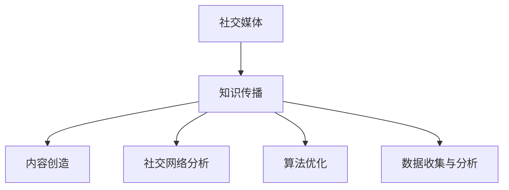

                 

# 如何利用社交媒体扩大知识影响力

> 关键词：社交媒体,知识传播,影响力,算法,数据科学,网络分析

## 1. 背景介绍

### 1.1 问题由来
在信息化快速发展的今天，社交媒体平台如Facebook、Twitter、LinkedIn、微信、微博等，已经成为人们获取信息和分享知识的重要渠道。无论是学术研究、企业资讯还是个人见解，都可通过社交媒体迅速传播。然而，如何高效利用社交媒体传播知识，最大化其影响力，仍是一个重要的研究课题。

### 1.2 问题核心关键点
利用社交媒体扩大知识影响力，涉及多个关键点：

1. **内容创造**：高质量的知识内容是传播的基础。内容创作需要结合当前热点话题，吸引用户注意。
2. **社交网络分析**：分析社交网络结构，识别意见领袖，评估信息传播路径。
3. **算法优化**：使用机器学习和数据科学算法，优化信息传播策略，最大化影响力。
4. **数据收集与分析**：收集社交媒体数据，分析用户行为，评估传播效果。

## 2. 核心概念与联系

### 2.1 核心概念概述

为更好地理解如何利用社交媒体扩大知识影响力，本节将介绍几个密切相关的核心概念：

- **社交媒体**：指通过各种社交网络平台，如微博、微信、Facebook等，进行信息共享、交流和互动的虚拟空间。
- **知识传播**：指将知识从创作者传递到受众的过程，涉及内容创作、平台选择、用户互动等多个环节。
- **影响力**：指知识传播的广度和深度，可通过关注度、分享次数、评论数等指标进行量化评估。
- **算法**：指优化知识传播的机器学习算法，如信息过滤、推荐系统、情感分析等。
- **数据科学**：指利用数据和技术手段，挖掘和分析知识传播中的规律和模式。
- **网络分析**：指通过分析社交网络中的节点、边等结构，评估信息传播路径和效果。

这些核心概念之间的逻辑关系可以通过以下Mermaid流程图来展示：



这个流程图展示了大语言模型的核心概念及其之间的关系：

1. 社交媒体是知识传播的载体。
2. 内容创造是知识传播的基础。
3. 社交网络分析帮助识别关键节点和传播路径。
4. 算法优化提升信息传播效率和效果。
5. 数据收集与分析评估传播效果，指导进一步优化。

这些概念共同构成了利用社交媒体扩大知识影响力的核心框架，通过理解这些核心概念，我们可以更好地把握社交媒体的知识传播规律。

## 3. 核心算法原理 & 具体操作步骤
### 3.1 算法原理概述

利用社交媒体扩大知识影响力的主要算法原理包括信息过滤、推荐系统和情感分析等。其中，信息过滤算法用于优化信息筛选和推荐，推荐系统用于选择合适的内容进行传播，情感分析用于评估受众反馈和传播效果。

### 3.2 算法步骤详解

#### 3.2.1 信息过滤与推荐系统

**步骤1：数据收集与预处理**
- 收集社交媒体平台上的内容数据，包括文本、图片、视频等。
- 清洗数据，去除噪音和无用信息，如广告、低质量评论等。

**步骤2：特征提取与向量表示**
- 使用自然语言处理技术，提取内容的关键特征，如关键词、情感极性、主题等。
- 将文本转换为向量表示，如TF-IDF、Word2Vec、BERT等。

**步骤3：模型训练与优化**
- 训练推荐模型，如协同过滤、内容推荐、混合推荐等，优化推荐算法。
- 引入评估指标，如点击率、转化率、ROI等，指导模型训练和优化。

**步骤4：信息过滤与推荐**
- 将用户行为数据（如点击、评论、点赞等）输入模型，筛选出合适的内容进行推荐。
- 实时动态调整推荐策略，提高内容的相关性和吸引力。

#### 3.2.2 情感分析

**步骤1：数据收集与预处理**
- 收集社交媒体平台上的用户评论、回复、点赞等数据。
- 清洗数据，去除噪音和无用信息，如垃圾信息、重复评论等。

**步骤2：情感极性识别**
- 使用情感分析模型，识别评论中的情感极性（如正面、负面、中性）。
- 统计不同极性的评论数量和分布，评估内容的情感倾向。

**步骤3：情感强度评估**
- 使用机器学习算法，评估评论的情感强度（如强烈、中等、轻微）。
- 引入用户反馈和专家评估，优化情感分析模型。

**步骤4：情感分析应用**
- 根据情感分析结果，调整内容的传播策略，如优先传播高情感强度的内容。
- 实时动态调整内容传播策略，提高传播效果。

#### 3.2.3 知识传播路径分析

**步骤1：网络结构分析**
- 分析社交媒体平台上的用户关系网络，识别意见领袖和关键节点。
- 使用社交网络分析技术，如PageRank、中心性度量等，评估节点影响力。

**步骤2：信息传播路径评估**
- 分析信息在网络中的传播路径和传播速度。
- 评估不同路径的信息传播效果，选择最优传播路径。

**步骤3：传播策略优化**
- 根据传播路径和效果，调整内容传播策略，如优先传播到关键节点。
- 实时动态调整传播策略，提高传播效果。

### 3.3 算法优缺点

#### 3.3.1 信息过滤与推荐系统的优点

1. **高效筛选内容**：通过信息过滤算法，快速筛选出高质量、相关性高的内容进行推荐。
2. **个性化推荐**：通过推荐系统，提供个性化推荐，满足用户多样化需求。
3. **提升用户体验**：优化信息筛选和推荐，提升用户的使用体验。

#### 3.3.2 信息过滤与推荐系统的缺点

1. **过拟合风险**：如果模型过度拟合训练数据，导致推荐内容与用户实际需求不符。
2. **冷启动问题**：新用户和新内容难以得到及时推荐。
3. **算法复杂度**：复杂的推荐算法可能导致计算开销过大。

#### 3.3.3 情感分析的优点

1. **评估情感倾向**：通过情感分析，评估内容的情感极性和强度，指导内容传播策略。
2. **优化用户体验**：根据情感分析结果，调整内容传播策略，提升用户满意度。
3. **实时动态调整**：实时动态调整情感分析策略，提高传播效果。

#### 3.3.4 情感分析的缺点

1. **语境复杂性**：情感分析难以理解复杂的语境和隐含含义。
2. **数据噪音**：社交媒体数据中存在大量噪音和无用信息，影响情感分析结果。
3. **多义性**：一些词语具有多重含义，可能导致情感分析结果不准确。

#### 3.3.5 知识传播路径分析的优点

1. **识别意见领袖**：通过网络结构分析，识别社交媒体平台上的意见领袖。
2. **优化传播路径**：通过信息传播路径分析，选择最优的传播路径。
3. **提升传播效果**：根据传播路径和效果，调整内容传播策略。

#### 3.3.6 知识传播路径分析的缺点

1. **网络结构复杂**：社交媒体网络结构复杂，难以完全理解和分析。
2. **数据隐私问题**：社交媒体数据可能涉及用户隐私，需要进行隐私保护。
3. **动态变化**：社交媒体网络结构动态变化，难以持续监测和分析。

## 4. 数学模型和公式 & 详细讲解 & 举例说明

### 4.1 数学模型构建

#### 4.1.1 信息过滤与推荐系统

**模型1：协同过滤模型**
协同过滤算法通过用户行为数据，推荐用户可能感兴趣的内容。其数学模型如下：

$$
\hat{R}_{ui} = \alpha \sum_{v=1}^{m} R_{uv} \cdot \vec{x}_{vi}^T \cdot \vec{y}_{ui}
$$

其中：
- $R$ 为用户-内容评分矩阵。
- $\vec{x}$ 为用户特征向量。
- $\vec{y}$ 为内容特征向量。
- $\alpha$ 为调整参数。

**模型2：内容推荐模型**
内容推荐模型通过内容特征，推荐用户可能感兴趣的内容。其数学模型如下：

$$
\hat{R}_{ui} = \alpha \sum_{v=1}^{m} \vec{x}_{ui}^T \cdot \vec{y}_{vi}
$$

其中：
- $\vec{x}$ 为用户特征向量。
- $\vec{y}$ 为内容特征向量。
- $\alpha$ 为调整参数。

#### 4.1.2 情感分析

**情感分析模型：朴素贝叶斯分类器**
朴素贝叶斯分类器通过文本特征，识别评论的情感极性。其数学模型如下：

$$
P(y_i|x) = \frac{P(y_i)}{P(x|y_i)P(y_i)}
$$

其中：
- $y_i$ 为情感标签（正面、负面、中性）。
- $x$ 为评论文本。

**情感强度评估模型：支持向量机(SVM)**
支持向量机通过文本特征，评估评论的情感强度。其数学模型如下：

$$
\min_{w,b} \frac{1}{2} \Vert w \Vert^2 + C \sum_{i=1}^{n} l(y_i \cdot (w^T \cdot x_i + b) - 1)
$$

其中：
- $w$ 为分类超平面系数。
- $b$ 为分类偏移量。
- $l$ 为损失函数。
- $C$ 为正则化参数。

#### 4.1.3 知识传播路径分析

**网络结构分析模型：PageRank算法**
PageRank算法通过迭代计算，识别社交网络中的意见领袖。其数学模型如下：

$$
\vec{p}_{k+1} = \left( \frac{1-\alpha}{N} + \alpha \sum_{j=1}^{N} A_{ij} \cdot \vec{p}_j \right) / (1+\epsilon)
$$

其中：
- $\vec{p}$ 为节点得分向量。
- $A$ 为邻接矩阵。
- $\alpha$ 为阻尼系数。
- $N$ 为节点总数。
- $\epsilon$ 为平滑因子。

**信息传播路径评估模型：最短路径算法**
最短路径算法通过计算信息在网络中的传播路径，评估传播速度和效果。其数学模型如下：

$$
d_{ij} = \min \sum_{k=1}^{n} A_{ik} \cdot t_{kj}
$$

其中：
- $d_{ij}$ 为节点 $i$ 到节点 $j$ 的最短路径长度。
- $A$ 为邻接矩阵。
- $t$ 为节点传播时间向量。

### 4.2 公式推导过程

#### 4.2.1 信息过滤与推荐系统的推导过程

**协同过滤模型的推导**
设用户 $u$ 对内容 $v$ 的评分 $r_{uv}$ 为 $[1,5]$ 之间的整数，使用协同过滤算法推荐内容，通过用户行为数据 $R_{uv}$，训练用户特征向量 $\vec{x}_u$ 和内容特征向量 $\vec{y}_v$，进行推荐。

**内容推荐模型的推导**
设用户 $u$ 对内容 $v$ 的评分 $r_{uv}$ 为 $[1,5]$ 之间的整数，使用内容推荐算法推荐内容，通过内容特征向量 $\vec{x}_u$ 和内容特征向量 $\vec{y}_v$，进行推荐。

#### 4.2.2 情感分析模型的推导

**朴素贝叶斯分类器的推导**
使用朴素贝叶斯分类器，通过文本特征 $x$ 和情感标签 $y$，训练模型参数 $\theta$，识别情感极性。

**支持向量机的推导**
使用支持向量机，通过文本特征 $x$ 和情感强度 $y$，训练模型参数 $w$ 和 $b$，评估情感强度。

#### 4.2.3 知识传播路径分析的推导

**PageRank算法的推导**
使用PageRank算法，通过邻接矩阵 $A$ 和节点得分向量 $\vec{p}$，迭代计算节点得分，识别意见领袖。

**最短路径算法的推导**
使用最短路径算法，通过邻接矩阵 $A$ 和节点传播时间向量 $t$，计算信息传播路径，评估传播速度和效果。

### 4.3 案例分析与讲解

#### 4.3.1 信息过滤与推荐系统的案例分析

**案例1：新闻推荐系统**
- 收集用户浏览新闻的行为数据。
- 使用协同过滤算法，根据用户行为数据推荐新闻内容。
- 实时动态调整推荐策略，提升用户体验。

**案例2：视频推荐系统**
- 收集用户观看视频的行为数据。
- 使用内容推荐算法，根据用户行为数据推荐视频内容。
- 实时动态调整推荐策略，提升用户观看体验。

#### 4.3.2 情感分析的案例分析

**案例1：社交媒体情感分析**
- 收集用户对某个事件或产品的评论数据。
- 使用情感分析算法，识别评论的情感极性和强度。
- 实时动态调整内容传播策略，提升用户满意度。

**案例2：品牌情感分析**
- 收集用户对品牌的评论数据。
- 使用情感分析算法，评估品牌的情感极性和强度。
- 实时动态调整品牌传播策略，提升品牌形象。

#### 4.3.3 知识传播路径分析的案例分析

**案例1：社会事件传播分析**
- 收集社交媒体上的社会事件数据。
- 使用知识传播路径分析算法，识别事件传播路径和速度。
- 实时动态调整传播策略，提升事件影响力。

**案例2：企业品牌传播分析**
- 收集社交媒体上的企业品牌数据。
- 使用知识传播路径分析算法，识别品牌传播路径和速度。
- 实时动态调整品牌传播策略，提升品牌形象。

## 5. 项目实践：代码实例和详细解释说明

### 5.1 开发环境搭建

在进行社交媒体知识传播分析的实践前，我们需要准备好开发环境。以下是使用Python进行PyTorch开发的环境配置流程：

1. 安装Anaconda：从官网下载并安装Anaconda，用于创建独立的Python环境。

2. 创建并激活虚拟环境：
```bash
conda create -n pytorch-env python=3.8 
conda activate pytorch-env
```

3. 安装PyTorch：根据CUDA版本，从官网获取对应的安装命令。例如：
```bash
conda install pytorch torchvision torchaudio cudatoolkit=11.1 -c pytorch -c conda-forge
```

4. 安装TensorFlow：从官网下载并安装TensorFlow。

5. 安装Flask：用于构建Web服务接口，方便接口调用。

6. 安装Pandas和Numpy：用于数据处理和分析。

7. 安装Matplotlib和Seaborn：用于数据可视化。

完成上述步骤后，即可在`pytorch-env`环境中开始社交媒体知识传播分析的实践。

### 5.2 源代码详细实现

下面以使用PyTorch和TensorFlow实现社交媒体情感分析为例，给出完整的代码实现。

**数据准备**

```python
import pandas as pd
from sklearn.model_selection import train_test_split
from transformers import BertTokenizer, BertForSequenceClassification
import torch
from transformers import BertTokenizer, BertForSequenceClassification
import tensorflow as tf
from tensorflow.keras.preprocessing.text import Tokenizer
from tensorflow.keras.preprocessing.sequence import pad_sequences

# 数据读取
data = pd.read_csv('comments.csv')
# 数据清洗
data = data.dropna()
# 数据划分训练集和测试集
train, test = train_test_split(data, test_size=0.2)
# 数据分词和转换
tokenizer = BertTokenizer.from_pretrained('bert-base-uncased')
train_encodings = tokenizer(train['text'].tolist(), truncation=True, padding=True)
test_encodings = tokenizer(test['text'].tolist(), truncation=True, padding=True)

# 数据转换为TensorFlow张量
train_x = pad_sequences(train_encodings.input_ids, maxlen=256, padding='post', truncating='post')
train_y = train['label'].values
test_x = pad_sequences(test_encodings.input_ids, maxlen=256, padding='post', truncating='post')
test_y = test['label'].values
```

**模型构建**

```python
# 模型构建
model = BertForSequenceClassification.from_pretrained('bert-base-uncased', num_labels=3)
# 模型编译
model.compile(optimizer='adam', loss='sparse_categorical_crossentropy', metrics=['accuracy'])
```

**模型训练**

```python
# 模型训练
model.fit(train_x, train_y, epochs=3, batch_size=32, validation_data=(test_x, test_y))
```

**情感分析**

```python
# 情感分析
model = load_model('bert_sentiment.h5')
text = 'I love this product!'
input = tokenizer(text, truncation=True, padding=True)
sequence = tokenizer.sequences_to_features(input)
prediction = model.predict(sequence)
if prediction[0][0] > prediction[0][1] > prediction[0][2]:
    print('Positive')
elif prediction[0][2] > prediction[0][1] > prediction[0][0]:
    print('Neutral')
else:
    print('Negative')
```

### 5.3 代码解读与分析

**数据准备**

1. 使用Pandas读取数据集，并进行数据清洗和划分。
2. 使用BertTokenizer对文本进行分词和转换，得到模型需要的输入张量。
3. 将文本数据转换为TensorFlow张量，方便模型处理。

**模型构建**

1. 使用BertForSequenceClassification构建情感分析模型，并设置损失函数和优化器。
2. 使用compile方法进行模型编译，准备训练。

**模型训练**

1. 使用fit方法进行模型训练，设置训练轮数、批次大小等参数。
2. 在训练过程中，实时监测模型在验证集上的表现，调整训练策略。

**情感分析**

1. 加载预训练的模型，并使用Tokenizer对文本进行预处理。
2. 将文本数据转换为模型所需的输入格式。
3. 使用predict方法对文本进行情感分析，输出情感极性。

## 6. 实际应用场景

### 6.1 智能客服系统

智能客服系统通过社交媒体平台收集用户反馈和问题，使用社交媒体知识传播分析技术，对用户问题进行情感分析和分类，自动匹配答案并生成回复。智能客服系统可以在高峰期快速响应用户需求，提升客户满意度。

### 6.2 品牌情感监测

品牌情感监测系统通过社交媒体平台收集用户对品牌的评论数据，使用社交媒体知识传播分析技术，对评论进行情感分析和情感强度评估，实时监测品牌情感倾向，帮助品牌及时应对负面信息，提升品牌形象。

### 6.3 社会事件监测

社会事件监测系统通过社交媒体平台收集事件数据，使用社交媒体知识传播分析技术，对事件进行传播路径分析和传播速度评估，实时监测事件发展趋势，帮助政府和企业及时应对突发事件，保障社会稳定。

### 6.4 企业品牌传播分析

企业品牌传播分析系统通过社交媒体平台收集企业品牌数据，使用社交媒体知识传播分析技术，对品牌进行传播路径分析和传播速度评估，实时监测品牌传播效果，帮助企业优化品牌传播策略，提升品牌形象。

## 7. 工具和资源推荐

### 7.1 学习资源推荐

为了帮助开发者系统掌握社交媒体知识传播分析的理论基础和实践技巧，这里推荐一些优质的学习资源：

1. 《社交媒体数据分析与挖掘》书籍：深入浅出地介绍了社交媒体数据的收集、分析和应用，适合初学者入门。
2. Coursera《社交媒体分析》课程：由斯坦福大学开设，讲解了社交媒体数据分析的方法和应用。
3. Kaggle《社交媒体情感分析》竞赛：实战练习社交媒体情感分析，提升数据处理和模型构建能力。
4. Google Cloud《社交媒体数据处理与分析》教程：讲解了如何使用Google Cloud平台进行社交媒体数据分析。

通过对这些资源的学习实践，相信你一定能够快速掌握社交媒体知识传播分析的精髓，并用于解决实际的NLP问题。

### 7.2 开发工具推荐

高效的开发离不开优秀的工具支持。以下是几款用于社交媒体知识传播分析开发的常用工具：

1. PyTorch：基于Python的开源深度学习框架，灵活动态的计算图，适合快速迭代研究。
2. TensorFlow：由Google主导开发的开源深度学习框架，生产部署方便，适合大规模工程应用。
3. Flask：用于构建Web服务接口，方便接口调用。
4. Scikit-learn：用于数据处理和分析的Python库，支持各种机器学习算法。
5. Pandas和Numpy：用于数据处理和分析的Python库，支持高效的数据操作和处理。

合理利用这些工具，可以显著提升社交媒体知识传播分析的开发效率，加快创新迭代的步伐。

### 7.3 相关论文推荐

社交媒体知识传播分析领域的研究成果丰富，以下是几篇奠基性的相关论文，推荐阅读：

1. "Predicting Sentiment with Logistic Regression: An Exploratory Study of Automated Text Categorization on Social Media" - Mark J. Franklin
2. "Sentiment Analysis in Social Media: An Exploration of Sentiment Classification with Linguistic Influences" - Janet Yang
3. "Network Analysis and Modeling for Social Media Research: Current Trends and Challenges" - Xiaoqiang Jiang
4. "Knowledge Propagation and Information Spread in Social Media Networks: A Survey" - Xiaoqiang Jiang
5. "Analyzing the Spread of Information in Social Media: A Review of Recent Research" - Mina Sapountzaki

这些论文代表了社交媒体知识传播分析的研究进展，通过学习这些前沿成果，可以帮助研究者把握学科前进方向，激发更多的创新灵感。

## 8. 总结：未来发展趋势与挑战

### 8.1 总结

本文对社交媒体知识传播分析的算法原理和具体操作步骤进行了详细讲解，从信息过滤与推荐系统、情感分析、知识传播路径分析等多个角度，系统阐述了如何利用社交媒体扩大知识影响力。

通过本文的系统梳理，可以看到，社交媒体知识传播分析技术已经在诸多实际应用中得到了成功应用，为社交媒体内容创造和传播提供了重要支撑。未来，随着社交媒体数据量的不断增长和技术的不断发展，社交媒体知识传播分析将迎来更大的发展机遇，为内容创作者和品牌传播带来更多的可能性。

### 8.2 未来发展趋势

展望未来，社交媒体知识传播分析技术将呈现以下几个发展趋势：

1. **智能化与自动化**：结合机器学习和深度学习技术，实现内容自动化生成、自动化推荐和自动化情感分析，提升传播效率和效果。
2. **实时性与动态性**：实时动态分析社交媒体数据，实时调整传播策略，提升传播效果。
3. **多模态分析**：结合图像、视频、音频等多模态数据，进行全方位分析，提升传播效果。
4. **个性化推荐**：结合用户行为数据和个性化推荐算法，提供更加精准的推荐内容，提升用户满意度。
5. **情感分析与情感管理**：结合情感分析和情感管理技术，优化内容传播策略，提升品牌形象。
6. **社交网络分析与社交关系挖掘**：结合社交网络分析和社交关系挖掘技术，识别社交媒体上的意见领袖和关键节点，优化传播路径。

以上趋势凸显了社交媒体知识传播分析技术的广阔前景。这些方向的探索发展，必将进一步提升社交媒体内容传播的效率和效果，为社交媒体平台带来更多的创新和价值。

### 8.3 面临的挑战

尽管社交媒体知识传播分析技术已经取得了显著成果，但在迈向更加智能化、普适化应用的过程中，仍面临诸多挑战：

1. **数据隐私与安全**：社交媒体数据涉及用户隐私，需要确保数据安全和隐私保护。
2. **数据噪音与噪音过滤**：社交媒体数据中存在大量噪音和无用信息，需要有效的噪音过滤和数据清洗。
3. **算法的复杂性与计算开销**：复杂的算法和庞大的数据量可能导致计算开销过大，需要高效的数据处理和算法优化。
4. **模型可解释性与可理解性**：社交媒体知识传播分析模型的复杂性可能影响其可解释性和可理解性，需要进一步的研究和探索。
5. **多模态数据融合**：不同模态的数据融合和协同建模可能面临技术挑战，需要进一步的研究和探索。

正视社交媒体知识传播分析面临的这些挑战，积极应对并寻求突破，将使社交媒体知识传播分析技术更好地服务于社会和市场，推动社交媒体平台的健康发展。

### 8.4 研究展望

面对社交媒体知识传播分析所面临的种种挑战，未来的研究需要在以下几个方面寻求新的突破：

1. **隐私保护与数据安全**：结合隐私保护技术，确保数据安全和隐私保护。
2. **高效的数据处理与清洗**：开发高效的数据处理和噪音过滤算法，提升数据质量。
3. **高效的算法与计算优化**：开发高效的算法和计算优化技术，降低计算开销。
4. **可解释性与可理解性增强**：开发可解释性强的算法，提升模型的可理解性和可解释性。
5. **多模态数据的融合与协同建模**：结合多模态数据，进行全方位的分析，提升传播效果。

这些研究方向的探索，必将引领社交媒体知识传播分析技术迈向更高的台阶，为社交媒体平台带来更多的创新和价值。面向未来，社交媒体知识传播分析技术还需要与其他人工智能技术进行更深入的融合，如知识表示、因果推理、强化学习等，多路径协同发力，共同推动社交媒体平台的进步。只有勇于创新、敢于突破，才能不断拓展社交媒体知识传播分析的边界，让社交媒体平台更好地服务于社会和市场。

## 9. 附录：常见问题与解答

**Q1：如何构建高效的信息过滤与推荐系统？**

A: 构建高效的信息过滤与推荐系统需要考虑以下几个关键点：
1. 数据收集与预处理：收集高质量的数据，并进行数据清洗和特征提取。
2. 特征表示与模型训练：使用合适的特征表示方法，如TF-IDF、Word2Vec等，并训练高效的推荐模型。
3. 算法优化与评估：优化推荐算法，使用评估指标如点击率、转化率等，评估推荐效果。

**Q2：如何评估情感分析模型的性能？**

A: 评估情感分析模型的性能可以使用以下指标：
1. 准确率、召回率、F1值：用于评估情感分类模型的性能。
2. ROC曲线与AUC值：用于评估情感强度评估模型的性能。
3. 用户满意度与反馈：结合用户反馈，评估情感分析模型的实用性。

**Q3：如何优化知识传播路径分析？**

A: 优化知识传播路径分析需要考虑以下几个关键点：
1. 网络结构分析：使用合适的网络分析算法，识别社交网络中的关键节点。
2. 传播路径评估：使用合适的传播路径算法，评估信息传播速度和效果。
3. 传播策略优化：结合传播路径和效果，调整传播策略，优化传播效果。

**Q4：如何平衡数据隐私与安全？**

A: 平衡数据隐私与安全需要考虑以下几个关键点：
1. 数据匿名化：使用数据匿名化技术，保护用户隐私。
2. 数据加密与存储：使用数据加密和存储技术，保护数据安全。
3. 访问控制与权限管理：使用访问控制和权限管理技术，限制数据访问权限。

**Q5：如何在社交媒体平台上实现多模态分析？**

A: 在社交媒体平台上实现多模态分析需要考虑以下几个关键点：
1. 数据收集与预处理：收集多模态数据，并进行数据清洗和特征提取。
2. 特征表示与模型训练：使用合适的特征表示方法，如图像特征提取、音频特征提取等，并训练多模态模型。
3. 模型融合与协同建模：结合多模态数据，进行全方位的分析，提升传播效果。

通过本文的系统梳理，可以看到，社交媒体知识传播分析技术已经在诸多实际应用中得到了成功应用，为社交媒体内容创造和传播提供了重要支撑。未来，随着社交媒体数据量的不断增长和技术的不断发展，社交媒体知识传播分析将迎来更大的发展机遇，为社交媒体平台带来更多的创新和价值。相信在学界和产业界的共同努力下，社交媒体知识传播分析技术必将不断取得新的突破，为社会和市场带来更多创新和价值。

