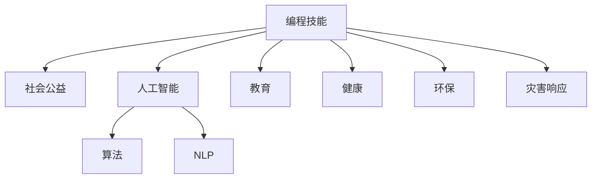

                 

# 如何将编程技能应用于社会公益

> 关键词：编程, 社会公益, 算法, 人工智能, 教育, 健康

## 1. 背景介绍

在数字化时代，编程技能已经成为一项至关重要的能力，不仅在科技、商业领域广泛应用，也开始向社会公益领域渗透。借助编程技能，可以在多个方面推动社会公益事业的发展，帮助解决一些传统方法难以应对的社会问题。本文将探讨如何利用编程技能，特别是基于人工智能(AI)的编程技能，来推动社会公益的发展。

## 2. 核心概念与联系

### 2.1 核心概念概述

为更好地理解如何将编程技能应用于社会公益，本节将介绍几个密切相关的核心概念：

- **编程技能**：指掌握编程语言和相关软件工具的能力，包括算法设计、数据结构、软件开发流程等。
- **社会公益**：指通过个人或组织的努力，改善社会问题，促进社会公平和福祉的活动，包括教育、健康、环保、灾害响应等。
- **人工智能(AI)**：指使计算机系统模拟人类智能行为的技术，涵盖机器学习、深度学习、自然语言处理等子领域。
- **算法**：指解决特定问题的一组规则或步骤，用于指导计算机系统进行计算、分析、推理等。
- **自然语言处理(NLP)**：指使计算机理解和生成人类语言的技术，常用于聊天机器人、文本分类、情感分析等任务。

这些核心概念之间的逻辑关系可以通过以下Mermaid流程图来展示：



这个流程图展示了几大核心概念之间的联系：

1. 编程技能是实现人工智能算法和自然语言处理的核心。
2. 人工智能和自然语言处理技术，特别是基于编程实现的技术，能够提升教育、健康、环保、灾害响应等领域的效率和效果。
3. 编程技能结合人工智能和自然语言处理，可以开发出解决社会公益问题的创新解决方案。

## 3. 核心算法原理 & 具体操作步骤
### 3.1 算法原理概述

编程技能在社会公益中的应用，主要体现在两个层面：算法设计及其应用实践。以下是几个关键原理：

- **数据驱动**：社会公益问题的解决，通常依赖于大量数据的收集、分析和建模。编程技能能够有效处理和分析数据，提取有用的信息。
- **算法优化**：针对特定公益问题的算法设计，需要高效的算法以确保在资源有限的情况下，达到最优的解决方案。
- **系统集成**：将各种算法和工具集成到一个系统中，能够实现复杂公益问题的综合治理。

### 3.2 算法步骤详解

基于编程技能和社会公益的应用，我们可以从以下几个步骤入手：

**Step 1: 问题识别与数据收集**
- 明确需要解决的社会公益问题，如教育资源分配不均、健康信息不对称、环保意识不足等。
- 收集相关数据，包括定量数据（如统计数据、社会调查结果）和定性数据（如用户反馈、新闻报道）。

**Step 2: 数据预处理与分析**
- 使用编程技能进行数据清洗、格式转换、去噪等预处理工作。
- 应用统计分析、机器学习等算法对数据进行分析，发现问题的根源和关键因素。

**Step 3: 算法设计与实现**
- 根据分析结果，设计相应的算法或模型，如分类、聚类、预测模型等。
- 实现算法，使用编程语言（如Python、R、Java等）和相关的AI库（如TensorFlow、PyTorch等）。
- 优化算法性能，确保其在实际应用中高效、准确。

**Step 4: 系统集成与测试**
- 将算法集成到系统中，如开发一个Web应用、移动应用或API接口。
- 测试系统的功能和性能，确保其稳定性、安全性、易用性。

**Step 5: 部署与应用**
- 将系统部署到目标环境中，如学校、医院、社区等。
- 进行用户体验测试，收集反馈，不断优化系统。
- 持续监控系统运行状态，及时修复bug，更新算法。

### 3.3 算法优缺点

将编程技能应用于社会公益的算法，具有以下优点：

- **高效性**：编程技能能够快速、准确地处理和分析大量数据，提升决策的效率和准确性。
- **灵活性**：编程技能可以实现各种算法和模型，适应不同的公益问题。
- **可扩展性**：编程技能可以轻松地集成和扩展新的算法和功能。

然而，也存在一些缺点：

- **技术门槛高**：需要一定的编程和算法知识，对非专业人士有一定门槛。
- **资源需求高**：数据收集、算法设计、系统集成等环节，都需要大量的计算资源和数据。
- **复杂度高**：公益问题的复杂性和多样性，使得算法设计和实现往往较为复杂。

### 3.4 算法应用领域

基于编程技能和社会公益的算法，已经在多个领域得到了应用：

- **教育领域**：编程技能用于开发教育资源推荐系统、智能辅导软件等，帮助学生获取个性化学习资源，提高学习效率。
- **健康领域**：使用编程技能开发疾病预测模型、医疗影像分析工具等，提高医疗诊断的准确性和效率。
- **环保领域**：编程技能用于分析环境数据、构建气候变化预测模型，推动环保政策的制定和执行。
- **灾害响应**：编程技能开发地震预测模型、灾害应急系统等，提高灾害应对的及时性和准确性。

## 4. 数学模型和公式 & 详细讲解 & 举例说明
### 4.1 数学模型构建

在社会公益问题中，常用的数学模型包括分类、聚类、回归等。以疾病预测模型为例，可以构建以下数学模型：

- **分类模型**：使用逻辑回归、支持向量机等算法，对病人是否患有某种疾病进行分类。
- **聚类模型**：使用K-means、层次聚类等算法，将病人分为不同的风险群体。
- **回归模型**：使用线性回归、决策树等算法，预测病人的疾病严重程度或治疗效果。

### 4.2 公式推导过程

以逻辑回归模型为例，其公式推导如下：

$$
P(Y=1|X;\theta) = \sigma(\theta^TX)
$$

其中 $Y$ 为疾病标签，$X$ 为病人的特征向量，$\theta$ 为模型参数，$\sigma$ 为Sigmoid函数。

### 4.3 案例分析与讲解

假设我们有一组病人的特征数据，包括年龄、性别、病史等，使用逻辑回归模型对疾病进行分类。数据集分为训练集和测试集，使用交叉验证等方法进行模型训练和评估。模型训练后，对新病人进行分类预测，得到准确率和召回率等指标。

## 5. 项目实践：代码实例和详细解释说明
### 5.1 开发环境搭建

在进行编程技能应用于社会公益的项目实践前，需要准备好开发环境。以下是使用Python进行开发的环境配置流程：

1. 安装Python：从官网下载并安装Python，选择版本3.x以上。
2. 安装Python包管理工具pip，使用以下命令：
   ```
   python3 -m pip install pip --upgrade
   ```
3. 安装编程工具和AI库，如Jupyter Notebook、TensorFlow、PyTorch等，使用以下命令：
   ```
   pip install jupyter notebook tensorflow pytorch
   ```

完成上述步骤后，即可在Python环境中开始项目实践。

### 5.2 源代码详细实现

以下是一个简单的健康信息分析项目的代码实现，用于分析病人的疾病风险。

首先，定义数据处理函数：

```python
import pandas as pd

def load_data(filename):
    data = pd.read_csv(filename)
    return data
```

然后，定义逻辑回归模型：

```python
import numpy as np
from sklearn.linear_model import LogisticRegression
from sklearn.metrics import accuracy_score

class LogisticRegressionModel:
    def __init__(self):
        self.model = LogisticRegression()
    
    def train(self, X, y):
        self.model.fit(X, y)
    
    def predict(self, X):
        return self.model.predict(X)
    
    def evaluate(self, X, y):
        y_pred = self.predict(X)
        accuracy = accuracy_score(y, y_pred)
        return accuracy
```

接着，实现主函数：

```python
if __name__ == "__main__":
    data = load_data("health_data.csv")
    X = data.drop("disease", axis=1)
    y = data["disease"]
    
    model = LogisticRegressionModel()
    model.train(X, y)
    accuracy = model.evaluate(X, y)
    print("Accuracy: {:.2f}%".format(accuracy * 100))
```

在实际应用中，还需要对数据进行预处理、模型调参、特征选择等优化工作，以提升模型的性能。

### 5.3 代码解读与分析

以下是代码实现的关键解释：

**load_data函数**：
- 使用pandas库读取CSV文件，加载健康数据集。

**LogisticRegressionModel类**：
- 定义逻辑回归模型，包括训练、预测和评估等方法。

**主函数**：
- 加载数据集，去除目标变量，将特征和标签分离。
- 实例化逻辑回归模型，训练模型并评估其性能。
- 打印出模型的准确率。

可以看到，Python结合了pandas、numpy、scikit-learn等库，使得数据处理、模型训练和评估变得简单高效。

## 6. 实际应用场景
### 6.1 教育资源推荐

编程技能可以用于开发教育资源推荐系统，帮助学生获取最适合的学习资源。例如，根据学生的学习进度、兴趣、成绩等数据，推荐相应的学习材料、在线课程、习题等。

在实际应用中，可以使用协同过滤、内容推荐等算法，对学生和课程进行匹配，实现个性化的资源推荐。这不仅能够提高学生的学习效率，还能减轻教师的工作负担，使教育资源更均衡地分配。

### 6.2 健康风险预测

使用编程技能，可以开发健康风险预测模型，提前发现潜在的健康问题。例如，根据病人的病史、生活习惯、体检数据等，预测其患某种疾病的概率。

在实际应用中，可以使用分类算法（如逻辑回归、决策树）、聚类算法（如K-means）等，对健康数据进行建模，帮助医生和病人进行健康管理。这有助于提高医疗服务的效率和质量，降低医疗成本。

### 6.3 环保数据监测

编程技能可以用于分析环保数据，预测环境变化趋势。例如，通过收集空气质量、水质、垃圾量等数据，构建环境监测模型。

在实际应用中，可以使用回归算法（如线性回归、时间序列分析）、时序预测等方法，对环境数据进行建模，帮助政府和企业制定环保政策。这有助于提升公众环保意识，减少环境污染。

### 6.4 灾害响应预警

使用编程技能，可以开发灾害预警系统，提前发现潜在的灾害风险。例如，根据历史气象数据、地质数据等，构建地震、洪水等自然灾害的预警模型。

在实际应用中，可以使用分类算法（如支持向量机、随机森林）、聚类算法（如K-means）等，对灾害数据进行建模，帮助政府和公众提前应对灾害。这有助于减少灾害损失，保障人民生命财产安全。

## 7. 工具和资源推荐
### 7.1 学习资源推荐

为了帮助开发者系统掌握编程技能在社会公益中的应用，这里推荐一些优质的学习资源：

1. **Kaggle**：一个数据科学竞赛平台，包含大量公益相关的数据集和竞赛项目，适合练习和实践。
2. **Coursera**：提供多种AI和编程课程，包括机器学习、深度学习、自然语言处理等，适合理论学习。
3. **edX**：提供多种公益相关的课程，包括社会工作、健康管理、环境保护等，适合了解公益领域的实际应用。
4. **GitHub**：一个代码托管平台，包含大量开源公益项目，适合学习和借鉴。
5. **Stack Overflow**：一个编程问答社区，包含大量编程实践和技术问题的解决方案，适合技术交流。

通过这些资源的学习实践，相信你一定能够快速掌握编程技能在社会公益中的应用，并用于解决实际的公益问题。

### 7.2 开发工具推荐

高效的开发离不开优秀的工具支持。以下是几款用于公益项目开发的常用工具：

1. **Jupyter Notebook**：一个交互式编程环境，适合进行数据分析和模型开发。
2. **TensorFlow**：一个深度学习框架，适合进行复杂的模型训练和推理。
3. **PyTorch**：一个深度学习框架，适合进行动态图计算和模型部署。
4. **Python**：一个高级编程语言，支持多种AI库和工具，适合进行编程技能的应用开发。
5. **Git**：一个版本控制系统，适合进行代码管理和团队协作。

合理利用这些工具，可以显著提升公益项目的开发效率，加快创新迭代的步伐。

### 7.3 相关论文推荐

公益问题的解决依赖于广泛的理论研究和实践探索，以下是几篇奠基性的相关论文，推荐阅读：

1. **The Data Revolution**：Girardeau-Panabaccala和O'Sullivan的文章，探讨数据科学在公益领域的应用。
2. **Machine Learning in Health**：Erickson和Schuetz的文章，介绍机器学习在医疗健康中的应用。
3. **AI for Good**：这是一本论文集，包含多个AI在公益领域的成功案例。
4. **Artificial Intelligence for Social Good**：这是一本书籍，详细介绍AI在社会公益领域的应用。
5. **Programming for Social Good**：这是一本书籍，涵盖编程技能在公益领域的应用，包括数据科学、机器学习、软件开发等。

这些论文和书籍代表了大公益问题的研究进展，能够帮助研究者理解技术应用中的挑战和机遇。

## 8. 总结：未来发展趋势与挑战
### 8.1 总结

本文对编程技能在社会公益中的应用进行了全面系统的介绍。首先阐述了编程技能、社会公益、人工智能等概念之间的联系，明确了编程技能在公益事业中的重要作用。其次，从原理到实践，详细讲解了算法设计及其应用的具体步骤，给出了公益项目开发的完整代码实例。同时，本文还探讨了编程技能在教育、健康、环保、灾害响应等多个领域的应用前景，展示了编程技能在公益领域的发展潜力。最后，本文精选了编程技能在公益领域的学习资源、开发工具和相关论文，力求为开发者提供全方位的技术指引。

通过本文的系统梳理，可以看到，编程技能在社会公益中的应用前景广阔，能够为公益事业带来显著的效益。未来，随着技术的不断进步，编程技能将在公益领域发挥更大的作用，推动社会公平和福祉的提升。

### 8.2 未来发展趋势

展望未来，编程技能在社会公益中的应用将呈现以下几个发展趋势：

1. **数据驱动决策**：随着大数据技术的普及，编程技能将广泛应用于数据收集、清洗、分析和建模，提高决策的科学性和准确性。
2. **AI与公益结合**：AI技术（如深度学习、自然语言处理）将进一步融入公益领域，提升公益问题的解决效率和效果。
3. **开放平台建设**：公益项目将逐步向开放平台转型，提高公益资源的共享和协作能力，实现公益项目的可持续发展。
4. **公众参与机制**：通过编程技能，鼓励公众参与公益项目，提高公益项目的透明度和公信力。
5. **跨领域融合**：编程技能将与其他学科（如社会学、心理学、工程学等）进行融合，提升公益问题的综合治理能力。

这些趋势凸显了编程技能在公益领域的广阔前景，未来潜力巨大。编程技能结合AI和大数据技术，将推动公益事业的全面升级，为社会福祉的提升带来新的希望。

### 8.3 面临的挑战

尽管编程技能在公益领域的应用前景广阔，但也面临一些挑战：

1. **数据隐私和安全**：公益项目往往涉及大量敏感数据，数据隐私和安全成为关键问题。如何在保障数据隐私的前提下，实现高效的数据分析和建模，将是未来需要解决的重要挑战。
2. **资源分配不均**：公益资源的有限性导致资源分配不均，如何通过编程技能，实现资源的高效利用和精准分配，是未来需要关注的重点。
3. **技术门槛高**：公益项目的实施需要较强的编程和AI技术能力，如何降低技术门槛，吸引更多人才参与，是未来需要解决的问题。
4. **模型泛化能力不足**：公益问题的多样性和复杂性，使得模型泛化能力成为瓶颈。如何设计更加泛化的模型，提升模型的适应性，是未来需要探索的方向。
5. **政策法规约束**：公益项目往往受制于政策法规，如何平衡技术应用与政策法规的关系，确保项目的合法合规性，是未来需要关注的问题。

正视这些挑战，积极应对并寻求突破，才能将编程技能在公益领域的应用推向新的高度。未来，编程技能将在公益领域发挥更大的作用，推动社会公平和福祉的提升。

### 8.4 研究展望

未来，编程技能在公益领域的研究方向和探索方向如下：

1. **数据隐私保护**：研究如何在保障数据隐私的前提下，实现高效的数据分析和建模。
2. **资源优化算法**：研究如何通过编程技能，实现公益资源的优化分配和高效利用。
3. **低门槛技术应用**：研究如何降低公益项目的实施门槛，吸引更多人才参与。
4. **模型泛化能力提升**：研究如何设计更加泛化的模型，提升模型的适应性。
5. **政策法规合规性**：研究如何平衡技术应用与政策法规的关系，确保项目的合法合规性。

这些研究方向的探索，将进一步推动编程技能在公益领域的应用，为构建更加公平和福祉的社会提供新的技术支持。总之，编程技能在公益领域的应用前景广阔，未来需要进一步创新和探索。

## 9. 附录：常见问题与解答

**Q1: 编程技能在公益领域是否需要高技术门槛？**

A: 编程技能在公益领域的应用，需要一定的技术基础，但对于非专业人士，可以通过学习基础的编程和AI知识，逐步掌握。同时，公益项目也可以通过开源工具和平台，降低技术门槛，使更多人参与进来。

**Q2: 编程技能在公益项目中如何提高效率？**

A: 编程技能在公益项目中的应用，可以通过数据驱动决策、自动化分析、模型优化等手段，提高效率。例如，使用自动化工具进行数据清洗和预处理，使用高效算法进行数据分析和建模，使用云计算平台进行大规模计算等。

**Q3: 公益项目在实施过程中如何保障数据隐私？**

A: 公益项目在实施过程中，需要采取多种措施保障数据隐私。例如，对敏感数据进行脱敏处理，对数据访问进行严格控制，采用加密技术保护数据传输和存储等。同时，需要遵守相关法律法规，确保数据使用的合法合规性。

**Q4: 编程技能在公益项目中的关键点是什么？**

A: 编程技能在公益项目中的关键点在于数据驱动决策、算法优化、系统集成等。需要明确公益问题，收集和分析数据，设计合适的算法和模型，将算法集成到系统中，并进行测试和优化。

**Q5: 编程技能在公益项目中如何保证透明度和公信力？**

A: 公益项目在实施过程中，需要保持透明度和公信力。可以通过公开项目进展、数据来源、模型结果等，建立公众信任。同时，可以引入第三方机构进行监督和评估，确保项目的公正性和可靠性。

---

作者：禅与计算机程序设计艺术 / Zen and the Art of Computer Programming

