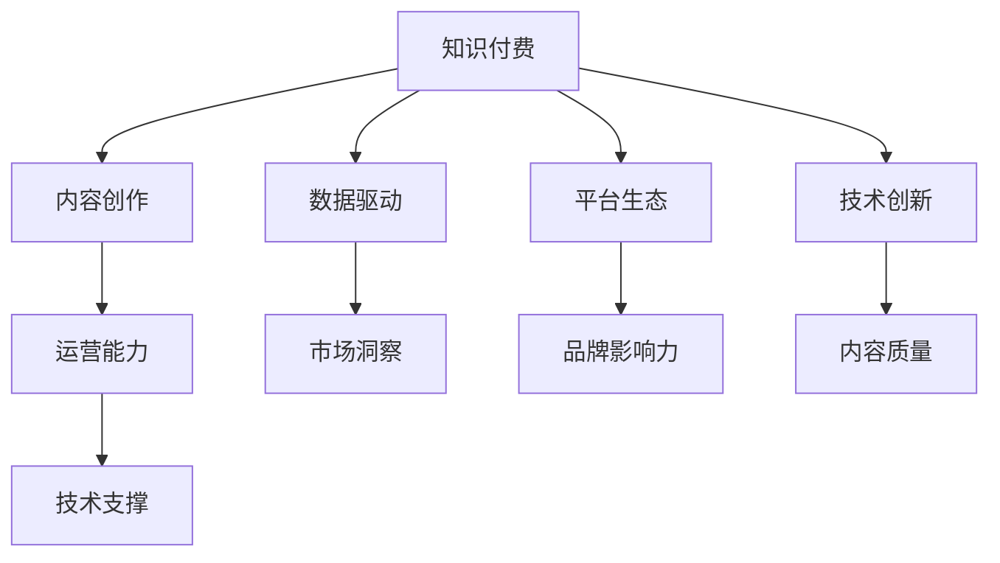

                 

# 如何成为知识付费行业的意见领袖

## 1. 背景介绍

### 1.1 问题由来

随着知识经济的崛起，知识付费逐渐成为人们获取专业知识和技能的重要方式。然而，知识付费市场鱼龙混杂，内容质量良莠不齐，行业乱象频发。如何在众多的知识提供者中脱颖而出，成为行业内的意见领袖，是每个从业者都需要深思的问题。

### 1.2 问题核心关键点

成为知识付费行业的意见领袖，需要综合多方面的能力，包括但不限于：

- **内容质量**：提供高质量、有价值的内容，帮助用户解决问题，实现个人或组织的商业目标。
- **市场洞察**：准确把握行业趋势和用户需求，推出符合市场期待的产品或服务。
- **品牌影响力**：建立品牌声誉，通过社交媒体、行业会议等方式提升个人或企业的影响力。
- **运营能力**：具备高效的市场推广、用户运营、数据分析等综合能力，确保业务的可持续发展。
- **行业深度**：对所在行业有深入的理解和洞察，能够提供独到的见解和解决方案。
- **技术支撑**：利用前沿技术和工具，提升内容生产、分发、推荐的效率和效果。

## 2. 核心概念与联系

### 2.1 核心概念概述

要成为知识付费行业的意见领袖，必须深入理解行业中的核心概念和关键技术：

- **知识付费**：指以知识为媒介，通过付费方式获取特定知识的经济模式。
- **内容创作**：指创作高质量、具有信息价值和娱乐价值的内容，满足用户需求。
- **数据驱动**：利用数据进行市场分析、用户行为分析、内容推荐等，提高运营效率。
- **平台生态**：指知识付费平台与内容创作者、用户之间的互动关系，形成一个良性循环的生态系统。
- **技术创新**：引入前沿技术，如人工智能、大数据、区块链等，提升用户体验和平台价值。

这些概念通过以下Mermaid流程图展示它们之间的联系：



这个流程图展示了知识付费、内容创作、数据驱动、平台生态和技术创新之间的相互关系：

1. **内容创作**：知识付费的核心在于内容，创作者提供高质量内容，满足用户需求。
2. **数据驱动**：通过数据分析，了解用户行为和需求，优化内容推荐和平台运营。
3. **平台生态**：平台与创作者、用户形成良好的互动关系，形成一个互利共赢的生态系统。
4. **技术创新**：引入前沿技术提升用户体验，增强平台的竞争力和吸引力。
5. **运营能力**：高效的市场推广和用户运营是平台持续发展的关键。
6. **品牌影响力**：通过品牌建设提升市场地位，吸引更多用户和创作者。
7. **内容质量**：优质的内容是吸引用户和增强品牌信任的基础。
8. **技术支撑**：利用技术手段提升内容生产、分发和推荐的效率和效果。

这些概念共同构成了知识付费行业的核心框架，帮助从业者理解行业运作的内在逻辑，指导实践操作。

## 3. 核心算法原理 & 具体操作步骤

### 3.1 算法原理概述

要成为知识付费行业的意见领袖，需要掌握多种算法和工具，帮助提升内容创作、运营推广和平台优化。以下是一些关键的算法原理：

- **推荐算法**：通过分析用户行为数据，推荐符合用户兴趣的内容，提高用户粘性和平台流量。
- **内容分析**：利用自然语言处理(NLP)技术，对内容进行情感分析、主题分析等，提升内容质量和吸引力。
- **用户画像**：基于用户行为数据构建用户画像，实现个性化推荐和服务。
- **流量预测**：通过时间序列分析等技术，预测平台流量变化，优化资源分配和运营策略。
- **广告投放**：利用机器学习模型优化广告投放策略，提升广告效果和投资回报率。

### 3.2 算法步骤详解

下面是基于推荐算法的知识付费平台用户推荐系统的详细步骤：

**Step 1: 数据收集与预处理**
- 收集用户行为数据，如浏览历史、购买记录、评分反馈等。
- 对数据进行清洗和预处理，去除噪声和异常值，保证数据质量。

**Step 2: 特征工程**
- 提取用户行为特征，如浏览时间、购买频率、评分分布等。
- 提取内容特征，如关键词、主题、情感倾向等。

**Step 3: 模型训练**
- 选择适当的推荐算法，如协同过滤、基于内容的推荐、混合推荐等。
- 利用训练数据训练推荐模型，优化模型参数，确保模型预测准确性。

**Step 4: 模型评估与优化**
- 在验证集上评估模型性能，如准确率、召回率、覆盖率等指标。
- 根据评估结果，调整模型参数，优化模型性能。

**Step 5: 实际部署**
- 将训练好的推荐模型部署到知识付费平台，实时计算推荐结果。
- 监控推荐系统性能，根据反馈进行调整和优化。

### 3.3 算法优缺点

推荐算法的优点包括：

- **个性化推荐**：根据用户行为和内容特征，提供个性化推荐，提升用户体验。
- **流量提升**：通过精准推荐，提高用户粘性和平台流量。
- **运营效率**：自动化推荐流程，减少人工干预，提升运营效率。

推荐算法的主要缺点包括：

- **数据稀疏性**：用户行为数据往往稀疏，难以获得全面的用户画像。
- **冷启动问题**：新用户或新内容的推荐准确性较低。
- **算法复杂性**：推荐算法涉及复杂的数据处理和模型训练过程。

### 3.4 算法应用领域

推荐算法在知识付费行业有广泛的应用：

- **内容推荐**：为用户推荐感兴趣的文章、视频、课程等。
- **个性化学习路径**：根据用户学习进度和兴趣，推荐学习路径和课程。
- **广告定向投放**：精准定位目标用户，提高广告效果。
- **用户流失预测**：预测用户流失风险，采取挽留措施。
- **课程优化**：根据用户反馈和行为数据，优化课程内容和结构。

## 4. 数学模型和公式 & 详细讲解

### 4.1 数学模型构建

基于协同过滤算法的推荐系统数学模型如下：

设用户集合为 $U$，物品集合为 $I$，用户 $u$ 对物品 $i$ 的评分矩阵为 $R$，即 $R_{ui}$ 表示用户 $u$ 对物品 $i$ 的评分。设物品 $i$ 的相关物品集合为 $I_i$，用户 $u$ 的相关用户集合为 $U_u$。

协同过滤模型的目标是通过用户行为数据 $R$ 和物品相关性数据 $I_i$ 和 $U_u$，预测用户 $u$ 对物品 $i$ 的评分 $R_{ui}$。

**协同过滤算法公式**：

$$
\hat{R}_{ui} = \frac{\sum_{j \in I_i} R_{uj} \cdot P_{ij}}{\sum_{j \in I_i} P_{ij}}
$$

其中，$P_{ij}$ 表示物品 $i$ 和物品 $j$ 之间的相关性，$\hat{R}_{ui}$ 表示用户 $u$ 对物品 $i$ 的预测评分。

### 4.2 公式推导过程

基于协同过滤算法的推荐系统，通过对用户行为数据和物品相关性数据的分析，预测用户对物品的评分，实现个性化推荐。

公式推导过程如下：

1. **用户行为数据建模**：
   $$
   \mathcal{L}_{user} = \frac{1}{N} \sum_{(u,i)} \ell(R_{ui}, \hat{R}_{ui})
   $$

   其中 $\ell$ 表示损失函数，$N$ 表示用户-物品对的数量。

2. **物品相关性建模**：
   $$
   \mathcal{L}_{item} = \frac{1}{|\mathcal{I}|^2} \sum_{i,j} \ell(P_{ij}, \hat{P}_{ij})
   $$

   其中 $\mathcal{I}$ 表示物品集合的大小，$\ell$ 表示损失函数。

3. **协同过滤算法**：
   $$
   \hat{R}_{ui} = \frac{\sum_{j \in I_i} R_{uj} \cdot P_{ij}}{\sum_{j \in I_i} P_{ij}}
   $$

   其中 $R_{uj}$ 表示用户 $u$ 对物品 $j$ 的评分，$P_{ij}$ 表示物品 $i$ 和物品 $j$ 之间的相关性。

### 4.3 案例分析与讲解

以Coursera平台为例，分析其基于协同过滤算法的推荐系统：

1. **数据收集与预处理**：
   - 收集用户浏览、评分、购买行为数据。
   - 对数据进行清洗和预处理，去除噪声和异常值。

2. **特征工程**：
   - 提取用户行为特征，如浏览时间、评分分布等。
   - 提取内容特征，如课程难度、教师资历等。

3. **模型训练**：
   - 选择协同过滤算法，训练推荐模型。
   - 优化模型参数，提升模型预测准确性。

4. **模型评估与优化**：
   - 在验证集上评估模型性能。
   - 根据评估结果，调整模型参数，优化模型性能。

5. **实际部署**：
   - 部署推荐模型，实时计算推荐结果。
   - 监控推荐系统性能，根据反馈进行调整和优化。

## 5. 项目实践：代码实例和详细解释说明

### 5.1 开发环境搭建

要构建知识付费平台的推荐系统，需要搭建相应的开发环境。以下是常用的开发工具和环境配置：

1. **Python 环境**：
   - 安装 Python 3.7 及以上版本。
   - 使用 Anaconda 或 Miniconda 创建虚拟环境，安装必要的依赖库。

2. **数据库**：
   - 使用 MySQL、PostgreSQL 或 MongoDB 作为推荐系统的数据存储。
   - 搭建数据库集群，确保数据存储和访问的效率和安全性。

3. **数据处理工具**：
   - 使用 Pandas、NumPy 进行数据清洗和预处理。
   - 使用 Apache Kafka 或 Apache Flink 处理大规模数据流。

### 5.2 源代码详细实现

以下是一个基于协同过滤算法的推荐系统示例代码，以 Python 实现：

```python
import pandas as pd
import numpy as np
from scipy.sparse import csr_matrix
from sklearn.metrics.pairwise import cosine_similarity

# 读取用户行为数据
data = pd.read_csv('ratings.csv', sep=',')
# 提取用户 ID 和物品 ID
user_ids = data['user_id'].tolist()
item_ids = data['item_id'].tolist()
ratings = data['rating'].tolist()

# 构建用户行为矩阵
user_item_matrix = pd.get_dummies(data['item_id'], prefix='item', prefix_sep='_').values

# 计算物品相关性矩阵
item_item_matrix = cosine_similarity(user_item_matrix, user_item_matrix)

# 预测用户评分
def predict_user_ratings(user_id):
    user_behaviors = user_item_matrix[user_id]
    user_ratings = np.dot(user_behaviors, item_item_matrix).tolist()
    return user_ratings

# 测试预测结果
user_id = 12345
predicted_ratings = predict_user_ratings(user_id)
print(predicted_ratings)
```

### 5.3 代码解读与分析

**用户行为数据读取**：
- 使用 Pandas 读取 CSV 格式的用户行为数据。
- 提取用户 ID、物品 ID 和评分，构成用户行为矩阵。

**用户行为矩阵构建**：
- 使用 Pandas 的 `get_dummies` 方法将物品 ID 转换为独热编码，构成用户行为矩阵。

**物品相关性矩阵计算**：
- 使用 NumPy 的 `dot` 方法计算物品相关性矩阵。

**用户评分预测**：
- 定义 `predict_user_ratings` 函数，接收用户 ID 作为输入，返回预测的评分。
- 通过计算用户行为矩阵与物品相关性矩阵的点积，得到用户对各个物品的预测评分。

**测试预测结果**：
- 调用 `predict_user_ratings` 函数，输出用户 ID 为 12345 的预测评分。

## 6. 实际应用场景

### 6.1 智能课程推荐

在知识付费平台上，智能课程推荐是一个重要的应用场景。通过推荐算法，根据用户的浏览历史和评分反馈，推荐最符合用户兴趣和需求的课程。

以 Coursera 平台为例，智能课程推荐流程如下：

1. **数据收集与预处理**：
   - 收集用户浏览历史、评分反馈、购买记录等数据。
   - 对数据进行清洗和预处理，去除噪声和异常值。

2. **特征工程**：
   - 提取用户行为特征，如浏览时间、评分分布等。
   - 提取课程特征，如课程难度、教师资历等。

3. **模型训练**：
   - 选择推荐算法，训练推荐模型。
   - 优化模型参数，提升模型预测准确性。

4. **模型评估与优化**：
   - 在验证集上评估模型性能。
   - 根据评估结果，调整模型参数，优化模型性能。

5. **实际部署**：
   - 部署推荐模型，实时计算推荐结果。
   - 监控推荐系统性能，根据反馈进行调整和优化。

### 6.2 个性化学习路径

个性化学习路径是知识付费平台提升用户体验的重要手段。通过推荐算法，根据用户的学习进度和兴趣，推荐最适合的学习路径和课程。

以 Udacity 平台为例，个性化学习路径推荐流程如下：

1. **数据收集与预处理**：
   - 收集用户的学习进度、课程成绩、完成时间等数据。
   - 对数据进行清洗和预处理，去除噪声和异常值。

2. **特征工程**：
   - 提取用户行为特征，如学习时间、课程成绩等。
   - 提取课程特征，如课程难度、教师资历等。

3. **模型训练**：
   - 选择推荐算法，训练推荐模型。
   - 优化模型参数，提升模型预测准确性。

4. **模型评估与优化**：
   - 在验证集上评估模型性能。
   - 根据评估结果，调整模型参数，优化模型性能。

5. **实际部署**：
   - 部署推荐模型，实时计算推荐结果。
   - 监控推荐系统性能，根据反馈进行调整和优化。

## 7. 工具和资源推荐

### 7.1 学习资源推荐

要掌握知识付费行业的推荐技术，需要学习多种相关的知识和工具。以下是一些推荐的学习资源：

1. **《推荐系统实践》**：介绍推荐算法和实现方法，适合初学者入门。
2. **Coursera《推荐系统》课程**：由斯坦福大学开设，涵盖推荐算法和实践。
3. **《机器学习实战》**：讲解常用机器学习算法和实现，适合实战练习。
4. **Kaggle《推荐系统》竞赛**：通过实际竞赛项目，提升推荐系统设计和实现能力。
5. **PyTorch 官方文档**：PyTorch 框架的推荐系统实现和优化指南。

通过学习这些资源，可以系统掌握推荐技术的理论基础和实践技巧，提升在知识付费行业的竞争力。

### 7.2 开发工具推荐

在知识付费平台推荐系统的开发过程中，需要多种开发工具的支持。以下是一些常用的开发工具：

1. **Python 开发环境**：如 Anaconda、PyCharm、Jupyter Notebook。
2. **数据处理工具**：如 Pandas、NumPy、Scikit-learn。
3. **数据库**：如 MySQL、PostgreSQL、MongoDB。
4. **推荐算法框架**：如 Surprise、TensorFlow、PyTorch。
5. **数据可视化工具**：如 Matplotlib、Seaborn、Tableau。

合理利用这些工具，可以提升推荐系统的开发效率和效果。

### 7.3 相关论文推荐

为了深入理解推荐系统的发展和应用，以下是几篇推荐领域的经典论文：

1. **《Contextual Bandits in Online Learning and Recommendation Systems: An Algorithmic Framework for Adaptive Recommendations》**：介绍上下文强化学习的推荐系统框架。
2. **《A Survey of Recommender Systems》**：综述推荐系统的经典算法和实现方法。
3. **《Adaptive Recommender Systems》**：介绍自适应推荐系统的实现和优化方法。
4. **《Collaborative Filtering in Recommender Systems》**：介绍协同过滤算法的实现和优化方法。
5. **《Neural Networks for Recommender Systems》**：介绍神经网络在推荐系统中的应用和效果。

这些论文代表推荐系统的发展脉络，为技术实践提供理论和算法的指导。

## 8. 总结：未来发展趋势与挑战

### 8.1 研究成果总结

知识付费行业的推荐系统已经取得了显著的成果，但在实际应用中仍面临诸多挑战。未来，推荐系统需要在数据质量、算法优化、用户个性化等方面进一步提升。

### 8.2 未来发展趋势

知识付费行业的推荐系统将呈现以下几个发展趋势：

1. **数据驱动**：通过大规模数据驱动推荐算法，提升推荐准确性和个性化程度。
2. **跨领域推荐**：结合多领域数据，实现更为全面和精准的推荐。
3. **实时推荐**：通过流数据处理技术，实现实时推荐，提升用户体验。
4. **多模态推荐**：结合文本、图像、视频等多模态数据，提升推荐效果。
5. **深度学习推荐**：引入深度学习技术，提升推荐模型的表达能力和性能。

### 8.3 面临的挑战

尽管推荐系统在知识付费行业取得了显著成效，但仍面临以下挑战：

1. **数据稀疏性**：用户行为数据稀疏，难以获得全面的用户画像。
2. **冷启动问题**：新用户和新内容的推荐准确性较低。
3. **算法复杂性**：推荐算法涉及复杂的数据处理和模型训练过程。
4. **隐私保护**：在推荐过程中需要保护用户隐私，避免数据泄露。
5. **多样性和公平性**：避免推荐结果过于单一，确保不同用户的需求和兴趣得到公平对待。

### 8.4 研究展望

为了应对未来推荐系统面临的挑战，需要从以下几个方面进行研究：

1. **数据增强**：通过数据增强技术，丰富用户行为数据，缓解数据稀疏性。
2. **多任务学习**：结合多个推荐任务，提升推荐效果。
3. **联邦学习**：通过联邦学习技术，保护用户隐私，同时提升推荐模型的泛化能力。
4. **自适应推荐**：结合用户行为变化，动态调整推荐策略。
5. **深度强化学习**：引入深度强化学习技术，提升推荐模型的表达能力和性能。

这些研究方向的探索，将引领推荐系统向更高层次发展，提升知识付费行业的用户满意度和商业价值。

## 9. 附录：常见问题与解答

**Q1: 知识付费行业的推荐系统主要有哪些应用场景？**

A: 知识付费行业的推荐系统主要应用于以下场景：

1. **课程推荐**：根据用户行为和兴趣，推荐最适合的课程。
2. **个性化学习路径**：根据用户学习进度和兴趣，推荐个性化的学习路径。
3. **广告定向投放**：精准定位目标用户，提高广告效果。
4. **用户流失预测**：预测用户流失风险，采取挽留措施。
5. **课程优化**：根据用户反馈和行为数据，优化课程内容和结构。

**Q2: 推荐系统如何处理数据稀疏性问题？**

A: 推荐系统处理数据稀疏性问题通常采用以下方法：

1. **矩阵补全**：通过矩阵补全算法，填补缺失的数据，提高数据完整性。
2. **协同过滤**：利用协同过滤算法，通过用户行为和物品相关性推断缺失数据。
3. **模型融合**：结合多个推荐模型，融合不同模型的预测结果，提升推荐效果。
4. **深度学习**：引入深度学习模型，提升模型的表达能力和泛化能力。

**Q3: 如何评估推荐系统的性能？**

A: 推荐系统的性能评估通常使用以下指标：

1. **准确率**：预测推荐的准确度。
2. **召回率**：预测推荐的全面度。
3. **覆盖率**：推荐结果覆盖的广泛度。
4. **多样性**：推荐结果的多样性。
5. **新鲜度**：推荐结果的时效性。

通过综合这些指标，可以全面评估推荐系统的性能，发现和改进推荐模型的短板。

---

作者：禅与计算机程序设计艺术 / Zen and the Art of Computer Programming

