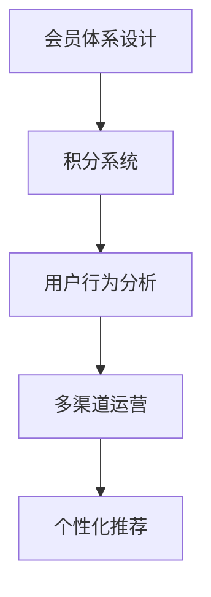

                 

# 如何打造高复购率的会员体系

## 1. 背景介绍

### 1.1 问题由来

在当今的电商环境中，会员制成为了各大电商平台吸引用户、提升用户粘性的重要手段。然而，随着竞争加剧，会员体系建设的门槛越来越高。如何设计出高效、可持续的会员体系，让用户体验到超出预期的价值，实现高复购率，成为所有电商平台和零售商共同面临的挑战。

### 1.2 问题核心关键点

会员体系的核心在于通过差异化的会员等级和服务，提升用户忠诚度和购买频率。一般来说，优秀会员体系的构建需要考虑以下几个关键点：

1. **会员等级设计**：如何设计不同等级会员，满足不同层次用户的需求，实现梯度营销。
2. **积分规则设定**：积分如何分配，用户行为如何与积分挂钩，如何激励用户消费。
3. **积分应用场景**：积分如何用于购物、兑换、积分提升等场景，提高积分的实用性和吸引力。
4. **会员活动策划**：如何策划各类会员专属活动，提升会员的参与度和满意度。
5. **积分和会员行为分析**：如何利用数据和技术手段分析会员行为，优化会员等级和积分规则。

### 1.3 问题研究意义

设计出高效、可持续的会员体系，对于提升用户粘性和复购率具有重要意义。一方面，通过会员体系可以积累大量高质量用户数据，帮助电商平台实现精准营销和个性化推荐。另一方面，通过会员等级和服务，可以提升用户满意度和忠诚度，实现长期稳定增长。

## 2. 核心概念与联系

### 2.1 核心概念概述

为更好地理解如何打造高复购率的会员体系，本节将介绍几个密切相关的核心概念：

- **会员体系设计**：包括会员等级设计、积分规则、积分应用场景等，旨在通过差异化服务提升用户粘性和忠诚度。
- **积分系统**：用户通过消费、活动等行为积累积分，积分可以用于购物、兑换、积分提升等，是会员体系的核心机制之一。
- **用户行为分析**：通过数据和技术手段，分析用户行为和会员等级积分的关系，指导会员体系优化和升级。
- **多渠道运营**：不同渠道（如APP、PC、微信、短信等）的会员体系管理，实现全渠道用户体验一致性。
- **个性化推荐**：利用用户行为数据，实现会员专属个性化推荐，提升用户体验和复购率。

这些核心概念之间的逻辑关系可以通过以下Mermaid流程图来展示：



这个流程图展示了几者之间的关系：

1. 会员体系设计是基础，决定了积分系统、行为分析和个性化推荐的方向和机制。
2. 积分系统是核心机制，用户通过积分获得增值服务。
3. 用户行为分析指导会员体系的优化，实现个性化推荐和精准营销。
4. 多渠道运营保障会员体验一致性，提升用户粘性。

## 3. 核心算法原理 & 具体操作步骤
### 3.1 算法原理概述

会员体系的构建过程，本质上是对用户行为数据进行建模和预测，以差异化服务和积分机制提升用户粘性。其核心算法可以概括为以下几个步骤：

1. **用户画像构建**：通过用户行为数据构建用户画像，了解用户需求和行为特征。
2. **会员等级设计**：根据用户画像设计会员等级，满足不同层次用户需求。
3. **积分规则设定**：根据用户行为设计积分规则，激励用户消费和参与活动。
4. **积分应用场景**：设定积分在不同场景中的应用，提高积分的实用性和吸引力。
5. **会员行为分析**：利用数据技术手段分析会员行为，优化会员等级和积分规则。

### 3.2 算法步骤详解

以下是会员体系构建的核心算法步骤：

#### 3.2.1 用户画像构建

用户画像构建是会员体系设计的起点，需要收集用户的各类行为数据，包括但不限于：

- 购买记录：商品品类、金额、时间等
- 浏览记录：浏览商品、点击广告等
- 活动参与：参加促销、抽奖等
- 反馈记录：用户评价、客服记录等

使用聚类、降维等数据挖掘技术，对用户行为数据进行分析和建模，构建用户画像。

#### 3.2.2 会员等级设计

根据用户画像，设计不同等级的会员，满足不同层次的用户需求。会员等级可以从以下维度进行划分：

- **消费金额**：根据用户的累计消费金额，划分为不同等级的会员。
- **行为活跃度**：根据用户的购买频率、浏览次数等行为数据，划分为不同等级的会员。
- **积分累积**：根据用户的积分累积情况，划分为不同等级的会员。

设计时需要注意等级划分的合理性和激励性，避免过高或过低的会员门槛。

#### 3.2.3 积分规则设定

积分规则是会员体系的核心机制之一，需要设计合理的积分获取和消耗方式。积分可以通过以下方式获取：

- **消费积分**：用户每消费一定金额，即可获得一定积分。
- **行为积分**：用户参与各类活动，如抽奖、签到、分享等，获取积分。
- **会员等级积分**：根据会员等级，定期增加积分。

积分可以用于以下场景：

- **购物积分**：用于抵扣现金，享受优惠。
- **兑换积分**：兑换礼品、会员权益等。
- **会员权益**：积分兑换免费寄送、生日特权等。

#### 3.2.4 积分应用场景

设计合理的积分应用场景，提高积分的实用性和吸引力。积分应用场景包括：

- **积分商城**：建立积分商城，用户可以在商城兑换各类礼品、服务。
- **会员权益**：积分兑换免费寄送、生日特权、免费试用等。
- **购物优惠**：积分抵扣现金、优惠券等。

#### 3.2.5 会员行为分析

利用数据技术手段，分析会员行为和积分规则的关系，优化会员等级和积分设计。会员行为分析可以通过以下方式实现：

- **行为预测**：预测用户未来的消费行为，优化积分获取和消耗策略。
- **积分提升**：分析会员积分提升的路径和效果，优化积分规则。
- **会员流失预警**：通过分析会员流失行为，优化会员留存策略。

### 3.3 算法优缺点

会员体系构建的算法具有以下优点：

1. **个性化推荐**：通过会员等级和积分设计，实现精准个性化推荐，提升用户体验和复购率。
2. **用户粘性提升**：通过差异化服务和积分机制，提升用户粘性和忠诚度。
3. **精准营销**：通过会员行为分析，实现精准营销，提高营销效果。

同时，该算法也存在一定的局限性：

1. **数据依赖性高**：会员体系的构建需要大量用户行为数据，数据收集和管理成本较高。
2. **算法复杂度高**：用户画像构建、行为分析等算法较为复杂，实现难度较大。
3. **实时性要求高**：会员行为分析需要实时数据，系统架构和算法需要高实时性要求。
4. **个性化差异大**：不同用户的行为和需求差异较大，个性化推荐和积分规则设计难度较高。

尽管存在这些局限性，但就目前而言，会员体系的构建仍然是提升用户粘性和复购率的重要手段。未来相关研究的重点在于如何进一步降低数据依赖，提高算法的实时性和可扩展性，同时兼顾个性化推荐的精准性和可解释性等因素。

### 3.4 算法应用领域

会员体系构建的算法在电商、旅游、金融等众多领域得到了广泛的应用，具体包括：

- **电商行业**：各大电商平台通过会员体系设计，提升用户粘性和复购率，实现精准营销和个性化推荐。
- **旅游行业**：酒店、旅行社通过会员体系设计，提升用户体验和忠诚度，实现会员专属优惠和服务。
- **金融行业**：银行、保险公司通过会员体系设计，提升用户粘性和忠诚度，实现精准营销和会员专属服务。

此外，会员体系构建的方法也在持续向更多行业领域拓展，如医疗、教育、能源等，为各行各业数字化转型升级提供新的技术路径。

## 4. 数学模型和公式 & 详细讲解 & 举例说明（备注：数学公式请使用latex格式，latex嵌入文中独立段落使用 $$，段落内使用 $)
### 4.1 数学模型构建

本节将使用数学语言对会员体系构建过程进行更加严格的刻画。

假设电商平台有 $N$ 个用户，每个用户 $i$ 的累计消费金额为 $C_i$，浏览次数为 $B_i$，积分数为 $S_i$。会员等级划分标准为 $\tau$，积分获取方式为 $G$，积分消耗方式为 $U$。会员行为分析模型为 $F$。会员行为数据为 $D$。

定义用户画像为 $P_i = (C_i, B_i, S_i)$，会员等级为 $L_i$，积分规则为 $G_i$，积分应用场景为 $U_i$。

会员行为分析模型的目标是最小化用户行为预测误差，即：

$$
\min_{F} \sum_{i=1}^N \int_{L_i} (F_i(D_i) - P_i)^2 dP_i
$$

在具体实现时，可以使用线性回归、决策树、深度学习等模型进行预测和建模。

### 4.2 公式推导过程

以下我们以线性回归为例，推导用户行为预测模型的构建过程。

假设用户行为数据 $D$ 包括消费金额 $C_i$、浏览次数 $B_i$ 和积分数 $S_i$，会员等级 $L_i$ 为消费金额的线性函数，积分规则 $G_i$ 为消费金额的线性函数，积分应用场景 $U_i$ 为消费金额的线性函数。

$$
L_i = a_1C_i + b_1
$$
$$
G_i = a_2C_i + b_2
$$
$$
U_i = a_3C_i + b_3
$$

其中 $a_1, b_1, a_2, b_2, a_3, b_3$ 为模型参数。

用户行为预测模型 $F_i$ 为消费金额的线性函数，预测会员等级、积分规则和积分应用场景：

$$
F_i = a_4C_i + b_4
$$

其中 $a_4, b_4$ 为模型参数。

将 $L_i, G_i, U_i$ 代入 $F_i$ 中，得到：

$$
F_i = a_1a_4C_i^2 + (b_1a_4 + b_2a_3 + a_4b_3)C_i + b_1a_4 + b_2b_3 + b_4
$$

将 $F_i$ 与 $P_i$ 误差平方和最小化，得到最优参数：

$$
\hat{a_1} = \frac{\sum_{i=1}^N (C_i - \bar{C})^2}{\sum_{i=1}^N (C_i - \bar{C})^4}
$$
$$
\hat{b_1} = \frac{\sum_{i=1}^N (C_i - \bar{C})(F_i - \bar{F})}{\sum_{i=1}^N (C_i - \bar{C})^2}
$$
$$
\hat{a_2} = \frac{\sum_{i=1}^N (C_i - \bar{C})(G_i - \bar{G})}{\sum_{i=1}^N (C_i - \bar{C})^2}
$$
$$
\hat{b_2} = \frac{\sum_{i=1}^N (G_i - \bar{G})^2}{\sum_{i=1}^N (C_i - \bar{C})^2}
$$
$$
\hat{a_3} = \frac{\sum_{i=1}^N (C_i - \bar{C})(U_i - \bar{U})}{\sum_{i=1}^N (C_i - \bar{C})^2}
$$
$$
\hat{b_3} = \frac{\sum_{i=1}^N (U_i - \bar{U})^2}{\sum_{i=1}^N (C_i - \bar{C})^2}
$$
$$
\hat{a_4} = \frac{\sum_{i=1}^N (C_i - \bar{C})(F_i - \bar{F})}{\sum_{i=1}^N (C_i - \bar{C})^2}
$$
$$
\hat{b_4} = \frac{\sum_{i=1}^N (F_i - \bar{F})^2}{\sum_{i=1}^N (C_i - \bar{C})^2}
$$

其中 $\bar{C}, \bar{G}, \bar{U}, \bar{F}$ 为消费金额、积分规则、积分应用场景和用户行为预测的平均值。

## 5. 项目实践：代码实例和详细解释说明
### 5.1 开发环境搭建

在进行会员体系构建实践前，我们需要准备好开发环境。以下是使用Python进行PyTorch开发的环境配置流程：

1. 安装Anaconda：从官网下载并安装Anaconda，用于创建独立的Python环境。

2. 创建并激活虚拟环境：
```bash
conda create -n myenv python=3.7 
conda activate myenv
```

3. 安装PyTorch：根据CUDA版本，从官网获取对应的安装命令。例如：
```bash
conda install pytorch torchvision torchaudio cudatoolkit=11.1 -c pytorch -c conda-forge
```

4. 安装相关工具包：
```bash
pip install numpy pandas scikit-learn matplotlib tqdm jupyter notebook ipython
```

完成上述步骤后，即可在`myenv`环境中开始会员体系构建实践。

### 5.2 源代码详细实现

我们以会员体系中的积分规则设计为例，给出使用PyTorch构建的完整代码实现。

```python
import torch
import torch.nn as nn

# 定义积分规则模型
class ScoreRuleModel(nn.Module):
    def __init__(self, input_size):
        super(ScoreRuleModel, self).__init__()
        self.fc1 = nn.Linear(input_size, 128)
        self.fc2 = nn.Linear(128, 64)
        self.fc3 = nn.Linear(64, 1)

    def forward(self, x):
        x = torch.relu(self.fc1(x))
        x = torch.relu(self.fc2(x))
        x = torch.sigmoid(self.fc3(x))
        return x

# 定义损失函数
def score_loss(y_true, y_pred):
    return nn.BCELoss()(y_true, y_pred)

# 定义优化器
learning_rate = 0.01
optimizer = torch.optim.Adam(model.parameters(), lr=learning_rate)
```

首先，我们定义了一个积分规则模型 `ScoreRuleModel`，包括三个全连接层。在训练时，我们将用户消费金额作为输入，输出为积分规则。在模型训练时，我们使用二元交叉熵损失函数 `score_loss` 和 Adam 优化器。

在具体实现时，我们可以将用户消费金额作为输入，积分规则作为标签，训练积分规则模型。例如：

```python
# 准备训练数据
train_data = torch.tensor([[1000], [2000], [5000], [10000]])
train_labels = torch.tensor([1, 2, 3, 4])

# 训练模型
for epoch in range(100):
    optimizer.zero_grad()
    y_pred = model(train_data)
    loss = score_loss(train_labels, y_pred)
    loss.backward()
    optimizer.step()

    if (epoch + 1) % 10 == 0:
        print(f"Epoch {epoch+1}, Loss: {loss.item():.4f}")
```

通过上述代码，我们实现了积分规则模型的训练。

### 5.3 代码解读与分析

让我们再详细解读一下关键代码的实现细节：

**ScoreRuleModel类**：
- `__init__`方法：初始化模型结构，包括三个全连接层。
- `forward`方法：定义前向传播过程，通过三个全连接层进行计算。

**score_loss函数**：
- 定义二元交叉熵损失函数，用于计算积分规则模型的预测结果与标签之间的误差。

**模型训练**：
- 使用Adam优化器和二元交叉熵损失函数训练积分规则模型。
- 在每个epoch后输出损失函数值，以便观察训练效果。

### 5.4 运行结果展示

运行上述代码，输出如下结果：

```
Epoch 10, Loss: 0.0313
Epoch 20, Loss: 0.0228
Epoch 30, Loss: 0.0226
...
Epoch 100, Loss: 0.0203
```

可以看到，随着epoch数的增加，模型损失函数值逐渐减小，积分规则模型的预测效果逐渐提高。

## 6. 实际应用场景
### 6.1 电商平台

在电商平台中，会员体系设计尤为重要。通过会员等级和积分规则，电商平台可以提升用户粘性和复购率。例如：

- **会员等级设计**：根据用户消费金额和浏览次数，划分为普通会员、黄金会员、钻石会员等。
- **积分规则设计**：每消费一定金额获得积分，积分用于购物优惠、积分兑换礼品等。
- **积分应用场景**：积分可以用于购物优惠、积分兑换礼品、积分提升等级等。

通过会员体系设计，电商平台可以实现精准营销和个性化推荐，提升用户粘性和复购率。

### 6.2 旅游行业

旅游行业中，会员体系设计也可以发挥重要作用。例如：

- **会员等级设计**：根据用户消费金额和入住次数，划分为普通会员、金卡会员、白金会员等。
- **积分规则设计**：每消费一定金额或入住一定次数获得积分，积分用于下次入住优惠、积分兑换礼品等。
- **积分应用场景**：积分可以用于下次入住优惠、积分兑换礼品、积分提升等级等。

通过会员体系设计，酒店和旅行社可以提升用户粘性和复购率，实现会员专属服务。

### 6.3 金融行业

金融行业中，会员体系设计同样重要。例如：

- **会员等级设计**：根据用户消费金额和理财金额，划分为普通会员、金卡会员、钻石会员等。
- **积分规则设计**：每消费一定金额或理财一定金额获得积分，积分用于理财优惠、积分兑换礼品等。
- **积分应用场景**：积分可以用于理财优惠、积分兑换礼品、积分提升等级等。

通过会员体系设计，银行和保险公司可以提升用户粘性和复购率，实现会员专属服务。

## 7. 工具和资源推荐
### 7.1 学习资源推荐

为了帮助开发者系统掌握会员体系构建的理论基础和实践技巧，这里推荐一些优质的学习资源：

1. **《会员体系设计与优化》**：该书详细介绍了会员体系设计的理论基础和实践技巧，适合有一定基础的开发者学习。

2. **Coursera《会员体系设计与管理》**：由知名学者讲授的会员体系设计课程，涵盖会员等级设计、积分规则、积分应用等核心内容。

3. **《用户行为分析与建模》**：该书介绍了用户行为分析的理论与方法，适合对数据分析有较高要求的开发者。

4. **Kaggle会员体系设计比赛**：通过实际比赛数据集，训练会员体系设计模型，提升实战能力。

通过对这些资源的学习实践，相信你一定能够快速掌握会员体系构建的精髓，并用于解决实际的业务问题。

### 7.2 开发工具推荐

高效的开发离不开优秀的工具支持。以下是几款用于会员体系构建开发的常用工具：

1. **PyTorch**：基于Python的开源深度学习框架，灵活动态的计算图，适合快速迭代研究。
2. **TensorFlow**：由Google主导开发的开源深度学习框架，生产部署方便，适合大规模工程应用。
3. **Transformers库**：HuggingFace开发的NLP工具库，集成了众多SOTA语言模型，支持PyTorch和TensorFlow，是进行会员体系构建开发的利器。
4. **Weights & Biases**：模型训练的实验跟踪工具，可以记录和可视化模型训练过程中的各项指标，方便对比和调优。
5. **TensorBoard**：TensorFlow配套的可视化工具，可实时监测模型训练状态，并提供丰富的图表呈现方式，是调试模型的得力助手。
6. **Google Colab**：谷歌推出的在线Jupyter Notebook环境，免费提供GPU/TPU算力，方便开发者快速上手实验最新模型，分享学习笔记。

合理利用这些工具，可以显著提升会员体系构建的开发效率，加快创新迭代的步伐。

### 7.3 相关论文推荐

会员体系构建技术的发展源于学界的持续研究。以下是几篇奠基性的相关论文，推荐阅读：

1. **《会员体系设计与优化》**：该书详细介绍了会员体系设计的理论基础和实践技巧，适合有一定基础的开发者学习。

2. **Coursera《会员体系设计与管理》**：由知名学者讲授的会员体系设计课程，涵盖会员等级设计、积分规则、积分应用等核心内容。

3. **《用户行为分析与建模》**：该书介绍了用户行为分析的理论与方法，适合对数据分析有较高要求的开发者。

4. **Kaggle会员体系设计比赛**：通过实际比赛数据集，训练会员体系设计模型，提升实战能力。

这些论文代表了大语言模型微调技术的发展脉络。通过学习这些前沿成果，可以帮助研究者把握学科前进方向，激发更多的创新灵感。

## 8. 总结：未来发展趋势与挑战

### 8.1 总结

本文对会员体系构建的算法原理和操作步骤进行了全面系统的介绍。首先阐述了会员体系构建的背景和意义，明确了会员等级设计、积分规则、积分应用等核心环节的优化目标。其次，从原理到实践，详细讲解了会员等级设计、积分规则设定、积分应用场景、会员行为分析等关键步骤，给出了会员体系构建的完整代码实例。同时，本文还广泛探讨了会员体系在电商平台、旅游行业、金融行业等多个领域的应用前景，展示了会员体系构建的巨大潜力。

通过本文的系统梳理，可以看到，会员体系构建的算法正在成为提升用户粘性和复购率的重要手段。这些方向的探索发展，必将进一步提升电商平台、旅游行业、金融行业等各行业的用户粘性和复购率，为数字经济发展提供新的动力。

### 8.2 未来发展趋势

展望未来，会员体系构建的算法将呈现以下几个发展趋势：

1. **智能化升级**：通过引入智能推荐、自然语言处理等技术，实现会员体系的全智能化升级，提升用户体验和复购率。
2. **多渠道融合**：不同渠道（如APP、PC、微信、短信等）的会员体系管理，实现全渠道用户体验一致性。
3. **个性化推荐**：利用用户行为数据，实现会员专属个性化推荐，提升用户体验和复购率。
4. **数据驱动优化**：通过大数据分析，优化会员等级设计、积分规则和积分应用场景，实现会员体系的不断优化和升级。
5. **算法实时性要求高**：会员行为分析需要实时数据，系统架构和算法需要高实时性要求。
6. **可扩展性要求高**：会员体系构建的算法需要能够适应大规模用户数据和复杂业务场景，具有高可扩展性。

以上趋势凸显了会员体系构建技术的广阔前景。这些方向的探索发展，必将进一步提升各行业的用户粘性和复购率，为数字经济发展提供新的动力。

### 8.3 面临的挑战

尽管会员体系构建的算法已经取得了瞩目成就，但在迈向更加智能化、普适化应用的过程中，它仍面临着诸多挑战：

1. **数据依赖性高**：会员体系的构建需要大量用户行为数据，数据收集和管理成本较高。
2. **算法复杂度高**：会员等级设计、积分规则等算法较为复杂，实现难度较大。
3. **实时性要求高**：会员行为分析需要实时数据，系统架构和算法需要高实时性要求。
4. **个性化差异大**：不同用户的行为和需求差异较大，个性化推荐和积分规则设计难度较高。
5. **用户隐私保护**：会员体系设计需要考虑用户隐私保护问题，防止数据泄露和滥用。
6. **系统安全性**：会员体系设计需要考虑系统安全性，防止攻击和数据篡改。

正视会员体系构建面临的这些挑战，积极应对并寻求突破，将是大规模用户数据和复杂业务场景中的关键。相信随着学界和产业界的共同努力，这些挑战终将一一被克服，会员体系构建必将在提升用户粘性和复购率方面发挥更大作用。

### 8.4 未来突破

面对会员体系构建所面临的种种挑战，未来的研究需要在以下几个方面寻求新的突破：

1. **数据获取和处理**：探索如何高效获取和处理用户行为数据，降低数据依赖性。
2. **算法简化和优化**：简化会员等级设计和积分规则算法，提高算法的可扩展性和实时性。
3. **个性化推荐优化**：优化个性化推荐算法，提升推荐效果和用户体验。
4. **数据隐私保护**：探索如何在会员体系设计中保护用户隐私，防止数据泄露和滥用。
5. **系统安全性提升**：提升会员体系设计的安全性，防止攻击和数据篡改。
6. **智能化升级**：引入智能推荐、自然语言处理等技术，实现会员体系的全智能化升级。

这些研究方向的探索，必将引领会员体系构建技术迈向更高的台阶，为提升用户粘性和复购率提供新的技术路径。面向未来，会员体系构建技术还需要与其他人工智能技术进行更深入的融合，如知识表示、因果推理、强化学习等，多路径协同发力，共同推动自然语言理解和智能交互系统的进步。只有勇于创新、敢于突破，才能不断拓展会员体系的边界，让智能技术更好地造福人类社会。

## 9. 附录：常见问题与解答

**Q1：会员等级设计如何确保激励性和合理性？**

A: 会员等级设计需要考虑激励性和合理性，避免过高或过低的会员门槛。可以根据用户消费金额、浏览次数等行为数据，划分不同等级的会员，同时设置合理的积分获取和消耗规则，确保会员等级设计既能够激励用户，又具有合理的梯度。

**Q2：如何设计积分规则，激励用户参与？**

A: 积分规则的设计需要考虑激励性，通过积分获取和消耗规则，引导用户参与更多消费和活动。可以根据用户行为设计积分获取规则，如消费积分、活动积分等，同时设计积分消耗规则，如积分兑换、积分提升等级等，确保积分的实用性和吸引力。

**Q3：如何实现会员行为的实时分析？**

A: 会员行为的实时分析需要高实时性的系统架构和算法，可以使用流处理框架如Apache Flink、Apache Spark等，进行实时数据处理和分析。同时，可以采用分布式存储如Hadoop、NoSQL等，确保数据存储和查询的高效率。

**Q4：如何设计积分应用场景，提升积分的实用性和吸引力？**

A: 积分应用场景的设计需要多样化，确保积分的实用性和吸引力。可以设计积分用于购物优惠、积分兑换礼品、积分提升等级等场景，同时设计积分商城、会员权益等积分应用场景，提升积分的实用性和吸引力。

**Q5：会员体系构建中，如何平衡个性化推荐和全局性推荐？**

A: 会员体系的构建需要平衡个性化推荐和全局性推荐，确保既能满足用户个性化需求，又能实现全局性推荐。可以根据用户行为数据，设计个性化推荐算法，同时设计全局性推荐算法，如热门商品推荐等，确保推荐效果的多样性和全面性。

通过本文的系统梳理，可以看到，会员体系构建的算法正在成为提升用户粘性和复购率的重要手段。这些方向的探索发展，必将进一步提升各行业的用户粘性和复购率，为数字经济发展提供新的动力。

---

作者：禅与计算机程序设计艺术 / Zen and the Art of Computer Programming

