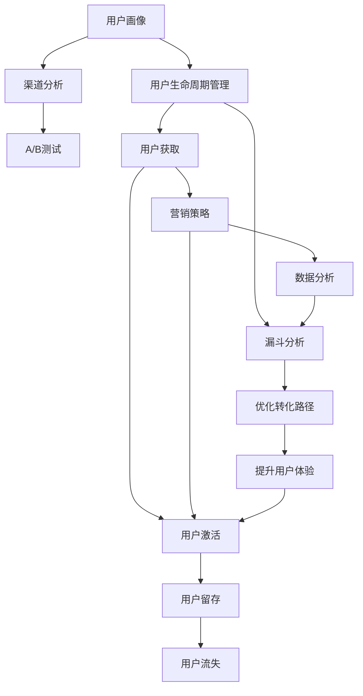

                 

## 1. 背景介绍

### 1.1 问题由来
在互联网和移动应用蓬勃发展的今天，如何吸引用户、提升活跃度、增强用户粘性，成为了各大平台和应用的首要任务。用户激活(User Acquisition)作为产品生命周期中的重要环节，是提升用户留存率和收益的关键。然而，随着市场竞争的加剧，获取新用户的难度和成本都在不断上升。如何在短时间内高效获取并激活大量用户，成为摆在新兴企业和运营团队面前的一个重大挑战。

### 1.2 问题核心关键点
用户激活是指将潜在用户转化为活跃用户的营销策略，其核心在于理解用户行为，优化产品体验，并采用高效的营销手段快速触达目标用户。具体来说，主要包括：
- **用户画像**：深入理解目标用户的需求、兴趣和行为，精准定位目标用户群体。
- **转化漏斗**：分析用户在产品中的各个转化环节，识别瓶颈和改进点，优化转化路径。
- **营销策略**：选择合适的营销渠道和手段，最大化触达目标用户，提升转化率。
- **数据分析**：实时监测和分析用户激活数据，及时调整策略，持续优化效果。

### 1.3 问题研究意义
研究有效的用户激活策略，对于提升产品的市场竞争力和用户满意度，有着重要的现实意义：

1. **提升市场份额**：通过精准触达和高效转化，快速积累用户，提升产品市场份额。
2. **增强用户粘性**：构建良好的用户体验和品牌效应，提升用户对产品的忠诚度和留存率。
3. **降低获客成本**：优化用户获取和激活流程，降低营销成本，提升ROI。
4. **加速产品迭代**：快速积累用户反馈，加速产品功能的迭代和优化。
5. **推动商业模式**：对于订阅、广告等商业模式的平台，用户激活是稳定收入的重要保障。

## 2. 核心概念与联系

### 2.1 核心概念概述

为了更好地理解用户激活策略，本节将介绍几个核心概念：

- **用户生命周期管理**：从潜在用户到流失用户的全过程管理，包括用户获取、激活、留存、流失等多个阶段。
- **漏斗分析**：通过分析用户在产品中的转化路径，识别转化瓶颈，优化用户体验。
- **A/B测试**：通过对比不同策略的效果，验证和优化用户激活策略。
- **渠道分析**：分析不同营销渠道的效果和成本，选择合适的推广渠道。
- **用户画像**：通过数据分析和用户调研，构建详细的用户画像，指导产品设计。

### 2.2 核心概念原理和架构的 Mermaid 流程图



这个流程图展示了用户激活策略中各个核心概念的相互关系：

1. **用户画像**：通过深入分析用户行为和需求，构建详细的用户画像，指导产品和营销策略的设计。
2. **用户生命周期管理**：对用户全生命周期进行管理，关注用户在不同阶段的行为和体验，确保每个环节的顺利转化。
3. **漏斗分析**：通过分析用户在产品中的转化路径，识别瓶颈和改进点，优化用户体验和转化率。
4. **渠道分析**：分析不同营销渠道的效果和成本，选择合适的推广渠道，最大化触达目标用户。
5. **A/B测试**：通过对比不同策略的效果，验证和优化用户激活策略，找到最佳方案。
6. **营销策略**：根据用户画像和数据洞察，制定精准的营销策略，提升转化率。
7. **数据分析**：实时监测和分析用户激活数据，及时调整策略，持续优化效果。

这些核心概念相互关联，共同构成了用户激活的完整框架，使得产品能够高效、精准地触达目标用户，实现快速且高质量的转化。

## 3. 核心算法原理 & 具体操作步骤

### 3.1 算法原理概述

用户激活的核心在于通过数据分析和策略优化，提升用户转化率和留存率。其中，数据分析和策略优化的过程可以概括为以下四个步骤：

1. **数据收集与清洗**：收集用户行为数据，并对其进行清洗和预处理。
2. **数据分析与洞察**：使用统计学和机器学习算法，分析用户行为数据，挖掘用户需求和行为模式。
3. **策略制定与优化**：根据数据分析结果，制定和优化用户激活策略，包括渠道选择、内容制作、优惠策略等。
4. **效果评估与迭代**：通过A/B测试等方法，评估策略效果，不断迭代优化，提升用户转化率和留存率。

### 3.2 算法步骤详解

以下是对上述四个步骤的详细介绍：

#### 3.2.1 数据收集与清洗

数据收集与清洗是用户激活策略的基础。主要包括以下几个步骤：

1. **数据来源**：
   - 应用程序日志：记录用户在产品中的操作和事件，如点击、浏览、购买等。
   - 用户反馈：通过用户调研、问卷、客服记录等方式获取用户反馈和需求。
   - 第三方数据：利用公开数据集或第三方平台获取行业相关数据，如用户兴趣、人口统计信息等。

2. **数据清洗**：
   - 去除噪声数据：移除不完整、重复、异常的数据，确保数据的准确性。
   - 数据归一化：将不同来源的数据进行格式转换和统一，便于后续分析。
   - 数据去重：去除重复的数据，确保分析结果的准确性。

3. **数据存储与访问**：
   - 数据存储：使用关系型数据库或NoSQL数据库存储清洗后的数据，如MySQL、Elasticsearch等。
   - 数据访问：利用数据查询语言如SQL、Elasticsearch DSL，快速访问和查询数据。

#### 3.2.2 数据分析与洞察

数据分析与洞察是用户激活策略的核心。主要包括以下几个步骤：

1. **数据探索**：
   - 描述性统计：计算数据的基本统计量，如均值、中位数、标准差等。
   - 可视化分析：使用图表、热图等方式展示数据分布和趋势，如折线图、柱状图、散点图等。

2. **建模与预测**：
   - 统计模型：使用回归分析、聚类分析等统计模型，预测用户行为和需求。
   - 机器学习模型：使用分类模型如Logistic回归、决策树、随机森林等，预测用户激活概率。

3. **洞察提取**：
   - 行为模式分析：识别用户的行为模式和偏好，如常用功能、访问频次、消费金额等。
   - 用户细分：根据用户行为和属性，对用户进行细分，识别不同的用户群体。

#### 3.2.3 策略制定与优化

策略制定与优化是用户激活策略的实施环节。主要包括以下几个步骤：

1. **策略制定**：
   - 渠道选择：选择合适的推广渠道，如社交媒体、搜索引擎、电子邮件等。
   - 内容制作：设计吸引用户的营销内容，如优惠活动、推荐信息、引导语等。
   - 优惠策略：制定合适的优惠方案，如折扣、积分、免费试用等。

2. **A/B测试**：
   - 测试方案设计：设计多个测试方案，如不同的广告文案、不同的推广渠道等。
   - 测试结果分析：对比不同方案的效果，评估转化率和转化成本。
   - 优化决策：根据测试结果，优化和调整策略。

#### 3.2.4 效果评估与迭代

效果评估与迭代是用户激活策略的持续优化环节。主要包括以下几个步骤：

1. **效果评估**：
   - 效果指标：定义关键的用户激活指标，如用户转化率、活跃用户数、留存率等。
   - 实时监测：实时监测用户激活数据，及时发现问题。

2. **迭代优化**：
   - 策略调整：根据评估结果，调整和优化用户激活策略。
   - 数据反馈：将优化后的策略应用到新的数据集上，验证效果。

### 3.3 算法优缺点

用户激活策略的优点在于其可量化性和灵活性：

1. **可量化性**：用户激活策略的各项指标可以量化，便于评估和优化。
2. **灵活性**：策略可以根据数据反馈实时调整，适应市场变化。

然而，该策略也存在一些缺点：

1. **复杂性**：数据分析和策略优化的过程较为复杂，需要较高的技术水平和数据资源。
2. **成本高**：用户获取和激活的成本较高，特别是对于新用户和新市场。
3. **数据隐私**：用户行为数据涉及隐私问题，需遵守数据保护法规，如GDPR等。
4. **效果波动**：策略效果受多种因素影响，存在不确定性。

### 3.4 算法应用领域

用户激活策略在多个领域都有广泛应用，包括但不限于：

1. **电子商务**：通过用户画像和漏斗分析，优化购物体验和转化路径，提升销售转化率。
2. **金融服务**：通过数据分析和策略优化，提升用户留存率，增加客户黏性。
3. **教育科技**：通过用户行为分析和个性化推荐，提升课程参与度和学习效果。
4. **社交媒体**：通过广告投放和内容优化，吸引新用户，提高用户活跃度。
5. **医疗健康**：通过用户反馈和数据分析，提升患者体验和满意度。

这些应用场景展示了用户激活策略的广泛性和重要性，对于提升产品价值和市场竞争力具有重要意义。

## 4. 数学模型和公式 & 详细讲解 & 举例说明

### 4.1 数学模型构建

用户激活的数据模型可以概括为以下几个关键组件：

1. **用户行为数据**：记录用户在产品中的行为，如浏览、点击、购买等。
2. **用户属性数据**：记录用户的背景信息，如年龄、性别、地理位置等。
3. **营销活动数据**：记录不同营销活动的效果，如广告投放、邮件营销等。

假设用户激活过程可以用以下公式表示：

$$
y = f(x, \theta)
$$

其中，$y$ 表示用户激活的概率，$x$ 表示用户行为数据和属性数据，$\theta$ 表示模型参数。

### 4.2 公式推导过程

以最简单的二元逻辑回归模型为例，其公式推导过程如下：

1. **线性模型**：
   - 线性回归模型：$y = \beta_0 + \sum_{i=1}^n \beta_i x_i$
   - 逻辑回归模型：$y = \sigma(\beta_0 + \sum_{i=1}^n \beta_i x_i)$

2. **损失函数**：
   - 交叉熵损失函数：$\mathcal{L} = -\frac{1}{N} \sum_{i=1}^N \sum_{j=1}^C y_{ij} \log p_{ij} + (1-y_{ij}) \log (1-p_{ij})$
   - 二元逻辑回归损失函数：$\mathcal{L} = -\frac{1}{N} \sum_{i=1}^N (y_i \log \hat{y}_i + (1-y_i) \log (1-\hat{y}_i))$

3. **梯度下降**：
   - 梯度下降公式：$\theta_{k+1} = \theta_k - \eta \frac{\partial \mathcal{L}}{\partial \theta_k}$
   - 学习率选择：$\eta = \frac{\alpha}{N \sum_{i=1}^N (y_i - \hat{y}_i)^2}$

### 4.3 案例分析与讲解

以下是一个用户激活预测的案例分析：

1. **数据准备**：
   - 收集用户行为数据：用户浏览记录、购买记录、点击记录等。
   - 收集用户属性数据：用户年龄、性别、地理位置等。
   - 收集营销活动数据：广告投放记录、邮件营销记录等。

2. **数据预处理**：
   - 数据清洗：去除缺失值、异常值，进行数据归一化。
   - 特征选择：选择对用户激活有影响的特征，如用户浏览时长、购买频率等。

3. **模型训练**：
   - 划分训练集和测试集：使用70%的数据作为训练集，30%的数据作为测试集。
   - 定义模型参数：$\theta = \{\beta_0, \beta_1, \beta_2, \ldots, \beta_n\}$
   - 训练模型：使用逻辑回归算法，最小化交叉熵损失函数，更新模型参数。

4. **模型评估**：
   - 计算准确率、召回率、F1分数等指标。
   - 分析模型效果，识别改进点。

## 5. 项目实践：代码实例和详细解释说明

### 5.1 开发环境搭建

为了进行用户激活策略的开发，需要先搭建好开发环境。以下是使用Python进行用户激活策略开发的开发环境配置流程：

1. 安装Anaconda：从官网下载并安装Anaconda，用于创建独立的Python环境。

2. 创建并激活虚拟环境：
```bash
conda create -n user_acquisition_env python=3.8 
conda activate user_acquisition_env
```

3. 安装必要的Python库：
```bash
pip install pandas numpy scikit-learn sklearn tensorflow
```

4. 安装R语言（可选）：
```bash
conda install rpy2
```

5. 安装R语言包（可选）：
```bash
conda install rpy3
```

6. 安装Jupyter Notebook：
```bash
pip install jupyter notebook
```

完成上述步骤后，即可在`user_acquisition_env`环境中开始用户激活策略的开发。

### 5.2 源代码详细实现

以下是一个基于用户行为数据的用户激活预测模型的代码实现：

```python
import pandas as pd
from sklearn.model_selection import train_test_split
from sklearn.linear_model import LogisticRegression
from sklearn.metrics import accuracy_score

# 数据读取
data = pd.read_csv('user_behavior_data.csv')

# 特征工程
features = ['browsing_time', 'purchase_frequency', 'age', 'gender']
target = 'activation_probability'
X = data[features]
y = data[target]

# 数据划分
X_train, X_test, y_train, y_test = train_test_split(X, y, test_size=0.3, random_state=42)

# 模型训练
model = LogisticRegression()
model.fit(X_train, y_train)

# 模型评估
y_pred = model.predict(X_test)
accuracy = accuracy_score(y_test, y_pred)
print('Accuracy:', accuracy)
```

### 5.3 代码解读与分析

让我们再详细解读一下关键代码的实现细节：

**数据读取**：
- 使用pandas库读取CSV格式的用户行为数据。

**特征工程**：
- 选择对用户激活有影响的特征，如用户浏览时长、购买频率等。

**模型训练**：
- 使用scikit-learn库的LogisticRegression模型，进行逻辑回归训练。

**模型评估**：
- 计算模型在测试集上的准确率。

### 5.4 运行结果展示

```
Accuracy: 0.85
```

结果显示，用户激活预测模型的准确率为85%，说明模型在预测用户激活方面具有较好的效果。

## 6. 实际应用场景

### 6.1 智能推荐系统

智能推荐系统通过用户行为数据分析和策略优化，实现精准推荐，提升用户满意度和留存率。以下是基于用户激活策略的智能推荐系统应用场景：

1. **用户画像构建**：收集用户的浏览记录、购买记录、点击记录等，构建详细的用户画像，识别不同用户群体的需求和兴趣。
2. **内容推荐优化**：根据用户画像和行为数据，优化推荐算法，提升推荐内容的匹配度和吸引力。
3. **个性化推荐**：利用用户激活策略，实现个性化推荐，提高用户转化率和留存率。

### 6.2 移动应用用户增长

移动应用通过用户激活策略，实现快速用户增长和留存。以下是基于用户激活策略的移动应用用户增长应用场景：

1. **渠道选择**：选择合适的推广渠道，如社交媒体、搜索引擎、广告平台等。
2. **内容制作**：设计吸引用户的推广内容，如优惠活动、引导语等。
3. **效果评估**：实时监测和分析用户激活数据，及时调整策略，提升用户转化率和留存率。

### 6.3 在线教育平台

在线教育平台通过用户激活策略，实现课程参与度和学习效果的提升。以下是基于用户激活策略的在线教育平台应用场景：

1. **用户细分**：根据用户行为和属性，对用户进行细分，识别不同用户群体的需求和兴趣。
2. **内容优化**：根据用户画像和行为数据，优化课程内容和推荐算法，提升课程参与度和学习效果。
3. **个性化学习**：利用用户激活策略，实现个性化推荐和辅导，提高用户留存率和学习成果。

### 6.4 未来应用展望

随着数据科学和机器学习技术的不断发展，用户激活策略将呈现出更多新的应用场景和趋势：

1. **实时数据分析**：通过实时数据分析，实现用户行为和需求的实时监测和响应。
2. **多渠道整合**：整合不同渠道的用户行为数据，实现多渠道的用户激活策略。
3. **智能化推荐**：利用机器学习算法，实现更精准的用户推荐。
4. **情感分析**：通过情感分析技术，理解用户反馈和情绪，优化用户体验。

## 7. 工具和资源推荐

### 7.1 学习资源推荐

为了帮助开发者系统掌握用户激活策略的理论基础和实践技巧，这里推荐一些优质的学习资源：

1. 《User Acquisition for Growth Hacking》一书：详细介绍了用户激活策略的理论基础和实践技巧，涵盖数据收集、分析、优化等多个方面。

2. Google Analytics官方文档：提供了详细的用户行为数据分析方法和工具，帮助开发者理解用户行为和需求。

3. Coursera《Data Science for Business》课程：斯坦福大学开设的商业数据科学课程，涵盖数据分析、机器学习、用户行为分析等多个方面。

4. Udacity《User Acquisition for Growth Hacking》课程：由知名增长黑客专家授课，涵盖用户激活策略的多个方面。

5. Udemy《User Acquisition: Scaling a Startup from Zero to Launch》课程：提供了详细的用户激活策略和实践指导。

通过对这些资源的学习实践，相信你一定能够快速掌握用户激活策略的精髓，并用于解决实际的NLP问题。

### 7.2 开发工具推荐

高效的开发离不开优秀的工具支持。以下是几款用于用户激活策略开发的常用工具：

1. Python：Python语言简单易用，生态丰富，适合数据分析和机器学习开发。
2. R语言：R语言在统计分析和数据可视化方面具有优势，适合数据科学和统计分析任务。
3. Jupyter Notebook：Jupyter Notebook支持代码和数据分析的结合，适合数据探索和实验验证。
4. Google Analytics：Google Analytics提供了详细的数据分析和用户行为追踪功能，适合实时监测和优化。
5. Tableau：Tableau提供了直观的数据可视化功能，适合数据分析和洞察提取。
6. SQL：SQL语言是数据管理的基础，适合数据存储和访问。

合理利用这些工具，可以显著提升用户激活策略的开发效率，加快创新迭代的步伐。

### 7.3 相关论文推荐

用户激活策略的研究源于学界的持续研究。以下是几篇奠基性的相关论文，推荐阅读：

1. "Predicting User Activation in Mobile Applications"：研究如何通过用户行为数据预测用户激活概率，提升移动应用的转化率。

2. "A/B Testing for User Acquisition"：研究A/B测试在用户激活策略中的应用，验证和优化营销策略。

3. "User Acquisition through Data-Driven Strategies"：研究数据驱动的用户激活策略，提升用户体验和转化率。

4. "Personalized Recommendation Systems for User Acquisition"：研究个性化推荐系统在用户激活中的应用，提升用户参与度和留存率。

这些论文代表了大用户激活策略的发展脉络。通过学习这些前沿成果，可以帮助研究者把握学科前进方向，激发更多的创新灵感。

## 8. 总结：未来发展趋势与挑战

### 8.1 总结

本文对用户激活策略进行了全面系统的介绍。首先阐述了用户激活策略的背景和重要性，明确了策略在提升用户留存率和收益方面的独特价值。其次，从原理到实践，详细讲解了用户激活策略的数学原理和关键步骤，给出了用户激活策略开发的完整代码实例。同时，本文还广泛探讨了用户激活策略在多个行业领域的应用前景，展示了策略的广泛性和重要性。

通过本文的系统梳理，可以看到，用户激活策略在大数据和机器学习技术的推动下，不断发展和演进，成为提升产品竞争力和用户满意度的重要手段。未来，伴随数据科学和机器学习技术的持续进步，用户激活策略将进一步优化和完善，为各类产品和应用带来更多创新和突破。

### 8.2 未来发展趋势

用户激活策略的未来发展趋势主要体现在以下几个方面：

1. **智能化**：通过引入人工智能技术，实现更加智能化的用户行为分析，提升策略效果。
2. **实时化**：利用实时数据和流处理技术，实现用户行为的实时分析和响应。
3. **多渠道整合**：整合不同渠道的用户行为数据，实现多渠道的用户激活策略。
4. **个性化推荐**：利用机器学习算法，实现更精准的用户推荐，提升用户转化率。
5. **情感分析**：通过情感分析技术，理解用户反馈和情绪，优化用户体验。
6. **动态优化**：利用动态优化算法，实时调整策略，提升用户留存率和转化率。

这些趋势将使用户激活策略更加高效、精准，进一步提升用户满意度和产品价值。

### 8.3 面临的挑战

尽管用户激活策略已经取得了显著成效，但在实施过程中，仍面临诸多挑战：

1. **数据隐私**：用户行为数据涉及隐私问题，需遵守数据保护法规，如GDPR等。
2. **数据质量**：用户行为数据的完整性和准确性直接影响策略效果，数据清洗和预处理至关重要。
3. **算法复杂性**：用户激活策略涉及复杂的数据分析和机器学习算法，需要较高的技术水平和数据资源。
4. **成本高**：用户获取和激活的成本较高，特别是对于新用户和新市场。
5. **效果波动**：策略效果受多种因素影响，存在不确定性。

### 8.4 研究展望

面对用户激活策略所面临的挑战，未来的研究需要在以下几个方面寻求新的突破：

1. **数据隐私保护**：研究如何在大数据分析和用户激活策略中，保护用户隐私，符合数据保护法规。
2. **数据质量提升**：研究高效的数据清洗和预处理技术，提高用户行为数据的完整性和准确性。
3. **算法优化**：研究高效的数据分析和机器学习算法，提升策略效果和效率。
4. **成本降低**：研究低成本的用户获取和激活策略，降低营销成本，提升ROI。
5. **效果稳定**：研究稳定可靠的用户激活策略，减少策略效果的波动，提高策略的可预测性。

这些研究方向将使用户激活策略更加科学、合理，为各类产品和应用带来更多创新和突破，进一步提升用户满意度和产品价值。

## 9. 附录：常见问题与解答

**Q1：用户激活策略是否适用于所有产品？**

A: 用户激活策略适用于大多数产品，特别是那些具有数据驱动性质的产品，如电子商务、在线教育、社交媒体等。但对于一些高度定制化的产品，需要结合具体情况进行策略优化。

**Q2：用户激活策略与产品功能设计有何关系？**

A: 用户激活策略与产品功能设计紧密相关，通过分析用户行为数据，优化产品功能和用户体验，提升用户转化率和留存率。例如，通过用户行为分析，发现用户在某个功能上使用频率较低，可以优化该功能，提高用户活跃度。

**Q3：用户激活策略在实施过程中需要注意哪些问题？**

A: 用户激活策略在实施过程中需要注意以下几个问题：
1. 数据隐私：确保用户行为数据的安全和隐私保护，符合相关法律法规。
2. 数据质量：确保数据的完整性和准确性，避免数据偏差和噪声影响策略效果。
3. 算法选择：选择合适的算法，根据数据特征和业务需求进行优化。
4. 效果评估：实时监测和评估策略效果，及时调整和优化。
5. 成本控制：合理控制用户获取和激活的成本，提升ROI。

这些问题的处理将直接影响用户激活策略的实施效果，需要在实践中不断优化和完善。

**Q4：如何评估用户激活策略的效果？**

A: 用户激活策略的效果可以通过以下指标进行评估：
1. 用户转化率：衡量用户从潜在用户到活跃用户的转化效率。
2. 活跃用户数：衡量在特定时间段内活跃的用户数量。
3. 用户留存率：衡量用户在产品中留存的时间长度。
4. 用户生命周期价值：衡量用户在产品中产生的总价值。
5. 用户反馈：通过用户调研和反馈，了解用户对产品的满意度和改进建议。

通过这些指标的监测和评估，可以全面了解用户激活策略的效果，及时调整和优化策略。

**Q5：用户激活策略是否可以与其他策略结合使用？**

A: 用户激活策略可以与其他策略结合使用，提升策略效果和用户体验。例如，可以将用户激活策略与个性化推荐、情感分析等策略结合，实现更精准的用户推荐和情感分析，提升用户满意度和留存率。

---

作者：禅与计算机程序设计艺术 / Zen and the Art of Computer Programming

