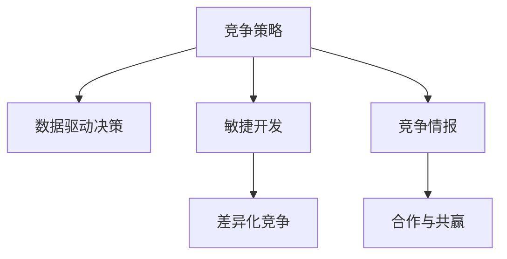

                 

# 如何进行竞争策略：如何保持竞争优势和取得成功？

在当今这个快速变化的市场环境中，保持竞争优势并取得成功是一项艰巨的任务。然而，通过深入理解和应用竞争策略，企业可以构建一个可持续发展的生态系统，从而在激烈的市场竞争中脱颖而出。本文将全面介绍竞争策略的核心概念、算法原理、具体操作步骤以及实际应用场景，为读者提供深入的洞察和实用的技术指导。

## 1. 背景介绍

### 1.1 问题由来

随着全球化和数字化的加速，市场竞争变得日益激烈。传统的竞争策略，如价格战、产品同质化竞争，已经不再具有长久的可持续性。现代企业需要采用更加系统化、智能化的竞争策略，以在不断变化的市场环境中保持领先地位。

### 1.2 问题核心关键点

现代竞争策略的核心关键点包括：

- **数据驱动决策**：利用大数据和机器学习技术，深入理解市场和客户需求。
- **敏捷开发与快速迭代**：通过敏捷开发和快速迭代，及时响应市场变化，优化产品和服务。
- **竞争情报分析**：通过竞争情报分析，及时发现竞争对手的动向，调整自己的策略。
- **差异化竞争**：通过差异化产品和服务，在市场中找到独特的定位。
- **合作与共赢**：通过合作和共赢，构建生态系统，共同应对市场挑战。

## 2. 核心概念与联系

### 2.1 核心概念概述

- **竞争策略**：企业为了在市场竞争中保持优势，制定的一系列策略和方法。
- **数据驱动决策**：利用数据分析和机器学习技术，辅助企业做出更加科学和精准的决策。
- **敏捷开发**：快速响应市场变化，持续优化产品和服务。
- **竞争情报**：对竞争对手的市场活动进行监控和分析，及时调整自己的策略。
- **差异化竞争**：通过独特的产品和服务，获得竞争优势。
- **合作与共赢**：与合作伙伴建立长期合作关系，共同应对市场挑战。

这些概念之间的逻辑关系可以通过以下Mermaid流程图来展示：



这个流程图展示了我文中的核心概念及其之间的关系：

1. 竞争策略是贯穿整个企业运营的核心。
2. 数据驱动决策和敏捷开发是竞争策略的具体实施手段。
3. 竞争情报和差异化竞争则是企业在市场竞争中的防御和进攻手段。
4. 合作与共赢则是构建企业生态系统的基石。

## 3. 核心算法原理 & 具体操作步骤

### 3.1 算法原理概述

竞争策略的核心在于通过数据驱动和敏捷迭代，制定出科学的决策和持续优化策略。其中，数据驱动决策和敏捷开发是其两大基石。

数据驱动决策的算法原理可以概括为：

1. 收集和整理市场数据。
2. 利用数据分析技术，如统计学、机器学习等，挖掘数据中的关键信息和趋势。
3. 根据分析结果，制定和调整策略。

敏捷开发的算法原理可以概括为：

1. 将开发过程分解为小规模的、可迭代的开发单元。
2. 通过持续集成和快速反馈，不断优化开发成果。
3. 确保产品快速响应市场变化。

### 3.2 算法步骤详解

#### 数据驱动决策的步骤：

1. **数据收集**：收集市场数据，包括用户行为数据、市场趋势数据、竞争对手数据等。
2. **数据预处理**：清洗和整理数据，去除噪音和异常值，确保数据质量。
3. **数据分析**：使用统计学、机器学习等技术，进行数据挖掘和趋势分析，发现关键信息。
4. **策略制定**：根据分析结果，制定和调整竞争策略，如产品定位、市场细分、定价策略等。

#### 敏捷开发的步骤：

1. **需求分析**：定义产品的最小可行产品(MVP)和关键功能。
2. **迭代开发**：将开发过程分解为小迭代周期，每个迭代周期内进行需求实现、测试和反馈。
3. **持续集成**：将每个迭代周期内开发的成果进行集成和测试，确保产品质量。
4. **快速反馈**：通过市场测试和用户反馈，快速调整产品功能和策略。

### 3.3 算法优缺点

数据驱动决策的优点包括：

- 基于数据和事实决策，减少主观偏差。
- 科学分析和预测，提高决策的准确性和有效性。

缺点包括：

- 数据收集和分析过程复杂，成本较高。
- 需要专业人才和技术支持。

敏捷开发的优点包括：

- 快速响应市场变化，减少产品上市时间。
- 持续优化产品，提高用户体验和满意度。

缺点包括：

- 开发过程需要持续投入资源和技术支持。
- 需要频繁的沟通和协调，管理复杂度较高。

### 3.4 算法应用领域

数据驱动决策和敏捷开发在多个领域得到了广泛应用，包括：

- **电子商务**：通过数据分析和用户行为预测，优化产品推荐和定价策略。
- **金融科技**：通过市场数据和用户行为分析，制定投资策略和风险管理方案。
- **制造业**：通过数据分析和敏捷开发，优化生产流程和产品质量。
- **物流和供应链**：通过数据分析和敏捷迭代，优化物流网络和供应链管理。

## 4. 数学模型和公式 & 详细讲解 & 举例说明

### 4.1 数学模型构建

竞争策略的数学模型主要基于数据驱动和敏捷开发的基本原则，可以概括为：

1. **市场数据模型**：通过统计学和机器学习技术，构建市场趋势和用户行为模型。
2. **产品优化模型**：通过回归分析和优化算法，制定产品功能和价格策略。
3. **敏捷开发模型**：通过迭代和反馈机制，优化开发周期和产品质量。

### 4.2 公式推导过程

以市场数据模型为例，推导过程如下：

假设市场数据为 $D=\{(x_i, y_i)\}_{i=1}^N$，其中 $x_i$ 为市场特征，$y_i$ 为市场反应。市场趋势模型为 $f(x_i; \theta)$，其中 $\theta$ 为模型参数。

目标是最小化预测误差 $L(f(x_i; \theta), y_i)$，常用的优化目标函数为均方误差：

$$
\min_{\theta} \frac{1}{N} \sum_{i=1}^N (f(x_i; \theta) - y_i)^2
$$

### 4.3 案例分析与讲解

假设某电商平台希望优化其商品推荐策略。通过数据分析，发现用户购买行为与商品类别和价格有显著关系。利用线性回归模型进行预测：

$$
y_i = \beta_0 + \beta_1 x_{i1} + \beta_2 x_{i2} + \epsilon_i
$$

其中 $x_{i1}$ 为商品类别，$x_{i2}$ 为商品价格，$\epsilon_i$ 为随机误差。通过最小化预测误差，调整 $\beta_0, \beta_1, \beta_2$ 的值，从而优化商品推荐策略。

## 5. 项目实践：代码实例和详细解释说明

### 5.1 开发环境搭建

为了实现上述模型，需要搭建Python开发环境。具体步骤如下：

1. 安装Python 3.x和PyTorch。
2. 安装必要的库，如Pandas、NumPy、Scikit-Learn等。
3. 设置开发工具，如Jupyter Notebook、PyCharm等。

### 5.2 源代码详细实现

以下是一个简化的数据驱动决策的代码实现示例：

```python
import pandas as pd
from sklearn.linear_model import LinearRegression

# 读取市场数据
data = pd.read_csv('market_data.csv')

# 数据预处理
X = data[['x1', 'x2']]
y = data['y']

# 构建线性回归模型
model = LinearRegression()

# 训练模型
model.fit(X, y)

# 预测新数据
new_data = pd.DataFrame({'x1': [1, 2, 3], 'x2': [10, 20, 30]})
y_pred = model.predict(new_data)

print(y_pred)
```

### 5.3 代码解读与分析

以上代码展示了线性回归模型的实现过程。首先，通过Pandas库读取市场数据，然后进行数据预处理，构建线性回归模型，最后进行数据预测。代码简洁高效，适合数据驱动决策的快速实践。

## 6. 实际应用场景

### 6.1 电子商务

在电子商务领域，竞争策略的应用包括：

- **价格优化**：利用市场数据和用户行为预测，优化商品定价策略。
- **推荐系统**：通过数据分析和机器学习，优化商品推荐算法。
- **库存管理**：利用需求预测模型，优化库存管理和补货策略。

### 6.2 金融科技

在金融科技领域，竞争策略的应用包括：

- **投资策略制定**：利用市场数据和用户行为分析，制定投资组合和风险管理策略。
- **信贷评估**：通过数据分析和模型优化，提高信贷评估的准确性。
- **反欺诈检测**：利用机器学习技术，提高反欺诈检测的效率和准确性。

### 6.3 制造业

在制造业领域，竞争策略的应用包括：

- **供应链优化**：通过数据分析和敏捷开发，优化供应链网络和物流管理。
- **生产计划制定**：利用需求预测模型，优化生产计划和资源配置。
- **质量控制**：通过数据分析和持续改进，提高产品质量和生产效率。

### 6.4 未来应用展望

未来，随着数据量和计算能力的提升，竞争策略的应用将更加广泛和深入。通过更多的创新技术，如区块链、物联网、人工智能等，企业可以构建更加智能和高效的竞争生态系统。

## 7. 工具和资源推荐

### 7.1 学习资源推荐

为了深入了解竞争策略，以下是一些推荐的学习资源：

1. **《数据驱动决策》**：该书系统介绍了数据分析和数据驱动决策的原理和方法，适合初学者和专业人士。
2. **Coursera《数据科学专业课程》**：由世界名校提供，涵盖数据科学和机器学习的各个方面，提供丰富的实战案例。
3. **Kaggle**：数据科学竞赛平台，通过参加竞赛实践数据驱动决策技术。
4. **GitHub**：开源社区，提供大量的竞争策略项目和代码示例。

### 7.2 开发工具推荐

以下是一些常用的竞争策略开发工具：

1. **Python**：数据驱动决策和敏捷开发的核心开发语言。
2. **PyTorch**：深度学习框架，适合构建复杂的机器学习模型。
3. **Jupyter Notebook**：交互式编程环境，适合快速迭代开发和数据探索。
4. **Git**：版本控制系统，方便团队协作和代码管理。
5. **Docker**：容器化技术，方便模型部署和环境管理。

### 7.3 相关论文推荐

以下是一些经典的竞争策略相关论文：

1. **《竞争情报分析》**：详细介绍了竞争情报的收集、分析和应用，是竞争策略的重要参考。
2. **《敏捷开发的实践指南》**：提供了敏捷开发的理论基础和实践方法，适合企业参考。
3. **《市场驱动的创新管理》**：探讨了市场驱动创新管理的方法和案例，提供实际应用指导。
4. **《差异化竞争策略》**：研究了差异化竞争的理论基础和实现方法，适合企业决策参考。

## 8. 总结：未来发展趋势与挑战

### 8.1 总结

本文全面介绍了竞争策略的核心概念、算法原理和具体操作步骤，为读者提供了深入的洞察和实用的技术指导。通过理解数据驱动决策和敏捷开发的基本原理，企业可以构建一个科学、高效的竞争生态系统，在激烈的市场环境中保持领先地位。

### 8.2 未来发展趋势

未来，竞争策略的发展趋势包括：

1. **人工智能和大数据**：通过人工智能和大数据技术，进一步提升数据驱动决策的准确性和效率。
2. **区块链和物联网**：利用区块链和物联网技术，提高供应链和生产管理的透明度和效率。
3. **智能制造和智能服务**：通过智能制造和智能服务，提升产品和服务质量，优化用户体验。
4. **可持续发展和绿色经济**：利用竞争策略实现可持续发展，推动绿色经济的发展。

### 8.3 面临的挑战

竞争策略在实际应用中面临的挑战包括：

1. **数据隐私和安全**：数据驱动决策需要大量用户数据，数据隐私和安全问题亟需解决。
2. **技术实现难度**：竞争策略涉及多种技术手段，技术实现复杂度较高，需要专业人才和技术支持。
3. **管理协调难度**：竞争策略涉及多个部门和团队，管理协调难度较大，需要强有力的组织支持。
4. **市场变化不确定性**：市场变化复杂多变，难以通过模型完全预测，需要灵活应对。

### 8.4 研究展望

未来的研究需要关注以下几个方向：

1. **隐私保护技术**：研究隐私保护技术，如数据匿名化和差分隐私，确保数据安全。
2. **人工智能与大数据融合**：探索人工智能和大数据的融合应用，提升决策的准确性和效率。
3. **区块链和物联网技术**：研究区块链和物联网技术在供应链和生产管理中的应用，提升透明度和效率。
4. **可持续发展策略**：研究可持续发展策略，推动绿色经济的发展，提升企业社会责任。

## 9. 附录：常见问题与解答

**Q1：如何评估竞争策略的有效性？**

A: 竞争策略的有效性可以通过以下指标评估：

1. **市场份额**：评估企业在市场中的地位和影响力。
2. **用户满意度**：通过用户调查和反馈，评估产品和服务质量。
3. **收益增长**：评估企业的财务表现和收益增长情况。
4. **竞争力分析**：通过竞争情报分析，评估企业在市场中的竞争力。
5. **客户留存率**：评估客户忠诚度和用户留存情况。

**Q2：如何构建数据驱动的决策体系？**

A: 构建数据驱动的决策体系需要以下步骤：

1. **数据收集和管理**：构建数据收集和管理体系，确保数据质量和可用性。
2. **数据清洗和预处理**：清洗和预处理数据，去除噪音和异常值，确保数据质量。
3. **数据分析和建模**：利用数据分析和机器学习技术，构建市场趋势和用户行为模型。
4. **策略制定和调整**：根据分析结果，制定和调整竞争策略。
5. **模型评估和优化**：通过模型评估和优化，确保决策的准确性和有效性。

**Q3：敏捷开发和敏捷迭代的具体实现方法是什么？**

A: 敏捷开发和敏捷迭代的实现方法包括：

1. **敏捷框架选择**：选择适合的敏捷开发框架，如Scrum、Kanban等。
2. **迭代周期划分**：将开发过程分解为小迭代周期，每个周期1-2周。
3. **需求和任务管理**：使用任务管理和需求分析工具，如Jira、Trello等，明确开发任务和优先级。
4. **持续集成和反馈**：使用持续集成和反馈机制，及时发现和解决问题。
5. **代码审查和测试**：通过代码审查和测试，确保开发质量和稳定性。

**Q4：如何通过数据分析提升用户满意度？**

A: 通过数据分析提升用户满意度的具体方法包括：

1. **用户行为分析**：通过数据分析，了解用户行为和需求。
2. **用户反馈收集**：通过问卷调查、用户访谈等方式，收集用户反馈。
3. **用户画像构建**：通过数据分析和用户反馈，构建用户画像，了解用户特征和偏好。
4. **个性化推荐**：利用用户画像和数据分析，实现个性化推荐，提高用户满意度。
5. **用户情感分析**：通过自然语言处理技术，分析用户评论和反馈，了解用户情感和态度。

**Q5：如何构建智能制造和智能服务生态系统？**

A: 构建智能制造和智能服务生态系统的具体方法包括：

1. **智能制造平台**：构建智能制造平台，实现生产过程的数字化和自动化。
2. **物联网设备部署**：在生产设备和物流系统中部署物联网设备，实现设备互联和数据采集。
3. **数据分析和优化**：利用大数据和机器学习技术，优化生产流程和物流管理。
4. **协同制造和供应链管理**：利用区块链和智能合约技术，实现供应链和协同制造的透明和高效。
5. **智能服务应用**：在智能制造平台的基础上，提供智能服务应用，如远程监控、故障预测等。

---

作者：禅与计算机程序设计艺术 / Zen and the Art of Computer Programming

