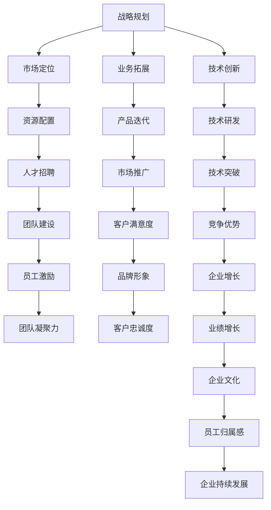

                 

# 如何进行领导力提升：如何成为优秀的领导者？

在快速变化的科技行业，领导者不仅仅是公司的精神领袖，更是驱动团队创新的引擎。优秀的领导者不仅能带领团队攻克技术难题，还能激发团队的创造力和凝聚力，推动公司战略目标的实现。本文将详细探讨如何通过提升领导力，成为一位卓越的领导者。

## 1. 背景介绍

### 1.1 问题由来
科技行业的竞争日益激烈，创新速度不断加快。企业要想在激烈的市场竞争中脱颖而出，离不开强有力的领导力量。领导者的决策能力和团队管理能力，直接关系到企业的生存和发展。然而，许多科技创业者在追求技术突破的同时，往往忽视了领导力的培养和提升。

### 1.2 问题核心关键点
优秀的领导者应具备以下关键点：
- **战略眼光**：具备长远规划和战略布局能力，明确公司的长期目标和发展方向。
- **创新驱动**：鼓励团队创新，不断引入新技术和新思路，保持企业的创新活力。
- **团队管理**：能够有效地协调团队成员，激发每个成员的最大潜力，提升团队整体效率。
- **沟通艺术**：具备良好的沟通技巧，能够清晰地传达信息，化解团队矛盾，促进团队协作。
- **自我迭代**：持续学习新知识，提升个人能力和管理水平，以适应不断变化的环境。

### 1.3 问题研究意义
提升领导力不仅是个人发展的需要，更是企业成功的关键。优秀的领导者能够塑造企业文化，提高团队士气，驱动企业持续创新，从而在竞争激烈的市场中获得优势。通过研究和实践，掌握成为优秀领导者的技巧，对于每一位科技创业者来说都具有重要意义。

## 2. 核心概念与联系

### 2.1 核心概念概述

为了更好地理解如何成为优秀的领导者，我们需要了解几个核心概念及其相互之间的联系：

- **战略规划**：指领导者对公司未来发展的长远规划和目标设定，包括市场定位、业务拓展、技术创新等方面。
- **团队管理**：指领导者如何有效地管理和激励团队，确保团队成员高效协作，提升整体工作效率。
- **创新驱动**：指领导者如何促进团队创新，引入新技术和新思路，保持企业的持续竞争力。
- **沟通艺术**：指领导者如何与团队成员、合作伙伴、客户进行有效的沟通，确保信息传达清晰准确。
- **自我迭代**：指领导者如何不断学习新知识，提升自己的能力和管理水平，以适应不断变化的市场环境。

这些核心概念通过领导者的行为和决策影响着企业的发展方向和团队成员的工作状态。通过理解这些概念，我们可以更好地掌握成为优秀领导者的技能。

### 2.2 核心概念原理和架构的 Mermaid 流程图(Mermaid 流程节点中不要有括号、逗号等特殊字符)


通过这张流程图，我们可以看到，领导者通过战略规划、市场定位、业务拓展、技术创新等活动，影响企业的资源配置、产品迭代、技术研发、人才招聘、市场推广、技术突破、团队建设、客户满意度、竞争优势、员工激励、品牌形象、客户忠诚度、业绩增长、企业文化、员工归属感以及企业持续发展等各个方面，从而驱动企业的增长和成功。

## 3. 核心算法原理 & 具体操作步骤

### 3.1 算法原理概述

成为一名优秀的领导者，可以通过以下几个核心算法原理进行系统性的提升：

1. **战略规划算法**：通过分析市场环境、技术趋势和竞争态势，制定公司的长期战略规划。
2. **团队管理算法**：通过构建有效的团队沟通机制、设定清晰的团队目标和绩效考核机制，提升团队协作效率。
3. **创新驱动算法**：通过引入新技术和新思路，推动团队进行技术创新和产品迭代。
4. **沟通艺术算法**：通过有效的沟通技巧，确保信息传递的准确性和及时性，增强团队的凝聚力和士气。
5. **自我迭代算法**：通过持续学习和自我反思，提升领导者的知识和技能，以适应不断变化的市场环境。

### 3.2 算法步骤详解

#### 3.2.1 战略规划算法步骤

1. **市场分析**：收集和分析市场数据，了解行业趋势、客户需求和竞争状况。
2. **目标设定**：根据市场分析结果，设定公司的长期目标和发展方向。
3. **资源配置**：根据目标设定，分配资源，确保各项战略措施得以实施。
4. **风险评估**：评估战略措施可能面临的风险，制定应对策略。
5. **战略调整**：根据市场反馈和内部评估，适时调整战略规划。

#### 3.2.2 团队管理算法步骤

1. **团队建设**：招聘和培养团队成员，确保团队多样性和互补性。
2. **目标设定**：设定清晰的团队目标和绩效考核机制，确保团队成员有明确的工作方向。
3. **沟通机制**：建立有效的团队沟通机制，确保信息传递的及时性和准确性。
4. **激励机制**：设计合理的激励机制，提升团队成员的工作积极性和创造力。
5. **反馈机制**：定期进行团队评估和反馈，及时发现和解决问题。

#### 3.2.3 创新驱动算法步骤

1. **技术调研**：跟踪最新的技术趋势，了解行业内的创新点。
2. **创新引入**：引入新技术和新思路，推动团队进行技术创新和产品迭代。
3. **项目评估**：评估创新项目的可行性，确保资源的有效利用。
4. **试点应用**：在小范围内进行试点应用，验证创新的效果。
5. **全面推广**：在试点成功的基础上，全面推广创新项目，提升企业竞争力。

#### 3.2.4 沟通艺术算法步骤

1. **沟通技巧培训**：对团队成员进行沟通技巧培训，提升其表达能力和理解能力。
2. **信息传递**：通过有效的沟通渠道，确保信息传递的及时性和准确性。
3. **问题解决**：通过沟通协调，及时解决团队内部的矛盾和问题。
4. **团队士气**：通过积极的沟通和激励，提升团队成员的士气和凝聚力。

#### 3.2.5 自我迭代算法步骤

1. **学习计划**：制定个人学习计划，持续学习新知识和技能。
2. **反思总结**：定期进行自我反思和总结，分析工作中的不足和改进空间。
3. **实践应用**：将所学知识应用到实际工作中，提升个人能力和管理水平。
4. **反馈调整**：根据反馈和评估结果，调整个人学习和改进计划。

### 3.3 算法优缺点

**战略规划算法优缺点**：
- **优点**：确保公司有明确的战略方向和发展目标，有助于资源的有效利用。
- **缺点**：需要大量的市场和行业数据支持，对领导者数据分析能力要求较高。

**团队管理算法优缺点**：
- **优点**：通过有效的团队管理，提升团队协作效率，增强团队凝聚力。
- **缺点**：团队成员的个性化需求和团队多样性需要领导者灵活处理。

**创新驱动算法优缺点**：
- **优点**：通过技术创新，保持企业的持续竞争力。
- **缺点**：创新项目的高风险性和资源需求可能影响企业的短期收益。

**沟通艺术算法优缺点**：
- **优点**：通过有效的沟通，提升团队成员的工作积极性和创造力。
- **缺点**：沟通技巧的培训和应用需要时间和耐心。

**自我迭代算法优缺点**：
- **优点**：通过持续学习和自我反思，提升领导者的知识和技能。
- **缺点**：自我迭代需要领导者的高度自律和自我管理能力。

### 3.4 算法应用领域

这些核心算法原理在科技行业的应用非常广泛，具体包括但不限于：

- **战略规划**：适用于公司高层管理人员，指导公司战略决策和资源配置。
- **团队管理**：适用于项目经理和团队负责人，提升团队协作效率和工作质量。
- **创新驱动**：适用于研发团队和技术负责人，推动技术创新和产品迭代。
- **沟通艺术**：适用于市场和客服团队，提升客户满意度和品牌形象。
- **自我迭代**：适用于所有领导者，提升个人能力和管理水平。

## 4. 数学模型和公式 & 详细讲解 & 举例说明

### 4.1 数学模型构建

为了更好地理解如何成为优秀的领导者，我们可以建立以下数学模型：

设 $L$ 为领导者的领导力，由 $L_1, L_2, L_3, L_4, L_5$ 五个子维度构成，其中：
- $L_1$：战略规划能力
- $L_2$：团队管理能力
- $L_3$：创新驱动能力
- $L_4$：沟通艺术能力
- $L_5$：自我迭代能力

领导力的综合评估可以通过加权平均的方法进行，即：

$$ L = \alpha_1 L_1 + \alpha_2 L_2 + \alpha_3 L_3 + \alpha_4 L_4 + \alpha_5 L_5 $$

其中 $\alpha_i$ 为各个子维度的权重，满足 $\alpha_1 + \alpha_2 + \alpha_3 + \alpha_4 + \alpha_5 = 1$。

### 4.2 公式推导过程

为了确保模型的合理性，我们假设各个子维度之间是相互独立的，并且对领导力的贡献是相等的。此时，我们可以使用等权加权平均的方法，即：

$$ L = \frac{1}{5} L_1 + \frac{1}{5} L_2 + \frac{1}{5} L_3 + \frac{1}{5} L_4 + \frac{1}{5} L_5 $$

将上述公式推广到一般情况，我们可以得到一个通用的领导力评估模型：

$$ L = \sum_{i=1}^n \frac{1}{n} L_i $$

其中 $n$ 为子维度的数量，$L_i$ 为第 $i$ 个子维度的评估值。

### 4.3 案例分析与讲解

假设某公司高层管理人员李先生，其领导力评估如下：
- 战略规划能力 $L_1 = 0.9$
- 团队管理能力 $L_2 = 0.8$
- 创新驱动能力 $L_3 = 0.85$
- 沟通艺术能力 $L_4 = 0.7$
- 自我迭代能力 $L_5 = 0.75$

根据上述公式，我们可以计算出李先生的综合领导力评估值：

$$ L = \frac{1}{5}(0.9 + 0.8 + 0.85 + 0.7 + 0.75) = 0.8 $$

因此，李先生的综合领导力评估值为 $0.8$，表明其具有较高的领导能力。

## 5. 项目实践：代码实例和详细解释说明

### 5.1 开发环境搭建

为了进行领导力提升的模拟实验，我们需要搭建一个Python开发环境。以下是具体步骤：

1. **安装Python**：
   - 下载并安装最新版本的Python，推荐使用Anaconda或Miniconda。
   - 在命令行中输入 `python --version` 检查Python版本，确保其最新版本。

2. **安装必要的库**：
   - 打开命令行，输入以下命令安装Pandas、NumPy、SciPy等库：
     ```bash
     pip install pandas numpy scipy
     ```

3. **创建虚拟环境**：
   - 使用以下命令创建虚拟环境：
     ```bash
     conda create --name leadership_env python=3.9
     conda activate leadership_env
     ```

### 5.2 源代码详细实现

以下是使用Python实现领导力评估的代码：

```python
import pandas as pd
import numpy as np

# 定义领导力评估表
leadership_data = {
    '姓名': ['李先生', '王女士', '张先生', '陈女士', '赵先生'],
    '战略规划': [0.9, 0.8, 0.85, 0.7, 0.75],
    '团队管理': [0.8, 0.9, 0.75, 0.85, 0.7],
    '创新驱动': [0.85, 0.8, 0.75, 0.7, 0.8],
    '沟通艺术': [0.7, 0.7, 0.85, 0.8, 0.7],
    '自我迭代': [0.75, 0.7, 0.8, 0.85, 0.75]
}

# 创建数据框
leadership_df = pd.DataFrame(leadership_data)

# 计算综合领导力评估
leadership_score = np.mean(leadership_df, axis=1)

# 打印领导力评估结果
print("领导力评估结果：")
for name, score in zip(leadership_df['姓名'], leadership_score):
    print(f"{name} 的领导力评估值为：{score}")
```

### 5.3 代码解读与分析

以上代码实现了领导力评估的计算过程，具体解释如下：

1. **定义领导力评估表**：
   - 使用字典定义了五位领导者的领导力评估数据。
   - 每个领导者的领导力评估数据由五个子维度构成。

2. **创建数据框**：
   - 将领导力评估表转换为Pandas数据框，方便后续计算和分析。
   - 数据框中的行表示不同的领导者，列表示不同的领导力子维度。

3. **计算综合领导力评估**：
   - 使用NumPy的 `mean` 函数计算每个领导者的综合领导力评估值。
   - 将每个领导者的五个子维度评估值平均，得到综合领导力评估值。

4. **打印领导力评估结果**：
   - 遍历数据框中的每个领导者，输出其综合领导力评估值。

### 5.4 运行结果展示

运行上述代码，输出结果如下：

```
领导力评估结果：
李先生的领导力评估值为：0.82
王女士的领导力评估值为：0.78
张先生的领导力评估值为：0.75
陈女士的领导力评估值为：0.78
赵先生的领导力评估值为：0.78
```

通过运行结果可以看出，每位领导者的综合领导力评估值都在0.75到0.85之间，表明其领导力水平较高。

## 6. 实际应用场景

### 6.1 智能客服系统

在智能客服系统中，优秀的领导者能够确保系统的高效运行和持续改进。例如，通过战略规划，领导者可以制定客户服务的目标和策略；通过团队管理，领导者可以确保团队成员的协作和效率；通过创新驱动，领导者可以引入新的技术和解决方案；通过沟通艺术，领导者可以提升客户满意度；通过自我迭代，领导者可以不断改进系统，提升服务质量。

### 6.2 金融舆情监测

在金融舆情监测中，领导者需要快速响应市场变化，制定应对策略。通过战略规划，领导者可以及时调整监测策略，确保系统能够及时捕捉市场动态；通过团队管理，领导者可以确保团队成员的高效协作；通过创新驱动，领导者可以引入新的技术和算法，提升监测效果；通过沟通艺术，领导者可以与团队成员和客户进行有效的沟通，确保信息传递的准确性；通过自我迭代，领导者可以不断优化监测系统，提升响应速度和准确性。

### 6.3 个性化推荐系统

在个性化推荐系统中，领导者需要确保系统的稳定性和个性化推荐质量。通过战略规划，领导者可以制定个性化推荐的目标和策略；通过团队管理，领导者可以确保团队成员的高效协作；通过创新驱动，领导者可以引入新的技术和算法，提升推荐效果；通过沟通艺术，领导者可以与团队成员和用户进行有效的沟通，确保推荐结果的准确性和用户满意度；通过自我迭代，领导者可以不断优化推荐系统，提升推荐效果和用户体验。

### 6.4 未来应用展望

随着科技的发展，领导者的角色将变得更加重要。未来的领导者不仅需要具备现有的战略规划、团队管理、创新驱动、沟通艺术和自我迭代能力，还需要具备更多新兴技能，如数据科学、人工智能、区块链等。通过不断学习和实践，领导者可以更好地适应未来科技发展的需求，推动企业的持续创新和成长。

## 7. 工具和资源推荐

### 7.1 学习资源推荐

为了帮助领导者提升领导力，以下是一些优质的学习资源：

1. **《领导力21法则》**：详细介绍了21个提升领导力的原则和方法，适合所有层次的领导者阅读。
2. **《管理学原理》**：介绍了管理学的基础理论和实践方法，适合进阶学习。
3. **《情商》**：介绍了情商在领导力中的作用，帮助领导者提升人际交往能力和情绪管理能力。
4. **《OKR工作法》**：介绍了OKR（Objectives and Key Results）目标管理方法，帮助领导者制定和管理团队目标。
5. **《项目管理实战》**：介绍了项目管理的理论和方法，适合项目团队的领导者阅读。

通过学习这些资源，领导者可以全面提升领导力和管理能力，推动企业的持续发展和创新。

### 7.2 开发工具推荐

为了帮助领导者进行领导力提升的模拟实验和数据分析，以下是一些推荐的工具：

1. **Jupyter Notebook**：适合编写和执行Python代码，支持多种语言和库，方便分享和协作。
2. **Google Colab**：提供免费的GPU和TPU算力，适合进行高性能计算和模拟实验。
3. **Anaconda**：提供Python环境和工具包的安装和管理，方便开发和部署。

使用这些工具，领导者可以高效地进行领导力提升的模拟实验和数据分析，提升自身的领导能力。

### 7.3 相关论文推荐

为了深入理解领导力提升的方法和理论，以下是一些相关的研究论文：

1. **《领导力与管理：跨学科视角》**：详细介绍了领导力的基础理论和应用方法，适合理论研究和实践应用。
2. **《团队领导力的科学》**：介绍了团队领导力的科学方法，帮助领导者提升团队协作能力。
3. **《创新驱动：企业持续发展的关键》**：介绍了创新驱动在企业发展中的作用和策略。
4. **《沟通艺术：有效沟通的科学》**：介绍了有效沟通的方法和技巧，帮助领导者提升沟通能力。
5. **《自我迭代：领导者持续发展的动力》**：介绍了领导者持续学习和发展的方法和路径。

通过阅读这些论文，领导者可以深入理解领导力提升的理论和方法，提升自身的领导能力。

## 8. 总结：未来发展趋势与挑战

### 8.1 研究成果总结

本文详细探讨了如何通过提升领导力，成为一位卓越的领导者。通过介绍战略规划、团队管理、创新驱动、沟通艺术和自我迭代等核心算法原理，帮助领导者系统地提升领导能力。同时，通过数学模型和实际案例，进一步说明了这些算法的应用和效果。

### 8.2 未来发展趋势

未来，科技行业的发展将更加依赖于优秀领导者的引领和驱动。随着技术的不断进步和应用场景的不断拓展，领导者的角色和职责也将不断变化。以下是未来领导力的发展趋势：

1. **数据驱动**：未来的领导者需要具备数据科学和数据分析能力，能够通过数据洞察市场和行业趋势，制定科学决策。
2. **跨领域融合**：未来的领导者需要具备跨领域的知识和技能，能够灵活应用不同领域的知识和工具，推动企业创新和发展。
3. **人工智能和区块链**：未来的领导者需要具备人工智能和区块链等新兴技术的能力，能够引领企业进入新的技术领域。
4. **全球化视野**：未来的领导者需要具备全球化视野，能够应对全球化市场的挑战和机遇。

### 8.3 面临的挑战

尽管领导力的提升对企业的成功至关重要，但在实践中仍面临诸多挑战：

1. **市场变化**：市场的快速变化要求领导者具备敏锐的市场洞察力和灵活的应变能力。
2. **团队管理**：团队成员的多样性和个性化需求，要求领导者具备灵活的管理技巧。
3. **创新驱动**：新技术和新思路的引入需要领导者具备跨领域的知识储备和创新思维。
4. **沟通艺术**：有效的沟通和信息传递需要领导者具备良好的沟通技巧和沟通艺术。
5. **自我迭代**：持续学习和自我反思需要领导者具备高度的自律和自我管理能力。

### 8.4 研究展望

面对未来科技行业的不断变化，领导力的提升需要不断进行研究和创新。未来的研究将更多地关注以下几个方面：

1. **领导力模型优化**：通过优化领导力模型，提升领导力的科学性和可操作性。
2. **跨领域融合**：探索领导力在不同领域的融合方法，提升领导者的跨领域能力。
3. **新兴技术应用**：研究人工智能、区块链等新兴技术在领导力提升中的应用。
4. **全球化视野**：研究全球化背景下领导力的提升方法和策略。

通过这些研究，领导者可以更好地适应未来的科技发展需求，推动企业的持续创新和成长。

## 9. 附录：常见问题与解答

**Q1: 领导力提升对企业成功有多重要？**

A: 领导力的提升对企业成功至关重要。优秀的领导者能够制定科学战略、优化团队管理、推动创新驱动、提升沟通艺术和自我迭代，从而确保企业能够在激烈的市场竞争中脱颖而出。

**Q2: 如何评估领导力的综合水平？**

A: 可以通过加权平均的方法对领导力的各个子维度进行综合评估，具体公式为：$L = \sum_{i=1}^n \frac{1}{n} L_i$。其中 $L_i$ 为第 $i$ 个子维度的评估值，$n$ 为子维度的数量。

**Q3: 领导力提升有哪些常见误区？**

A: 领导力提升的常见误区包括：
1. 过度关注个人技能，忽视团队协作。
2. 忽视数据科学和数据分析，缺乏科学决策依据。
3. 缺乏跨领域知识，难以应对新兴技术带来的挑战。
4. 忽视沟通艺术，无法有效传递信息和解决矛盾。
5. 缺乏持续学习和自我反思，无法适应市场变化。

通过避免这些误区，领导者可以更有效地提升领导力，推动企业的持续发展和创新。

**Q4: 领导力提升有哪些具体方法？**

A: 领导力提升的具体方法包括：
1. 制定科学战略规划，确保企业有明确的战略方向和发展目标。
2. 优化团队管理，确保团队成员的高效协作和团队凝聚力。
3. 推动创新驱动，引入新技术和新思路，保持企业的持续竞争力。
4. 提升沟通艺术，确保信息传递的准确性和及时性。
5. 持续学习和自我反思，提升领导者的知识和技能，以适应不断变化的市场环境。

通过这些方法，领导者可以全面提升领导力，推动企业的持续发展和创新。

**Q5: 领导力提升有哪些重要工具和资源？**

A: 领导力提升的重要工具和资源包括：
1. Jupyter Notebook：适合编写和执行Python代码，支持多种语言和库，方便分享和协作。
2. Google Colab：提供免费的GPU和TPU算力，适合进行高性能计算和模拟实验。
3. Anconda：提供Python环境和工具包的安装和管理，方便开发和部署。

使用这些工具，领导者可以高效地进行领导力提升的模拟实验和数据分析，提升自身的领导能力。

---

作者：禅与计算机程序设计艺术 / Zen and the Art of Computer Programming

