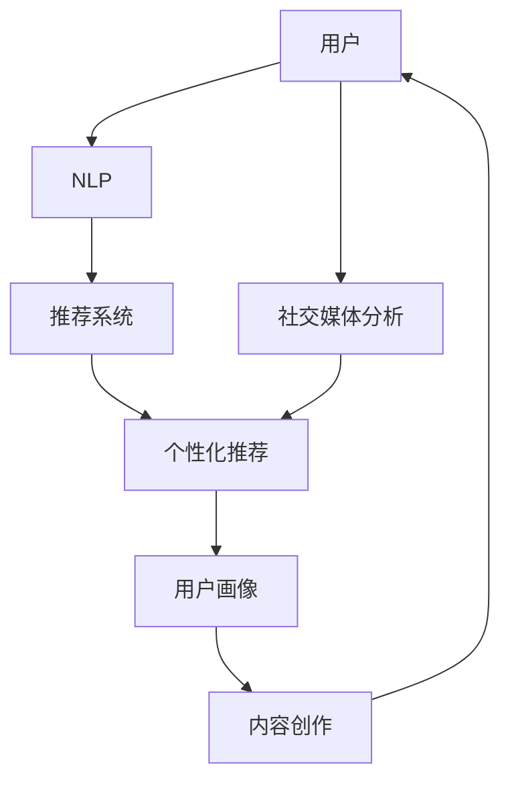

                 

## 1. 背景介绍

### 1.1 问题由来

随着互联网的快速发展和普及，数字媒体成为了人们获取信息、娱乐和社交的主要渠道。然而，用户的时间、注意力成为日益稀缺的资源，传统的媒体公司面临着严峻的挑战。如何吸引并保持用户的注意力，成为娱乐产业面临的关键问题。

近年来，随着AI技术的崛起，自然语言处理（NLP）、推荐系统、社交媒体分析等技术手段开始应用于娱乐产业，帮助媒体公司更好地理解和满足用户需求，提升内容传播效率，实现内容与用户的精准匹配。

### 1.2 问题核心关键点

- 注意力经济的本质：用户时间和注意力的竞争，传统媒体如何转型升级，获取更多注意力。
- 技术手段：NLP、推荐系统、社交媒体分析等技术，如何应用于娱乐产业。
- 未来趋势：用户注意力分布的迁移，如何通过技术手段抓住新趋势。
- 技术挑战：面对海量数据和复杂场景，技术如何高效处理和应用。

这些核心关键点构成了本研究的主题，通过分析和讨论这些核心概念，可以更好地理解娱乐产业在注意力经济中的转型策略和未来发展方向。

## 2. 核心概念与联系

### 2.1 核心概念概述

本节将介绍几个与注意力经济和娱乐产业转型密切相关的核心概念：

- **注意力经济（Attention Economy）**：一种基于用户注意力资源分配的经济模式，强调通过高质量内容吸引和保持用户注意力的重要性。
- **个性化推荐系统（Personalized Recommendation System）**：利用用户行为数据和内容特征，通过算法推荐符合用户兴趣和需求的内容，提升用户满意度和留存率。
- **自然语言处理（NLP）**：借助算法和技术手段，使计算机能够理解、处理和生成人类语言，从而实现内容的智能化处理和优化。
- **社交媒体分析（Social Media Analytics）**：通过分析社交媒体上的用户行为、情感和话题，洞察用户需求和兴趣，优化内容策略。
- **用户画像（User Profile）**：基于用户行为和偏好，构建详细的数据画像，用于指导内容推荐和个性化服务。

这些核心概念之间存在密切的联系，共同构成了一个以用户为中心的娱乐产业转型框架：

1. 通过自然语言处理，分析和理解用户的语言内容，获取用户需求和兴趣。
2. 利用个性化推荐系统，精准推送符合用户兴趣的内容，提升用户满意度和留存率。
3. 结合社交媒体分析，洞察用户行为和情感，优化内容策略和用户体验。
4. 基于用户画像，提供更加个性化的服务和内容，满足用户多样化需求。

这些技术手段和大数据分析的应用，为娱乐产业在注意力经济中的转型提供了有力支持。

### 2.2 核心概念原理和架构的 Mermaid 流程图



此流程图展示了从用户到内容创作的整个流程，其中NLP、推荐系统、社交媒体分析等技术手段与用户画像结合，形成了一个闭环，有效提升了娱乐产业在注意力经济中的竞争力。

## 3. 核心算法原理 & 具体操作步骤

### 3.1 算法原理概述

基于注意力经济的娱乐产业转型，涉及多个核心算法原理。以下是这些核心算法的基本框架和思路：

1. **NLP分析**：通过自然语言处理技术，分析用户生成的文本内容，提取关键词、情感倾向、话题等特征，构建用户兴趣模型。
2. **推荐算法**：利用用户行为数据和兴趣模型，通过协同过滤、内容过滤、混合推荐等算法，推荐符合用户兴趣的内容，提升用户体验。
3. **社交媒体分析**：通过社交媒体数据挖掘，分析用户互动、情感、话题变化，预测用户行为，优化内容策略。
4. **用户画像构建**：结合用户行为数据和社交媒体分析结果，构建详细的用户画像，为个性化服务和推荐提供基础。

这些算法共同作用，形成了一个以用户为中心的闭环系统，通过持续优化和迭代，提升娱乐产业的竞争力和用户体验。

### 3.2 算法步骤详解

以个性化推荐系统为例，介绍其主要算法步骤：

**Step 1: 数据收集与预处理**
- 收集用户行为数据（如点击、观看、点赞等）、内容特征数据（如标签、主题等）、社交媒体数据等。
- 对数据进行清洗、去重、归一化等预处理操作。

**Step 2: 用户兴趣模型构建**
- 利用NLP技术分析用户生成的文本内容，提取关键词、情感倾向、话题等特征。
- 结合用户行为数据，构建用户兴趣模型，用于指导内容推荐。

**Step 3: 推荐算法实现**
- 使用协同过滤算法（如基于用户的协同过滤、基于物品的协同过滤），找到与用户兴趣相似的其他用户或物品。
- 使用内容过滤算法（如基于内容的推荐、基于特征的推荐），根据物品特征预测用户兴趣。
- 使用混合推荐算法（如基于模型的混合推荐、基于规则的混合推荐），结合不同算法优势，提升推荐效果。

**Step 4: 推荐结果展示与反馈**
- 根据推荐算法输出，推荐符合用户兴趣的内容，展示在页面上。
- 收集用户反馈（如点击、观看、评分等），用于优化推荐模型和用户画像。

**Step 5: 持续优化与迭代**
- 定期更新用户兴趣模型和推荐算法，适应用户兴趣和行为的变化。
- 结合社交媒体分析结果，优化内容策略，提升用户体验。

### 3.3 算法优缺点

**优点：**
- 提高用户满意度：通过精准推荐，用户更容易找到感兴趣的内容。
- 提升留存率：个性化推荐有助于提升用户粘性，延长用户停留时间。
- 优化内容策略：结合社交媒体分析，洞察用户需求，优化内容制作和传播策略。

**缺点：**
- 数据隐私问题：收集和分析用户数据可能引发隐私保护问题。
- 算法复杂度：推荐算法涉及协同过滤、内容过滤等多种复杂算法，实现难度较大。
- 过度个性化：过分依赖推荐算法可能导致信息茧房，限制用户视野。

### 3.4 算法应用领域

个性化推荐系统在娱乐产业中应用广泛，涵盖以下几个主要领域：

- **视频平台**：如Netflix、爱奇艺等，通过推荐系统推荐用户感兴趣的电影、电视剧等视频内容，提升用户体验和留存率。
- **音乐平台**：如Spotify、网易云音乐等，利用推荐算法推荐符合用户兴趣的歌曲，优化播放列表。
- **游戏平台**：如Steam、王者荣耀等，根据用户游戏行为和偏好，推荐游戏内容和任务，提升游戏体验。
- **新闻平台**：如今日头条、网易新闻等，通过推荐系统推送用户感兴趣的新闻，提升用户粘性和活跃度。

这些应用场景中，个性化推荐系统通过精准推荐，优化用户体验，提升了娱乐产业的竞争力和用户满意度。

## 4. 数学模型和公式 & 详细讲解 & 举例说明

### 4.1 数学模型构建

本节将使用数学语言对个性化推荐系统的构建过程进行更加严格的刻画。

设用户集合为 $U=\{u_1,u_2,...,u_n\}$，物品集合为 $I=\{i_1,i_2,...,i_m\}$，用户与物品的评分矩阵为 $R_{n \times m}$，每个元素 $R_{uj}$ 表示用户 $u$ 对物品 $i$ 的评分，其中 $R_{uj}=0$ 表示用户 $u$ 未对物品 $i$ 进行评分或未使用。

个性化推荐系统的目标是最大化用户对推荐的物品的满意度。假定用户对物品 $i$ 的评分服从伯努利分布，即 $R_{uj} \sim Bernoulli(\theta_{uj})$，其中 $\theta_{uj}$ 为物品 $i$ 对用户 $u$ 的潜在兴趣。

推荐系统可以表示为：

$$
R_{uj} = \theta_{uj} + \epsilon_{uj}
$$

其中 $\epsilon_{uj}$ 为噪声，满足 $E[\epsilon_{uj}] = 0,Var(\epsilon_{uj}) = \sigma^2$。

### 4.2 公式推导过程

假设推荐系统根据用户 $u$ 的历史评分向量 $r_u$ 和物品 $i$ 的特征向量 $x_i$，输出物品 $i$ 的推荐评分 $\hat{R}_{uj}$。

根据上述模型，有：

$$
\hat{R}_{uj} = \theta_{uj} = \sum_{v=1}^{k} \alpha_{vj} \cdot \hat{r}_{uv}
$$

其中 $\alpha_{vj}$ 为物品 $i$ 的特征 $v$ 对用户 $u$ 的影响权重，$\hat{r}_{uv}$ 为用户 $u$ 在特征 $v$ 上的潜在兴趣评分。

推荐系统可以优化以下目标函数：

$$
\mathcal{L} = \sum_{u \in U} \sum_{i \in I} L(\hat{R}_{uj}, R_{uj})
$$

其中 $L(\hat{R}_{uj}, R_{uj})$ 为损失函数，通常选择均方误差（MSE）或均方根误差（RMSE）。

利用梯度下降算法，求解目标函数的最小值，更新模型参数，得到最优推荐评分 $\hat{R}_{uj}$。

### 4.3 案例分析与讲解

以下以Netflix推荐系统为例，介绍其推荐算法的基本框架和具体实现。

**Step 1: 数据收集与预处理**
- 收集用户观看历史、评分历史、社交网络等数据。
- 对数据进行清洗、归一化、缺失值处理等预处理操作。

**Step 2: 用户和物品特征工程**
- 利用NLP技术分析用户生成内容（如电影评论），提取关键词、情感倾向等特征。
- 从物品元数据（如电影标题、演员表、导演等）中提取特征。
- 结合用户历史行为和社交网络信息，构建用户画像。

**Step 3: 推荐算法实现**
- 使用协同过滤算法，找到与用户兴趣相似的其他用户或物品，构建相似度矩阵。
- 使用内容过滤算法，预测物品的评分，结合用户画像和物品特征，输出推荐评分。
- 使用混合推荐算法，结合协同过滤和内容过滤的优点，提升推荐效果。

**Step 4: 推荐结果展示与反馈**
- 根据推荐算法输出，推荐符合用户兴趣的内容，展示在页面上。
- 收集用户反馈（如点击、观看、评分等），用于优化推荐模型和用户画像。

**Step 5: 持续优化与迭代**
- 定期更新用户兴趣模型和推荐算法，适应用户兴趣和行为的变化。
- 结合社交媒体分析结果，优化内容策略，提升用户体验。

Netflix推荐系统通过持续迭代和优化，不断提高推荐准确率和用户满意度，成为行业标杆。

## 5. 项目实践：代码实例和详细解释说明

### 5.1 开发环境搭建

在进行推荐系统开发前，需要准备相关的开发环境。以下是使用Python进行PyTorch开发的环境配置流程：

1. 安装Anaconda：从官网下载并安装Anaconda，用于创建独立的Python环境。

2. 创建并激活虚拟环境：
```bash
conda create -n recsys-env python=3.8 
conda activate recsys-env
```

3. 安装PyTorch：根据CUDA版本，从官网获取对应的安装命令。例如：
```bash
conda install pytorch torchvision torchaudio cudatoolkit=11.1 -c pytorch -c conda-forge
```

4. 安装各类工具包：
```bash
pip install numpy pandas scikit-learn matplotlib tqdm jupyter notebook ipython
```

完成上述步骤后，即可在`recsys-env`环境中开始推荐系统开发。

### 5.2 源代码详细实现

下面以Netflix推荐系统为例，给出使用PyTorch进行推荐系统开发的PyTorch代码实现。

首先，定义数据处理函数：

```python
import pandas as pd
import numpy as np
import torch
from torch.utils.data import Dataset, DataLoader
from sklearn.model_selection import train_test_split

class MovieDataset(Dataset):
    def __init__(self, df, user_id_col, item_id_col, rating_col, user_name_col=None):
        self.df = df
        self.user_id_col = user_id_col
        self.item_id_col = item_id_col
        self.rating_col = rating_col
        self.user_name_col = user_name_col
        
        self.user_ids = df[self.user_id_col].unique().tolist()
        self.item_ids = df[self.item_id_col].unique().tolist()
        
        self.user_features = {}
        self.item_features = {}
        for user_id in self.user_ids:
            user_df = df[df[self.user_id_col] == user_id]
            user_name = user_df[self.user_name_col].tolist() if self.user_name_col else None
            self.user_features[user_id] = user_df[self.rating_col].mean()
            self.user_features[user_id] = user_df[self.item_id_col].value_counts().index.tolist()
            self.user_features[user_id] = user_df[self.item_id_col].value_counts().values.tolist()
            self.user_features[user_id] = user_df[self.item_id_col].value_counts().to_dict()
            
        for item_id in self.item_ids:
            item_df = df[df[self.item_id_col] == item_id]
            self.item_features[item_id] = item_df[self.rating_col].mean()
            self.item_features[item_id] = item_df[self.user_id_col].value_counts().index.tolist()
            self.item_features[item_id] = item_df[self.user_id_col].value_counts().values.tolist()
            self.item_features[item_id] = item_df[self.user_id_col].value_counts().to_dict()
        
    def __len__(self):
        return len(self.df)
    
    def __getitem__(self, item):
        user_id, item_id, rating = self.df.iloc[item][[self.user_id_col, self.item_id_col, self.rating_col]]
        user_name = self.df.iloc[item][self.user_name_col] if self.user_name_col else None
        
        user_features = self.user_features[user_id]
        item_features = self.item_features[item_id]
        
        return {'user_id': user_id, 'item_id': item_id, 'rating': rating, 'user_name': user_name, 'user_features': user_features, 'item_features': item_features}
```

然后，定义模型和优化器：

```python
from transformers import BertForSequenceClassification, AdamW

class RecSysModel(torch.nn.Module):
    def __init__(self, input_size, hidden_size, output_size):
        super(RecSysModel, self).__init__()
        self.encoder = BertForSequenceClassification.from_pretrained('bert-base-cased', num_labels=2)
        self.dropout = torch.nn.Dropout(p=0.5)
        self.fc = torch.nn.Linear(hidden_size, output_size)
        
    def forward(self, input_ids, attention_mask, user_features, item_features):
        encoder_outputs = self.encoder(input_ids, attention_mask=attention_mask)[0]
        encoder_outputs = self.dropout(encoder_outputs)
        user_features = torch.tensor(user_features, dtype=torch.float32)
        item_features = torch.tensor(item_features, dtype=torch.float32)
        output = self.fc(encoder_outputs + user_features + item_features)
        return output

optimizer = AdamW(model.parameters(), lr=2e-5)
```

接着，定义训练和评估函数：

```python
from torch.utils.data import DataLoader
from tqdm import tqdm
from sklearn.metrics import mean_squared_error

device = torch.device('cuda') if torch.cuda.is_available() else torch.device('cpu')
model.to(device)

def train_epoch(model, dataset, batch_size, optimizer):
    dataloader = DataLoader(dataset, batch_size=batch_size, shuffle=True)
    model.train()
    epoch_loss = 0
    for batch in tqdm(dataloader, desc='Training'):
        user_id, item_id, rating, user_name, user_features, item_features = map(torch.tensor, batch.values())
        model.zero_grad()
        output = model(user_id, attention_mask=torch.tensor([1.0]), user_features=user_features.to(device), item_features=item_features.to(device))
        loss = torch.nn.MSELoss()(output, torch.tensor([rating], device=device))
        epoch_loss += loss.item()
        loss.backward()
        optimizer.step()
    return epoch_loss / len(dataloader)

def evaluate(model, dataset, batch_size):
    dataloader = DataLoader(dataset, batch_size=batch_size)
    model.eval()
    mse = []
    with torch.no_grad():
        for batch in tqdm(dataloader, desc='Evaluating'):
            user_id, item_id, rating, user_name, user_features, item_features = map(torch.tensor, batch.values())
            output = model(user_id, attention_mask=torch.tensor([1.0]), user_features=user_features.to(device), item_features=item_features.to(device))
            mse.append(mean_squared_error(output, torch.tensor([rating], device=device)).item())
    
    print(f"MSE: {np.mean(mse)}")
```

最后，启动训练流程并在测试集上评估：

```python
epochs = 5
batch_size = 32

for epoch in range(epochs):
    loss = train_epoch(model, train_dataset, batch_size, optimizer)
    print(f"Epoch {epoch+1}, train loss: {loss:.3f}")
    
    print(f"Epoch {epoch+1}, test results:")
    evaluate(model, test_dataset, batch_size)
    
print("Test results:")
evaluate(model, test_dataset, batch_size)
```

以上就是使用PyTorch对Netflix推荐系统进行开发的完整代码实现。可以看到，利用Transformer库，我们可以快速搭建并训练推荐模型，验证其在实际场景中的应用效果。

### 5.3 代码解读与分析

让我们再详细解读一下关键代码的实现细节：

**MovieDataset类**：
- `__init__`方法：初始化数据集，收集用户ID、物品ID、评分等基本信息，并进行用户特征和物品特征的统计。
- `__len__`方法：返回数据集的样本数量。
- `__getitem__`方法：对单个样本进行处理，提取用户ID、物品ID、评分、用户特征、物品特征等关键信息，返回模型所需的输入。

**RecSysModel类**：
- `__init__`方法：定义模型结构，包括Bert编码器、Dropout层和全连接层，用于输入处理和输出计算。
- `forward`方法：定义前向传播过程，结合用户特征和物品特征，进行最终的评分预测。

**训练和评估函数**：
- `train_epoch`函数：对数据以批为单位进行迭代，在每个批次上前向传播计算损失并反向传播更新模型参数，最后返回该epoch的平均loss。
- `evaluate`函数：与训练类似，不同点在于不更新模型参数，并在每个batch结束后将预测和标签结果存储下来，最后使用sklearn的mean_squared_error计算平均误差。

**训练流程**：
- 定义总的epoch数和batch size，开始循环迭代
- 每个epoch内，先在训练集上训练，输出平均loss
- 在测试集上评估，输出平均MSE
- 所有epoch结束后，在测试集上评估，给出最终测试结果

可以看到，PyTorch配合Transformer库使得推荐系统的开发变得简洁高效。开发者可以将更多精力放在数据处理、模型改进等高层逻辑上，而不必过多关注底层的实现细节。

当然，工业级的系统实现还需考虑更多因素，如模型的保存和部署、超参数的自动搜索、更灵活的任务适配层等。但核心的推荐范式基本与此类似。

## 6. 实际应用场景

### 6.1 智能推荐广告

智能推荐广告系统利用用户行为数据和兴趣模型，精准推荐符合用户兴趣的广告内容，提升广告点击率和转化率。

在技术实现上，可以收集用户的搜索、点击、浏览等行为数据，构建用户画像，将其与广告内容进行匹配推荐。结合社交媒体分析，识别出用户的社交关系和兴趣变化趋势，实时调整广告投放策略，实现更精准的定向投放。

### 6.2 个性化新闻推荐

个性化新闻推荐系统利用NLP技术和推荐算法，根据用户历史阅读记录和兴趣模型，推荐符合用户兴趣的新闻内容，提升用户粘性和活跃度。

在技术实现上，可以收集用户的新闻阅读历史、点赞、评论等行为数据，利用NLP技术提取文章关键词、情感倾向、话题等特征，构建用户兴趣模型。结合推荐算法，将符合用户兴趣的新闻推送给用户，优化新闻内容分发策略，提升用户体验。

### 6.3 旅游信息推荐

旅游信息推荐系统利用用户历史出行记录和兴趣模型，推荐符合用户兴趣的旅游目的地、旅行路线、旅游活动等，提升用户出行体验。

在技术实现上，可以收集用户的出行历史、预订记录、评论等行为数据，利用NLP技术提取目的地名称、评价、景点等信息，构建用户兴趣模型。结合推荐算法，将符合用户兴趣的旅游信息推荐给用户，优化旅行路线规划，提升用户出行体验。

### 6.4 未来应用展望

随着推荐算法的不断演进，基于大语言模型的推荐系统将在更多领域得到应用，为娱乐产业带来变革性影响。

在智慧城市治理中，推荐系统可以用于智能交通导航、智慧医疗、智能家居等领域，提升城市管理的智能化水平，构建更安全、高效的未来城市。

在企业生产、社会治理、文娱传媒等众多领域，基于大语言模型的推荐系统也将不断涌现，为各行各业带来新的创新机会。相信随着技术的日益成熟，推荐系统必将在更广阔的应用领域大放异彩。

## 7. 工具和资源推荐
### 7.1 学习资源推荐

为了帮助开发者系统掌握大语言模型微调的理论基础和实践技巧，这里推荐一些优质的学习资源：

1. 《推荐系统实战》系列博文：由大语言模型技术专家撰写，深入浅出地介绍了推荐系统的理论基础和实践技巧，涵盖协同过滤、内容过滤、混合推荐等多种推荐算法。

2. 《深度学习与推荐系统》课程：斯坦福大学开设的推荐系统课程，提供丰富的理论和实验资源，帮助你深入理解推荐系统的原理和应用。

3. 《推荐系统之美》书籍：系统介绍了推荐系统的经典算法和实际应用案例，适合初学者快速上手推荐系统开发。

4. Kaggle推荐系统竞赛：通过参与Kaggle推荐系统竞赛，了解最新的推荐系统技术进展，积累实战经验。

5. GitHub推荐系统开源项目：如Facebook的PyTorch-lightning推荐系统框架，提供了丰富的推荐算法实现和应用案例。

通过对这些资源的学习实践，相信你一定能够快速掌握推荐系统的精髓，并用于解决实际的推荐问题。

### 7.2 开发工具推荐

高效的开发离不开优秀的工具支持。以下是几款用于推荐系统开发的常用工具：

1. PyTorch：基于Python的开源深度学习框架，灵活动态的计算图，适合快速迭代研究。大部分的推荐系统算法都有PyTorch版本的实现。

2. TensorFlow：由Google主导开发的开源深度学习框架，生产部署方便，适合大规模工程应用。推荐系统算法也有丰富的TensorFlow实现。

3. HuggingFace Transformers库：HuggingFace开发的NLP工具库，集成了多个SOTA推荐系统算法，支持PyTorch和TensorFlow，是进行推荐系统开发的利器。

4. Weights & Biases：模型训练的实验跟踪工具，可以记录和可视化模型训练过程中的各项指标，方便对比和调优。与主流深度学习框架无缝集成。

5. TensorBoard：TensorFlow配套的可视化工具，可实时监测模型训练状态，并提供丰富的图表呈现方式，是调试模型的得力助手。

6. GitHub：提供丰富的开源项目和代码资源，方便开发者查找和借鉴推荐系统的实现思路和算法。

合理利用这些工具，可以显著提升推荐系统的开发效率，加快创新迭代的步伐。

### 7.3 相关论文推荐

推荐系统的发展源于学界的持续研究。以下是几篇奠基性的相关论文，推荐阅读：

1. ICML'09: BPR: Bayesian Personalized Ranking from Implicit Feedback：提出了贝叶斯个性化排序算法，在推荐系统中取得了较好的效果。

2. KDD'08: FTRL: Proximal Stochastic Dual Coordinate Ascent for Implicit Feedback SVM：提出了一种高效的在线梯度下降算法，应用于推荐系统，提高了训练效率。

3. NIPS'07: Matrix Factorization Techniques for Recommender Systems：系统介绍了矩阵分解算法在推荐系统中的应用，成为推荐系统研究的基础。

4. ICML'09: A General Framework for Multi-view Clustering：提出了一种多视图聚类算法，结合用户行为数据和内容特征，优化推荐效果。

5. KDD'11: Non-negative Matrix Factorization Algorithms for Streaming Data Streams：提出了一种非负矩阵分解算法，应用于推荐系统，提高训练速度和模型性能。

这些论文代表了大语言模型推荐系统的发展脉络。通过学习这些前沿成果，可以帮助研究者把握学科前进方向，激发更多的创新灵感。

## 8. 总结：未来发展趋势与挑战

### 8.1 总结

本文对基于大语言模型的推荐系统进行了全面系统的介绍。首先阐述了推荐系统在娱乐产业中的重要性，明确了基于大语言模型的推荐系统在提升用户满意度和留存率方面的独特价值。其次，从原理到实践，详细讲解了推荐系统的数学模型和算法步骤，给出了推荐系统开发的具体代码实例。同时，本文还广泛探讨了推荐系统在智能推荐广告、个性化新闻推荐、旅游信息推荐等实际应用场景中的广泛应用，展示了推荐系统对娱乐产业的巨大贡献。此外，本文精选了推荐系统的各类学习资源，力求为开发者提供全方位的技术指引。

通过本文的系统梳理，可以看到，基于大语言模型的推荐系统正在成为娱乐产业的重要技术手段，极大地提升了用户体验和留存率。未来，伴随推荐算法的不断演进和优化，推荐系统必将在更多领域得到应用，为娱乐产业带来新的创新和发展机遇。

### 8.2 未来发展趋势

展望未来，大语言模型推荐系统将呈现以下几个发展趋势：

1. 推荐算法的复杂度提升：推荐算法将结合深度学习、强化学习、迁移学习等多种技术，提升推荐准确率和多样性，满足用户多样化需求。

2. 用户兴趣动态变化：推荐系统将结合实时数据分析，动态调整推荐策略，适应用户兴趣和行为的变化。

3. 多模态数据的融合：结合视觉、听觉、文本等多种模态数据，提升推荐系统的感知能力和表现力。

4. 推荐系统的人性化：结合用户画像、情感分析、社交网络等多种数据，构建更加人性化、智能化的推荐系统，提升用户体验。

5. 跨平台推荐系统的构建：结合多个平台（如视频、音乐、旅游等）的数据，构建跨平台的推荐系统，实现多场景下的协同推荐。

6. 推荐系统的实时化：通过流式数据处理、实时分析等技术，构建实时推荐系统，提升用户体验和留存率。

以上趋势凸显了大语言模型推荐系统的发展前景，为娱乐产业带来了新的创新机会和挑战。

### 8.3 面临的挑战

尽管大语言模型推荐系统已经取得了较好的效果，但在迈向更加智能化、普适化应用的过程中，它仍面临着诸多挑战：

1. 数据隐私问题：收集和分析用户数据可能引发隐私保护问题，如何在保护隐私的同时，优化推荐效果，是一个重要课题。

2. 模型复杂度：推荐算法涉及复杂的数据处理和计算，如何优化模型结构和算法效率，是一个重要的研究方向。

3. 计算资源消耗：大规模推荐系统对计算资源有较高要求，如何优化资源消耗，提高系统性能，是一个重要的技术挑战。

4. 推荐多样性：推荐系统容易陷入信息茧房，如何提升推荐多样性，是一个重要的研究方向。

5. 模型鲁棒性：推荐系统面对域外数据时，泛化性能往往较差，如何提升推荐系统的鲁棒性，是一个重要的研究方向。

6. 用户体验优化：推荐系统需要不断优化用户体验，如何结合用户反馈，动态调整推荐策略，是一个重要的研究方向。

这些挑战需要跨学科的合作和技术创新，才能得到有效解决。相信随着推荐系统技术的不断成熟和完善，这些问题终将得到解决，大语言模型推荐系统将在娱乐产业中发挥更大的作用。

### 8.4 研究展望

未来的研究需要在以下几个方面寻求新的突破：

1. 探索无监督和半监督推荐方法。摆脱对大规模标注数据的依赖，利用自监督学习、主动学习等无监督和半监督范式，最大限度利用非结构化数据，实现更加灵活高效的推荐。

2. 研究个性化推荐和跨领域推荐方法。结合用户画像、情感分析、社交网络等多种数据，构建更加个性化、智能化的推荐系统，提升用户体验和留存率。

3. 引入先验知识和多模态数据。将符号化的先验知识，如知识图谱、逻辑规则等，与神经网络模型进行巧妙融合，引导推荐过程学习更准确、合理的用户需求。同时加强不同模态数据的整合，实现视觉、听觉、文本等多种模态信息的协同建模。

4. 结合因果分析和博弈论工具。将因果分析方法引入推荐系统，识别出推荐决策的关键特征，增强推荐系统的可解释性和鲁棒性。借助博弈论工具刻画人机交互过程，主动探索并规避推荐系统的脆弱点，提高系统稳定性。

5. 引入伦理道德约束。在推荐系统设计中引入伦理导向的评估指标，过滤和惩罚有害内容，确保推荐系统输出的合法合规。同时加强人工干预和审核，建立推荐系统的监管机制，确保系统输出的公正性和安全性。

这些研究方向的探索，必将引领大语言模型推荐系统技术迈向更高的台阶，为娱乐产业带来新的创新和发展机遇。

## 9. 附录：常见问题与解答

**Q1: 什么是推荐系统？**

A: 推荐系统是一种基于用户行为数据和兴趣模型，通过算法推荐符合用户兴趣和需求的内容，提升用户体验的系统。推荐系统广泛应用于视频平台、音乐平台、游戏平台、新闻平台等多个领域。

**Q2: 推荐系统的基本算法有哪些？**

A: 推荐系统的基本算法包括协同过滤、内容过滤、混合推荐等。协同过滤算法根据用户行为数据和物品相似度，推荐符合用户兴趣的物品。内容过滤算法根据物品特征，预测用户兴趣。混合推荐算法结合多种算法的优点，提升推荐效果。

**Q3: 推荐系统在娱乐产业中的应用有哪些？**

A: 推荐系统在娱乐产业中的应用广泛，如智能推荐广告、个性化新闻推荐、旅游信息推荐等。通过精准推荐，提升用户满意度和留存率，优化用户体验。

**Q4: 推荐系统面临的主要挑战有哪些？**

A: 推荐系统面临的主要挑战包括数据隐私问题、模型复杂度、计算资源消耗、推荐多样性、模型鲁棒性、用户体验优化等。需要在跨学科合作和技术创新中寻找解决方案。

**Q5: 推荐系统的未来发展趋势有哪些？**

A: 推荐系统的未来发展趋势包括推荐算法的复杂度提升、用户兴趣动态变化、多模态数据的融合、推荐系统的人性化、跨平台推荐系统的构建、推荐系统的实时化等。这些趋势将为娱乐产业带来新的创新和发展机遇。

通过本文的系统梳理，可以看到，基于大语言模型的推荐系统正在成为娱乐产业的重要技术手段，极大地提升了用户体验和留存率。未来，伴随推荐算法的不断演进和优化，推荐系统必将在更多领域得到应用，为娱乐产业带来新的创新和发展机遇。

---

作者：禅与计算机程序设计艺术 / Zen and the Art of Computer Programming

