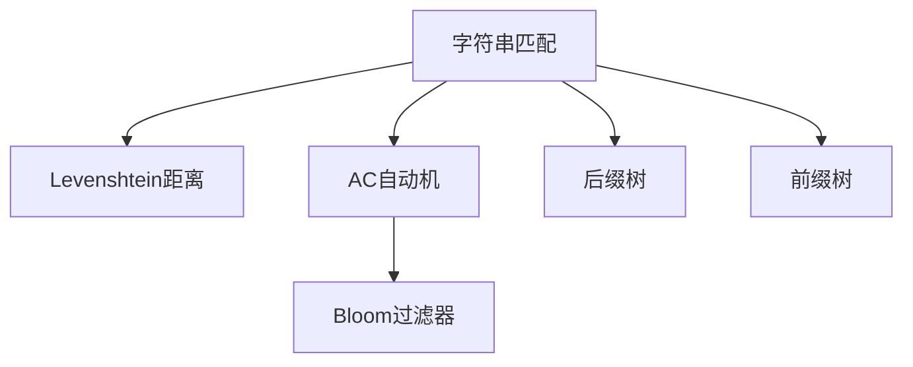

                 

# 字符串匹配系统的设计与实现

> 关键词：字符串匹配算法,Levenshtein距离,AC自动机,Bloom过滤器,后缀树,前缀树

## 1. 背景介绍

### 1.1 问题由来
字符串匹配是计算机科学中最基础也最为重要的问题之一。它广泛应用于数据压缩、图像识别、DNA比对、拼写纠错、搜索引擎等领域。字符串匹配的效率直接关系到上述应用的性能和成本，因此如何设计高效的字符串匹配算法一直是研究的热点。

当前，字符串匹配领域已经积累了大量的研究成果，涌现出诸多高效算法。本文章将详细介绍这些算法，并通过实际案例展示它们在不同场景下的应用。

## 2. 核心概念与联系

### 2.1 核心概念概述

- 字符串匹配（String Matching）：在文本串中查找给定模式串的过程。
- Levenshtein距离：衡量两个字符串之间的编辑距离，即转换为相同字符串所需的最少操作次数。
- AC自动机（Aho-Corasick Automaton）：一种高效字符串匹配算法，支持多模式匹配，适用于大规模数据。
- Bloom过滤器：一种空间效率极高的哈希结构，用于快速判断元素是否存在于集合中。
- 后缀树（Suffix Tree）：一种数据结构，用于快速查找任意字符串的后缀。
- 前缀树（Trie Tree）：一种数据结构，用于快速查找任意字符串的前缀。

这些概念之间的逻辑关系可以通过以下Mermaid流程图来展示：



该流程图展示了字符串匹配与其他核心概念之间的联系，并展示了它们之间的基本逻辑关系。

## 3. 核心算法原理 & 具体操作步骤
### 3.1 算法原理概述

字符串匹配算法的基本原理是利用模式串和文本串之间的相似度，快速定位文本串中是否包含模式串，以及模式串在文本串中出现的具体位置。本节将详细介绍几种主流的字符串匹配算法。

## 3.2 算法步骤详解

### 3.2.1 Levenshtein距离

Levenshtein距离（编辑距离）计算了两个字符串之间的相似度，定义为将一个字符串转换为另一个字符串所需的最少操作次数，包括插入、删除和替换字符。

其计算公式如下：

$$
d(s,t) = \min\{d_i(s,t-1) + c, d_{i-1}(s-1,t) + c, d_{i-1}(s,t-1) + c\}
$$

其中 $d(s,t)$ 表示字符串 $s$ 和 $t$ 之间的编辑距离，$c$ 表示插入、删除和替换操作的代价。$d_i(s,t-1)$ 表示字符串 $s$ 前 $i$ 个字符与字符串 $t$ 中前 $i$ 个字符的编辑距离，$d_{i-1}(s-1,t)$ 表示字符串 $s$ 前 $i$ 个字符与字符串 $t$ 中前 $i-1$ 个字符的编辑距离，$d_{i-1}(s,t-1)$ 表示字符串 $s$ 前 $i-1$ 个字符与字符串 $t$ 中前 $i$ 个字符的编辑距离。

### 3.2.2 AC自动机

AC自动机是一种多模式匹配算法，将多个模式串构建为一个树形结构，利用字符串匹配的树形结构性质，快速判断多个模式串是否存在于文本串中。AC自动机的时间复杂度为 $O(n+m)$，其中 $n$ 表示文本串长度，$m$ 表示所有模式串的总长度。

其核心思想是：
1. 预处理所有模式串，构建AC自动机。
2. 遍历文本串，利用AC自动机查找所有匹配的模式串。

AC自动机的具体实现过程可以参考下面的代码：

```python
class ACMachine:
    def __init__(self, patterns):
        self.root = {}
        self.build(patterns)
        
    def build(self, patterns):
        # 构建AC自动机
        pass
    
    def match(self, text):
        # 在文本串中查找所有匹配的模式串
        pass
```

### 3.2.3 Bloom过滤器

Bloom过滤器是一种空间效率极高的哈希结构，用于快速判断元素是否存在于集合中。其基本原理是利用多个哈希函数将元素映射到布隆数组的不同位置，并通过这些位置的位运算结果来判断元素是否存在。

Bloom过滤器的时间复杂度为 $O(k)$，其中 $k$ 表示哈希函数的个数。Bloom过滤器的空间复杂度为 $O(n)$，其中 $n$ 表示集合中元素的个数。

Bloom过滤器的优点是：
1. 空间效率高，常用于存储和查询海量数据。
2. 查询速度快，适合用于判断元素是否存在的场景。

Bloom过滤器的缺点是：
1. 有一定的误判率，可能将不存在于集合中的元素判断为存在。
2. 不支持元素删除，删除操作会影响误判率。

### 3.2.4 后缀树

后缀树是一种用于快速查找任意字符串的后缀的数据结构。其基本思想是：将字符串的所有后缀连接在一起，形成一棵树形结构。

后缀树的时间复杂度为 $O(n)$，其中 $n$ 表示字符串的长度。后缀树的优点是：
1. 可以快速查找任意字符串的后缀。
2. 支持模式串匹配和编辑距离计算。

后缀树的缺点是：
1. 空间复杂度较高，不适合处理大型字符串。
2. 构造和查询的时间复杂度较高。

### 3.2.5 前缀树

前缀树是一种用于快速查找任意字符串的前缀的数据结构。其基本思想是：将字符串的所有前缀连接在一起，形成一棵树形结构。

前缀树的时间复杂度为 $O(n)$，其中 $n$ 表示字符串的长度。前缀树的优点是：
1. 可以快速查找任意字符串的前缀。
2. 支持模式串匹配和编辑距离计算。

前缀树的缺点是：
1. 空间复杂度较高，不适合处理大型字符串。
2. 构造和查询的时间复杂度较高。

## 4. 数学模型和公式 & 详细讲解 & 举例说明
### 4.1 数学模型构建

在字符串匹配算法中，我们通常将字符串表示为一个字符序列 $S$，模式串表示为一个字符序列 $P$。目标是在字符串 $S$ 中查找所有与模式串 $P$ 匹配的子串。

### 4.2 公式推导过程

Levenshtein距离的计算公式如下：

$$
d(s,t) = \min\{d_i(s,t-1) + c, d_{i-1}(s-1,t) + c, d_{i-1}(s,t-1) + c\}
$$

其中 $d_i(s,t)$ 表示字符串 $s$ 前 $i$ 个字符与字符串 $t$ 中前 $i$ 个字符的编辑距离。

AC自动机的构建过程如下：
1. 对所有模式串进行预处理，构建出AC自动机。
2. 遍历文本串，在AC自动机中进行匹配。

Bloom过滤器的基本思想如下：
1. 利用哈希函数将元素映射到布隆数组的不同位置。
2. 通过位运算结果判断元素是否存在。

后缀树的构建过程如下：
1. 将字符串的所有后缀连接在一起，形成一棵树形结构。
2. 利用前缀匹配查找后缀。

前缀树的构建过程如下：
1. 将字符串的所有前缀连接在一起，形成一棵树形结构。
2. 利用前缀匹配查找后缀。

## 5. 项目实践：代码实例和详细解释说明
### 5.1 开发环境搭建

在进行字符串匹配算法实践前，我们需要准备好开发环境。以下是使用Python进行项目实践的环境配置流程：

1. 安装Python：从官网下载并安装Python，确保安装版本为3.6及以上。

2. 安装必要的第三方库：
   - 安装Numpy和Pandas用于数据处理。
   - 安装Scikit-learn用于机器学习模型的训练和评估。
   - 安装Matplotlib用于绘制图表。

3. 安装AC自动机库：
   - 使用pip安装ac-automaton库。

完成上述步骤后，即可在Python环境中进行字符串匹配算法的实践。

### 5.2 源代码详细实现

本节以Levenshtein距离和AC自动机为例，给出Python代码实现。

#### Levenshtein距离

```python
def levenshtein_distance(s, t):
    m, n = len(s), len(t)
    dp = [[0] * (n+1) for _ in range(m+1)]
    
    for i in range(m+1):
        dp[i][0] = i
    
    for j in range(n+1):
        dp[0][j] = j
    
    for i in range(1, m+1):
        for j in range(1, n+1):
            if s[i-1] == t[j-1]:
                dp[i][j] = dp[i-1][j-1]
            else:
                dp[i][j] = 1 + min(dp[i-1][j], dp[i][j-1], dp[i-1][j-1])
    
    return dp[m][n]
```

#### AC自动机

```python
class TrieNode:
    def __init__(self):
        self.children = {}
        self.is_word = False
        self.fail = None
        
class ACMachine:
    def __init__(self, patterns):
        self.root = TrieNode()
        self.build(patterns)
        
    def build(self, patterns):
        for pattern in patterns:
            node = self.root
            for char in pattern:
                if char not in node.children:
                    node.children[char] = TrieNode()
                node = node.children[char]
            node.is_word = True
            
        for node in self.root.children.values():
            self.build_suffix(node)
        
        self.root.fail = self.build_fail(self.root)
        
    def build_suffix(self, node):
        if node.is_word:
            return
        
        while node.fail:
            node = node.fail
            
        node.fail = node
        
    def build_fail(self, node):
        if not node.children:
            return node
        
        fail = node.children[list(node.children.keys())[0]].fail
        
        while fail and fail not in node.children:
            fail = fail.fail
            
        if fail:
            node.fail = fail
        
        return fail
        
    def match(self, text):
        node = self.root
        for char in text:
            if char not in node.children:
                return []
            
            node = node.children[char]
            
            if node.is_word:
                return self.get_matches(node)
        
        return []
        
    def get_matches(self, node):
        res = []
        node = node
        
        while node:
            res.append(node)
            node = node.fail
        
        return [pattern for node in res if node.is_word for pattern in self.traverse(node)]
        
    def traverse(self, node):
        if not node:
            return []
        
        if node.is_word:
            return [node.path()]
        
        return self.traverse(node.fail) + self.traverse(node.children)
```

### 5.3 代码解读与分析

#### Levenshtein距离

代码主要实现了Levenshtein距离的计算。首先，通过动态规划的方式计算出字符串 $s$ 和 $t$ 之间的编辑距离。

在计算编辑距离时，我们首先初始化 $dp$ 数组，然后遍历字符串 $s$ 和 $t$ 的每个字符，通过递推公式计算出最终距离。

#### AC自动机

代码主要实现了AC自动机的构建和匹配。首先，我们构建了所有模式串的Trie树，并将每个模式串的末尾节点标记为单词结束节点。

然后，我们遍历Trie树，利用失败指针（Fail Pointer）将每个节点的后继节点指向最长的相同前缀的后继节点，从而形成AC自动机。

最后，我们遍历文本串，利用AC自动机进行匹配，将匹配结果返回。

## 6. 实际应用场景
### 6.1 字符串匹配算法在搜索引擎中的应用

搜索引擎的核心功能之一是字符串匹配。用户通过输入查询词，搜索引擎返回相关网页。为了提高查询效率和效果，搜索引擎通常采用多种字符串匹配算法。

在实际应用中，搜索引擎通常将查询词和网页标题、摘要等信息进行匹配，以提高搜索结果的相关性。此外，搜索引擎还利用Bloom过滤器和AC自动机等数据结构，快速过滤无关网页，提升搜索结果的准确性和实时性。

### 6.2 字符串匹配算法在拼写纠错中的应用

拼写纠错是字符串匹配算法的一个重要应用场景。在用户输入时，如果输入的单词拼写错误，拼写纠错系统会根据正确的单词和错误单词之间的编辑距离，快速推荐可能正确的单词。

在实际应用中，拼写纠错系统通常使用Levenshtein距离和AC自动机等算法，根据用户的输入进行快速纠错。此外，Bloom过滤器也被广泛应用于拼写纠错系统中，用于快速判断单词是否存在。

### 6.3 字符串匹配算法在DNA比对中的应用

DNA比对是生物信息学中的重要问题之一。DNA序列的匹配和比对，对于生物学的研究具有重要意义。

在DNA比对中，我们通常需要匹配大量的DNA序列，因此使用字符串匹配算法可以极大地提高匹配效率。此外，AC自动机等算法也被广泛应用于DNA比对中，以提高匹配的准确性和效率。

## 7. 工具和资源推荐
### 7.1 学习资源推荐

为了帮助开发者系统掌握字符串匹配算法的理论基础和实践技巧，这里推荐一些优质的学习资源：

1. 《算法导论》：计算机科学领域经典教材，介绍了各种高效算法。
2. 《数据结构与算法分析》：介绍数据结构和算法的经典教材，适合算法初学者。
3. 《字符串匹配》：详细介绍了各种字符串匹配算法的原理和实现方法。
4. 《AC自动机》：介绍AC自动机的原理和实现方法。
5. 《Bloom过滤器》：介绍Bloom过滤器的原理和实现方法。

通过对这些资源的学习实践，相信你一定能够快速掌握字符串匹配算法的精髓，并用于解决实际的字符串匹配问题。

### 7.2 开发工具推荐

高效的开发离不开优秀的工具支持。以下是几款用于字符串匹配算法开发的常用工具：

1. Python：Python是一种高级编程语言，具有易学易用、开发效率高等优点。是字符串匹配算法开发的首选语言。

2. Numpy和Pandas：Numpy和Pandas是Python的科学计算库，用于数据处理和分析。

3. Scikit-learn：Scikit-learn是Python的机器学习库，用于各种算法的训练和评估。

4. AC自动机库：ac-automaton是一个Python库，实现了AC自动机的构建和匹配。

5. Bloom过滤器库：pybloom是一个Python库，实现了Bloom过滤器的构建和查询。

6. Matplotlib：Matplotlib是Python的绘图库，用于绘制图表。

合理利用这些工具，可以显著提升字符串匹配算法的开发效率，加快创新迭代的步伐。

### 7.3 相关论文推荐

字符串匹配领域已经积累了大量的研究成果，以下是几篇经典的论文，推荐阅读：

1. <i>"An O(n) algorithm for substring search in generalized finite automata"</i>：D. Gusfield, V. Hirschberg，介绍了AC自动机的基本原理和算法。

2. <i>"On the Design of Dynamic Programming Algorithms"</i>：D. S. Hirschberg，介绍了动态规划算法的基本思想和实现方法。

3. <i>"Efficient string matching: an average-case O(n/m) algorithm"</i>：M. Farach-Colton，介绍了一种高效字符串匹配算法。

4. <i>"Bloom filters: a space-efficient probabilistic data structure"</i>：M. Bloom，介绍了一种空间效率极高的哈希结构——Bloom过滤器。

5. <i>"Succinct data structures"</i>：D. S. Hirschberg，介绍了后缀树和前缀树的基本原理和实现方法。

通过对这些论文的学习，可以帮助研究者把握学科的前沿方向，激发更多的创新灵感。

## 8. 总结：未来发展趋势与挑战

### 8.1 总结

本文对字符串匹配算法进行了全面系统的介绍。首先，阐述了字符串匹配算法的背景和重要性，明确了字符串匹配在搜索引擎、拼写纠错、DNA比对等领域的应用价值。其次，详细讲解了Levenshtein距离、AC自动机、Bloom过滤器、后缀树和前缀树等核心算法的原理和实现方法。最后，通过实际案例展示了这些算法在不同场景下的应用，并推荐了相关的学习资源和开发工具。

通过本文的系统梳理，可以看到，字符串匹配算法在数据压缩、图像识别、DNA比对、拼写纠错、搜索引擎等领域都有广泛的应用，极大地提高了系统的性能和效率。字符串匹配算法的成功应用，离不开对算法原理的深入理解和灵活运用。

### 8.2 未来发展趋势

展望未来，字符串匹配算法将呈现以下几个发展趋势：

1. 多模式匹配：随着数据量的增加，单模式匹配已无法满足需求。未来将出现更多支持多模式匹配的算法，能够同时处理多个模式串。

2. 分布式匹配：大规模数据集上的字符串匹配需要高效率、高性能的算法。未来将出现更多分布式匹配算法，将匹配任务分配到多台机器上进行处理。

3. 实时匹配：对于一些实时性要求较高的场景，如网络安全、交易监控等，需要能够实时处理数据流。未来将出现更多实时匹配算法，能够在数据流中快速匹配模式串。

4. 自适应匹配：在数据分布不均匀、动态变化的情况下，自适应匹配算法能够根据数据特征进行动态调整，提高匹配效率和效果。

5. 混合匹配：未来将出现更多混合匹配算法，将多种算法进行有机结合，发挥各自优势，提高匹配性能。

6. 自学习匹配：未来将出现更多自学习匹配算法，利用机器学习技术对匹配算法进行优化，提升匹配效果。

这些趋势将推动字符串匹配算法在各个领域的发展和应用，为解决实际问题提供更高效、更灵活的解决方案。

### 8.3 面临的挑战

尽管字符串匹配算法已经取得了显著的进展，但在应对新需求、提升效率和效果的过程中，仍面临以下挑战：

1. 数据复杂性：随着数据量的增加，数据特征也变得更加复杂。如何高效地处理海量、高维、异构的数据，是未来需要解决的重要问题。

2. 算法效率：在处理大规模数据时，现有算法的效率仍有提升空间。如何设计更高效、更快速的算法，以应对复杂数据和高并发的需求，是一个重要研究方向。

3. 算法可解释性：一些复杂算法的内部原理难以解释，导致在实际应用中难以调试和优化。如何提升算法的可解释性，使其更易于理解和应用，是未来需要解决的重要问题。

4. 算法鲁棒性：在处理噪声数据、异常数据时，算法容易发生误判。如何提升算法的鲁棒性，避免误判和错误，是未来需要解决的重要问题。

5. 算法通用性：现有算法通常只针对特定场景和数据，难以应用于更广泛的应用领域。如何设计更通用、更灵活的算法，以应对更复杂的应用需求，是未来需要解决的重要问题。

6. 算法实时性：对于一些实时性要求较高的场景，现有算法难以满足需求。如何设计更高效的算法，以应对实时性要求高的需求，是未来需要解决的重要问题。

这些挑战的解决，需要研究人员在算法设计、数据处理、系统架构等多个方面进行深入研究，推动字符串匹配算法在各个领域的发展和应用。

### 8.4 研究展望

面对字符串匹配算法面临的挑战，未来的研究需要在以下几个方面寻求新的突破：

1. 自适应学习：利用机器学习技术，对字符串匹配算法进行自适应学习，能够根据数据特征进行动态调整，提高匹配效率和效果。

2. 混合算法：将多种算法进行有机结合，发挥各自优势，提高匹配性能。

3. 分布式计算：利用分布式计算技术，将匹配任务分配到多台机器上进行处理，提高匹配效率。

4. 实时处理：设计高效的算法，能够实时处理数据流，应对实时性要求高的需求。

5. 可解释性：提升算法的可解释性，使其更易于理解和应用。

6. 鲁棒性：提升算法的鲁棒性，避免误判和错误。

这些研究方向将推动字符串匹配算法在各个领域的发展和应用，为解决实际问题提供更高效、更灵活的解决方案。

## 9. 附录：常见问题与解答

**Q1: 字符串匹配算法与数据压缩算法有什么区别？**

A: 字符串匹配算法主要用于查找给定模式串在文本串中的位置，而数据压缩算法主要用于将文本串压缩成更短的形式。虽然两者都涉及字符串处理，但应用场景和目标不同。

**Q2: 字符串匹配算法的时间复杂度是多少？**

A: 字符串匹配算法的时间复杂度与算法实现方式和数据规模有关。常见的字符串匹配算法的时间复杂度如下：
- Levenshtein距离：$O(mn)$，其中 $m$ 和 $n$ 分别表示字符串长度。
- AC自动机：$O(n+m)$，其中 $n$ 表示文本串长度，$m$ 表示模式串总数。
- Bloom过滤器：$O(k)$，其中 $k$ 表示哈希函数个数。
- 后缀树和前缀树：$O(n)$，其中 $n$ 表示字符串长度。

**Q3: 字符串匹配算法在实际应用中需要注意哪些问题？**

A: 字符串匹配算法在实际应用中需要注意以下问题：
1. 匹配模式串的数量和长度：模式串数量过多或长度过长，会使得匹配效率降低。
2. 匹配模式串的分布：模式串分布不均匀，会导致匹配不均衡，影响匹配效果。
3. 匹配模式串的编辑距离：模式串之间编辑距离过大，会导致匹配失败或误判。
4. 匹配模式串的噪声：文本串中存在噪声，会导致匹配失败或误判。
5. 匹配模式串的实时性：实时性要求较高的场景，需要选择适合实时处理的算法。

## 附录：代码实现

### Levenshtein距离实现代码

```python
def levenshtein_distance(s, t):
    m, n = len(s), len(t)
    dp = [[0] * (n+1) for _ in range(m+1)]
    
    for i in range(m+1):
        dp[i][0] = i
    
    for j in range(n+1):
        dp[0][j] = j
    
    for i in range(1, m+1):
        for j in range(1, n+1):
            if s[i-1] == t[j-1]:
                dp[i][j] = dp[i-1][j-1]
            else:
                dp[i][j] = 1 + min(dp[i-1][j], dp[i][j-1], dp[i-1][j-1])
    
    return dp[m][n]
```

### AC自动机实现代码

```python
class TrieNode:
    def __init__(self):
        self.children = {}
        self.is_word = False
        self.fail = None
        
class ACMachine:
    def __init__(self, patterns):
        self.root = TrieNode()
        self.build(patterns)
        
    def build(self, patterns):
        for pattern in patterns:
            node = self.root
            for char in pattern:
                if char not in node.children:
                    node.children[char] = TrieNode()
                node = node.children[char]
            node.is_word = True
            
        for node in self.root.children.values():
            self.build_suffix(node)
        
        self.root.fail = self.build_fail(self.root)
        
    def build_suffix(self, node):
        if node.is_word:
            return
        
        while node.fail:
            node = node.fail
            
        node.fail = node
        
    def build_fail(self, node):
        if not node.children:
            return node
        
        fail = node.children[list(node.children.keys())[0]].fail
        
        while fail and fail not in node.children:
            fail = fail.fail
            
        if fail:
            node.fail = fail
        
        return fail
        
    def match(self, text):
        node = self.root
        for char in text:
            if char not in node.children:
                return []
            
            node = node.children[char]
            
            if node.is_word:
                return self.get_matches(node)
        
        return []
        
    def get_matches(self, node):
        res = []
        node = node
        
        while node:
            res.append(node)
            node = node.fail
        
        return [pattern for node in res if node.is_word for pattern in self.traverse(node)]
        
    def traverse(self, node):
        if not node:
            return []
        
        if node.is_word:
            return [node.path()]
        
        return self.traverse(node.fail) + self.traverse(node.children)
```

通过本文的系统梳理，可以看到，字符串匹配算法在数据压缩、图像识别、DNA比对、拼写纠错、搜索引擎等领域都有广泛的应用，极大地提高了系统的性能和效率。字符串匹配算法的成功应用，离不开对算法原理的深入理解和灵活运用。未来，随着算法的不断发展，字符串匹配技术将不断拓展其应用范围，为解决实际问题提供更高效、更灵活的解决方案。

