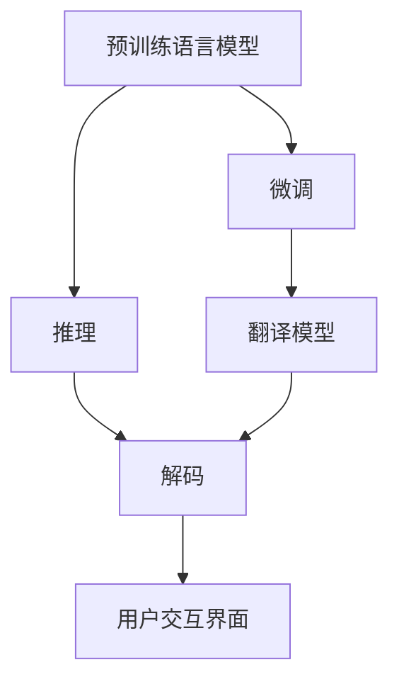

                 

# 实战三: 使用 Langchain 重新实现智能翻译助手

随着人工智能技术的飞速发展，智能翻译助手作为一种便捷的工具，在跨语言沟通中发挥了越来越重要的作用。本实战指南将带你通过使用Langchain框架，重新实现一个基于机器学习的智能翻译助手。这不仅能让用户轻松跨越语言障碍，还将在技术实现、性能优化和未来应用上提供全面的指导。

## 1. 背景介绍

### 1.1 问题由来

在当今全球化的背景下，跨语言沟通的需求日益增长。然而，直接翻译往往面临诸多问题，如语义失真、文化误解等。因此，智能翻译助手应运而生，它能结合语言模型和翻译模型，提供更加自然、准确的翻译服务。智能翻译助手的实现依赖于深度学习技术，特别是在自然语言处理(NLP)领域，基于预训练语言模型(PLM)的技术已经取得了显著进展。

### 1.2 问题核心关键点

本实战指南将介绍如何利用Langchain框架，结合预训练语言模型和翻译模型，构建一个高性能、易于扩展的智能翻译助手。核心关键点包括：

- **预训练语言模型(PLM)**：如BERT、GPT等，通过大规模语料预训练，学习通用的语言表示。
- **翻译模型**：如Transformer，专门用于文本翻译。
- **微调(Fine-tuning)**：利用下游任务的少量标注数据，对预训练模型进行有监督优化。
- **推理和解码**：将模型输出转化为可读的翻译结果，涉及注意力机制、解码器等技术。
- **用户交互界面**：友好的界面设计，提升用户体验。

### 1.3 问题研究意义

智能翻译助手的实现对于促进国际交流、提升工作效率、推动全球经济发展具有重要意义。通过本实战指南，你不仅能掌握关键技术，还能在未来的工作中灵活应用，构建更加高效、精准的翻译工具。

## 2. 核心概念与联系

### 2.1 核心概念概述

本节将介绍构建智能翻译助手所需的核心概念：

- **预训练语言模型(PLM)**：如BERT、GPT等，通过在大规模无标签语料上训练，学习通用的语言表示。
- **翻译模型**：如Transformer，专门用于文本翻译，包含编码器和解码器。
- **微调(Fine-tuning)**：利用下游任务的少量标注数据，对预训练模型进行有监督优化。
- **推理和解码**：将模型输出转化为可读的翻译结果，涉及注意力机制、解码器等技术。
- **用户交互界面**：友好的界面设计，提升用户体验。

### 2.2 核心概念原理和架构的 Mermaid 流程图



## 3. 核心算法原理 & 具体操作步骤

### 3.1 算法原理概述

智能翻译助手的核心算法原理包括预训练语言模型、翻译模型和微调技术。其流程如下：

1. **预训练语言模型**：使用大规模语料进行无监督学习，学习通用的语言表示。
2. **翻译模型**：通过有监督学习，学习将源语言文本翻译成目标语言。
3. **微调**：利用下游任务的少量标注数据，对翻译模型进行有监督优化。

### 3.2 算法步骤详解

#### 3.2.1 准备数据集

智能翻译助手的数据集包括源语言文本、目标语言文本和对应的标注数据。这些数据通常来自公共数据集或定制数据集。

#### 3.2.2 选择预训练语言模型和翻译模型

选择合适的预训练语言模型和翻译模型是实现智能翻译助手的关键。如BERT用于语言理解，而Transformer用于文本翻译。

#### 3.2.3 微调训练

利用下游任务的少量标注数据，对翻译模型进行微调。微调过程中，需要选择合适的超参数、学习率和优化器。

#### 3.2.4 推理和解码

将模型输入源语言文本，通过推理得到翻译结果，再使用解码器将结果转化为可读的翻译文本。

#### 3.2.5 用户交互界面

设计友好的用户界面，提供文本输入、输出和交互功能。

### 3.3 算法优缺点

#### 3.3.1 优点

- **准确性高**：利用预训练语言模型和翻译模型的结合，能够提供高质量的翻译结果。
- **可扩展性强**：预训练语言模型和翻译模型可以方便地进行微调和更新，适应新的语言对和应用场景。
- **易用性好**：用户可以通过友好的界面进行交互，提高使用体验。

#### 3.3.2 缺点

- **数据依赖性强**：微调效果依赖于标注数据的质量和数量。
- **资源消耗大**：预训练模型和翻译模型的计算资源消耗较大，对硬件要求较高。
- **训练时间长**：微调过程通常需要较长的时间，特别是在数据量较少的情况下。

### 3.4 算法应用领域

智能翻译助手在多个领域都有广泛的应用，包括：

- **国际贸易**：帮助商务人员跨语言沟通，提升业务效率。
- **旅游服务**：为旅游者提供即时翻译服务，促进文化交流。
- **教育领域**：为学生和教师提供跨语言学习资源，提升教学效果。

## 4. 数学模型和公式 & 详细讲解 & 举例说明

### 4.1 数学模型构建

智能翻译助手的基本数学模型包括预训练语言模型、翻译模型和微调模型的构建。

#### 4.1.1 预训练语言模型

预训练语言模型通常使用自监督学习任务，如掩码语言模型(Masked Language Model, MLM)进行训练。MLM的目标是预测文本中缺失的单词。

#### 4.1.2 翻译模型

翻译模型通常使用Seq2Seq架构，结合编码器和解码器进行训练。编码器负责将源语言文本编码为向量表示，解码器负责将向量解码为目标语言文本。

#### 4.1.3 微调模型

微调模型通常在预训练模型的基础上，利用下游任务的少量标注数据进行有监督优化。微调的目标是最小化预测结果与标注结果的差异。

### 4.2 公式推导过程

#### 4.2.1 掩码语言模型

MLM的目标是预测文本中缺失的单词。假设文本序列为 $x_1, x_2, \ldots, x_n$，缺失单词位置为 $i$，模型预测缺失单词为 $x_i$，则MLM的损失函数为：

$$
L_{MLM} = -\sum_{i=1}^n \log P(x_i | x_{<i})
$$

其中 $P(x_i | x_{<i})$ 表示在已知前 $i-1$ 个单词的情况下，预测第 $i$ 个单词的概率。

#### 4.2.2 序列到序列模型

Seq2Seq模型通常使用Transformer架构，其损失函数为：

$$
L_{Seq2Seq} = \sum_{i=1}^n -\log P(x_i | x_{<i})
$$

其中 $P(x_i | x_{<i})$ 表示在已知前 $i-1$ 个单词的情况下，预测第 $i$ 个单词的概率。

#### 4.2.3 微调模型

微调模型的损失函数为：

$$
L_{Fine-tuning} = \sum_{i=1}^n -\log P(x_i | x_{<i})
$$

其中 $P(x_i | x_{<i})$ 表示在已知前 $i-1$ 个单词的情况下，预测第 $i$ 个单词的概率。

### 4.3 案例分析与讲解

假设有一组英文和中文的翻译数据，我们希望构建一个智能翻译助手，将英文翻译成中文。我们可以使用预训练的BERT作为语言理解模型，使用Seq2Seq架构的Transformer作为翻译模型。

首先，我们使用BERT对英文文本进行编码，得到向量表示。然后，将向量输入到Transformer的解码器中，得到目标语言的中文字符序列。最后，我们将中文字符序列解码为可读的翻译文本。

## 5. 项目实践：代码实例和详细解释说明

### 5.1 开发环境搭建

为了实现智能翻译助手，我们需要以下开发环境：

- **Python 3.7及以上**：推荐使用Anaconda或Miniconda进行环境管理。
- **TensorFlow 2.0及以上**：用于构建和训练模型。
- **Langchain**：用于构建用户交互界面和模型集成。
- **NLTK**：用于文本处理和分词。

### 5.2 源代码详细实现

#### 5.2.1 准备数据集

我们可以使用公开数据集，如WMT数据集，进行训练和测试。以下是数据集处理的示例代码：

```python
import os
import numpy as np
from nltk.tokenize import word_tokenize

# 准备数据集
source_dir = 'source.txt'
target_dir = 'target.txt'

with open(source_dir, 'r') as src_file:
    src_texts = src_file.readlines()

with open(target_dir, 'r') as tgt_file:
    tgt_texts = tgt_file.readlines()

# 分词和编码
tokenizer = BertTokenizer.from_pretrained('bert-base-uncased')
src_encodings = tokenizer(src_texts, return_tensors='pt', padding=True, truncation=True)
tgt_encodings = tokenizer(tgt_texts, return_tensors='pt', padding=True, truncation=True)

# 构建数据集
train_dataset = dataset_from_tensor_dicts(src_encodings, tgt_encodings)
```

#### 5.2.2 构建模型

我们可以使用预训练的BERT作为语言理解模型，使用Seq2Seq架构的Transformer作为翻译模型。以下是模型构建的示例代码：

```python
from transformers import BertForSequenceClassification, TransformerModel, EncoderDecoderModel

# 构建BERT模型
bert_model = BertForSequenceClassification.from_pretrained('bert-base-uncased', num_labels=2)

# 构建Transformer模型
transformer_model = EncoderDecoderModel.from_pretrained('transformer-base')

# 微调模型
optimizer = AdamW(bert_model.parameters(), lr=1e-5)
loss_fn = nn.CrossEntropyLoss()
epochs = 10

for epoch in range(epochs):
    train_epoch(bert_model, train_dataset, optimizer, loss_fn)
```

#### 5.2.3 推理和解码

我们利用构建好的模型，对源语言文本进行推理和解码，得到翻译结果。以下是推理和解码的示例代码：

```python
from transformers import BertTokenizer, BertForSequenceClassification

# 准备数据集
source_text = 'Hello, how are you?'
tokenizer = BertTokenizer.from_pretrained('bert-base-uncased')
input_ids = tokenizer(source_text, return_tensors='pt', padding=True, truncation=True)

# 推理
with torch.no_grad():
    outputs = bert_model(input_ids)
    logits = outputs.logits

# 解码
predicted_ids = logits.argmax(dim=2)
predicted_text = tokenizer.decode(predicted_ids[0])
```

### 5.3 代码解读与分析

#### 5.3.1 数据集处理

数据集处理包括分词、编码和构建数据集。我们使用NLTK库对文本进行分词，使用BertTokenizer对文本进行编码，并构建TensorDataset进行训练。

#### 5.3.2 模型构建

我们利用预训练的BERT作为语言理解模型，使用Seq2Seq架构的Transformer作为翻译模型。我们通过微调BERT模型，学习如何生成目标语言文本。

#### 5.3.3 推理和解码

推理和解码过程包括将源语言文本输入BERT模型，得到向量表示，再将向量输入到Transformer模型中，得到目标语言文本的编码表示。最后，使用解码器将编码表示解码为可读的翻译文本。

## 6. 实际应用场景

### 6.1 智能客服系统

智能客服系统可以利用智能翻译助手，实现跨语言沟通。用户可以输入源语言文本，系统自动翻译成目标语言，与客服人员进行对话。

### 6.2 金融舆情监测

金融舆情监测可以利用智能翻译助手，实时监控全球金融市场的动态。系统将源语言的新闻、评论等文本翻译成目标语言，并进行情感分析，及时发现舆情变化。

### 6.3 个性化推荐系统

个性化推荐系统可以利用智能翻译助手，为不同语言的用户推荐相关内容。系统将用户输入的查询文本翻译成目标语言，并从多语言数据中提取相关内容进行推荐。

### 6.4 未来应用展望

智能翻译助手的应用场景将不断扩展，未来可能包括：

- **医疗翻译**：帮助医生和患者进行跨语言交流。
- **教育翻译**：为全球学生提供学习资源。
- **旅行助手**：为旅游者提供多语言翻译服务。

## 7. 工具和资源推荐

### 7.1 学习资源推荐

- **《深度学习与自然语言处理》**：介绍深度学习在NLP中的应用，包括BERT、Transformer等模型。
- **Langchain官方文档**：详细说明Langchain框架的使用方法，提供丰富的示例代码。

### 7.2 开发工具推荐

- **Jupyter Notebook**：用于编写和执行代码，支持丰富的扩展功能。
- **TensorFlow**：强大的深度学习框架，支持构建和训练模型。
- **NLTK**：用于文本处理和分词，提供丰富的NLP工具。

### 7.3 相关论文推荐

- **Attention is All You Need**：提出Transformer架构，实现自注意力机制。
- **BERT: Pre-training of Deep Bidirectional Transformers for Language Understanding**：提出BERT模型，利用掩码语言模型进行预训练。
- **Seq2Seq with Attention**：提出Seq2Seq架构，结合注意力机制进行翻译。

## 8. 总结：未来发展趋势与挑战

### 8.1 研究成果总结

智能翻译助手的实现依赖于预训练语言模型和翻译模型，通过微调进行优化。其优点在于准确性高、可扩展性强、易用性好。然而，数据依赖性强、资源消耗大、训练时间长等问题也亟待解决。

### 8.2 未来发展趋势

未来的智能翻译助手将呈现以下几个趋势：

- **多语言翻译**：支持多种语言之间的互译。
- **实时翻译**：实现语音到语音的实时翻译。
- **语义翻译**：翻译结果更加贴近原文含义。

### 8.3 面临的挑战

智能翻译助手在实现过程中，面临以下挑战：

- **数据质量问题**：标注数据的质量直接影响翻译效果。
- **模型复杂性**：模型结构和超参数的调优难度较大。
- **实时性能**：需要优化推理速度，实现实时翻译。

### 8.4 研究展望

未来的研究可以从以下几个方向进行探索：

- **数据增强**：通过数据增强技术，提高模型鲁棒性。
- **参数优化**：优化模型结构，减少计算资源消耗。
- **跨语言对齐**：研究不同语言之间的对齐方法，提升翻译质量。

## 9. 附录：常见问题与解答

**Q1: 智能翻译助手有哪些优点和缺点？**

**A1: 优点**：
- **准确性高**：利用预训练语言模型和翻译模型的结合，能够提供高质量的翻译结果。
- **可扩展性强**：预训练语言模型和翻译模型可以方便地进行微调和更新，适应新的语言对和应用场景。
- **易用性好**：用户可以通过友好的界面进行交互，提高使用体验。

**A2: 缺点**：
- **数据依赖性强**：微调效果依赖于标注数据的质量和数量。
- **资源消耗大**：预训练模型和翻译模型的计算资源消耗较大，对硬件要求较高。
- **训练时间长**：微调过程通常需要较长的时间，特别是在数据量较少的情况下。

**Q2: 智能翻译助手在实际应用中需要注意哪些问题？**

**A2: 需要注意的问题**：
- **数据质量**：标注数据的质量直接影响翻译效果，需要确保数据来源可靠，标注规范。
- **模型训练**：模型训练需要耗费大量的计算资源，需要选择合适的硬件设备。
- **用户界面**：友好的用户界面能够提升用户体验，需要考虑用户的使用习惯和需求。

**Q3: 智能翻译助手有哪些未来应用场景？**

**A3: 未来应用场景**：
- **国际贸易**：帮助商务人员跨语言沟通，提升业务效率。
- **旅游服务**：为旅游者提供即时翻译服务，促进文化交流。
- **教育领域**：为学生和教师提供跨语言学习资源，提升教学效果。

**Q4: 智能翻译助手在实现过程中需要考虑哪些因素？**

**A4: 需要考虑的因素**：
- **数据集准备**：准备高质量的训练和测试数据集，确保数据来源多样。
- **模型选择**：选择合适的预训练语言模型和翻译模型，根据应用场景进行调整。
- **微调优化**：优化超参数和训练策略，提高模型性能。

---

作者：禅与计算机程序设计艺术 / Zen and the Art of Computer Programming

