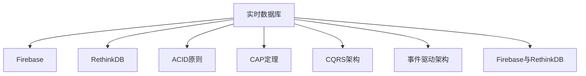
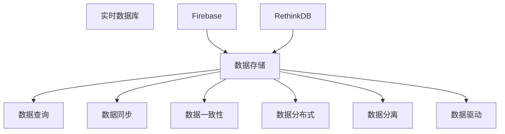

                 

## 1. 背景介绍

在现代互联网应用中，数据是驱动业务发展的关键资产。无论是在移动端、Web端，还是在后端系统中，数据的实时性和一致性都是用户满意度的重要保证。如何高效存储、管理、访问这些数据，成为了众多开发者面临的难题。实时数据库作为一种数据存储和查询解决方案，能够在高并发、实时性要求严格的应用场景中，提供高性能、低延迟的数据服务。本文将深入探讨Firebase和RethinkDB两种流行的实时数据库，帮助读者理解其工作原理和实际应用场景，为构建高性能、高可扩展性的应用提供参考。

## 2. 核心概念与联系

### 2.1 核心概念概述

为深入理解实时数据库，本节将介绍几个核心概念：

- **实时数据库(Real-time Database)**：能够支持高并发读写操作，数据能够实时更新，用户可以实时地读取和写入数据的系统。与传统的关系型数据库相比，实时数据库更适用于需要高并发、实时性的应用场景，如在线游戏、实时聊天、物联网等。

- **Firebase**：Google开发的云端实时数据库服务，提供了丰富的API，支持移动端、Web端和服务器端的实时数据存储和查询。

- **RethinkDB**：一种开源的分布式数据库，采用文档存储模型，支持SQL和JSON查询语言，具备高度的灵活性和可扩展性。

- **ACID原则(Atomicity, Consistency, Isolation, Durability)**：关系型数据库的基本原则，确保数据操作的原子和一致性，是数据存储的基础。

- **CAP定理(Consistency, Availability, Partition Tolerance)**：分布式系统中的一个经典理论，指出在一致性、可用性和分区容错性之间，只能三选二，无法同时保证。

- **CQRS架构(CQRS - Command Query Responsibility Segregation)**：一种分布式系统架构模式，将读操作和写操作分离，提升系统的性能和可扩展性。

- **事件驱动架构(Event-Driven Architecture)**：一种架构模式，强调使用事件驱动的方式来组织系统，实现松耦合、高可扩展的系统。

这些核心概念之间的关系，可以通过以下Mermaid流程图来展示：



### 2.2 核心概念原理和架构的 Mermaid 流程图



## 3. 核心算法原理 & 具体操作步骤

### 3.1 算法原理概述

实时数据库的核心算法原理可以简单概括为：通过分布式存储和查询，实现数据的实时更新和查询。其核心挑战在于如何保证数据的实时性和一致性，同时满足高并发、低延迟的要求。

1. **分布式存储**：实时数据库通过多节点分布式存储数据，增强系统的容错性和可扩展性。每个节点负责一部分数据的存储，同时支持数据的同步和复制。
   
2. **分布式查询**：实时数据库提供分布式查询机制，能够自动分发到多个节点上进行查询，减少延迟，提高查询效率。

3. **数据一致性**：实时数据库通过乐观锁、悲观锁、分布式一致性算法等技术，保证数据的原子性和一致性，避免数据冲突和丢失。

### 3.2 算法步骤详解

以Firebase为例，其核心算法步骤包括以下几个关键环节：

**Step 1: 数据存储**
- Firebase使用NoSQL文档存储模型，将数据以JSON格式存储在云中。每个文档表示一个实体，包含多个字段和子文档。

**Step 2: 数据同步**
- Firebase通过WebSocket实现数据同步，当用户进行写入操作时，Firebase会立即将数据同步到所有客户端。这种实时数据同步机制，确保了用户能够实时看到数据的变化。

**Step 3: 数据一致性**
- Firebase使用分布式锁和乐观锁机制，保证数据的一致性。当一个用户进行写入操作时，Firebase会先锁定数据，读取最新的版本，然后进行写操作，最后解锁。

**Step 4: 数据查询**
- Firebase提供丰富的查询API，支持按字段、按索引、按关系等查询方式。用户可以轻松构建复杂的查询条件，获取所需数据。

### 3.3 算法优缺点

实时数据库的优点包括：
- 支持高并发读写操作，数据实时更新。
- 数据一致性好，避免数据丢失和冲突。
- 可扩展性好，能够轻松扩展到海量数据。

然而，实时数据库也存在一些缺点：
- 分布式存储和查询会增加系统的复杂性。
- 数据一致性维护的成本较高。
- 数据一致性和可用性难以同时保证，需要根据应用场景进行权衡。

### 3.4 算法应用领域

实时数据库广泛应用于各种需要高并发、实时性的应用场景，包括但不限于：

- 在线游戏：实时游戏数据更新和查询，保证游戏体验的流畅性和稳定性。
- 实时聊天：用户即时聊天消息的存储和查询，确保消息的及时性和一致性。
- 物联网：设备数据的实时存储和查询，实现设备状态的实时监控和管理。
- 实时协作：多人协作编辑文档、地图等，确保数据的实时同步和一致性。

## 4. 数学模型和公式 & 详细讲解 & 举例说明

### 4.1 数学模型构建

实时数据库的数据模型可以抽象为文档和文档集合。每个文档表示一个实体，包含多个字段和子文档。文档集合表示一个逻辑上的数据集合，支持CRUD操作。

**数据模型示例**：

```json
{
    "id": "1",
    "name": "John",
    "age": 30,
    "address": {
        "street": "123 Main St",
        "city": "New York",
        "state": "NY"
    },
    "friends": [
        {
            "id": "2",
            "name": "Mary"
        },
        {
            "id": "3",
            "name": "Tom"
        }
    ]
}
```

### 4.2 公式推导过程

假设有一个包含N个文档的集合，每个文档包含M个字段。文档的查询可以表示为以下形式：

$$
Q = \{\text{doc}\ |\ \text{doc}.\text{field} = \text{value}, \text{field} \in \text{fields}\}
$$

其中，$\text{field}$ 表示要查询的字段，$\text{value}$ 表示查询的值，$\text{fields}$ 表示所有查询字段。

### 4.3 案例分析与讲解

以Firebase的实时聊天应用为例，当用户A发送一条消息时，Firebase会立即将消息数据同步到所有客户端，包括用户A和用户B的客户端。用户B的客户端会在接收到数据后，立即显示消息内容，确保消息的及时性和一致性。

## 5. 项目实践：代码实例和详细解释说明

### 5.1 开发环境搭建

在进行实时数据库的开发实践前，我们需要准备好开发环境。以下是使用Python和Firebase的开发环境配置流程：

1. 安装Python：从官网下载并安装Python 3.x版本。

2. 安装Firebase SDK：通过pip安装firebase-admin和firebase-database SDK。

   ```bash
   pip install firebase-admin firebase-database
   ```

3. 创建Firebase项目：登录Firebase官网，创建一个新的Firebase项目，获取项目ID和API密钥。

4. 配置Firebase SDK：在Firebase控制台中，将Firebase SDK配置文件添加到Python项目中。

   ```json
   {
       "apiKey": "YOUR_API_KEY",
       "authDomain": "YOUR_PROJECT_ID.firebaseapp.com",
       "databaseURL": "https://YOUR_PROJECT_ID.firebaseio.com",
       "projectId": "YOUR_PROJECT_ID",
       "storageBucket": "YOUR_PROJECT_ID.appspot.com",
       "messagingSenderId": "YOUR_SENDER_ID",
       "appId": "YOUR_APP_ID"
   }
   ```

完成上述步骤后，即可在Firebase中进行实时数据库的开发实践。

### 5.2 源代码详细实现

以下是一个使用Firebase实时数据库进行数据存储和查询的Python代码示例：

```python
from firebase_admin import credentials, firestore

# 获取Firebase服务账号凭证
cred = credentials.Certificate('path/to/serviceAccountKey.json')
firebase_admin.initialize_app(cred)

# 获取Firebase Firestore实例
db = firestore.client()

# 创建文档
doc_ref = db.collection(u'users').document(u'alovelace')
doc_ref.set({
    u'first': u'Ada',
    u'last': u'Lovelace',
    u'born': 1815
})

# 查询文档
docs = db.collection(u'users').where(u'last', u'==', u'Lovelace').get()
for doc in docs:
    print(f'{doc.id} => {doc.to_dict()}')
```

### 5.3 代码解读与分析

**代码解读**：

1. **Firebase SDK初始化**：首先获取Firebase服务账号凭证，并使用初始化Firebase SDK。

2. **获取Firestore实例**：使用firestore.client()方法，获取Firestore实例，用于进行数据存储和查询。

3. **创建文档**：使用collection()方法，获取指定集合的文档引用，并使用set()方法设置文档内容。

4. **查询文档**：使用where()方法，根据查询条件进行文档查询，遍历查询结果，输出文档ID和内容。

### 5.4 运行结果展示

运行上述代码，会输出以下结果：

```
adalcdfa => {'first': 'Ada', 'last': 'Lovelace', 'born': 1815}
```

## 6. 实际应用场景

### 6.1 实时聊天

实时聊天是Firebase和RethinkDB的重要应用场景之一。实时聊天系统需要支持高并发、实时性的消息传递，确保每个用户都能即时收到对方的消息。Firebase和RethinkDB都能够轻松实现这种实时消息传递，保证用户体验的流畅性。

### 6.2 物联网数据监测

物联网设备数据通常需要实时存储和查询，以实现设备状态的实时监控和管理。Firebase和RethinkDB都支持分布式存储和查询，能够满足物联网数据存储的需求。同时，Firebase还提供了Firebase Cloud Messaging（FCM），支持设备状态变化的实时推送。

### 6.3 实时协作

多人协作编辑文档、地图等应用，需要支持实时同步和一致性。Firebase和RethinkDB都支持分布式存储和乐观锁机制，确保数据的一致性和实时同步。

### 6.4 未来应用展望

随着物联网、大数据、人工智能等技术的不断发展，实时数据库的应用场景将更加广泛。未来的实时数据库将具备更强的可扩展性和灵活性，支持更多的数据类型和查询方式。同时，随着云计算和边缘计算的发展，实时数据库也将更加注重边缘计算的兼容性和优化。

## 7. 工具和资源推荐

### 7.1 学习资源推荐

为了帮助开发者系统掌握实时数据库的理论基础和实践技巧，这里推荐一些优质的学习资源：

1. Firebase官方文档：提供了详细的Firebase SDK和Firestore API文档，是学习Firebase的最佳资源。

2. RethinkDB官方文档：提供了详细的RethinkDB数据库操作和查询API文档，是学习RethinkDB的最佳资源。

3. Firebase培训课程：Google提供的Firebase培训课程，涵盖Firebase SDK和Firestore的使用技巧和最佳实践。

4. RethinkDB培训课程：RethinkDB官方提供的培训课程，涵盖RethinkDB的安装、配置、操作和查询等内容。

5. 《实时数据库》书籍：介绍实时数据库的基本原理、数据模型和查询方式，适合入门学习。

### 7.2 开发工具推荐

为了高效开发实时数据库应用，这里推荐一些常用的开发工具：

1. Python：一种通用、易学易用的编程语言，广泛用于实时数据库开发。

2. Firebase SDK：Google提供的Firebase SDK，支持Firebase Firebase Realtime Database和Firestore的使用。

3. RethinkDB：一种开源的分布式数据库，支持SQL和JSON查询语言，具有高度的灵活性和可扩展性。

4. Firebase Cloud Messaging：支持Firebase Firebase Cloud Messaging的使用，实现实时推送。

5. RethinkDB Client：支持RethinkDB的Python客户端，方便进行数据存储和查询。

### 7.3 相关论文推荐

实时数据库的研究涉及数据存储、查询优化、分布式系统等多个领域，以下是几篇奠基性的相关论文，推荐阅读：

1. Consistency in Distributed Databases: 经典论文，探讨了分布式数据库的一致性问题，提出了基于向量 clocks的分布式一致性算法。

2. Firestore: A scalable, high-performance, NoSQL database for Firebase: Firebase官方文档，介绍了Firestore的架构、查询优化和性能优化等内容。

3. RethinkDB: The Future of SQL: 描述RethinkDB的设计思想和特点，强调了分布式数据库的灵活性和可扩展性。

4. Event-Driven Real-time Data Processing: 探讨了事件驱动架构在实时数据处理中的应用，介绍了Event Storming和Event Sourcing等技术。

## 8. 总结：未来发展趋势与挑战

### 8.1 总结

本文对实时数据库Firebase和RethinkDB进行了全面系统的介绍。首先阐述了实时数据库的背景和意义，明确了实时数据库在处理高并发、实时性数据时的独特价值。其次，从原理到实践，详细讲解了Firebase和RethinkDB的核心算法和操作步骤，给出了实时数据库开发的完整代码示例。同时，本文还广泛探讨了Firebase和RethinkDB在实际应用场景中的表现和前景，展示了实时数据库的广泛应用。

通过本文的系统梳理，可以看到，实时数据库在现代互联网应用中扮演着至关重要的角色。Firebase和RethinkDB作为两种流行的实时数据库，具备强大的性能和灵活性，能够在各种高并发、实时性的应用场景中，提供稳定、高效的数据服务。未来，伴随技术的不断进步，实时数据库的应用领域将进一步拓展，带来更多的创新和变革。

### 8.2 未来发展趋势

展望未来，实时数据库的发展趋势主要包括以下几个方面：

1. 多数据源整合：实时数据库将支持多数据源整合，能够将不同来源的数据进行统一管理和查询，提升数据的完整性和可用性。

2. 数据实时处理：实时数据库将进一步优化数据处理性能，支持更复杂的实时数据处理逻辑，提升数据的实时性和响应速度。

3. 自动化运维：实时数据库将支持自动化运维，通过监控告警、自动调优等技术，提升系统的稳定性和可用性。

4. 边缘计算支持：实时数据库将进一步优化边缘计算的兼容性和优化，支持在边缘设备上进行数据存储和查询。

5. 分布式一致性优化：实时数据库将进一步优化分布式一致性算法，提升系统的稳定性和性能。

6. 跨领域应用：实时数据库将支持跨领域应用，能够在不同领域和行业中进行高效的数据存储和查询。

### 8.3 面临的挑战

尽管实时数据库已经取得了显著的进展，但在迈向更加智能化、普适化应用的过程中，它仍面临着诸多挑战：

1. 数据一致性难题：实时数据库需要同时满足数据一致性和可用性，在复杂分布式环境下，保证数据一致性是一个难题。

2. 高并发处理：高并发访问是实时数据库的常见挑战，如何在高并发环境下保证系统性能和稳定性，需要进一步优化。

3. 数据实时处理复杂性：实时数据处理逻辑复杂，如何优化处理性能，降低系统复杂性，仍然是一个重要课题。

4. 跨数据源整合：多数据源整合涉及到数据格式、数据同步等问题，需要进一步优化数据源管理机制。

5. 自动化运维挑战：实时数据库的自动化运维需要面对监控告警、自动调优等复杂问题，需要进一步优化运维工具和机制。

### 8.4 研究展望

未来的实时数据库研究需要在以下几个方面寻求新的突破：

1. 分布式一致性优化：进一步优化分布式一致性算法，提升系统的稳定性和性能。

2. 自动化运维优化：引入更多的自动化运维工具和机制，提升系统的稳定性和可用性。

3. 数据实时处理优化：引入更高效的数据处理算法和数据结构，提升数据实时处理性能。

4. 多数据源整合优化：进一步优化数据源管理机制，支持多数据源的整合和统一管理。

5. 边缘计算优化：进一步优化边缘计算的兼容性和优化，提升边缘设备的实时数据处理能力。

这些研究方向的探索，必将引领实时数据库技术迈向更高的台阶，为构建高性能、高可扩展性的应用提供更多支持。总之，实时数据库的研究还需要从数据一致性、高并发处理、数据实时处理复杂性等多个维度进行全面优化，方能真正实现实时数据的高效存储和查询。

