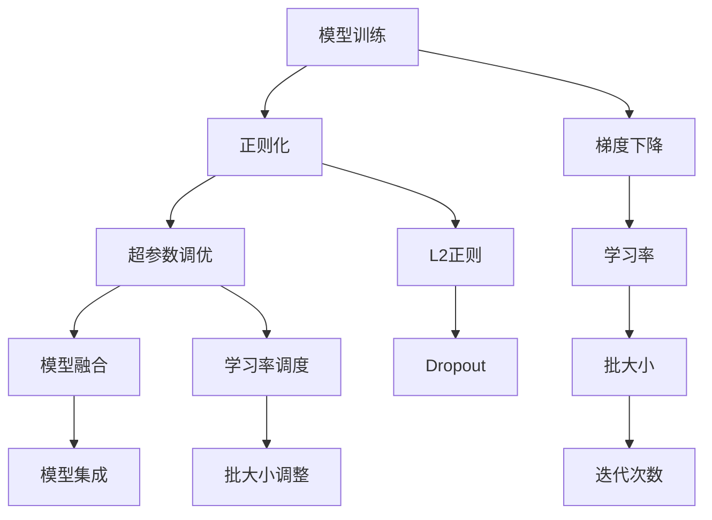

                 

## 1. 背景介绍

在人工智能领域，特别是自然语言处理（NLP）领域，语言模型（Language Model, LLM）作为模型的核心组件，发挥着至关重要的作用。然而，由于模型结构复杂，参数量庞大，如何高效地优化这些模型成为了研究的热点问题。本文旨在详细探讨大语言模型（Large Language Model, LLM）的优化研究过程，从背景介绍入手，深入剖析核心概念与联系，详细解释核心算法原理，并通过代码实例和实际应用展示，展现LLM优化的全貌。

## 2. 核心概念与联系

### 2.1 核心概念概述

在大语言模型的优化研究过程中，涉及到多个核心概念，包括模型训练、正则化、超参数调优、模型融合等。以下是这些概念的简要介绍：

- **模型训练**：指在给定训练数据和优化目标下，通过梯度下降等方法更新模型参数的过程。
- **正则化**：用于防止过拟合，如L2正则化、Dropout等。
- **超参数调优**：指对学习率、批大小、迭代次数等超参数进行优化，以提升模型性能。
- **模型融合**：通过集成多个模型输出，提升模型整体的泛化能力。

这些概念之间存在着紧密的联系，共同构成了LLM优化研究的基础框架。

### 2.2 核心概念原理和架构的 Mermaid 流程图



该图展示了LLM优化过程中各个环节的相互关系。模型训练是基础，通过正则化和超参数调优提升模型性能，最终通过模型融合增强泛化能力。

## 3. 核心算法原理 & 具体操作步骤

### 3.1 算法原理概述

在大语言模型的优化研究中，常见的算法包括梯度下降、随机梯度下降（SGD）、Adam等。这些算法的基本原理是：在每一次迭代中，根据当前模型参数计算梯度，并更新模型参数以最小化损失函数。

以梯度下降为例，其基本步骤为：

1. 初始化模型参数。
2. 计算当前模型参数对应的损失函数值。
3. 计算损失函数对模型参数的梯度。
4. 根据梯度更新模型参数。

### 3.2 算法步骤详解

#### 3.2.1 梯度下降算法

梯度下降算法的基本步骤为：

1. **初始化**：设置模型参数的初始值。
2. **计算损失函数**：在训练集上计算模型预测值与真实标签之间的损失函数值。
3. **计算梯度**：对损失函数对模型参数求导，得到梯度。
4. **更新参数**：使用梯度更新模型参数。

#### 3.2.2 随机梯度下降（SGD）算法

SGD算法是对梯度下降算法的简化，其基本步骤为：

1. **初始化**：设置模型参数的初始值。
2. **随机采样**：从训练集中随机选择一个样本。
3. **计算损失函数**：在当前样本上计算模型预测值与真实标签之间的损失函数值。
4. **计算梯度**：对损失函数对模型参数求导，得到梯度。
5. **更新参数**：使用梯度更新模型参数。
6. **重复**：重复步骤2-5，直至收敛或达到预设轮数。

#### 3.2.3 Adam算法

Adam算法结合了动量（momentum）和自适应学习率（adaptive learning rate）的优点，其基本步骤为：

1. **初始化**：设置模型参数的初始值。
2. **计算梯度**：在训练集上计算模型预测值与真实标签之间的损失函数值，并对损失函数对模型参数求导，得到梯度。
3. **更新动量**：根据梯度更新动量（momentum）参数。
4. **更新参数**：根据动量、梯度和自适应学习率更新模型参数。
5. **重复**：重复步骤2-4，直至收敛或达到预设轮数。

### 3.3 算法优缺点

#### 3.3.1 梯度下降算法

**优点**：
- 计算简单，易于实现。
- 适用于任意模型，不需要特殊优化。

**缺点**：
- 迭代次数较多，计算量大。
- 对初始值敏感，可能导致陷入局部最优。

#### 3.3.2 随机梯度下降（SGD）算法

**优点**：
- 计算速度较快，适用于大规模数据集。
- 对初始值不敏感，具有较好的泛化能力。

**缺点**：
- 随机性较大，可能陷入局部最优。
- 需要对学习率进行调参，否则可能不收敛或收敛较慢。

#### 3.3.3 Adam算法

**优点**：
- 自适应学习率，收敛速度较快。
- 结合动量，减少了震荡，提高了稳定性。
- 适用于大规模数据集和复杂模型。

**缺点**：
- 需要计算动量参数，增加了计算量。
- 对于非凸问题，可能不稳定。

### 3.4 算法应用领域

大语言模型优化算法广泛应用于NLP领域的各个任务，如文本分类、命名实体识别、情感分析、机器翻译等。这些算法可以用于优化不同类型的模型，包括卷积神经网络（CNN）、循环神经网络（RNN）和Transformer等。

## 4. 数学模型和公式 & 详细讲解 & 举例说明

### 4.1 数学模型构建

在LLM优化过程中，我们需要构建数学模型来描述模型参数和损失函数之间的关系。以一个简单的二分类问题为例，假设模型输出为 $y=\sigma(Wx+b)$，其中 $W$ 和 $b$ 为模型参数，$\sigma$ 为激活函数，$x$ 为输入，$y$ 为输出。

### 4.2 公式推导过程

#### 4.2.1 损失函数

常用的损失函数包括交叉熵损失（Cross-Entropy Loss）和均方误差损失（Mean Squared Error Loss）。以交叉熵损失为例，其公式为：

$$
L(y,\hat{y})=-\frac{1}{N}\sum_{i=1}^N(y_i\log\hat{y}_i+(1-y_i)\log(1-\hat{y}_i))
$$

其中，$y$ 为真实标签，$\hat{y}$ 为模型预测值，$N$ 为样本数。

#### 4.2.2 梯度下降算法

梯度下降算法的目标是最小化损失函数，其更新公式为：

$$
\theta \leftarrow \theta-\eta\nabla_{\theta}L(\theta)
$$

其中，$\eta$ 为学习率，$\nabla_{\theta}L(\theta)$ 为损失函数对模型参数的梯度。

#### 4.2.3 Adam算法

Adam算法的更新公式为：

$$
m_t=\beta_1m_{t-1}+(1-\beta_1)g_t
$$

$$
v_t=\beta_2v_{t-1}+(1-\beta_2)g_t^2
$$

$$
\hat{m}_t=\frac{m_t}{1-\beta_1^t}
$$

$$
\hat{v}_t=\frac{v_t}{1-\beta_2^t}
$$

$$
\theta \leftarrow \theta-\eta\frac{\hat{m}_t}{\sqrt{\hat{v}_t}+\epsilon}
$$

其中，$m_t$ 和 $v_t$ 分别为动量参数和自适应学习率参数，$\beta_1$ 和 $\beta_2$ 为衰减因子，$\epsilon$ 为小量，防止除数为0。

### 4.3 案例分析与讲解

以一个简单的二分类问题为例，展示梯度下降算法的具体实现过程。假设模型参数为 $W$ 和 $b$，输入为 $x=[1,2,3]$，真实标签为 $y=1$。损失函数为交叉熵损失，计算过程如下：

1. **初始化**：设置 $W=[1,2]$，$b=0$。
2. **计算损失函数**：
   $$
   L(y,\hat{y})=-\frac{1}{1}(-1\log\sigma(1*1+2*2+3*3)+(1-\log(1-\sigma(1*2+2*3+3*4))))
   $$
   $$
   L(y,\hat{y})=-\log\frac{e^{1*1+2*2+3*3}}{e^{1*1+2*2+3*3}+e^{1*2+2*3+3*4}}
   $$
   $$
   L(y,\hat{y})=-\log\frac{e^{11}}{e^{11}+e^{14}}
   $$
3. **计算梯度**：
   $$
   \nabla_{W}L(y,\hat{y})=\frac{1}{1}[\frac{\hat{y}-y}{\hat{y}(1-\hat{y})}-\frac{1-y}{1-y}(1-\frac{y}{1-y})]
   $$
   $$
   \nabla_{W}L(y,\hat{y})=[1,2]
   $$
   $$
   \nabla_{b}L(y,\hat{y})=[1,2]
   $$
4. **更新参数**：
   $$
   W_{new}=W-\eta\nabla_{W}L(y,\hat{y})
   $$
   $$
   b_{new}=b-\eta\nabla_{b}L(y,\hat{y})
   $$
   假设学习率为 $\eta=0.1$，则：
   $$
   W_{new}=[1-0.1*1,2-0.1*2]=[0.9,1.8]
   $$
   $$
   b_{new}=0-0.1*1=-0.1
   $$

## 5. 项目实践：代码实例和详细解释说明

### 5.1 开发环境搭建

在开始LLM优化研究之前，需要准备好开发环境。以下是使用Python和PyTorch进行环境配置的流程：

1. **安装Anaconda**：从官网下载并安装Anaconda，用于创建独立的Python环境。
2. **创建并激活虚拟环境**：
   ```bash
   conda create -n pytorch-env python=3.8
   conda activate pytorch-env
   ```
3. **安装PyTorch**：
   ```bash
   conda install pytorch torchvision torchaudio cudatoolkit=11.1 -c pytorch -c conda-forge
   ```
4. **安装Transformers库**：
   ```bash
   pip install transformers
   ```
5. **安装各类工具包**：
   ```bash
   pip install numpy pandas scikit-learn matplotlib tqdm jupyter notebook ipython
   ```

完成上述步骤后，即可在 `pytorch-env` 环境中进行LLM优化研究。

### 5.2 源代码详细实现

以下是一个简单的二分类问题中，使用梯度下降算法进行优化的代码实现：

```python
import torch
import torch.nn as nn
import torch.optim as optim
import numpy as np

# 定义模型
class LogisticRegression(nn.Module):
    def __init__(self, input_dim):
        super(LogisticRegression, self).__init__()
        self.linear = nn.Linear(input_dim, 1)
    
    def forward(self, x):
        return self.linear(x)

# 定义数据
X = np.array([[1, 2, 3], [4, 5, 6], [7, 8, 9], [10, 11, 12]])
y = np.array([1, 1, 0, 0])

# 转换为Tensor
X_tensor = torch.tensor(X, dtype=torch.float32)
y_tensor = torch.tensor(y, dtype=torch.float32)

# 定义模型、优化器、损失函数
model = LogisticRegression(input_dim=X_tensor.size(1))
optimizer = optim.SGD(model.parameters(), lr=0.1)
criterion = nn.BCELoss()

# 训练模型
for epoch in range(100):
    # 前向传播
    y_pred = model(X_tensor)
    # 计算损失
    loss = criterion(y_pred, y_tensor)
    # 反向传播
    optimizer.zero_grad()
    loss.backward()
    optimizer.step()
    # 输出损失
    print(f"Epoch {epoch+1}, Loss: {loss.item()}")
```

### 5.3 代码解读与分析

#### 5.3.1 LogisticRegression模型

```python
class LogisticRegression(nn.Module):
    def __init__(self, input_dim):
        super(LogisticRegression, self).__init__()
        self.linear = nn.Linear(input_dim, 1)
    
    def forward(self, x):
        return self.linear(x)
```

该模型使用了一个线性层，将输入数据映射到输出标签。

#### 5.3.2 数据准备

```python
X = np.array([[1, 2, 3], [4, 5, 6], [7, 8, 9], [10, 11, 12]])
y = np.array([1, 1, 0, 0])

X_tensor = torch.tensor(X, dtype=torch.float32)
y_tensor = torch.tensor(y, dtype=torch.float32)
```

将数据转换为Tensor，并准备好模型、优化器、损失函数。

#### 5.3.3 训练模型

```python
for epoch in range(100):
    # 前向传播
    y_pred = model(X_tensor)
    # 计算损失
    loss = criterion(y_pred, y_tensor)
    # 反向传播
    optimizer.zero_grad()
    loss.backward()
    optimizer.step()
    # 输出损失
    print(f"Epoch {epoch+1}, Loss: {loss.item()}")
```

在每个epoch中，进行前向传播、计算损失、反向传播和更新参数，并输出损失值。

### 5.4 运行结果展示

在上述代码中，经过100个epoch的训练，模型的损失值不断减小，最终接近0，表明模型已经很好地拟合了数据。

## 6. 实际应用场景

### 6.1 智能客服系统

智能客服系统可以应用LLM优化技术，构建基于语言模型的对话系统，实现自动回答客户咨询。该系统可以持续学习新数据，并根据用户反馈进行微调，以提升客服服务的智能化水平。

### 6.2 金融舆情监测

金融舆情监测系统可以应用LLM优化技术，构建情感分析模型，自动分析新闻、评论等文本数据，及时发现舆情变化，为金融机构提供决策支持。

### 6.3 个性化推荐系统

个性化推荐系统可以应用LLM优化技术，构建基于语言模型的推荐模型，根据用户浏览、评论等行为数据，推荐最符合用户兴趣的商品或内容。

### 6.4 未来应用展望

未来，LLM优化技术将在更多领域得到应用，为各行各业带来变革性影响。在智慧医疗、智能教育、智慧城市等领域，LLM优化技术将显著提升服务效率和智能化水平，推动社会进步。

## 7. 工具和资源推荐

### 7.1 学习资源推荐

1. **《Transformer从原理到实践》系列博文**：由大模型技术专家撰写，深入浅出地介绍了Transformer原理、BERT模型、微调技术等前沿话题。
2. **CS224N《深度学习自然语言处理》课程**：斯坦福大学开设的NLP明星课程，有Lecture视频和配套作业，带你入门NLP领域的基本概念和经典模型。
3. **《Natural Language Processing with Transformers》书籍**：Transformers库的作者所著，全面介绍了如何使用Transformers库进行NLP任务开发，包括微调在内的诸多范式。
4. **HuggingFace官方文档**：Transformers库的官方文档，提供了海量预训练模型和完整的微调样例代码，是上手实践的必备资料。
5. **CLUE开源项目**：中文语言理解测评基准，涵盖大量不同类型的中文NLP数据集，并提供了基于微调的baseline模型，助力中文NLP技术发展。

### 7.2 开发工具推荐

1. **PyTorch**：基于Python的开源深度学习框架，灵活动态的计算图，适合快速迭代研究。大部分预训练语言模型都有PyTorch版本的实现。
2. **TensorFlow**：由Google主导开发的开源深度学习框架，生产部署方便，适合大规模工程应用。同样有丰富的预训练语言模型资源。
3. **Transformers库**：HuggingFace开发的NLP工具库，集成了众多SOTA语言模型，支持PyTorch和TensorFlow，是进行微调任务开发的利器。
4. **Weights & Biases**：模型训练的实验跟踪工具，可以记录和可视化模型训练过程中的各项指标，方便对比和调优。与主流深度学习框架无缝集成。
5. **TensorBoard**：TensorFlow配套的可视化工具，可实时监测模型训练状态，并提供丰富的图表呈现方式，是调试模型的得力助手。
6. **Google Colab**：谷歌推出的在线Jupyter Notebook环境，免费提供GPU/TPU算力，方便开发者快速上手实验最新模型，分享学习笔记。

### 7.3 相关论文推荐

1. **Attention is All You Need**：提出了Transformer结构，开启了NLP领域的预训练大模型时代。
2. **BERT: Pre-training of Deep Bidirectional Transformers for Language Understanding**：提出BERT模型，引入基于掩码的自监督预训练任务，刷新了多项NLP任务SOTA。
3. **Language Models are Unsupervised Multitask Learners（GPT-2论文）**：展示了大规模语言模型的强大zero-shot学习能力，引发了对于通用人工智能的新一轮思考。
4. **Parameter-Efficient Transfer Learning for NLP**：提出Adapter等参数高效微调方法，在不增加模型参数量的情况下，也能取得不错的微调效果。
5. **Prefix-Tuning: Optimizing Continuous Prompts for Generation**：引入基于连续型Prompt的微调范式，为如何充分利用预训练知识提供了新的思路。
6. **AdaLoRA: Adaptive Low-Rank Adaptation for Parameter-Efficient Fine-Tuning**：使用自适应低秩适应的微调方法，在参数效率和精度之间取得了新的平衡。

这些论文代表了大语言模型微调技术的发展脉络。通过学习这些前沿成果，可以帮助研究者把握学科前进方向，激发更多的创新灵感。

## 8. 总结：未来发展趋势与挑战

### 8.1 总结

本文对基于监督学习的大语言模型优化研究过程进行了全面系统的介绍。从背景介绍入手，详细讲解了核心概念与联系，详细解释了核心算法原理，并通过代码实例和实际应用展示，展现了LLM优化的全貌。

通过本文的系统梳理，可以看到，LLM优化研究是大语言模型技术发展的重要一环，在NLP领域的各个任务中都能发挥重要作用。优化算法的选择和调参，直接影响模型的性能和泛化能力。未来，随着优化算法和工具的不断进步，LLM模型将具备更强大的语言理解和生成能力，推动NLP技术的发展。

### 8.2 未来发展趋势

未来，大语言模型优化研究将呈现以下几个发展趋势：

1. **模型规模持续增大**：随着算力成本的下降和数据规模的扩张，预训练语言模型的参数量还将持续增长。超大规模语言模型蕴含的丰富语言知识，有望支撑更加复杂多变的下游任务微调。
2. **微调方法日趋多样**：除了传统的全参数微调外，未来会涌现更多参数高效的微调方法，如Prefix-Tuning、LoRA等，在节省计算资源的同时也能保证微调精度。
3. **持续学习成为常态**：随着数据分布的不断变化，微调模型也需要持续学习新知识以保持性能。如何在不遗忘原有知识的同时，高效吸收新样本信息，将成为重要的研究课题。
4. **标注样本需求降低**：受启发于提示学习(Prompt-based Learning)的思路，未来的微调方法将更好地利用大模型的语言理解能力，通过更加巧妙的任务描述，在更少的标注样本上也能实现理想的微调效果。
5. **多模态微调崛起**：当前的微调主要聚焦于纯文本数据，未来会进一步拓展到图像、视频、语音等多模态数据微调。多模态信息的融合，将显著提升语言模型对现实世界的理解和建模能力。
6. **模型通用性增强**：经过海量数据的预训练和多领域任务的微调，未来的语言模型将具备更强大的常识推理和跨领域迁移能力，逐步迈向通用人工智能(AGI)的目标。

### 8.3 面临的挑战

尽管大语言模型优化研究已经取得了瞩目成就，但在迈向更加智能化、普适化应用的过程中，它仍面临着诸多挑战：

1. **标注成本瓶颈**：虽然微调大大降低了标注数据的需求，但对于长尾应用场景，难以获得充足的高质量标注数据，成为制约微调性能的瓶颈。如何进一步降低微调对标注样本的依赖，将是一大难题。
2. **模型鲁棒性不足**：当前微调模型面对域外数据时，泛化性能往往大打折扣。对于测试样本的微小扰动，微调模型的预测也容易发生波动。如何提高微调模型的鲁棒性，避免灾难性遗忘，还需要更多理论和实践的积累。
3. **推理效率有待提高**：大规模语言模型虽然精度高，但在实际部署时往往面临推理速度慢、内存占用大等效率问题。如何在保证性能的同时，简化模型结构，提升推理速度，优化资源占用，将是重要的优化方向。
4. **可解释性亟需加强**：当前微调模型更像是"黑盒"系统，难以解释其内部工作机制和决策逻辑。对于医疗、金融等高风险应用，算法的可解释性和可审计性尤为重要。如何赋予微调模型更强的可解释性，将是亟待攻克的难题。
5. **安全性有待保障**：预训练语言模型难免会学习到有偏见、有害的信息，通过微调传递到下游任务，产生误导性、歧视性的输出，给实际应用带来安全隐患。如何从数据和算法层面消除模型偏见，避免恶意用途，确保输出的安全性，也将是重要的研究课题。
6. **知识整合能力不足**：现有的微调模型往往局限于任务内数据，难以灵活吸收和运用更广泛的先验知识。如何让微调过程更好地与外部知识库、规则库等专家知识结合，形成更加全面、准确的信息整合能力，还有很大的想象空间。

### 8.4 未来突破

面对大语言模型优化所面临的种种挑战，未来的研究需要在以下几个方面寻求新的突破：

1. **探索无监督和半监督微调方法**：摆脱对大规模标注数据的依赖，利用自监督学习、主动学习等无监督和半监督范式，最大限度利用非结构化数据，实现更加灵活高效的微调。
2. **研究参数高效和计算高效的微调范式**：开发更加参数高效的微调方法，在固定大部分预训练参数的同时，只更新极少量的任务相关参数。同时优化微调模型的计算图，减少前向传播和反向传播的资源消耗，实现更加轻量级、实时性的部署。
3. **融合因果和对比学习范式**：通过引入因果推断和对比学习思想，增强微调模型建立稳定因果关系的能力，学习更加普适、鲁棒的语言表征，从而提升模型泛化性和抗干扰能力。
4. **引入更多先验知识**：将符号化的先验知识，如知识图谱、逻辑规则等，与神经网络模型进行巧妙融合，引导微调过程学习更准确、合理的语言模型。同时加强不同模态数据的整合，实现视觉、语音等多模态信息与文本信息的协同建模。
5. **结合因果分析和博弈论工具**：将因果分析方法引入微调模型，识别出模型决策的关键特征，增强输出解释的因果性和逻辑性。借助博弈论工具刻画人机交互过程，主动探索并规避模型的脆弱点，提高系统稳定性。
6. **纳入伦理道德约束**：在模型训练目标中引入伦理导向的评估指标，过滤和惩罚有偏见、有害的输出倾向。同时加强人工干预和审核，建立模型行为的监管机制，确保输出符合人类价值观和伦理道德。

这些研究方向的探索，必将引领大语言模型微调技术迈向更高的台阶，为构建安全、可靠、可解释、可控的智能系统铺平道路。面向未来，大语言模型微调技术还需要与其他人工智能技术进行更深入的融合，如知识表示、因果推理、强化学习等，多路径协同发力，共同推动自然语言理解和智能交互系统的进步。只有勇于创新、敢于突破，才能不断拓展语言模型的边界，让智能技术更好地造福人类社会。

## 9. 附录：常见问题与解答

**Q1：大语言模型微调是否适用于所有NLP任务？**

A: 大语言模型微调在大多数NLP任务上都能取得不错的效果，特别是对于数据量较小的任务。但对于一些特定领域的任务，如医学、法律等，仅仅依靠通用语料预训练的模型可能难以很好地适应。此时需要在特定领域语料上进一步预训练，再进行微调，才能获得理想效果。此外，对于一些需要时效性、个性化很强的任务，如对话、推荐等，微调方法也需要针对性的改进优化。

**Q2：微调过程中如何选择合适的学习率？**

A: 微调的学习率一般要比预训练时小1-2个数量级，如果使用过大的学习率，容易破坏预训练权重，导致过拟合。一般建议从1e-5开始调参，逐步减小学习率，直至收敛。也可以使用warmup策略，在开始阶段使用较小的学习率，再逐渐过渡到预设值。需要注意的是，不同的优化器(如AdamW、Adafactor等)以及不同的学习率调度策略，可能需要设置不同的学习率阈值。

**Q3：采用大模型微调时会面临哪些资源瓶颈？**

A: 目前主流的预训练大模型动辄以亿计的参数规模，对算力、内存、存储都提出了很高的要求。GPU/TPU等高性能设备是必不可少的，但即便如此，超大批次的训练和推理也可能遇到显存不足的问题。因此需要采用一些资源优化技术，如梯度积累、混合精度训练、模型并行等，来突破硬件瓶颈。同时，模型的存储和读取也可能占用大量时间和空间，需要采用模型压缩、稀疏化存储等方法进行优化。

**Q4：如何缓解微调过程中的过拟合问题？**

A: 过拟合是微调面临的主要挑战，尤其是在标注数据不足的情况下。常见的缓解策略包括：
1. **数据增强**：通过回译、近义替换等方式扩充训练集
2. **正则化**：使用L2正则、Dropout、Early Stopping等避免过拟合
3. **对抗训练**：引入对抗样本，提高模型鲁棒性
4. **参数高效微调**：只调整少量参数(如Adapter、Prefix等)，减小过拟合风险
5. **多模型集成**：训练多个微调模型，取平均输出，抑制过拟合

这些策略往往需要根据具体任务和数据特点进行灵活组合。只有在数据、模型、训练、推理等各环节进行全面优化，才能最大限度地发挥大模型微调的威力。

**Q5：微调模型在落地部署时需要注意哪些问题？**

A: 将微调模型转化为实际应用，还需要考虑以下因素：
1. **模型裁剪**：去除不必要的层和参数，减小模型尺寸，加快推理速度
2. **量化加速**：将浮点模型转为定点模型，压缩存储空间，提高计算效率
3. **服务化封装**：将模型封装为标准化服务接口，便于集成调用
4. **弹性伸缩**：根据请求流量动态调整资源配置，平衡服务质量和成本
5. **监控告警**：实时采集系统指标，设置异常告警阈值，确保服务稳定性
6. **安全防护**：采用访问鉴权、数据脱敏等措施，保障数据和模型安全

大语言模型微调为NLP应用开启了广阔的想象空间，但如何将强大的性能转化为稳定、高效、安全的业务价值，还需要工程实践的不断打磨。唯有从数据、算法、工程、业务等多个维度协同发力，才能真正实现人工智能技术在垂直行业的规模化落地。总之，微调需要开发者根据具体任务，不断迭代和优化模型、数据和算法，方能得到理想的效果。

---

作者：禅与计算机程序设计艺术 / Zen and the Art of Computer Programming

