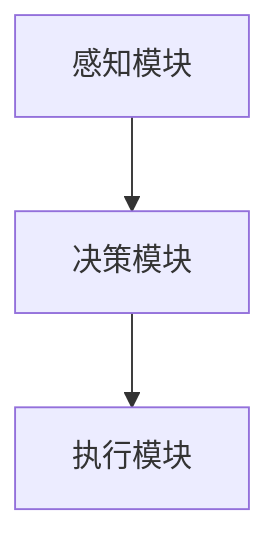

                 

# 小鹏汽车何小鹏谈端到端自动驾驶

## 1. 背景介绍

在当前汽车行业，自动驾驶技术已经逐渐成为了行业发展的焦点。小鹏汽车作为新能源汽车行业的佼佼者，一直以来在自动驾驶领域深耕多年，并不断创新，以满足消费者对驾驶安全和便捷出行的需求。小鹏汽车CEO何小鹏近期就端到端自动驾驶技术的实现和未来发展方向进行了深入探讨，分享了其独特的观点和实践经验。本文将从端到端自动驾驶的核心概念、技术架构、应用场景等方面展开，探讨这一前沿技术的发展前景和面临的挑战。

## 2. 核心概念与联系

### 2.1 核心概念概述

端到端自动驾驶技术是一种高度集成的自动驾驶解决方案，它从感知、决策到执行，整个过程都由一个系统负责处理，而不是依赖多个独立的子系统。这种技术架构强调硬件和软件的一体化，减少了系统的复杂性，提高了系统的可靠性。

- **感知模块**：利用激光雷达、摄像头、雷达等多种传感器获取车辆周围环境的信息，并转化为系统能够理解的数字信号。
- **决策模块**：通过神经网络模型（如深度学习模型）对感知数据进行分析和推理，生成导航策略。
- **执行模块**：根据决策结果，控制车辆的转向、加速、制动等操作。

### 2.2 核心概念原理和架构的 Mermaid 流程图



在这个流程图中，从感知模块获取的数据经过决策模块的处理，最终指导执行模块的动作，形成一个闭环的控制系统。这种端到端的架构，可以使得系统更加高效和稳定。

## 3. 核心算法原理 & 具体操作步骤

### 3.1 算法原理概述

端到端自动驾驶技术的核心算法主要包括感知算法、决策算法和执行算法。

- **感知算法**：主要负责从传感器获取数据，并将其转化为系统可处理的形式。常用的算法包括图像处理、激光雷达点云处理、语义分割等。
- **决策算法**：在获取感知数据的基础上，通过深度学习等算法对环境进行分析，生成路径规划和行为决策。
- **执行算法**：将决策结果转化为具体的操作指令，如转向、加速、制动等。

### 3.2 算法步骤详解

1. **传感器数据获取**：
   - 利用激光雷达、摄像头、雷达等传感器，收集车辆周围环境的数据。
   - 对传感器数据进行预处理，如去噪、归一化等，确保数据的准确性和稳定性。

2. **数据融合**：
   - 将来自不同传感器的数据进行融合，生成更加全面和可靠的环境表示。
   - 常用的数据融合算法包括卡尔曼滤波、扩展卡尔曼滤波等。

3. **环境感知**：
   - 利用深度学习等算法，对环境数据进行分析和推理，生成车辆周围环境的语义图。
   - 常用的感知算法包括卷积神经网络（CNN）、生成对抗网络（GAN）等。

4. **路径规划和决策**：
   - 根据环境感知结果，生成路径规划和行为决策。
   - 常用的决策算法包括动态规划、神经网络等。

5. **执行控制**：
   - 将决策结果转化为具体的操作指令，如转向、加速、制动等。
   - 常用的执行算法包括PID控制、模型预测控制等。

### 3.3 算法优缺点

**优点**：
- 端到端架构简化了系统复杂度，提高了系统的可靠性和效率。
- 通过集成硬件和软件，可以实现更高的系统性能和精度。
- 减少了系统维护和调试的难度，提高了系统的可维护性。

**缺点**：
- 实现难度较大，需要跨多个领域的知识。
- 对于传感器数据的依赖较大，传感器失效可能导致系统失效。
- 对硬件的要求较高，成本较高。

### 3.4 算法应用领域

端到端自动驾驶技术在多个领域都有广泛的应用，包括但不限于：

- **智能驾驶**：在城市道路、高速公路等场景下的自动驾驶应用。
- **自动泊车**：在停车场、停车位等场景下的自动泊车应用。
- **车联网**：在车与车、车与网的通信中，实现车辆间的信息共享和协同控制。

## 4. 数学模型和公式 & 详细讲解 & 举例说明

### 4.1 数学模型构建

端到端自动驾驶技术涉及多个领域的数学模型，包括传感器数据处理、深度学习模型、决策算法和执行控制等。

### 4.2 公式推导过程

以深度学习模型为例，常用的感知算法是基于卷积神经网络（CNN）的语义分割模型。该模型的目标是将环境数据分成不同的语义类别，如道路、车辆、行人等。公式推导如下：

设输入数据为 $x$，输出为 $y$，定义损失函数 $L$，则模型优化的目标为：

$$
\min_{\theta} L(y, \hat{y})
$$

其中 $\theta$ 为模型的参数，$\hat{y}$ 为模型的预测输出，$L$ 为常用的损失函数，如交叉熵损失。

### 4.3 案例分析与讲解

以小鹏汽车为例，其端到端自动驾驶技术中的感知模块采用了多传感器融合的方法，结合激光雷达和摄像头，生成高精度的环境表示。决策模块采用了深度学习模型，对环境数据进行分析和推理，生成路径规划和行为决策。执行模块采用了PID控制算法，将决策结果转化为具体的转向和制动指令。

## 5. 项目实践：代码实例和详细解释说明

### 5.1 开发环境搭建

为了实现端到端自动驾驶技术，需要搭建一个包含感知、决策和执行模块的系统。以下是开发环境的搭建步骤：

1. **安装传感器和硬件设备**：
   - 安装激光雷达、摄像头、雷达等传感器，并进行连接和配置。
   - 安装并配置执行机构，如转向系统、制动系统等。

2. **搭建感知模块**：
   - 选择合适的感知算法，如卷积神经网络（CNN）、生成对抗网络（GAN）等。
   - 对传感器数据进行预处理和融合，生成环境表示。

3. **搭建决策模块**：
   - 选择合适的深度学习模型，如卷积神经网络（CNN）、循环神经网络（RNN）等。
   - 对环境数据进行分析和推理，生成路径规划和行为决策。

4. **搭建执行模块**：
   - 选择合适的执行算法，如PID控制、模型预测控制等。
   - 根据决策结果，控制车辆的转向、加速、制动等操作。

### 5.2 源代码详细实现

以下是一个简单的端到端自动驾驶系统的代码实现：

```python
class PerceptionModule:
    def __init__(self):
        # 初始化感知模块，安装传感器和硬件设备

    def fuse_data(self, lidar_data, camera_data, radar_data):
        # 融合传感器数据，生成环境表示

class DecisionModule:
    def __init__(self):
        # 初始化决策模块，搭建深度学习模型

    def predict_path(self, environment_map):
        # 对环境数据进行分析和推理，生成路径规划和行为决策

class ExecutionModule:
    def __init__(self):
        # 初始化执行模块，搭建执行算法

    def control(self, decision):
        # 根据决策结果，控制车辆的转向、加速、制动等操作
```

### 5.3 代码解读与分析

在上述代码中，`PerceptionModule` 负责传感器的数据获取和融合，生成环境表示。`DecisionModule` 负责利用深度学习模型对环境数据进行分析和推理，生成路径规划和行为决策。`ExecutionModule` 负责将决策结果转化为具体的操作指令，如转向、加速、制动等。

### 5.4 运行结果展示

运行上述代码，可以通过模拟仿真或实际车辆测试，验证系统的性能。例如，在模拟仿真中，可以设定车辆在不同环境下的行驶路径，验证系统的路径规划和行为决策能力。在实际车辆测试中，可以通过传感器数据和车辆控制指令，验证系统的感知、决策和执行能力。

## 6. 实际应用场景

### 6.1 智能驾驶

智能驾驶是端到端自动驾驶技术的重要应用场景之一。通过端到端技术，车辆可以自动感知周围环境，进行路径规划和决策，最终实现自动驾驶。小鹏汽车已经在多个城市开展智能驾驶测试，为用户提供便捷和安全的出行体验。

### 6.2 自动泊车

自动泊车是端到端自动驾驶技术的另一重要应用场景。通过端到端技术，车辆可以自动感知停车位，规划最优泊车路径，并执行相应的操作，实现自动泊车。小鹏汽车推出的P7车型，已经具备了自动泊车功能，进一步提升了用户的便捷性。

### 6.3 车联网

车联网是端到端自动驾驶技术的未来发展方向之一。通过车与车、车与网的通信，可以实现车辆间的信息共享和协同控制，提高道路通行效率和安全性。小鹏汽车正在探索车联网技术，预计未来将实现更加智能和高效的出行体验。

### 6.4 未来应用展望

未来，端到端自动驾驶技术将在更多领域得到应用，为智能交通系统带来变革性影响。

1. **城市交通管理**：通过车联网技术，实现城市交通的智能化管理，提高交通效率和安全性。
2. **物流配送**：通过自动驾驶技术，实现无人驾驶车辆的物流配送，提高配送效率和降低人力成本。
3. **智能家居**：通过自动驾驶技术，实现车辆与家居的互联互通，提供更加智能和便捷的家庭生活体验。
4. **远程医疗**：通过自动驾驶技术，实现无人驾驶车辆的远程医疗服务，提供便捷的医疗服务。

## 7. 工具和资源推荐

### 7.1 学习资源推荐

为了帮助开发者深入掌握端到端自动驾驶技术，推荐以下学习资源：

1. **《自动驾驶》系列书籍**：深入介绍自动驾驶技术的基础知识和前沿技术，适合全面了解自动驾驶技术。
2. **《深度学习》系列课程**：由斯坦福大学等名校开设的深度学习课程，涵盖深度学习的基础和应用，适合深度学习入门和进阶。
3. **小鹏汽车官方文档**：小鹏汽车提供的官方文档，涵盖端到端自动驾驶技术的具体实现和实践经验，适合技术学习和参考。

### 7.2 开发工具推荐

以下推荐的工具和资源可以帮助开发者高效实现端到端自动驾驶技术：

1. **ROS（Robot Operating System）**：开源的机器人操作系统，支持多种传感器和执行机构的集成，适合开发和测试自动驾驶系统。
2. **TensorFlow**：开源的深度学习框架，支持多种深度学习模型的实现，适合自动驾驶技术中的深度学习部分。
3. **C++和Python**：常用的编程语言，适合开发自动驾驶系统中的感知、决策和执行模块。

### 7.3 相关论文推荐

以下是几篇关于端到端自动驾驶技术的经典论文，推荐阅读：

1. **End-to-End Learning for Self-Driving Cars**：提出了一种端到端学习的方法，将感知、决策和执行模块整合到一个深度神经网络中，实现了自动驾驶。
2. **Real-Time Single-Layer Neural Networks for Perception**：提出了一种单层神经网络，用于环境感知，实现了端到端自动驾驶系统的高效感知。
3. **Behavior Cloning with End-to-End Differentiable Learning**：提出了一种基于行为克隆的方法，实现了端到端自动驾驶系统的决策和执行。

## 8. 总结：未来发展趋势与挑战

### 8.1 研究成果总结

端到端自动驾驶技术在近年来取得了显著进展，主要体现在以下几个方面：

1. **硬件设备的提升**：激光雷达、摄像头、雷达等传感器技术的不断进步，提高了环境感知的精度和可靠性。
2. **深度学习模型的改进**：卷积神经网络、循环神经网络等深度学习模型的不断优化，提升了决策和执行模块的性能。
3. **系统集成技术的成熟**：传感器数据融合、深度学习模型的集成等技术的成熟，使得端到端系统更加稳定和高效。

### 8.2 未来发展趋势

未来，端到端自动驾驶技术将在以下几个方面继续发展：

1. **传感器技术的进步**：激光雷达、摄像头、雷达等传感器技术的进一步提升，将使得环境感知更加精确和全面。
2. **深度学习模型的创新**：新型深度学习模型的研究和应用，将提升决策和执行模块的性能和效率。
3. **系统集成技术的完善**：多传感器融合、深度学习模型的集成等技术的进一步优化，将使得端到端系统更加稳定和高效。

### 8.3 面临的挑战

尽管端到端自动驾驶技术已经取得了显著进展，但仍然面临以下挑战：

1. **感知算法的精度和可靠性**：传感器的数据获取和预处理，直接影响到环境感知的精度和可靠性。
2. **决策算法的鲁棒性和安全性**：决策算法在复杂环境下的鲁棒性和安全性，需要进一步提升。
3. **执行算法的实时性和稳定性**：执行算法的实时性和稳定性，直接影响车辆的操控性能。

### 8.4 研究展望

未来，端到端自动驾驶技术需要在以下几个方面进行深入研究：

1. **多传感器融合技术**：研究多传感器数据的融合算法，提高环境感知的精度和可靠性。
2. **新型深度学习模型**：研究新型深度学习模型，提升决策和执行模块的性能和效率。
3. **系统集成技术**：研究系统集成技术，提高系统的稳定性和可靠性。

## 9. 附录：常见问题与解答

**Q1：端到端自动驾驶技术的实现难度如何？**

A: 端到端自动驾驶技术的实现难度较大，涉及多个领域的知识和技能。需要在传感器数据处理、深度学习模型、决策算法和执行控制等多个方面进行综合设计和优化。

**Q2：端到端自动驾驶技术在实际应用中面临哪些挑战？**

A: 端到端自动驾驶技术在实际应用中面临以下几个挑战：

1. **感知算法的精度和可靠性**：传感器的数据获取和预处理，直接影响到环境感知的精度和可靠性。
2. **决策算法的鲁棒性和安全性**：决策算法在复杂环境下的鲁棒性和安全性，需要进一步提升。
3. **执行算法的实时性和稳定性**：执行算法的实时性和稳定性，直接影响车辆的操控性能。

**Q3：如何优化端到端自动驾驶技术中的感知模块？**

A: 优化端到端自动驾驶技术中的感知模块，可以从以下几个方面入手：

1. **选择高性能传感器**：选择性能稳定、精度高的传感器，如激光雷达、摄像头等。
2. **数据预处理技术**：采用去噪、归一化等预处理技术，提高数据的质量和稳定性。
3. **融合算法优化**：选择和优化多传感器融合算法，提高环境表示的精度和可靠性。

**Q4：如何提高端到端自动驾驶技术的决策模块的性能？**

A: 提高端到端自动驾驶技术的决策模块的性能，可以从以下几个方面入手：

1. **选择合适的深度学习模型**：选择合适的深度学习模型，如卷积神经网络（CNN）、循环神经网络（RNN）等。
2. **数据增强技术**：采用数据增强技术，如回译、旋转、裁剪等，提高模型对环境数据的泛化能力。
3. **模型训练策略优化**：优化模型训练策略，如学习率调整、正则化技术等，提高模型的性能和稳定性。

**Q5：如何确保端到端自动驾驶技术的执行模块的实时性和稳定性？**

A: 确保端到端自动驾驶技术的执行模块的实时性和稳定性，可以从以下几个方面入手：

1. **选择高性能控制器**：选择性能稳定、实时性高的控制器，如PID控制、模型预测控制等。
2. **优化控制算法**：优化控制算法，提高算法的实时性和稳定性。
3. **硬件加速技术**：采用硬件加速技术，如GPU、FPGA等，提高算法的执行效率。

---

作者：禅与计算机程序设计艺术 / Zen and the Art of Computer Programming

