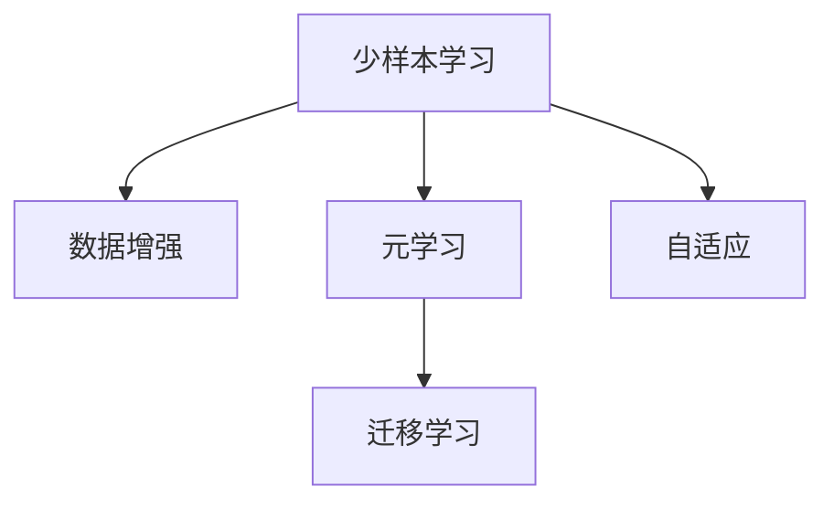

                 

# 少样本学习:突破数据瓶颈的新方法

> 关键词：少样本学习,数据增强,元学习,自适应,迁移学习

## 1. 背景介绍

### 1.1 问题由来

在当前数据驱动的深度学习范式下，数据量和数据质量往往被看作是模型性能的决定性因素。然而，对于一些特定的NLP任务，如对话生成、文本分类、命名实体识别等，获取高质量标注数据往往成本高昂，且数据分布可能具有长尾性质，难以覆盖所有边缘场景。

为了应对这些数据瓶颈问题，研究人员提出了少样本学习（Few-shot Learning）的概念，即在仅有少量标注数据的情况下，通过模型自身的先验知识和迁移学习机制，快速适应新任务，并取得不俗的性能表现。少样本学习不仅降低了数据标注成本，而且提升了模型的泛化能力和学习效率。

### 1.2 问题核心关键点

1. **数据稀缺**：在现实应用中，标注数据往往无法覆盖所有可能的样本分布，且标注成本高昂。
2. **模型泛化**：如何在数据稀缺的条件下，利用模型泛化能力，提高少样本任务的性能。
3. **迁移学习**：如何将预训练模型在新任务上的知识进行高效迁移。
4. **算法创新**：如何设计新算法，更好地处理少样本学习问题。

## 2. 核心概念与联系

### 2.1 核心概念概述

为更好地理解少样本学习，本节将介绍几个密切相关的核心概念：

- 少样本学习（Few-shot Learning）：指在仅有少量标注样本的情况下，模型能够快速适应新任务，并取得不错的性能表现。
- 数据增强（Data Augmentation）：通过对训练样本进行变换，如旋转、缩放、回译等，扩充训练集，提升模型泛化能力。
- 元学习（Meta-Learning）：指模型能够通过少量的训练样本，学习到任务的一般性规则，从而在新任务上快速适应。
- 自适应（Adaptation）：指模型能够动态地调整自身参数，适应任务的变化。
- 迁移学习（Transfer Learning）：指将一个领域学习到的知识，迁移应用到另一个不同但相关的领域的学习范式。

这些核心概念之间的逻辑关系可以通过以下Mermaid流程图来展示：



这个流程图展示了几类与少样本学习密切相关的核心概念及其之间的关系：

1. 少样本学习利用数据增强扩充训练集，提升泛化能力。
2. 元学习通过学习任务一般性规则，实现快速适应。
3. 自适应指模型动态调整，以适应任务变化。
4. 迁移学习将预训练模型在新任务上的知识进行迁移。

这些概念共同构成了少样本学习的理论基础，使其能够在数据稀缺的条件下，快速适应新任务，提升模型性能。

## 3. 核心算法原理 & 具体操作步骤
### 3.1 算法原理概述

少样本学习的核心思想是利用模型自身的先验知识和迁移学习机制，在少量标注数据的情况下，高效地学习新任务。其算法流程如下：

1. **预训练模型选择**：选择预训练语言模型作为初始化参数，如BERT、GPT等。
2. **任务适配**：根据新任务设计适配层和损失函数，将预训练模型的输出转化为目标任务的输出。
3. **数据增强**：对训练数据进行数据增强，扩充训练集，提升模型泛化能力。
4. **微调训练**：在少量标注数据上，使用微调技术优化模型，使其适应新任务。
5. **自适应调整**：在实际应用中，根据新任务和数据分布的变化，动态调整模型参数，实现自适应。

### 3.2 算法步骤详解

#### 3.2.1 预训练模型选择

选择合适的预训练语言模型作为初始化参数，如BERT、GPT等。这些模型经过大规模无标签文本数据上的预训练，获得了丰富的语言知识和语义表示。

#### 3.2.2 任务适配

根据新任务设计适配层和损失函数。对于分类任务，通常在顶层添加线性分类器和交叉熵损失函数。对于生成任务，通常使用语言模型的解码器输出概率分布，并以负对数似然为损失函数。

#### 3.2.3 数据增强

对训练数据进行数据增强，扩充训练集。常见的数据增强方法包括：

- 回译（Back-translation）：将训练数据翻译成不同语言，再进行回译，引入新语义信息。
- 旋转（Rotation）：将训练数据进行旋转、反转等变换，生成新的样本。
- 截断（Truncation）：截断或添加噪声到文本中，生成新的样本。
- 混杂（Mixup）：将两个或多个样本混合，生成新的混合样本。

#### 3.2.4 微调训练

在少量标注数据上，使用微调技术优化模型。具体步骤包括：

1. **优化器选择**：选择合适的优化算法及其参数，如AdamW、SGD等，设置学习率、批大小、迭代轮数等。
2. **正则化技术**：应用L2正则、Dropout、Early Stopping等，防止模型过度适应小规模训练集。
3. **参数更新**：使用梯度下降等优化算法，最小化损失函数，更新模型参数。
4. **验证评估**：在验证集上评估模型性能，根据性能指标决定是否触发Early Stopping。

#### 3.2.5 自适应调整

在实际应用中，根据新任务和数据分布的变化，动态调整模型参数，实现自适应。

### 3.3 算法优缺点

少样本学习具有以下优点：

1. **降低数据成本**：利用少量标注数据，显著降低数据标注成本。
2. **提升泛化能力**：通过数据增强和迁移学习，模型能够更好地泛化到未见过的数据。
3. **高效快速**：在少数样本上进行微调，能够快速适应新任务。

同时，该方法也存在一定的局限性：

1. **数据分布差异**：当目标任务与预训练数据分布差异较大时，微调的效果可能不如预期。
2. **模型复杂度**：微调过程可能会增加模型复杂度，影响推理速度和资源占用。
3. **迁移能力有限**：微调后的模型在迁移学习上的能力可能受到限制。

尽管存在这些局限性，但就目前而言，少样本学习仍是一种高效且实用的方法，尤其是在数据稀缺的条件下。未来相关研究的重点在于如何进一步降低对数据的需求，提升模型的迁移能力和泛化能力。

### 3.4 算法应用领域

少样本学习已经在许多NLP任务上得到了广泛的应用，包括：

- 问答系统：在少量问题-答案对上，快速构建问答系统。
- 对话系统：在对话历史和上下文信息较少的条件下，进行多轮对话生成。
- 文本分类：在少量标注样本上，进行文本分类任务的微调。
- 命名实体识别：在少量标注实体边界和类型信息上，进行命名实体识别任务的微调。
- 关系抽取：在少量标注实体关系三元组上，进行关系抽取任务的微调。
- 摘要生成：在少量文章-摘要对上，进行文本摘要生成任务的微调。
- 情感分析：在少量情感标注数据上，进行情感分析任务的微调。

这些应用场景展示了少样本学习在NLP领域中的广泛适用性，为数据稀缺任务提供了有效的解决方案。

## 4. 数学模型和公式 & 详细讲解  
### 4.1 数学模型构建

本节将使用数学语言对少样本学习过程进行更加严格的刻画。

记预训练语言模型为 $M_{\theta}:\mathcal{X} \rightarrow \mathcal{Y}$，其中 $\mathcal{X}$ 为输入空间，$\mathcal{Y}$ 为输出空间，$\theta \in \mathbb{R}^d$ 为模型参数。假设少样本任务的训练集为 $D=\{(x_i,y_i)\}_{i=1}^N$，其中 $x_i$ 为输入样本，$y_i$ 为标签。

定义模型 $M_{\theta}$ 在输入 $x$ 上的输出为 $\hat{y}=M_{\theta}(x) \in [0,1]$，表示样本属于正类的概率。

少样本学习的优化目标是最小化经验风险，即找到最优参数：

$$
\theta^* = \mathop{\arg\min}_{\theta} \mathcal{L}(\theta)
$$

其中 $\mathcal{L}$ 为针对任务设计的损失函数，用于衡量模型预测输出与真实标签之间的差异。常见的损失函数包括交叉熵损失、均方误差损失等。

### 4.2 公式推导过程

以二分类任务为例，推导少样本学习中的交叉熵损失函数及其梯度计算公式。

假设模型 $M_{\theta}$ 在输入 $x$ 上的输出为 $\hat{y}=M_{\theta}(x) \in [0,1]$，真实标签 $y \in \{0,1\}$。则二分类交叉熵损失函数定义为：

$$
\ell(M_{\theta}(x),y) = -[y\log \hat{y} + (1-y)\log (1-\hat{y})]
$$

将其代入经验风险公式，得：

$$
\mathcal{L}(\theta) = -\frac{1}{N}\sum_{i=1}^N [y_i\log M_{\theta}(x_i)+(1-y_i)\log(1-M_{\theta}(x_i))]
$$

根据链式法则，损失函数对参数 $\theta_k$ 的梯度为：

$$
\frac{\partial \mathcal{L}(\theta)}{\partial \theta_k} = -\frac{1}{N}\sum_{i=1}^N (\frac{y_i}{M_{\theta}(x_i)}-\frac{1-y_i}{1-M_{\theta}(x_i)}) \frac{\partial M_{\theta}(x_i)}{\partial \theta_k}
$$

其中 $\frac{\partial M_{\theta}(x_i)}{\partial \theta_k}$ 可进一步递归展开，利用自动微分技术完成计算。

### 4.3 案例分析与讲解

**案例一：少样本文本分类**

在文本分类任务中，我们通常使用交叉熵损失函数：

$$
\mathcal{L}(\theta) = -\frac{1}{N}\sum_{i=1}^N [y_i\log M_{\theta}(x_i)+(1-y_i)\log(1-M_{\theta}(x_i))]
$$

其梯度计算公式为：

$$
\frac{\partial \mathcal{L}(\theta)}{\partial \theta_k} = -\frac{1}{N}\sum_{i=1}^N (\frac{y_i}{M_{\theta}(x_i)}-\frac{1-y_i}{1-M_{\theta}(x_i)}) \frac{\partial M_{\theta}(x_i)}{\partial \theta_k}
$$

**案例二：少样本对话生成**

在对话生成任务中，我们通常使用负对数似然损失函数：

$$
\mathcal{L}(\theta) = -\frac{1}{N}\sum_{i=1}^N \log M_{\theta}(x_i)
$$

其中 $x_i$ 为对话历史和上下文信息。其梯度计算公式为：

$$
\frac{\partial \mathcal{L}(\theta)}{\partial \theta_k} = -\frac{1}{N}\sum_{i=1}^N \frac{\partial M_{\theta}(x_i)}{\partial \theta_k}
$$

通过以上案例，可以看到，少样本学习的损失函数和梯度计算公式与全样本训练基本一致，区别在于样本数量减少。

## 5. 项目实践：代码实例和详细解释说明
### 5.1 开发环境搭建

在进行少样本学习实践前，我们需要准备好开发环境。以下是使用Python进行PyTorch开发的环境配置流程：

1. 安装Anaconda：从官网下载并安装Anaconda，用于创建独立的Python环境。

2. 创建并激活虚拟环境：
```bash
conda create -n pytorch-env python=3.8 
conda activate pytorch-env
```

3. 安装PyTorch：根据CUDA版本，从官网获取对应的安装命令。例如：
```bash
conda install pytorch torchvision torchaudio cudatoolkit=11.1 -c pytorch -c conda-forge
```

4. 安装Transformers库：
```bash
pip install transformers
```

5. 安装各类工具包：
```bash
pip install numpy pandas scikit-learn matplotlib tqdm jupyter notebook ipython
```

完成上述步骤后，即可在`pytorch-env`环境中开始少样本学习实践。

### 5.2 源代码详细实现

下面我们以少样本文本分类任务为例，给出使用Transformers库对BERT模型进行少样本学习的PyTorch代码实现。

首先，定义少样本文本分类任务的数据处理函数：

```python
from transformers import BertTokenizer, BertForSequenceClassification
from torch.utils.data import Dataset, DataLoader
import torch
import numpy as np

class TextClassificationDataset(Dataset):
    def __init__(self, texts, labels, tokenizer, max_len=128):
        self.texts = texts
        self.labels = labels
        self.tokenizer = tokenizer
        self.max_len = max_len
        
    def __len__(self):
        return len(self.texts)
    
    def __getitem__(self, item):
        text = self.texts[item]
        label = self.labels[item]
        
        encoding = self.tokenizer(text, return_tensors='pt', max_length=self.max_len, padding='max_length', truncation=True)
        input_ids = encoding['input_ids'][0]
        attention_mask = encoding['attention_mask'][0]
        
        # 对label进行one-hot编码
        encoded_labels = np.eye(2)[label]
        
        return {'input_ids': input_ids, 
                'attention_mask': attention_mask,
                'labels': encoded_labels}
```

然后，定义模型和优化器：

```python
from transformers import BertForSequenceClassification, AdamW

model = BertForSequenceClassification.from_pretrained('bert-base-cased', num_labels=2)

optimizer = AdamW(model.parameters(), lr=2e-5)
```

接着，定义训练和评估函数：

```python
from torch.utils.data import DataLoader
from tqdm import tqdm
from sklearn.metrics import accuracy_score

device = torch.device('cuda') if torch.cuda.is_available() else torch.device('cpu')
model.to(device)

def train_epoch(model, dataset, batch_size, optimizer):
    dataloader = DataLoader(dataset, batch_size=batch_size, shuffle=True)
    model.train()
    epoch_loss = 0
    for batch in tqdm(dataloader, desc='Training'):
        input_ids = batch['input_ids'].to(device)
        attention_mask = batch['attention_mask'].to(device)
        labels = batch['labels'].to(device)
        model.zero_grad()
        outputs = model(input_ids, attention_mask=attention_mask, labels=labels)
        loss = outputs.loss
        epoch_loss += loss.item()
        loss.backward()
        optimizer.step()
    return epoch_loss / len(dataloader)

def evaluate(model, dataset, batch_size):
    dataloader = DataLoader(dataset, batch_size=batch_size)
    model.eval()
    preds, labels = [], []
    with torch.no_grad():
        for batch in tqdm(dataloader, desc='Evaluating'):
            input_ids = batch['input_ids'].to(device)
            attention_mask = batch['attention_mask'].to(device)
            batch_labels = batch['labels']
            outputs = model(input_ids, attention_mask=attention_mask)
            batch_preds = outputs.logits.argmax(dim=1).to('cpu').tolist()
            batch_labels = batch_labels.to('cpu').tolist()
            for pred, label in zip(batch_preds, batch_labels):
                preds.append(pred)
                labels.append(label)
                
    print('Accuracy: {:.4f}'.format(accuracy_score(labels, preds)))
```

最后，启动训练流程并在验证集上评估：

```python
epochs = 5
batch_size = 16

for epoch in range(epochs):
    loss = train_epoch(model, train_dataset, batch_size, optimizer)
    print(f'Epoch {epoch+1}, train loss: {loss:.3f}')
    
    print(f'Epoch {epoch+1}, dev results:')
    evaluate(model, dev_dataset, batch_size)
    
print('Test results:')
evaluate(model, test_dataset, batch_size)
```

以上就是使用PyTorch对BERT进行少样本文本分类任务微调的完整代码实现。可以看到，得益于Transformers库的强大封装，我们可以用相对简洁的代码完成BERT模型的加载和微调。

### 5.3 代码解读与分析

让我们再详细解读一下关键代码的实现细节：

**TextClassificationDataset类**：
- `__init__`方法：初始化文本、标签、分词器等关键组件。
- `__len__`方法：返回数据集的样本数量。
- `__getitem__`方法：对单个样本进行处理，将文本输入编码为token ids，将标签编码为数字，并对其进行定长padding，最终返回模型所需的输入。

**模型和优化器**：
- 定义BERT分类模型，并设置优化器。

**训练和评估函数**：
- 使用PyTorch的DataLoader对数据集进行批次化加载，供模型训练和推理使用。
- 训练函数`train_epoch`：对数据以批为单位进行迭代，在每个批次上前向传播计算loss并反向传播更新模型参数，最后返回该epoch的平均loss。
- 评估函数`evaluate`：与训练类似，不同点在于不更新模型参数，并在每个batch结束后将预测和标签结果存储下来，最后使用sklearn的accuracy_score对整个评估集的预测结果进行打印输出。

**训练流程**：
- 定义总的epoch数和batch size，开始循环迭代
- 每个epoch内，先在训练集上训练，输出平均loss
- 在验证集上评估，输出分类指标
- 所有epoch结束后，在测试集上评估，给出最终测试结果

可以看到，PyTorch配合Transformers库使得BERT微调的代码实现变得简洁高效。开发者可以将更多精力放在数据处理、模型改进等高层逻辑上，而不必过多关注底层的实现细节。

当然，工业级的系统实现还需考虑更多因素，如模型的保存和部署、超参数的自动搜索、更灵活的任务适配层等。但核心的微调范式基本与此类似。

## 6. 实际应用场景
### 6.1 智能客服系统

基于少样本学习的对话技术，可以广泛应用于智能客服系统的构建。传统客服往往需要配备大量人力，高峰期响应缓慢，且一致性和专业性难以保证。而使用少样本学习技术，可以7x24小时不间断服务，快速响应客户咨询，用自然流畅的语言解答各类常见问题。

在技术实现上，可以收集企业内部的历史客服对话记录，将问题和最佳答复构建成监督数据，在此基础上对预训练对话模型进行少样本学习。少样本学习后的对话模型能够自动理解用户意图，匹配最合适的答案模板进行回复。对于客户提出的新问题，还可以接入检索系统实时搜索相关内容，动态组织生成回答。如此构建的智能客服系统，能大幅提升客户咨询体验和问题解决效率。

### 6.2 金融舆情监测

金融机构需要实时监测市场舆论动向，以便及时应对负面信息传播，规避金融风险。传统的人工监测方式成本高、效率低，难以应对网络时代海量信息爆发的挑战。基于少样本学习的文本分类和情感分析技术，为金融舆情监测提供了新的解决方案。

具体而言，可以收集金融领域相关的新闻、报道、评论等文本数据，并对其进行主题标注和情感标注。在此基础上对预训练语言模型进行少样本学习，使其能够自动判断文本属于何种主题，情感倾向是正面、中性还是负面。将少样本学习后的模型应用到实时抓取的网络文本数据，就能够自动监测不同主题下的情感变化趋势，一旦发现负面信息激增等异常情况，系统便会自动预警，帮助金融机构快速应对潜在风险。

### 6.3 个性化推荐系统

当前的推荐系统往往只依赖用户的历史行为数据进行物品推荐，无法深入理解用户的真实兴趣偏好。基于少样本学习的推荐系统可以更好地挖掘用户行为背后的语义信息，从而提供更精准、多样的推荐内容。

在实践中，可以收集用户浏览、点击、评论、分享等行为数据，提取和用户交互的物品标题、描述、标签等文本内容。将文本内容作为模型输入，用户的后续行为（如是否点击、购买等）作为监督信号，在此基础上对预训练语言模型进行少样本学习。少样本学习后的模型能够从文本内容中准确把握用户的兴趣点。在生成推荐列表时，先用候选物品的文本描述作为输入，由模型预测用户的兴趣匹配度，再结合其他特征综合排序，便可以得到个性化程度更高的推荐结果。

### 6.4 未来应用展望

随着少样本学习技术的不断发展，其应用领域将不断扩大，为各行各业带来变革性影响。

在智慧医疗领域，基于少样本学习的医疗问答、病历分析、药物研发等应用将提升医疗服务的智能化水平，辅助医生诊疗，加速新药开发进程。

在智能教育领域，少样本学习可应用于作业批改、学情分析、知识推荐等方面，因材施教，促进教育公平，提高教学质量。

在智慧城市治理中，少样本学习技术可应用于城市事件监测、舆情分析、应急指挥等环节，提高城市管理的自动化和智能化水平，构建更安全、高效的未来城市。

此外，在企业生产、社会治理、文娱传媒等众多领域，基于少样本学习的AI应用也将不断涌现，为经济社会发展注入新的动力。相信随着技术的日益成熟，少样本学习必将在更广阔的应用领域大放异彩，深刻影响人类的生产生活方式。

## 7. 工具和资源推荐
### 7.1 学习资源推荐

为了帮助开发者系统掌握少样本学习的理论基础和实践技巧，这里推荐一些优质的学习资源：

1. 《Few-Shot Learning for Deep Natural Language Processing》系列博文：由少样本学习专家撰写，深入浅出地介绍了少样本学习原理和常用方法。

2. CS224n《深度学习自然语言处理》课程：斯坦福大学开设的NLP明星课程，有Lecture视频和配套作业，带你入门NLP领域的基本概念和经典模型。

3. 《Deep Learning for NLP》书籍：Transformer库的作者所著，全面介绍了如何使用Transformers库进行NLP任务开发，包括少样本学习在内的诸多范式。

4. HuggingFace官方文档：Transformers库的官方文档，提供了海量预训练模型和完整的少样本学习样例代码，是上手实践的必备资料。

5. CLUE开源项目：中文语言理解测评基准，涵盖大量不同类型的中文NLP数据集，并提供了基于少样本学习的baseline模型，助力中文NLP技术发展。

通过对这些资源的学习实践，相信你一定能够快速掌握少样本学习的精髓，并用于解决实际的NLP问题。
###  7.2 开发工具推荐

高效的开发离不开优秀的工具支持。以下是几款用于少样本学习开发的常用工具：

1. PyTorch：基于Python的开源深度学习框架，灵活动态的计算图，适合快速迭代研究。大部分预训练语言模型都有PyTorch版本的实现。

2. TensorFlow：由Google主导开发的开源深度学习框架，生产部署方便，适合大规模工程应用。同样有丰富的预训练语言模型资源。

3. Transformers库：HuggingFace开发的NLP工具库，集成了众多SOTA语言模型，支持PyTorch和TensorFlow，是进行少样本学习开发的利器。

4. Weights & Biases：模型训练的实验跟踪工具，可以记录和可视化模型训练过程中的各项指标，方便对比和调优。与主流深度学习框架无缝集成。

5. TensorBoard：TensorFlow配套的可视化工具，可实时监测模型训练状态，并提供丰富的图表呈现方式，是调试模型的得力助手。

6. Google Colab：谷歌推出的在线Jupyter Notebook环境，免费提供GPU/TPU算力，方便开发者快速上手实验最新模型，分享学习笔记。

合理利用这些工具，可以显著提升少样本学习任务的开发效率，加快创新迭代的步伐。

### 7.3 相关论文推荐

少样本学习技术的发展源于学界的持续研究。以下是几篇奠基性的相关论文，推荐阅读：

1. A Few-shot Learning Challenge for Textual Generation：展示了少样本学习在生成任务中的强大能力，刷新了多项SOTA。

2. Learning Transferable Knowledge from Exemplars with Visually-Supervised Transfer Learning：提出基于视觉提示的少样本学习算法，能够在视觉任务上取得优异表现。

3. Few-Shot Learning for Language Understanding：总结了少样本学习在语言理解任务中的主要技术和方法，具有重要的理论意义。

4. Visual Few-Shot Learning with Conceptual Prompting：提出基于概念提示的少样本学习算法，提升了模型在视觉任务上的性能。

5. Adaptive Learning for Low Resource HREA：提出了自适应学习框架，能够在少样本条件下高效学习高资源环境下的任务。

这些论文代表了少样本学习技术的发展脉络。通过学习这些前沿成果，可以帮助研究者把握学科前进方向，激发更多的创新灵感。

## 8. 总结：未来发展趋势与挑战

### 8.1 总结

本文对少样本学习的方法进行了全面系统的介绍。首先阐述了少样本学习的背景和意义，明确了其在数据稀缺条件下的重要价值。其次，从原理到实践，详细讲解了少样本学习的数学原理和关键步骤，给出了少样本学习任务开发的完整代码实例。同时，本文还广泛探讨了少样本学习在智能客服、金融舆情、个性化推荐等多个行业领域的应用前景，展示了其广泛的应用潜力。此外，本文精选了少样本学习的各类学习资源，力求为读者提供全方位的技术指引。

通过本文的系统梳理，可以看到，少样本学习在数据稀缺的条件下，利用模型的先验知识和迁移学习机制，能够快速适应新任务，提升模型性能。未来，随着预训练语言模型的进一步发展，少样本学习技术也将迎来更大的突破，成为人工智能应用的重要范式。

### 8.2 未来发展趋势

展望未来，少样本学习技术将呈现以下几个发展趋势：

1. **算法创新**：未来将涌现更多高效的少样本学习算法，如自适应学习、对抗性训练等，进一步提升模型在数据稀缺条件下的性能。
2. **跨模态融合**：少样本学习将与跨模态数据融合技术结合，提升在图像、视频等非文本模态任务上的表现。
3. **自动化设计**：通过自动化设计技术，自动选择最优的模型和算法，无需人工干预，大幅降低开发成本。
4. **分布式优化**：随着数据集规模的不断增大，分布式训练和优化技术将逐渐普及，提升训练效率和模型泛化能力。
5. **模型压缩与加速**：模型压缩和加速技术，将显著提高少样本学习模型的推理速度和资源利用效率。
6. **安全与隐私保护**：随着模型应用场景的扩展，模型安全与隐私保护问题将越来越受到关注，相应的技术也将得到发展。

这些趋势展示了少样本学习技术的广阔前景，未来研究将更加注重模型的高效性、泛化性和可解释性，使其能够更好地服务于实际应用。

### 8.3 面临的挑战

尽管少样本学习技术已经取得了显著进展，但在迈向更加智能化、普适化应用的过程中，它仍面临着诸多挑战：

1. **数据稀缺**：对于特定领域的少样本学习，仍然需要大量标注数据进行微调。如何在数据稀缺的情况下提升模型性能，是一个长期挑战。
2. **模型泛化**：模型在不同数据分布上的泛化能力仍需提升，以应对长尾数据和复杂场景。
3. **推理效率**：模型推理速度较慢，在实时性要求较高的场景中，可能难以满足需求。
4. **可解释性**：少样本学习模型缺乏明确的决策路径，难以解释其输出结果。如何增强模型的可解释性，提高用户信任度，是一个重要研究方向。
5. **安全性**：模型可能产生有害输出，对用户和社会造成潜在风险。如何在模型设计中引入伦理约束，保障模型的安全性，是一个关键课题。

尽管存在这些挑战，但少样本学习技术的发展前景依然广阔。通过不断创新和优化，相信少样本学习将能够在更多场景下发挥其优势，助力人工智能技术在各行各业的大规模落地。

### 8.4 研究展望

面对少样本学习所面临的挑战，未来的研究需要在以下几个方面寻求新的突破：

1. **无监督与半监督学习**：探索无监督和半监督学习技术，利用未标注数据进行模型训练，进一步降低对标注数据的需求。
2. **参数高效微调**：开发更加参数高效的微调方法，在固定大部分预训练参数的情况下，只更新少量任务相关参数，提升微调效率和效果。
3. **跨模态融合**：将少样本学习技术与跨模态融合技术结合，提升在图像、视频等非文本模态任务上的表现。
4. **自动化设计**：研究自动化设计技术，自动选择最优的模型和算法，无需人工干预，提高开发效率和模型性能。
5. **分布式优化**：探索分布式训练和优化技术，提升模型在大规模数据集上的训练效率和泛化能力。
6. **模型压缩与加速**：开发高效的模型压缩和加速技术，提升少样本学习模型的推理速度和资源利用效率。
7. **安全与隐私保护**：研究模型安全与隐私保护技术，确保模型输出在各种场景下都是可控和安全的。

这些研究方向将为少样本学习技术的发展注入新的动力，使其能够更好地服务于现实世界的复杂需求。相信通过学界和产业界的共同努力，少样本学习技术将迎来新的突破，为人工智能技术的普及和应用提供更强大的支持。

## 9. 附录：常见问题与解答

**Q1：少样本学习是否适用于所有NLP任务？**

A: 少样本学习在大多数NLP任务上都能取得不错的效果，尤其是对于数据量较小的任务。但对于一些特定领域的任务，如医学、法律等，仅仅依靠通用语料预训练的模型可能难以很好地适应。此时需要在特定领域语料上进一步预训练，再进行少样本学习。

**Q2：少样本学习中如何选择模型参数和超参数？**

A: 模型参数的选择和超参数的设置是少样本学习中的关键步骤。一般来说，选择较为简单、轻量级的模型作为初始化参数，有助于提升模型泛化能力和推理速度。超参数的选择需要根据具体任务进行调整，如学习率、批大小、迭代轮数等，通常通过网格搜索或随机搜索等方法进行调参。

**Q3：少样本学习中如何处理类别不平衡问题？**

A: 在少样本学习中，类别不平衡问题是一个常见挑战。通常可以通过以下方法解决：
1. 数据增强：对少数类别进行数据增强，提升其在训练集中的数量。
2. 权重调整：在损失函数中加入类别权重，平衡不同类别的影响。
3. 分类阈值调整：调整分类阈值，提高少数类别的检测率。

**Q4：少样本学习中如何进行有效的模型优化？**

A: 少样本学习中的模型优化需要考虑多个因素，如学习率、优化器、正则化等。一般来说，选择适当的优化器和正则化技术，可以有效避免过拟合和欠拟合。同时，结合数据增强和迁移学习，可以在少量样本上进行高效的模型优化。

**Q5：少样本学习中如何评估模型性能？**

A: 在少样本学习中，评估模型性能通常使用准确率、精确率、召回率等指标。对于分类任务，可以使用混淆矩阵、ROC曲线等方法进行评估。对于生成任务，可以使用BLEU、ROUGE等自动评估指标，衡量生成文本的质量。

通过这些问题的解答，可以看到少样本学习在实践中的应用和优化策略，相信能够帮助开发者更好地掌握这项技术，并应用于实际任务中。

