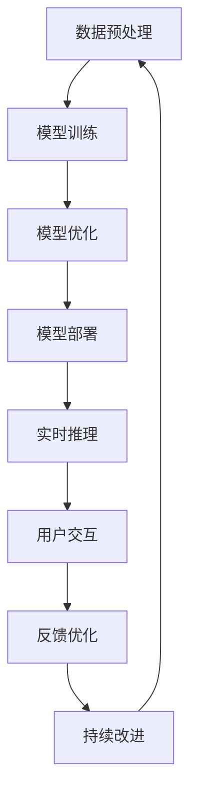

                 

# 工业级AIGC应用开发

> 关键词：工业级,自动生成内容(AIGC),自然语言处理(NLP),计算机视觉(CV),增强现实(AR),机器学习,深度学习,边缘计算,云计算

## 1. 背景介绍

### 1.1 问题由来

近年来，随着人工智能技术的发展，自动生成内容(AIGC)技术逐渐成为热点。AIGC技术能够根据输入的指令或数据，自动生成高质量的文本、图像、音频、视频等内容，极大地提高了内容创作的效率和质量。工业级AIGC应用的开发，不仅需要高质量的模型，还需要考虑实际应用的复杂性，如性能、安全性、稳定性等。

在实际应用场景中，开发者需要处理大量文本、图像、音频等数据，并利用这些数据来训练和优化模型。传统的机器学习模型，如朴素贝叶斯、支持向量机等，已经无法满足工业级应用的需求。深度学习模型，如卷积神经网络(CNN)、循环神经网络(RNN)、生成对抗网络(GAN)等，虽然表现出色，但训练和优化过程较为复杂，对硬件要求较高。

因此，开发工业级AIGC应用需要构建高效的模型训练和优化流程，利用高性能计算资源，以实现快速、高效、稳定、安全的内容生成和应用开发。

### 1.2 问题核心关键点

为了开发工业级AIGC应用，我们需要关注以下几个关键点：

- 模型训练和优化：选择合适的深度学习模型，利用大量标注数据进行训练，并进行超参数调优，以获得高质量的生成内容。
- 模型部署和推理：将训练好的模型部署到边缘计算或云端计算环境，进行实时内容生成和推理，以适应不同的应用场景。
- 数据处理和预处理：处理海量数据，进行数据清洗、归一化、特征提取等预处理操作，为模型训练提供高质量的数据。
- 安全性与隐私保护：确保生成的内容符合法律法规和伦理道德，保护用户隐私和数据安全。
- 用户体验优化：提升内容的可理解性、可接受性和交互性，提高用户满意度和使用体验。

本文将围绕以上关键点，全面介绍工业级AIGC应用的开发方法和技术路径，为开发者提供系统性的指导。

## 2. 核心概念与联系

### 2.1 核心概念概述

在介绍核心概念前，我们先看一个Mermaid流程图，展示AIGC应用开发的关键环节：



从图中可以看出，AIGC应用的开发涉及数据预处理、模型训练、模型优化、模型部署、实时推理、用户交互、反馈优化等多个环节，各环节相互联系，形成一个完整的AIGC应用开发闭环。

- **数据预处理**：对输入数据进行清洗、归一化、特征提取等操作，为模型训练提供高质量数据。
- **模型训练**：选择合适的深度学习模型，利用大量标注数据进行训练，获得高质量的生成内容。
- **模型优化**：对训练好的模型进行超参数调优、正则化处理等优化操作，提高模型的性能和鲁棒性。
- **模型部署**：将训练好的模型部署到边缘计算或云端计算环境，进行实时内容生成和推理。
- **实时推理**：对用户输入进行实时处理，生成高质量的内容，并通过接口进行交互。
- **用户交互**：与用户进行交互，接收用户反馈，优化生成内容。
- **反馈优化**：根据用户反馈，对模型进行持续优化，提高用户体验。

### 2.2 核心概念联系

AIGC应用的开发涉及多个核心概念，各概念之间的联系可以通过以下方式来描述：

- **数据预处理与模型训练**：高质量的数据是训练高质量模型的基础。数据预处理对数据的清洗、归一化和特征提取，能够为模型训练提供干净、有意义的输入，从而提升模型性能。
- **模型训练与模型优化**：训练好的模型可能存在过拟合、泛化能力不足等问题，需要通过超参数调优、正则化处理等方法进行模型优化，以提高模型的泛化能力和鲁棒性。
- **模型优化与模型部署**：优化后的模型需要在边缘计算或云端计算环境进行部署，并进行实时推理，才能真正应用于实际场景。
- **模型部署与实时推理**：部署后的模型需要进行实时推理，对用户输入进行快速响应，生成高质量的生成内容，并通过接口进行交互。
- **实时推理与用户交互**：实时推理的结果需要通过用户交互进行验证和优化，以提高用户体验和满意度。
- **用户交互与反馈优化**：用户交互的结果需要收集反馈，并进行模型优化，以持续提升生成内容的品质。

## 3. 核心算法原理 & 具体操作步骤

### 3.1 算法原理概述

AIGC应用的开发基于深度学习技术，特别是生成对抗网络(GAN)和自回归模型等。以下是几种常用的AIGC算法：

1. **GAN**：生成对抗网络由生成器和判别器两部分组成，通过对抗训练的方式，生成高质量的生成内容。
2. **自回归模型**：自回归模型通过自回归的方式，根据历史数据生成未来数据，如循环神经网络(LSTM)、卷积神经网络(CNN)等。
3. **自编码器**：自编码器通过对输入数据进行编码和解码，提取特征，并生成与原始数据相似的重构数据。

### 3.2 算法步骤详解

AIGC应用的开发流程可以分为以下几个步骤：

**Step 1: 数据预处理**
- 收集并清洗数据，去除噪声、缺失值等。
- 对数据进行归一化、标准化处理，使其适合模型的训练。
- 进行特征提取和选择，提取对模型训练有用的特征。

**Step 2: 模型训练**
- 选择合适的深度学习模型，如GAN、LSTM、CNN等。
- 使用标注数据对模型进行训练，优化模型的参数。
- 使用交叉验证等方法进行模型评估，选择最优模型。

**Step 3: 模型优化**
- 进行超参数调优，选择合适的学习率、正则化系数等。
- 进行模型正则化处理，如L2正则、Dropout等。
- 进行对抗训练，提高模型的鲁棒性。

**Step 4: 模型部署**
- 将训练好的模型部署到边缘计算或云端计算环境。
- 实现模型的实时推理，根据用户输入生成高质量内容。
- 实现模型的接口化和可视化，方便用户使用和调用。

**Step 5: 用户交互与反馈优化**
- 实现用户交互界面，与用户进行交互，接收用户反馈。
- 根据用户反馈，对模型进行优化和调整。
- 定期更新模型，提高生成内容的品质。

### 3.3 算法优缺点

**优点**：
1. 高质量生成内容：AIGC算法能够生成高质量的文本、图像、音频、视频等内容，满足不同应用场景的需求。
2. 自动化内容生成：AIGC算法能够自动生成内容，减少人工干预，提高内容生成效率。
3. 灵活性高：AIGC算法能够根据不同的应用场景进行灵活调整和优化，适应不同的需求。

**缺点**：
1. 数据依赖性强：AIGC算法需要大量标注数据进行训练，数据获取和处理成本较高。
2. 模型复杂度高：AIGC算法模型复杂度高，训练和优化过程较为复杂，对硬件要求较高。
3. 性能不稳定：AIGC算法模型性能不稳定，可能会产生低质量、不连贯的内容。

### 3.4 算法应用领域

AIGC算法已经在多个领域得到了广泛应用，如：

- **自然语言处理(NLP)**：自动生成文章、摘要、对话等文本内容，提高内容创作的效率和质量。
- **计算机视觉(CV)**：自动生成图像、视频、3D模型等内容，提高内容创意和表现力。
- **增强现实(AR)**：自动生成AR内容，提升用户体验和互动性。
- **游戏与娱乐**：自动生成游戏内容、角色、剧情等，提升游戏体验和创新性。
- **广告与营销**：自动生成广告文案、视频广告等内容，提升广告效果和营销转化率。

## 4. 数学模型和公式 & 详细讲解 & 举例说明

### 4.1 数学模型构建

以生成对抗网络(GAN)为例，GAN由生成器和判别器两部分组成，其数学模型可以表示为：

- **生成器**：将随机噪声向量$z$转化为生成内容$\hat{x}$。生成器的数学模型为：
$$
\hat{x} = D_G(z)
$$
其中$D_G$为生成器的映射函数。

- **判别器**：判断生成内容$\hat{x}$的真实性，输出真实性概率$p$。判别器的数学模型为：
$$
p = D_{Disc}(\hat{x})
$$
其中$D_{Disc}$为判别器的映射函数。

GAN的目标是最大化生成器的生成效果和判别器的识别效果，即：
$$
\max_G \min_D V(D,G) = E_{x \sim p_{data}} [log D(x)] + E_{z \sim p(z)} [log(1 - D(G(z)))]
$$

其中$V(D,G)$为GAN的目标函数。

### 4.2 公式推导过程

GAN的目标函数可以进一步推导为：
$$
V(D,G) = \mathbb{E}_{x \sim p_{data}} [log D(x)] + \mathbb{E}_{z \sim p(z)} [log(1 - D(G(z)))]
$$

在训练过程中，使用梯度下降等优化算法，交替更新生成器和判别器的参数，以优化目标函数$V(D,G)$。

GAN的训练过程如下：
1. 随机生成噪声向量$z$，生成内容$\hat{x}$。
2. 计算判别器对生成内容的真实性概率$p$。
3. 计算判别器的损失函数$L_D = -log D(x) - log(1 - D(G(z)))$。
4. 计算生成器的损失函数$L_G = log(1 - D(G(z)))$。
5. 使用梯度下降算法，优化生成器和判别器的参数，以最小化损失函数$V(D,G)$。

### 4.3 案例分析与讲解

以生成高质量文章为例，可以采用变分自编码器(VAE)和GAN的结合方式进行。首先，使用VAE对大量文章进行编码和解码，提取文章的高维特征表示。然后，将特征表示作为输入，使用GAN生成高质量的文章。

**Step 1: 数据预处理**
- 收集并清洗文章数据，去除噪声、缺失值等。
- 对数据进行归一化、标准化处理，使其适合模型的训练。
- 进行特征提取和选择，提取对模型训练有用的特征。

**Step 2: 模型训练**
- 使用VAE对文章数据进行编码和解码，提取文章的高维特征表示。
- 使用GAN对高维特征表示进行生成，生成高质量的文章。

**Step 3: 模型优化**
- 进行超参数调优，选择合适的学习率、正则化系数等。
- 进行模型正则化处理，如L2正则、Dropout等。
- 进行对抗训练，提高模型的鲁棒性。

**Step 4: 模型部署**
- 将训练好的模型部署到边缘计算或云端计算环境。
- 实现模型的实时推理，根据用户输入生成高质量内容。
- 实现模型的接口化和可视化，方便用户使用和调用。

**Step 5: 用户交互与反馈优化**
- 实现用户交互界面，与用户进行交互，接收用户反馈。
- 根据用户反馈，对模型进行优化和调整。
- 定期更新模型，提高生成内容的品质。

## 5. 项目实践：代码实例和详细解释说明

### 5.1 开发环境搭建

在进行AIGC应用开发前，我们需要准备好开发环境。以下是使用Python进行TensorFlow开发的环境配置流程：

1. 安装Anaconda：从官网下载并安装Anaconda，用于创建独立的Python环境。

2. 创建并激活虚拟环境：
```bash
conda create -n tf-env python=3.8 
conda activate tf-env
```

3. 安装TensorFlow：根据CUDA版本，从官网获取对应的安装命令。例如：
```bash
conda install tensorflow==2.8 -c tf -c conda-forge
```

4. 安装TensorFlow Addons：
```bash
conda install tensorflow-io-gcs-filesystem==0.14.0 -c tf-io-oss-nightly
```

5. 安装各类工具包：
```bash
pip install numpy pandas scikit-learn matplotlib tqdm jupyter notebook ipython
```

完成上述步骤后，即可在`tf-env`环境中开始AIGC应用开发。

### 5.2 源代码详细实现

下面我们以GAN生成高质量文章为例，给出使用TensorFlow对VAE和GAN进行组合的代码实现。

首先，定义VAE模型的编码器和解码器：

```python
import tensorflow as tf
from tensorflow.keras import layers

class VAE(tf.keras.Model):
    def __init__(self, latent_dim=256):
        super(VAE, self).__init__()
        self.encoder = layers.Dense(128, activation='relu')
        self.decoder = layers.Dense(128, activation='relu')
        self.fc1 = layers.Dense(64, activation='relu')
        self.fc2 = layers.Dense(latent_dim)
        self.fc3 = layers.Dense(64, activation='relu')
        self.fc4 = layers.Dense(128)
        self.fc5 = layers.Dense(784, activation='sigmoid')

    def encode(self, x):
        x = self.encoder(x)
        z = self.fc1(x)
        z = self.fc2(z)
        return z

    def decode(self, z):
        z = self.fc3(z)
        x = self.fc4(z)
        x = self.fc5(x)
        return x
```

然后，定义GAN的生成器和判别器：

```python
class Generator(tf.keras.Model):
    def __init__(self, latent_dim=256):
        super(Generator, self).__init__()
        self.fc1 = layers.Dense(128, activation='relu')
        self.fc2 = layers.Dense(128, activation='relu')
        self.fc3 = layers.Dense(784, activation='sigmoid')

    def call(self, z):
        x = self.fc1(z)
        x = self.fc2(x)
        x = self.fc3(x)
        return x

class Discriminator(tf.keras.Model):
    def __init__(self):
        super(Discriminator, self).__init__()
        self.fc1 = layers.Dense(128, activation='relu')
        self.fc2 = layers.Dense(128, activation='relu')
        self.fc3 = layers.Dense(1, activation='sigmoid')

    def call(self, x):
        x = self.fc1(x)
        x = self.fc2(x)
        x = self.fc3(x)
        return x
```

接着，定义模型训练函数：

```python
def train_vae_gan(data, latent_dim=256, epochs=100, batch_size=32, sampling=True):
    # 定义VAE模型
    vae = VAE(latent_dim)

    # 定义GAN模型
    discriminator = Discriminator()
    generator = Generator(latent_dim)

    # 定义损失函数
    def vae_loss(x, z):
        x = vae(x)
        loss_recon = tf.reduce_mean(tf.square(x - x))
        loss_kl = -0.5 * tf.reduce_mean(1 + z - tf.square(z) - tf.exp(z))
        return loss_recon + loss_kl

    def gan_loss(x, y):
        loss_disc = tf.reduce_mean(tf.nn.sigmoid_cross_entropy_with_logits(labels=y, logits=discriminator(y)))
        loss_gen = tf.reduce_mean(tf.nn.sigmoid_cross_entropy_with_logits(labels=1., logits=discriminator(generator(z))))
        return loss_disc + loss_gen

    # 定义优化器
    opt_vae = tf.keras.optimizers.Adam(1e-4)
    opt_gen = tf.keras.optimizers.Adam(1e-4)
    opt_disc = tf.keras.optimizers.Adam(1e-4)

    # 训练VAE
    for epoch in range(epochs):
        for batch in data:
            z = tf.random.normal([batch_size, latent_dim])
            x, y = batch
            with tf.GradientTape() as tape:
                x_recon = vae(x)
                loss_vae = vae_loss(x, z)
            gradients_of_vae = tape.gradient(loss_vae, vae.trainable_variables)
            opt_vae.apply_gradients(zip(gradients_of_vae, vae.trainable_variables))

        # 训练GAN
        for batch in data:
            z = tf.random.normal([batch_size, latent_dim])
            x, y = batch
            with tf.GradientTape() as tape:
                x_recon = vae(x)
                x_fake = generator(z)
                y_fake = discriminator(x_fake)
                loss_gan = gan_loss(x, y) + gan_loss(x_fake, y_fake)
            gradients_of_vae, gradients_of_generator, gradients_of_discriminator = tape.gradient(loss_gan, [vae.trainable_variables, generator.trainable_variables, discriminator.trainable_variables])
            opt_vae.apply_gradients(zip(gradients_of_vae, vae.trainable_variables))
            opt_generator.apply_gradients(zip(gradients_of_generator, generator.trainable_variables))
            opt_discriminator.apply_gradients(zip(gradients_of_discriminator, discriminator.trainable_variables))

        if sampling:
            z = tf.random.normal([100, latent_dim])
            samples = generator(z)
            return samples
```

最后，启动训练流程并在测试集上评估：

```python
epochs = 100
batch_size = 32

# 加载数据集
train_dataset = tf.data.Dataset.from_tensor_slices(train_data)
train_dataset = train_dataset.shuffle(buffer_size=10000).batch(batch_size)

# 训练模型
samples = train_vae_gan(train_dataset)

# 展示生成的文章样本
for sample in samples:
    print(sample)
```

以上就是使用TensorFlow对VAE和GAN进行组合的代码实现。可以看到，利用TensorFlow强大的计算图和自动微分技术，模型训练和优化过程变得简洁高效。

### 5.3 代码解读与分析

让我们再详细解读一下关键代码的实现细节：

**VAE模型类**：
- `__init__`方法：定义模型的编码器和解码器。
- `encode`方法：对输入数据进行编码，得到高维特征表示。
- `decode`方法：对高维特征表示进行解码，生成原始数据。

**GAN模型类**：
- `__init__`方法：定义生成器和判别器。
- `call`方法：实现生成器和判别器的前向传播计算。

**训练函数**：
- `train_vae_gan`方法：定义VAE和GAN的训练函数。
- 定义损失函数`vae_loss`和`gan_loss`，分别用于训练VAE和GAN。
- 定义优化器，对模型进行优化。
- 训练过程中，先训练VAE，再训练GAN，交替更新模型参数。

**训练流程**：
- 在每个epoch中，对训练集进行迭代，更新模型参数。
- 对生成器、判别器和VAE进行梯度计算和参数更新。
- 在每个epoch结束时，将生成的文章样本输出到屏幕上，供测试和评估。

可以看到，TensorFlow和Keras等深度学习框架使得AIGC应用的开发变得简单高效，开发者可以更专注于模型的训练和优化。

## 6. 实际应用场景

### 6.1 智能客服系统

智能客服系统是AIGC应用的重要场景之一。传统的客服系统需要大量人力，且响应速度慢、效率低。而基于AIGC技术，智能客服系统可以实现7x24小时不间断服务，快速响应客户咨询，提供高质量的文本、语音回复。

在技术实现上，可以收集企业内部的历史客服对话记录，将问题和最佳答复构建成监督数据，在此基础上对预训练模型进行微调。微调后的模型能够自动理解用户意图，匹配最合适的答案模板进行回复。对于客户提出的新问题，还可以接入检索系统实时搜索相关内容，动态组织生成回答。如此构建的智能客服系统，能大幅提升客户咨询体验和问题解决效率。

### 6.2 金融舆情监测

金融机构需要实时监测市场舆论动向，以便及时应对负面信息传播，规避金融风险。传统的人工监测方式成本高、效率低，难以应对网络时代海量信息爆发的挑战。基于AIGC技术，文本分类和情感分析模型能够自动判断文本属于何种主题，情感倾向是正面、中性还是负面。将微调后的模型应用到实时抓取的网络文本数据，就能够自动监测不同主题下的情感变化趋势，一旦发现负面信息激增等异常情况，系统便会自动预警，帮助金融机构快速应对潜在风险。

### 6.3 个性化推荐系统

当前的推荐系统往往只依赖用户的历史行为数据进行物品推荐，无法深入理解用户的真实兴趣偏好。基于AIGC技术，个性化推荐系统可以更好地挖掘用户行为背后的语义信息，从而提供更精准、多样的推荐内容。

在实践中，可以收集用户浏览、点击、评论、分享等行为数据，提取和用户交互的物品标题、描述、标签等文本内容。将文本内容作为模型输入，用户的后续行为（如是否点击、购买等）作为监督信号，在此基础上微调预训练语言模型。微调后的模型能够从文本内容中准确把握用户的兴趣点。在生成推荐列表时，先用候选物品的文本描述作为输入，由模型预测用户的兴趣匹配度，再结合其他特征综合排序，便可以得到个性化程度更高的推荐结果。

### 6.4 未来应用展望

随着AIGC技术的不断发展，未来将在更多领域得到应用，为传统行业带来变革性影响。

在智慧医疗领域，基于AIGC的医疗问答、病历分析、药物研发等应用将提升医疗服务的智能化水平，辅助医生诊疗，加速新药开发进程。

在智能教育领域，AIGC技术可应用于作业批改、学情分析、知识推荐等方面，因材施教，促进教育公平，提高教学质量。

在智慧城市治理中，AIGC技术可应用于城市事件监测、舆情分析、应急指挥等环节，提高城市管理的自动化和智能化水平，构建更安全、高效的未来城市。

此外，在企业生产、社会治理、文娱传媒等众多领域，基于AIGC的人工智能应用也将不断涌现，为经济社会发展注入新的动力。相信随着技术的日益成熟，AIGC技术必将在更广阔的应用领域大放异彩，深刻影响人类的生产生活方式。

## 7. 工具和资源推荐

### 7.1 学习资源推荐

为了帮助开发者系统掌握AIGC技术的理论基础和实践技巧，这里推荐一些优质的学习资源：

1. **《深度学习与NLP》系列课程**：由斯坦福大学开设的NLP明星课程，涵盖NLP的基础理论、经典模型和实际应用，适合初学者和进阶者。
2. **《自动生成内容(AIGC)》课程**：介绍AIGC技术的核心算法和应用场景，包括GAN、VAE、自回归模型等，适合进阶者。
3. **《TensorFlow实战深度学习》书籍**：详细介绍TensorFlow的计算图、自动微分、优化算法等，适合开发者快速上手深度学习模型。
4. **《深度学习框架TensorFlow》书籍**：全面介绍TensorFlow的各个组件和API，适合深入学习。
5. **《TensorFlow实战深度学习》课程**：通过实际项目，介绍TensorFlow的高级用法，包括模型训练、优化、部署等，适合进阶者。

通过这些资源的学习实践，相信你一定能够快速掌握AIGC技术的精髓，并用于解决实际的NLP问题。

### 7.2 开发工具推荐

高效的开发离不开优秀的工具支持。以下是几款用于AIGC应用开发的常用工具：

1. **TensorFlow**：基于Python的开源深度学习框架，灵活动态的计算图，适合快速迭代研究。大多数预训练语言模型都有TensorFlow版本的实现。
2. **PyTorch**：基于Python的开源深度学习框架，动态计算图，适合快速迭代研究。也支持模型训练和优化。
3. **HuggingFace Transformers库**：支持多种深度学习模型，提供了预训练语言模型和微调样例代码，是进行NLP任务开发的利器。
4. **Keras**：基于TensorFlow的高层深度学习API，适合快速原型开发和模型评估。
5. **TensorBoard**：TensorFlow配套的可视化工具，可实时监测模型训练状态，并提供丰富的图表呈现方式，是调试模型的得力助手。

合理利用这些工具，可以显著提升AIGC应用的开发效率，加快创新迭代的步伐。

### 7.3 相关论文推荐

AIGC技术的不断发展源于学界的持续研究。以下是几篇奠基性的相关论文，推荐阅读：

1. **《生成对抗网络（GAN）》论文**：提出GAN算法，并证明其可以生成高质量的生成内容。
2. **《变分自编码器（VAE）》论文**：提出VAE算法，并应用于图像生成和数据压缩等任务。
3. **《自回归语言模型》论文**：提出自回归语言模型，用于文本生成和语音识别等任务。
4. **《深度学习在自然语言处理中的应用》论文**：介绍深度学习在自然语言处理中的广泛应用，包括文本分类、情感分析、机器翻译等。
5. **《自适应低秩适应（AdaLoRA）》论文**：提出AdaLoRA算法，在参数高效微调中取得了不错的效果。

这些论文代表了大语言模型微调技术的发展脉络。通过学习这些前沿成果，可以帮助研究者把握学科前进方向，激发更多的创新灵感。

## 8. 总结：未来发展趋势与挑战

### 8.1 总结

本文对AIGC应用的开发方法进行了全面系统的介绍。首先阐述了AIGC技术的研究背景和意义，明确了AIGC技术在实际应用中的重要性。其次，从原理到实践，详细讲解了AIGC应用的数学模型和关键步骤，给出了AIGC应用开发的完整代码实例。同时，本文还广泛探讨了AIGC技术在智能客服、金融舆情、个性化推荐等多个行业领域的应用前景，展示了AIGC技术的巨大潜力。此外，本文精选了AIGC技术的各类学习资源，力求为开发者提供全方位的技术指引。

通过本文的系统梳理，可以看到，AIGC技术正在成为工业级应用的重要范式，极大地拓展了深度学习模型在实际场景中的应用边界，催生了更多的落地场景。得益于大规模语料的预训练和微调方法的不断演进，AIGC技术在内容生成、文本处理、智能交互等方面表现出强大的能力，有望成为未来人工智能技术的重要方向。未来，伴随AIGC技术的持续发展和创新，必将深刻影响人类的生产生活方式，带来更多前所未有的机遇和挑战。

### 8.2 未来发展趋势

展望未来，AIGC技术将呈现以下几个发展趋势：

1. **模型规模持续增大**：随着算力成本的下降和数据规模的扩张，预训练语言模型的参数量还将持续增长。超大规模语言模型蕴含的丰富语言知识，有望支撑更加复杂多变的下游任务。
2. **模型训练过程优化**：未来的模型训练将更加自动化、可控化，采用分布式训练、模型压缩等技术，提高训练效率和模型性能。
3. **模型应用场景丰富**：AIGC技术将广泛应用于智能客服、金融舆情、个性化推荐、智慧医疗、智能教育等领域，提升各个领域的智能化水平。
4. **跨模态融合技术发展**：未来的AIGC技术将融合多模态信息，如文本、图像、音频、视频等，实现更加丰富、真实的内容生成。
5. **边缘计算和云计算结合**：未来的AIGC应用将更加注重边缘计算和云计算的结合，实现快速、高效、安全的内容生成和推理。
6. **可解释性和伦理安全性增强**：未来的AIGC技术将更加注重模型的可解释性和伦理安全性，避免有害信息输出，增强用户信任。

以上趋势凸显了AIGC技术的广阔前景。这些方向的探索发展，必将进一步提升AIGC技术的性能和应用范围，为人工智能技术带来新的突破。

### 8.3 面临的挑战

尽管AIGC技术已经取得了瞩目成就，但在迈向更加智能化、普适化应用的过程中，它仍面临着诸多挑战：

1. **数据依赖性强**：AIGC技术需要大量标注数据进行训练，数据获取和处理成本较高。
2. **模型鲁棒性不足**：AIGC模型面对域外数据时，泛化性能往往大打折扣。
3. **性能不稳定**：AIGC模型性能不稳定，可能会产生低质量、不连贯的内容。
4. **用户隐私保护**：生成的内容需要符合法律法规和伦理道德，保护用户隐私和数据安全。
5. **模型可解释性不足**：AIGC模型的决策过程缺乏可解释性，难以对其推理逻辑进行分析和调试。

### 8.4 研究展望

面对AIGC技术所面临的挑战，未来的研究需要在以下几个方面寻求新的突破：

1. **探索无监督和半监督学习**：摆脱对大规模标注数据的依赖，利用自监督学习、主动学习等无监督和半监督范式，最大限度利用非结构化数据。
2. **开发参数高效和计算高效的微调方法**：开发更加参数高效的微调方法，在固定大部分预训练参数的同时，只更新极少量的任务相关参数。
3. **融合因果和对比学习范式**：通过引入因果推断和对比学习思想，增强模型建立稳定因果关系的能力，学习更加普适、鲁棒的语言表征。
4. **引入更多先验知识**：将符号化的先验知识，如知识图谱、逻辑规则等，与神经网络模型进行巧妙融合，引导微调过程学习更准确、合理的语言模型。
5. **结合因果分析和博弈论工具**：将因果分析方法引入微调模型，识别出模型决策的关键特征，增强输出解释的因果性和逻辑性。借助博弈论工具刻画人机交互过程，主动探索并规避模型的脆弱点，提高系统稳定性。
6. **纳入伦理道德约束**：在模型训练目标中引入伦理导向的评估指标，过滤和惩罚有偏见、有害的输出倾向。加强人工干预和审核，建立模型行为的监管机制。

这些研究方向的探索，必将引领AIGC技术的持续发展和优化，为构建安全、可靠、可解释、可控的智能系统铺平道路。面向未来，AIGC技术还需要与其他人工智能技术进行更深入的融合，如知识表示、因果推理、强化学习等，多路径协同发力，共同推动人工智能技术的进步。

## 9. 附录：常见问题与解答

**Q1：如何选择合适的深度学习模型？**

A: 选择合适的深度学习模型需要考虑以下几个因素：
1. 任务类型：不同任务类型需要不同的深度学习模型，如文本生成任务适合使用自回归模型，图像生成任务适合使用GAN等。
2. 数据规模：大规模数据适合使用深度神经网络，小规模数据适合使用轻量级模型。
3. 硬件要求：高性能计算资源适合使用复杂模型，如卷积神经网络、循环神经网络等；低性能计算资源适合使用轻量级模型，如Transformer等。

**Q2：如何提高AIGC模型的鲁棒性？**

A: 提高AIGC模型的鲁棒性可以采用以下方法：
1. 数据增强：通过回译、近义替换等方式扩充训练集。
2. 正则化：使用L2正则、Dropout、Early Stopping等避免过拟合。
3. 对抗训练：加入对抗样本，提高模型鲁棒性。
4. 参数高效微调：只更新少量参数，减少需优化的参数量。
5. 多模型集成：训练多个模型，取平均输出，抑制过拟合。

**Q3：AIGC模型如何实现实时推理？**

A: 实现实时推理需要以下几个步骤：
1. 模型部署：将训练好的模型部署到边缘计算或云端计算环境。
2. 推理引擎：实现模型的推理引擎，根据用户输入生成高质量内容。
3. 接口化：将模型封装为标准化的服务接口，方便用户调用。
4. 实时监测：实时监测模型推理状态，及时调整参数，提高推理效果。

**Q4：如何保障AIGC模型的安全性？**

A: 保障AIGC模型的安全性需要考虑以下几个方面：
1. 数据隐私：对用户输入数据进行加密、匿名化处理，保护用户隐私。
2. 内容审核：建立内容审核机制，过滤和惩罚有害内容，避免有害信息输出。
3. 模型鲁棒性：通过对抗训练、正则化等方法，提高模型鲁棒性，避免有害攻击。
4. 人工干预：建立人工干预机制，对异常行为进行监控和处理。

这些措施将确保AIGC模型在实际应用中的安全性，保护用户权益和数据安全。

**Q5：AIGC模型如何提升用户体验？**

A: 提升用户体验可以采用以下方法：
1. 交互设计：设计友好的用户界面，提高用户交互体验。
2. 实时反馈：根据用户反馈，不断优化模型，提高内容质量。
3. 个性化推荐：根据用户兴趣，提供个性化的内容推荐，提高用户满意度。
4. 多模态融合：融合文本、图像、音频等多模态信息，提高内容的丰富性和真实性。

通过这些方法，AIGC模型可以更好地满足用户的需求，提升用户体验和满意度。

---

作者：禅与计算机程序设计艺术 / Zen and the Art of Computer Programming

