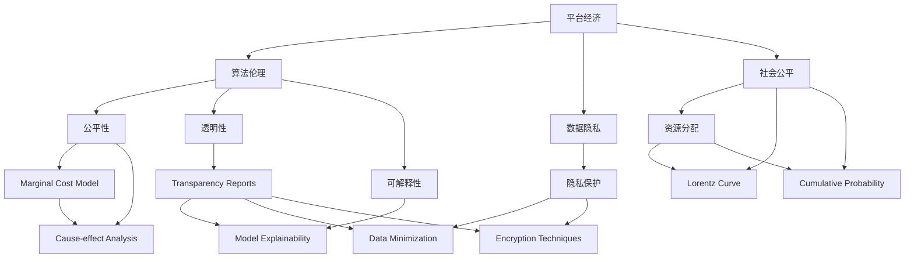

                 

# 平台经济对社会公平的影响：如何避免两极分化？

> 关键词：平台经济,社会公平,两极分化,算法伦理,数据隐私

## 1. 背景介绍

### 1.1 问题由来

平台经济是近年来互联网和信息技术的快速发展催生的新型经济形态，如电商、社交、金融、物流等领域的大型平台企业，通过连接商品、服务、资金等资源，创造了巨大的经济价值。然而，这一新兴模式也带来了诸多社会问题，特别是在社会公平和两极分化方面，存在许多亟需解决的挑战。平台经济的高速发展，一方面推动了经济增长和就业机会的增加，另一方面，也对收入分配、教育机会、社会福利等方面产生了深远影响。

### 1.2 问题核心关键点

平台经济的两极分化现象主要体现在以下几个方面：
- **收入差距扩大**：平台企业内部高层管理层与普通员工之间的收入差距显著。
- **资本集中加剧**：大型平台企业通过兼并收购等方式迅速扩大市场份额，形成市场垄断。
- **数据隐私问题**：平台企业收集大量用户数据，进行精准营销和个性化推荐，引发隐私保护争议。
- **劳动权益受损**：平台经济下，劳动者面临不稳定的工作环境和较低的劳动保护，如零工经济中的临时工和自由职业者。

平台经济的两极分化问题，亟需引起全社会的关注和反思。本文将从算法伦理、数据隐私、劳动权益等角度，探讨平台经济对社会公平的影响，并提出相应的解决方案。

## 2. 核心概念与联系

### 2.1 核心概念概述

为更好地理解平台经济中的社会公平问题，本节将介绍几个核心概念：

- **平台经济**：指基于互联网和信息技术，通过连接供需双方，提供多样化服务的新型经济模式。主要特征包括规模化、数字化、动态化、全球化等。

- **算法伦理**：算法在设计和应用过程中，需要遵循的伦理原则和规范，如公平性、透明性、可解释性等。

- **数据隐私**：指个人数据在收集、存储、使用、共享等过程中，需要保护其隐私不受侵犯的权利。

- **社会公平**：指在社会资源分配中，公平对待所有人，保障每个人的基本权益和发展机会。

- **两极分化**：指社会资源向少数人集中，大多数人无法享受公平的待遇和机会，形成贫富差距悬殊的状况。

这些核心概念之间的逻辑关系可以通过以下Mermaid流程图来展示：



这个流程图展示了平台经济中核心概念及其之间的关联：

1. 平台经济通过算法和数据驱动服务，需要遵循算法伦理，保障社会公平。
2. 数据隐私是平台经济中的重要议题，影响着公平性、透明性和可解释性。
3. 社会公平关注资源分配和发展机会的公平，涉及算法伦理和数据隐私。
4. 公平性、透明性、可解释性等原则，是算法伦理的核心内容。
5. 隐私保护、数据最小化、加密技术等，是数据隐私的关键措施。
6. 洛伦兹曲线、累积概率等，是衡量社会公平的工具。

这些概念共同构成了平台经济对社会公平影响的基础，为我们深入探讨这一问题提供了框架。

## 3. 核心算法原理 & 具体操作步骤

### 3.1 算法原理概述

平台经济中的社会公平问题，很大程度上是由算法伦理和数据隐私引起的。下面将从算法伦理和数据隐私两个方面，介绍核心算法原理。

### 3.2 算法步骤详解

#### 3.2.1 算法伦理

算法伦理是确保平台经济中的社会公平的重要手段，主要包括以下几个步骤：

1. **算法设计**：在设计算法时，需要考虑公平性原则，如性别、种族、地域等因素不应影响算法的决策结果。

2. **数据预处理**：清洗数据，去除可能带有歧视性、不完整的数据，确保数据集的多样性和代表性。

3. **模型评估**：通过多种评估指标，如准确率、召回率、公平率等，对模型进行全面评估，确保其公平性和透明性。

4. **解释性增强**：使用可解释性技术，如模型可视化、特征重要性分析等，使模型决策过程透明，便于监管和审查。

5. **反歧视措施**：在模型训练和部署过程中，加入反歧视算法，确保不同群体的用户都能获得公平对待。

#### 3.2.2 数据隐私

数据隐私是平台经济中社会公平的重要保障，主要包括以下几个步骤：

1. **数据收集**：明确数据收集目的，仅收集必要的数据，避免过度收集。

2. **数据存储**：采用加密技术，确保数据在存储过程中不被泄露。

3. **数据使用**：限制数据的使用范围，确保数据仅用于授权的目的，避免数据滥用。

4. **用户授权**：提供透明的隐私政策，让用户了解数据的使用情况，并获得其授权。

5. **隐私保护技术**：如差分隐私、同态加密等技术，确保数据隐私在数据分析和共享过程中得到保护。

### 3.3 算法优缺点

#### 3.3.1 算法伦理

算法伦理的优点包括：
- **公平性**：通过公平性算法，确保不同群体用户获得公平对待，减少社会不平等。
- **透明性**：通过可解释性技术，使算法决策过程透明，便于监管和审查。
- **反歧视**：加入反歧视算法，防止算法偏见和歧视。

其缺点包括：
- **计算复杂**：公平性算法和反歧视算法，通常需要更多的计算资源和处理时间。
- **可解释性挑战**：尽管可解释性技术有所进展，但仍然难以解释复杂算法的全部细节。

#### 3.3.2 数据隐私

数据隐私的优点包括：
- **用户信任**：保障用户数据隐私，提升用户对平台的信任度，增加用户粘性。
- **合规性**：符合数据隐私法律法规要求，避免法律风险和处罚。

其缺点包括：
- **数据使用限制**：数据隐私保护技术，限制了数据的进一步分析和使用，可能影响模型的性能。
- **技术复杂**：数据隐私保护技术，如差分隐私、同态加密等，技术复杂，实施难度较大。

### 3.4 算法应用领域

算法伦理和数据隐私技术，在多个领域中得到了广泛应用：

- **金融领域**：用于反洗钱、信用评分等，保障金融服务的公平性和隐私保护。
- **医疗领域**：用于疾病预测、治疗推荐等，保障医疗数据的隐私和公平性。
- **教育领域**：用于个性化推荐、学习路径设计等，确保教育公平性和学生隐私保护。
- **就业领域**：用于招聘、培训等，确保就业机会的公平性和求职者隐私保护。

这些应用领域表明，算法伦理和数据隐私技术具有广泛的实际应用前景，是实现社会公平的重要手段。

## 4. 数学模型和公式 & 详细讲解 & 举例说明

### 4.1 数学模型构建

为了更好地理解平台经济中的算法伦理和数据隐私问题，本节将从算法伦理和数据隐私两个角度，构建数学模型。

#### 4.1.1 算法伦理模型

假设平台企业设计了一个基于算法的推荐系统，需要确保不同用户获得公平对待。设推荐系统推荐结果为 $y$，影响因素为 $x$，公平性指标为 $F$。模型可以表示为：

$$
y = f(x; \theta)
$$

其中，$f$ 为推荐函数，$\theta$ 为模型参数。公平性指标 $F$ 可以表示为：

$$
F = \frac{1}{N} \sum_{i=1}^N f(x_i; \theta)
$$

公平性算法需要满足以下条件：

$$
F_{u_1} = F_{u_2}, \quad \forall u_1, u_2
$$

即不同用户获得相同的公平性指标。

#### 4.1.2 数据隐私模型

数据隐私模型主要关注数据收集、存储和使用的安全性。设数据集为 $D$，隐私保护技术为 $T$，隐私保护后的数据集为 $D'$。隐私保护模型可以表示为：

$$
D' = T(D)
$$

其中，$T$ 为隐私保护函数。隐私保护模型需要满足以下条件：

$$
P(D' = D') \geq 0
$$

即隐私保护后的数据集，仍然包含原始数据集的信息。

### 4.2 公式推导过程

#### 4.2.1 算法伦理公式推导

根据公平性指标的定义，公平性算法需要对所有用户进行相同处理。假设推荐系统对两个用户 $u_1$ 和 $u_2$ 的推荐结果分别为 $y_1$ 和 $y_2$，公平性算法需要满足：

$$
y_1 = y_2, \quad \forall u_1, u_2
$$

假设推荐系统使用线性回归模型，推荐函数为：

$$
y = \theta_0 + \sum_{i=1}^n \theta_i x_i
$$

公平性算法需要对所有用户使用相同的 $\theta$ 进行训练。假设训练集为 $D = \{(x_i, y_i)\}_{i=1}^N$，公平性算法需要对所有用户 $u_1, u_2$ 使用相同的模型参数 $\theta$ 进行训练。

$$
\theta^* = \mathop{\arg\min}_{\theta} \mathcal{L}(\theta, D)
$$

其中 $\mathcal{L}$ 为损失函数，如均方误差。

#### 4.2.2 数据隐私公式推导

根据隐私保护模型的定义，隐私保护函数 $T$ 需要确保数据集 $D$ 中的信息不受泄露。假设数据集 $D$ 中的数据为 $x$，隐私保护后的数据集 $D'$ 中的数据为 $x'$。隐私保护模型需要满足：

$$
P(x' = x) \leq \epsilon
$$

其中 $\epsilon$ 为隐私保护强度，通常为一个小概率值。

假设隐私保护函数 $T$ 为差分隐私，其数学表达式为：

$$
T(x) = \mathcal{N}(0, \sigma^2), \quad \sigma = \frac{\epsilon}{2\sqrt{2}}
$$

其中 $\mathcal{N}(0, \sigma^2)$ 为正态分布，$\sigma$ 为标准差。

### 4.3 案例分析与讲解

#### 4.3.1 算法伦理案例

假设某电商平台使用推荐算法，推荐商品给用户。然而，算法发现男性用户比女性用户更容易购买电子产品，这可能与性别歧视有关。

为了解决这个问题，可以采用公平性算法，对数据进行预处理，确保不同性别的用户获得公平对待。具体步骤如下：

1. 收集数据，标记性别 $x$ 和购买行为 $y$。

2. 对数据进行预处理，去除带有性别歧视的数据，如针对某一性别的特别推荐。

3. 训练公平性算法，确保不同性别的用户获得相同的推荐结果。

4. 使用可解释性技术，对推荐结果进行可视化，确保算法决策透明。

#### 4.3.2 数据隐私案例

假设某社交平台收集用户地理位置信息，用于个性化推荐。为了保护用户隐私，可以采用差分隐私技术，确保地理位置信息不被泄露。

具体步骤如下：

1. 收集用户地理位置信息 $x$。

2. 对地理位置信息进行预处理，如添加噪声，确保原始信息难以被恢复。

3. 训练个性化推荐模型，使用隐私保护后的数据集 $D'$。

4. 评估推荐模型的性能，确保隐私保护效果。

## 5. 项目实践：代码实例和详细解释说明

### 5.1 开发环境搭建

在进行平台经济中的算法伦理和数据隐私实践前，我们需要准备好开发环境。以下是使用Python进行PyTorch开发的环境配置流程：

1. 安装Anaconda：从官网下载并安装Anaconda，用于创建独立的Python环境。

2. 创建并激活虚拟环境：
```bash
conda create -n pytorch-env python=3.8 
conda activate pytorch-env
```

3. 安装PyTorch：根据CUDA版本，从官网获取对应的安装命令。例如：
```bash
conda install pytorch torchvision torchaudio cudatoolkit=11.1 -c pytorch -c conda-forge
```

4. 安装TensorFlow：
```bash
pip install tensorflow
```

5. 安装Pandas：
```bash
pip install pandas
```

6. 安装Scikit-learn：
```bash
pip install scikit-learn
```

完成上述步骤后，即可在`pytorch-env`环境中开始项目实践。

### 5.2 源代码详细实现

这里我们以推荐系统中的公平性算法为例，给出使用PyTorch进行公平性算法的代码实现。

首先，定义公平性算法的数据处理函数：

```python
import pandas as pd
from sklearn.model_selection import train_test_split

def preprocess_data(df):
    # 去除带有性别歧视的数据
    df = df.dropna(subset=['gender', 'purchase'])
    
    # 数据编码
    df['gender'] = pd.Categorical(df['gender'])
    df['purchase'] = df['purchase'].astype(int)
    
    # 数据分割
    train_df, test_df = train_test_split(df, test_size=0.2, random_state=42)
    
    return train_df, test_df
```

然后，定义公平性算法：

```python
from sklearn.linear_model import LogisticRegression

def train_fair_model(train_df):
    # 训练公平性算法
    X = train_df[['gender']]
    y = train_df['purchase']
    model = LogisticRegression(solver='liblinear')
    model.fit(X, y)
    
    return model
```

接着，定义公平性算法的评估函数：

```python
def evaluate_fair_model(model, test_df):
    # 评估公平性算法
    X = test_df[['gender']]
    y = test_df['purchase']
    y_pred = model.predict(X)
    
    # 计算公平性指标
    Fairness = (y_pred == y).mean()
    
    return Fairness
```

最后，启动公平性算法训练流程：

```python
# 读取数据
df = pd.read_csv('data.csv')

# 数据预处理
train_df, test_df = preprocess_data(df)

# 训练公平性算法
model = train_fair_model(train_df)

# 评估公平性算法
Fairness = evaluate_fair_model(model, test_df)

print(f"Fairness: {Fairness:.4f}")
```

以上代码实现了一个简单的公平性算法，用于电商平台中的推荐系统，确保不同性别的用户获得公平对待。

### 5.3 代码解读与分析

让我们再详细解读一下关键代码的实现细节：

**preprocess_data函数**：
- `dropna`：去除数据中的缺失值。
- `Categorical`：对性别进行编码，将其转换为类别型数据。
- `astype`：将购买行为转换为整数型数据。
- `train_test_split`：将数据集分为训练集和测试集。

**train_fair_model函数**：
- `LogisticRegression`：使用逻辑回归模型，训练公平性算法。
- `solver='liblinear'`：指定优化器为Liblinear，适合小规模数据集。

**evaluate_fair_model函数**：
- `predict`：使用训练好的模型进行预测。
- `(y_pred == y).mean()`：计算预测结果与真实结果的一致性，即公平性指标。

**训练流程**：
- 读取数据，并进行预处理。
- 使用预处理后的数据集训练公平性算法。
- 在测试集上评估公平性算法，输出公平性指标。

这个代码实现展示了如何使用简单的公平性算法，解决平台经济中的社会公平问题。在实际应用中，还需要根据具体情况，进一步优化模型和数据处理策略，确保算法效果。

## 6. 实际应用场景

### 6.1 金融领域

在金融领域，算法伦理和数据隐私问题尤为突出。金融产品和服务常常涉及个人隐私和金融安全，因此，平台经济需要特别注意算法伦理和数据隐私的实施。

#### 6.1.1 信贷评分

金融信贷评分系统需要确保不同用户的公平性，避免歧视性评分。例如，某银行使用算法模型对贷款申请进行评分，发现男性和女性的评分存在显著差异。这可能与性别歧视有关。

为了解决这个问题，可以采用公平性算法，对数据进行预处理，确保不同性别的用户获得公平对待。具体步骤如下：

1. 收集数据，标记性别 $x$ 和信用评分 $y$。

2. 对数据进行预处理，去除带有性别歧视的数据，如针对某一性别的特别评分。

3. 训练公平性算法，确保不同性别的用户获得相同的评分结果。

4. 使用可解释性技术，对评分结果进行可视化，确保算法决策透明。

#### 6.1.2 反洗钱

金融平台需要确保反洗钱算法公平，避免对不同地域、不同种族的用户进行不公平的监控。例如，某银行使用算法模型监测可疑交易，发现某些地域的用户被频繁标记为可疑，这可能与地域歧视有关。

为了解决这个问题，可以采用公平性算法，对数据进行预处理，确保不同地域的用户获得公平对待。具体步骤如下：

1. 收集数据，标记地域 $x$ 和可疑交易 $y$。

2. 对数据进行预处理，去除带有地域歧视的数据，如针对某一地域的特别标记。

3. 训练公平性算法，确保不同地域的用户获得相同的可疑标记结果。

4. 使用可解释性技术，对可疑标记结果进行可视化，确保算法决策透明。

### 6.2 医疗领域

在医疗领域，算法伦理和数据隐私问题同样重要。医疗数据涉及个人隐私和健康安全，因此，平台经济需要特别注意算法伦理和数据隐私的实施。

#### 6.2.1 疾病预测

医疗平台需要确保疾病预测算法的公平性，避免对不同种族、不同地域的用户进行不公平的预测。例如，某医疗平台使用算法模型预测患病风险，发现某些种族和地域的用户被频繁标记为高风险，这可能与种族和地域歧视有关。

为了解决这个问题，可以采用公平性算法，对数据进行预处理，确保不同种族和地域的用户获得公平对待。具体步骤如下：

1. 收集数据，标记种族 $x$ 和患病风险 $y$。

2. 对数据进行预处理，去除带有种族和地域歧视的数据，如针对某一种族或地域的特别标记。

3. 训练公平性算法，确保不同种族和地域的用户获得相同的患病风险预测结果。

4. 使用可解释性技术，对患病风险预测结果进行可视化，确保算法决策透明。

#### 6.2.2 治疗推荐

医疗平台需要确保治疗推荐算法的公平性，避免对不同年龄、不同性别、不同种族的用户进行不公平的推荐。例如，某医疗平台使用算法模型推荐治疗方案，发现某些年龄、性别和种族的用户被频繁推荐某一特定治疗，这可能与年龄、性别和种族歧视有关。

为了解决这个问题，可以采用公平性算法，对数据进行预处理，确保不同年龄、性别、种族的用户获得公平对待。具体步骤如下：

1. 收集数据，标记年龄 $x$、性别 $x_1$、种族 $x_2$ 和治疗方案 $y$。

2. 对数据进行预处理，去除带有年龄、性别和种族歧视的数据，如针对某一特定年龄、性别和种族的特别推荐。

3. 训练公平性算法，确保不同年龄、性别、种族的用户获得相同的治疗方案推荐结果。

4. 使用可解释性技术，对治疗方案推荐结果进行可视化，确保算法决策透明。

### 6.3 教育领域

在教育领域，算法伦理和数据隐私问题同样重要。教育数据涉及学生隐私和教育公平，因此，平台经济需要特别注意算法伦理和数据隐私的实施。

#### 6.3.1 个性化推荐

教育平台需要确保个性化推荐算法的公平性，避免对不同地域、不同种族的学生进行不公平的推荐。例如，某在线教育平台使用算法模型推荐学习资源，发现某些地域和种族的学生被频繁推荐某一特定资源，这可能与地域和种族歧视有关。

为了解决这个问题，可以采用公平性算法，对数据进行预处理，确保不同地域和种族的学生获得公平对待。具体步骤如下：

1. 收集数据，标记地域 $x$、种族 $x_1$ 和学习资源 $y$。

2. 对数据进行预处理，去除带有地域和种族歧视的数据，如针对某一特定地域或种族的特别推荐。

3. 训练公平性算法，确保不同地域和种族的学生获得相同的学习资源推荐结果。

4. 使用可解释性技术，对学习资源推荐结果进行可视化，确保算法决策透明。

#### 6.3.2 学习路径设计

教育平台需要确保学习路径设计算法的公平性，避免对不同年龄、不同性别、不同种族的学生进行不公平的设计。例如，某在线教育平台使用算法模型设计学习路径，发现某些年龄、性别和种族的学生被频繁设计某一特定学习路径，这可能与年龄、性别和种族歧视有关。

为了解决这个问题，可以采用公平性算法，对数据进行预处理，确保不同年龄、性别、种族的学生获得公平的学习路径设计。具体步骤如下：

1. 收集数据，标记年龄 $x$、性别 $x_1$、种族 $x_2$ 和学习路径 $y$。

2. 对数据进行预处理，去除带有年龄、性别和种族歧视的数据，如针对某一特定年龄、性别和种族的特别设计。

3. 训练公平性算法，确保不同年龄、性别、种族的学生获得相同的学习路径设计结果。

4. 使用可解释性技术，对学习路径设计结果进行可视化，确保算法决策透明。

### 6.4 未来应用展望

随着平台经济的发展，算法伦理和数据隐私技术的应用前景将更加广阔。未来的研究将集中在以下几个方面：

1. **多模态数据融合**：将文本、图像、视频等多模态数据进行融合，实现更全面、更精准的算法决策。

2. **因果推理**：引入因果推断技术，提高算法的公平性和透明性，减少算法偏见和歧视。

3. **隐私保护**：开发更先进的隐私保护技术，如差分隐私、同态加密等，确保数据隐私和安全。

4. **可解释性增强**：进一步增强算法的可解释性，使决策过程透明、可理解，便于监管和审查。

5. **公平性算法优化**：开发更加高效的公平性算法，确保算法公平性和透明性，同时保持算法性能。

6. **跨领域应用**：将算法伦理和数据隐私技术应用于更多领域，如金融、医疗、教育等，解决社会公平问题。

## 7. 工具和资源推荐

### 7.1 学习资源推荐

为了帮助开发者系统掌握算法伦理和数据隐私的理论基础和实践技巧，这里推荐一些优质的学习资源：

1. **《算法伦理与数据隐私》书籍**：系统介绍算法伦理和数据隐私的基本概念和前沿技术，适合初学者入门。

2. **Coursera《数据隐私与法律》课程**：由美国密歇根大学开设的课程，涵盖数据隐私和法律方面的知识，适合进一步学习。

3. **Kaggle《公平性算法竞赛》**：通过实际竞赛案例，深入理解公平性算法的应用和优化。

4. **Hugging Face官方文档**：Transformers库的官方文档，提供丰富的公平性算法和隐私保护算法样例代码，适合实践学习。

5. **Google AI《公平性机器学习》**：Google AI提供的资源，涵盖公平性机器学习的理论和方法，适合深入学习。

通过对这些资源的学习实践，相信你一定能够快速掌握算法伦理和数据隐私的精髓，并用于解决实际的平台经济问题。

### 7.2 开发工具推荐

高效的开发离不开优秀的工具支持。以下是几款用于平台经济中算法伦理和数据隐私开发的常用工具：

1. **PyTorch**：基于Python的开源深度学习框架，灵活动态的计算图，适合快速迭代研究。

2. **TensorFlow**：由Google主导开发的开源深度学习框架，生产部署方便，适合大规模工程应用。

3. **Scikit-learn**：Python科学计算库，提供丰富的数据预处理和模型训练功能，适合数据科学应用。

4. **OpenML**：数据科学竞赛平台，提供丰富的数据集和竞赛案例，适合学习和实践。

5. **Jupyter Notebook**：交互式编程环境，适合编写和运行Python代码，方便协作和共享。

6. **Kaggle**：数据科学竞赛平台，提供丰富的数据集和竞赛案例，适合学习和实践。

合理利用这些工具，可以显著提升平台经济中算法伦理和数据隐私的开发效率，加快创新迭代的步伐。

### 7.3 相关论文推荐

算法伦理和数据隐私技术的发展源于学界的持续研究。以下是几篇奠基性的相关论文，推荐阅读：

1. **《算法公平性》**：介绍算法公平性的基本概念和公平性算法的实现方法，适合入门学习。

2. **《数据隐私保护技术》**：系统介绍数据隐私保护的基本技术和方法，适合深入学习。

3. **《因果推断在公平性中的应用》**：介绍因果推断技术在公平性问题中的应用，适合进一步学习。

4. **《差分隐私理论》**：介绍差分隐私的基本概念和技术实现，适合深入学习。

5. **《同态加密技术》**：介绍同态加密的基本概念和技术实现，适合深入学习。

这些论文代表了大语言模型微调技术的发展脉络。通过学习这些前沿成果，可以帮助研究者把握学科前进方向，激发更多的创新灵感。

## 8. 总结：未来发展趋势与挑战

### 8.1 总结

本文对平台经济中的社会公平问题进行了全面系统的探讨。首先阐述了平台经济的发展背景和算法伦理、数据隐私的核心概念。其次，从算法伦理和数据隐私两个角度，详细讲解了核心算法原理和具体操作步骤。同时，本文还广泛探讨了算法伦理和数据隐私在金融、医疗、教育等领域的实际应用场景，展示了其广阔的前景。最后，本文精选了算法伦理和数据隐私的学习资源、开发工具和相关论文，力求为读者提供全方位的技术指引。

通过本文的系统梳理，可以看到，算法伦理和数据隐私技术在平台经济中的应用，对社会公平的实现具有重要意义。它们可以帮助平台经济避免两极分化，促进社会公平和可持续发展。未来的研究将进一步提升这些技术的成熟度和应用范围，为构建更加公平、透明、可信的平台经济提供坚实基础。

### 8.2 未来发展趋势

展望未来，算法伦理和数据隐私技术将呈现以下几个发展趋势：

1. **多模态融合**：将文本、图像、视频等多模态数据进行融合，实现更全面、更精准的算法决策。

2. **因果推理**：引入因果推断技术，提高算法的公平性和透明性，减少算法偏见和歧视。

3. **隐私保护**：开发更先进的隐私保护技术，如差分隐私、同态加密等，确保数据隐私和安全。

4. **可解释性增强**：进一步增强算法的可解释性，使决策过程透明、可理解，便于监管和审查。

5. **公平性算法优化**：开发更加高效的公平性算法，确保算法公平性和透明性，同时保持算法性能。

6. **跨领域应用**：将算法伦理和数据隐私技术应用于更多领域，如金融、医疗、教育等，解决社会公平问题。

这些趋势凸显了算法伦理和数据隐私技术的广阔前景，为平台经济和社会公平的实现提供了新的技术手段。

### 8.3 面临的挑战

尽管算法伦理和数据隐私技术已经取得了显著进展，但在迈向更加智能化、普适化应用的过程中，仍面临诸多挑战：

1. **计算资源瓶颈**：算法伦理和数据隐私技术，尤其是差分隐私和同态加密等技术，计算复杂度高，资源消耗大，可能影响算法的实时性。

2. **技术实现难度**：隐私保护技术复杂，实施难度较大，需要专业技术人员进行开发和维护。

3. **数据处理复杂**：数据预处理和清洗工作量大，且不同领域的数据特点不同，需要针对性处理。

4. **法律法规合规**：不同国家和地区的法律法规不同，需要针对性地进行合规性设计和审查。

5. **数据质量问题**：数据质量问题，如数据不完整、数据偏差等，可能影响算法公平性和透明性。

6. **隐私保护与数据利用矛盾**：隐私保护与数据利用之间存在矛盾，需要在保护隐私的同时，充分利用数据价值。

这些挑战需要全社会共同努力，通过技术创新、政策支持、法律法规完善等措施，逐步克服。只有将算法伦理和数据隐私技术充分应用到平台经济中，才能实现真正的社会公平和可持续发展。

### 8.4 研究展望

未来的研究需要在以下几个方面寻求新的突破：

1. **跨领域应用**：将算法伦理和数据隐私技术应用于更多领域，如金融、医疗、教育等，解决社会公平问题。

2. **多模态融合**：将文本、图像、视频等多模态数据进行融合，实现更全面、更精准的算法决策。

3. **因果推理**：引入因果推断技术，提高算法的公平性和透明性，减少算法偏见和歧视。

4. **隐私保护**：开发更先进的隐私保护技术，如差分隐私、同态加密等，确保数据隐私和安全。

5. **可解释性增强**：进一步增强算法的可解释性，使决策过程透明、可理解，便于监管和审查。

6. **公平性算法优化**：开发更加高效的公平性算法，确保算法公平性和透明性，同时保持算法性能。

这些研究方向将进一步推动算法伦理和数据隐私技术的成熟和应用，为平台经济和社会公平的实现提供坚实基础。相信随着学界和产业界的共同努力，这些挑战终将一一被克服，算法伦理和数据隐私技术必将在构建公平、透明、可信的平台经济中扮演越来越重要的角色。

## 9. 附录：常见问题与解答

**Q1：平台经济中的社会公平问题主要表现在哪些方面？**

A: 平台经济中的社会公平问题主要表现在以下几个方面：
1. **收入差距扩大**：平台企业内部高层管理层与普通员工之间的收入差距显著。
2. **资本集中加剧**：大型平台企业通过兼并收购等方式迅速扩大市场份额，形成市场垄断。
3. **数据隐私问题**：平台企业收集大量用户数据，进行精准营销和个性化推荐，引发隐私保护争议。
4. **劳动权益受损**：平台经济下，劳动者面临不稳定的工作环境和较低的劳动保护，如零工经济中的临时工和自由职业者。

**Q2：平台经济中的算法伦理和数据隐私问题有哪些解决方法？**

A: 平台经济中的算法伦理和数据隐私问题，主要通过以下方法解决：
1. **算法设计**：在设计算法时，考虑公平性原则，如性别、种族、地域等因素不应影响算法的决策结果。
2. **数据预处理**：清洗数据，去除可能带有歧视性、不完整的数据，确保数据集的多样性和代表性。
3. **模型评估**：通过多种评估指标，如准确率、召回率、公平率等，对模型进行全面评估，确保其公平性和透明性。
4. **解释性增强**：使用可解释性技术，如模型可视化、特征重要性分析等，使模型决策过程透明，便于监管和审查。
5. **反歧视措施**：在模型训练和部署过程中，加入反歧视算法，确保不同群体的用户都能获得公平对待。

**Q3：平台经济中的数据隐私保护技术有哪些？**

A: 平台经济中的数据隐私保护技术主要包括：
1. **差分隐私**：通过添加噪声，使数据无法被反向恢复，确保数据隐私。
2. **同态加密**：在加密状态下进行数据处理，确保数据在处理过程中不被泄露。
3. **数据最小化**：只收集必要的数据，减少数据泄露风险。
4. **用户授权**：提供透明的隐私政策，让用户了解数据的使用情况，并获得其授权。
5. **加密技术**：如AES、RSA等，对数据进行加密保护。

**Q4：平台经济中的算法伦理和数据隐私技术应用前景如何？**

A: 平台经济中的算法伦理和数据隐私技术具有广阔的应用前景：
1. **金融领域**：用于反洗钱、信用评分等，保障金融服务的公平性和隐私保护。
2. **医疗领域**：用于疾病预测、治疗推荐等，保障医疗数据的隐私和公平性。
3. **教育领域**：用于个性化推荐、学习路径设计等，确保教育公平性和学生隐私保护。
4. **就业领域**：用于招聘、培训等，确保就业机会的公平性和求职者隐私保护。

**Q5：平台经济中的算法伦理和数据隐私技术面临哪些挑战？**

A: 平台经济中的算法伦理和数据隐私技术面临以下挑战：
1. **计算资源瓶颈**：算法伦理和数据隐私技术，尤其是差分隐私和同态加密等技术，计算复杂度高，资源消耗大，可能影响算法的实时性。
2. **技术实现难度**：隐私保护技术复杂，实施难度较大，需要专业技术人员进行开发和维护。
3. **数据处理复杂**：数据预处理和清洗工作量大，且不同领域的数据特点不同，需要针对性处理。
4. **法律法规合规**：不同国家和地区的法律法规不同，需要针对性地进行合规性设计和审查。
5. **数据质量问题**：数据质量问题，如数据不完整、数据偏差等，可能影响算法公平性和透明性。
6. **隐私保护与数据利用矛盾**：隐私保护与数据利用之间存在矛盾，需要在保护隐私的同时，充分利用数据价值。

**Q6：平台经济中的算法伦理和数据隐私技术未来的研究方向有哪些？**

A: 平台经济中的算法伦理和数据隐私技术未来的研究方向包括：
1. **跨领域应用**：将算法伦理和数据隐私技术应用于更多领域，如金融、医疗、教育等，解决社会公平问题。
2. **多模态融合**：将文本、图像、视频等多模态数据进行融合，实现更全面、更精准的算法决策。
3. **因果推理**：引入因果推断技术，提高算法的公平性和透明性，减少算法偏见和歧视。
4. **隐私保护**：开发更先进的隐私保护技术，如差分隐私、同态加密等，确保数据隐私和安全。
5. **可解释性增强**：进一步增强算法的可解释性，使决策过程透明、可理解，便于监管和审查。
6. **公平性算法优化**：开发更加高效的公平性算法，确保算法公平性和透明性，同时保持算法性能。

这些研究方向将进一步推动算法伦理和数据隐私技术的成熟和应用，为平台经济和社会公平的实现提供坚实基础。相信随着学界和产业界的共同努力，这些挑战终将一一被克服，算法伦理和数据隐私技术必将在构建公平、透明、可信的平台经济中扮演越来越重要的角色。

---

作者：禅与计算机程序设计艺术 / Zen and the Art of Computer Programming

