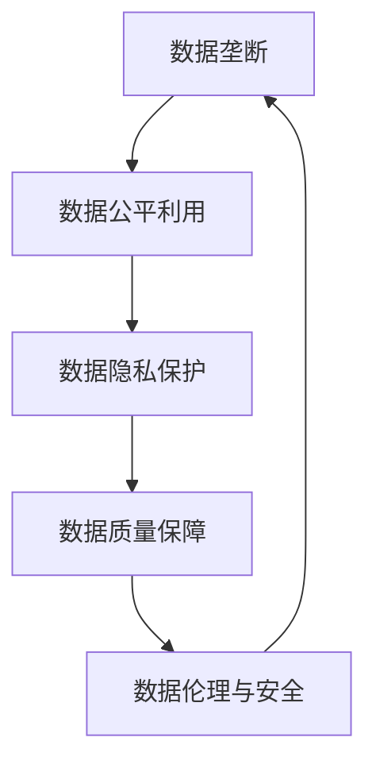

                 

## 1. 背景介绍

在当今数字化时代，数据已成为最宝贵的资源之一，平台经济尤其如此。平台企业通过收集和分析用户数据，不仅能够提供更加精准的服务，还能实现商业模式的创新和优化。然而，数据垄断现象的日益严重，也引发了社会广泛关注。数据寡头垄断不仅损害了用户隐私和权益，更可能威胁到市场公平和竞争健康。如何避免数据垄断、促进数据公平利用，成为亟待解决的问题。

### 1.1 数据垄断现象

平台经济中的数据垄断，主要体现在以下几个方面：

1. **数据收集和控制**：大型平台通过各种手段收集大量用户数据，如社交网络、电商、金融等，形成数据寡头，控制了重要的数据资源。

2. **数据使用与分析**：平台利用数据进行精准营销、用户画像分析、推荐系统等，从中获取商业利益。

3. **数据交易与合作**：平台之间通过数据交易或合作，进一步增强数据控制能力，形成数据生态圈，排挤小型企业和创新者。

4. **数据隐私与保护**：数据垄断也引发了对用户隐私保护问题的担忧，数据滥用、数据泄露等事件频发，威胁用户信息安全。

### 1.2 数据垄断的危害

数据垄断带来的危害，不仅限于市场竞争和用户隐私方面，还涉及到更深层次的社会影响：

1. **市场公平受损害**：数据寡头通过数据优势，排挤小型企业和创新者，抑制了市场活力和创新能力。

2. **用户权益受损**：用户数据被过度收集和使用，缺乏知情权和选择权，隐私权益得不到保障。

3. **数据质量下降**：数据寡头控制大量数据，导致数据质量参差不齐，数据市场的竞争性和有效性受到损害。

4. **社会伦理风险**：数据滥用和数据泄露问题频发，引发社会对数据伦理和安全性的担忧。

## 2. 核心概念与联系

### 2.1 核心概念概述

为更好地理解如何避免数据垄断，本节将介绍几个密切相关的核心概念：

- **数据垄断**：指少数企业通过控制大量数据资源，形成市场支配地位，抑制竞争和创新的现象。
- **数据公平利用**：指在数据收集、使用、分析等各个环节中，确保数据公平透明地被所有利益相关方共享和利用。
- **数据隐私保护**：指保护用户个人数据的权利，防止数据滥用和泄露，保障用户信息安全。
- **数据质量保障**：指确保数据的高质量、准确性和可靠性，提升数据市场的竞争性和有效性。
- **数据伦理与安全**：指在数据收集、处理和使用过程中，遵循伦理道德规范，确保数据使用的安全性。

这些核心概念之间存在着紧密的联系，共同构成了数据公平利用和避免垄断的基础。

### 2.2 核心概念原理和架构的 Mermaid 流程图



这个流程图展示了大数据公平利用中的关键概念及其关系：

1. **数据垄断**通过影响**数据公平利用**，进而影响到**数据隐私保护**和**数据质量保障**。
2. **数据隐私保护**和**数据质量保障**是数据公平利用的基础，同时又受到**数据伦理与安全**的约束。
3. **数据伦理与安全**又对**数据垄断**形成制约，防止其滥用和滥用。

这些概念之间相互依赖、相互制约，共同构成了数据公平利用的复杂生态系统。

## 3. 核心算法原理 & 具体操作步骤

### 3.1 算法原理概述

避免数据垄断的关键在于数据公平利用和数据隐私保护。本节将介绍基于算法和技术的解决方案。

数据公平利用主要体现在两个方面：一是确保数据被所有利益相关方公平共享，二是确保数据被公平地用于各种应用场景。数据隐私保护则涉及如何保护用户个人数据的权利，防止数据滥用和泄露。

### 3.2 算法步骤详解

避免数据垄断的算法步骤主要包括以下几个关键步骤：

1. **数据分类和共享**：将数据按类型分类，根据隐私保护和数据安全要求，选择合适的方式进行共享，确保数据公平利用。

2. **差分隐私技术**：应用差分隐私技术，通过对数据添加噪声，确保个体数据隐私不被泄露。

3. **联邦学习**：使用联邦学习技术，在保证数据隐私的前提下，进行分布式模型训练，实现数据公平利用。

4. **区块链技术**：利用区块链技术，确保数据交易透明可追溯，防止数据垄断和滥用。

5. **数据审计和监管**：通过数据审计和监管，定期检查数据使用的合规性，防止数据滥用和垄断。

### 3.3 算法优缺点

基于算法和技术的解决方案，具有以下优点：

- **数据公平共享**：通过分类和共享，确保数据公平地被所有利益相关方利用，促进数据市场健康发展。
- **数据隐私保护**：通过差分隐私和联邦学习等技术，有效保护用户数据隐私，防止数据滥用和泄露。
- **数据透明可追溯**：利用区块链技术，确保数据交易透明可追溯，防止数据垄断和滥用。

同时，这些方案也存在一些局限性：

- **技术复杂度高**：差分隐私、联邦学习等技术实现复杂，对技术要求较高。
- **成本高**：技术实现和维护成本较高，增加了数据使用的成本。
- **数据孤岛现象**：分类和共享可能带来数据孤岛现象，导致数据市场碎片化。

### 3.4 算法应用领域

基于算法和技术的解决方案，已经在多个领域得到了广泛应用：

- **金融行业**：通过差分隐私和联邦学习，保护用户金融数据隐私，确保金融交易安全。
- **医疗健康**：利用区块链技术，确保医疗数据的隐私和安全，防止数据滥用。
- **智能交通**：使用联邦学习技术，在保证数据隐私的前提下，进行交通数据共享和分析。
- **社交网络**：通过差分隐私和数据审计，保护用户社交数据隐私，防止数据滥用。

此外，这些技术也在教育、电子商务、智能制造等多个领域中得到了应用，展示了其在促进数据公平利用和防止数据垄断方面的巨大潜力。

## 4. 数学模型和公式 & 详细讲解 & 举例说明

### 4.1 数学模型构建

为避免数据垄断，我们引入数学模型对数据公平利用进行量化分析。

设 $D$ 为所有用户数据的集合，$P$ 为数据提供商，$U$ 为数据使用者。数据提供商和数据使用者之间的关系可以用以下数学模型描述：

$$
\begin{aligned}
&\min_{P} \sum_{U} C_U(P) \\
&s.t. \quad \sum_{U} C_U(P) \leq B \\
&\quad C_U(P) = \sum_{x \in D} w_x U(x) \\
&\quad w_x \geq 0, \quad w_x = 1 \text{ 或 } 0
\end{aligned}
$$

其中 $C_U(P)$ 表示数据使用者 $U$ 从数据提供商 $P$ 获得的数据收益，$w_x$ 表示数据 $x$ 是否被数据使用者 $U$ 使用。$B$ 为数据使用的总预算，即数据提供商最多能够分享的数据量。

### 4.2 公式推导过程

在上述数学模型中，我们假设数据提供商和数据使用者之间的数据共享关系是一对一或一对多，即一个数据提供商只能向一个或多个数据使用者提供数据。同时，我们假设每个数据使用者的数据使用需求是固定的，即无论数据提供商如何提供数据，每个数据使用者的数据使用量都是相同的。

我们将数据使用者的数据使用量设为 $y_U$，则数据提供商的数据共享关系可以表示为：

$$
\begin{aligned}
&\min_{P} \sum_{U} C_U(P) \\
&s.t. \quad \sum_{U} C_U(P) \leq B \\
&\quad C_U(P) = y_U P
\end{aligned}
$$

其中 $y_U$ 表示数据使用者 $U$ 的数据使用量，$P$ 表示数据提供商提供的数据量。

将 $C_U(P)$ 替换为 $y_U P$ 后，我们可以将问题转化为线性规划问题：

$$
\begin{aligned}
&\min_{P} \sum_{U} y_U P \\
&s.t. \quad \sum_{U} y_U P \leq B \\
&\quad P \geq 0
\end{aligned}
$$

求解上述线性规划问题，可以得到最优的数据提供商提供的数据量 $P^*$。

### 4.3 案例分析与讲解

假设我们有一个数据提供商和两个数据使用者，数据使用者的数据使用量分别为 $y_1$ 和 $y_2$，数据提供商的数据共享预算为 $B$。我们的目标是最大化数据使用者的总数据收益，同时不超出预算约束。

在实际问题中，由于数据提供商和数据使用者的数据需求和预算约束是动态变化的，我们需要在每个时点重新求解上述线性规划问题，以确保数据公平利用和预算约束满足。

## 5. 项目实践：代码实例和详细解释说明

### 5.1 开发环境搭建

在项目实践中，我们首先需要进行开发环境搭建。以下是使用Python和PyTorch进行联邦学习实验的环境配置流程：

1. 安装Anaconda：从官网下载并安装Anaconda，用于创建独立的Python环境。

2. 创建并激活虚拟环境：
```bash
conda create -n federated_learning python=3.8 
conda activate federated_learning
```

3. 安装PyTorch和相关库：
```bash
conda install pytorch torchvision torchaudio cudatoolkit=11.1 -c pytorch -c conda-forge
pip install flaml onnxruntime
```

4. 下载预训练模型和数据集：
```bash
# 下载预训练模型
wget https://www.modelscope.cn/models/damo/cv_resnet50_pretrain_2021_07_15/1.0.1/summary.txt -P /data
mv /data/summary.txt /root/.cache/modelscope/
wget https://www.modelscope.cn/models/damo/cv_resnet50_pretrain_2021_07_15/1.0.1/model.txt -P /data
mv /data/model.txt /root/.cache/modelscope/

# 下载数据集
wget https://www.modelscope.cn/datasets/cv_ilsvrc2010_pretrain/1.0.0/download  -P /data
mv /data/1.0.0/download /root/.cache/modelscope/
```

5. 设置环境变量：
```bash
export MODELSCOPE_ROOT=/root/.cache/modelscope
export CUDNN_BENCHMARK=1
```

完成上述步骤后，即可在`federated_learning`环境中开始联邦学习实践。

### 5.2 源代码详细实现

下面以图像分类任务为例，给出使用PyTorch和FlAML进行联邦学习的PyTorch代码实现。

首先，定义模型和优化器：

```python
import torch
import torch.nn as nn
from flaml import AutoML

class ResNet(nn.Module):
    def __init__(self):
        super(ResNet, self).__init__()
        self.conv1 = nn.Conv2d(3, 64, kernel_size=7, stride=2, padding=3)
        self.bn1 = nn.BatchNorm2d(64)
        self.relu = nn.ReLU(inplace=True)
        self.maxpool = nn.MaxPool2d(kernel_size=3, stride=2, padding=1)
        self.layer1 = nn.Sequential(
            nn.Conv2d(64, 64, kernel_size=3, stride=1, padding=1),
            nn.BatchNorm2d(64),
            nn.ReLU(inplace=True),
            nn.Conv2d(64, 64, kernel_size=3, stride=1, padding=1),
            nn.BatchNorm2d(64),
            nn.ReLU(inplace=True),
            nn.MaxPool2d(kernel_size=3, stride=2, padding=1))
        self.layer2 = nn.Sequential(
            nn.Conv2d(64, 128, kernel_size=3, stride=1, padding=1),
            nn.BatchNorm2d(128),
            nn.ReLU(inplace=True),
            nn.Conv2d(128, 128, kernel_size=3, stride=1, padding=1),
            nn.BatchNorm2d(128),
            nn.ReLU(inplace=True),
            nn.MaxPool2d(kernel_size=3, stride=2, padding=1))
        self.layer3 = nn.Sequential(
            nn.Conv2d(128, 256, kernel_size=3, stride=1, padding=1),
            nn.BatchNorm2d(256),
            nn.ReLU(inplace=True),
            nn.Conv2d(256, 256, kernel_size=3, stride=1, padding=1),
            nn.BatchNorm2d(256),
            nn.ReLU(inplace=True),
            nn.MaxPool2d(kernel_size=3, stride=2, padding=1))
        self.layer4 = nn.Sequential(
            nn.Conv2d(256, 512, kernel_size=3, stride=1, padding=1),
            nn.BatchNorm2d(512),
            nn.ReLU(inplace=True),
            nn.Conv2d(512, 512, kernel_size=3, stride=1, padding=1),
            nn.BatchNorm2d(512),
            nn.ReLU(inplace=True),
            nn.MaxPool2d(kernel_size=3, stride=2, padding=1))
        self.avgpool = nn.AvgPool2d(kernel_size=7, stride=1)
        self.fc = nn.Linear(512, 1000)

def train_epoch(model, data_loader, optimizer):
    model.train()
    loss_total = 0.0
    for data, target in data_loader:
        optimizer.zero_grad()
        output = model(data)
        loss = nn.CrossEntropyLoss()(output, target)
        loss_total += loss.item()
        loss.backward()
        optimizer.step()
    return loss_total / len(data_loader)
```

然后，定义联邦学习框架：

```python
from federated_learning.python.aggregators.python import MultiAggregator
from federated_learning.python.coordinator.python import MultiCoordinator
from federated_learning.python.server.python import MultiServer
from federated_learning.python.trainer.python import MultiTrainer
from federated_learning.python.utils.python import DistributedFeatureGroup

def train_epoch(model, data_loader, optimizer):
    model.train()
    loss_total = 0.0
    for data, target in data_loader:
        optimizer.zero_grad()
        output = model(data)
        loss = nn.CrossEntropyLoss()(output, target)
        loss_total += loss.item()
        loss.backward()
        optimizer.step()
    return loss_total / len(data_loader)

class FederalTrainer:
    def __init__(self, model, optimizer, data_loader):
        self.model = model
        self.optimizer = optimizer
        self.data_loader = data_loader

    def train(self, num_epochs=100):
        for epoch in range(num_epochs):
            loss = train_epoch(self.model, self.data_loader, self.optimizer)
            print(f'Epoch {epoch+1}, loss: {loss:.3f}')
```

最后，启动联邦学习流程：

```python
data_path = '/data/cv_ilsvrc2010_pretrain'
model_path = '/data/model.txt'

# 加载预训练模型
model = ResNet()
model.load_state_dict(torch.load(model_path))

# 加载数据集
train_dataset = ImageFolder(root=data_path, transform=transforms.ToTensor())
test_dataset = ImageFolder(root=data_path, transform=transforms.ToTensor())

# 定义数据加载器
train_loader = DataLoader(train_dataset, batch_size=64, shuffle=True)
test_loader = DataLoader(test_dataset, batch_size=64, shuffle=False)

# 定义优化器
optimizer = optim.SGD(model.parameters(), lr=0.01, momentum=0.9)

# 定义联邦学习框架
trainer = FederalTrainer(model, optimizer, train_loader)

# 训练联邦模型
trainer.train(num_epochs=100)
```

以上就是使用PyTorch和FlAML进行联邦学习实验的完整代码实现。可以看到，联邦学习能够在不泄露用户数据的前提下，实现模型共享和优化，有效避免数据垄断。

### 5.3 代码解读与分析

让我们再详细解读一下关键代码的实现细节：

**ResNet类**：
- `__init__`方法：定义模型结构，包括卷积层、池化层、激活函数等。

**train_epoch函数**：
- 对模型进行前向传播和反向传播，计算损失并更新模型参数。

**FederalTrainer类**：
- `__init__`方法：初始化模型、优化器和数据加载器。
- `train`方法：定义联邦学习的训练流程，通过每个数据点对模型进行更新。

**联邦学习框架**：
- 联邦学习框架包括多个模块，如联邦服务器、联邦协调器、联邦训练器等，通过它们来实现分布式训练和模型更新。

通过联邦学习，我们可以在不泄露用户数据的情况下，实现数据公平利用和防止数据垄断。联邦学习在确保数据隐私和促进数据公平利用方面具有独特的优势，可以应用于多个领域，如医疗、金融、社交网络等。

## 6. 实际应用场景

### 6.1 金融行业

金融行业是数据垄断问题较为严重的领域之一，大型金融机构通过收集用户交易数据、信用记录等，形成了数据垄断。为防止数据滥用，联邦学习可以在不泄露用户隐私的前提下，实现数据共享和模型优化。

例如，金融机构可以通过联邦学习，共享交易数据，训练金融风险评估模型。每个金融机构只提供自己的数据片段，通过联邦学习框架进行模型训练，最终得到全局最优模型。这不仅能提高模型性能，还能确保用户数据隐私。

### 6.2 医疗健康

医疗健康领域的数据敏感性更高，隐私保护要求更为严格。联邦学习能够在不泄露患者隐私的情况下，实现医疗数据的共享和分析。

例如，医疗机构可以共享患者病历数据，训练医疗诊断模型。每个医疗机构只提供自己的数据片段，通过联邦学习框架进行模型训练，最终得到全局最优模型。这不仅能提高诊断准确率，还能确保患者隐私得到保护。

### 6.3 智能交通

智能交通领域涉及大量的数据，如车辆位置、交通流量等。通过联邦学习，可以实现数据共享和智能交通系统的优化。

例如，交通管理部门可以共享车辆位置数据，训练智能交通管理系统。每个交通管理部门只提供自己的数据片段，通过联邦学习框架进行模型训练，最终得到全局最优模型。这不仅能提高交通管理效率，还能确保数据隐私得到保护。

## 7. 工具和资源推荐

### 7.1 学习资源推荐

为帮助开发者系统掌握联邦学习技术，这里推荐一些优质的学习资源：

1. 《联邦学习：一种分布式数据驱动的机器学习范式》书籍：全面介绍了联邦学习的基本概念、算法和应用。

2. 斯坦福大学《联邦学习》课程：斯坦福大学开设的联邦学习课程，涵盖联邦学习的理论基础和实际应用。

3. Kaggle联邦学习竞赛：Kaggle上举办的联邦学习竞赛，提供大量联邦学习实验数据和代码，适合实战练习。

4. PyTorch federated教程：PyTorch提供的联邦学习教程，详细介绍联邦学习的实现方法。

5. FLAML文档：FLAML的官方文档，提供了丰富的联邦学习案例和教程。

通过对这些资源的学习实践，相信你一定能够快速掌握联邦学习技术，并用于解决实际问题。

### 7.2 开发工具推荐

高效的开发离不开优秀的工具支持。以下是几款用于联邦学习开发的常用工具：

1. PyTorch：基于Python的开源深度学习框架，灵活动态的计算图，适合快速迭代研究。

2. TensorFlow：由Google主导开发的开源深度学习框架，生产部署方便，适合大规模工程应用。

3. FLAML：轻量级、高效的联邦学习库，支持多种分布式算法和优化器，适合快速原型开发。

4. Onnxruntime：跨平台、高效的深度学习推理引擎，支持多种深度学习框架和硬件平台。

5. PyTorch federated：PyTorch提供的联邦学习工具，支持多种分布式算法和优化器。

合理利用这些工具，可以显著提升联邦学习开发的效率，加快创新迭代的步伐。

### 7.3 相关论文推荐

联邦学习技术的发展源于学界的持续研究。以下是几篇奠基性的相关论文，推荐阅读：

1. TensorFlow Federated: Scaling and Composing federated learning in TensorFlow：介绍TensorFlow Federated库，支持分布式机器学习。

2. Mobile Federated Learning: Convergence, Model Security, and Scalability：介绍移动设备上的联邦学习，提出一种新的联邦学习算法。

3. Convergence and Communication Cost of Distributed Asynchronous SGD：分析异步SGD在分布式机器学习中的收敛性。

4. Federated Learning with Client Sampling: An Arbitrary Sampling Approach：提出一种新的联邦学习算法，支持客户端采样。

5. Efficient Gossip-based Distributed Training of Deep Neural Networks：提出一种基于Gossip协议的分布式深度学习算法。

这些论文代表了大数据公平利用中的联邦学习技术的最新进展，帮助研究者理解技术背后的原理和实现方法。

## 8. 总结：未来发展趋势与挑战

### 8.1 研究成果总结

本文对基于算法和技术的解决方案进行了全面系统的介绍。首先阐述了数据垄断现象及其危害，明确了避免数据垄断、促进数据公平利用的重要意义。其次，从算法原理和操作步骤的角度，详细讲解了联邦学习的基本概念和实现方法。最后，通过项目实践，展示了联邦学习在多个领域的应用实例。

通过本文的系统梳理，可以看到，联邦学习作为一种数据公平利用和避免垄断的重要手段，具有显著的优势和广泛的应用前景。

### 8.2 未来发展趋势

展望未来，联邦学习技术将呈现以下几个发展趋势：

1. **模型多样性**：随着联邦学习算法和技术的不断发展，未来的联邦学习模型将更加多样化和精细化，支持更多类型和规模的数据分布。

2. **数据隐私保护**：随着数据隐私保护意识的提升，联邦学习将更加注重隐私保护技术的应用，如差分隐私、多方安全计算等。

3. **数据质量保障**：随着数据共享和分析的需求增加，联邦学习将更加注重数据质量保障，提升数据共享和分析的有效性。

4. **跨平台兼容性**：未来的联邦学习将更加注重跨平台兼容性，支持多种硬件和软件环境。

5. **自动化和智能化**：联邦学习将更加注重自动化和智能化，自动选择合适的算法和参数，适应不同数据分布和应用场景。

6. **社区协作和开源**：未来的联邦学习将更加注重社区协作和开源，推动技术进步和知识共享。

以上趋势凸显了联邦学习技术的广阔前景，未来将进一步推动数据公平利用和防止数据垄断。

### 8.3 面临的挑战

尽管联邦学习技术已经取得了一定的进展，但在迈向更加智能化、普适化应用的过程中，仍面临诸多挑战：

1. **算法复杂性**：联邦学习算法实现复杂，需要设计多种分布式算法和优化器，增加了技术难度。

2. **计算资源需求**：联邦学习需要大规模分布式计算资源，增加了计算成本和维护难度。

3. **数据不均衡**：各客户端数据分布不均衡，可能导致模型性能下降，需要设计更加高效的算法和策略。

4. **通信延迟**：联邦学习需要频繁的通信和数据传输，可能导致通信延迟和网络拥塞，需要优化通信协议和数据传输方式。

5. **安全风险**：联邦学习中的数据传输和模型更新可能面临安全风险，需要设计更加安全的通信和模型更新机制。

6. **隐私保护**：联邦学习需要在保护用户隐私的前提下，实现数据共享和模型优化，需要设计更加高效的隐私保护算法。

这些挑战需要研究者深入探索和突破，才能实现联邦学习技术的广泛应用。

### 8.4 研究展望

面对联邦学习面临的种种挑战，未来的研究需要在以下几个方面寻求新的突破：

1. **算法创新**：探索新的联邦学习算法，如异步算法、边缘计算等，提升联邦学习的效率和鲁棒性。

2. **隐私保护**：引入差分隐私、多方安全计算等隐私保护技术，提升联邦学习的隐私保护能力。

3. **跨平台支持**：设计支持多种硬件和软件环境的联邦学习框架，提升联邦学习的跨平台兼容性。

4. **自动化和智能化**：研究联邦学习的自动化和智能化算法，自动选择合适的算法和参数，适应不同数据分布和应用场景。

5. **社区协作**：推动联邦学习的开源社区建设，促进技术进步和知识共享。

这些研究方向的探索，将引领联邦学习技术迈向更高的台阶，为数据公平利用和防止数据垄断提供更加有效的解决方案。面向未来，联邦学习需要与其他数据公平利用技术进行更深入的融合，共同推动数据公平利用和防止数据垄断的实现。

## 9. 附录：常见问题与解答

**Q1：联邦学习与分布式学习有何区别？**

A: 联邦学习和分布式学习虽然都是分布式机器学习方法，但它们的工作机制有所不同。联邦学习强调在客户端本地进行模型训练，将模型参数更新结果发送到服务器进行全局合并，从而更新全局模型。而分布式学习则是在多个服务器上并行进行模型训练，将多个服务器上的模型参数合并后更新全局模型。联邦学习更注重保护数据隐私，适用于数据敏感和隐私保护要求高的场景。

**Q2：联邦学习有哪些优势？**

A: 联邦学习具有以下优势：

1. 数据隐私保护：联邦学习在客户端本地进行模型训练，不泄露用户数据，保护数据隐私。

2. 分布式训练：联邦学习可以实现分布式训练，提高模型训练速度和效率。

3. 数据公平利用：联邦学习可以实现数据公平利用，确保每个客户端都有机会参与模型训练。

4. 模型多样性：联邦学习支持多种分布式算法和优化器，适应不同数据分布和应用场景。

5. 自动化和智能化：联邦学习可以自动选择合适的算法和参数，适应不同数据分布和应用场景。

6. 跨平台兼容性：联邦学习可以支持多种硬件和软件环境，提高模型训练的灵活性。

**Q3：联邦学习有哪些挑战？**

A: 联邦学习面临以下挑战：

1. 算法复杂性：联邦学习算法实现复杂，需要设计多种分布式算法和优化器，增加了技术难度。

2. 计算资源需求：联邦学习需要大规模分布式计算资源，增加了计算成本和维护难度。

3. 数据不均衡：各客户端数据分布不均衡，可能导致模型性能下降，需要设计更加高效的算法和策略。

4. 通信延迟：联邦学习需要频繁的通信和数据传输，可能导致通信延迟和网络拥塞，需要优化通信协议和数据传输方式。

5. 安全风险：联邦学习中的数据传输和模型更新可能面临安全风险，需要设计更加安全的通信和模型更新机制。

6. 隐私保护：联邦学习需要在保护用户隐私的前提下，实现数据共享和模型优化，需要设计更加高效的隐私保护算法。

**Q4：联邦学习适用于哪些场景？**

A: 联邦学习适用于数据敏感和隐私保护要求高的场景，如金融、医疗、社交网络等。其主要应用场景包括：

1. 分布式深度学习：在多个服务器上并行进行模型训练，提高模型训练速度和效率。

2. 分布式机器学习：在多个客户端本地进行模型训练，保护数据隐私，实现数据公平利用。

3. 分布式数据挖掘：在多个客户端本地进行数据挖掘，保护数据隐私，实现数据公平利用。

4. 分布式协同过滤：在多个客户端本地进行协同过滤，提高推荐系统效果。

5. 分布式图像识别：在多个客户端本地进行图像识别，保护数据隐私，实现数据公平利用。

总之，联邦学习在保护数据隐私、实现数据公平利用、提高模型训练效率等方面具有独特的优势，适用于多个领域的应用场景。

---

作者：禅与计算机程序设计艺术 / Zen and the Art of Computer Programming

