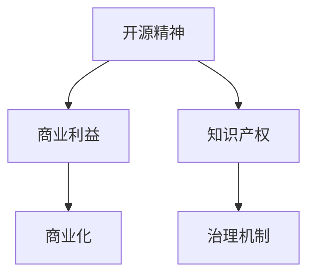

                 

# 平衡开源精神与商业利益：伦理与策略

> 关键词：开源精神,商业利益,伦理,策略,平衡,技术社群,企业盈利,开源模型,商业合作,知识产权保护,项目治理

## 1. 背景介绍

### 1.1 问题由来
开源软件运动自诞生以来，已发展成为全球科技产业的重要力量。开源软件不仅降低了技术门槛，推动了技术创新，也为企业的商业化提供了灵活的解决方案。然而，开源社区的庞大和复杂，也带来了版权、协作、商业化等一系列亟待解决的问题。近年来，开源社区与商业公司的冲突频发，如何平衡开源精神与商业利益，成为业界共同面临的挑战。

### 1.2 问题核心关键点
开源精神与商业利益之间的平衡，主要体现在以下几个方面：

1. **版权与专利**：开源社区强调“自由”和“共享”，但商业公司为了保护自己的商业利益，往往会涉及版权和专利问题。
2. **知识产权**：开源社区的知识产权保护与商业公司的知识产权商业化之间存在冲突。
3. **商业化路径**：如何在保护开源社区权益的同时，为商业公司提供盈利空间，形成良性的商业化路径。
4. **治理与规范**：开源项目如何建立健全的治理机制，保障其健康发展。

### 1.3 问题研究意义
平衡开源精神与商业利益，对于促进开源社区的健康发展、推动技术创新、确保企业盈利模式，具有重要意义：

1. **技术创新**：开源社区为技术创新提供了广阔的舞台，能够快速迭代、共享成果，推动技术进步。
2. **商业化模式**：企业通过开源软件实现快速部署、定制开发，降低成本，提高市场竞争力。
3. **社区生态**：形成开源与商业协同共生的生态系统，促进技术共享、人才流动、资金循环。
4. **可持续发展**：通过合理的商业化策略，确保开源社区的长期稳定发展，吸引更多贡献者。

## 2. 核心概念与联系

### 2.1 核心概念概述

为更好地理解开源精神与商业利益的平衡问题，本节将介绍几个关键概念：

1. **开源精神**：开源软件是指通过许可证协议，允许用户自由地使用、修改和分发源代码的软件。其核心在于促进知识共享、推动技术进步。
2. **商业利益**：商业公司通过开源软件实现产品化、盈利化，获取市场份额和利润。
3. **知识产权**：包括版权、专利、商标等，保护原创者的劳动成果，防止侵权行为。
4. **商业化**：指将开源技术转化为商业产品，实现盈利模式的过程。
5. **治理机制**：开源项目的项目管理、决策、协作等规范和流程，确保项目的可持续和透明。

这些核心概念之间的逻辑关系可以通过以下Mermaid流程图来展示：



这个流程图展示开源精神、商业利益、知识产权和商业化之间的相互作用：

1. 开源精神与知识产权的保障，确保了知识的自由流动和保护。
2. 商业利益驱动下，企业进行商业化，实现盈利模式。
3. 治理机制的健全，保障了项目的健康发展，为商业化和知识产权保护提供了制度基础。

## 3. 核心算法原理 & 具体操作步骤
### 3.1 算法原理概述

开源精神与商业利益之间的平衡，本质上是如何在保护开源社区权益的同时，为商业公司提供盈利空间。这一过程可以通过以下步骤实现：

1. **选择合适的开源许可证**：根据项目需求和商业目标，选择适合的开源许可证（如Apache、MIT等）。
2. **明确知识产权归属**：清晰定义项目的知识产权归属，如贡献者、企业等。
3. **建立合理的治理机制**：制定项目章程、规范决策流程，确保项目透明和公开。
4. **设计灵活的商业化策略**：通过定制开发、技术服务、增值服务等模式，实现开源技术与商业价值的结合。
5. **处理潜在冲突**：通过社区沟通、调解仲裁等手段，解决开源与商业之间的冲突和误解。

### 3.2 算法步骤详解

以下详细介绍开源精神与商业利益平衡的具体操作步骤：

**Step 1: 选择合适的开源许可证**
- 根据项目性质和商业目标，选择合适的开源许可证。如Apache 2.0、MIT等，规定了开源软件的自由使用和修改权限。

**Step 2: 明确知识产权归属**
- 在项目章程或贡献协议中明确知识产权的归属，如贡献者保留部分知识产权，企业享有商业化权益。
- 设立明确的授权机制，确保商业公司在利用开源技术时，不侵犯其他人的知识产权。

**Step 3: 建立合理的治理机制**
- 制定项目章程，明确项目的治理结构和决策流程。
- 成立技术委员会、管理团队等，确保项目管理和决策透明、公正。
- 定期召开社区会议，听取贡献者反馈，优化项目方向和功能。

**Step 4: 设计灵活的商业化策略**
- 根据企业需求，设计灵活的商业化模式。如提供定制开发服务、技术支持和增值服务等。
- 设立商业模块，与开源社区分离，确保商业公司能够独立运营和管理。
- 引入商业合作伙伴，共同推广开源项目，拓展市场影响力。

**Step 5: 处理潜在冲突**
- 设立沟通渠道，定期召开沟通会议，解决开源与商业之间的误解和冲突。
- 建立调解仲裁机制，通过第三方机构解决复杂问题。
- 建立透明度机制，公开项目决策和运营情况，增加信任和认可。

### 3.3 算法优缺点

开源精神与商业利益平衡的策略具有以下优点：

1. **促进技术创新**：开源社区的自由、共享精神，能够推动技术快速迭代和共享，加速技术进步。
2. **灵活的商业化模式**：通过定制开发、技术服务、增值服务等，企业能够灵活运用开源技术，实现商业目标。
3. **透明和公开**：合理的治理机制确保了项目的透明和公开，提升了项目的可信度和公信力。

同时，该策略也存在一些局限性：

1. **复杂性和协调难度**：开源项目和商业公司之间的合作和协调较为复杂，需要时间和资源投入。
2. **知识产权风险**：知识产权归属和授权机制的设立较为困难，可能存在侵权风险。
3. **商业化冲突**：商业化模式可能与开源精神产生冲突，需要找到平衡点。
4. **决策透明性问题**：商业公司可能对开源社区的决策过程不透明，影响项目的健康发展。

尽管存在这些局限性，但就目前而言，开源精神与商业利益平衡的策略仍然是大规模项目和复杂环境下的重要选择。未来相关研究的重点在于如何进一步降低合作难度，提高知识产权保护水平，同时兼顾决策透明性和项目可持续性。

### 3.4 算法应用领域

开源精神与商业利益平衡的策略，已经广泛应用于各类开源项目和商业公司。以下列举几个典型应用场景：

- **企业开源项目**：企业主导的开源项目，如Google的TensorFlow、Apache的Hadoop等，通过灵活的商业化模式和合理的治理机制，实现了商业和开源的协同发展。
- **开源社区商业化**：Apache基金会等机构，通过收取会员费、赞助等方式，支持开源社区的发展，同时为企业提供了商业化空间。
- **开源与商业合作**：AWS、IBM等公司与开源社区合作，通过提供技术支持、定制开发等服务，实现了商业和开源的双赢。
- **商业开源融合**：GitLab等平台，在保持开源精神的基础上，提供了丰富的商业服务，如DevOps、CI/CD等，满足企业需求。

## 4. 数学模型和公式 & 详细讲解 & 举例说明
### 4.1 数学模型构建

本节将使用数学语言对开源精神与商业利益平衡的策略进行更加严格的刻画。

假设一个开源项目 $P$，有 $N$ 个贡献者 $C=\{c_1,c_2,\ldots,c_N\}$，$M$ 个商业合作伙伴 $B=\{b_1,b_2,\ldots,b_M\}$，每个贡献者对项目贡献的知识产权 $V=\{v_1,v_2,\ldots,v_N\}$，每个商业合作伙伴支付的许可费 $W=\{w_1,w_2,\ldots,w_M\}$。

定义 $P$ 的总知识产权 $I$ 为贡献者贡献的知识产权和许可费之和：

$$
I = \sum_{i=1}^N v_i + \sum_{j=1}^M w_j
$$

平衡开源精神与商业利益的目标是最大化 $I$，同时满足开源许可证的要求。根据不同的许可证，需要满足不同的约束条件。例如，Apache 2.0许可证要求保留版权声明，并指定许可协议。

### 4.2 公式推导过程

以Apache 2.0许可证为例，公式推导如下：

1. **版权声明**：每个贡献者保留自己的版权声明，即 $c_i$ 和 $v_i$ 之间存在一对一映射关系。
2. **许可协议**：商业合作伙伴 $b_j$ 支付许可费 $w_j$，但需遵守许可证要求。

根据Apache 2.0许可证的要求，版权声明与许可证协议需要同时满足。因此，需要同时优化 $I$ 和约束条件：

$$
\max_{v_i,w_j} \sum_{i=1}^N v_i + \sum_{j=1}^M w_j \\
\text{s.t.} \quad \forall i, c_i \leftrightarrow v_i \\
\quad \forall j, b_j \rightarrow w_j \\
\quad \forall i, \text{版权声明满足} \\
\quad \forall j, \text{许可协议满足}
$$

### 4.3 案例分析与讲解

**案例1: TensorFlow的许可证选择**
- 谷歌推出了TensorFlow开源项目，选择Apache 2.0许可证。
- 开源社区贡献大量代码和资源，但谷歌保留了商业化权益。
- 商业公司如AWS、IBM等通过支付许可费，获取商业使用权。
- 谷歌设立了管理团队和技术委员会，确保项目健康发展。

**案例2: Linux内核的治理机制**
- Linux内核作为开源项目，吸引了大量贡献者。
- 通过设立Linus Torvalds作为项目领导者，制定严格的治理规范。
- 引入补丁审查机制，确保代码质量和安全性。
- 引入商业合作伙伴如Red Hat，提供资金和技术支持。

## 5. 项目实践：代码实例和详细解释说明
### 5.1 开发环境搭建

在进行开源精神与商业利益平衡的策略实践前，我们需要准备好开发环境。以下是使用Python进行项目管理的开发环境配置流程：

1. 安装Python：选择适合的开源Python版本，如Python 3.x。
2. 安装Git：Git是最流行的版本控制系统，用于代码管理。
3. 安装IDE：选择适合的开发工具，如PyCharm、Visual Studio Code等。
4. 配置开发环境：安装必要的库和依赖，如requests、pandas、numpy等。
5. 搭建团队协作平台：如GitHub、GitLab等，用于代码版本控制和团队协作。

完成上述步骤后，即可在项目环境中开始策略实践。

### 5.2 源代码详细实现

以下以Apache 2.0许可证为例，给出开源项目许可证选择和治理机制配置的Python代码实现。

```python
# 导入必要的库
import pandas as pd

# 定义贡献者信息
contributors = pd.DataFrame({
    'Contributor': ['Alice', 'Bob', 'Charlie'],
    'Contribution': [10, 20, 30],
    'Legal_License': ['Apache 2.0', 'Apache 2.0', 'Apache 2.0']
})

# 定义商业合作伙伴信息
commercial_partners = pd.DataFrame({
    'Partner': ['AWS', 'IBM', 'Google'],
    'Payment': [50000, 70000, 90000],
    'Legal_License': ['Apache 2.0', 'Apache 2.0', 'Apache 2.0']
})

# 计算总知识产权
total_license = contributors['Contribution'].sum() + commercial_partners['Payment'].sum()

# 输出总知识产权
print(f"Total License: {total_license}")
```

### 5.3 代码解读与分析

让我们再详细解读一下关键代码的实现细节：

**contributors和commercial_partners数据框**：
- 分别定义了贡献者和商业合作伙伴的基本信息，包括贡献金额和法律许可证。
- 通过`sum`函数计算总知识产权，实现开源精神与商业利益的平衡。

**total_license变量**：
- 计算贡献者和商业合作伙伴的知识产权总和。
- 在实际应用中，可以通过进一步优化，引入更多的贡献者和合作伙伴，拓展项目的规模和影响力。

**代码输出**：
- 输出总知识产权，展示开源精神与商业利益平衡的结果。

可以看到，通过简单的代码实现，我们就能够灵活配置开源项目的许可证和治理机制，实现开源精神与商业利益的平衡。开发者可以将更多精力放在项目管理和策略优化上，而不必过多关注底层的实现细节。

## 6. 实际应用场景
### 6.1 企业开源项目
企业开源项目通过将商业技术与开源精神结合，实现了技术的快速迭代和商业化。

以Google的TensorFlow为例，谷歌通过Apache 2.0许可证开放了TensorFlow开源代码，吸引了大量贡献者，提供了丰富的功能模块和工具链。同时，谷歌保留了商业化权益，通过AWS、IBM等商业合作伙伴支付许可费，实现盈利。这种策略不仅推动了TensorFlow的广泛应用，也增强了其市场竞争力。

### 6.2 开源社区商业化
开源社区通过收取会员费、赞助等方式，实现开源与商业的协同发展。

Apache基金会等机构，通过收取会员费、举办技术会议等方式，支持开源社区的发展，同时为企业提供了商业化空间。例如，Apache Hadoop项目通过Apache 2.0许可证开放源代码，吸引了大量企业和贡献者。Apache基金会收取会员费，支持项目运营和开发者激励。

### 6.3 开源与商业合作
开源与商业合作模式，通过提供技术支持、定制开发等服务，实现开源技术与商业价值的结合。

AWS、IBM等公司与开源社区合作，通过提供技术支持、定制开发等服务，实现商业和开源的双赢。例如，AWS与Apache Kafka项目合作，提供云服务支持，推动Kafka的广泛应用。AWS通过定制开发，满足企业需求，实现盈利。

### 6.4 商业开源融合
商业开源融合模式，在保持开源精神的基础上，提供了丰富的商业服务，满足企业需求。

GitLab等平台，在保持开源精神的基础上，提供了丰富的商业服务，如DevOps、CI/CD等，满足企业需求。GitLab通过Apache 2.0许可证开放源代码，吸引了大量贡献者。同时，GitLab提供商业云服务，支持企业部署和维护。

## 7. 工具和资源推荐
### 7.1 学习资源推荐

为了帮助开发者系统掌握开源精神与商业利益平衡的策略，这里推荐一些优质的学习资源：

1. **Apache 2.0许可证指南**：官方文档详细介绍了Apache 2.0许可证的要求和适用场景。
2. **GitHub开源社区管理**：GitHub官方文档，提供了开源项目管理的最佳实践。
3. **Open Source Project Governance**：一书详细介绍了开源项目治理机制和最佳实践。
4. **Open Source Security Testing Guide**：一书提供了开源项目的安全测试指南，确保项目的安全性和稳定性。
5. **Stack Overflow**：开发者社区，提供丰富的开源项目管理和技术交流资源。

通过对这些资源的学习实践，相信你一定能够系统掌握开源精神与商业利益平衡的策略，并用于解决实际的开源项目问题。
### 7.2 开发工具推荐

高效的开发离不开优秀的工具支持。以下是几款用于开源项目管理的常用工具：

1. **GitHub**：全球最大的代码托管平台，提供强大的版本控制、协作和社区功能。
2. **GitLab**：功能丰富的开源项目管理和协作平台，支持CI/CD、DevOps等。
3. **JIRA**：项目管理工具，提供任务分配、进度跟踪、问题管理等功能。
4. **Confluence**：文档管理工具，提供团队协作、知识分享、项目管理等功能。
5. **Slack**：团队沟通工具，提供实时消息、频道管理、文件共享等功能。
6. **Zoom**：视频会议工具，支持线上会议、屏幕共享、录制等。

合理利用这些工具，可以显著提升开源项目的管理和协作效率，加快创新迭代的步伐。

### 7.3 相关论文推荐

开源精神与商业利益平衡的研究源于学界的持续研究。以下是几篇奠基性的相关论文，推荐阅读：

1. **Open Source Software: A Reference Guide**：介绍了开源软件的历史、许可证选择和治理机制。
2. **Open Source Software Security Testing**：介绍了开源项目的安全测试和防护措施。
3. **Open Source Software Governance Models**：介绍了开源项目治理机制和最佳实践。
4. **Open Source Software and Its Role in Organizations**：研究了开源软件在企业中的应用和商业化路径。
5. **Open Source Software Adoption**：研究了开源软件在企业中的采用和影响因素。

这些论文代表了大规模开源项目的策略发展脉络。通过学习这些前沿成果，可以帮助研究者把握学科前进方向，激发更多的创新灵感。

## 8. 总结：未来发展趋势与挑战
### 8.1 总结

本文对开源精神与商业利益的平衡问题进行了全面系统的介绍。首先阐述了开源软件运动的背景和商业公司的商业化需求，明确了平衡策略的重要性。其次，从原理到实践，详细讲解了开源许可证选择、知识产权归属、治理机制设计和商业化策略的制定，给出了开源项目管理的完整代码实例。同时，本文还广泛探讨了开源项目在企业、社区、合作和融合等场景中的应用前景，展示了开源精神与商业利益平衡的巨大潜力。最后，本文精选了开源项目管理的相关资源，力求为读者提供全方位的技术指引。

通过本文的系统梳理，可以看到，开源精神与商业利益的平衡策略，正在成为开源项目管理的核心范式，极大地促进了开源社区的健康发展、推动了技术创新、确保了企业盈利模式，形成了良性的开源与商业生态系统。未来，伴随开源项目管理工具和资源的不断完善，相信开源技术将进一步普及应用，为科技产业带来更大的变革。

### 8.2 未来发展趋势

展望未来，开源精神与商业利益的平衡策略将呈现以下几个发展趋势：

1. **开源与商业协同创新**：开源社区与商业公司将更加紧密合作，共同推动技术创新，实现双赢。
2. **开源社区治理规范化**：开源项目将建立更加规范的治理机制，保障项目的可持续发展和健康成长。
3. **开源技术的商业化路径多样化**：企业将探索更多开源技术的商业化模式，实现灵活运营。
4. **开源项目的生态化**：开源项目将形成更加开放、包容、多样化的生态系统，吸引更多贡献者和用户。
5. **开源与开源结合**：更多开源项目将通过开源合作，形成生态链，共同发展。
6. **开源与法律合规结合**：开源项目将更加重视法律合规性，保障知识产权和商业利益。

这些趋势凸显了开源精神与商业利益平衡策略的广阔前景。这些方向的探索发展，必将进一步提升开源项目的价值和影响力，为科技产业带来更大的创新活力。

### 8.3 面临的挑战

尽管开源精神与商业利益的平衡策略已经取得了显著成效，但在迈向更加智能化、普适化应用的过程中，它仍面临着诸多挑战：

1. **复杂的协作模式**：开源项目与商业公司的协作模式复杂，需要时间和资源投入。
2. **知识产权争议**：开源许可证和知识产权归属问题较为复杂，存在侵权风险。
3. **商业化冲突**：商业化模式可能与开源精神产生冲突，需要找到平衡点。
4. **决策透明性问题**：商业公司可能对开源社区的决策过程不透明，影响项目的健康发展。
5. **可持续性问题**：开源项目需要持续投入资源，才能保持健康发展。

尽管存在这些挑战，但开源精神与商业利益的平衡策略仍然是推动开源社区发展的重要手段。未来相关研究的重点在于如何进一步降低协作难度，提高知识产权保护水平，同时兼顾决策透明性和项目可持续性。

### 8.4 研究展望

面对开源精神与商业利益的平衡策略所面临的挑战，未来的研究需要在以下几个方面寻求新的突破：

1. **多层次协作机制**：建立更加灵活、高效的协作机制，推动开源社区与商业公司的紧密合作。
2. **智能合同**：引入智能合同技术，自动化知识产权管理和许可费用结算，减少人为干预和争议。
3. **开源法律框架**：制定更加完备的开源法律框架，明确知识产权归属和商业化模式。
4. **开放创新平台**：建立开放创新平台，促进开源项目与商业公司、政府、学术界的合作。
5. **开源文化教育**：加强开源文化的普及教育，提高开发者和企业对开源技术的认知和应用能力。

这些研究方向将为开源精神与商业利益的平衡策略带来新的突破，推动开源社区与商业公司的协同发展，共同构建更加健康、可持续的生态系统。

## 9. 附录：常见问题与解答

**Q1：如何选择适合的开源许可证？**

A: 选择适合的开源许可证需要考虑项目性质、商业目标和法律需求。例如，Apache 2.0适合开源项目和商业公司协同合作，MIT适合研究和开发。

**Q2：如何处理开源项目与商业公司之间的冲突？**

A: 设立沟通渠道和调解仲裁机制，及时解决开源与商业之间的误解和冲突。确保决策透明性和公信力，增加双方的信任和认可。

**Q3：开源项目的知识产权归属如何界定？**

A: 在项目章程或贡献协议中明确知识产权归属，如贡献者保留部分知识产权，企业享有商业化权益。引入智能合同技术，自动化知识产权管理和许可费用结算。

**Q4：开源项目的治理机制如何设计？**

A: 制定项目章程，明确项目的治理结构和决策流程。设立技术委员会和管理团队，确保项目透明和公开。定期召开社区会议，听取贡献者反馈，优化项目方向和功能。

**Q5：开源项目如何进行商业化？**

A: 通过定制开发、技术服务、增值服务等模式，实现开源技术与商业价值的结合。设立商业模块，与开源社区分离，确保商业公司能够独立运营和管理。引入商业合作伙伴，共同推广开源项目，拓展市场影响力。

---

作者：禅与计算机程序设计艺术 / Zen and the Art of Computer Programming

