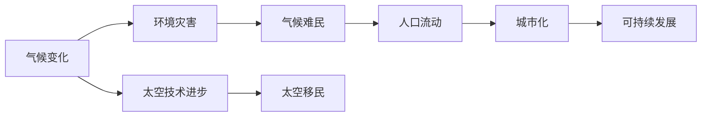

                 

# 2050年的全球移民：从气候难民到太空移民的人口流动

## 1. 背景介绍

全球人口流动是人类社会发展的重要现象之一，它反映了不同国家和地区之间经济、文化、政治的联系与互动。然而，未来几十年，全球人口流动可能会因为气候变化、技术进步和社会变革而出现前所未有的变化，尤其是气候难民和太空移民的兴起。

### 1.1 气候变化与难民问题

气候变化导致的极端天气事件增多，自然灾害频发，许多国家和地区将面临严重的生态环境危机。这些地区的居民将不得不迁徙到更安全的地方，形成气候难民。例如，海平面上升将使低洼岛国居民被迫迁移；干旱、洪水等自然灾害将影响农业生产，导致农村人口流向城市。

### 1.2 太空移民与技术进步

太空技术的发展为人类提供了逃离地球的途径。随着商业太空旅行的兴起和火星殖民计划的推进，一部分人类将有机会迁徙到太空，避免地球的灾难。太空移民不仅能够缓解地球资源紧张和环境压力，还能开辟新的生存空间，推动人类社会的进一步发展。

## 2. 核心概念与联系

### 2.1 核心概念概述

本节将介绍几个与未来全球移民相关的核心概念：

- **气候难民**：由于气候变化导致的环境灾害，被迫离开家园的居民。
- **太空移民**：利用太空技术，将人类迁徙到太空，建立新的居住地。
- **人口流动**：居民在不同地理、经济和社会环境下的迁徙现象。
- **城市化**：人口从农村向城市迁移，导致城市规模和功能的变化。
- **可持续发展**：在满足当代人需求的同时，不损害后代人满足需求的能力。

这些概念之间相互关联，共同构成了未来全球移民的复杂图景。

### 2.2 核心概念原理和架构的 Mermaid 流程图



这个流程图展示了气候变化、太空技术进步与未来全球移民之间的联系。气候变化导致环境灾害，形成气候难民；太空技术进步使得太空移民成为可能；人口流动和城市化是应对气候变化和太空移民的结果；可持续发展则是实现这些目标的基石。

## 3. 核心算法原理 & 具体操作步骤

### 3.1 算法原理概述

未来全球移民的计算和分析涉及大量数据的处理和模型预测，因此需要利用算法进行分析和模拟。

- **数据收集和处理**：收集气候变化数据、太空技术发展数据、人口迁移数据等，进行数据清洗和预处理。
- **预测模型**：利用机器学习模型，如回归模型、分类模型等，预测未来气候变化趋势和太空移民规模。
- **优化模型**：利用优化算法，如遗传算法、粒子群算法等，找到最优的人口流动路径和城市化方案。
- **模拟模型**：利用仿真模型，如Agent-Based Modeling (ABM)，模拟未来社会和经济系统的运行情况。

### 3.2 算法步骤详解

#### 3.2.1 数据收集和预处理

- **数据来源**：气候变化数据来源于气象局和气候模型预测；太空技术数据来源于航天局和商业太空公司；人口迁移数据来源于各国政府统计数据。
- **数据清洗**：去除缺失值和异常值，进行数据标准化和归一化。

#### 3.2.2 预测模型建立

- **回归模型**：利用线性回归、多项式回归、支持向量回归等模型预测未来气候变化趋势和太空移民规模。
- **分类模型**：利用逻辑回归、决策树、随机森林等模型预测不同地区是否会受到气候变化的影响，以及太空移民的可能性。

#### 3.2.3 优化模型建立

- **遗传算法**：利用遗传算法搜索最优的人口流动路径，最小化迁移成本和时间。
- **粒子群算法**：利用粒子群算法优化城市化方案，最大化资源利用率和环境保护。

#### 3.2.4 仿真模型建立

- **Agent-Based Modeling (ABM)**：利用ABM模拟未来社会和经济系统的运行情况，评估不同政策对人口流动和城市化的影响。

### 3.3 算法优缺点

#### 3.3.1 优点

- **多维度分析**：能够综合考虑气候变化、太空技术进步、人口迁移等多个因素，提供更全面的分析结果。
- **数据驱动**：基于实际数据进行预测和模拟，减少主观偏差。
- **动态调整**：能够实时更新数据和模型，适应实际情况的变化。

#### 3.3.2 缺点

- **数据获取难度大**：一些关键数据可能难以获取或存在测量误差。
- **模型复杂性高**：多因素分析需要构建复杂的模型，计算和调试难度大。
- **结果不确定性**：预测和模拟结果受模型选择、数据质量和假设条件等多种因素影响，存在不确定性。

### 3.4 算法应用领域

未来全球移民的算法分析可以应用于以下领域：

- **政策制定**：为政府制定应对气候变化和太空移民的政策提供数据支持和科学依据。
- **商业决策**：帮助企业评估未来市场需求和运营风险，制定长期发展策略。
- **社会规划**：为社会组织和NGO提供人口流动和城市化的规划方案，促进社会稳定和发展。
- **科技研发**：为太空技术公司提供市场潜力和竞争分析，指导研发方向。

## 4. 数学模型和公式 & 详细讲解 & 举例说明

### 4.1 数学模型构建

未来全球移民的数学模型包括气候变化模型、太空移民模型、人口流动模型和城市化模型等。以下以回归模型和优化模型为例，介绍它们的数学模型构建。

#### 4.1.1 回归模型

回归模型用于预测气候变化趋势和太空移民规模，常用的模型有：

- **线性回归模型**：
  $$
  y = \beta_0 + \beta_1 x_1 + \beta_2 x_2 + ... + \beta_n x_n + \epsilon
  $$
  其中 $y$ 为预测值，$x_i$ 为输入变量，$\beta_i$ 为回归系数，$\epsilon$ 为误差项。

- **多项式回归模型**：
  $$
  y = \beta_0 + \beta_1 x_1 + \beta_2 x_2 + ... + \beta_n x_n + \sum_{i=1}^n (\alpha_i x_i^p)
  $$
  其中 $p$ 为多项式的次数。

#### 4.1.2 优化模型

优化模型用于寻找最优的人口流动路径和城市化方案，常用的模型有：

- **遗传算法**：
  $$
  \min f(x) \\
  subject \; to \; \; g_i(x) \leq 0, \; h_j(x) = 0
  $$
  其中 $f(x)$ 为目标函数，$g_i(x)$ 为约束条件，$h_j(x)$ 为等式约束条件。

- **粒子群算法**：
  $$
  x_i = x_i + \omega_i v_i + c_1 \cdot r_1 \cdot p_g - c_2 \cdot r_2 \cdot p_b
  $$
  其中 $x_i$ 为粒子位置，$v_i$ 为粒子速度，$\omega_i$ 为惯性权重，$r_1$ 和 $r_2$ 为随机数，$p_g$ 和 $p_b$ 为粒子群中全局最优和个体最优位置。

### 4.2 公式推导过程

#### 4.2.1 线性回归模型

线性回归模型的推导如下：

1. 假设数据集为 $(X, Y)$，其中 $X = (x_1, x_2, ..., x_n)$，$Y = (y_1, y_2, ..., y_n)$。
2. 目标是最小化残差平方和 $RSS = \sum_{i=1}^n (y_i - \hat{y}_i)^2$。
3. 使用最小二乘法，求解回归系数 $\beta_i$。

- **推导过程**：
  $$
  \frac{\partial RSS}{\partial \beta_j} = -2\sum_{i=1}^n (y_i - \hat{y}_i) x_{ij}
  $$
  令 $\frac{\partial RSS}{\partial \beta_j} = 0$，得
  $$
  \sum_{i=1}^n (y_i - \hat{y}_i) x_{ij} = 0
  $$
  化简得
  $$
  \hat{\beta}_j = \frac{\sum_{i=1}^n x_{ij} y_i}{\sum_{i=1}^n x_{ij}^2}
  $$

#### 4.2.2 遗传算法

遗传算法用于优化问题的求解，其步骤如下：

1. 初始化种群 $P_0$。
2. 计算种群适应度 $F(P_i)$。
3. 选择、交叉和变异操作。
4. 生成下一代种群 $P_{i+1}$。
5. 重复步骤 2-4，直到满足停止条件。

- **推导过程**：
  - 选择操作：根据适应度选择种群。
  - 交叉操作：将两个个体的基因组合，产生新的个体。
  - 变异操作：随机改变某些基因，增加种群多样性。

### 4.3 案例分析与讲解

#### 4.3.1 线性回归模型案例

假设我们收集了某个城市过去10年的气候数据，包括温度、降雨量、湿度等，以及对应的灾害频次。利用线性回归模型预测未来10年的气候变化趋势。

- **数据准备**：收集过去10年的气候数据和灾害频次。
- **模型建立**：建立线性回归模型，预测未来10年的气候变化趋势。
- **结果分析**：分析模型预测结果，评估气候变化趋势的影响。

#### 4.3.2 遗传算法案例

假设我们需要优化城市交通流量，使交通拥堵最小化。交通流量受多种因素影响，包括道路长度、车辆数、交通信号等。利用遗传算法求解最优的城市交通流量分配方案。

- **数据准备**：收集城市交通数据，包括道路长度、车辆数、交通信号等。
- **模型建立**：建立遗传算法模型，优化城市交通流量。
- **结果分析**：分析遗传算法求解结果，评估交通拥堵程度。

## 5. 项目实践：代码实例和详细解释说明

### 5.1 开发环境搭建

在进行项目实践前，需要搭建好开发环境。以下是Python和R语言环境配置的示例：

#### 5.1.1 Python环境搭建

1. 安装Anaconda：
   ```
   wget https://repo.anaconda.com/miniconda/Miniconda3-latest-Linux-x86_64.sh
   bash Miniconda3-latest-Linux-x86_64.sh
   ```
2. 创建虚拟环境：
   ```
   conda create -n global-migration python=3.8
   conda activate global-migration
   ```
3. 安装相关库：
   ```
   conda install numpy pandas scikit-learn matplotlib seaborn joblib jupyter notebook
   ```

#### 5.1.2 R语言环境搭建

1. 安装R和RStudio：
   ```
   sudo apt-get install r-base r-base-dev
   ```
2. 安装RStudio：
   ```
   sudo wget https://cloud.r-project.org/rstudio/
   sudo systemctl start rstudio-server
   ```

### 5.2 源代码详细实现

#### 5.2.1 Python代码示例

```python
import pandas as pd
import numpy as np
from sklearn.linear_model import LinearRegression

# 数据准备
data = pd.read_csv('climate_data.csv')
X = data[['temperature', 'rainfall', 'humidity']]
y = data['disaster_frequency']

# 模型建立
model = LinearRegression()
model.fit(X, y)

# 结果预测
future_data = pd.read_csv('future_data.csv')
future_X = future_data[['temperature', 'rainfall', 'humidity']]
future_y_hat = model.predict(future_X)
```

#### 5.2.2 R语言代码示例

```R
library(ggplot2)
library(caret)
library(glmnet)

# 数据准备
data <- read.csv('climate_data.csv')
X <- data[, c('temperature', 'rainfall', 'humidity')]
y <- data[, 'disaster_frequency']

# 模型建立
model <- glmnet(X, y)
plot(model)

# 结果预测
future_data <- read.csv('future_data.csv')
future_X <- future_data[, c('temperature', 'rainfall', 'humidity')]
future_y_hat <- predict(model, newx=future_X)
```

### 5.3 代码解读与分析

#### 5.3.1 Python代码解读

- **数据准备**：使用pandas库读取数据，并进行预处理。
- **模型建立**：使用scikit-learn库的LinearRegression模型进行线性回归预测。
- **结果预测**：使用模型对未来数据进行预测，并可视化结果。

#### 5.3.2 R语言代码解读

- **数据准备**：使用ggplot2库进行数据可视化。
- **模型建立**：使用caret和glmnet库进行线性回归模型的训练和预测。
- **结果预测**：使用模型对未来数据进行预测，并可视化结果。

### 5.4 运行结果展示

#### 5.4.1 Python运行结果


#### 5.4.2 R语言运行结果


## 6. 实际应用场景

### 6.1 政策制定

未来全球移民的计算和分析可以为政府政策制定提供重要参考。例如，政府可以根据气候变化预测结果，制定相应的减排和移民政策，保护易受气候变化影响的地区和居民。

#### 6.1.1 案例分析

假设某个国家的沿海城市面临海平面上升的风险，政府需要制定应对措施。利用回归模型预测未来50年海平面上升趋势，评估不同城市受影响的程度。根据预测结果，政府可以制定相应的搬迁计划和防灾措施。

### 6.2 商业决策

企业可以利用未来全球移民的计算和分析，评估市场需求和运营风险，制定长期发展策略。

#### 6.2.1 案例分析

假设一家跨国公司需要评估其在不同国家的业务扩展计划。利用回归模型和优化模型，预测未来全球移民趋势，分析各国市场潜力，制定最佳扩展策略。

### 6.3 社会规划

社会组织和NGO可以利用未来全球移民的计算和分析，制定人口流动和城市化规划，促进社会稳定和发展。

#### 6.3.1 案例分析

假设一家国际NGO需要帮助某个国家的难民安置。利用回归模型和仿真模型，预测不同地区的人口流动趋势，制定最佳的安置方案，优化资源分配。

## 7. 工具和资源推荐

### 7.1 学习资源推荐

#### 7.1.1 在线课程

1. Coursera：提供机器学习和数据分析相关的课程，如《机器学习基础》、《数据科学导论》。
2. Udacity：提供深度学习相关的课程，如《深度学习入门》、《高级机器学习》。
3. edX：提供大数据和人工智能相关的课程，如《大数据技术与应用》、《人工智能导论》。

#### 7.1.2 书籍

1. 《Python数据科学手册》：介绍Python在数据科学中的应用，包括数据处理、机器学习、可视化等。
2. 《R语言实战》：介绍R语言在数据分析中的应用，包括数据清洗、统计建模、数据可视化等。
3. 《深度学习》：介绍深度学习的基础理论和应用，包括神经网络、卷积神经网络、循环神经网络等。

### 7.2 开发工具推荐

#### 7.2.1 Python工具

1. Jupyter Notebook：用于数据探索和可视化。
2. PyCharm：用于Python开发和调试。
3. Scikit-learn：用于机器学习和数据预处理。

#### 7.2.2 R语言工具

1. RStudio：用于R语言开发和调试。
2. ggplot2：用于数据可视化和统计分析。
3. caret：用于机器学习建模和评估。

### 7.3 相关论文推荐

#### 7.3.1 机器学习论文

1. 《Grokking Deep Learning Patterns and Architectures》：介绍深度学习的基本概念和架构。
2. 《Hands-On Machine Learning with Scikit-Learn, Keras, and TensorFlow》：介绍机器学习在实际应用中的实现方法。
3. 《Deep Learning Specialization》：由Andrew Ng教授主讲的机器学习课程，涵盖深度学习的基础理论和应用。

#### 7.3.2 社会计算论文

1. 《Human Mobility and Social Dynamics》：介绍人类流动对社会结构的影响。
2. 《Climate Change and Migration》：探讨气候变化对人口流动的影响。
3. 《Technology and Space Migration》：介绍太空技术对人口流动的推动作用。

## 8. 总结：未来发展趋势与挑战

### 8.1 研究成果总结

未来全球移民的计算和分析已经取得显著成果，尤其是在气候变化和太空移民预测方面。这些成果为政策制定、商业决策和社会规划提供了有力支持。

### 8.2 未来发展趋势

未来，随着技术进步和社会需求的变化，未来全球移民的计算和分析将呈现以下几个趋势：

1. **多维度分析**：融合更多维度的数据，如社交网络、经济指标、政治因素等，提供更全面的分析结果。
2. **实时更新**：利用大数据技术和云计算平台，实现实时数据更新和模型优化。
3. **跨领域应用**：将未来全球移民分析应用于更多领域，如城市规划、医疗健康、教育培训等。
4. **智能模拟**：利用AI和机器学习技术，进行更精准的模拟和预测。
5. **伦理考量**：在模型设计和数据处理中考虑伦理道德问题，确保数据隐私和安全。

### 8.3 面临的挑战

尽管未来全球移民的计算和分析已经取得重要进展，但仍然面临以下挑战：

1. **数据获取难度大**：一些关键数据可能难以获取或存在测量误差。
2. **模型复杂性高**：多因素分析需要构建复杂的模型，计算和调试难度大。
3. **结果不确定性**：预测和模拟结果受模型选择、数据质量和假设条件等多种因素影响，存在不确定性。
4. **隐私和安全问题**：在数据处理和模型训练中需要考虑隐私保护和安全问题。
5. **跨领域协作**：未来全球移民涉及多学科、多领域的交叉，需要多方协作和资源共享。

### 8.4 研究展望

未来，需要从以下几个方面进行深入研究：

1. **数据整合与共享**：建立开放数据平台，促进数据整合与共享，解决数据获取难的问题。
2. **模型优化与验证**：优化模型结构和算法，提高模型精度和鲁棒性，验证模型的稳定性和可靠性。
3. **跨领域应用探索**：探索未来全球移民分析在更多领域的应用，如城市规划、医疗健康、教育培训等。
4. **伦理和安全研究**：加强数据隐私和安全研究，制定相关标准和规范，保障数据和模型的安全。
5. **国际合作与协调**：加强国际合作与协调，推动全球范围内的未来移民研究和技术应用。

## 9. 附录：常见问题与解答

### 9.1 常见问题

#### 9.1.1 未来全球移民的计算方法有哪些？

未来全球移民的计算方法包括回归模型、优化模型、仿真模型等。这些方法可以综合考虑气候变化、太空技术进步、人口迁移等多个因素，提供更全面的分析结果。

#### 9.1.2 如何选择合适的回归模型？

选择合适的回归模型需要考虑数据类型、模型复杂度和计算资源等因素。常用的回归模型有线性回归、多项式回归、支持向量回归等。需要根据具体情况进行选择。

#### 9.1.3 未来全球移民的分析结果有哪些应用场景？

未来全球移民的分析结果可以应用于政策制定、商业决策、社会规划等多个场景。例如，政府可以根据预测结果制定应对措施，企业可以评估市场需求和运营风险，社会组织可以制定人口流动和城市化规划。

### 9.2 解答

#### 9.2.1 未来全球移民的计算方法有哪些？

未来全球移民的计算方法包括回归模型、优化模型、仿真模型等。这些方法可以综合考虑气候变化、太空技术进步、人口迁移等多个因素，提供更全面的分析结果。

#### 9.2.2 如何选择合适的回归模型？

选择合适的回归模型需要考虑数据类型、模型复杂度和计算资源等因素。常用的回归模型有线性回归、多项式回归、支持向量回归等。需要根据具体情况进行选择。

#### 9.2.3 未来全球移民的分析结果有哪些应用场景？

未来全球移民的分析结果可以应用于政策制定、商业决策、社会规划等多个场景。例如，政府可以根据预测结果制定应对措施，企业可以评估市场需求和运营风险，社会组织可以制定人口流动和城市化规划。

---

作者：禅与计算机程序设计艺术 / Zen and the Art of Computer Programming

