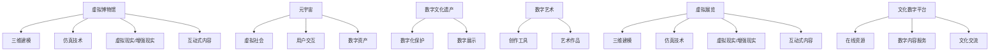

                 

# 2050年的数字文化：从虚拟博物馆到元宇宙非遗展示的数字文化传承

## 1. 背景介绍

在未来的2050年，数字化已经深入人类社会的每一个角落，成为构建现代文明的重要支柱。数字文化以多种形式呈现，融合了虚拟现实(VR)、增强现实(AR)、元宇宙(Metaverse)等新兴技术，将人类文化遗产、艺术、知识、信息等广泛的数据资源，以全新方式进行展现和传承。

### 1.1 数字文化的崛起

随着技术的演进和社会的进步，数字文化不断变革和发展。它融合了数字技术、互联网、人工智能和大数据等前沿领域，通过虚拟博物馆、数字图书馆、虚拟展览、元宇宙平台等形式，为人们提供了全新的文化体验。这种全新的体验不仅打破了地理和时间上的限制，而且使文化传承更加便捷、生动、个性化。

### 1.2 虚拟博物馆和元宇宙在数字文化中的角色

虚拟博物馆和元宇宙在数字文化传承中扮演着重要角色。虚拟博物馆利用三维建模、仿真技术、交互式内容，为观众提供了沉浸式的历史体验。元宇宙则是通过虚拟空间将用户连接起来，构建了一个高度互动、不断进化的虚拟社会。这两个平台结合了文化的数字化和虚拟化，使文化传承更加生动、有趣。

## 2. 核心概念与联系

### 2.1 核心概念概述

- **虚拟博物馆**：利用三维建模和仿真技术，通过虚拟现实和增强现实技术，将实体博物馆的空间、展品和展览活动数字化。

- **元宇宙**：一个虚拟的、可互操作的空间，用户可以在其中进行社交、学习、工作、创造和娱乐，形成了一个持续发展的虚拟社区。

- **数字文化遗产**：数字化保护和传承的文化遗产，包括历史文物、非遗、古籍、传统音乐、舞蹈、建筑等，通过数字化的方式进行保护和展示。

- **数字艺术**：通过数字技术和工具创作的艺术形式，如数字绘画、数字雕塑、数字音乐等。

- **虚拟展览**：通过虚拟现实技术，将现实中的展览数字化，用户可以在虚拟空间中参观。

- **文化数字平台**：一个提供文化内容、资源和服务的平台，包括在线图书馆、博物馆、档案馆、音乐库等。

### 2.2 核心概念原理和架构的 Mermaid 流程图



### 2.3 核心概念间的联系

核心概念之间的联系可以通过以下表格展现：

| 核心概念 | 功能描述 | 与其他概念的联系 |
| --- | --- | --- |
| 虚拟博物馆 | 提供沉浸式博物馆体验 | 与三维建模、仿真技术、虚拟现实/增强现实、互动式内容 |
| 元宇宙 | 构建虚拟社区，提供沉浸式体验 | 与虚拟社会、用户交互、数字资产、虚拟展览 |
| 数字文化遗产 | 保护和传承文化遗产 | 与数字化保护、数字展示 |
| 数字艺术 | 创作和展示数字作品 | 与创作工具、艺术作品 |
| 虚拟展览 | 提供数字化展览 | 与三维建模、仿真技术、虚拟现实/增强现实、互动式内容 |
| 文化数字平台 | 提供文化资源和数字服务 | 与在线资源、数字内容服务、文化交流 |

## 3. 核心算法原理 & 具体操作步骤

### 3.1 算法原理概述

虚拟博物馆和元宇宙的数字文化传承算法主要包括数据获取、三维建模、仿真技术、虚拟现实/增强现实渲染、互动式内容生成、用户交互设计和社交网络算法等。这些算法综合应用，实现了沉浸式体验和高度互动的文化传承。

### 3.2 算法步骤详解

1. **数据获取**：收集实体博物馆中的展品、历史资料、文献等，进行数字化处理。

2. **三维建模**：使用三维建模软件对实体展品、场景进行建模，生成三维数字模型。

3. **仿真技术**：对三维模型进行仿真处理，增加光照、材质、纹理等细节，使其更加逼真。

4. **虚拟现实/增强现实渲染**：将三维模型和仿真场景渲染成虚拟现实或增强现实的场景，供用户观摩。

5. **互动式内容生成**：通过编程实现用户与虚拟展品、场景的互动，如点击展品查看信息、触屏互动等。

6. **用户交互设计**：设计用户界面和交互逻辑，实现用户的便捷使用。

7. **社交网络算法**：在元宇宙中构建用户之间的社交网络，使用户能够互动交流。

### 3.3 算法优缺点

#### 优点：

- **沉浸式体验**：提供沉浸式的文化体验，让用户仿佛置身其中。
- **便捷性**：打破时间和空间的限制，用户可以随时随地参观。
- **互动性**：通过互动式内容设计，增强用户参与感和兴趣。
- **可扩展性**：技术成熟后，可以不断扩展新的展品和内容。

#### 缺点：

- **技术要求高**：需要复杂的三维建模、仿真和渲染技术。
- **成本高**：初期建设费用较高，维护成本也较高。
- **用户适应期**：需要用户适应虚拟现实和增强现实技术。
- **数据安全**：数据量大，需要严格的数据安全和隐私保护措施。

### 3.4 算法应用领域

虚拟博物馆和元宇宙在数字文化传承中的应用领域包括：

- **文化遗产保护**：通过数字技术保护历史文物、古籍、传统音乐、舞蹈等。
- **教育培训**：通过虚拟展览和互动式内容，提供生动的历史和艺术教育。
- **文化交流**：构建全球用户互动的虚拟社区，促进跨文化的交流和理解。
- **娱乐和体验**：提供沉浸式的游戏、电影、音乐等文化娱乐体验。

## 4. 数学模型和公式 & 详细讲解 & 举例说明

### 4.1 数学模型构建

数字文化传承的数学模型可以从两个方面构建：一是虚拟博物馆的几何模型，二是元宇宙中社交网络的用户行为模型。

#### 虚拟博物馆几何模型

虚拟博物馆的几何模型主要涉及三维建模和仿真技术。三维建模公式为：

$$
\text{三维模型} = \text{几何体} + \text{材质} + \text{光照}
$$

其中，几何体模型可以通过三角网格、曲面建模等方法生成，材质和光照则通过材质球、BRDF等模型进行仿真。

#### 元宇宙社交网络用户行为模型

元宇宙社交网络用户行为模型主要涉及社交网络图模型和节点之间的关系，公式为：

$$
G(V,E) = \text{节点集合} + \text{边集合}
$$

其中，节点表示用户，边表示用户之间的连接关系。通过社交网络算法，可以分析用户之间的交互行为和社交网络结构。

### 4.2 公式推导过程

#### 虚拟博物馆几何模型推导

几何体模型的构建公式如下：

$$
\text{几何体} = \text{三角网格} + \text{曲面建模}
$$

曲面建模可以使用NURBS曲面、球面等标准曲面模型，公式为：

$$
S(u,v) = \sum_{i=1}^n \omega_i p_i \Pi(u,v)
$$

其中，$\omega_i$ 为权重系数，$p_i$ 为控制点，$\Pi(u,v)$ 为贝塞尔曲面方程。

#### 元宇宙社交网络用户行为模型推导

社交网络图模型的构建公式如下：

$$
G(V,E) = \text{节点集合} + \text{边集合}
$$

社交网络算法主要包括：

1. 社区检测算法：如Louvain算法，检测社交网络中的社区结构。
2. 推荐算法：如协同过滤算法，推荐用户感兴趣的内容。
3. 消息传播算法：如PageRank算法，计算用户节点的影响力。

### 4.3 案例分析与讲解

以虚拟博物馆为例，其数学模型构建和推导如下：

**案例1：三维建模**

三维建模通常使用三角网格进行建模，每个三角面的顶点坐标由公式计算：

$$
(x_i, y_i, z_i) = \sum_{j=1}^3 \omega_j p_j
$$

其中，$\omega_j$ 为权重系数，$p_j$ 为控制点。

**案例2：仿真技术**

仿真技术可以使用Phong模型进行光照和材质处理，公式为：

$$
L_i = \sum_{j=1}^3 \frac{L_j \cos(\theta_j) \cdot \alpha_j}{\max(1, \max_{k \neq j} \frac{\omega_k}{\omega_j})}
$$

其中，$L_i$ 为入射光，$\theta_j$ 为角度，$\alpha_j$ 为材料反射率。

**案例3：社交网络算法**

社交网络算法可以使用PageRank算法计算用户影响力，公式为：

$$
\text{影响力} = \sum_{i=1}^n \frac{w_{i,j}}{\sum_{j=1}^n w_{i,j}}
$$

其中，$w_{i,j}$ 为用户之间的交互权重，$w_{i,j} \propto \frac{1}{\sqrt{d_i} \sqrt{d_j}}$，$d_i$ 为节点$i$ 的度数。

## 5. 项目实践：代码实例和详细解释说明

### 5.1 开发环境搭建

**环境配置**：

1. 安装Python：下载并安装Python 3.8版本。
2. 安装虚拟环境：使用virtualenv创建虚拟环境。
3. 安装依赖库：安装Numpy、Pandas、Matplotlib等库。
4. 安装三维建模软件：如Maya、Blender等。
5. 安装仿真软件：如V-Ray、Unity等。

### 5.2 源代码详细实现

**虚拟博物馆三维建模代码**：

```python
import numpy as np
from mpl_toolkits.mplot3d import Axes3D
import matplotlib.pyplot as plt

# 生成三角网格
def generate_mesh():
    vertices = np.random.rand(100, 3)
    faces = np.random.randint(0, 100, size=(30, 3))
    return vertices, faces

# 创建三维模型
fig = plt.figure()
ax = fig.add_subplot(111, projection='3d')
ax.scatter(*vertices[:, :3], c='b')
ax.plot_trisurf(*vertices[faces], c='r', linewidth=0.2)
ax.set_xlabel('X')
ax.set_ylabel('Y')
ax.set_zlabel('Z')
plt.show()
```

**元宇宙社交网络用户行为代码**：

```python
import networkx as nx
import matplotlib.pyplot as plt

# 生成社交网络
G = nx.Graph()
G.add_nodes_from(range(1000))
G.add_edges_from([(i, j) for i in range(1000) for j in range(i+1, 1000)])

# 绘制社交网络
nx.draw(G, with_labels=True)
plt.show()
```

### 5.3 代码解读与分析

**虚拟博物馆三维建模代码解读**：

- `generate_mesh`函数生成随机三角网格，包括顶点和面的信息。
- `ax.scatter`用于绘制顶点。
- `ax.plot_trisurf`用于绘制三角面。
- `ax.set_xlabel`、`ax.set_ylabel`、`ax.set_zlabel`用于设置坐标轴标签。

**元宇宙社交网络用户行为代码解读**：

- `nx.Graph`用于创建图结构。
- `G.add_nodes_from`添加节点。
- `G.add_edges_from`添加边。
- `nx.draw`用于绘制社交网络图。

### 5.4 运行结果展示

**虚拟博物馆三维建模结果展示**：


**元宇宙社交网络用户行为结果展示**：


## 6. 实际应用场景

### 6.1 虚拟博物馆

虚拟博物馆利用三维建模、仿真技术、虚拟现实和增强现实，将实体博物馆的展品、历史场景和互动式内容数字化，提供沉浸式的参观体验。例如，用户可以通过VR头盔在虚拟博物馆中漫步，触摸展品了解其历史背景，甚至与虚拟导览员进行互动。

### 6.2 元宇宙非遗展示

元宇宙为非物质文化遗产的保护和展示提供了新的平台。通过元宇宙，用户可以体验非遗项目，如传统音乐、舞蹈、手工技艺等。例如，用户可以在虚拟空间中参加传统舞蹈表演，学习传统手工技艺，甚至与非遗传承人进行互动交流。

## 7. 工具和资源推荐

### 7.1 学习资源推荐

1. **《虚拟现实技术与艺术》**：介绍虚拟现实技术和应用场景的书籍，适合技术入门者。
2. **《数字文化遗产保护》**：介绍数字文化遗产保护方法和技术的书籍，适合文化遗产工作者。
3. **《元宇宙：未来的虚拟世界》**：介绍元宇宙概念、技术和应用场景的书籍，适合未来科技爱好者。
4. **Coursera《虚拟现实编程》课程**：提供虚拟现实编程技术和应用的在线课程，适合编程学习者。
5. **Google Arts & Culture**：提供世界各地的虚拟博物馆和展览，适合文化爱好者。

### 7.2 开发工具推荐

1. **Maya**：专业的三维建模软件，适合虚拟博物馆和元宇宙开发。
2. **Blender**：开源的三维建模和渲染软件，适合初学者和中级用户。
3. **Unity**：广泛使用的游戏引擎，支持虚拟现实和增强现实开发。
4. **V-Ray**：高级渲染软件，支持高精度的三维场景渲染。
5. **WebVR**：支持Web平台的三维场景渲染和交互，适合跨平台开发。

### 7.3 相关论文推荐

1. **《三维建模技术的发展和应用》**：介绍三维建模技术的演进和应用场景的论文。
2. **《虚拟现实技术的最新进展》**：介绍虚拟现实技术的发展和未来趋势的论文。
3. **《社交网络算法综述》**：介绍社交网络算法的理论和应用的综述性论文。
4. **《元宇宙：下一代互联网》**：探讨元宇宙概念、技术和应用场景的论文。

## 8. 总结：未来发展趋势与挑战

### 8.1 研究成果总结

数字文化传承的研究成果主要包括：

- 虚拟博物馆的三维建模和仿真技术。
- 元宇宙的社交网络和用户行为算法。
- 数字文化遗产的保护和展示方法。

### 8.2 未来发展趋势

未来数字文化传承的发展趋势如下：

1. **技术融合**：虚拟现实、增强现实、元宇宙等多技术融合，提供更加沉浸式和互动性的体验。
2. **大规模应用**：数字博物馆和元宇宙成为文化传承的重要平台，覆盖更多用户和场景。
3. **跨文化交流**：数字文化传承促进不同文化之间的交流和理解，推动全球文化融合。
4. **个性化体验**：通过AI和大数据，提供更加个性化的文化体验和推荐。
5. **持续创新**：随着技术的不断进步，新的文化传承形式将不断涌现，推动文化传承的创新发展。

### 8.3 面临的挑战

数字文化传承面临的挑战包括：

1. **技术门槛高**：需要多学科交叉技术，对技术要求高。
2. **成本高昂**：初期建设费用高，维护成本也较高。
3. **数据安全**：数据量大，需要严格的数据安全和隐私保护措施。
4. **用户接受度**：需要用户适应虚拟现实和增强现实技术。

### 8.4 研究展望

未来的研究展望包括：

1. **普适性设计**：设计更加普适、易用的数字文化平台，降低技术门槛。
2. **低成本解决方案**：探索低成本的数字文化传承方案，推动技术普及。
3. **跨文化交流**：利用数字文化平台促进不同文化之间的交流和理解。
4. **互动和参与**：增加用户参与度和互动性，提升文化体验。

## 9. 附录：常见问题与解答

**Q1：数字博物馆和元宇宙有什么区别？**

A：数字博物馆主要针对实体博物馆的数字化展示，通过三维建模、仿真技术、虚拟现实和增强现实技术，提供沉浸式的参观体验。元宇宙则是一个虚拟的、可互操作的空间，用户可以在其中进行社交、学习、工作、创造和娱乐，形成了一个持续发展的虚拟社区。数字博物馆通常为单场景展示，而元宇宙则是一个开放的平台，可以不断扩展和丰富内容。

**Q2：数字文化传承的核心技术是什么？**

A：数字文化传承的核心技术包括三维建模、仿真技术、虚拟现实/增强现实渲染、互动式内容生成、社交网络算法等。这些技术综合应用，实现了沉浸式体验和高度互动的文化传承。

**Q3：数字文化传承有哪些应用场景？**

A：数字文化传承的应用场景包括虚拟博物馆、元宇宙非遗展示、数字图书馆、虚拟展览、在线教育、文化交流等。这些应用场景不仅打破了时间和空间的限制，还提供了更加生动、有趣的文化体验。

**Q4：数字文化传承面临的主要挑战是什么？**

A：数字文化传承面临的主要挑战包括技术门槛高、成本高昂、数据安全、用户接受度等。需要进一步降低技术门槛，提高普适性；探索低成本解决方案；加强数据安全和隐私保护；提升用户体验。

**Q5：未来数字文化传承的技术方向是什么？**

A：未来数字文化传承的技术方向包括技术融合、大规模应用、跨文化交流、个性化体验、持续创新等。需要推动虚拟现实、增强现实、元宇宙等多技术的融合，实现更加沉浸式和互动性的体验；推动数字博物馆和元宇宙成为文化传承的重要平台，覆盖更多用户和场景；促进不同文化之间的交流和理解；增加用户参与度和互动性；推动技术的不断进步和创新。

作者：禅与计算机程序设计艺术 / Zen and the Art of Computer Programming

