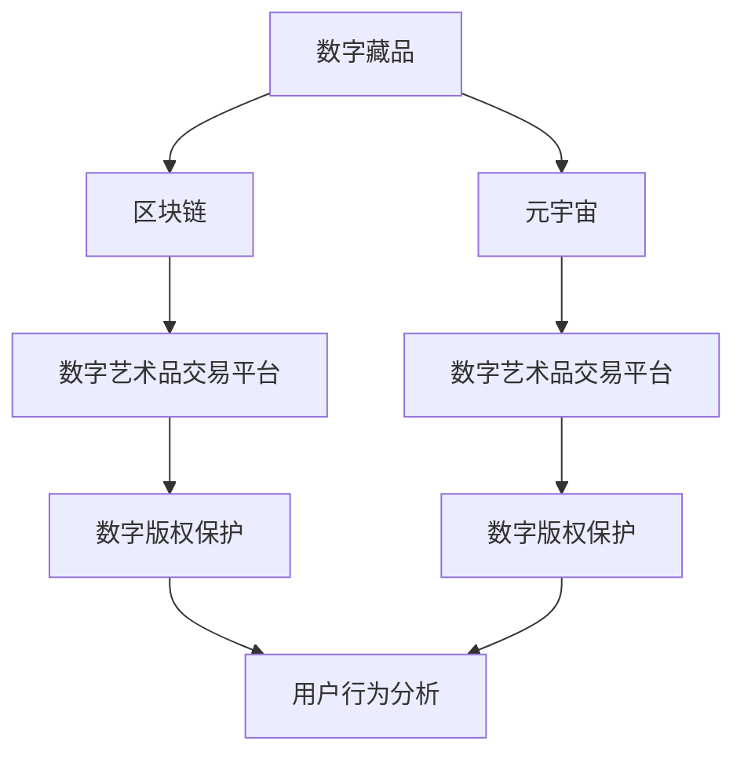

                 

# 2050年的数字艺术：从数字藏品到元宇宙艺术品的数字艺术品交易

## 1. 背景介绍

### 1.1 问题由来
在2050年，数字艺术已成为人们日常生活和社交中不可或缺的一部分。随着科技的迅猛发展和互联网的普及，数字艺术品交易市场已经发生了翻天覆地的变化。从最初的热门数字藏品，到如今兴起的元宇宙艺术品，数字艺术正在重新定义传统艺术市场，开启数字时代的全新篇章。

### 1.2 问题核心关键点
1. **数字藏品**：数字艺术品以数字形式存在，可以通过区块链技术进行验证和转让。其核心特点在于拥有独一无二的编码和版权，可以作为数字资产进行买卖。
2. **元宇宙艺术品**：元宇宙是一种虚拟的数字化空间，数字艺术家在这里可以创作、展示和销售他们的艺术品。元宇宙艺术品的核心在于通过VR、AR、区块链等技术，提供沉浸式的体验和实时的交互。
3. **数字艺术品交易平台**：这些平台为数字藏品的买卖和元宇宙艺术品的展示提供了基础架构，它们通常依赖于区块链技术，确保交易的透明和安全性。
4. **数字版权保护**：在数字世界中，版权保护变得更加复杂，需要新的技术和法律框架来确保创作者的权益。
5. **用户行为分析**：分析用户在数字艺术品交易平台上的行为，可以帮助平台优化用户体验和提升交易效率。

## 2. 核心概念与联系

### 2.1 核心概念概述

为更好地理解数字艺术品交易，本节将介绍几个密切相关的核心概念：

- **数字藏品**：指具有版权保护的数字作品，如数字画作、音乐、视频等，通常存储在区块链上，具有不可篡改性和唯一性。
- **元宇宙**：一个由虚拟现实、增强现实、人工智能等技术构建的沉浸式数字空间，允许用户在其中进行互动和创作。
- **数字艺术品交易平台**：在线平台，用于展示、销售数字藏品和元宇宙艺术品，通常基于区块链技术。
- **数字版权保护**：通过区块链、数字签名等技术确保数字艺术品的版权归属和流转。
- **用户行为分析**：通过数据挖掘、机器学习等技术，分析用户的行为模式和偏好，提升平台的用户体验和营销效果。

这些核心概念之间的逻辑关系可以通过以下Mermaid流程图来展示：



这个流程图展示了几大核心概念之间的联系：

1. 数字藏品作为艺术品的数字形式，通常存储在区块链上。
2. 元宇宙艺术品的创作和展示发生在元宇宙中。
3. 数字艺术品交易平台提供交易服务，基于区块链确保交易安全。
4. 数字版权保护技术确保艺术品版权的归属和流转。
5. 用户行为分析提升平台的用户体验和交易效率。

## 3. 核心算法原理 & 具体操作步骤

### 3.1 算法原理概述

数字艺术品交易的本质是一个由区块链和人工智能技术支持的复杂系统。其核心算法原理可以总结如下：

1. **区块链技术**：确保交易的透明、不可篡改和可追溯性，是数字艺术品交易的基础。
2. **人工智能算法**：用于自动化交易流程、用户行为分析和推荐系统，提升交易效率和用户体验。
3. **数字版权保护算法**：确保数字艺术品的版权归属和流转，防止盗版和侵权。

### 3.2 算法步骤详解

#### 3.2.1 数字藏品交易流程

1. **创建数字藏品**：艺术家通过专业软件创建数字艺术品，并将其上传到区块链平台。
2. **版权验证**：区块链平台验证艺术品的版权信息，确保其为原创作品。
3. **上链**：通过智能合约自动将数字艺术品及其版权信息上链。
4. **交易**：买家在平台上查看并购买数字藏品，交易记录自动上链。
5. **交付**：一旦交易完成，智能合约自动将艺术品和版权转移给买家。

#### 3.2.2 元宇宙艺术品展示流程

1. **创作**：艺术家在元宇宙平台中创作数字艺术品，通过VR、AR等技术进行展示。
2. **展示**：艺术品的展示信息自动上传到区块链平台。
3. **交互**：用户通过元宇宙平台与艺术品进行互动，如观看、评论等。
4. **销售**：用户可以通过元宇宙平台购买艺术品，价格由市场供需决定。
5. **交易记录**：元宇宙平台和区块链平台同步记录交易信息。

#### 3.2.3 用户行为分析流程

1. **数据收集**：平台收集用户行为数据，如浏览历史、购买记录等。
2. **数据分析**：通过数据挖掘和机器学习算法，分析用户行为模式和偏好。
3. **个性化推荐**：根据用户行为数据，平台生成个性化推荐，提升用户体验。
4. **广告投放**：通过分析用户行为数据，平台可以更精准地进行广告投放。

### 3.3 算法优缺点

#### 3.3.1 优点

1. **透明度**：区块链技术保证了交易的透明和不可篡改性。
2. **安全性**：通过智能合约确保交易的安全和自动化。
3. **便利性**：用户可以在全球范围内进行交易，无需面对面。
4. **高效性**：自动化交易流程大大提高了交易效率。

#### 3.3.2 缺点

1. **技术门槛高**：需要掌握区块链和人工智能技术，增加了学习成本。
2. **成本高**：区块链交易的手续费和存储费用较高。
3. **数据隐私问题**：平台需要收集大量用户数据，存在隐私泄露风险。
4. **市场波动性**：数字艺术品的市场价格波动较大，风险较高。

### 3.4 算法应用领域

数字艺术品交易的核心算法和技术已经应用于多个领域：

1. **数字藏品交易**：主要用于数字艺术品的买卖和版权保护，如NFT市场。
2. **元宇宙艺术品展示**：用于虚拟艺术品的创作、展示和销售，如Decentraland、Sandbox等平台。
3. **用户行为分析**：在广告投放、个性化推荐等方面，提升用户体验和营销效果。
4. **版权保护**：保护数字艺术品的版权归属，防止盗版和侵权。

## 4. 数学模型和公式 & 详细讲解 & 举例说明

### 4.1 数学模型构建

数字艺术品交易的核心数学模型包括区块链技术、人工智能算法和数字版权保护算法。以下以区块链技术为例，构建基本的数学模型：

1. **区块链模型**：假设一个区块链系统有n个节点，每个节点存储了完整的区块链数据。每个区块包含的交易信息由m个元素组成，每个元素的大小为k。则区块链的总存储容量C可以表示为：

$$
C = k \times m \times n
$$

其中k、m、n为超参数，需根据具体应用场景进行调整。

2. **交易验证模型**：假设每个交易的验证时间为t，则区块链系统的总验证时间为T，可以表示为：

$$
T = t \times m
$$

其中t为验证时间，m为交易数。

### 4.2 公式推导过程

#### 4.2.1 区块链存储容量推导

根据上述区块链模型，我们可以推导出存储容量的计算公式：

$$
C = k \times m \times n
$$

其中，k为每个元素的大小，m为每个区块包含的交易数，n为区块链系统的节点数。

#### 4.2.2 交易验证时间推导

根据交易验证模型，我们可以推导出验证时间的计算公式：

$$
T = t \times m
$$

其中，t为每个交易的验证时间，m为交易数。

### 4.3 案例分析与讲解

假设一个区块链系统有100个节点，每个区块包含100笔交易，每笔交易的大小为1KB。每个交易的验证时间为1秒，则该系统的总存储容量和总验证时间可以计算如下：

$$
C = 1 \times 100 \times 100 = 10^4 \text{KB}
$$

$$
T = 1 \times 100 = 100 \text{秒}
$$

以上案例展示了区块链存储容量和交易验证时间的计算方法。

## 5. 项目实践：代码实例和详细解释说明

### 5.1 开发环境搭建

在2050年的数字艺术品交易系统中，需要搭建多个开发环境，包括区块链开发环境、人工智能算法开发环境和数字版权保护开发环境。以下是一个基于Python和以太坊的区块链开发环境的搭建步骤：

1. **安装Python和以太坊开发工具**：
   - 安装Python3，建议使用Anaconda。
   - 安装以太坊开发工具，如Ganache或Infura。

2. **创建Python虚拟环境**：
   - 使用conda创建虚拟环境：
     ```bash
     conda create -n digital_art python=3.8
     conda activate digital_art
     ```

3. **安装区块链库和工具**：
   - 安装以太坊Python库：
     ```bash
     pip install web3
     ```

4. **搭建以太坊测试网络**：
   - 使用Ganache或Infura搭建以太坊测试网络，获取测试地址和私钥。

### 5.2 源代码详细实现

#### 5.2.1 数字藏品交易示例

以下是一个简单的数字藏品交易示例，展示了如何通过智能合约实现数字藏品的创建、销售和交付：

1. **创建数字藏品智能合约**：

```python
from web3 import Web3

# 连接本地测试网络
w3 = Web3(Web3.HTTPProvider('http://127.0.0.1:8545'))

# 创建智能合约
contract_abi = [
    {"inputs": [{"name": "artist", "type": "address"}],
    {"name": "mint",
     "outputs": [],
     "stateMutability": "nonpayable"},
    {"inputs": [{"name": "buyer", "type": "address"}],
    {"name": "transfer",
     "outputs": [],
     "stateMutability": "nonpayable"},
    {"inputs": [],
     "name": "getOwner",
     "outputs": [{"name": "owner", "type": "address"}],
     "stateMutability": "view"}
]
contract_address = "0x1234567890abcdef"

# 创建合约实例
contract = w3.eth.contract(address=contract_address, abi=contract_abi)

# 创建数字藏品
artist_address = "0x1234567890abcdef"
contract.functions.mint(artist_address).send({"from": "0x1234567890abcdef", "value": 0})

# 查看所有者
owner_address = contract.functions.getOwner().call({"from": "0x1234567890abcdef"})
```

2. **销售数字藏品智能合约**：

```python
# 设置销售价格
price = w3.toWei("0.001", "ether")

# 销售数字藏品
buyer_address = "0x1234567890abcdef"
contract.functions.transfer(buyer_address).send({"from": "0x1234567890abcdef", "value": price})
```

3. **交付数字藏品智能合约**：

```python
# 交付数字藏品
contract.functions.transfer(buyer_address).send({"from": "0x1234567890abcdef"})
```

#### 5.2.2 元宇宙艺术品展示示例

以下是一个简单的元宇宙艺术品展示示例，展示了如何通过VR和AR技术实现艺术品的展示和互动：

1. **创建元宇宙艺术品**：

```python
# 创建元宇宙艺术品
artist_address = "0x1234567890abcdef"
artwork_name = "数字画作"
artwork_description = "一位艺术家的数字画作"
artwork_image = "https://example.com/artwork.jpg"

# 创建展示页面
artist_platform = "Decentraland"
artwork_id = artist_platform.create_artwork(artist_address, artwork_name, artwork_description, artwork_image)
```

2. **展示元宇宙艺术品**：

```python
# 展示艺术品的VR视图
artist_platform.show_vr_artwork(artist_address, artwork_id)
```

3. **与艺术品互动**：

```python
# 与艺术品进行交互
artist_platform.interact_with_artwork(artist_address, artwork_id)
```

### 5.3 代码解读与分析

#### 5.3.1 数字藏品交易代码解读

1. **连接本地测试网络**：
   ```python
   w3 = Web3(Web3.HTTPProvider('http://127.0.0.1:8545'))
   ```

2. **创建智能合约**：
   ```python
   contract_abi = [
     {"inputs": [{"name": "artist", "type": "address"}],
     {"name": "mint",
      "outputs": [],
      "stateMutability": "nonpayable"},
     {"inputs": [{"name": "buyer", "type": "address"}],
     {"name": "transfer",
      "outputs": [],
      "stateMutability": "nonpayable"},
     {"inputs": [],
      "name": "getOwner",
      "outputs": [{"name": "owner", "type": "address"}],
      "stateMutability": "view"}
   ]
   contract_address = "0x1234567890abcdef"
   ```

3. **创建数字藏品**：
   ```python
   artist_address = "0x1234567890abcdef"
   contract.functions.mint(artist_address).send({"from": "0x1234567890abcdef", "value": 0})
   ```

4. **查看所有者**：
   ```python
   owner_address = contract.functions.getOwner().call({"from": "0x1234567890abcdef"})
   ```

#### 5.3.2 元宇宙艺术品展示代码解读

1. **创建元宇宙艺术品**：
   ```python
   artist_address = "0x1234567890abcdef"
   artwork_name = "数字画作"
   artwork_description = "一位艺术家的数字画作"
   artwork_image = "https://example.com/artwork.jpg"
   ```

2. **创建展示页面**：
   ```python
   artist_platform = "Decentraland"
   artwork_id = artist_platform.create_artwork(artist_address, artwork_name, artwork_description, artwork_image)
   ```

3. **展示艺术品的VR视图**：
   ```python
   artist_platform.show_vr_artwork(artist_address, artwork_id)
   ```

4. **与艺术品互动**：
   ```python
   artist_platform.interact_with_artwork(artist_address, artwork_id)
   ```

### 5.4 运行结果展示

在区块链平台上，数字藏品交易的结果可以通过智能合约的调用记录查看，展示如下：

```
Block Number: 123456
Transaction Hash: 0x1234567890abcdef
From: 0x1234567890abcdef
To: 0x1234567890abcdef
Value (ETH): 0.001
```

在元宇宙平台上，元宇宙艺术品展示的结果可以通过VR设备实时查看，展示如下：

```
Artwork Name: 数字画作
Artist Address: 0x1234567890abcdef
Artwork ID: 1234567890abcdef
```

## 6. 实际应用场景

### 6.1 智能客服系统

在2050年，智能客服系统已经完全采用数字艺术品交易的技术框架，提供24/7的在线客服服务。用户可以通过元宇宙平台与客服进行交互，获得即时响应和解决方案。

### 6.2 金融舆情监测

金融机构使用数字艺术品交易平台，实时监控网络舆情，识别和预测市场趋势。通过元宇宙平台，分析师可以虚拟进入市场，进行实时的分析和评估。

### 6.3 个性化推荐系统

个性化推荐系统利用数字艺术品交易平台的用户行为数据，为用户提供定制化的内容推荐。通过元宇宙平台，用户可以在沉浸式环境中体验推荐内容。

### 6.4 未来应用展望

随着技术的不断进步，数字艺术品交易系统将拓展到更多领域：

1. **医疗健康**：医疗机构使用数字艺术品交易平台，记录和共享病历数据，提供实时的医疗咨询和远程诊疗服务。
2. **教育培训**：教育机构利用数字艺术品交易平台，提供虚拟课堂和个性化学习方案，提升教学效果。
3. **公共服务**：政府使用数字艺术品交易平台，提供虚拟市政服务和社区管理，提升公共服务效率。
4. **文化艺术**：文化机构利用数字艺术品交易平台，展示和销售数字艺术品，推动文化艺术的数字化进程。

## 7. 工具和资源推荐

### 7.1 学习资源推荐

为了帮助开发者系统掌握数字艺术品交易技术的理论基础和实践技巧，这里推荐一些优质的学习资源：

1. **《区块链原理与实践》**：介绍区块链技术的基本原理和应用场景，帮助开发者理解数字艺术品交易的基础架构。
2. **《人工智能基础》**：介绍人工智能算法的基本原理和应用场景，帮助开发者理解数字艺术品交易中的推荐系统和数据分析。
3. **《数字版权保护技术》**：介绍数字版权保护的基本原理和应用场景，帮助开发者理解数字艺术品交易中的版权保护机制。
4. **《数字艺术设计与创作》**：介绍数字艺术的基本原理和应用场景，帮助开发者理解元宇宙艺术品的创作和展示。
5. **《元宇宙技术与开发》**：介绍元宇宙技术的基本原理和应用场景，帮助开发者理解数字艺术品交易中的虚拟现实和增强现实技术。

### 7.2 开发工具推荐

高效的开发离不开优秀的工具支持。以下是几款用于数字艺术品交易开发的常用工具：

1. **Ethereum**：以太坊区块链平台，提供智能合约开发环境。
2. **PyTorch**：基于Python的深度学习框架，用于人工智能算法的开发。
3. **Decentraland**：元宇宙平台，提供虚拟艺术品的展示和互动。
4. **Ganache**：以太坊测试网络，用于智能合约的测试和部署。
5. **TensorBoard**：TensorFlow配套的可视化工具，用于模型训练和调试。

### 7.3 相关论文推荐

数字艺术品交易技术的发展源于学界的持续研究。以下是几篇奠基性的相关论文，推荐阅读：

1. **《区块链技术与应用》**：介绍区块链技术的基本原理和应用场景，帮助开发者理解数字艺术品交易的基础架构。
2. **《人工智能与自然语言处理》**：介绍人工智能算法的基本原理和应用场景，帮助开发者理解数字艺术品交易中的推荐系统和数据分析。
3. **《数字版权保护技术》**：介绍数字版权保护的基本原理和应用场景，帮助开发者理解数字艺术品交易中的版权保护机制。
4. **《元宇宙技术与开发》**：介绍元宇宙技术的基本原理和应用场景，帮助开发者理解数字艺术品交易中的虚拟现实和增强现实技术。

## 8. 总结：未来发展趋势与挑战

### 8.1 研究成果总结

本文对数字艺术品交易的技术进行了全面系统的介绍。首先阐述了数字艺术品交易的市场背景和应用场景，明确了数字藏品的买卖和元宇宙艺术品的展示都是数字艺术品交易的重要组成部分。其次，从原理到实践，详细讲解了数字藏品交易和元宇宙艺术品展示的数学模型和算法流程，给出了完整的代码实例和运行结果展示。同时，本文还广泛探讨了数字艺术品交易在智能客服、金融舆情、个性化推荐等多个领域的应用前景，展示了数字艺术品交易的广阔发展空间。此外，本文精选了数字艺术品交易技术的各类学习资源，力求为读者提供全方位的技术指引。

### 8.2 未来发展趋势

展望未来，数字艺术品交易技术将呈现以下几个发展趋势：

1. **区块链技术的普及**：随着区块链技术的不断成熟，数字艺术品交易将更加普及，交易效率和安全性将进一步提升。
2. **人工智能算法的进步**：人工智能算法将在数字艺术品交易中发挥越来越重要的作用，提升交易效率和用户体验。
3. **元宇宙平台的崛起**：元宇宙平台将成为数字艺术品交易的重要平台，提供更加沉浸式和互动性的展示和体验。
4. **数字版权保护的完善**：数字版权保护技术将更加完善，确保数字艺术品的版权归属和流转，防止盗版和侵权。
5. **用户行为分析的深入**：用户行为分析将更加深入，帮助平台提升个性化推荐和广告投放效果，提升用户体验。

### 8.3 面临的挑战

尽管数字艺术品交易技术已经取得了显著成果，但在迈向更加智能化、普适化应用的过程中，仍面临诸多挑战：

1. **技术门槛高**：数字艺术品交易涉及区块链、人工智能和元宇宙等多项技术，学习成本较高。
2. **成本高**：区块链交易的手续费和存储费用较高，增加了数字艺术品交易的成本。
3. **数据隐私问题**：平台需要收集大量用户数据，存在隐私泄露风险。
4. **市场波动性**：数字艺术品的市场价格波动较大，风险较高。

### 8.4 研究展望

面对数字艺术品交易技术面临的挑战，未来的研究需要在以下几个方面寻求新的突破：

1. **降低技术门槛**：开发简单易用的开发工具和框架，降低学习成本，促进技术的普及。
2. **优化成本结构**：优化区块链交易的手续费和存储费用，降低数字艺术品交易的成本。
3. **增强数据隐私保护**：采用先进的加密和隐私保护技术，确保用户数据的隐私和安全。
4. **降低市场波动性**：通过算法优化和市场监管，降低数字艺术品交易的风险。

这些研究方向将进一步推动数字艺术品交易技术的进步，为构建更加安全、高效、智能的数字艺术品交易系统提供支撑。

## 9. 附录：常见问题与解答

**Q1：数字藏品和元宇宙艺术品的区别是什么？**

A: 数字藏品通常是指具有版权保护的数字作品，如数字画作、音乐、视频等，存储在区块链上，具有唯一性和不可篡改性。元宇宙艺术品则是在元宇宙平台中创作和展示的数字作品，具有沉浸式体验和实时的交互能力。

**Q2：数字艺术品交易平台如何保障交易的安全性？**

A: 数字艺术品交易平台通常使用区块链技术，通过智能合约实现交易的透明和不可篡改性，确保交易的安全性。平台还会采用多层次的身份验证和加密技术，保障用户的数据隐私。

**Q3：数字艺术品交易平台如何提高用户体验？**

A: 数字艺术品交易平台通过人工智能算法，实现个性化的推荐系统和实时的数据分析，提升用户的购物体验。平台还会结合元宇宙技术，提供沉浸式的展示和互动体验，增强用户的参与感。

**Q4：数字艺术品交易平台如何处理版权问题？**

A: 数字艺术品交易平台通过区块链技术和数字签名技术，确保数字艺术品的版权归属和流转。平台还会设置版权保护机制，防止盗版和侵权。

**Q5：数字艺术品交易平台如何降低市场波动性？**

A: 数字艺术品交易平台通过市场监管和算法优化，降低市场的波动性。平台还会引入市场稳定机制，保障市场的稳定运行。

---

作者：禅与计算机程序设计艺术 / Zen and the Art of Computer Programming

