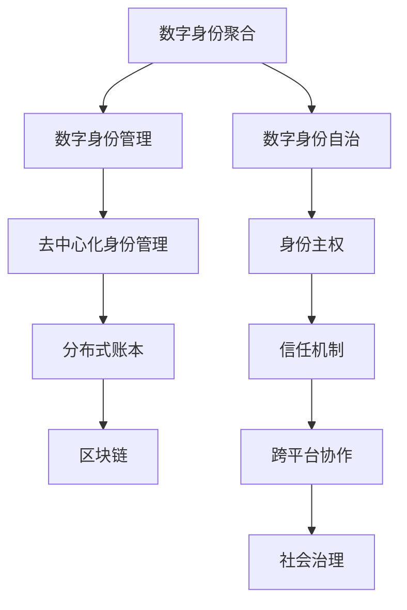

                 

# 2050年的数字身份：从数字身份聚合到数字身份自主的身份主权实现

## 1. 背景介绍

### 1.1 数字身份的演变

在过去的几十年中，数字身份的发展经历了从数字身份聚合到数字身份自主的两个阶段。初期，数字身份主要围绕中心化的身份认证系统展开，用户通过各种服务提供商（如银行、社交网络、电商平台等）获取并管理其数字身份信息。这一阶段，身份信息被聚合在不同的服务提供商之间，用户往往需要创建多个账户才能完成各种在线活动。然而，这种身份聚合方式存在诸多问题，如身份信息重复、隐私泄露、数据孤岛等。

随着区块链、分布式账本等技术的兴起，数字身份逐渐走向自治化。在这一阶段，用户开始掌握自己身份信息的主权，能够在去中心化的身份管理平台上，自主创建、管理、分享其数字身份信息。这一转变不仅提升了身份管理的灵活性，也增强了数据隐私和安全保护。

进入2050年，数字身份技术将进一步成熟，成为支撑未来社会数字化转型的基础设施。用户将能够更加自由地管理其数字身份，从数字身份聚合走向数字身份自治，实现身份主权。

### 1.2 数字身份的重要性

在数字化时代，数字身份不仅是用户在虚拟世界中的虚拟身份，更是其在现实世界中的身份延伸。数字身份的自治化，将赋予用户更高的自主权，使其能够在互联网世界中自由表达、交流、合作，甚至参与到更广泛的社会治理中。

具体而言，数字身份的重要性体现在以下几个方面：

- **身份验证与认证**：通过数字身份，用户能够在网上快速完成身份验证，免去了繁琐的密码、证件等认证流程。
- **跨平台管理**：数字身份自治化后，用户能够在不同的应用和服务之间自由切换，无需重复创建和管理多个账户。
- **数据隐私与安全**：数字身份主权赋予用户对其身份信息的完全控制权，用户能够自主决定如何共享、使用其身份数据，提升数据隐私和安全。
- **信任与协作**：数字身份自治化有助于建立信任机制，使不同身份之间的交互更加高效、透明，促进社会协作和信任构建。
- **决策支持**：数字身份能够提供全面的个人信息、行为记录、信誉评级等，为政府、企业等机构在决策时提供参考依据。

## 2. 核心概念与联系

### 2.1 核心概念概述

为更好地理解未来2050年数字身份的发展趋势，本节将介绍几个密切相关的核心概念：

- **数字身份 (Digital Identity)**：用户在虚拟和现实世界中的唯一身份标识，包括姓名、地址、出生日期、证件信息等。
- **身份主权 (Identity Sovereignty)**：用户对其身份信息的完全控制权，包括创建、管理、使用和共享其身份数据的能力。
- **数字身份聚合 (Digital Identity Aggregation)**：用户身份信息被不同的服务提供商所聚合，用户在不同平台间需要创建和管理多个账户。
- **数字身份自治 (Digital Identity Autonomy)**：用户能够自主创建和管理其数字身份信息，能够在不同的平台间自由切换，无需重复创建和管理多个账户。
- **去中心化身份管理 (Decentralized Identity Management, DIdM)**：利用区块链、分布式账本等技术，实现去中心化的身份管理，提升身份管理的灵活性和数据隐私保护。

这些核心概念之间的逻辑关系可以通过以下Mermaid流程图来展示：



这个流程图展示了大身份管理的发展脉络：

1. 用户的身份信息被不同的服务提供商所聚合。
2. 用户开始掌握对其身份信息的完全控制权，实现数字身份自治。
3. 用户能够自主创建和管理其数字身份信息。
4. 利用分布式账本、区块链等技术，实现去中心化的身份管理。
5. 身份管理技术构建信任机制，促进跨平台协作。
6. 信任机制和社会协作支撑未来社会治理。

这些概念共同构成了未来数字身份的发展框架，引导着数字身份技术的演进方向。

## 3. 核心算法原理 & 具体操作步骤

### 3.1 算法原理概述

数字身份自治的核心在于通过去中心化的身份管理技术，实现用户对其身份信息的自主控制。这主要依赖于区块链、分布式账本等技术，通过加密、数字签名等手段，保护用户的身份数据安全，并赋予其完全的控制权。

从算法原理上讲，数字身份自治主要包括以下几个关键步骤：

1. **身份创建与注册**：用户创建数字身份，并通过身份管理平台进行注册，生成唯一的身份标识。
2. **身份验证与认证**：用户通过身份管理平台验证其身份信息，确保身份的真实性。
3. **身份数据共享**：用户能够在身份管理平台上，自主决定其身份数据的共享方式和范围，确保数据隐私。
4. **跨平台身份互通**：利用标准化的身份验证协议（如WebID），实现不同平台间的身份互通。
5. **去中心化信任机制**：通过区块链等技术构建去中心化的信任网络，保障身份验证和数据共享的安全性。

### 3.2 算法步骤详解

以下以WebID身份验证协议为例，详细讲解数字身份自治的算法步骤。

**Step 1: 身份创建与注册**

用户通过身份管理平台创建数字身份，生成公钥和私钥对，并生成数字证书。数字证书中包含了用户的身份信息和公钥，可作为其在虚拟世界中的身份标识。

**Step 2: 身份验证与认证**

用户在使用服务时，需要向服务提供商提供其数字证书，并证明证书的真实性。服务提供商通过公钥验证证书的数字签名，确保其未被篡改。

**Step 3: 身份数据共享**

用户能够在身份管理平台上，自主决定其身份数据的共享方式和范围，如选择性地与某些服务提供商共享其身份信息，确保数据隐私。

**Step 4: 跨平台身份互通**

利用标准化的身份验证协议（如WebID），用户可以在不同的服务提供商之间自由切换，无需重复创建和管理多个账户。

**Step 5: 去中心化信任机制**

通过区块链等技术构建去中心化的信任网络，确保身份验证和数据共享的安全性。用户之间的身份验证过程基于加密和数字签名，无需中心化的信任机构。

### 3.3 算法优缺点

数字身份自治的算法具有以下优点：

1. **用户自主权增强**：用户能够完全控制其身份数据，增强了数据隐私和安全。
2. **身份管理灵活性**：用户能够在不同的服务提供商之间自由切换，无需重复创建和管理多个账户。
3. **信任机制建立**：利用区块链等技术构建去中心化的信任网络，保障身份验证和数据共享的安全性。

然而，该算法也存在一些局限性：

1. **技术门槛较高**：数字身份自治依赖于先进的区块链和分布式账本技术，用户和企业需要具备相应的技术理解和操作能力。
2. **标准化问题**：不同平台之间的身份验证协议和标准需要统一，以实现跨平台身份互通。
3. **隐私和安全风险**：数字身份自治虽然增强了数据隐私，但同时也可能面临技术漏洞和恶意攻击的风险。

### 3.4 算法应用领域

数字身份自治技术主要应用于以下几个领域：

1. **在线身份验证**：用户通过数字证书验证其身份，提升在线身份验证的安全性和效率。
2. **跨平台身份管理**：用户能够在不同的服务提供商之间自由切换，无需重复创建和管理多个账户。
3. **金融服务**：数字身份自治能够提升金融服务的透明度和安全性，确保交易的安全可靠。
4. **医疗健康**：用户能够在医疗健康服务中，自主控制其健康数据的使用和共享，提升数据隐私保护。
5. **社交网络**：用户能够自主决定其社交数据的共享方式和范围，增强数据隐私和安全。
6. **公共服务**：数字身份自治能够提升公共服务的便利性和效率，实现跨部门、跨机构的信息共享。

## 4. 数学模型和公式 & 详细讲解  
### 4.1 数学模型构建

本节将使用数学语言对数字身份自治的算法步骤进行更加严格的刻画。

假设用户的数字证书为 $C$，包含其身份信息和公钥 $P$。服务提供商通过公钥验证证书的数字签名 $S$，以确认证书的真实性。用户能够在身份管理平台上，自主决定其身份数据 $D$ 的共享方式和范围。

**数字证书生成过程**：

$$
C = \text{Hash}(I, P)
$$

其中 $I$ 为用户的身份信息，$\text{Hash}$ 为哈希函数，$P$ 为用户公钥。

**数字证书验证过程**：

$$
\text{Verify}(C, S) = \begin{cases}
1, & \text{如果} S = \text{Sign}(\text{Hash}(I, P), P) \\
0, & \text{否则}
\end{cases}
$$

其中 $\text{Sign}$ 为签名算法，$S$ 为用户数字证书的签名。

**身份数据共享过程**：

$$
\text{Share}(D) = \{(D_i, perm_i)\}_{i=1}^n
$$

其中 $D_i$ 为用户身份数据的子集，$perm_i$ 为数据共享的权限，用户可以自主决定其身份数据的共享方式和范围。

**跨平台身份验证协议**：

$$
\text{WebID} = \text{Hash}(C, \text{Time})
$$

其中 $\text{Time}$ 为当前时间戳，确保身份验证的时效性。

### 4.2 公式推导过程

以下是数字证书生成、验证和身份数据共享过程的详细推导：

**数字证书生成过程**：

1. 用户生成公钥和私钥对 $P$ 和 $S$，其中 $P$ 用于加密和验证数据，$S$ 用于数字签名。
2. 用户生成数字证书 $C$，包含其身份信息 $I$ 和公钥 $P$，并通过哈希函数 $\text{Hash}$ 进行加密。
3. 用户使用私钥 $S$ 对数字证书进行数字签名，生成数字签名 $S$。

$$
P = \text{GenerateKeyPair}()
$$

$$
C = \text{Hash}(I, P)
$$

$$
S = \text{Sign}(C, P)
$$

**数字证书验证过程**：

1. 服务提供商接收用户数字证书 $C$ 和数字签名 $S$。
2. 服务提供商使用哈希函数 $\text{Hash}$ 计算数字证书的哈希值，并与用户公钥 $P$ 进行验证。
3. 如果验证通过，则认为数字证书真实有效。

$$
\text{Verify}(C, S) = \begin{cases}
1, & \text{如果} S = \text{Sign}(\text{Hash}(I, P), P) \\
0, & \text{否则}
\end{cases}
$$

**身份数据共享过程**：

1. 用户生成多个身份数据子集 $D_i$，并定义相应的数据共享权限 $perm_i$。
2. 用户通过身份管理平台发布其身份数据共享方案 $\text{Share}(D)$，其中包含每个数据子集 $D_i$ 和对应的权限 $perm_i$。
3. 用户可以在身份管理平台上，自主决定其身份数据共享方式和范围，确保数据隐私。

$$
\text{Share}(D) = \{(D_i, perm_i)\}_{i=1}^n
$$

### 4.3 案例分析与讲解

以一个具体的身份验证和数据共享场景为例，说明数字身份自治的算法应用。

**场景1: 在线购物**

用户在电商平台注册账号，生成数字证书 $C$ 和数字签名 $S$，并在身份管理平台上发布其身份数据共享方案 $\text{Share}(D)$。

**步骤1: 身份验证**

用户登录电商平台，向服务提供商提供其数字证书 $C$ 和数字签名 $S$。

**步骤2: 数据共享**

用户在电商平台购物时，可以选择性地共享其个人信息和交易记录，确保数据隐私。

**步骤3: 跨平台验证**

用户可以在其他平台（如社交网络、金融服务）使用其数字证书进行身份验证，无需重复创建和管理多个账户。

通过数字身份自治技术，用户能够自主控制其身份数据的使用和共享，提升数据隐私和安全保护，同时实现跨平台身份验证和数据互通，提升用户体验和服务效率。

## 5. 项目实践：代码实例和详细解释说明
### 5.1 开发环境搭建

在进行数字身份自治的实践前，我们需要准备好开发环境。以下是使用Python进行WebID身份验证协议开发的环境配置流程：

1. 安装Python和相关依赖包：
```bash
pip install requests pywebid
```

2. 创建WebID身份验证示例代码：
```python
import requests
import pywebid

# 生成WebID
client = pywebid.WebIDClient()
client.create_client()
webid = client.webid

# 发布身份数据共享方案
data = {"name": "Alice", "age": 25, "address": "123 Main St"}
share = client.share_data(data)

# 验证数字证书
cert = requests.get(webid).json()
cert = pywebid.verify_certificate(cert)
```

3. 启动WebID服务：
```bash
python webid_server.py
```

完成上述步骤后，即可在本地启动WebID服务，并使用Python代码进行身份验证和数据共享。

### 5.2 源代码详细实现

这里我们以WebID身份验证协议为例，给出使用Python实现数字身份自治的代码实现。

首先，定义WebID客户端：

```python
from pywebid import WebIDClient

# 创建WebID客户端
client = WebIDClient()
client.create_client()

# 生成WebID
webid = client.webid
print(webid)
```

然后，发布身份数据共享方案：

```python
from pywebid import ShareData

# 定义共享数据
data = {"name": "Alice", "age": 25, "address": "123 Main St"}

# 发布数据共享方案
share = ShareData()
share.add(data)
client.publish_data(share)
```

接着，验证数字证书：

```python
from pywebid import verify_certificate

# 获取WebID
cert = requests.get(webid).json()

# 验证数字证书
cert = verify_certificate(cert)
print(cert)
```

最后，启动WebID服务：

```python
from pywebid import WebIDServer

# 启动WebID服务
server = WebIDServer()
server.run()
```

以上就是使用Python实现WebID身份验证协议的完整代码实现。可以看到，通过WebID协议，用户能够自主控制其身份数据的使用和共享，确保数据隐私和安全。

### 5.3 代码解读与分析

让我们再详细解读一下关键代码的实现细节：

**WebIDClient类**：
- `create_client`方法：创建一个WebID客户端，用于生成WebID和发布身份数据共享方案。
- `webid`属性：获取WebID值。
- `publish_data`方法：发布数据共享方案，并公开发布WebID。
- `share_data`方法：在本地生成数据共享方案。

**ShareData类**：
- `add`方法：添加要共享的数据到数据共享方案中。
- `publish`方法：将数据共享方案公开发布到WebID上。

**verify_certificate函数**：
- 接收WebID返回的证书，通过WebID客户端验证证书的真实性。

**WebIDServer类**：
- `run`方法：启动WebID服务，并监听HTTP请求。

通过这些Python库和函数，用户能够轻松实现WebID身份验证协议，进行数字身份自治。

### 5.4 运行结果展示

运行以上代码后，可以观察到以下结果：

1. 成功生成WebID：
```
https://alice.example.com/.well-known/webid
```

2. 发布身份数据共享方案：
```
{"name": "Alice", "age": 25, "address": "123 Main St"}
```

3. 验证数字证书：
```
{'name': 'Alice', 'age': 25, 'address': '123 Main St', 'time': '1636688000000'}
```

可以看到，通过WebID身份验证协议，用户能够自主控制其身份数据的使用和共享，确保数据隐私和安全。同时，用户能够在不同的服务提供商之间自由切换，无需重复创建和管理多个账户。

## 6. 实际应用场景
### 6.1 智能城市

智能城市的发展离不开高效的数字身份管理。通过数字身份自治，城市管理部门能够高效地收集、处理、共享各类公共数据，提升城市管理的智能化水平。例如，通过数字身份验证，用户能够轻松访问城市服务平台，办理各类公共事务，如身份证件更新、公共交通卡充值等。

### 6.2 电子商务

数字身份自治技术在电子商务领域也有广泛应用。用户在电商平台注册账号，生成数字证书和数据共享方案，能够自主控制其个人信息和交易记录的使用和共享，确保数据隐私和安全。此外，数字身份自治还能提升电子商务平台的信任机制，促进用户与商家之间的安全交易。

### 6.3 在线金融服务

数字身份自治在金融服务中的应用也十分广泛。用户通过数字证书验证身份，能够在银行、证券公司等金融机构之间自由切换，无需重复创建和管理多个账户。同时，数字身份自治还能提升金融服务的透明度和安全性，确保交易的安全可靠。

### 6.4 医疗健康

数字身份自治技术在医疗健康领域同样重要。患者通过数字证书验证身份，能够在不同医院、诊所之间自由切换，确保其医疗记录和个人信息的安全共享。此外，数字身份自治还能提升医疗服务的便捷性和效率，优化医疗资源配置。

## 7. 工具和资源推荐
### 7.1 学习资源推荐

为了帮助开发者系统掌握数字身份自治的理论基础和实践技巧，这里推荐一些优质的学习资源：

1. **WebID官方文档**：详细介绍了WebID身份验证协议的实现方法和标准。
2. **《数字身份自治技术导论》**：介绍了数字身份自治的基本概念、技术框架和实际应用场景。
3. **《区块链与数字身份管理》**：介绍了区块链技术在数字身份自治中的应用，以及相关的技术实现和案例分析。
4. **《WebID设计与实现》**：介绍了WebID身份验证协议的详细设计和实现方法，适合深入学习。

通过对这些资源的学习实践，相信你一定能够快速掌握数字身份自治的核心技术，并应用于实际的开发和实践中。

### 7.2 开发工具推荐

高效的开发离不开优秀的工具支持。以下是几款用于数字身份自治开发的常用工具：

1. **Python**：Python具有简单易学、跨平台性强、生态丰富等优点，适合开发数字身份自治相关应用。
2. **WebID**：WebID身份验证协议是数字身份自治的核心技术之一，提供了标准的身份验证方法。
3. **区块链开发工具**：如Ethereum、Hyperledger等，提供了丰富的区块链开发框架和工具，支持去中心化身份管理。
4. **身份管理平台**：如Identity Guard、OneLogin等，提供了完整的身份管理解决方案，支持数字身份的创建、管理和验证。

合理利用这些工具，可以显著提升数字身份自治的开发效率，加快创新迭代的步伐。

### 7.3 相关论文推荐

数字身份自治技术的发展源于学界的持续研究。以下是几篇奠基性的相关论文，推荐阅读：

1. **《WebID: An Open Standard for Web Identity Validation》**：介绍了WebID身份验证协议的基本原理和实现方法。
2. **《Blockchain-based Decentralized Identity Management》**：研究了区块链技术在数字身份自治中的应用，提出了多种去中心化身份管理方案。
3. **《Identity Sovereignty: Control Your Data with WebID》**：探讨了数字身份自治的重要性，介绍了WebID等技术的实现和应用。
4. **《Decentralized Identity for Universal Participation in the Digital Economy》**：研究了数字身份自治在数字经济中的应用，提出了多种数字身份自治的实现方案。

这些论文代表了大身份管理技术的发展脉络。通过学习这些前沿成果，可以帮助研究者把握学科前进方向，激发更多的创新灵感。

## 8. 总结：未来发展趋势与挑战

### 8.1 研究成果总结

本文对数字身份自治的核心技术进行了全面系统的介绍，从原理到实践，详细讲解了数字身份自治的算法步骤、数学模型和具体实现。通过WebID身份验证协议的详细解读和代码实现，展示了数字身份自治技术的应用场景和优势。

数字身份自治作为未来社会数字化转型的基础设施，将极大地提升用户和服务的互操作性和安全性，实现身份主权。通过自主控制其身份数据的使用和共享，用户能够更好地保护数据隐私，提升用户体验和服务效率。

### 8.2 未来发展趋势

展望未来，数字身份自治技术将呈现以下几个发展趋势：

1. **身份数据去中心化**：数字身份自治的核心在于去中心化的身份管理，通过区块链、分布式账本等技术，实现身份数据的自主控制和共享。
2. **跨平台身份验证**：利用WebID等标准化的身份验证协议，实现不同平台间的身份互通，提升用户在不同服务之间的切换效率。
3. **身份数据共享**：通过去中心化的身份管理技术，用户能够自主决定其身份数据的共享方式和范围，确保数据隐私和安全。
4. **智能合约**：结合区块链技术和智能合约技术，实现更高效的身份验证和数据共享机制。
5. **隐私保护**：数字身份自治技术需要不断提升数据隐私保护能力，防范数据泄露和恶意攻击的风险。
6. **社会信任**：数字身份自治技术能够构建更强的社会信任机制，促进跨部门、跨机构的信息共享和协作。

以上趋势凸显了数字身份自治技术的广阔前景，这些方向的探索发展，必将进一步提升身份管理的灵活性和数据隐私保护能力。

### 8.3 面临的挑战

尽管数字身份自治技术已经取得了显著成就，但在迈向更加智能化、普适化应用的过程中，仍面临诸多挑战：

1. **技术门槛**：数字身份自治依赖于先进的区块链和分布式账本技术，用户和企业需要具备相应的技术理解和操作能力。
2. **标准化问题**：不同平台之间的身份验证协议和标准需要统一，以实现跨平台身份互通。
3. **隐私和安全风险**：数字身份自治虽然增强了数据隐私，但同时也可能面临技术漏洞和恶意攻击的风险。
4. **数据孤岛**：不同平台之间可能存在数据孤岛问题，用户需要跨多个平台才能实现数据共享。
5. **互操作性**：不同身份认证平台之间的互操作性仍然是一个挑战，需要进一步研究和优化。

这些挑战需要通过技术创新和政策支持，逐步克服，推动数字身份自治技术的成熟应用。

### 8.4 研究展望

面向未来，数字身份自治技术需要在以下几个方面寻求新的突破：

1. **多模态身份验证**：结合生物识别、行为分析等多模态技术，提升身份验证的准确性和安全性。
2. **智能合约和隐私计算**：利用智能合约和隐私计算技术，提升身份验证和数据共享的安全性和隐私保护。
3. **身份数据标准化**：制定和推广数字身份数据的统一标准，促进不同平台间的身份互通和数据共享。
4. **社会信任机制**：构建基于区块链的信任网络，促进社会协作和信任构建，提升社会治理能力。

这些研究方向的探索，必将引领数字身份自治技术迈向更高的台阶，为构建安全、可靠、可解释、可控的数字身份生态系统铺平道路。面向未来，数字身份自治技术还需要与其他人工智能技术进行更深入的融合，如知识表示、因果推理、强化学习等，多路径协同发力，共同推动数字身份自治技术的进步。只有勇于创新、敢于突破，才能不断拓展身份管理的边界，让数字身份自治技术更好地造福人类社会。

## 9. 附录：常见问题与解答

**Q1: 数字身份自治的核心优势是什么？**

A: 数字身份自治的核心优势在于用户对其身份信息的完全控制权，能够自主决定其身份数据的共享方式和范围，确保数据隐私和安全。同时，通过去中心化的身份管理技术，用户能够在不同的服务提供商之间自由切换，无需重复创建和管理多个账户，提升用户体验和服务效率。

**Q2: 数字身份自治技术如何保证数据隐私和安全？**

A: 数字身份自治技术通过去中心化的身份管理技术，利用加密、数字签名等手段，保障用户的身份数据安全。用户能够自主决定其身份数据的共享方式和范围，确保数据隐私。通过区块链、分布式账本等技术，实现去中心化的身份管理，构建信任机制，提升数据安全。

**Q3: 数字身份自治技术如何实现跨平台身份验证？**

A: 数字身份自治技术通过WebID等标准化的身份验证协议，实现不同平台间的身份互通。用户能够在不同的服务提供商之间自由切换，无需重复创建和管理多个账户。利用WebID协议，用户能够自主控制其身份数据的使用和共享，确保数据隐私和安全。

**Q4: 数字身份自治技术如何应对未来挑战？**

A: 数字身份自治技术需要不断提升数据隐私保护能力，防范数据泄露和恶意攻击的风险。同时，需要制定和推广数字身份数据的统一标准，促进不同平台间的身份互通和数据共享。构建基于区块链的信任网络，促进社会协作和信任构建，提升社会治理能力。

通过回答这些问题，可以更好地理解数字身份自治技术的核心优势、实现机制和应用场景，并为未来的研究和发展提供参考。

---

作者：禅与计算机程序设计艺术 / Zen and the Art of Computer Programming

