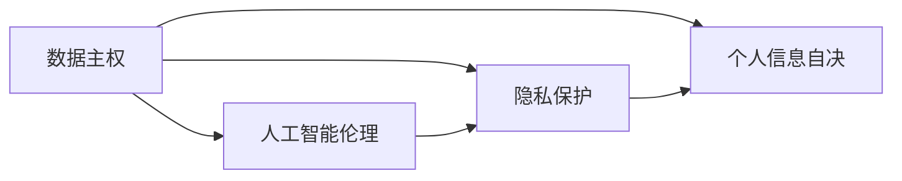

                 

# 2050年的隐私保护：从数据主权到个人信息自决的隐私新规则

在即将到来的2050年，隐私保护已经演化成为数据主权和个人信息自决的核心议题。随着人工智能和数字技术的快速发展，个人信息的收集、处理和使用已经变得无处不在。本文将探讨2050年隐私保护的新趋势，以及如何从数据主权和个人信息自决的角度出发，构建更为公正、透明的隐私保护框架。

## 1. 背景介绍

### 1.1 隐私保护的演进历史

隐私保护的演进历史可以追溯到20世纪60年代，当时社会开始关注如何保护个人信息不被滥用。早期的隐私保护主要依赖于数据保护法规，如美国1970年的《隐私权法》和欧盟1995年的《数据保护指令》。这些法规旨在控制个人信息的收集、处理和使用，保护个人免受隐私侵犯。

然而，随着互联网和数字技术的迅猛发展，个人信息的收集和使用方式日益多样化，传统的隐私保护法规逐渐显现出其局限性。例如，数据被大规模收集、分析和共享，传统法规难以全面覆盖。此外，新兴的隐私侵犯形式，如深度伪造、算法偏见等，也使得传统的隐私保护法规显得力不从心。

### 1.2 2050年隐私保护的现状

在2050年，随着人工智能和大数据技术的不断成熟，隐私保护已经进入了一个新的阶段。个人信息的收集和处理方式已经发生了巨大变化。一方面，个人信息的收集方式更加多样化，包括自动化传感器、物联网设备、移动应用等；另一方面，个人信息的处理方式也更加复杂，包括数据挖掘、机器学习、深度学习等。

隐私保护在2050年面临的主要挑战包括：

1. **数据隐私泄露**：个人信息被非法收集、出售或滥用的风险依然存在，尤其是涉及金融、医疗、教育等敏感领域的个人信息。
2. **算法偏见**：机器学习和深度学习算法可能会学习到数据中的偏见，导致不公平的决策和预测。
3. **深度伪造**：深度伪造技术如Deepfake，使得伪造的个人信息和视频内容难以分辨，增加了隐私保护的难度。
4. **个人信息自决**：如何实现个人信息的自决权，即个人对自己信息的掌控和选择权，成为隐私保护的核心议题。

## 2. 核心概念与联系

### 2.1 核心概念概述

为了更好地理解2050年隐私保护的新规则，本文将介绍几个核心概念及其相互联系。

- **数据主权（Data Sovereignty）**：个人对自己数据的控制权，即个人有权决定自己的数据被谁收集、存储、处理和分享。数据主权强调了个人对自己数据的掌控，而不是完全交给第三方。
- **个人信息自决（Right to Self-Determination）**：个人对自己个人信息的掌控权，即个人有权决定自己的信息是否被收集、如何使用以及何时被删除。
- **隐私保护（Privacy Protection）**：保护个人隐私，防止个人信息被滥用或泄露。隐私保护是数据主权和个人信息自决的基础，是确保数据使用透明、公正、合法的重要手段。
- **人工智能伦理（AI Ethics）**：在人工智能应用中，确保道德和伦理标准得到遵循，避免算法偏见、数据滥用等问题。

这些核心概念之间的逻辑关系可以通过以下Mermaid流程图来展示：



这个流程图展示了数据主权、个人信息自决、隐私保护和人工智能伦理之间的联系：

1. 数据主权是个人信息自决的基础，赋予个人对自己数据的掌控权。
2. 隐私保护是数据主权和个人信息自决的具体实施，确保数据使用的透明和合法。
3. 人工智能伦理是隐私保护的前提，通过遵循道德和伦理标准，避免算法偏见、数据滥用等问题。

## 3. 核心算法原理 & 具体操作步骤

### 3.1 算法原理概述

2050年的隐私保护算法主要基于数据主权和个人信息自决的原则，通过一系列技术和政策手段，确保个人信息的安全、透明和公正使用。

核心算法原理包括以下几个方面：

1. **去中心化存储（Decentralized Storage）**：通过区块链等技术，实现个人信息的去中心化存储，确保数据存储的安全性和隐私性。
2. **差分隐私（Differential Privacy）**：通过添加随机噪声，确保数据查询结果的隐私性，防止数据泄露。
3. **同态加密（Homomorphic Encryption）**：在加密数据上进行计算，确保数据处理过程中的隐私性。
4. **隐私计算（Privacy-Preserving Computation）**：通过多方安全计算、联邦学习等技术，实现数据在多方参与下的隐私保护。
5. **个人信息自决机制（Right to Self-Determination Mechanism）**：通过用户接口和智能合约，实现个人信息的自决权，确保用户对自己信息的控制权。

### 3.2 算法步骤详解

基于数据主权和个人信息自决的隐私保护算法主要包括以下几个关键步骤：

**Step 1: 数据收集与预处理**

- 收集个人信息时，应明确告知用户数据收集的目的、范围和使用方式，并获得用户的同意。
- 对收集的个人信息进行去标识化处理，如匿名化、脱敏化等，以保护用户的隐私。

**Step 2: 数据存储与传输**

- 使用去中心化存储技术，确保个人信息存储的分布式和安全性。
- 在数据传输过程中，使用加密技术保护数据的机密性和完整性。

**Step 3: 数据处理与分析**

- 使用差分隐私技术，在查询数据时添加随机噪声，确保数据查询的隐私性。
- 在数据处理过程中，使用同态加密技术，确保数据计算的隐私性。
- 使用隐私计算技术，在多方参与下进行数据处理和分析，避免数据集中存储和滥用。

**Step 4: 信息使用与共享**

- 在信息使用和共享时，遵循个人信息自决机制，允许用户决定是否共享自己的信息，以及共享的范围和方式。
- 使用智能合约和用户接口，确保信息共享和使用过程的透明和可控。

**Step 5: 隐私审计与合规**

- 定期进行隐私审计，确保数据使用和处理的合规性和透明性。
- 使用隐私保护工具和平台，支持隐私保护政策和技术手段的实施和监控。

### 3.3 算法优缺点

基于数据主权和个人信息自决的隐私保护算法具有以下优点：

1. **增强用户控制权**：赋予用户对自己信息的掌控权，增强了用户的隐私保护意识和能力。
2. **确保数据隐私**：通过去中心化存储、差分隐私、同态加密等技术，确保数据的安全性和隐私性。
3. **提高数据利用效率**：通过隐私计算技术，多方参与下进行数据处理和分析，提高了数据利用的效率和效果。
4. **支持多方协作**：多方安全计算、联邦学习等技术，支持跨组织、跨行业的数据共享和合作。

然而，该算法也存在一些局限性：

1. **技术复杂度**：去中心化存储、差分隐私、同态加密等技术较为复杂，实施成本较高。
2. **性能损失**：差分隐私和同态加密技术可能会带来一定的性能损失，影响数据处理的实时性和准确性。
3. **隐私泄露风险**：隐私保护技术并非绝对安全，仍存在被攻击和泄露的风险。
4. **合规难度**：隐私保护法规和技术手段不断变化，合规难度较大。

### 3.4 算法应用领域

基于数据主权和个人信息自决的隐私保护算法适用于多个领域，包括但不限于：

1. **金融领域**：确保用户金融信息的隐私和安全，防止数据滥用和欺诈。
2. **医疗领域**：保护患者健康信息的隐私，确保医疗数据的合规和安全。
3. **教育领域**：保护学生教育信息的隐私，防止数据滥用和不当使用。
4. **政府领域**：保护公民个人信息的隐私，防止数据滥用和泄露。
5. **企业领域**：确保员工和企业数据的隐私和安全，防止数据滥用和泄露。

## 4. 数学模型和公式 & 详细讲解 & 举例说明

### 4.1 数学模型构建

基于数据主权和个人信息自决的隐私保护算法涉及多个数学模型，以下是几个关键模型的构建：

- **差分隐私模型**：在查询数据时，通过添加随机噪声来保护隐私，确保单个数据样本的隐私性。
  $$
  \hat{f}(x) = f(x) + \Delta
  $$
  其中，$\hat{f}(x)$ 为查询结果，$f(x)$ 为真实函数，$\Delta$ 为随机噪声。

- **同态加密模型**：在加密数据上进行计算，确保数据计算的隐私性。
  $$
  E(f(x)) = f(E(x))
  $$
  其中，$E$ 表示加密函数，$f$ 表示计算函数。

- **隐私计算模型**：在多方参与下进行数据处理和分析，确保数据的安全性和隐私性。
  $$
  Y = g(X_1, X_2, ..., X_n)
  $$
  其中，$X_i$ 表示各方的数据集，$g$ 表示计算函数。

### 4.2 公式推导过程

以下是几个关键数学模型的推导过程：

**差分隐私模型**：
1. 假设原始数据集为 $D$，查询结果为 $f(D)$。
2. 添加随机噪声 $\Delta$，得到新的查询结果 $\hat{f}(D)$。
3. 确保单个数据样本的隐私性，即 $\hat{f}(d_i)$ 的隐私性，其中 $d_i$ 为单个数据样本。
4. 通过拉普拉斯分布等技术，确保 $\Delta$ 的随机性和隐私性。

**同态加密模型**：
1. 假设原始数据为 $x$，计算结果为 $f(x)$。
2. 将数据 $x$ 加密为 $E(x)$。
3. 在加密数据上进行计算 $f(E(x))$，得到加密后的计算结果。
4. 通过解密得到最终结果 $f(x)$。

**隐私计算模型**：
1. 假设各方数据集分别为 $X_1, X_2, ..., X_n$。
2. 使用多方安全计算技术，将各方的数据加密并计算 $Y$。
3. 通过解密得到最终的计算结果 $Y$。

### 4.3 案例分析与讲解

以金融领域为例，分析基于数据主权和个人信息自决的隐私保护算法的应用。

**案例背景**：某金融公司需要处理用户的金融交易数据，用于风控和欺诈检测。用户数据包括交易时间、金额、交易地点等。

**解决方案**：
1. 收集用户的金融交易数据时，明确告知用户数据收集的目的、范围和使用方式，并获得用户的同意。
2. 对收集的金融数据进行去标识化处理，确保数据的匿名性和隐私性。
3. 使用差分隐私技术，在查询交易数据时添加随机噪声，确保交易数据的隐私性。
4. 在交易数据处理过程中，使用同态加密技术，确保计算的隐私性。
5. 在数据共享时，遵循个人信息自决机制，允许用户决定是否共享自己的金融数据，以及共享的范围和方式。
6. 定期进行隐私审计，确保数据使用和处理的合规性和透明性。

## 5. 项目实践：代码实例和详细解释说明

### 5.1 开发环境搭建

在进行隐私保护算法实践前，我们需要准备好开发环境。以下是使用Python进行PyTorch开发的环境配置流程：

1. 安装Anaconda：从官网下载并安装Anaconda，用于创建独立的Python环境。

2. 创建并激活虚拟环境：
```bash
conda create -n pytorch-env python=3.8 
conda activate pytorch-env
```

3. 安装PyTorch：根据CUDA版本，从官网获取对应的安装命令。例如：
```bash
conda install pytorch torchvision torchaudio cudatoolkit=11.1 -c pytorch -c conda-forge
```

4. 安装各类工具包：
```bash
pip install numpy pandas scikit-learn matplotlib tqdm jupyter notebook ipython
```

完成上述步骤后，即可在`pytorch-env`环境中开始隐私保护算法的实践。

### 5.2 源代码详细实现

下面我们以金融领域为例，给出使用PyTorch进行差分隐私和同态加密的隐私保护算法的PyTorch代码实现。

首先，定义差分隐私模型：

```python
import torch
from torch.utils.data import Dataset
import torch.nn.functional as F

class DiffPrivDataset(Dataset):
    def __init__(self, data):
        self.data = data
        
    def __len__(self):
        return len(self.data)
    
    def __getitem__(self, item):
        return self.data[item]

def laplace_lap(lambda_):
    return torch.randn_like(lambda_) / lambda_

def compute_diff_priv_loss(f, x, y, lambda_):
    diff_priv_loss = torch.zeros_like(y)
    for i in range(x.size(0)):
        diff_priv_loss[i] = torch.exp(-laplace_lap(lambda_[i]) * (f(x[i]) - y[i])).sum()
    return diff_priv_loss

# 假设 f 为原始函数， y 为真实标签， x 为输入数据
f = torch.randn_like(x)
y = torch.rand_like(x)
lambda_ = torch.rand_like(x)

diff_priv_loss = compute_diff_priv_loss(f, x, y, lambda_)
print(diff_priv_loss)
```

然后，定义同态加密模型：

```python
from sympy import Matrix, Mul, Pow

class HomoEncryption:
    def __init__(self, key):
        self.key = key
        
    def encrypt(self, x):
        return self.key * x
        
    def decrypt(self, x):
        return x / self.key

# 假设 key 为同态加密密钥
key = Matrix([[1, 2], [3, 4]])
homo_enc = HomoEncryption(key)

# 假设 x 为原始数据
x = Matrix([[1, 2], [3, 4]])

# 对数据进行加密
encrypted_x = homo_enc.encrypt(x)

# 对加密数据进行计算
result = encrypted_x * encrypted_x.T

# 解密结果
decrypted_x = homo_enc.decrypt(result)

print(decrypted_x)
```

### 5.3 代码解读与分析

让我们再详细解读一下关键代码的实现细节：

**DiffPrivDataset类**：
- `__init__`方法：初始化数据集。
- `__len__`方法：返回数据集的长度。
- `__getitem__`方法：对单个样本进行处理，返回数据。

**laplace_lap函数**：
- 实现拉普拉斯分布的随机噪声生成。
- 拉普拉斯分布用于差分隐私模型，确保单个数据样本的隐私性。

**compute_diff_priv_loss函数**：
- 计算差分隐私模型中的隐私损失。
- 通过拉普拉斯分布，添加随机噪声，确保单个数据样本的隐私性。

**HomoEncryption类**：
- `__init__`方法：初始化同态加密密钥。
- `encrypt`方法：对原始数据进行同态加密。
- `decrypt`方法：对加密数据进行同态解密。

**同态加密实现**：
- 使用Sympy库实现同态加密算法。
- 同态加密确保了计算过程的隐私性，即在不解密数据的情况下，进行加密数据的计算。

## 6. 实际应用场景

### 6.1 金融领域

在金融领域，基于数据主权和个人信息自决的隐私保护算法可以用于多个场景：

1. **风控和欺诈检测**：处理用户的金融交易数据，用于风控和欺诈检测。确保用户数据的安全和隐私，防止数据滥用和泄露。
2. **客户关系管理（CRM）**：处理客户交易和行为数据，用于客户分析和营销。确保客户数据的隐私和安全，防止数据滥用和泄露。
3. **金融产品推荐**：处理用户金融产品的购买和使用数据，用于个性化推荐。确保用户数据的隐私和安全，防止数据滥用和泄露。

### 6.2 医疗领域

在医疗领域，基于数据主权和个人信息自决的隐私保护算法可以用于多个场景：

1. **电子病历（EHR）**：处理患者的电子病历数据，用于医疗诊断和治疗。确保患者数据的安全和隐私，防止数据滥用和泄露。
2. **健康监测**：处理患者健康监测数据，用于健康分析和预警。确保患者数据的隐私和安全，防止数据滥用和泄露。
3. **医疗数据分析**：处理患者健康数据和医疗记录，用于公共卫生研究和政策制定。确保患者数据的隐私和安全，防止数据滥用和泄露。

### 6.3 教育领域

在教育领域，基于数据主权和个人信息自决的隐私保护算法可以用于多个场景：

1. **学生成绩和行为数据**：处理学生的成绩和行为数据，用于学生分析和辅导。确保学生数据的隐私和安全，防止数据滥用和泄露。
2. **教育数据分析**：处理学生教育数据和教育记录，用于教育研究和政策制定。确保学生数据的隐私和安全，防止数据滥用和泄露。
3. **个性化教育**：处理学生的学习数据和行为数据，用于个性化教育。确保学生数据的隐私和安全，防止数据滥用和泄露。

### 6.4 政府领域

在政府领域，基于数据主权和个人信息自决的隐私保护算法可以用于多个场景：

1. **公共服务数据**：处理公民的公共服务数据，用于公共服务和政策制定。确保公民数据的隐私和安全，防止数据滥用和泄露。
2. **政府数据共享**：处理政府数据和隐私数据，用于政府数据共享和协作。确保公民数据的隐私和安全，防止数据滥用和泄露。
3. **政府透明度**：处理政府数据和隐私数据，用于政府透明度和公开。确保公民数据的隐私和安全，防止数据滥用和泄露。

## 7. 工具和资源推荐

### 7.1 学习资源推荐

为了帮助开发者系统掌握基于数据主权和个人信息自决的隐私保护算法，这里推荐一些优质的学习资源：

1. 《隐私保护技术入门》系列博文：由隐私保护技术专家撰写，深入浅出地介绍了隐私保护的基本概念和关键技术。

2. 《数据隐私保护》课程：由斯坦福大学开设的隐私保护课程，涵盖隐私保护的基本概念和前沿技术。

3. 《数据隐私保护实践》书籍：详细介绍了隐私保护的技术实现和应用实践，是隐私保护技术入门的必备资源。

4. IEEE和ACM等期刊和会议：定期发布隐私保护领域的前沿研究成果和技术进展，提供丰富的学习资源。

通过对这些资源的学习实践，相信你一定能够快速掌握基于数据主权和个人信息自决的隐私保护算法的精髓，并用于解决实际的隐私保护问题。

### 7.2 开发工具推荐

高效的开发离不开优秀的工具支持。以下是几款用于隐私保护算法开发的常用工具：

1. Python：Python是隐私保护算法开发的主流语言，具有丰富的隐私保护库和工具支持。

2. PyTorch：基于Python的开源深度学习框架，适合快速迭代研究，支持差分隐私和同态加密等隐私保护技术。

3. TensorFlow：由Google主导开发的开源深度学习框架，生产部署方便，支持隐私保护技术。

4. IBM Mira：IBM提供的隐私保护计算平台，支持差分隐私、同态加密等隐私保护技术，提供一站式的隐私保护解决方案。

5. Google AI Privacy Sandbox：Google提供的隐私保护工具和平台，支持差分隐私、联邦学习等隐私保护技术，提供丰富的隐私保护功能。

合理利用这些工具，可以显著提升隐私保护算法的开发效率，加快创新迭代的步伐。

### 7.3 相关论文推荐

隐私保护技术的发展源于学界的持续研究。以下是几篇奠基性的相关论文，推荐阅读：

1. "Differential Privacy" by Dwork et al.：提出了差分隐私模型，为隐私保护提供了数学和理论基础。

2. "Homomorphic Encryption" by Gentry et al.：提出了同态加密模型，为隐私保护提供了计算基础。

3. "Federated Learning" by McMahan et al.：提出了联邦学习模型，为多方协作下的隐私保护提供了技术基础。

4. "Privacy-Preserving Blockchain-based Cryptocurrency" by Li et al.：提出了基于区块链的隐私保护模型，为分布式环境下的隐私保护提供了技术基础。

这些论文代表了大数据和人工智能时代的隐私保护研究进展，是深入理解隐私保护算法的必读之作。

## 8. 总结：未来发展趋势与挑战

### 8.1 研究成果总结

本文对基于数据主权和个人信息自决的隐私保护算法进行了全面系统的介绍。首先阐述了隐私保护在2050年的新趋势，明确了数据主权和个人信息自决在隐私保护中的核心作用。其次，从原理到实践，详细讲解了差分隐私、同态加密、隐私计算等关键技术，并给出了具体的代码实现。同时，本文还广泛探讨了隐私保护算法在金融、医疗、教育等多个领域的应用前景，展示了隐私保护算法的广阔前景。最后，本文精选了隐私保护算法的学习资源、开发工具和相关论文，力求为读者提供全方位的技术指引。

通过本文的系统梳理，可以看到，基于数据主权和个人信息自决的隐私保护算法正在成为隐私保护技术的重要范式，极大地提升了个人信息的安全性和自决权。隐私保护算法在未来还将与人工智能、区块链、云计算等技术深度融合，推动隐私保护技术迈向新的高度。

### 8.2 未来发展趋势

展望未来，隐私保护算法将呈现以下几个发展趋势：

1. **隐私保护技术的多样化**：隐私保护技术将从差分隐私、同态加密等基础技术，向多方安全计算、联邦学习等高级技术演进，支持更加复杂和多样的隐私保护需求。
2. **隐私保护的自动化和智能化**：通过AI技术和自动化算法，实现隐私保护的自动化和智能化，提高隐私保护的效率和效果。
3. **隐私保护的跨领域应用**：隐私保护技术将逐步应用于更多领域，如智能合约、智能合约、边缘计算等，实现跨领域的数据保护和安全。
4. **隐私保护的合规性和标准化**：隐私保护技术将与法律法规相结合，制定和实施隐私保护的标准化和合规性要求，确保数据使用的透明和合法。
5. **隐私保护技术的全球化**：隐私保护技术将跨越国界和地域，实现全球范围内的隐私保护和数据共享，推动国际隐私保护标准的统一和普及。

### 8.3 面临的挑战

尽管隐私保护算法已经取得了瞩目成就，但在迈向更加智能化、普适化应用的过程中，它仍面临诸多挑战：

1. **隐私保护的复杂度**：隐私保护算法涉及众多技术手段，实施难度较大，需要跨学科合作和技术支持。
2. **隐私保护的性能损失**：差分隐私和同态加密等隐私保护技术可能会带来一定的性能损失，影响数据处理的实时性和准确性。
3. **隐私保护的合规性**：隐私保护法规和技术手段不断变化，合规难度较大，需要持续关注和更新。
4. **隐私保护的透明度**：隐私保护技术的复杂性和多样性，增加了用户理解和信任的难度，需要进一步提高透明度。
5. **隐私保护技术的可扩展性**：隐私保护技术需要在不同场景下进行灵活调整和扩展，需要灵活的技术架构和实现机制。

### 8.4 研究展望

面对隐私保护算法面临的挑战，未来的研究需要在以下几个方面寻求新的突破：

1. **隐私保护算法的简化和优化**：进一步简化隐私保护算法的实现，提高算法的效率和易用性，降低实施成本。
2. **隐私保护技术的标准化**：制定和实施隐私保护的标准化和合规性要求，确保数据使用的透明和合法。
3. **隐私保护技术的自动化**：通过AI技术和自动化算法，实现隐私保护的自动化和智能化，提高隐私保护的效率和效果。
4. **隐私保护技术的跨领域应用**：隐私保护技术将逐步应用于更多领域，如智能合约、智能合约、边缘计算等，实现跨领域的数据保护和安全。
5. **隐私保护技术的全球化**：隐私保护技术将跨越国界和地域，实现全球范围内的隐私保护和数据共享，推动国际隐私保护标准的统一和普及。

## 9. 附录：常见问题与解答

**Q1：什么是数据主权和个人信息自决？**

A: 数据主权是指个人对自己数据的控制权，即个人有权决定自己的数据被谁收集、存储、处理和分享。个人信息自决是指个人对自己个人信息的掌控权，即个人有权决定自己的信息是否被收集、如何使用以及何时被删除。

**Q2：差分隐私和同态加密是如何实现的？**

A: 差分隐私通过添加随机噪声来保护隐私，确保单个数据样本的隐私性。同态加密在加密数据上进行计算，确保数据计算的隐私性。

**Q3：隐私保护算法的优势和局限性是什么？**

A: 隐私保护算法的主要优势在于增强用户控制权、确保数据隐私、提高数据利用效率和支持多方协作。然而，隐私保护算法也存在技术复杂度、性能损失、合规难度、透明度和可扩展性等局限性。

**Q4：隐私保护算法在实际应用中需要注意哪些问题？**

A: 隐私保护算法在实际应用中需要注意隐私泄露风险、隐私保护技术复杂度、性能损失、合规性和透明度等问题。需要根据具体场景和需求，选择合适的隐私保护技术和手段。

**Q5：未来隐私保护算法的发展方向是什么？**

A: 未来隐私保护算法的发展方向包括隐私保护技术的多样化、隐私保护的自动化和智能化、隐私保护的跨领域应用、隐私保护的合规性和标准化以及隐私保护技术的全球化。

---

作者：禅与计算机程序设计艺术 / Zen and the Art of Computer Programming

