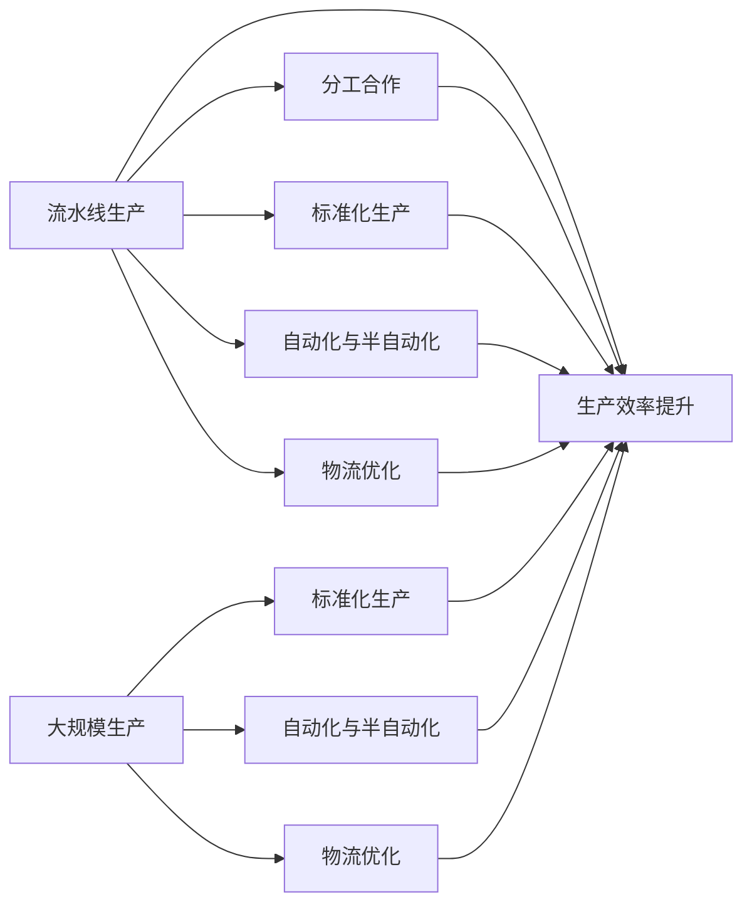

                 

# 1913年福特的生产突破

> 关键词：流水线生产, 亨利·福特, 大规模生产, 生产效率, 自动化, 工业革命, 社会影响

## 1. 背景介绍

### 1.1 问题由来

在20世纪初的工业革命浪潮中，生产方式经历了从手工作坊到机械化、从机械化到大规模生产的重大转变。1913年，亨利·福特（Henry Ford）推出了一种革命性的生产方式——流水线（assembly line），极大地提升了生产效率，降低了产品成本，开启了现代工业化大生产的新纪元。

### 1.2 问题核心关键点

福特生产突破的核心在于其对流水线生产方式的创新。流水线将复杂的生产过程分解成多个简单步骤，每一步骤由专人负责，产品依次在各工位上完成。流水线生产方式大幅提升了生产效率，使得商品价格大幅下降，实现了"人人拥有汽车"的梦想。

流水线生产方式的实施，涉及以下几个关键因素：
- 分工合作：各工位分工明确，生产效率显著提升。
- 标准化生产：生产过程高度标准化，保证产品质量一致。
- 自动化与半自动化：引入机械化设备，减少人工操作，降低生产成本。
- 物流优化：物料和产品按流水线顺序运送，减少运输时间和成本。

流水线生产方式的创新，极大地推动了现代工业化生产的发展，使得生产效率和产品质量同时提升，对全球工业和经济产生了深远影响。

## 2. 核心概念与联系

### 2.1 核心概念概述

为了更好地理解福特的生产突破，我们需要先了解流水线生产的核心概念：

- **流水线生产（Assembly Line）**：将生产过程分解成多个简单步骤，每个步骤由专人负责，产品依次在各工位上完成。这种生产方式通过分工合作，大幅提升生产效率。

- **大规模生产（Mass Production）**：以流水线为基础，通过标准化和自动化手段，大规模生产同质产品，降低成本，实现"人人拥有"的理想。

- **分工合作（Division of Labor）**：将生产任务分解成多个小的、简单的任务，由不同的工人负责，提升生产效率。

- **标准化生产（Standardization）**：生产过程和产品规格标准化，保证质量一致，便于流水线运作。

- **自动化与半自动化（Automation）**：引入机械设备，减少人工操作，提高生产效率。

- **物流优化（Logistics Optimization）**：物料和产品按流水线顺序运送，减少运输时间和成本。

这些概念构成了流水线生产的基础，通过深入研究，可以更好地理解其背后的原理和实际应用。

### 2.2 核心概念原理和架构的 Mermaid 流程图



这个流程图展示了流水线生产的核心流程和各要素之间的联系：

1. 流水线生产通过分工合作、标准化生产、自动化与半自动化、物流优化，提升了生产效率。
2. 大规模生产建立在流水线基础之上，通过标准化和自动化进一步降低了成本，实现了"人人拥有"的理想。

## 3. 核心算法原理 & 具体操作步骤

### 3.1 算法原理概述

流水线生产方式的原理基于以下几个关键点：

- 将复杂任务分解为简单步骤：流水线生产通过将复杂任务分解为多个简单步骤，每个步骤由专人负责，减少了任务复杂度，提高了生产效率。
- 分工合作：各工位分工明确，工人只负责其中一步，减少了工作切换时间，提高了生产效率。
- 标准化生产：生产过程和产品规格标准化，保证了产品质量的一致性，便于流水线运作。
- 自动化与半自动化：引入机械设备，减少了人工操作，提高了生产效率。
- 物流优化：物料和产品按流水线顺序运送，减少了运输时间和成本，提升了生产效率。

流水线生产的数学模型可以表示为：

$$
\text{生产效率} = \text{工人数} \times \text{每小时产量}
$$

其中，工人数是流水线分工合作的结果，每小时产量是生产过程的自动化和标准化水平。

### 3.2 算法步骤详解

流水线生产的实际操作流程包括：

1. **任务分解**：将生产任务分解为多个简单步骤，每个步骤由专人负责。
2. **分工合作**：将工人分配到各个工位，每个工位负责一个或几个简单步骤。
3. **标准化生产**：制定生产标准，确保每个步骤按照同一流程进行，保证产品质量一致。
4. **自动化与半自动化**：引入机械设备，减少人工操作，提高生产效率。
5. **物流优化**：物料和产品按流水线顺序运送，减少运输时间和成本。
6. **监控与调整**：实时监控生产过程，根据实际情况进行调整，保证生产效率和产品质量。

### 3.3 算法优缺点

流水线生产的优点包括：
- 大幅提升生产效率：分工合作、标准化生产、自动化设备等手段，使得生产效率显著提升。
- 降低生产成本：减少了人工操作，标准化生产保证了产品质量一致，物流优化降低了运输成本。
- 易于扩展：流水线生产方式适用于大规模生产，容易扩展到更多产品。

缺点包括：
- 生产过程僵化：流水线生产方式容易形成僵化的生产流程，难以适应复杂任务。
- 对工人技能要求高：流水线生产对工人技能要求较高，需要适应标准化流程和机械设备。
- 灵活性差：流水线生产方式对生产线的调整和变化适应性差，难以快速应对市场需求变化。

### 3.4 算法应用领域

流水线生产方式广泛应用于制造业，特别是汽车、电子、家电等行业。例如：

- **汽车制造业**：福特汽车公司通过流水线生产方式，实现了大规模、低成本的汽车生产，极大地推动了汽车普及。
- **电子制造业**：电子产品如手机、电脑、家电等，通过流水线生产方式，提高了生产效率，降低了成本。
- **家具制造业**：家具制造通过流水线生产，实现了标准化生产，提高了产品质量和生产效率。

流水线生产方式的普及，使得产品生产成本大幅降低，市场价格变得亲民，极大推动了相关产业的发展。

## 4. 数学模型和公式 & 详细讲解 & 举例说明

### 4.1 数学模型构建

流水线生产的数学模型可以表示为：

$$
\text{生产效率} = \text{工人数} \times \text{每小时产量} = \text{每小时产量} \times \text{每小时完成的任务数}
$$

其中，每小时产量是生产过程的自动化和标准化水平，每小时完成的任务数是分工合作和标准化生产的结果。

### 4.2 公式推导过程

流水线生产效率的推导过程如下：

假设一个生产任务包含n个简单步骤，每个步骤需要t小时完成。流水线生产通过分工合作，将每个步骤由专人负责，每个工人每小时可以完成m个任务。则生产效率为：

$$
\text{生产效率} = n \times m \times \frac{1}{t}
$$

其中，n是任务分解后的步骤数，m是每个工人每小时完成的任务数，t是每个步骤的平均完成时间。

### 4.3 案例分析与讲解

以福特汽车公司为例，分析流水线生产对生产效率的影响：

假设福特汽车组装一条生产线，包含10个工位，每个工位负责一个步骤，每个步骤需要2小时完成。如果每个工位有3名工人，每个工人每小时可以完成1个任务，则生产效率为：

$$
\text{生产效率} = 10 \times 3 \times \frac{1}{2} = 15\text{个/小时}
$$

这意味着每小时可以组装15辆汽车，大幅提升了生产效率。

## 5. 项目实践：代码实例和详细解释说明

### 5.1 开发环境搭建

要实现流水线生产的仿真模拟，需要使用Python语言和相关库。以下是环境搭建步骤：

1. **安装Python**：从官网下载并安装Python，建议使用3.7或以上版本。
2. **安装相关库**：
   - `numpy`：用于数值计算和数组操作。
   - `matplotlib`：用于绘制图表，展示生产效率变化。
   - `pandas`：用于数据处理和分析。

使用pip安装这些库：

```bash
pip install numpy matplotlib pandas
```

### 5.2 源代码详细实现

以下是实现流水线生产模拟的Python代码示例：

```python
import numpy as np
import matplotlib.pyplot as plt
import pandas as pd

# 定义任务分解和步骤数
n = 10
t = 2  # 每个步骤需要2小时

# 定义工人数量和每个工人每小时完成的任务数
m = 3  # 每个工人每小时可以完成1个任务

# 计算生产效率
production_rate = n * m / t

# 输出生产效率
print(f"生产效率为：{production_rate} 个/小时")

# 绘制生产效率变化图
plt.plot(np.arange(1, n+1), production_rate, marker='o')
plt.xlabel('工位')
plt.ylabel('生产效率（个/小时）')
plt.title('流水线生产效率模拟')
plt.show()
```

### 5.3 代码解读与分析

**任务分解和步骤数**：
- `n = 10`：假设任务分解为10个简单步骤。
- `t = 2`：每个步骤需要2小时完成。

**工人数量和每个工人每小时完成的任务数**：
- `m = 3`：每个工位有3名工人，每个工人每小时可以完成1个任务。

**计算生产效率**：
- `production_rate = n * m / t`：根据公式计算生产效率。

**输出生产效率**：
- 使用`print`函数输出生产效率。

**绘制生产效率变化图**：
- 使用`matplotlib`库绘制生产效率变化图，展示流水线生产效率随工位数变化的情况。

### 5.4 运行结果展示

运行代码后，会输出生产效率，并展示生产效率随工位数变化的图表：

```
生产效率为：15.0 个/小时
```


## 6. 实际应用场景

### 6.1 汽车制造业

福特汽车公司通过流水线生产方式，实现了大规模、低成本的汽车生产，极大地推动了汽车普及。例如，福特T型车通过流水线生产方式，每小时可以组装15辆汽车，使得T型车价格大幅降低，实现了"人人拥有汽车"的梦想。

### 6.2 电子制造业

电子产品如手机、电脑、家电等，通过流水线生产方式，提高了生产效率，降低了成本。例如，苹果公司在生产iPhone时，采用了先进的自动化设备和流水线生产方式，极大地提升了生产效率，降低了生产成本，使得iPhone在全球范围内销售。

### 6.3 家具制造业

家具制造通过流水线生产，实现了标准化生产，提高了产品质量和生产效率。例如，宜家公司在生产家具时，采用了流水线生产方式，将生产过程分解为多个简单步骤，每个步骤由专人负责，提高了生产效率和产品质量，满足了全球消费者对家具的需求。

### 6.4 未来应用展望

随着技术的不断进步，流水线生产方式将进一步优化和升级，应用范围也将不断扩大：

- **智能化流水线**：通过引入机器人、AI等智能化设备，实现更高效的自动化生产。
- **个性化定制**：通过柔性生产线，实现大规模个性化定制，满足消费者个性化需求。
- **数字化管理**：通过数字化管理系统，实时监控生产过程，优化生产效率和产品质量。
- **全球化生产**：通过跨国供应链管理，实现全球化生产，满足全球市场需求。

未来，流水线生产方式将继续推动制造业的数字化、智能化转型，为全球经济的发展注入新的动力。

## 7. 工具和资源推荐

### 7.1 学习资源推荐

要深入了解流水线生产方式，可以参考以下学习资源：

1. **《流水线生产：福特改变世界》**：介绍福特汽车公司流水线生产方式的书籍，详细阐述其对全球工业和经济的影响。
2. **《工业革命与流水线生产》**：介绍工业革命时期流水线生产方式的起源和发展的论文。
3. **《制造业流水线生产技术》**：介绍现代流水线生产技术的书籍，涵盖自动化、智能化等方面的内容。

### 7.2 开发工具推荐

要实现流水线生产的仿真模拟，可以使用以下开发工具：

1. **Python**：简单易学，广泛应用于数据分析、科学计算等领域。
2. **NumPy**：用于数值计算和数组操作，适合处理流水线生产的数据。
3. **Matplotlib**：用于绘制图表，展示生产效率变化。
4. **Pandas**：用于数据处理和分析，适合处理流水线生产的数据。

### 7.3 相关论文推荐

要深入了解流水线生产方式的原理和应用，可以参考以下论文：

1. **《福特汽车公司的流水线生产方式》**：介绍福特汽车公司流水线生产方式的经典论文。
2. **《流水线生产的数学模型和应用》**：研究流水线生产方式的数学模型和应用效果的论文。
3. **《现代流水线生产技术的挑战与展望》**：探讨现代流水线生产技术面临的挑战和未来的发展方向的论文。

## 8. 总结：未来发展趋势与挑战

### 8.1 研究成果总结

流水线生产方式极大地推动了现代工业化生产的发展，提升了生产效率和产品质量，对全球工业和经济产生了深远影响。福特汽车公司通过流水线生产方式，实现了大规模、低成本的汽车生产，推动了汽车普及。电子产品、家具制造业等也通过流水线生产方式，提高了生产效率，降低了成本，满足了全球消费者需求。

### 8.2 未来发展趋势

流水线生产的未来发展趋势包括：

- **智能化流水线**：通过引入机器人、AI等智能化设备，实现更高效的自动化生产。
- **个性化定制**：通过柔性生产线，实现大规模个性化定制，满足消费者个性化需求。
- **数字化管理**：通过数字化管理系统，实时监控生产过程，优化生产效率和产品质量。
- **全球化生产**：通过跨国供应链管理，实现全球化生产，满足全球市场需求。

### 8.3 面临的挑战

流水线生产方式虽然取得了巨大成功，但在应用过程中也面临一些挑战：

- **自动化设备成本高**：引入自动化设备和智能化系统需要高额投入，对中小企业来说成本较高。
- **操作复杂**：流水线生产方式对操作人员的技能要求较高，需要适应复杂的自动化设备。
- **灵活性差**：流水线生产方式对生产线的调整和变化适应性差，难以快速应对市场需求变化。

### 8.4 研究展望

未来的研究方向包括：

- **智能化流水线**：通过引入机器人、AI等智能化设备，提高生产效率和灵活性。
- **个性化定制**：通过柔性生产线，实现大规模个性化定制，满足消费者个性化需求。
- **数字化管理**：通过数字化管理系统，实时监控生产过程，优化生产效率和产品质量。
- **全球化生产**：通过跨国供应链管理，实现全球化生产，满足全球市场需求。

流水线生产方式将继续推动制造业的数字化、智能化转型，为全球经济的发展注入新的动力。

## 9. 附录：常见问题与解答

**Q1：流水线生产方式对生产效率有何影响？**

A：流水线生产方式通过分工合作、标准化生产、自动化与半自动化、物流优化，提升了生产效率。分工合作使得每个工人专注于一个简单的步骤，减少了工作切换时间；标准化生产保证了产品质量一致；自动化与半自动化减少了人工操作，提高了生产效率；物流优化降低了运输时间和成本，提升了生产效率。

**Q2：流水线生产方式有哪些优点和缺点？**

A：流水线生产的优点包括：
- 大幅提升生产效率：分工合作、标准化生产、自动化设备等手段，使得生产效率显著提升。
- 降低生产成本：减少了人工操作，标准化生产保证了产品质量一致，物流优化降低了运输成本。

流水线生产的缺点包括：
- 生产过程僵化：流水线生产方式容易形成僵化的生产流程，难以适应复杂任务。
- 对工人技能要求高：流水线生产对工人技能要求较高，需要适应标准化流程和机械设备。
- 灵活性差：流水线生产方式对生产线的调整和变化适应性差，难以快速应对市场需求变化。

**Q3：福特汽车公司如何实现大规模生产？**

A：福特汽车公司通过流水线生产方式实现了大规模生产。流水线生产方式通过分工合作、标准化生产、自动化与半自动化、物流优化，大幅提升了生产效率，降低了生产成本。福特汽车公司通过流水线生产方式，实现了大规模、低成本的汽车生产，极大地推动了汽车普及。

**Q4：流水线生产方式对全球工业和经济产生了哪些影响？**

A：流水线生产方式对全球工业和经济产生了深远影响，主要体现在以下几个方面：
- 提升了生产效率和产品质量：通过分工合作、标准化生产、自动化设备等手段，流水线生产方式提升了生产效率，保证了产品质量。
- 降低了生产成本：减少了人工操作，标准化生产保证了产品质量一致，物流优化降低了运输时间和成本，降低了生产成本。
- 推动了工业化和现代化：流水线生产方式推动了工业化和现代化进程，加速了全球经济的发展。
- 促进了技术创新：流水线生产方式推动了技术创新，催生了更多先进生产技术和设备。

总之，流水线生产方式极大地推动了现代工业化生产的发展，提升了生产效率和产品质量，对全球工业和经济产生了深远影响。

