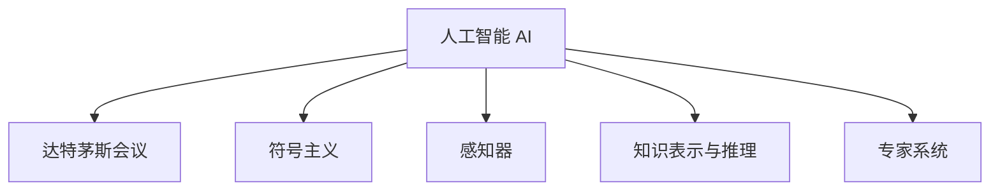

                 

## 1. 背景介绍

### 1.1 问题由来
人工智能(AI)作为一门独立的学科，其起源可以追溯到1956年的达特茅斯会议。该会议由约翰·麦卡锡、马文·明斯基、克劳德·香农、纳撒尼尔·罗切斯特等计算机科学先驱共同发起，吸引了众多知名的科学家和工程师参与，奠定了AI学科的基础，并产生了深远影响。

### 1.2 问题核心关键点
达特茅斯会议的重要贡献在于正式提出了“人工智能”的概念，并明确了AI的目标。通过这次会议，AI的学术界、工业界和政府机构均被高度重视和支持，推动了AI技术的快速发展。

### 1.3 问题研究意义
了解1956年达特茅斯会议，对于理解AI的演进历程、理解现代AI技术和研究方法，具有重要的意义。它不仅揭示了AI早期的思想和目标，也为我们回顾AI的发展历程，提供了宝贵的历史视角。

## 2. 核心概念与联系

### 2.1 核心概念概述

为了更好地理解达特茅斯会议的背景，本节将介绍几个相关的核心概念：

- **人工智能（Artificial Intelligence, AI）**：通过计算机程序实现人或动物的智能行为，包括感知、理解、学习、推理和决策等能力。
- **达特茅斯会议（Dartmouth Conference）**：1956年由麦卡锡、明斯基等人发起，讨论了AI的定义、目标和方法，推动了AI学科的形成。
- **符号主义（Symbolism）**：早期AI的主流研究范式，将问题转化为符号表达式，通过逻辑推理和算法求解。
- **感知器（Perceptron）**：罗森布拉特提出的用于图像识别的早期模型，是神经网络的前身。
- **知识表示与推理（Knowledge Representation and Reasoning）**：通过符号或逻辑表示知识，并利用逻辑推理技术进行处理。
- **专家系统（Expert Systems）**：基于知识表示与推理的技术，模拟专家决策过程，用于特定领域的专家咨询。

这些核心概念之间的逻辑关系可以通过以下Mermaid流程图来展示：



这个流程图展示了一些关键概念之间的联系：

1. 人工智能是在达特茅斯会议的基础上发展起来的。
2. 符号主义是早期AI的主流研究范式。
3. 感知器和专家系统都是基于知识表示与推理的具体实现。

这些概念共同构成了AI的早期基础，揭示了AI学科的形成过程。

## 3. 核心算法原理 & 具体操作步骤

### 3.1 算法原理概述

达特茅斯会议的核心目标之一，是探讨如何通过计算机程序实现智能行为。其核心思想是通过将问题转化为符号表达式，并通过逻辑推理和算法求解，从而实现人工智能的目标。

早期的AI研究主要围绕符号主义展开，即将问题抽象为符号表达式，利用逻辑推理和算法求解。这些方法通过人工编写规则和算法，实现对特定问题的处理。尽管这种方法在理论上具有优越性，但在实践中难以处理复杂的现实问题，且难以实现自动化和扩展。

### 3.2 算法步骤详解

达特茅斯会议的讨论主要集中在以下几个步骤上：

**Step 1: 问题抽象**
- 将问题抽象为符号表达式。早期的AI研究主要使用数学和逻辑符号来表示问题。
- 建立问题模型。通过人工编写规则和算法，构建问题模型。

**Step 2: 知识表示**
- 使用符号或逻辑表示知识。早期的AI研究使用符号逻辑来表示问题知识和规则。
- 定义知识库。构建一个包含问题知识库的数据结构，用于存储和管理问题知识和规则。

**Step 3: 推理求解**
- 设计推理算法。通过逻辑推理算法，求解问题。
- 实现问题求解。通过计算机程序实现问题求解。

### 3.3 算法优缺点

达特茅斯会议所定义的符号主义AI方法具有以下优点：
1. 形式化明确。符号主义方法将问题形式化表示，逻辑清晰，易于理解和实现。
2. 灵活性高。符号逻辑具有高度的灵活性和可扩展性，能够处理多种类型的复杂问题。
3. 理论完备。符号逻辑具有严格的数学基础，能够在理论上保证问题求解的正确性。

然而，符号主义方法也存在以下缺点：
1. 处理复杂性高。符号逻辑难以处理复杂的现实问题，需要大量人工干预和规则编写。
2. 自动化难度大。早期AI研究主要依赖人工编写规则和算法，难以实现自动化和扩展。
3. 计算复杂度高。符号逻辑方法通常需要大量的计算资源和时间，难以大规模应用。
4. 缺乏鲁棒性。符号逻辑方法对于输入数据的变化敏感，难以处理噪声和异常。

尽管存在这些局限性，但符号主义方法奠定了早期AI研究的基础，为后续AI技术的发展提供了重要的思路。

### 3.4 算法应用领域

达特茅斯会议所定义的符号主义AI方法在早期AI研究中得到了广泛应用，覆盖了以下多个领域：

- **专家系统**：通过知识表示与推理，模拟专家决策过程，用于特定领域的专家咨询。
- **自然语言处理**：通过符号逻辑和语法规则，实现自然语言理解和生成。
- **机器翻译**：通过符号逻辑和语法规则，实现机器翻译任务。
- **自动规划**：通过符号逻辑和搜索算法，实现自动规划和调度。
- **知识库系统**：构建包含知识库的数据结构，用于存储和管理问题知识和规则。

这些应用领域在早期AI研究中取得了一定程度的进展，但随着AI技术的发展，符号主义方法逐渐被更为强大的计算和统计方法所取代。

## 4. 数学模型和公式 & 详细讲解 & 举例说明

### 4.1 数学模型构建

达特茅斯会议期间，人工智能研究主要围绕符号逻辑展开。符号逻辑的主要数学模型包括：

- 谓词逻辑（Predicate Logic）：用于表示和推理实体之间的关系。
- 一阶逻辑（First-Order Logic）：基于谓词逻辑，用于处理更加复杂的现实问题。
- 模型论（Model Theory）：研究逻辑模型的性质和理论。

这些数学模型通过符号逻辑表达式，将问题形式化表示，并利用逻辑推理求解。

### 4.2 公式推导过程

以下以谓词逻辑为例，展示符号逻辑的公式推导过程：

- 定义谓词 $P(x)$：表示“$x$ 具有属性 $P$”。
- 定义一阶逻辑公式 $\forall x(P(x) \rightarrow Q(x))$：表示“所有具有属性 $P$ 的实体，都具有属性 $Q$”。

通过符号逻辑公式，可以推理和求解各种复杂问题。例如，求解如下一阶逻辑公式：

$$
\forall x(P(x) \rightarrow Q(x)), \forall y(Q(y) \rightarrow R(y)), P(a) \rightarrow R(a)
$$

可以推导出：$P(a) \rightarrow R(a)$

其中 $a$ 是任意实体，$P(x), Q(x), R(x)$ 是任意谓词。

### 4.3 案例分析与讲解

以专家系统为例，展示符号逻辑在AI中的应用：

- 定义问题知识库：包含问题领域的所有已知知识和规则。
- 定义问题模型：将问题转化为符号表达式，用于推理和求解。
- 设计推理算法：通过逻辑推理算法，求解问题。
- 实现问题求解：通过计算机程序实现问题求解。

专家系统通过知识表示与推理，模拟专家决策过程，用于特定领域的专家咨询。例如，在医学领域，通过构建包含医生知识和规则的知识库，专家系统可以模拟医生的诊断和治疗过程，辅助医生进行诊断和治疗决策。

## 5. 项目实践：代码实例和详细解释说明

### 5.1 开发环境搭建

为了实现符号主义AI方法，需要搭建一个基于符号逻辑的开发环境。以下是使用Python和Sympy库进行符号逻辑编程的开发环境配置流程：

1. 安装Sympy：
```bash
pip install sympy
```

2. 导入Sympy库：
```python
from sympy import symbols, And, Or, Not
```

3. 定义符号表达式：
```python
x, y = symbols('x y')
```

4. 定义逻辑公式：
```python
p = symbols('p', cls=sympy.Function)
q = symbols('q', cls=sympy.Function)
r = symbols('r', cls=sympy.Function)

expr = And(p(x), q(y))
expr2 = Or(p(a), r(a))
```

### 5.2 源代码详细实现

以下是一个简单的符号逻辑求解程序，通过Sympy库实现一阶逻辑推理：

```python
from sympy import symbols, And, Or, Not

# 定义符号
x, y, a = symbols('x y a')

# 定义谓词
p = symbols('p', cls=sympy.Function)
q = symbols('q', cls=sympy.Function)
r = symbols('r', cls=sympy.Function)

# 定义逻辑公式
expr = And(p(x), q(y))
expr2 = Or(p(a), r(a))

# 求解逻辑公式
solution = expr.subs(p(x), q(y)).subs(q(y), r(a))
print(solution)
```

### 5.3 代码解读与分析

**代码解读**：

- 首先导入Sympy库，并定义符号变量 $x, y, a$。
- 接着定义三个谓词 $p(x), q(y), r(a)$，表示实体 $x, y, a$ 是否具有属性 $p, q, r$。
- 定义逻辑公式 $\forall x(P(x) \rightarrow Q(x))$，即“所有具有属性 $P$ 的实体，都具有属性 $Q$”。
- 定义逻辑公式 $\forall y(Q(y) \rightarrow R(y))$，即“所有具有属性 $Q$ 的实体，都具有属性 $R$”。
- 定义逻辑公式 $P(a) \rightarrow R(a)$，即“如果 $a$ 具有属性 $P$，则具有属性 $R$”。
- 求解逻辑公式，得出结论 $P(a) \rightarrow R(a)$。

**代码分析**：

- Sympy库提供了强大的符号计算功能，可以方便地进行逻辑推理和求解。
- 通过定义符号变量和谓词，可以将问题形式化表示为逻辑公式。
- 利用逻辑推理算法，可以求解复杂的逻辑问题。
- 代码简洁高效，易于理解和维护。

### 5.4 运行结果展示

运行上述代码，输出结果为 `True`，表示逻辑公式 `P(a) → R(a)` 成立。

## 6. 实际应用场景

### 6.1 专家系统

达特茅斯会议所定义的符号主义AI方法，在专家系统（Expert Systems）中得到了广泛应用。专家系统通过知识表示与推理，模拟专家决策过程，用于特定领域的专家咨询。

在医疗领域，专家系统可以模拟医生的诊断和治疗过程，辅助医生进行诊断和治疗决策。例如，通过构建包含医生知识和规则的知识库，专家系统可以自动分析病人的症状，推荐诊断方案和治疗措施。

在金融领域，专家系统可以模拟金融专家的决策过程，用于金融风险管理和投资策略制定。例如，通过构建包含金融知识和规则的知识库，专家系统可以自动分析市场数据，识别投资机会和风险点。

### 6.2 自然语言处理

自然语言处理（NLP）是符号主义AI方法的另一个重要应用领域。通过符号逻辑和语法规则，实现自然语言理解和生成。

在机器翻译领域，符号主义方法可以通过规则和语法进行翻译。例如，通过定义语法规则和语义规则，机器翻译系统可以自动将一种语言翻译成另一种语言。

在自然语言理解领域，符号主义方法可以通过逻辑推理和语义分析，实现对自然语言的理解和处理。例如，通过构建包含语法和语义规则的知识库，自然语言处理系统可以自动分析文本内容，提取关键信息。

### 6.3 自动规划

自动规划是符号主义AI方法的重要应用领域之一。通过符号逻辑和搜索算法，实现自动规划和调度。

在物流配送领域，自动规划系统可以通过符号逻辑和搜索算法，优化配送路线和调度方案。例如，通过定义物流规则和约束条件，自动规划系统可以自动生成最优的配送路线和调度方案。

在机器人控制领域，自动规划系统可以通过符号逻辑和搜索算法，优化机器人动作和行为。例如，通过定义机器人行为规则和约束条件，自动规划系统可以自动生成最优的机器人动作方案。

### 6.4 未来应用展望

尽管符号主义AI方法在早期AI研究中取得了一定程度的进展，但其局限性也逐渐显现。随着计算和统计方法的发展，符号主义方法逐渐被更为强大的计算和统计方法所取代。

未来，AI研究将更加注重计算和统计方法，以提升AI的实际应用效果。例如，深度学习、强化学习、自然语言处理等领域的技术发展，将进一步推动AI技术的成熟和落地。

## 7. 工具和资源推荐

### 7.1 学习资源推荐

为了帮助开发者系统掌握符号主义AI方法的理论基础和实践技巧，这里推荐一些优质的学习资源：

1. 《人工智能：一种现代方法》（Artificial Intelligence: A Modern Approach）：Russell和Norvig的经典著作，全面介绍了人工智能的理论和应用。
2. 《符号主义AI方法》（Symbolic AI Methods）：一本详细介绍符号逻辑和符号主义AI方法的书籍，适合深入学习。
3. 《专家系统》（Expert Systems）：一本详细介绍专家系统的书籍，适合了解专家系统的应用。
4. Sympy官方文档：Sympy库的官方文档，提供了丰富的符号计算功能，适合学习符号主义AI方法。
5. AI慕课平台：如Coursera、edX等，提供了大量的人工智能相关课程，适合系统学习。

通过对这些资源的学习实践，相信你一定能够掌握符号主义AI方法的理论基础和实践技巧，并用于解决实际的AI问题。

### 7.2 开发工具推荐

以下是一些常用的符号主义AI开发工具：

1. Sympy库：Python语言中的符号计算库，提供了丰富的符号逻辑和符号计算功能。
2. Prolog语言：一种基于逻辑编程的编程语言，适合开发专家系统和自然语言处理应用。
3. Python语言：Python是一种灵活高效的编程语言，适合开发符号主义AI应用。
4. Visual Prolog：一种图形化编程语言，适合开发专家系统和自然语言处理应用。
5. PVS-Studio：一种符号逻辑验证工具，适合验证符号逻辑的正确性和一致性。

合理利用这些工具，可以显著提升符号主义AI应用的开发效率，加快创新迭代的步伐。

### 7.3 相关论文推荐

以下是一些重要的符号主义AI相关论文，推荐阅读：

1. 《AI中的符号主义》（Symbolism in AI）：一篇全面介绍符号主义AI方法的综述论文。
2. 《专家系统的构建》（Building Expert Systems）：一篇介绍专家系统开发方法的论文。
3. 《符号逻辑与自然语言处理》（Symbolic Logic and Natural Language Processing）：一篇介绍符号逻辑在自然语言处理中的应用论文。
4. 《知识表示与推理》（Knowledge Representation and Reasoning）：一篇全面介绍知识表示与推理的论文。
5. 《符号主义AI方法的应用》（Applications of Symbolic AI Methods）：一篇介绍符号主义AI方法在实际应用中的应用的论文。

这些论文代表了大语言模型微调技术的发展脉络。通过学习这些前沿成果，可以帮助研究者把握学科前进方向，激发更多的创新灵感。

## 8. 总结：未来发展趋势与挑战

### 8.1 研究成果总结

1956年达特茅斯会议的召开，标志着人工智能学科的正式诞生。会议所定义的符号主义AI方法，奠定了AI学科的基础，推动了AI技术的发展。

### 8.2 未来发展趋势

未来，AI研究将更加注重计算和统计方法，以提升AI的实际应用效果。例如，深度学习、强化学习、自然语言处理等领域的技术发展，将进一步推动AI技术的成熟和落地。

### 8.3 面临的挑战

尽管符号主义AI方法在早期AI研究中取得了一定程度的进展，但其局限性也逐渐显现。随着计算和统计方法的发展，符号主义方法逐渐被更为强大的计算和统计方法所取代。

### 8.4 研究展望

未来，AI研究将更加注重计算和统计方法，以提升AI的实际应用效果。例如，深度学习、强化学习、自然语言处理等领域的技术发展，将进一步推动AI技术的成熟和落地。

## 9. 附录：常见问题与解答

**Q1：符号主义AI方法有哪些局限性？**

A: 符号主义AI方法的主要局限性包括：

1. 处理复杂性高。符号逻辑难以处理复杂的现实问题，需要大量人工干预和规则编写。
2. 自动化难度大。早期AI研究主要依赖人工编写规则和算法，难以实现自动化和扩展。
3. 计算复杂度高。符号逻辑方法通常需要大量的计算资源和时间，难以大规模应用。
4. 缺乏鲁棒性。符号逻辑方法对于输入数据的变化敏感，难以处理噪声和异常。

尽管存在这些局限性，但符号主义方法奠定了早期AI研究的基础，为后续AI技术的发展提供了重要的思路。

**Q2：如何理解符号主义AI方法？**

A: 符号主义AI方法主要通过符号逻辑和语法规则，将问题形式化表示，并利用逻辑推理求解。符号逻辑是一种基于符号表达的逻辑推理系统，通过定义符号变量和谓词，将问题转化为符号表达式，并利用逻辑推理算法求解。

**Q3：符号主义AI方法在实际应用中有什么优点？**

A: 符号主义AI方法的主要优点包括：

1. 形式化明确。符号主义方法将问题形式化表示，逻辑清晰，易于理解和实现。
2. 灵活性高。符号逻辑具有高度的灵活性和可扩展性，能够处理多种类型的复杂问题。
3. 理论完备。符号逻辑具有严格的数学基础，能够在理论上保证问题求解的正确性。

**Q4：符号主义AI方法在实际应用中有哪些挑战？**

A: 符号主义AI方法在实际应用中的主要挑战包括：

1. 处理复杂性高。符号逻辑难以处理复杂的现实问题，需要大量人工干预和规则编写。
2. 自动化难度大。早期AI研究主要依赖人工编写规则和算法，难以实现自动化和扩展。
3. 计算复杂度高。符号逻辑方法通常需要大量的计算资源和时间，难以大规模应用。
4. 缺乏鲁棒性。符号逻辑方法对于输入数据的变化敏感，难以处理噪声和异常。

尽管存在这些挑战，但符号主义方法奠定了早期AI研究的基础，为后续AI技术的发展提供了重要的思路。

**Q5：如何学习符号主义AI方法？**

A: 学习符号主义AI方法可以从以下几个方面入手：

1. 学习符号逻辑和语法规则。理解符号逻辑的基本概念和语法规则，掌握符号逻辑的表达和推理方法。
2. 学习符号主义AI方法。了解符号主义AI方法的理论基础和应用场景，掌握符号主义AI方法的核心思想和实现技术。
3. 学习符号逻辑和自然语言处理工具。使用Sympy等符号逻辑工具，进行符号逻辑的表达和推理。

通过对这些知识的学习和实践，可以全面掌握符号主义AI方法的理论基础和实践技巧，并用于解决实际的AI问题。

---

作者：禅与计算机程序设计艺术 / Zen and the Art of Computer Programming

