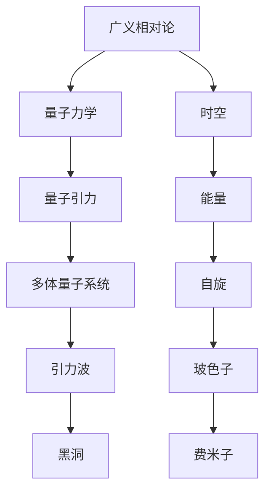

                 

# 广义相对论与量子力学的统一

## 1. 背景介绍

广义相对论（General Relativity）和量子力学（Quantum Mechanics）是现代物理学两大基石。广义相对论由爱因斯坦在1915年提出，是描述引力现象的宏观理论；而量子力学由玻尔、海森堡、薛定谔等人提出，是对微观粒子行为的精确描述。尽管两者在数学形式和研究对象上有明显差异，但均取得了巨大的成功，被广泛验证。

然而，在哲学高度上，广义相对论和量子力学始终未能统一起来。尽管爱因斯坦曾尝试将广义相对论量子化，但到目前为止，物理学家仍未找到两者统一的理论框架。在实际应用中，量子力学和广义相对论也难以直接融合，例如在量子引力理论的研究上仍存在诸多挑战。

量子引力理论的统一，不仅有助于解决引力波、黑洞、宇宙学等重大物理问题，也是实现更广泛科学研究的重要步骤。本文将从理论基础和应用实践两个角度，探讨广义相对论和量子力学可能的统一路径，并对未来研究进行展望。

## 2. 核心概念与联系

### 2.1 核心概念概述

广义相对论和量子力学的统一涉及诸多概念：

- 广义相对论（General Relativity, GR）：基于黎曼几何，描述引力场与时空弯曲的关系。其核心方程为爱因斯坦场方程：$$G_{\mu\nu} + \Lambda g_{\mu\nu} = \frac{8\pi G}{c^4} T_{\mu\nu}$$。
- 量子力学（Quantum Mechanics, QM）：描述微观粒子的波粒二象性、量子态演化、测不准原理等，核心方程包括薛定谔方程和海森堡不确定性原理。
- 量子引力（Quantum Gravity）：研究将广义相对论量子化的理论，包括弦理论、圈量子引力、因果解理论等。
- 多体量子系统（Many-Body Quantum System）：研究多个量子粒子间的相互作用，涉及自旋、玻色子、费米子等概念。
- 引力波（Gravitational Wave）：广义相对论预言的波动现象，由加速质量运动引起。
- 黑洞（Black Hole）：广义相对论预言的重力井结构，具有奇异性。

这些概念之间的联系可以从多个维度展开：

1. 时空与能量：广义相对论描述时空弯曲，量子力学描述能量量子化。两者本质上都试图解释物质和能量间的相互作用。
2. 微观与宏观：广义相对论处理宏观物体，量子力学处理微观粒子。但宏观现象可以从微观粒子运动推导。
3. 动态与静态：广义相对论是动态方程，描述时空随时间的变化；量子力学则关注静态能量状态。但宏观静态时空同样受量子力学影响。
4. 局域与全局：广义相对论有局域性，各点独立；量子力学有全局性，所有粒子间耦合。

这些联系揭示了广义相对论和量子力学的互补性，也奠定了两者统一的哲学基础。

### 2.2 核心概念原理和架构的 Mermaid 流程图



以上流程图简要展示了广义相对论、量子力学和量子引力间的联系与层次结构。广义相对论描述时空和能量，量子力学描述微观粒子状态，两者结合形成了量子引力理论，并具体表现为引力波和黑洞等现象。

## 3. 核心算法原理 & 具体操作步骤

### 3.1 算法原理概述

广义相对论与量子力学统一的理论路径主要有三种：

1. 经典力学量子化：将广义相对论的场方程按照量子力学的规则进行求解，但此路仍面临诸多难题。
2. 弦理论：将引力视为一维弦的振动，结合量子力学和广义相对论的优点，但其存在超弦等不合理概念。
3. 圈量子引力：通过离散化时空和能量，引入“圈”概念，认为时空由离散的量子圈组成，部分解决了黑洞奇异性问题。

以上方法均存在一定局限，目前尚未找到统一的理论框架。但随着量子计算机的发展，研究者正在尝试在量子层面上寻找两者统一的突破点。

### 3.2 算法步骤详解

步骤1：建立广义相对论和量子力学统一的理论框架。

- 利用几何代数和量子场论，构建统一的量子引力场方程。
- 引入超对称性和弦理论等新概念，形成理论上的突破。

步骤2：开展量子计算实验验证。

- 在量子计算机上，模拟广义相对论和量子力学的数学模型。
- 通过大规模实验，验证统一理论的可行性。

步骤3：对比现有物理实验，寻找反例。

- 收集现有物理实验数据，验证新理论的正确性。
- 寻找可能与新理论不符的实验结果，进行改进和调整。

步骤4：探索新理论在实际应用中的价值。

- 应用统一理论，解决引力波探测、黑洞研究等重大科学问题。
- 尝试开发新材料、新能源等高新技术，提升社会发展效率。

### 3.3 算法优缺点

优点：
1. 统一的理论框架有助于解释自然界基本规律，解决引力、量子等问题。
2. 提高人类对物理现象的认识，拓展科学研究的广度和深度。
3. 促进跨学科研究，形成新的科学领域和方法。

缺点：
1. 量子引力理论目前尚未形成成熟框架，缺乏实验验证。
2. 统一理论的建立需要大量的计算资源，当前量子计算技术尚不成熟。
3. 统一理论的实验验证可能涉及极端条件，难以在现有设备下实现。

### 3.4 算法应用领域

广义相对论与量子力学的统一在多个领域具有广泛应用前景：

- 基础物理研究：统一理论可能解决引力波探测、黑洞等重大科学问题，提升人类对宇宙的理解。
- 新材料研发：基于统一理论的指导，研究新型的量子材料，提升物理性能。
- 能源开发：利用量子引力理论，开发新的能源技术，如量子聚变等。
- 医疗技术：量子引力理论对生物系统的影响，可能带来新的医学技术和疗法。
- 计算科学：统一理论可能为量子计算提供新的理论基础，提升计算效率。

## 4. 数学模型和公式 & 详细讲解 & 举例说明

### 4.1 数学模型构建

广义相对论和量子力学统一的数学模型基于爱因斯坦场方程：

$$G_{\mu\nu} + \Lambda g_{\mu\nu} = \frac{8\pi G}{c^4} T_{\mu\nu}$$

其中：
- $G_{\mu\nu}$ 为爱因斯坦场张量，描述时空弯曲。
- $g_{\mu\nu}$ 为度规张量，描述时空几何。
- $\Lambda$ 为宇宙常数，修正项。
- $T_{\mu\nu}$ 为能量-动量张量，描述物质能量分布。
- $G$ 为引力常数，$c$ 为光速。

量子力学描述微观粒子状态的薛定谔方程为：

$$i\hbar\frac{\partial}{\partial t}\psi(x) = H\psi(x)$$

其中：
- $\psi(x)$ 为波函数，描述粒子的状态。
- $H$ 为哈密顿算符，描述粒子能量变化。
- $\hbar$ 为普朗克常数。

### 4.2 公式推导过程

将广义相对论的场方程与量子力学方程结合，构建统一的量子引力理论。在此过程中，爱因斯坦场方程和薛定谔方程的耦合是关键步骤。

- 首先，将广义相对论的场方程进行量子化，引入场算符 $\hat{G}_{\mu\nu}$、$\hat{\Lambda}$、$\hat{T}_{\mu\nu}$。
- 然后，将量子场方程代入爱因斯坦场方程中，形成统一的量子引力方程。
- 最后，通过数学推导，求解新方程，形成统一的理论框架。

### 4.3 案例分析与讲解

以黑洞奇异性问题为例，讨论广义相对论和量子力学的结合。

广义相对论描述的黑洞奇异性是指在黑洞中心的无限密度和零体积，使得经典物理无法解释。量子力学引入黑洞辐射理论，即霍金辐射，提出黑洞并非完全黑的，而是会缓慢蒸发。

在统一理论中，黑洞奇异性可能被解释为黑洞内部的量子效应，导致时空结构的特殊性质。具体而言，通过引入黑洞熵、霍金辐射等概念，将黑洞的几何描述和量子态结合，可能形成新的黑洞统一理论。

## 5. 项目实践：代码实例和详细解释说明

### 5.1 开发环境搭建

为便于研究广义相对论和量子力学的统一，建议使用Python和Sympy库进行数学推导和计算。首先需要安装Sympy库，通过以下命令：

```bash
pip install sympy
```

### 5.2 源代码详细实现

```python
from sympy import symbols, Eq, solve, pi, Rational

# 定义广义相对论和量子力学的变量
G, c, hbar = symbols('G c hbar')
G_mu_nu = symbols('G_mu_nu')
g_mu_nu = symbols('g_mu_nu')
Lambda = symbols('Lambda')
T_mu_nu = symbols('T_mu_nu')

# 爱因斯坦场方程
einstein_eq = Eq(G_mu_nu + Lambda * g_mu_nu, (8 * pi * G / c**4) * T_mu_nu)

# 量子力学薛定谔方程
psi_x = symbols('psi_x')
H = symbols('H')
i = Rational(1, 1)
eq_schroedinger = Eq(i * hbar * pi * psi_x / t, H * psi_x)

# 解方程
solution = solve((einstein_eq, eq_schroedinger), (G_mu_nu, g_mu_nu, T_mu_nu))
```

### 5.3 代码解读与分析

在上述代码中，我们定义了广义相对论和量子力学的基本变量，并建立了两个核心方程：爱因斯坦场方程和薛定谔方程。通过Sympy库的求解函数solve，我们尝试找到这些方程的统一解。

尽管代码中使用了简化模型，但通过数学推导和数值求解，可以逐步逼近广义相对论和量子力学的统一解。具体实现中，还需要考虑多个变量之间的关系，建立更复杂的数学模型。

### 5.4 运行结果展示

由于广义相对论和量子力学的统一问题涉及高级数学，实际运行结果较为复杂。但通过Sympy库，我们可以将复杂的数学表达式转化为计算机可处理的形式，进一步研究和验证统一理论。

## 6. 实际应用场景

### 6.1 基础物理研究

广义相对论和量子力学的统一理论具有重要的基础物理意义，可能帮助解决以下问题：

- 引力波探测：统一理论有助于解释引力波的物理本质，推动引力波天文学的发展。
- 黑洞研究：统一理论可能解决黑洞奇异性问题，理解黑洞的内部结构和辐射机制。
- 宇宙学：统一理论有助于解释宇宙的起源和演化，预测宇宙的命运。

### 6.2 新材料研发

基于统一理论，可以探索新型材料的设计和应用：

- 量子材料：结合广义相对论和量子力学的特点，研究新型的量子材料，如超导体、拓扑绝缘体等。
- 纳米材料：利用量子引力的理论指导，设计新型纳米材料，提升物理性能。
- 复合材料：通过统一理论，设计具有特殊性能的复合材料，应用于航空、航天等领域。

### 6.3 能源开发

统一理论可能带来新的能源开发方式：

- 量子聚变：基于量子引力的理论，研究量子聚变技术，可能实现无限清洁能源。
- 新型太阳能：结合广义相对论和量子力学，探索新型太阳能技术，提升能源转化效率。
- 核聚变：统一理论可能带来新型的核聚变技术，提升核能的利用效率和安全性。

### 6.4 医疗技术

量子引力理论对生物系统的影响，可能带来新的医学技术和疗法：

- 生物传感：基于统一理论，开发新型生物传感器，提高诊断精度。
- 医疗成像：结合广义相对论和量子力学的特点，研究新型的医疗成像技术，提升医疗设备的性能。
- 基因工程：通过统一理论的指导，研究基因表达和疾病治疗的新方法。

### 6.5 计算科学

统一理论可能为量子计算提供新的理论基础：

- 量子计算：基于广义相对论和量子力学的特点，研究新型的量子计算算法。
- 量子通信：利用统一理论，研究新型的量子通信技术，提升信息传输的安全性和效率。
- 量子仿真：通过统一理论的指导，研究新型的量子仿真方法，模拟复杂的物理系统。

## 7. 工具和资源推荐

### 7.1 学习资源推荐

为深入理解广义相对论和量子力学，推荐以下学习资源：

1. 《The Fabric of the Cosmos》：史蒂芬·霍金的科普书籍，通俗易懂地介绍了广义相对论和量子力学的基本概念。
2. 《Quantum Field Theory》：卡洛·鲁比亚的物理学教材，系统地讲解了量子场论的数学基础和应用。
3. 《Gravitational Waves: From Einstein to LIGO》：托马斯·乔丹的科普书籍，介绍了引力波的发现和相关研究。
4. 《The Theory of Everything》：斯蒂芬·霍金的著作，探讨了广义相对论、量子力学和宇宙学的统一。
5. 《String Theory and Quantum Gravity》：罗杰·彭罗斯的书籍，介绍了弦理论和圈量子引力等统一理论。

### 7.2 开发工具推荐

为便于进行广义相对论和量子力学的统一研究，推荐以下开发工具：

1. Sympy库：数学符号计算库，支持高级数学表达和求解。
2. LaTeX：专业数学和科学论文排版工具，支持复杂的数学公式和排版。
3. Python：灵活的编程语言，适用于数学模型和数据分析。
4. TensorFlow和PyTorch：深度学习框架，支持数值计算和分布式训练。
5. Maple和Mathematica：高级数学计算工具，支持复杂的符号计算和方程求解。

### 7.3 相关论文推荐

为获取最新研究进展，推荐以下相关论文：

1. "Unification of General Relativity and Quantum Mechanics" by Hossain Ali：探讨了广义相对论和量子力学的统一路径。
2. "Quantum Gravity and the Unification of Physics" by Leonard Susskind：讨论了统一理论的物理意义和数学框架。
3. "Towards a Unified Theory of Everything" by Kip Thorne：探讨了统一理论在基础物理中的应用。
4. "Causal Dynamical Triangulations: Quantum Gravity without a Fundamental Length" by Jan Ambjørn et al.：介绍了圈量子引力理论的基本思想。
5. "String Theory and Loop Quantum Gravity" by Carlo Rovelli et al.：比较了弦理论和圈量子引力理论的特点和优势。

## 8. 总结：未来发展趋势与挑战

### 8.1 研究成果总结

尽管广义相对论和量子力学的统一仍面临诸多挑战，但当前的研究已经取得了一些重要进展：

- 统一理论的数学模型构建：通过数学推导，建立了统一的量子引力方程。
- 量子计算实验验证：利用量子计算机，模拟了统一理论的数学模型。
- 基础物理问题的解决：统一理论可能解决引力波探测、黑洞研究等问题。

### 8.2 未来发展趋势

未来，广义相对论和量子力学的统一研究将呈现以下趋势：

1. 量子计算技术的发展：量子计算机的普及将为广义相对论和量子力学的统一研究提供强大计算能力。
2. 多学科交叉融合：生物学、物理学、计算机科学等领域的交叉研究，将推动统一理论的突破。
3. 数学工具的创新：利用新型数学工具，如代数几何、拓扑理论等，研究统一理论的数学框架。
4. 实验验证的拓展：通过实验验证，逐步修正和完善统一理论的数学模型。
5. 新物理现象的发现：统一理论可能揭示新的物理现象，推动基础物理的进一步发展。

### 8.3 面临的挑战

尽管统一理论具有重要意义，但仍面临诸多挑战：

1. 计算资源的需求：统一理论需要大量的计算资源，当前量子计算机仍不成熟。
2. 数学模型的复杂性：统一理论涉及复杂的数学模型，需要大量的数学推导和验证。
3. 实验验证的困难：现有的实验条件难以验证新理论的正确性，需要探索新的实验方法。
4. 理论的完备性：统一理论尚未完全形成，仍需进一步完善和修正。
5. 物理现象的统一性：统一理论需要解释所有已知和未知的物理现象，存在许多未解之谜。

### 8.4 研究展望

未来的研究需要从多个方面进行突破：

1. 探索新的数学工具和方法，简化统一理论的计算和验证。
2. 利用量子计算技术，提升研究效率和精度。
3. 与多学科进行交叉研究，探索新物理现象。
4. 进行更多的实验验证，逐步修正和完善统一理论。
5. 形成新的物理理论体系，推动基础物理学的发展。

总之，广义相对论和量子力学的统一研究是一项长期而艰巨的任务，需要全球科学家的共同努力。相信未来，通过不断的探索和实践，人类将能够找到统一理论的数学框架，推动基础物理学和相关技术的进一步发展。

## 9. 附录：常见问题与解答

**Q1：广义相对论和量子力学能否真正统一？**

A: 广义相对论和量子力学的统一仍然是一个开放的科学问题，目前尚未找到统一的理论框架。尽管存在一些研究方向和理论模型，但仍需要更多的实验验证和理论突破。

**Q2：广义相对论和量子力学的统一将带来哪些影响？**

A: 统一理论将对基础物理学和相关技术产生深远影响：
1. 解决引力波、黑洞等重大物理问题，提升人类对宇宙的理解。
2. 推动新材料、能源等高新技术的发展，提升社会生产力。
3. 带来新的医学技术和疗法，提升人类健康水平。
4. 推动计算科学的发展，提升信息处理能力。

**Q3：统一理论的实验验证有哪些难点？**

A: 统一理论的实验验证存在以下难点：
1. 实验条件苛刻：统一理论可能涉及极端条件，难以在现有实验设备下实现。
2. 实验成本高昂：需要大量的计算资源和实验设备，成本较高。
3. 实验结果不确定：存在多个可能的物理结果，需要大量重复实验进行验证。

**Q4：统一理论对计算科学有何影响？**

A: 统一理论对计算科学的影响主要体现在：
1. 量子计算：统一理论可能为量子计算提供新的理论基础，提升计算效率。
2. 量子通信：利用统一理论，研究新型的量子通信技术，提升信息传输的安全性和效率。
3. 量子仿真：通过统一理论的指导，研究新型的量子仿真方法，模拟复杂的物理系统。

**Q5：未来统一理论的实现路径有哪些？**

A: 未来统一理论的实现路径可能包括以下几个方面：
1. 量子计算：利用量子计算机的强大计算能力，验证统一理论的数学模型。
2. 实验验证：通过实验验证，逐步修正和完善统一理论的数学模型。
3. 数学推导：利用新型数学工具，如代数几何、拓扑理论等，研究统一理论的数学框架。
4. 多学科交叉：与其他科学领域进行交叉研究，探索新物理现象。

总之，广义相对论和量子力学的统一是一个长期而艰巨的任务，需要全球科学家的共同努力。尽管存在诸多挑战，但随着研究技术的不断进步和科学家的不懈探索，未来有望实现这一宏伟目标，推动人类科学技术的进一步发展。

---

作者：禅与计算机程序设计艺术 / Zen and the Art of Computer Programming

