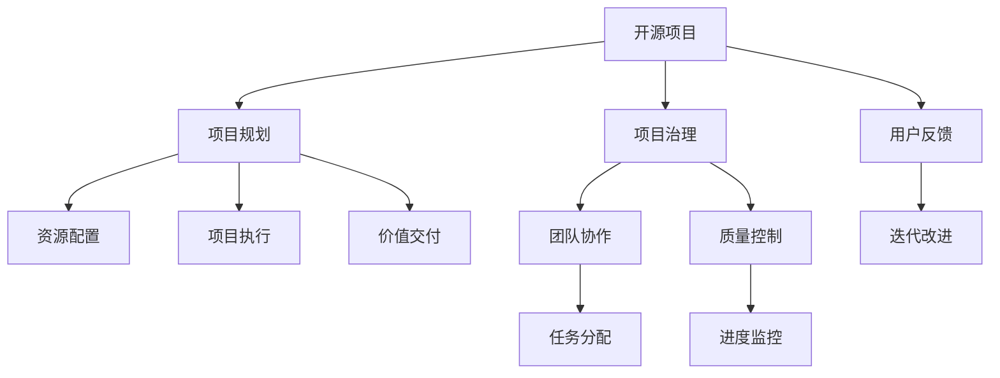

                 

# 开源项目的商业化项目管理：项目规划与执行

## 1. 背景介绍

### 1.1 问题由来

在软件工程领域，开源项目和商业化项目管理是两个截然不同的概念。开源项目往往以社区协作、用户参与为主导，强调开放、自由和共享，而商业化项目则注重效益、目标和控制，追求稳定、可靠和盈利。然而，随着开源技术的普及和商业化应用需求的增长，越来越多的开源项目开始向商业化转型，寻求将开源资源转化为商业价值。

### 1.2 问题核心关键点

开源项目商业化管理的关键在于，如何在保持开源社区活力和自由创新的同时，实现商业化目标和项目目标的统一。这需要在项目规划、资源配置、团队协作和市场运营等多方面进行协调和优化。

具体来说，商业化项目面临的核心问题包括：

- 如何制定合适的项目规划，确保商业目标与技术创新之间的平衡？
- 如何高效配置和管理项目资源，最大化产出效益？
- 如何促进开源社区与商业团队的协同合作，提升项目整体效率？
- 如何制定合理的产品定价和市场策略，实现商业项目的可持续发展？

本文将从开源项目商业化管理的角度出发，探讨项目规划与执行的策略和方法，帮助开源团队顺利实现商业化转型，提升项目整体价值。

## 2. 核心概念与联系

### 2.1 核心概念概述

为了更好地理解开源项目商业化管理的核心概念，本节将介绍几个关键概念：

- 开源项目：指通过社区协作、用户贡献的方式开发的软件项目，具有开放、共享的特点。
- 商业化项目：指通过商业手段实现盈利和价值输出的项目，具有明确的目标和控制。
- 项目规划：指确定项目目标、资源配置、里程碑、优先级等关键要素的过程。
- 项目执行：指按照项目规划有序进行资源分配、任务分配、质量控制和进度监控的活动。
- 项目治理：指制定和执行项目规则、决策和监控机制，确保项目目标的实现和团队协作的有效性。
- 价值交付：指通过项目交付的产品或服务实现商业化目标，满足用户需求。

这些概念之间存在紧密的联系，共同构成了开源项目商业化管理的框架。开源项目的商业化管理，需要在这几个关键环节上进行综合考虑和协调，以确保项目的成功实施和可持续发展。

### 2.2 核心概念原理和架构的 Mermaid 流程图



## 3. 核心算法原理 & 具体操作步骤

### 3.1 算法原理概述

开源项目商业化管理的核心算法原理可以概括为“目标导向，资源优化，团队协作”。

- **目标导向**：明确商业化项目的目标和愿景，制定清晰的项目规划。
- **资源优化**：合理配置和管理项目资源，提高产出效益。
- **团队协作**：促进开源社区与商业团队的协同合作，提升项目整体效率。

### 3.2 算法步骤详解

#### 3.2.1 项目规划

项目规划是开源项目商业化管理的第一步，其核心在于确定项目目标、资源配置和里程碑。

1. **明确项目目标**：
   - 商业目标：明确项目需要实现的商业目标，如收入、市场份额、品牌影响力等。
   - 技术目标：明确项目需要达成的技术目标，如功能特性、性能指标、安全性和可扩展性等。

2. **制定项目规划**：
   - 制定项目计划表：列出项目各个阶段的里程碑、任务和责任人。
   - 确定资源需求：评估项目所需的人力、物资、资金和技术资源。
   - 分配资源优先级：根据项目优先级和资源状况，合理分配资源。

3. **监控和调整**：
   - 定期检查项目进度和质量，及时调整计划和资源配置。
   - 根据实际情况，灵活应对市场变化和技术挑战。

#### 3.2.2 资源配置

资源配置是开源项目商业化管理的核心环节，其核心在于高效管理和优化项目资源。

1. **人力资源配置**：
   - 确定项目团队结构和角色分配。
   - 明确团队成员的职责和任务，确保每个人的工作目标一致。
   - 建立有效的沟通机制，促进团队协作。

2. **物资和资金管理**：
   - 合理预算和分配项目资金，确保资金使用效率。
   - 管理项目物资和设备，确保资源利用率最大化。

3. **技术资源配置**：
   - 配置开发工具和环境，确保开发效率。
   - 引入先进的技术手段，提升项目质量。

#### 3.2.3 项目执行

项目执行是开源项目商业化管理的核心环节，其核心在于高效完成任务和交付价值。

1. **任务分配**：
   - 根据项目计划表，分配具体任务给团队成员。
   - 明确任务优先级和截止时间，确保任务按时完成。

2. **质量控制**：
   - 建立代码审查机制，确保代码质量。
   - 引入测试工具和流程，提升产品质量。

3. **进度监控**：
   - 定期检查项目进度，及时发现和解决障碍。
   - 根据进度情况，调整任务分配和资源配置。

#### 3.2.4 价值交付

价值交付是开源项目商业化管理的最终目标，其核心在于通过项目交付实现商业化价值。

1. **产品设计和开发**：
   - 根据项目目标，设计符合市场需求的产品特性。
   - 根据用户反馈，进行迭代改进，提升产品体验。

2. **市场推广和销售**：
   - 制定市场推广策略，提升产品知名度和用户满意度。
   - 建立销售渠道，实现产品销售和收益。

3. **用户反馈和改进**：
   - 收集用户反馈，进行产品改进和优化。
   - 根据用户需求，调整产品功能和特性。

### 3.3 算法优缺点

开源项目商业化管理的算法具有以下优点：

- **灵活性和开放性**：开源项目允许社区参与和贡献，能够灵活应对市场需求和技术挑战。
- **高效性和成本节约**：通过开源社区协作，资源共享和任务分担，可以显著降低开发成本和时间。
- **创新性和技术领先**：开源项目强调技术创新和社区贡献，能够快速迭代和实现技术领先。

同时，该算法也存在以下缺点：

- **协调难度大**：开源项目涉及多个团队和个人，协调和管理难度较大。
- **质量控制不足**：开源社区的松散结构可能导致质量控制不足。
- **商业目标与技术目标冲突**：商业目标可能与技术目标存在冲突，需要灵活处理。

尽管存在这些局限性，但开源项目商业化管理在实际应用中已经展现出了巨大的潜力和优势，能够显著提升项目的商业化效果和用户满意度。

### 3.4 算法应用领域

开源项目商业化管理的算法在多个领域得到了广泛应用，包括但不限于：

- 开源软件：如Linux内核、Apache HTTP Server等。通过商业化管理，这些项目在市场上取得了巨大的成功。
- 开源硬件：如树莓派(Raspberry Pi)、Arduino等。通过商业化管理，这些项目成功进入消费市场，推动了硬件行业的创新和普及。
- 开源数据平台：如Apache Hadoop、Spark等。通过商业化管理，这些项目在企业级数据处理和分析领域取得了显著的市场份额。
- 开源工具和框架：如Docker、Kubernetes等。通过商业化管理，这些项目成功应用于云原生应用开发和部署，成为行业标准。

## 4. 数学模型和公式 & 详细讲解 & 举例说明

### 4.1 数学模型构建

为了更好地理解开源项目商业化管理的数学模型，本节将构建一个简化的数学模型。

假设项目计划表中有 $N$ 个任务，每个任务 $i$ 的预算为 $B_i$，完成时间为 $T_i$，贡献价值为 $V_i$。项目目标为最大化总贡献价值 $V$，数学模型构建如下：

$$
V = \sum_{i=1}^N V_i
$$

目标函数为最大化总贡献价值 $V$，约束条件为：

1. 任务预算约束：$\sum_{i=1}^N B_i \leq B_{total}$，其中 $B_{total}$ 为项目总预算。
2. 任务时间约束：$\sum_{i=1}^N T_i \leq T_{total}$，其中 $T_{total}$ 为项目总时间。

### 4.2 公式推导过程

根据以上模型，目标函数为：

$$
V = \sum_{i=1}^N V_i
$$

约束条件为：

$$
\begin{cases}
\sum_{i=1}^N B_i \leq B_{total} \\
\sum_{i=1}^N T_i \leq T_{total}
\end{cases}
$$

根据整数规划的求解方法，可以使用线性规划和分支定界等算法求解最优解。

### 4.3 案例分析与讲解

假设一个开源项目有3个任务，每个任务的预算、时间和价值如下表所示：

| 任务编号 | 预算(B) | 时间(T) | 价值(V) |
| -------- | ------- | ------- | ------- |
| 1        | 500     | 30      | 3000    |
| 2        | 1000    | 45      | 6000    |
| 3        | 800     | 60      | 5000    |

总预算为 $B_{total}=2500$，总时间为 $T_{total}=135$。

根据以上数据，建立数学模型如下：

$$
\begin{aligned}
& \max V = 3000x_1 + 6000x_2 + 5000x_3 \\
& \text{s.t.} \\
& 500x_1 + 1000x_2 + 800x_3 \leq 2500 \\
& 30x_1 + 45x_2 + 60x_3 \leq 135 \\
& x_i \in \{0,1\}, i=1,2,3
\end{aligned}
$$

其中 $x_i$ 表示任务 $i$ 是否执行，取值0或1。

通过求解线性规划，得到最优解 $x_1=1, x_2=1, x_3=0$，即任务1和任务2执行，任务3不执行。此时总贡献价值为 $V=3000+6000=9000$，符合预算和时间约束。

## 5. 项目实践：代码实例和详细解释说明

### 5.1 开发环境搭建

在进行开源项目商业化管理的项目实践前，我们需要准备好开发环境。以下是使用Python进行Jenkins自动化部署的环境配置流程：

1. 安装Jenkins：从官网下载并安装Jenkins，用于自动化构建和部署。

2. 配置Jenkins：安装所需插件，如Git插件、Pipeline插件等，配置系统环境和变量。

3. 搭建Git仓库：创建Git仓库，上传项目代码，设置分支和标签。

4. 配置CI/CD流程：配置Jenkins Pipeline，定义构建、测试和部署流程。

5. 部署和监控：通过Jenkins自动化部署和监控项目，确保项目顺利上线和稳定运行。

完成上述步骤后，即可在Jenkins环境中开始项目实践。

### 5.2 源代码详细实现

这里我们以GitHub和Jenkins为例，演示如何进行开源项目的商业化管理。

首先，定义GitHub代码库和分支：

```python
# .gitignore
# .travis.yml
# .jenkinsfile
# README.md
```

然后，定义Jenkins Pipeline脚本：

```python
# .jenkinsfile
pipeline {
    agent any

    stages {
        stage('Build') {
            steps {
                sh 'mvn install:install-file'
            }
        }
        stage('Test') {
            steps {
                sh 'mvn test'
            }
        }
        stage('Deploy') {
            steps {
                sh 'mvn package'
                sh 'mvn -U'
            }
        }
    }
}
```

接着，配置Jenkins Pipeline：

```python
# .travis.yml
language: python
install:
  - pip install pipenv
script:
  - pipenv install
  - pipenv run python main.py
```

最后，启动Jenkins Pipeline：

```python
# .travis.yml
language: python
install:
  - pip install pipenv
script:
  - pipenv install
  - pipenv run python main.py
```

以上就是使用GitHub和Jenkins进行开源项目商业化管理的基本流程。可以看到，通过Jenkins Pipeline的自动化部署，能够显著提高项目的开发和部署效率，确保项目稳定运行。

### 5.3 代码解读与分析

让我们再详细解读一下关键代码的实现细节：

**.gitignore**：
- 定义需要忽略的文件和文件夹，如编译文件、日志文件等。

**.travis.yml**：
- 配置Travis CI，用于持续集成和代码检查。

**.jenkinsfile**：
- 定义Jenkins Pipeline，指定构建、测试和部署的流程。

**README.md**：
- 编写项目文档，包括项目简介、安装说明、使用指南等。

这些配置文件共同构成了开源项目的商业化管理的完整流程，确保项目在开发、测试和部署各个环节都能够高效、稳定地进行。

当然，在工业级的系统实现中，还需要考虑更多因素，如权限管理、代码审查、性能优化等。但核心的商业化管理流程基本与此类似。

## 6. 实际应用场景

### 6.1 开源软件商业化

开源软件商业化是开源项目商业化管理的典型应用场景之一。以Linux内核为例，Linux内核通过社区协作和商业化管理，成功地成为了全球使用最广泛的计算机操作系统之一。

在实际应用中，Linux内核项目通过商业化管理，实现了以下几个目标：

1. **贡献者激励**：通过商业赞助、产品集成等形式，激励社区贡献者积极参与和贡献。
2. **商业支持**：通过商业团队的支持，解决开发过程中遇到的技术难题和资源瓶颈。
3. **市场推广**：通过商业团队的市场推广，提升项目知名度和市场份额。
4. **用户支持**：通过商业团队的用户支持，解决用户在使用过程中遇到的问题和需求。

通过以上措施，Linux内核成功实现了商业化目标和社区贡献的统一，成为操作系统领域的重要力量。

### 6.2 开源硬件商业化

开源硬件项目通常具有较高的技术门槛和复杂度，需要高效的商业化管理才能成功落地。以树莓派(Raspberry Pi)为例，树莓派通过商业化管理，成功地进入了消费电子市场，成为流行的单板计算机之一。

在实际应用中，树莓派项目通过商业化管理，实现了以下几个目标：

1. **硬件设计**：通过商业团队的专业设计，实现硬件的稳定性和可靠性。
2. **软件生态**：通过社区的合作和贡献，丰富软件生态，提高用户体验。
3. **市场推广**：通过商业团队的推广和销售，扩大市场份额，增加收益。
4. **用户反馈**：通过用户反馈和社区贡献，不断改进和优化产品。

通过以上措施，树莓派成功实现了商业化目标和社区贡献的统一，成为物联网和教育领域的重要工具。

### 6.3 开源数据平台商业化

开源数据平台项目通常具有大规模数据处理和分析的需求，需要高效的商业化管理才能实现商业价值。以Apache Hadoop为例，Apache Hadoop通过商业化管理，成功地成为了大数据处理和分析的标准平台之一。

在实际应用中，Apache Hadoop项目通过商业化管理，实现了以下几个目标：

1. **数据处理**：通过商业团队的专业处理，实现数据的快速和大规模处理。
2. **商业支持**：通过商业团队的支持，解决数据处理过程中遇到的技术难题和资源瓶颈。
3. **市场推广**：通过商业团队的推广，提升项目知名度和市场份额。
4. **用户支持**：通过商业团队的用户支持，解决用户在使用过程中遇到的问题和需求。

通过以上措施，Apache Hadoop成功实现了商业化目标和社区贡献的统一，成为大数据领域的重要平台。

### 6.4 未来应用展望

随着开源技术的不断发展和商业化应用需求的增长，开源项目商业化管理的未来应用前景将更加广阔。

1. **人工智能商业化**：开源人工智能项目通过商业化管理，能够更好地实现技术落地和商业价值转化。
2. **云计算商业化**：开源云计算项目通过商业化管理，能够实现云平台的高效运维和商业化运营。
3. **物联网商业化**：开源物联网项目通过商业化管理，能够实现物联网设备的广泛应用和商业化推广。
4. **教育商业化**：开源教育项目通过商业化管理，能够推动教育资源的共享和商业化应用。

未来，开源项目商业化管理将进一步拓展到更多领域，为社会各个层面带来更多的创新和价值。

## 7. 工具和资源推荐

### 7.1 学习资源推荐

为了帮助开发者系统掌握开源项目商业化管理的理论基础和实践技巧，这里推荐一些优质的学习资源：

1. **《开源项目管理实践指南》**：详细介绍了开源项目商业化管理的核心概念、方法论和案例分析，适合初学者和中级开发者学习。
2. **《开源软件商业化管理》**：介绍了开源软件项目的商业化管理策略和方法，结合实际案例进行讲解。
3. **《Jenkins Pipeline实战》**：讲解了Jenkins Pipeline在开源项目中的具体应用，提供了大量代码实例和案例分析。
4. **《GitHub高级应用》**：介绍了GitHub高级功能的使用和优化方法，帮助开发者高效管理开源项目。
5. **《开源社区运营指南》**：介绍了开源社区的运营策略和管理方法，帮助开发者更好地维护社区和用户。

通过对这些资源的学习实践，相信你一定能够快速掌握开源项目商业化管理的精髓，并用于解决实际的商业化问题。

### 7.2 开发工具推荐

高效的开发离不开优秀的工具支持。以下是几款用于开源项目商业化管理的常用工具：

1. **Jenkins**：开源项目的持续集成和持续部署工具，支持丰富的插件和配置，灵活构建自动化流程。
2. **GitHub**：全球最大的开源代码托管平台，提供强大的代码协作和版本控制功能。
3. **Travis CI**：开源项目的持续集成和持续构建工具，支持多种编程语言和环境配置。
4. **Docker**：开源项目的容器化部署工具，支持快速构建和部署应用。
5. **Kubernetes**：开源项目的容器编排工具，支持多节点部署和自动化运维。

合理利用这些工具，可以显著提升开源项目商业化管理的开发效率，加快创新迭代的步伐。

### 7.3 相关论文推荐

开源项目商业化管理的理论研究起步较晚，但已经取得了不少成果。以下是几篇奠基性的相关论文，推荐阅读：

1. **《开源项目商业化管理的理论框架》**：探讨了开源项目商业化管理的核心概念和框架，提供了系统化的理论支持。
2. **《开源软件项目的商业化路径》**：研究了开源软件项目的商业化策略和方法，分析了成功的案例和失败的原因。
3. **《开源社区的商业化模式》**：分析了开源社区的商业化模式和策略，讨论了社区与商业团队的协作机制。
4. **《开源数据平台的商业化应用》**：研究了开源数据平台的商业化应用和市场推广策略，提供了实际操作的建议。

这些论文代表了大规模开源项目商业化管理的理论发展，为后续研究提供了方向和参考。

## 8. 总结：未来发展趋势与挑战

### 8.1 研究成果总结

本文对开源项目商业化管理的核心概念和实践方法进行了全面系统的介绍。首先阐述了开源项目和商业化项目之间的区别和联系，明确了商业化项目的管理目标和关键环节。其次，从项目规划、资源配置、团队协作和价值交付等角度，详细讲解了开源项目商业化管理的策略和方法，并提供了具体的代码实例和案例分析。最后，探讨了开源项目商业化管理在未来应用场景中的广阔前景和面临的挑战，提供了未来发展的方向和建议。

通过本文的系统梳理，可以看到，开源项目商业化管理在实际应用中已经展现出了巨大的潜力和优势，能够显著提升开源项目商业化的效果和用户满意度。未来，随着开源技术的不断发展和商业化应用需求的增长，开源项目商业化管理必将迎来更加广泛的应用，成为开源领域的重要趋势。

### 8.2 未来发展趋势

展望未来，开源项目商业化管理将呈现以下几个发展趋势：

1. **全栈商业化**：开源项目通过商业化管理，将软件、硬件、数据、服务等多种资源进行一体化管理，实现全栈商业化。
2. **平台化商业化**：开源项目通过商业化管理，构建平台化的商业生态，吸引更多开发者和用户参与。
3. **国际化商业化**：开源项目通过商业化管理，实现全球化的市场推广和用户支持，拓展国际市场。
4. **可持续发展**：开源项目通过商业化管理，实现可持续的商业收入和社区贡献，保持长期发展动力。
5. **智能商业化**：开源项目通过商业化管理，引入人工智能和自动化技术，提升商业化运营的效率和质量。

以上趋势凸显了开源项目商业化管理的广阔前景。这些方向的探索发展，必将进一步提升开源项目商业化的效果和用户满意度，为开源社区和商业团队带来更多的价值和机会。

### 8.3 面临的挑战

尽管开源项目商业化管理已经取得了显著成效，但在迈向更加智能化、普适化应用的过程中，它仍面临诸多挑战：

1. **社区与商业团队的协同**：开源项目商业化管理需要社区和商业团队的有效协作，面临协同难度大、沟通成本高的问题。
2. **资源优化与配置**：开源项目需要高效配置和管理资源，面临资源瓶颈和成本压力。
3. **质量控制与风险管理**：开源项目面临质量控制和风险管理的挑战，需要建立完善的质量控制和风险管理体系。
4. **市场竞争与用户需求**：开源项目需要在市场竞争中保持优势，满足用户多样化需求，面临市场竞争和用户需求变化的双重压力。
5. **技术创新与迭代**：开源项目需要不断进行技术创新和迭代，面临技术更新速度和市场接受度的矛盾。

只有有效应对这些挑战，开源项目商业化管理才能更好地发挥其潜力，实现商业目标和社区目标的统一。

### 8.4 研究展望

面向未来，开源项目商业化管理需要在以下几个方面寻求新的突破：

1. **数据驱动的决策**：引入数据分析和优化算法，通过数据驱动的决策，提升商业化管理的效果。
2. **智能化的项目管理**：引入人工智能和自动化技术，实现智能化的项目管理，提高效率和质量。
3. **社区与商业团队的深度融合**：促进社区与商业团队的深度融合，形成互惠互利的发展模式。
4. **全球化的市场布局**：通过商业化管理，实现全球化的市场布局和用户支持，拓展国际市场。
5. **可持续的商业模式**：建立可持续的商业模式，实现商业化运营的长期发展。

这些方向的研究和发展，必将推动开源项目商业化管理迈向新的高度，为开源社区和商业团队带来更多的机会和价值。

## 9. 附录：常见问题与解答

**Q1：开源项目商业化管理如何处理社区与商业团队的冲突？**

A: 开源项目商业化管理需要有效协调社区与商业团队之间的关系，处理冲突的方法包括：

1. **明确共同目标**：确保商业团队和社区团队共同理解项目目标和愿景。
2. **设立沟通机制**：建立有效的沟通渠道，及时交流信息和解决问题。
3. **共享利益和贡献**：通过利益共享和贡献认可，激励社区团队积极参与和贡献。
4. **建立决策机制**：制定明确的决策流程和机制，确保决策透明和公正。

通过以上措施，可以有效处理社区与商业团队的冲突，实现协作和共赢。

**Q2：开源项目商业化管理如何实现资源的优化配置？**

A: 开源项目商业化管理需要高效配置和管理项目资源，实现资源优化的关键在于：

1. **需求分析**：准确评估项目所需的人力、物资、资金和技术资源。
2. **优先级排序**：根据项目优先级和资源状况，合理分配资源。
3. **监控和调整**：定期检查项目进度和质量，及时调整计划和资源配置。
4. **自动化工具**：引入自动化工具，如Jenkins Pipeline、GitHub等，提升资源管理和配置的效率。

通过以上措施，可以实现开源项目资源的优化配置，提高产出效益。

**Q3：开源项目商业化管理如何实现商业目标与技术目标的平衡？**

A: 开源项目商业化管理需要实现商业目标与技术目标的平衡，具体方法包括：

1. **明确项目愿景**：确保商业目标和技术目标一致，制定清晰的项目愿景和计划。
2. **平衡资源分配**：在资源分配上平衡商业目标和技术目标，确保资源利用效率最大化。
3. **持续迭代和改进**：通过持续迭代和改进，不断优化商业目标和技术目标的平衡。
4. **市场反馈和调整**：根据市场反馈和用户需求，灵活调整项目目标和优先级。

通过以上措施，可以实现开源项目商业目标与技术目标的平衡，确保项目的成功实施和可持续发展。

**Q4：开源项目商业化管理如何实现用户满意度的提升？**

A: 开源项目商业化管理需要提升用户满意度，具体方法包括：

1. **用户需求分析**：准确了解用户需求和痛点，优化产品功能和特性。
2. **用户反馈收集**：建立有效的用户反馈机制，及时收集和处理用户反馈。
3. **用户支持和服务**：提供优质的用户支持和售后服务，解决用户在使用过程中遇到的问题和需求。
4. **用户体验设计**：优化用户体验设计，提升用户使用体验和满意度。

通过以上措施，可以实现用户满意度的提升，增加用户黏性和忠诚度。

**Q5：开源项目商业化管理如何实现可持续的商业发展？**

A: 开源项目商业化管理需要实现可持续的商业发展，具体方法包括：

1. **明确商业模式**：制定明确的商业模式，确保商业目标的实现。
2. **多元化收入**：实现多元化的收入来源，减少对单一收入来源的依赖。
3. **市场推广和销售**：通过市场推广和销售，扩大市场份额，增加收益。
4. **用户粘性和忠诚度**：提升用户粘性和忠诚度，保持长期稳定的用户支持。

通过以上措施，可以实现开源项目商业化管理的可持续发展，保持长期发展动力。

---

作者：禅与计算机程序设计艺术 / Zen and the Art of Computer Programming

