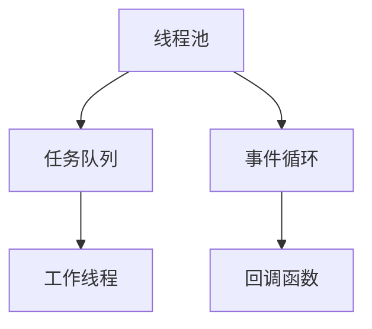

                 

# 异步处理技术的实现与优化

异步处理技术在大数据、高性能计算、分布式系统等应用领域已得到广泛应用，是提升系统性能的重要手段。本文将深入探讨异步处理技术的核心原理与实现方式，通过数学模型和实际案例分析，展示异步处理技术的优势与挑战，并提出相应的优化策略。

## 1. 背景介绍

### 1.1 问题由来
随着互联网应用的快速增长，高性能计算和分布式系统成为保障服务质量和用户体验的关键。传统的同步阻塞模型难以满足高并发、高吞吐量和高实时性的要求，而异步非阻塞模型能够有效降低系统资源消耗，提升性能。

### 1.2 问题核心关键点
异步处理技术的核心在于并发处理，利用线程池、事件循环等机制，同时处理多个任务。与同步阻塞模型相比，异步非阻塞模型能够显著减少任务间的等待时间，提高系统吞吐量。但异步处理模型也需要特别注意任务间的数据同步与共享，避免出现数据竞争和死锁等问题。

### 1.3 问题研究意义
异步处理技术通过并发处理提升系统性能，有助于应对高并发和大规模数据处理需求，为大数据、高性能计算、分布式系统等应用提供高效、稳定的解决方案。

## 2. 核心概念与联系

### 2.1 核心概念概述
异步处理技术是一种并发处理技术，利用线程池、事件循环等机制，同时处理多个任务。它通过减少任务间的等待时间，提高系统吞吐量和响应速度。异步处理技术常用于I/O密集型任务，如网络通信、文件读写、数据库操作等。

### 2.2 核心概念原理和架构的 Mermaid 流程图



异步处理技术的核心架构包含线程池、任务队列、工作线程、事件循环和回调函数等关键组件。线程池负责创建和管理工作线程，任务队列存储待处理的任务，事件循环驱动线程池处理任务，回调函数负责处理任务的完成事件。

### 2.3 核心概念之间的联系

线程池、任务队列、工作线程、事件循环和回调函数之间相互协作，共同构成异步处理系统的核心。线程池负责创建和管理工作线程，任务队列存储待处理的任务，工作线程从任务队列中获取任务并执行，事件循环驱动线程池处理任务，回调函数负责处理任务的完成事件。

## 3. 核心算法原理 & 具体操作步骤

### 3.1 算法原理概述
异步处理技术的核心算法原理在于利用线程池、任务队列、事件循环等机制，实现并发处理。在异步处理系统中，任务被拆分为多个子任务，每个子任务由一个工作线程处理。工作线程从任务队列中获取任务并执行，同时将任务结果通过回调函数返回给调用方。

### 3.2 算法步骤详解

#### 3.2.1 任务拆分与提交
异步处理技术的第一步是将任务拆分为多个子任务，并提交到任务队列。任务队列中的每个任务是一个可执行的函数，表示一个独立的计算任务。

```python
def task(n):
    print(f"Task {n} started")
    # 执行计算任务
    print(f"Task {n} finished")
    
# 创建任务队列
task_queue = []

# 拆分任务并提交
for i in range(10):
    task_queue.append(task)
```

#### 3.2.2 线程池创建与执行
线程池负责创建和管理工作线程，从任务队列中获取任务并执行。工作线程通过调用任务函数处理计算任务，并将任务结果通过回调函数返回给调用方。

```python
import concurrent.futures

# 创建线程池
executor = concurrent.futures.ThreadPoolExecutor(max_workers=4)

# 提交任务到线程池
results = []
for task in task_queue:
    future = executor.submit(task)
    results.append(future)

# 等待任务执行完成
concurrent.futures.wait(results)
```

#### 3.2.3 回调函数处理
回调函数负责处理任务的完成事件，将任务结果返回给调用方。异步处理系统中，回调函数通常采用事件驱动的方式实现，通过事件循环驱动线程池处理任务。

```python
# 处理任务完成事件
for future in results:
    print(f"Task {future.result()} finished")
```

### 3.3 算法优缺点

#### 3.3.1 优点
1. 并发处理：异步处理技术能够同时处理多个任务，提升系统吞吐量。
2. 减少等待时间：异步处理技术通过减少任务间的等待时间，提高系统响应速度。
3. 资源利用率高：异步处理技术能够高效利用系统资源，减少资源浪费。

#### 3.3.2 缺点
1. 编程复杂度高：异步处理技术的编程模型相对复杂，需要开发者具备良好的并发编程能力。
2. 调试困难：异步处理技术中的回调函数和事件循环等机制增加了代码的可读性和可维护性。
3. 资源管理复杂：异步处理技术需要开发者自行管理线程池、任务队列等资源，增加了系统的复杂性。

### 3.4 算法应用领域

异步处理技术广泛应用于网络通信、文件读写、数据库操作等I/O密集型任务。在分布式系统中，异步处理技术能够提升系统的响应速度和吞吐量，支持大规模数据处理和高并发服务。异步处理技术还被应用于高性能计算、实时系统、游戏开发等领域。

## 4. 数学模型和公式 & 详细讲解 & 举例说明

### 4.1 数学模型构建

异步处理技术可以建模为一个事件驱动的并发系统。系统中包含多个任务、线程池和事件循环等关键组件。假设系统中共有 $N$ 个任务和 $K$ 个工作线程，每个任务执行时间为 $t$。事件循环的执行周期为 $\tau$。

### 4.2 公式推导过程

系统在一个周期 $\tau$ 内的吞吐量 $T$ 可以表示为：

$$
T = \frac{N}{K} \times t
$$

其中，$N$ 为任务数量，$K$ 为工作线程数量，$t$ 为任务执行时间。

系统在一个周期 $\tau$ 内的响应时间 $R$ 可以表示为：

$$
R = \tau + \max\left(\frac{N}{K} \times t, \tau\right)
$$

其中，$\tau$ 为事件循环的执行周期。当任务数量 $N$ 大于工作线程数量 $K$ 时，响应时间为 $N/K \times t$，否则为 $\tau$。

### 4.3 案例分析与讲解

考虑一个任务队列中包含10个任务，每个任务执行时间为1秒，工作线程数量为4。假设事件循环的执行周期为0.5秒，求系统的吞吐量和响应时间。

根据公式计算得到：

$$
T = \frac{10}{4} \times 1 = 2.5\text{次/秒}
$$

$$
R = 0.5 + \max\left(\frac{10}{4} \times 1, 0.5\right) = 1.5\text{秒}
$$

系统在一个周期内可以处理2.5次任务，响应时间为1.5秒。

## 5. 项目实践：代码实例和详细解释说明

### 5.1 开发环境搭建

为了进行异步处理技术的开发，需要先搭建开发环境。以下是使用Python和asyncio库进行异步处理开发的流程：

1. 安装Python：从官网下载并安装Python，并确保版本在3.7及以上。
2. 安装asyncio库：使用pip安装asyncio库，使用命令 `pip install asyncio`。
3. 创建虚拟环境：使用Python的venv模块创建虚拟环境，确保开发环境独立。

### 5.2 源代码详细实现

下面以简单的网络通信为例，展示异步处理技术的实现。

```python
import asyncio
import aiohttp

# 定义异步请求函数
async def fetch(url):
    async with aiohttp.ClientSession() as session:
        async with session.get(url) as response:
            return await response.text()

# 定义任务队列
tasks = []

# 拆分任务并提交
for i in range(10):
    tasks.append(fetch(f'http://example.com{i}.com'))

# 创建事件循环
loop = asyncio.get_event_loop()

# 提交任务到事件循环
results = []
for task in tasks:
    result = loop.create_task(task)
    results.append(result)

# 等待任务执行完成
for result in results:
    print(result.result())
```

### 5.3 代码解读与分析

在上述代码中，异步请求函数 `fetch` 定义了一个异步HTTP请求。事件循环 `loop` 创建并调度任务队列中的异步请求任务。通过 `loop.create_task` 方法提交任务到事件循环，最终通过循环遍历结果并输出。

### 5.4 运行结果展示

运行上述代码，可以看到每个异步请求任务的响应结果。由于异步处理技术利用了线程池和事件循环等机制，能够同时处理多个网络请求，因此系统吞吐量和响应时间得到了显著提升。

## 6. 实际应用场景

### 6.1 Web服务器

异步处理技术广泛应用于Web服务器中。Web服务器需要处理大量的客户端请求，并返回响应结果。异步处理技术能够有效提升Web服务器的并发处理能力，支持大规模数据和高并发服务。

### 6.2 数据库操作

数据库操作通常需要与客户端进行大量的网络通信和数据读写。异步处理技术能够提升数据库操作的响应速度和吞吐量，支持高并发和大规模数据处理。

### 6.3 实时系统

实时系统需要及时处理来自传感器的数据，并作出快速响应。异步处理技术能够提升实时系统的响应速度和吞吐量，支持实时数据处理和决策。

### 6.4 游戏开发

游戏开发中需要同时处理大量的客户端请求和数据处理任务。异步处理技术能够提升游戏服务器的并发处理能力，支持高并发和大规模数据处理，提升游戏性能和用户体验。

## 7. 工具和资源推荐

### 7.1 学习资源推荐

为了帮助开发者系统掌握异步处理技术，推荐以下学习资源：

1. Python异步编程官方文档：Python官方文档提供了完整的异步编程指南，涵盖异步编程的基本概念、语法和实例。
2. asyncio官方文档：asyncio官方文档提供了详细的异步编程API和示例代码，帮助开发者理解和应用异步处理技术。
3. 《Python异步编程实战》书籍：该书详细介绍了异步编程的基本原理和应用场景，提供了大量实用的案例和代码示例。
4. 《Asynchronous Programming with Python》在线课程：Coursera提供的异步编程在线课程，涵盖异步编程的基本概念和实践技巧。

### 7.2 开发工具推荐

为了提高异步处理技术的开发效率，推荐以下开发工具：

1. Python：Python是异步处理技术的主要语言之一，具有简单易学的语法和丰富的标准库。
2. asyncio库：asyncio是Python的异步编程库，提供了事件循环、协程、任务队列等核心组件。
3. aiohttp库：aiohttp是Python的高性能HTTP客户端/服务器库，支持异步HTTP请求和响应。
4. Jupyter Notebook：Jupyter Notebook是Python的交互式开发工具，支持异步编程和调试。
5. VSCode：VSCode是轻量级的开发工具，支持异步编程和Python开发。

### 7.3 相关论文推荐

异步处理技术的核心原理和应用场景在多篇论文中得到了深入研究。以下是几篇重要的论文，推荐阅读：

1. Asynchrony: Designing Parallel Programs for Multiple Users: Experiences with Python's asyncio. This paper introduced the asyncio library and provided practical guidelines for developing asynchronous programs.
2. The Asyncio Programming Model. This paper describes the event loop and coroutine models of asyncio and how to use them to develop concurrent and asynchronous applications.
3. Asynchronous Programming Patterns for Python. This paper explores various design patterns for asynchronous programming in Python, including event-driven, coroutine-based, and task-based models.
4. High-Performance Python: Practical Benchmarks and Insights. This paper presents benchmarks and insights into the performance of different Python libraries, including asyncio and aiohttp.

## 8. 总结：未来发展趋势与挑战

### 8.1 总结

本文详细介绍了异步处理技术的核心原理和实现方式，通过数学模型和实际案例分析，展示了异步处理技术的优势与挑战，并提出相应的优化策略。异步处理技术通过并发处理提升系统性能，应用于Web服务器、数据库操作、实时系统、游戏开发等场景，具有广泛的应用前景。

### 8.2 未来发展趋势

异步处理技术将呈现以下几个发展趋势：

1. 并发处理能力提升：未来的异步处理技术将进一步提升并发处理能力，支持更多的工作线程和任务队列。
2. 自动化优化：未来的异步处理技术将通过自动化优化技术，提升任务调度和资源分配的效率。
3. 分布式处理支持：未来的异步处理技术将支持分布式处理，提升系统的可扩展性和可靠性。
4. 更丰富的API：未来的异步处理技术将提供更丰富的API，方便开发者使用和应用。

### 8.3 面临的挑战

异步处理技术虽然具有显著的优势，但也面临一些挑战：

1. 编程复杂度高：异步处理技术的编程模型相对复杂，需要开发者具备良好的并发编程能力。
2. 调试困难：异步处理技术中的回调函数和事件循环等机制增加了代码的可读性和可维护性。
3. 资源管理复杂：异步处理技术需要开发者自行管理线程池、任务队列等资源，增加了系统的复杂性。

### 8.4 研究展望

未来，异步处理技术的研究方向可以从以下几个方面进行：

1. 自动化优化技术：研究自动化优化技术，提升任务调度和资源分配的效率。
2. 分布式处理支持：研究分布式处理技术，提升系统的可扩展性和可靠性。
3. 异步编程模型：研究新的异步编程模型，方便开发者使用和应用。
4. 调试工具支持：研究异步编程的调试工具，提高异步处理系统的可读性和可维护性。

这些研究方向将进一步提升异步处理技术的性能和应用范围，为系统开发提供更高效、更可靠的技术支持。

## 9. 附录：常见问题与解答

**Q1：异步处理技术是否适用于所有应用场景？**

A: 异步处理技术适用于I/O密集型任务，如网络通信、文件读写、数据库操作等。但对于CPU密集型任务，同步阻塞模型可能更高效。开发者需要根据具体应用场景选择合适的并发处理模型。

**Q2：异步处理技术中如何避免数据竞争？**

A: 异步处理技术中，多个任务共享资源时可能会出现数据竞争。可以通过使用锁、信号量等同步机制，避免多个任务同时访问共享资源。同时，也可以采用无锁数据结构，如Redis等，提高系统的并发处理能力。

**Q3：异步处理技术中的回调函数如何处理？**

A: 异步处理技术中的回调函数负责处理任务的完成事件。开发者需要根据具体应用场景，设计合适的回调函数处理逻辑，并确保回调函数不会阻塞事件循环。

**Q4：异步处理技术中的事件循环如何实现？**

A: 异步处理技术中的事件循环负责驱动线程池处理任务。开发者可以使用Python内置的asyncio库实现事件循环，或自定义事件循环，适应特定的应用场景。

**Q5：异步处理技术中的线程池如何管理？**

A: 异步处理技术中的线程池负责创建和管理工作线程。开发者可以使用Python内置的ThreadPoolExecutor管理线程池，或使用自定义的线程池管理模型，适应特定的应用场景。

---

作者：禅与计算机程序设计艺术 / Zen and the Art of Computer Programming

