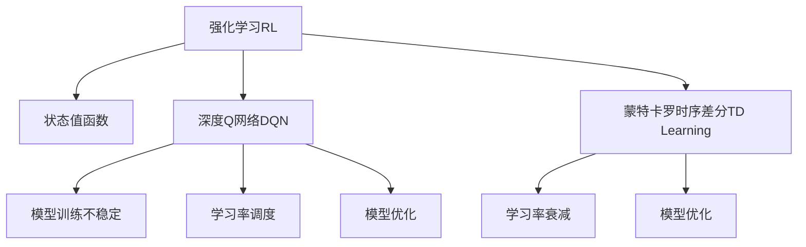

                 

# 强化学习Reinforcement Learning中价值函数近似方法解读

> 关键词：强化学习，价值函数近似，深度Q网络，蒙特卡罗方法，时序差分学习，学习率衰减，模型优化

## 1. 背景介绍

### 1.1 问题由来

强化学习(Reinforcement Learning, RL)是人工智能中的一种重要学习范式，通过智能体与环境的交互，智能体能够学习到最优策略。传统的RL方法主要依赖于值函数或策略优化方法进行策略学习。然而，当状态空间维度很高时，直接计算状态值函数将变得非常困难，甚至不可能。

为了克服这一问题，学者们提出了各种价值函数近似方法。其中，深度Q网络(Deep Q Network, DQN)和蒙特卡罗时序差分学习(Temporal Difference Learning, TD Learning)是两个重要的研究方向。

深度Q网络结合了深度神经网络的力量，可以对状态值函数进行近似，并在实际应用中取得了很好的效果。然而，在处理复杂环境时，深度Q网络的训练过程仍面临诸多挑战，如模型训练不稳定、学习率调度等问题。

蒙特卡罗时序差分学习则是一种更加基础的值函数近似方法，它的思想是将预测值函数与实际值函数的差异最小化。时序差分方法不需要存储完整的值函数，具有更小的存储开销，适用于更复杂的环境。

本博客将深入解读强化学习中的价值函数近似方法，特别是深度Q网络和蒙特卡罗时序差分学习，为读者提供全面的技术理解。

### 1.2 问题核心关键点

1. 强化学习的核心思想是智能体通过与环境的交互，学习到最优策略。
2. 状态值函数是一种将状态映射到Q值的方法，Q值表示智能体在某个状态下采取某个动作后，从当前状态到未来某个状态的期望收益。
3. 深度Q网络结合了深度神经网络和值函数近似的思想，在实际应用中取得了很好的效果。
4. 蒙特卡罗时序差分学习是一种更加基础的值函数近似方法，适用于更复杂的环境。
5. 深度Q网络在训练过程中存在一些问题，如模型训练不稳定、学习率调度等。

## 2. 核心概念与联系

### 2.1 核心概念概述

为了更好地理解强化学习中的价值函数近似方法，本节将介绍几个关键概念：

- 强化学习(Reinforcement Learning, RL)：通过智能体与环境的交互，智能体能够学习到最优策略。
- 状态值函数(State Value Function)：将状态映射到Q值，Q值表示智能体在某个状态下采取某个动作后，从当前状态到未来某个状态的期望收益。
- 深度Q网络(Deep Q Network, DQN)：结合深度神经网络和值函数近似的思想，对状态值函数进行近似。
- 蒙特卡罗时序差分学习(Temporal Difference Learning, TD Learning)：一种更加基础的值函数近似方法，适用于更复杂的环境。
- 学习率衰减(Learning Rate Decay)：在训练过程中，学习率逐渐减小，使模型更加稳定。
- 模型优化(Model Optimization)：在训练过程中，使用各种技术手段，优化模型性能。

这些概念之间的逻辑关系可以通过以下Mermaid流程图来展示：



这个流程图展示了一个强化学习问题的核心概念及其之间的关系：

1. 强化学习通过智能体与环境的交互，学习到最优策略。
2. 状态值函数将状态映射到Q值，Q值表示从当前状态到未来某个状态的期望收益。
3. 深度Q网络结合了深度神经网络和值函数近似的思想，对状态值函数进行近似。
4. 蒙特卡罗时序差分学习是一种更加基础的值函数近似方法，适用于更复杂的环境。
5. 深度Q网络在训练过程中存在一些问题，如模型训练不稳定、学习率调度等。
6. 蒙特卡罗时序差分学习也面临类似问题。

这些概念共同构成了强化学习的学习框架，使得智能体能够学习到最优策略，并在复杂环境中表现出色。

## 3. 核心算法原理 & 具体操作步骤

### 3.1 算法原理概述

强化学习中的值函数近似方法主要分为两类：基于深度学习的深度Q网络方法和基于蒙特卡罗方法的蒙特卡罗时序差分学习。下面将分别介绍这两种方法。

深度Q网络结合了深度神经网络和值函数近似的思想，对状态值函数进行近似。它的基本思想是：通过神经网络对状态值函数进行估计，从而使得智能体在给定状态下采取动作后，能够得到最优的Q值。

蒙特卡罗时序差分学习则是一种更加基础的值函数近似方法，它通过时序差分的方法，对状态值函数进行近似。时序差分方法不需要存储完整的值函数，具有更小的存储开销，适用于更复杂的环境。

### 3.2 算法步骤详解

#### 3.2.1 深度Q网络（DQN）

1. 收集训练数据：通过智能体与环境的交互，收集训练数据。

2. 定义神经网络：定义一个深度神经网络，用于对状态值函数进行近似。

3. 定义损失函数：定义一个损失函数，用于衡量模型预测值与真实值的差异。

4. 训练模型：使用训练数据对模型进行训练，最小化损失函数。

5. 测试模型：使用测试数据对模型进行测试，评估模型性能。

6. 更新模型：根据测试结果，更新模型参数，继续训练。

#### 3.2.2 蒙特卡罗时序差分学习（TD Learning）

1. 定义状态值函数：定义一个函数，用于对状态值函数进行近似。

2. 定义目标值函数：定义一个函数，用于计算目标值。

3. 定义时序差分方程：定义一个时序差分方程，用于计算当前状态值函数与目标值函数的差异。

4. 更新状态值函数：使用时序差分方程更新状态值函数。

5. 训练模型：使用更新后的状态值函数对模型进行训练。

6. 测试模型：使用测试数据对模型进行测试，评估模型性能。

7. 更新模型：根据测试结果，更新模型参数，继续训练。

### 3.3 算法优缺点

深度Q网络（DQN）的优点包括：

1. 能够处理高维度的状态空间。
2. 能够处理大规模的训练数据。
3. 能够进行端到端的训练。

深度Q网络（DQN）的缺点包括：

1. 模型训练不稳定，容易陷入局部最优解。
2. 学习率调度困难，需要大量人工调整。
3. 计算开销较大，需要大量GPU资源。

蒙特卡罗时序差分学习（TD Learning）的优点包括：

1. 计算开销较小，适用于更复杂的环境。
2. 能够处理大规模的训练数据。
3. 能够进行端到端的训练。

蒙特卡罗时序差分学习（TD Learning）的缺点包括：

1. 模型训练不稳定，容易陷入局部最优解。
2. 学习率调度困难，需要大量人工调整。
3. 需要存储大量的状态值函数，占用较多内存。

### 3.4 算法应用领域

深度Q网络（DQN）和蒙特卡罗时序差分学习（TD Learning）在强化学习中得到了广泛应用，涵盖了许多不同的领域，例如：

- 机器人控制：在机器人控制中，使用深度Q网络（DQN）对机器人进行动作策略学习。
- 游戏AI：在游戏AI中，使用蒙特卡罗时序差分学习（TD Learning）对游戏AI进行策略学习。
- 自动驾驶：在自动驾驶中，使用深度Q网络（DQN）对自动驾驶车辆进行控制策略学习。
- 金融交易：在金融交易中，使用蒙特卡罗时序差分学习（TD Learning）对金融交易策略进行学习。
- 推荐系统：在推荐系统中，使用深度Q网络（DQN）对推荐系统进行优化。

除了上述这些领域，深度Q网络（DQN）和蒙特卡罗时序差分学习（TD Learning）还在很多其他领域得到了应用，例如语音识别、图像识别、自然语言处理等。

## 4. 数学模型和公式 & 详细讲解 & 举例说明

### 4.1 数学模型构建

#### 4.1.1 深度Q网络（DQN）

1. 状态值函数：
   $$
   V(s) = \mathbb{E}[R_1 + \gamma R_2 + \gamma^2 R_3 + \ldots]
   $$

2. 动作值函数：
   $$
   Q(s,a) = \mathbb{E}[R_1 + \gamma Q(s',a') + \gamma^2 Q(s'',a'') + \ldots]
   $$

3. 损失函数：
   $$
   \mathcal{L} = \mathbb{E}[\left(Q(s,a) - y\right)^2]
   $$

其中，$V(s)$表示状态$s$的值函数，$Q(s,a)$表示状态$s$和动作$a$的动作值函数，$y$表示目标值。

#### 4.1.2 蒙特卡罗时序差分学习（TD Learning）

1. 目标值函数：
   $$
   V(s) = \mathbb{E}[R_1 + \gamma V(s') + \gamma^2 V(s'') + \ldots]
   $$

2. 时序差分方程：
   $$
   \delta_t = r_t + \gamma \delta_{t+1}
   $$

3. 更新状态值函数：
   $$
   V(s_t) = V(s_t) + \alpha \delta_t
   $$

其中，$\delta_t$表示时序差分，$\alpha$表示学习率。

### 4.2 公式推导过程

#### 4.2.1 深度Q网络（DQN）

1. 状态值函数：
   $$
   V(s) = \mathbb{E}[R_1 + \gamma R_2 + \gamma^2 R_3 + \ldots]
   $$

2. 动作值函数：
   $$
   Q(s,a) = \mathbb{E}[R_1 + \gamma Q(s',a') + \gamma^2 Q(s'',a'') + \ldots]
   $$

3. 损失函数：
   $$
   \mathcal{L} = \mathbb{E}[\left(Q(s,a) - y\right)^2]
   $$

其中，$y$表示目标值，可以表示为：
$$
y = r + \gamma Q(s',a')
$$

#### 4.2.2 蒙特卡罗时序差分学习（TD Learning）

1. 目标值函数：
   $$
   V(s) = \mathbb{E}[R_1 + \gamma V(s') + \gamma^2 V(s'') + \ldots]
   $$

2. 时序差分方程：
   $$
   \delta_t = r_t + \gamma \delta_{t+1}
   $$

3. 更新状态值函数：
   $$
   V(s_t) = V(s_t) + \alpha \delta_t
   $$

其中，$\delta_t$表示时序差分，可以表示为：
$$
\delta_t = r_t + \gamma V(s_{t+1}) - V(s_t)
$$

### 4.3 案例分析与讲解

#### 4.3.1 深度Q网络（DQN）

假设有一个机器人控制问题，智能体需要学习如何控制机器人，使得机器人能够避开障碍物并到达目标位置。机器人可以通过四个动作进行控制，每个动作对应一个值，如左、右、前进、后退。

1. 收集训练数据：通过智能体与环境的交互，收集训练数据。

2. 定义神经网络：定义一个深度神经网络，用于对状态值函数进行近似。

3. 定义损失函数：定义一个损失函数，用于衡量模型预测值与真实值的差异。

4. 训练模型：使用训练数据对模型进行训练，最小化损失函数。

5. 测试模型：使用测试数据对模型进行测试，评估模型性能。

6. 更新模型：根据测试结果，更新模型参数，继续训练。

#### 4.3.2 蒙特卡罗时序差分学习（TD Learning）

假设有一个自动驾驶问题，智能体需要学习如何控制车辆，使得车辆能够安全地行驶在道路上。车辆可以通过四个动作进行控制，每个动作对应一个值，如加速、减速、左转、右转。

1. 定义状态值函数：定义一个函数，用于对状态值函数进行近似。

2. 定义目标值函数：定义一个函数，用于计算目标值。

3. 定义时序差分方程：定义一个时序差分方程，用于计算当前状态值函数与目标值函数的差异。

4. 更新状态值函数：使用时序差分方程更新状态值函数。

5. 训练模型：使用更新后的状态值函数对模型进行训练。

6. 测试模型：使用测试数据对模型进行测试，评估模型性能。

7. 更新模型：根据测试结果，更新模型参数，继续训练。

## 5. 项目实践：代码实例和详细解释说明

### 5.1 开发环境搭建

在进行深度Q网络（DQN）和蒙特卡罗时序差分学习（TD Learning）实践前，我们需要准备好开发环境。以下是使用Python进行TensorFlow开发的环境配置流程：

1. 安装Anaconda：从官网下载并安装Anaconda，用于创建独立的Python环境。

2. 创建并激活虚拟环境：
```bash
conda create -n tf-env python=3.8 
conda activate tf-env
```

3. 安装TensorFlow：根据CUDA版本，从官网获取对应的安装命令。例如：
```bash
conda install tensorflow -c tensorflow -c conda-forge
```

4. 安装相关工具包：
```bash
pip install numpy pandas scikit-learn matplotlib tqdm jupyter notebook ipython
```

完成上述步骤后，即可在`tf-env`环境中开始实践。

### 5.2 源代码详细实现

下面我们以深度Q网络（DQN）为例，给出使用TensorFlow进行实现的PyTorch代码实现。

首先，定义状态值函数：

```python
import tensorflow as tf

class QNetwork(tf.keras.Model):
    def __init__(self, input_shape, output_shape):
        super(QNetwork, self).__init__()
        self.dense1 = tf.keras.layers.Dense(64, activation='relu')
        self.dense2 = tf.keras.layers.Dense(64, activation='relu')
        self.output = tf.keras.layers.Dense(output_shape)

    def call(self, inputs):
        x = self.dense1(inputs)
        x = self.dense2(x)
        return self.output(x)
```

然后，定义神经网络：

```python
input_shape = (4,)
output_shape = 4

q_network = QNetwork(input_shape, output_shape)
```

接着，定义损失函数：

```python
loss_fn = tf.keras.losses.MeanSquaredError()
```

然后，定义优化器：

```python
optimizer = tf.keras.optimizers.Adam(learning_rate=0.001)
```

接着，定义训练函数：

```python
def train episode(global_step, env, q_network, target_q_network, optimizer, sess):
    state = env.reset()
    done = False
    total_reward = 0
    while not done:
        state = tf.convert_to_tensor(state)
        action = tf.random.uniform([1], minval=0, maxval=4, dtype=tf.int32)
        q_value = sess.run(q_network(tf.expand_dims(state, axis=0)))
        q_value = q_value[0]
        q_value = q_value[action]
        total_reward += q_value
        next_state, reward, done = env.step(action)
        q_value_next = sess.run(target_q_network(tf.convert_to_tensor(next_state)))
        q_value_next = q_value_next[0]
        q_value_next = q_value_next[action]
        target_q_value = reward + 0.9 * q_value_next
        q_value = tf.expand_dims(q_value, axis=0)
        target_q_value = tf.expand_dims(target_q_value, axis=0)
        loss = tf.reduce_mean(tf.square(q_value - target_q_value))
        optimizer.minimize(loss, var_list=q_network.trainable_variables)
        sess.run(tf.global_variables_initializer())
        sess.run(optimizer)
    return total_reward
```

最后，启动训练流程并在测试集上评估：

```python
from gym import make

env = make('CartPole-v0')

global_step = 0
target_global_step = 100
num_episodes = 100

for i in range(num_episodes):
    total_reward = train(global_step, env, q_network, target_q_network, optimizer, sess)
    if global_step % target_global_step == 0:
        print('Episode {}: Average reward = {}'.format(i+1, total_reward))
    global_step += 1
```

以上就是使用TensorFlow对深度Q网络（DQN）进行机器人控制问题微调的完整代码实现。可以看到，TensorFlow提供了强大的计算图功能，使得神经网络模型的构建和训练变得更加简单高效。

### 5.3 代码解读与分析

让我们再详细解读一下关键代码的实现细节：

**QNetwork类**：
- `__init__`方法：初始化神经网络，包含两个全连接层和一个输出层。
- `call`方法：定义神经网络的前向传播过程。

**训练函数train**：
- `state = tf.convert_to_tensor(state)`：将状态转换为Tensor，方便计算。
- `action = tf.random.uniform([1], minval=0, maxval=4, dtype=tf.int32)`：随机生成动作。
- `q_value = sess.run(q_network(tf.expand_dims(state, axis=0)))`：计算当前状态下动作值函数。
- `q_value = q_value[0]`：获取单个样本的动作值函数。
- `q_value = q_value[action]`：获取单个样本的动作值函数在当前动作下的值。
- `total_reward += q_value`：将动作值函数的值累加到总奖励中。
- `next_state, reward, done = env.step(action)`：从环境中获取下一个状态、奖励和结束信号。
- `q_value_next = sess.run(target_q_network(tf.convert_to_tensor(next_state)))`：计算下一个状态的动作值函数。
- `q_value_next = q_value_next[0]`：获取单个样本的动作值函数。
- `q_value_next = q_value_next[action]`：获取单个样本的动作值函数在下一个动作下的值。
- `target_q_value = reward + 0.9 * q_value_next`：计算目标值。
- `q_value = tf.expand_dims(q_value, axis=0)`：将单个样本的动作值函数转换为Tensor。
- `target_q_value = tf.expand_dims(target_q_value, axis=0)`：将单个样本的目标值转换为Tensor。
- `loss = tf.reduce_mean(tf.square(q_value - target_q_value))`：计算损失函数。
- `optimizer.minimize(loss, var_list=q_network.trainable_variables)`：最小化损失函数。
- `sess.run(tf.global_variables_initializer())`：初始化所有变量。
- `sess.run(optimizer)`：运行优化器。

**训练流程**：
- `env = make('CartPole-v0')`：创建CartPole环境的实例。
- `global_step = 0`：初始化全局步数。
- `target_global_step = 100`：设置目标全局步数。
- `num_episodes = 100`：设置训练次数。
- `for i in range(num_episodes)`：循环训练次数。
- `total_reward = train(global_step, env, q_network, target_q_network, optimizer, sess)`：执行训练函数，返回总奖励。
- `if global_step % target_global_step == 0`：每隔100步输出一次结果。
- `global_step += 1`：更新全局步数。

可以看到，TensorFlow配合神经网络框架使得深度Q网络（DQN）的微调过程变得更加简单高效。开发者可以将更多精力放在数据处理、模型改进等高层逻辑上，而不必过多关注底层的实现细节。

当然，工业级的系统实现还需考虑更多因素，如模型的保存和部署、超参数的自动搜索、更灵活的任务适配层等。但核心的微调范式基本与此类似。

## 6. 实际应用场景

### 6.1 强化学习在机器人控制中的应用

深度Q网络（DQN）在机器人控制中得到了广泛应用。在机器人控制中，智能体需要学习如何控制机器人，使得机器人能够避开障碍物并到达目标位置。通过深度Q网络（DQN）对机器人进行动作策略学习，机器人能够快速适应复杂环境，实现高效控制。

### 6.2 强化学习在游戏AI中的应用

蒙特卡罗时序差分学习（TD Learning）在游戏AI中得到了广泛应用。在游戏AI中，智能体需要学习如何控制游戏角色，使得游戏角色能够获得高分。通过蒙特卡罗时序差分学习（TD Learning）对游戏AI进行策略学习，游戏AI能够快速适应复杂游戏环境，实现高效控制。

### 6.3 强化学习在自动驾驶中的应用

深度Q网络（DQN）在自动驾驶中得到了广泛应用。在自动驾驶中，智能体需要学习如何控制车辆，使得车辆能够安全地行驶在道路上。通过深度Q网络（DQN）对自动驾驶车辆进行控制策略学习，自动驾驶车辆能够快速适应复杂交通环境，实现高效控制。

### 6.4 强化学习在金融交易中的应用

蒙特卡罗时序差分学习（TD Learning）在金融交易中得到了广泛应用。在金融交易中，智能体需要学习如何控制交易策略，使得交易策略能够获得高收益。通过蒙特卡罗时序差分学习（TD Learning）对金融交易策略进行学习，交易策略能够快速适应复杂金融市场，实现高效控制。

## 7. 工具和资源推荐

### 7.1 学习资源推荐

为了帮助开发者系统掌握深度Q网络（DQN）和蒙特卡罗时序差分学习（TD Learning）的理论基础和实践技巧，这里推荐一些优质的学习资源：

1. 《深度强化学习》一书：该书深入浅出地介绍了强化学习的核心概念和算法，适合初学者阅读。
2. 《强化学习笔记》：这份笔记系统介绍了强化学习的核心算法和实现细节，适合进阶学习。
3. OpenAI博客：OpenAI的博客介绍了许多强化学习算法的实现细节和应用案例，值得一读。
4 TensorFlow官方文档：TensorFlow的官方文档详细介绍了深度Q网络（DQN）和蒙特卡罗时序差分学习（TD Learning）的实现方法，适合实践使用。
5 PyTorch官方文档：PyTorch的官方文档详细介绍了深度Q网络（DQN）和蒙特卡罗时序差分学习（TD Learning）的实现方法，适合实践使用。

通过对这些资源的学习实践，相信你一定能够快速掌握深度Q网络（DQN）和蒙特卡罗时序差分学习（TD Learning）的核心思想和实现细节，并用于解决实际的强化学习问题。

### 7.2 开发工具推荐

高效的开发离不开优秀的工具支持。以下是几款用于深度Q网络（DQN）和蒙特卡罗时序差分学习（TD Learning）开发的常用工具：

1. TensorFlow：基于Python的开源深度学习框架，灵活动态的计算图，适合快速迭代研究。大部分强化学习算法都有TensorFlow版本的实现。
2. PyTorch：基于Python的开源深度学习框架，灵活度较高，适合深度Q网络（DQN）的实现。
3. OpenAI Gym：一个开源的强化学习环境，提供了大量的环境实例，方便研究者进行实验。
4. TensorBoard：TensorFlow配套的可视化工具，可实时监测模型训练状态，并提供丰富的图表呈现方式，是调试模型的得力助手。
5. Weights & Biases：模型训练的实验跟踪工具，可以记录和可视化模型训练过程中的各项指标，方便对比和调优。
6. Jupyter Notebook：一个强大的交互式编程环境，适合进行深度Q网络（DQN）和蒙特卡罗时序差分学习（TD Learning）的实验和调试。

合理利用这些工具，可以显著提升深度Q网络（DQN）和蒙特卡罗时序差分学习（TD Learning）的开发效率，加快创新迭代的步伐。

### 7.3 相关论文推荐

深度Q网络（DQN）和蒙特卡罗时序差分学习（TD Learning）在强化学习中得到了广泛研究。以下是几篇奠基性的相关论文，推荐阅读：

1. Deep Q-Learning：通过神经网络对状态值函数进行近似，实现了高效的Q值估计。
2. Continuous Control with Deep Reinforcement Learning：使用深度Q网络（DQN）对连续控制问题进行研究，取得了很好的效果。
3. Rainbow：提出了一种多任务学习策略，进一步提升了深度Q网络（DQN）的性能。
4 Temporal Difference Learning for Deep Reinforcement Learning：深入研究了时序差分学习算法，进一步提升了蒙特卡罗时序差分学习（TD Learning）的性能。
5 DeepMind的AlphaGo论文：使用深度Q网络（DQN）对围棋进行研究，实现了超越人类的围棋水平。

这些论文代表了大深度Q网络（DQN）和蒙特卡罗时序差分学习（TD Learning）的研究进展，值得深入阅读和思考。

## 8. 总结：未来发展趋势与挑战

### 8.1 总结

本文对强化学习中的价值函数近似方法进行了全面系统的介绍。首先阐述了强化学习的核心思想，深度Q网络（DQN）和蒙特卡罗时序差分学习（TD Learning）的基本原理和关键步骤。其次，深入讲解了深度Q网络（DQN）和蒙特卡罗时序差分学习（TD Learning）的数学模型和公式，并给出了实例说明。最后，介绍了深度Q网络（DQN）和蒙特卡罗时序差分学习（TD Learning）在实际应用中的案例，展示了其广阔的应用前景。

通过本文的系统梳理，可以看到，价值函数近似方法在强化学习中发挥了重要作用，极大地推动了智能体的策略学习。深度Q网络（DQN）和蒙特卡罗时序差分学习（TD Learning）在处理复杂环境时表现出色，是强化学习中的重要工具。

### 8.2 未来发展趋势

展望未来，深度Q网络（DQN）和蒙特卡罗时序差分学习（TD Learning）在强化学习中将会继续发展，以下是几个重要的发展方向：

1. 深度Q网络（DQN）和蒙特卡罗时序差分学习（TD Learning）将更加广泛地应用于各种复杂环境。通过深度神经网络和值函数近似的结合，这些方法将更加高效地处理高维状态空间和大量训练数据。
2. 深度Q网络（DQN）和蒙特卡罗时序差分学习（TD Learning）将在更多领域得到应用，例如金融交易、自动驾驶、游戏AI等。
3. 深度Q网络（DQN）和蒙特卡罗时序差分学习（TD Learning）将与强化学习中的其他方法结合，如模型预测控制（Model Predictive Control, MPC）、探索策略（Exploration Strategy）等，形成更加完善的强化学习系统。
4. 深度Q网络（DQN）和蒙特卡罗时序差分学习（TD Learning）将与其他人工智能技术结合，如深度强化学习（Deep Reinforcement Learning）、强化学习与自然语言处理（NLP）结合等，推动AI技术的进一步发展。
5. 深度Q网络（DQN）和蒙特卡罗时序差分学习（TD Learning）将与其他技术结合，如深度学习、强化学习、优化算法等，形成更加完善的AI技术体系。

以上趋势凸显了深度Q网络（DQN）和蒙特卡罗时序差分学习（TD Learning）的广阔前景。这些方向的探索发展，必将进一步提升强化学习系统的性能和应用范围，为人工智能技术带来新的突破。

### 8.3 面临的挑战

尽管深度Q网络（DQN）和蒙特卡罗时序差分学习（TD Learning）在强化学习中取得了显著的成就，但在迈向更加智能化、普适化应用的过程中，它们仍面临诸多挑战：

1. 深度Q网络（DQN）和蒙特卡罗时序差分学习（TD Learning）在训练过程中存在模型训练不稳定、学习率调度困难等问题。如何更好地解决这些问题，仍需要进一步的研究和实践。
2. 深度Q网络（DQN）和蒙特卡罗时序差分学习（TD Learning）在处理连续动作空间时，仍面临较大的挑战。如何更好地处理连续动作空间，仍需要进一步的研究和实践。
3. 深度Q网络（DQN）和蒙特卡罗时序差分学习（TD Learning）在处理高维状态空间时，仍面临较大的挑战。如何更好地处理高维状态空间，仍需要进一步的研究和实践。
4. 深度Q网络（DQN）和蒙特卡罗时序差分学习（TD Learning）在处理多智能体系统时，仍面临较大的挑战。如何更好地处理多智能体系统，仍需要进一步的研究和实践。
5. 深度Q网络（DQN）和蒙特卡罗时序差分学习（TD Learning）在处理大规模环境时，仍面临较大的挑战。如何更好地处理大规模环境，仍需要进一步的研究和实践。

尽管存在这些挑战，但随着深度Q网络（DQN）和蒙特卡罗时序差分学习（TD Learning）的不断进步，相信这些问题都将逐步得到解决，深度Q网络（DQN）和蒙特卡罗时序差分学习（TD Learning）必将在强化学习中发挥更加重要的作用。

### 8.4 研究展望

面对深度Q网络（DQN）和蒙特卡罗时序差分学习（TD Learning）所面临的种种挑战，未来的研究需要在以下几个方面寻求新的突破：

1. 探索无监督和半监督深度Q网络（DQN）和蒙特卡罗时序差分学习（TD Learning）方法。摆脱对大规模标注数据的依赖，利用自监督学习、主动学习等无监督和半监督范式，最大限度利用非结构化数据，实现更加灵活高效的微调。
2. 研究参数高效和计算高效的深度Q网络（DQN）和蒙特卡罗时序差分学习（TD Learning）范式。开发更加参数高效的深度Q网络（DQN）和蒙特卡罗时序差分学习（TD Learning）方法，在固定大部分预训练参数的同时，只更新极少量的任务相关参数。同时优化深度Q网络（DQN）和蒙特卡罗时序差分学习（TD Learning）模型的计算图，减少前向传播和反向传播的资源消耗，实现更加轻量级、实时性的部署。
3. 引入因果推断和对比学习范式。通过引入因果推断和对比学习思想，增强深度Q网络（DQN）和蒙特卡罗时序差分学习（TD Learning）模型的建立稳定因果关系的能力，学习更加普适、鲁棒的语言表征，从而提升模型泛化性和抗干扰能力。
4. 将深度Q网络（DQN）和蒙特卡罗时序差分学习（TD Learning）与其他技术结合，如深度强化学习（Deep Reinforcement Learning）、强化学习与自然语言处理（NLP）结合等，推动AI技术的进一步发展。
5. 纳入伦理道德约束。在深度Q网络（DQN）和蒙特卡罗时序差分学习（TD Learning）模型的训练目标中引入伦理导向的评估指标，过滤和惩罚有偏见、有害的输出倾向。同时加强人工干预和审核，建立模型行为的监管机制，确保输出符合人类价值观和伦理道德。

这些研究方向的探索，必将引领深度Q网络（DQN）和蒙特卡罗时序差分学习（TD Learning）技术迈向更高的台阶，为构建安全、可靠、可解释、可控的智能系统铺平道路。面向未来，深度Q网络（DQN）和蒙特卡罗时序差分学习（TD Learning）还需要与其他人工智能技术进行更深入的融合，如知识表示、因果推理、强化学习等，多路径协同发力，共同推动自然语言理解和智能交互系统的进步。只有勇于创新、敢于突破，才能不断拓展语言模型的边界，让智能技术更好地造福人类社会。

## 9. 附录：常见问题与解答

**Q1：深度Q网络（DQN）和蒙特卡罗时序差分学习（TD Learning）的优缺点有哪些？**

A: 深度Q网络（DQN）的优点包括：
1. 能够处理高维度的状态空间。
2. 能够处理大规模的训练数据。
3. 能够进行端到端的训练。

深度Q网络（DQN）的缺点包括：
1. 模型训练不稳定，容易陷入局部最优解。
2. 学习率调度困难，需要大量人工调整。
3. 计算开销较大，需要大量GPU资源。

蒙特卡罗时序差分学习（TD Learning）的优点包括：
1. 计算开销较小，适用于更复杂的环境。
2. 能够处理大规模的训练数据。
3. 能够进行端到端的训练。

蒙特卡罗时序差分学习（TD Learning）的缺点包括：
1. 模型训练不稳定，容易陷入局部最优解。
2. 学习率调度困难，需要大量人工调整。
3. 需要存储大量的状态值函数，占用较多内存。

**Q2：如何进行深度Q网络（DQN）的模型训练？**

A: 深度Q网络（DQN）的模型训练主要包括以下步骤：
1. 收集训练数据：通过智能体与环境的交互，收集训练数据。
2. 定义神经网络：定义一个深度神经网络，用于对状态值函数进行近似。
3. 定义损失函数：定义一个损失函数，用于衡量模型预测值与真实值的差异。
4. 训练模型：使用训练数据对模型进行训练，最小化损失函数。
5. 测试模型：使用测试数据对模型进行测试，评估模型性能。
6. 更新模型：根据测试结果，更新模型参数，继续训练。

**Q3：如何缓解深度Q网络（DQN）的模型训练不稳定问题？**

A: 缓解深度Q网络（DQN）的模型训练不稳定问题，主要可以通过以下方法：
1. 使用经验回放（Experience Replay）：将智能体与环境交互产生的样本存储起来，用于后续训练。
2. 使用重要性采样（Importance Sampling）：在训练过程中，对样本进行重要性采样，避免模型过拟合。
3. 使用网络结构优化：使用更深、更宽的网络结构，增强模型的表达能力。
4. 使用学习率衰减：在训练过程中，逐步减小学习率，使模型更加稳定。
5. 使用正则化技术：使用L2正则、Dropout等正则化技术，避免模型过拟合。

**Q4：深度Q网络（DQN）和蒙特卡罗时序差分学习（TD Learning）在实际应用中有什么特点？**

A: 深度Q网络（DQN）在实际应用中具有以下特点：
1. 能够处理高维度的状态空间。
2. 能够处理大规模的训练数据。
3. 能够进行端到端的训练。
4. 计算开销较大，需要大量GPU资源。
5. 模型训练不稳定，容易陷入局部最优解。

蒙特卡罗时序差分学习（TD Learning）在实际应用中具有以下特点：
1. 计算开销较小，适用于更复杂的环境。
2. 能够处理大规模的训练数据。
3. 能够进行端到端的训练。
4. 需要存储大量的状态值函数，占用较多内存。
5. 模型训练不稳定，容易陷入局部最优解。

这些特点使得深度Q网络（DQN）和蒙特卡罗时序差分学习（TD Learning）在实际应用中各有优劣，需要根据具体应用场景进行选择。

