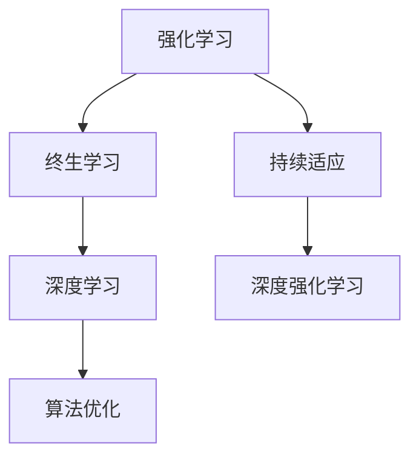

                 

# 强化学习Reinforcement Learning的终生学习与持续适应能力

> 关键词：强化学习, 终生学习, 持续适应, 深度学习, 深度强化学习, 算法优化, 应用场景, 实践指南

## 1. 背景介绍

### 1.1 问题由来

强化学习（Reinforcement Learning, RL）作为一门理论深厚、技术前沿的机器学习分支，已经在自动化控制、游戏智能、机器人操作等领域取得了显著的突破和应用。其核心思想是通过与环境互动，智能体（agent）不断探索最优策略以最大化长期累积奖励。强化学习的成功主要依赖于两个关键因素：持续学习和持续适应。

然而，强化学习在实际应用中仍然面临诸多挑战，包括学习速度慢、泛化能力弱、对环境变化适应能力不足等。这些问题直接影响了智能体在复杂环境下的长期性能和鲁棒性。近年来，随着数据科学、计算能力、算法理论的飞速发展，研究人员提出了多种改进措施，从算法优化到持续学习与适应，持续推动强化学习走向更深层次的应用与创新。

### 1.2 问题核心关键点

强化学习的核心挑战在于如何设计高效的学习策略，在复杂、动态和不确定环境中，实现智能体的持续学习和持续适应。主要包括以下几个方面：

1. **学习速度**：在庞大且动态变化的数据空间中，智能体如何快速学习最优策略。
2. **泛化能力**：在有限的数据上，智能体如何利用先验知识进行泛化，以应对未见过的任务。
3. **环境适应性**：在环境变化时，智能体如何快速调整策略以保持最优性能。
4. **鲁棒性**：在噪声和干扰下，智能体如何保持稳定性。
5. **计算效率**：在计算资源受限的情况下，如何高效地实现强化学习。

为了解决这些问题，研究人员提出了多种改进措施，包括终生学习（Lifelong Learning）和持续适应（Continual Adaptation），以期通过强化学习实现更强大、更灵活、更稳定的人工智能系统。

## 2. 核心概念与联系

### 2.1 核心概念概述

为更好地理解强化学习的终生学习和持续适应能力，本节将介绍几个密切相关的核心概念：

- **强化学习**（Reinforcement Learning, RL）：通过智能体与环境互动，智能体通过探索行动获得奖励，进而优化策略以最大化长期累积奖励的学习框架。
- **终生学习**（Lifelong Learning）：智能体在不断累积的经验中学习，能够适应新任务，在原有知识的基础上持续增长和更新。
- **持续适应**（Continual Adaptation）：智能体在任务或环境变化时，快速调整策略，以适应新的变化。
- **深度学习**（Deep Learning）：利用多层神经网络对数据进行表示学习，从而提升模型的泛化能力和性能。
- **深度强化学习**（Deep Reinforcement Learning）：结合深度学习与强化学习，通过深层网络进行状态表示学习，以提升智能体的学习效率和表现。
- **算法优化**：优化算法的效率和性能，如Q-learning、策略梯度等。

这些核心概念之间的逻辑关系可以通过以下Mermaid流程图来展示：



这个流程图展示出强化学习与终生学习、持续适应、深度学习、深度强化学习和算法优化之间的联系：

- 强化学习是终生学习和持续适应的基础框架，提供了学习机制。
- 深度学习为强化学习提供了更强大的模型和表示能力，提升学习效率和性能。
- 算法优化则是为了提升强化学习的效率和效果，不断改进现有算法。

## 3. 核心算法原理 & 具体操作步骤
### 3.1 算法原理概述

强化学习的终生学习与持续适应能力是通过智能体在不断积累的经验中，通过学习和调整策略，适应新环境和任务，从而实现长期最优性能的机制。具体而言，强化学习的核心在于智能体在动态环境中不断探索和优化策略，以最大化长期累积奖励。

### 3.2 算法步骤详解

强化学习的终生学习与持续适应的步骤主要包括：

1. **环境交互与数据收集**：智能体与环境进行交互，收集数据。
2. **模型训练与策略优化**：利用收集到的数据，训练模型，优化策略。
3. **新环境适应与策略调整**：当环境或任务发生变化时，智能体根据新数据重新训练模型，调整策略。
4. **知识积累与泛化**：在原有知识的基础上，智能体不断累积新经验，进行泛化学习。

### 3.3 算法优缺点

强化学习的终生学习与持续适应的优点包括：

- **适应性强**：智能体能够快速适应新环境，无需从头学习。
- **泛化能力强**：通过不断累积经验，智能体能够在未见过的任务上表现良好。
- **鲁棒性高**：在噪声和干扰下，智能体仍能保持稳定性能。

但同时，这种方法也存在一些缺点：

- **计算复杂度高**：需要大量的计算资源和存储空间。
- **学习速度慢**：特别是在复杂和动态环境中，学习过程可能非常缓慢。
- **策略优化困难**：特别是在多目标和高维度空间中，策略优化问题较为复杂。

### 3.4 算法应用领域

强化学习的终生学习和持续适应能力已经在多个领域得到广泛应用，例如：

- **游戏智能**：如AlphaGo、Dota2等，通过学习不同的游戏策略和技巧，智能体能够在复杂游戏中保持竞争力。
- **机器人操作**：如工业机器人、无人机等，通过不断适应不同的操作环境和任务，提升操作精度和效率。
- **自动化控制**：如自动驾驶、智能家居等，通过持续学习新的交通规则和环境变化，提升安全性和用户体验。
- **金融交易**：通过学习市场趋势和风险管理策略，智能交易系统能够在动态市场中进行稳健投资。
- **智能推荐系统**：如电商推荐、新闻推荐等，通过学习用户行为和偏好，智能推荐系统能够提供个性化的推荐内容。

这些应用场景展示了强化学习的终生学习和持续适应能力的强大潜力，预示着未来更多的应用前景。

## 4. 数学模型和公式 & 详细讲解 & 举例说明

### 4.1 数学模型构建

强化学习的核心是最大化长期累积奖励，一般使用动态规划或蒙特卡洛方法进行求解。假设环境为MDP（马尔可夫决策过程），状态空间为$\mathcal{S}$，动作空间为$\mathcal{A}$，策略为$\pi$，转移概率为$p(s_{t+1}|s_t,a_t)$，奖励为$r(s_t,a_t)$。智能体的目标是找到最优策略$\pi^*$，使得：

$$
\max_{\pi} \mathbb{E}_{\pi} \left[\sum_{t=0}^{\infty} \gamma^t r(s_t,a_t) \right]
$$

其中$\gamma$为折扣因子。

### 4.2 公式推导过程

在强化学习中，常用的算法有Q-learning和策略梯度方法。以下是Q-learning的详细推导：

**Q-learning算法**：通过动作值函数（Q值函数）$q(s,a)$来近似策略，目标是最小化损失函数：

$$
J(\theta) = \mathbb{E}_{\pi_{\theta}} \left[\sum_{t=0}^{\infty} \gamma^t r(s_t,a_t) \right] - \mathbb{E}_{\pi_{\theta}} \left[\sum_{t=0}^{\infty} \gamma^t r(s_t,a_t) \right]
$$

其中，$\theta$为Q值函数的参数。

为了求解上述优化问题，采用梯度下降法：

$$
\theta_{t+1} = \theta_t - \alpha \nabla_{\theta}J(\theta)
$$

其中，$\alpha$为学习率。

通过不断迭代更新Q值函数，智能体可以找到最优策略。

### 4.3 案例分析与讲解

以下是一个简单的强化学习案例，使用Q-learning算法训练智能体，实现一个小游戏。

**游戏描述**：智能体需要在迷宫中寻找出口，并获得最多奖励。每次移动时，智能体有两种选择，向上或向右移动。

**状态空间**：$|\mathcal{S}| = 5^4 = 625$，表示迷宫中每个可能的状态。

**动作空间**：$|\mathcal{A}| = 2$，表示向上或向右移动。

**奖励函数**：如果智能体到达出口，则获得奖励10；否则，每次移动获得-0.1的奖励。

**折扣因子**：$\gamma = 0.9$。

使用Q-learning算法，智能体通过不断与环境互动，更新Q值函数，最终找到最优策略。具体步骤如下：

1. 初始化Q值函数$q(s,a)$为0。
2. 在每个状态下，随机选择一个动作，执行该动作。
3. 根据执行结果，更新Q值函数：

$$
q(s_t,a_t) \leftarrow q(s_t,a_t) + \alpha \left[r(s_t,a_t) + \gamma \max_{a_{t+1}} q(s_{t+1},a_{t+1}) - q(s_t,a_t) \right]
$$

4. 重复步骤2和3，直到达到最大迭代次数。

经过多次迭代后，智能体能够找到最优策略，即在每个状态下选择最优动作，以达到最高奖励。

## 5. 项目实践：代码实例和详细解释说明
### 5.1 开发环境搭建

在进行强化学习实践前，我们需要准备好开发环境。以下是使用Python进行TensorFlow进行RL开发的简要环境配置流程：

1. 安装Anaconda：从官网下载并安装Anaconda，用于创建独立的Python环境。

2. 创建并激活虚拟环境：
```bash
conda create -n rl-env python=3.8 
conda activate rl-env
```

3. 安装TensorFlow：
```bash
pip install tensorflow
```

4. 安装gym等RL库：
```bash
pip install gym stable-baselines3
```

5. 安装numpy、matplotlib、jupyter notebook等常用工具包：
```bash
pip install numpy matplotlib jupyter notebook
```

完成上述步骤后，即可在`rl-env`环境中开始强化学习实践。

### 5.2 源代码详细实现

下面以CartPole游戏为例，展示使用稳定基线（Stable Baselines）进行RL微调的PyTorch代码实现。

首先，定义环境：

```python
import gym

env = gym.make('CartPole-v1')
```

然后，定义模型和优化器：

```python
from stable_baselines3.common import make_vec_env
from stable_baselines3.common.vec_env import VecEnv

env = make_vec_env(env, n_envs=1)
model = PPO(env.observation_space.shape[0], env.action_space)
optimizer = Adam(model.parameters(), lr=1e-3)
```

接着，定义训练和评估函数：

```python
from stable_baselines3.common.vec_env import DummyVecEnv
from stable_baselines3.common.callbacks import CheckpointCallback

def train(model, optimizer, n_steps=1000, env=None):
    # Train model
    callback = CheckpointCallback(model, n_checkpoints=5, verbose=1)
    model.fit(env, callbacks=callback, total_timesteps=n_steps)
    return model

def evaluate(model, env):
    # Evaluate model
    with DummyVecEnv([env]):
        obs = env.reset()
        done = False
        while not done:
            action, _states = model.predict(obs)
            obs, reward, done, _ = env.step(action)
            env.render()
        print('Return:', sum(reward))
```

最后，启动训练流程并在测试集上评估：

```python
model = train(model, optimizer, n_steps=10000)
evaluate(model, env)
```

以上就是一个简单的强化学习微调实践，展示了如何使用稳定基线进行RL训练和评估。

### 5.3 代码解读与分析

让我们再详细解读一下关键代码的实现细节：

**gym库**：
- `make`方法：创建一个gym环境。
- `env.make('CartPole-v1')`：创建CartPole环境。

**稳定基线（Stable Baselines）**：
- `make_vec_env`：创建向量化的环境。
- `PPO`：策略梯度算法，是常用的强化学习算法之一。
- `Adam`：优化器，用于更新模型参数。
- `fit`：训练模型，传入环境、回调等参数。
- `predict`：预测行动。

**训练函数train**：
- `CheckpointCallback`：用于保存模型。
- `n_checkpoints`：保存的模型数量。
- `verbose`：是否打印日志信息。

**评估函数evaluate**：
- `DummyVecEnv`：用于创建虚拟环境，方便评估。
- `env.render()`：渲染环境。

可以看到，使用稳定基线可以显著简化强化学习的实践过程，利用丰富的算法和工具，能够快速构建并评估RL模型。

当然，工业级的系统实现还需考虑更多因素，如模型的保存和部署、超参数的自动搜索、更灵活的训练方法等。但核心的RL微调范式基本与此类似。

## 6. 实际应用场景
### 6.1 智能机器人

强化学习的终生学习和持续适应能力，可以广泛应用于智能机器人的构建。传统机器人往往需要耗费大量人力物力进行调试和优化，效率低下。而使用强化学习，智能机器人能够自主学习和适应复杂环境，快速提升操作性能。

在技术实现上，可以设计多个学习目标，如避障、导航、抓取等，智能机器人通过与环境互动，逐步学习最优策略。同时，智能机器人还可以利用多任务学习（MTL）框架，进行多个任务同时学习，提升泛化能力和效率。

### 6.2 自动驾驶

自动驾驶技术需要智能车辆在复杂的城市交通环境中，进行实时决策和路径规划。强化学习的终生学习和持续适应能力，可以显著提升自动驾驶系统的性能和鲁棒性。

在实际应用中，智能车辆可以在每次行驶过程中，不断学习和优化驾驶策略，提升对各种交通场景的适应能力。通过持续适应新环境，自动驾驶系统能够快速响应突发情况，保障行车安全。

### 6.3 金融投资

金融投资市场环境复杂多变，强化学习的终生学习和持续适应能力，可以应用于智能交易系统的构建。智能交易系统能够在市场波动时，快速调整策略，优化投资决策。

在实际应用中，智能交易系统可以通过持续学习市场数据，调整交易模型，避免因市场变化导致的损失。同时，智能交易系统还可以通过持续适应新数据，学习新的交易模式，提升投资收益。

### 6.4 未来应用展望

随着强化学习算法的不断优化和理论的不断进步，基于终生学习和持续适应的RL系统将在更多领域得到应用，为传统行业带来变革性影响。

在智慧城市治理中，强化学习可以应用于城市事件监测、应急管理等环节，提高城市管理的自动化和智能化水平，构建更安全、高效的未来城市。

在工业制造中，智能机器人通过持续学习和适应，能够进行复杂装配和故障诊断，提升生产效率和质量。

在医疗健康中，强化学习可以应用于医疗影像诊断、手术规划等任务，提升医疗服务的智能化水平，辅助医生进行精准诊疗。

除此之外，在企业生产、社会治理、文娱传媒等众多领域，基于终生学习和持续适应的强化学习系统也将不断涌现，为经济社会发展注入新的动力。相信随着技术的日益成熟，强化学习必将在更广阔的应用领域大放异彩。

## 7. 工具和资源推荐
### 7.1 学习资源推荐

为了帮助开发者系统掌握强化学习的终生学习和持续适应能力的理论基础和实践技巧，这里推荐一些优质的学习资源：

1. 《强化学习：基础与前沿》系列书籍：系统介绍了强化学习的理论基础和经典算法，是学习强化学习的重要参考资料。
2. CS294：《先进机器人学习与控制》课程：由加州大学伯克利分校开设的强化学习课程，包含丰富的实例和实验。
3. DeepMind博客：DeepMind的官方博客，涵盖了最新的强化学习研究成果和实践经验。
4. OpenAI Gym环境库：提供丰富的模拟环境，方便开发者进行RL实验和调试。
5. Stable Baselines3：基于TensorFlow的稳定基线库，提供了丰富的RL算法和工具，支持大规模部署和实验。

通过对这些资源的学习实践，相信你一定能够快速掌握强化学习的终生学习和持续适应能力，并用于解决实际的RL问题。

### 7.2 开发工具推荐

高效的开发离不开优秀的工具支持。以下是几款用于强化学习开发的常用工具：

1. TensorFlow：由Google主导开发的深度学习框架，支持多种算法和模型，具有强大的计算能力和灵活性。
2. PyTorch：由Facebook主导的深度学习框架，支持动态计算图，适合快速迭代和研究。
3. OpenAI Gym：提供了丰富的模拟环境和基准测试，方便开发者进行RL实验。
4. Stable Baselines3：基于TensorFlow的稳定基线库，支持多种RL算法和模型，具有丰富的工具和功能。
5. ViolaSim：由DeepMind开发的模拟环境库，提供了复杂的物理模拟和传感器数据，适合进行高精度RL实验。

合理利用这些工具，可以显著提升强化学习的开发效率，加快创新迭代的步伐。

### 7.3 相关论文推荐

强化学习的终生学习和持续适应能力的快速发展得益于学界的持续研究。以下是几篇奠基性的相关论文，推荐阅读：

1. DeepMind AlphaGo论文：展示了强化学习在复杂游戏（如围棋）中的强大应用能力。
2. OpenAI Dota2论文：展示了强化学习在复杂游戏中快速学习并超越人类玩家的能力。
3. Distral论文：提出了多智能体协同学习的算法框架，提升了多智能体系统的一致性和鲁棒性。
4. Self-Improvment通过模仿和改进来提升深度学习模型的性能。
5. Continual Learning：系统介绍了连续学习的理论和实践，涵盖了多领域的经典方法和应用。

这些论文代表了大强化学习的进展脉络。通过学习这些前沿成果，可以帮助研究者把握学科前进方向，激发更多的创新灵感。

## 8. 总结：未来发展趋势与挑战
### 8.1 总结

本文对强化学习的终生学习和持续适应能力进行了全面系统的介绍。首先阐述了强化学习的研究背景和意义，明确了终生学习和持续适应在强化学习中的重要性。其次，从原理到实践，详细讲解了强化学习的数学原理和关键步骤，给出了强化学习任务开发的完整代码实例。同时，本文还广泛探讨了强化学习在智能机器人、自动驾驶、金融投资等多个领域的应用前景，展示了强化学习的强大潜力。此外，本文精选了强化学习的各类学习资源，力求为读者提供全方位的技术指引。

通过本文的系统梳理，可以看到，强化学习的终生学习和持续适应能力已经成为推动人工智能技术发展的重要驱动力，极大地拓展了强化学习的应用边界，催生了更多的落地场景。受益于强化学习的不断进步，未来智能系统将能够更好地适应环境变化，实现长期最优性能，为人类带来更高效、更安全、更智能的服务。

### 8.2 未来发展趋势

展望未来，强化学习的终生学习和持续适应能力将呈现以下几个发展趋势：

1. **算法复杂度降低**：随着算法优化和计算能力的提升，强化学习算法将变得更加高效和灵活，能够适应更复杂、更多变的环境。
2. **学习效率提升**：通过引入元学习（Meta Learning）等技术，强化学习将能够快速适应新任务，提升学习效率。
3. **多智能体系统**：多智能体协同学习和协作，将提升系统的一致性和鲁棒性，增强复杂任务的能力。
4. **跨领域应用**：强化学习将广泛应用于各个领域，推动产业智能化升级。
5. **自适应策略**：智能体将具备更强的自适应能力，能够在环境变化时快速调整策略。
6. **人机协同**：强化学习将与人机交互技术结合，提升系统的智能化水平。

以上趋势凸显了强化学习的终生学习和持续适应能力的广阔前景。这些方向的探索发展，必将进一步提升强化学习系统的性能和应用范围，为人工智能技术带来更多的突破。

### 8.3 面临的挑战

尽管强化学习的终生学习和持续适应能力已经取得了显著成就，但在迈向更加智能化、普适化应用的过程中，仍面临诸多挑战：

1. **数据需求高**：强化学习需要大量数据进行训练，特别是在复杂和动态环境中，数据采集和处理成本高。
2. **泛化能力弱**：当前强化学习算法在复杂环境中的泛化能力有限，难以应对未见过的任务。
3. **计算资源消耗大**：强化学习需要大量计算资源，特别是在多智能体系统中，资源消耗更大。
4. **策略优化困难**：特别是在高维度和复杂环境中，策略优化问题较为困难。
5. **安全性和可解释性**：强化学习模型常常难以解释，安全性也存在隐患，需要进一步优化。

### 8.4 研究展望

面对强化学习的终生学习和持续适应能力所面临的挑战，未来的研究需要在以下几个方面寻求新的突破：

1. **数据增强**：通过数据增强技术，提升数据多样性，加速模型训练。
2. **元学习**：通过元学习技术，快速适应新任务，提升学习效率。
3. **多智能体系统**：研究多智能体协同学习和协作，提升系统的一致性和鲁棒性。
4. **自适应策略**：研究智能体自适应策略，提升系统对环境变化的适应能力。
5. **人机协同**：研究人机交互技术，提升系统的智能化水平。
6. **可解释性和安全性**：研究可解释性技术，提升模型透明度，确保安全性。

这些研究方向将推动强化学习技术不断进步，带来更多的应用突破，为人工智能技术的发展注入新的动力。

## 9. 附录：常见问题与解答

**Q1：强化学习的终生学习和持续适应能力是否适用于所有环境？**

A: 强化学习的终生学习和持续适应能力在大部分环境中都适用，但需要根据具体环境进行优化。例如，在动态变化的环境或复杂的决策场景中，需要采用更高效和鲁棒的算法和模型。

**Q2：如何选择强化学习的算法和模型？**

A: 选择强化学习算法和模型需要根据具体任务和环境特点进行选择。常用的算法包括Q-learning、策略梯度、蒙特卡洛树搜索（MCTS）等。常用的模型包括深度Q网络（DQN）、策略梯度模型（PG）、分布式策略梯度模型（DPG）等。

**Q3：强化学习在实际应用中面临哪些资源瓶颈？**

A: 强化学习在实际应用中面临的主要资源瓶颈包括数据需求高、计算资源消耗大、策略优化困难等。需要合理选择算法和模型，进行有效的数据采集和处理，优化计算资源配置，进行策略优化和改进。

**Q4：如何提高强化学习的泛化能力？**

A: 提高强化学习的泛化能力可以通过数据增强、元学习、迁移学习等技术。例如，使用多样化的数据进行训练，引入元学习算法进行快速适应新任务，使用迁移学习技术将已有知识迁移到新任务中。

**Q5：强化学习在实际应用中需要注意哪些问题？**

A: 在实际应用中，强化学习需要注意以下问题：

1. 数据收集和处理：需要确保数据的质量和多样性，进行有效的数据增强和预处理。
2. 模型选择和优化：根据任务和环境特点，选择适合的模型和算法，进行有效的超参数调整和优化。
3. 模型部署和监控：需要合理配置计算资源，进行有效的模型部署和监控，确保系统的稳定性和鲁棒性。

通过合理应对这些问题，强化学习将能够更好地应用于实际环境，提升系统的性能和可靠性。

---

作者：禅与计算机程序设计艺术 / Zen and the Art of Computer Programming

