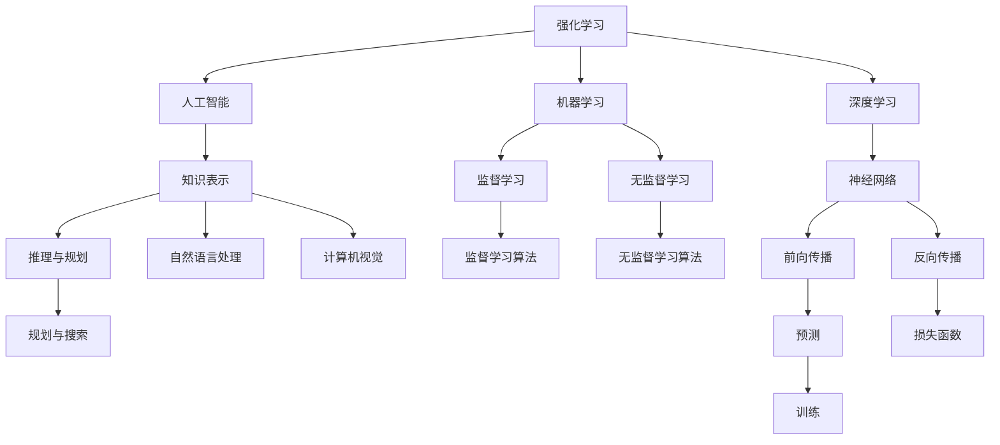

                 

# 强化学习：DL、ML和AI的交集

## 1. 背景介绍

强化学习（Reinforcement Learning, RL）是机器学习（Machine Learning, ML）的一个重要分支，其与深度学习（Deep Learning, DL）、人工智能（Artificial Intelligence, AI）有着千丝万缕的联系。RL作为智能体（agent）在特定环境中通过不断试错学习最优策略的过程，广泛应用于游戏、机器人控制、自动驾驶、推荐系统等多个领域。尽管DL、ML、AI在技术实现和应用目标上存在差异，但RL的理念和框架在许多场景中均有应用。本文将全面介绍强化学习的核心概念与算法，并通过具体的项目实践，帮助读者深入理解RL与DL、ML、AI的交集，探索其在实际应用中的潜力。

## 2. 核心概念与联系

### 2.1 核心概念概述

为更好地理解强化学习的本质，本节将介绍几个关键概念：

- 强化学习（Reinforcement Learning）：智能体在特定环境中通过试错学习最优策略的过程。
- 深度学习（Deep Learning）：利用神经网络进行模型训练的深度学习技术。
- 机器学习（Machine Learning）：通过算法训练模型，实现对数据的自动学习和应用。
- 人工智能（Artificial Intelligence）：通过算法使计算机系统具备类人智能。
- 马尔科夫决策过程（Markov Decision Process, MDP）：描述环境动态和智能体行为的基本模型。
- 策略（Policy）：智能体从环境中选择行动的策略函数。
- 值函数（Value Function）：描述智能体在不同状态下行为的预期收益。

这些概念构成了强化学习的基本框架，并通过以下Mermaid流程图展示其联系：



这个流程图展示了强化学习、深度学习、机器学习、人工智能等概念之间的联系：

1. 强化学习建立在深度学习之上，利用神经网络实现模型预测和策略学习。
2. 强化学习和机器学习密切相关，前者是针对特定任务的策略优化过程，后者是更广泛的模型训练过程。
3. 强化学习作为AI的一部分，用于实现智能体的自主学习和决策。
4. 深度学习、机器学习、自然语言处理、计算机视觉等技术，都是构建智能体的重要工具。

## 3. 核心算法原理 & 具体操作步骤

### 3.1 算法原理概述

强化学习的核心在于利用智能体与环境的交互，通过试错来学习最优策略。一个典型的强化学习过程包括以下几个关键步骤：

1. 初始化：智能体随机选择一个行动，进入环境。
2. 执行：智能体在环境中执行该行动，观察环境的反馈（如奖励、状态变化等）。
3. 更新：智能体根据当前状态和执行结果，更新策略和值函数，以优化未来行动选择。
4. 重复：智能体重复以上步骤，直至达到预设的终止条件。

强化学习的目标是找到一组最优的策略和值函数，使智能体在特定环境中的累积奖励最大化。这一过程可以通过优化策略或值函数来实现。常见的优化方法包括策略梯度、值迭代、策略迭代等。

### 3.2 算法步骤详解

以深度Q网络（Deep Q-Network, DQN）为例，详细介绍强化学习的具体步骤。

1. 准备环境与智能体：
   - 确定环境的状态空间、行动空间和奖励函数。
   - 定义智能体的策略，可以是固定策略或可更新的策略。

2. 初始化模型：
   - 使用深度神经网络作为值函数，定义网络结构。
   - 初始化模型参数，使用随机策略进行探索。

3. 训练过程：
   - 在每个时间步t，智能体从当前状态s中随机选择一个行动a。
   - 观察环境对行动a的反馈r和下一个状态s'。
   - 根据奖励r和下一个状态s'，使用当前模型预测Q值$Q_{t+1}(s',a')$。
   - 计算目标Q值$y_t=r+\gamma Q_{t+1}(s',a')$，其中$\gamma$为折扣因子。
   - 根据当前策略选择行动a'，并更新模型参数。

4. 测试过程：
   - 使用训练好的模型进行策略评估，评估模型在不同状态下的Q值。
   - 根据模型评估结果，选择最优行动，进行策略应用。

### 3.3 算法优缺点

强化学习的优点包括：

1. 适用于复杂问题：RL能够处理非结构化数据和未知环境，具有较强的适应性。
2. 不需要大量标注数据：相比于监督学习，RL对数据标注的需求较低，可以大大降低成本。
3. 更接近人类智能：RL强调智能体的自主学习和优化策略，与人类智能更为接近。
4. 应用广泛：RL广泛应用于游戏、自动控制、推荐系统等场景，具有较高的应用价值。

强化学习的缺点包括：

1. 训练难度大：RL需要大量样本进行试错，且难以收敛。
2. 需要长期规划：RL需要考虑未来的奖赏，无法直接计算最优策略。
3. 复杂性高：RL模型设计复杂，容易出现局部最优解。
4. 稳定性差：RL在处理不稳定性因素时，容易出现不稳定表现。

### 3.4 算法应用领域

强化学习在游戏、机器人控制、自动驾驶、推荐系统等多个领域有广泛的应用。

- 游戏：强化学习在围棋、象棋、星际争霸等复杂游戏中取得突破，AlphaGo等模型击败人类顶尖选手。
- 机器人控制：RL用于机器人路径规划、姿态控制等任务，提升机器人自主决策能力。
- 自动驾驶：RL应用于车辆路径规划、行人识别等任务，提升驾驶安全性和智能化水平。
- 推荐系统：RL用于用户行为预测和推荐，优化推荐效果。

## 4. 数学模型和公式 & 详细讲解 & 举例说明

### 4.1 数学模型构建

强化学习通常使用马尔科夫决策过程（MDP）模型描述环境动态和智能体行为。MDP由以下几个元素组成：

1. 状态空间S：环境的所有可能状态集合。
2. 行动空间A：智能体可执行的行动集合。
3. 状态转移概率P(s'|s,a)：在状态s下，执行行动a后，转移到状态s'的概率。
4. 奖励函数R(s,a)：在状态s下，执行行动a后，获得的奖励。

强化学习的目标是通过策略π，最大化累积奖励。策略π描述了智能体在状态s下选择行动a的概率。

### 4.2 公式推导过程

以深度Q网络（DQN）为例，推导其核心公式。

DQN的目标是最大化Q值函数$Q(s,a)$，即在每个状态s下，选择行动a的预期累积奖励最大化。根据Q-learning算法，更新Q值的公式为：

$$
Q(s,a) \leftarrow Q(s,a) + \alpha [r + \gamma \max Q(s',a') - Q(s,a)]
$$

其中，$\alpha$为学习率，$\gamma$为折扣因子，$Q(s',a')$为当前状态s'下最优Q值。

### 4.3 案例分析与讲解

DQN模型在Atari游戏中取得了突破性成果。Atari游戏具有高度复杂性和非结构化特性，传统的监督学习无法有效应用。DQN模型通过大量随机探索和网络优化，逐渐学习到最优策略，实现了在游戏中的连胜。

例如，DQN在Pong游戏中的学习过程如下：

1. 初始化网络，随机选择一个行动。
2. 执行行动，观察环境反馈，如屏幕上的球和打乒乓球的位置。
3. 更新网络参数，以最大化当前状态下的Q值。
4. 重复以上步骤，直至达到预设的训练轮数。

最终，DQN模型能够在Pong游戏中取得最优策略，以高得分击败人类玩家。

## 5. 项目实践：代码实例和详细解释说明

### 5.1 开发环境搭建

在进行强化学习项目实践前，我们需要准备好开发环境。以下是使用Python和TensorFlow进行强化学习开发的简单流程：

1. 安装Python：从官网下载并安装Python，如Python 3.6+。
2. 安装TensorFlow：通过pip安装TensorFlow，建议安装最新版本。
3. 安装OpenAI Gym：通过pip安装OpenAI Gym，用于获取游戏环境。
4. 安装PyBox2D：通过pip安装PyBox2D，用于模拟物理环境。
5. 安装其他依赖：如numpy、matplotlib等。

### 5.2 源代码详细实现

以下是一个简单的DQN游戏示例，使用TensorFlow实现。

```python
import gym
import numpy as np
import tensorflow as tf

env = gym.make('Pong-v0')

# 定义神经网络结构
class DQN:
    def __init__(self, input_size, output_size):
        self.input_size = input_size
        self.output_size = output_size
        self.model = tf.keras.models.Sequential([
            tf.keras.layers.Dense(24, input_dim=input_size, activation='relu'),
            tf.keras.layers.Dense(24, activation='relu'),
            tf.keras.layers.Dense(output_size, activation='linear')
        ])
        self.model.compile(loss='mse', optimizer=tf.keras.optimizers.Adam(lr=0.001))

    def act(self, state):
        q_values = self.model.predict(state)
        return np.argmax(q_values[0])

    def train(self, state, action, reward, next_state, done):
        target = reward + 0.99 * np.max(self.model.predict(next_state)[0])
        target_fetches = self.model.targets[0]
        target_store = tf.placeholder(tf.float32)
        update = target_fetches.assign(target_store)
        self.model.update([update], [target_store], [target])

    def learn(self, episode_count):
        for episode in range(episode_count):
            state = env.reset()
            state = np.reshape(state, [1, self.input_size])
            done = False
            total_reward = 0
            while not done:
                action = self.act(state)
                next_state, reward, done, _ = env.step(action)
                next_state = np.reshape(next_state, [1, self.input_size])
                self.train(state, action, reward, next_state, done)
                state = next_state
                total_reward += reward
            print('Episode {}: Total reward = {}'.format(episode+1, total_reward))
```

### 5.3 代码解读与分析

这里我们详细解读代码中的关键部分：

**Pong-v0环境**：
- 使用OpenAI Gym加载Pong-v0游戏环境。

**DQN类定义**：
- 初始化神经网络，定义网络结构。
- 定义动作选择和模型更新函数。
- 实现训练过程，根据当前状态、行动、奖励、下一个状态和是否终止，更新Q值。

**学习过程**：
- 在每个回合中，智能体从初始状态开始，通过动作选择和环境反馈，逐步学习最优策略。
- 更新神经网络参数，以最大化当前状态下的Q值。
- 打印每个回合的总奖励，评估学习效果。

## 6. 实际应用场景

### 6.1 游戏AI

强化学习在游戏AI领域有广泛应用。通过学习游戏规则和玩家行为，智能体能够在复杂的游戏中取得优异的成绩。AlphaGo、AlphaZero等模型在围棋、象棋等游戏中取得突破，展示了RL的强大能力。

### 6.2 机器人控制

强化学习在机器人控制中也有重要应用。机器人需要通过环境反馈，学习最优的控制策略。例如，使用RL训练的机器人能够在复杂环境中自动导航、抓取物体，提升自动化水平。

### 6.3 自动驾驶

自动驾驶系统需要实时处理大量复杂的环境数据，通过强化学习优化车辆行为。例如，使用RL训练的车辆能够在道路环境中自动规划路径，避免碰撞，提升行车安全性。

### 6.4 推荐系统

推荐系统需要预测用户行为，并推荐最优商品。通过强化学习，模型可以实时学习用户反馈，优化推荐策略，提升推荐效果。

## 7. 工具和资源推荐

### 7.1 学习资源推荐

为了帮助开发者深入理解强化学习，这里推荐一些优质的学习资源：

1. 《Reinforcement Learning: An Introduction》：由Richard Sutton和Andrew Barto合著的经典书籍，全面介绍了强化学习的基本概念和算法。
2. 《Deep Reinforcement Learning with TensorFlow 2》：由Himanshu Srivastava撰写的教程，使用TensorFlow实现强化学习算法。
3. 《Programming Reinforcement Learning with Python》：由William Walsh撰写的实战教程，通过Python实现RL算法。
4. Coursera和edX等在线课程：提供强化学习的基础课程和高级课程，适合不同层次的学习者。
5. OpenAI Gym：提供多种游戏环境，方便开发者进行强化学习实践。

通过这些资源的学习实践，相信你一定能够深入理解强化学习的原理和算法，并在实际项目中灵活应用。

### 7.2 开发工具推荐

高效的开发离不开优秀的工具支持。以下是几款用于强化学习开发的常用工具：

1. TensorFlow：由Google主导开发的深度学习框架，具有灵活的计算图和高效的计算能力，适合实现复杂的强化学习模型。
2. PyTorch：Facebook开发的深度学习框架，简单易用，适合快速迭代研究。
3. OpenAI Gym：提供多种游戏环境，方便开发者进行强化学习实践。
4. Matplotlib：用于绘制图表和可视化结果，方便结果展示。
5. PyBox2D：用于模拟物理环境，方便进行游戏AI研究。

合理利用这些工具，可以显著提升强化学习任务的开发效率，加快创新迭代的步伐。

### 7.3 相关论文推荐

强化学习作为机器学习和人工智能的重要分支，已经吸引了众多学者的关注。以下是几篇奠基性的相关论文，推荐阅读：

1. 《Playing Atari with Deep Reinforcement Learning》：DQN的原始论文，展示了DQN在Atari游戏中的突破性成果。
2. 《Human-level Control through Deep Reinforcement Learning》：AlphaGo的原始论文，展示了深度强化学习在围棋游戏中的卓越表现。
3. 《Mastering the Game of Go without Human Knowledge》：AlphaZero的原始论文，展示了无监督强化学习在复杂游戏中的卓越表现。
4. 《Human-Personalized Robot Learning through Reinforcement Learning and Lifelong Experience Replay》：展示了强化学习在机器人学习中的重要应用。
5. 《Reinforcement Learning for Human-Robot Interaction with Deep Q-Networks》：展示了强化学习在机器人与人交互中的应用。

这些论文代表了大强化学习的研究进展，通过学习这些前沿成果，可以帮助研究者把握学科前进方向，激发更多的创新灵感。

## 8. 总结：未来发展趋势与挑战

### 8.1 总结

本文对强化学习的核心概念与算法进行了全面系统的介绍。首先阐述了强化学习在机器学习、深度学习、人工智能等领域的重要应用，明确了其作为智能体自主学习最优策略的重要价值。其次，从原理到实践，详细讲解了强化学习的数学模型和核心算法，并通过具体的项目实践，展示了强化学习在实际应用中的潜力和效果。

通过本文的系统梳理，可以看到，强化学习作为一种智能体的自主学习和优化策略，在复杂问题中展现出巨大的应用潜力。未来，伴随强化学习的持续演进，相信其在机器学习、深度学习、人工智能等多个领域的应用将更加广泛，为智能系统带来新的突破。

### 8.2 未来发展趋势

展望未来，强化学习的发展趋势将呈现以下几个方向：

1. 与深度学习融合：未来的强化学习将更深入地结合深度学习技术，提升模型精度和泛化能力。
2. 自动化设计：强化学习算法将逐步实现自动化设计，通过自动搜索和学习，找到最优策略。
3. 分布式优化：强化学习算法将利用分布式计算资源，提升模型训练效率和稳定性。
4. 多模态融合：未来的强化学习将引入多模态信息，如视觉、语音、文本等，实现更全面、更智能的智能体。
5. 实时学习：强化学习将逐步实现实时学习，通过在线学习机制，不断适应新环境和新任务。
6. 交互式学习：强化学习将更加注重人机交互，通过人类反馈优化模型，提升智能体的社会性。

以上趋势凸显了强化学习的广阔前景，这些方向的探索发展，必将进一步提升智能体的自主学习能力和应用价值，为机器学习、深度学习、人工智能等领域带来新的突破。

### 8.3 面临的挑战

尽管强化学习已经取得诸多突破，但在迈向更加智能化、普适化应用的过程中，仍然面临诸多挑战：

1. 训练难度大：强化学习需要大量样本进行试错，且难以收敛。如何提升训练效率，实现更快速、更稳定的学习，将是重要的研究方向。
2. 数据需求高：强化学习对数据的需求较高，但数据获取和标注成本较高。如何降低数据需求，利用无监督学习和主动学习等方法，将成为未来的研究重点。
3. 泛化能力差：强化学习在处理不稳定性因素时，容易出现局部最优解。如何提高泛化能力，实现更普适、更鲁棒的智能体，是未来的重要方向。
4. 稳定性差：强化学习在处理不稳定性因素时，容易出现不稳定表现。如何提升稳定性，实现更可靠、更安全的智能系统，将是重要的研究方向。
5. 模型复杂性高：强化学习模型设计复杂，容易出现局部最优解。如何简化模型结构，提升模型效率，实现更高效、更灵活的智能体，将是未来的重要方向。

正视强化学习面临的这些挑战，积极应对并寻求突破，将是大规模强化学习技术走向成熟的必由之路。相信随着学界和产业界的共同努力，这些挑战终将一一被克服，强化学习必将在构建智能系统、实现智能决策等领域发挥更加重要的作用。

### 8.4 研究展望

面对强化学习面临的挑战，未来的研究需要在以下几个方面寻求新的突破：

1. 探索无监督和半监督强化学习方法。摆脱对大量标注数据的依赖，利用自监督学习、主动学习等无监督和半监督范式，最大限度利用非结构化数据，实现更加灵活高效的强化学习。
2. 研究参数高效和计算高效的强化学习范式。开发更加参数高效的强化学习方法，在固定大部分预训练参数的同时，只更新极少量的任务相关参数。同时优化模型计算图，减少前向传播和反向传播的资源消耗，实现更加轻量级、实时性的部署。
3. 引入更多先验知识。将符号化的先验知识，如知识图谱、逻辑规则等，与神经网络模型进行巧妙融合，引导强化学习过程学习更准确、合理的智能体。同时加强不同模态数据的整合，实现视觉、语音等多模态信息与文本信息的协同建模。
4. 纳入伦理道德约束。在强化学习模型训练目标中引入伦理导向的评估指标，过滤和惩罚有偏见、有害的输出倾向。同时加强人工干预和审核，建立模型行为的监管机制，确保输出符合人类价值观和伦理道德。
5. 探索可解释性和可控性。通过引入可解释性工具，提升强化学习模型的可解释性，帮助用户理解模型决策过程。同时探索模型可控性，提升智能体的行为稳定性和可控性。

这些研究方向的探索，必将引领强化学习技术迈向更高的台阶，为构建安全、可靠、可解释、可控的智能系统铺平道路。面向未来，强化学习技术还需要与其他人工智能技术进行更深入的融合，如知识表示、因果推理、强化学习等，多路径协同发力，共同推动智能系统的进步。只有勇于创新、敢于突破，才能不断拓展强化学习的边界，让智能技术更好地造福人类社会。

## 9. 附录：常见问题与解答

**Q1：强化学习是否适用于所有任务？**

A: 强化学习在许多任务中都有应用，但并不适用于所有问题。例如，在需要大量标注数据的问题中，强化学习可能不适用。在一些需要精确计算的问题中，强化学习也难以胜任。因此，在选择任务时，需要评估其是否适合强化学习方法。

**Q2：强化学习需要多少样本？**

A: 强化学习需要大量样本进行训练，但具体数量取决于任务复杂度和环境特征。对于简单的环境，较少的样本即可达到较好的效果。对于复杂的环境，需要更多的样本进行探索和优化。通常建议收集几千到几万个样本进行训练。

**Q3：强化学习与监督学习的区别是什么？**

A: 强化学习与监督学习的主要区别在于，前者通过环境反馈进行学习，后者通过标注数据进行学习。强化学习强调智能体的自主学习，监督学习则依赖人工标注的数据进行模型训练。

**Q4：强化学习如何优化模型参数？**

A: 强化学习通过试错学习最优策略，不直接优化模型参数。通过奖励机制，引导智能体选择最优行动，优化策略函数。如果需要优化模型参数，可以结合强化学习和其他优化算法，如梯度下降等。

**Q5：强化学习中的探索与利用策略是什么？**

A: 强化学习中的探索与利用策略是指如何平衡智能体的探索能力和利用现有知识的能力。常见的策略包括$\epsilon$-贪心策略、UCB策略等，通过平衡探索和利用，提高智能体的学习效率。

总之，强化学习作为机器学习和深度学习的重要分支，在复杂问题中展现出巨大的应用潜力。通过深入理解其核心概念和算法，掌握其应用方法，相信你一定能够在实际项目中灵活应用强化学习技术，实现更智能、更高效的智能系统。

