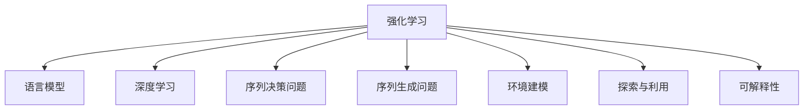

                 

# 强化学习：在自然语言处理中的应用

> 关键词：强化学习, 自然语言处理, 语言模型, 深度学习, 序列决策, 游戏AI, 对话系统, 智能推荐, 情感分析, 序列生成

## 1. 背景介绍

### 1.1 问题由来

随着人工智能技术的快速发展，自然语言处理(NLP)领域逐渐成为了研究的热点。传统的基于规则的NLP方法面临着诸如歧义、长距离依赖、词义消歧等挑战，无法应对复杂的语言现象。而以深度学习为代表的端到端方法虽然取得了显著进展，但仍然存在计算资源消耗大、泛化能力不足等问题。强化学习作为一种新兴的AI方法，利用奖励机制引导智能体自主学习，被广泛应用于游戏AI、机器人控制、推荐系统等领域，并展现出巨大的潜力。

自然语言处理领域也开始尝试利用强化学习解决一些传统方法难以应对的问题，如语言模型、对话系统、情感分析等。这些应用场景中的强化学习通常采用序列决策的方式，将语言视为一系列的决策点，通过学习最优的决策策略来实现语言理解与生成任务。

### 1.2 问题核心关键点

强化学习在自然语言处理中的应用，核心在于将自然语言处理任务视为序列决策问题，并利用强化学习算法寻找最优的决策策略。这种范式具有以下几个关键点：

- 序列决策：自然语言由单词、短语和句子组成，每个单词和短语都对应一个决策点，强化学习算法需要处理这类序列决策问题。
- 奖励机制：通过设计适当的奖励机制，强化学习算法能够有效地学习最优的决策策略，同时避免了梯度消失等问题。
- 环境建模：构建准确的奖励函数和环境模型，是实现高效强化学习的前提。
- 探索与利用：在强化学习过程中，模型需要在探索新策略和利用已有知识之间找到平衡，从而高效地逼近最优策略。
- 可解释性：强化学习模型的决策过程往往难以解释，因此需要研究如何提高模型的可解释性，增强用户信任。

## 2. 核心概念与联系

### 2.1 核心概念概述

为了更好地理解强化学习在自然语言处理中的应用，本节将介绍几个密切相关的核心概念：

- 强化学习(Reinforcement Learning, RL)：一种基于奖励机制的学习方法，通过智能体与环境的交互，学习最优的决策策略。
- 语言模型(Language Model)：用于评估自然语言序列的概率分布，是NLP任务的基础。
- 深度学习(Deep Learning)：通过构建深层神经网络结构，实现对复杂数据的高效处理。
- 序列决策问题(Sequence Decision Problem)：将自然语言处理任务转化为序列决策问题，每个单词或短语对应一个决策点，通过决策链进行推理。
- 序列生成问题(Sequence Generation Problem)：通过强化学习算法生成符合语言规则的自然语言序列。
- 环境建模(Environment Modeling)：构建准确的环境模型，包括状态、奖励函数、转移概率等，用于指导强化学习的训练。
- 探索与利用(Exploitation and Exploration)：在强化学习过程中，模型需要在探索新策略和利用已有知识之间找到平衡。
- 可解释性(Interpretability)：强化学习模型的决策过程往往难以解释，需要研究如何提高模型的可解释性，增强用户信任。

这些核心概念之间的逻辑关系可以通过以下Mermaid流程图来展示：



这个流程图展示了强化学习在自然语言处理中的核心概念及其之间的关系：

1. 强化学习是处理序列决策问题的基本方法。
2. 语言模型和深度学习是强化学习的基础工具，用于构建最优决策策略。
3. 序列决策问题和序列生成问题是强化学习在NLP中常见的应用形式。
4. 环境建模是强化学习训练的关键部分，用于描述决策过程中环境的状态变化。
5. 探索与利用是强化学习算法中重要的策略选择，决定了模型学习效率和决策质量。
6. 可解释性是强化学习模型在实际应用中的重要考量因素，决定了模型的可信度和可用性。

## 3. 核心算法原理 & 具体操作步骤

### 3.1 算法原理概述

强化学习在自然语言处理中的应用，本质上是通过学习最优的决策策略来解决序列决策问题。其核心思想是：将自然语言处理任务转化为序列决策问题，通过智能体与环境的交互，学习最优的决策策略，以最大化累积奖励。

形式化地，设智能体 $A$ 在环境 $E$ 中执行一系列决策 $\{a_t\}$，状态序列 $\{s_t\}$，奖励序列 $\{r_t\}$，学习目标为最大化累积奖励 $\sum_{t=1}^{T}r_t$。设 $Q(s_t,a_t)$ 为状态-动作对 $(s_t,a_t)$ 的Q值，智能体的决策策略为 $\pi(a_t|s_t)$。则强化学习的目标函数为：

$$
\max_{\pi} \mathbb{E}_{\pi}\left[\sum_{t=1}^{T}r_t\right]
$$

在实际应用中，我们通常使用值函数估计方法，如Q-learning、SARSA、蒙特卡洛方法等，来估计状态-动作对的Q值，进而选择最优的动作策略。这些方法通过在特定状态-动作对上进行迭代优化，逐步逼近最优决策策略。

### 3.2 算法步骤详解

基于强化学习的大语言模型微调一般包括以下几个关键步骤：

**Step 1: 定义问题与环境**

- 将自然语言处理任务定义为一个序列决策问题，状态为当前输入的单词或短语，动作为当前单词的下一状态。
- 定义状态空间和动作空间，如输入单词的词表或神经网络输出。
- 设计适当的奖励函数，如每个正确预测的单词获得一定的奖励，错误的单词导致惩罚。

**Step 2: 构建模型**

- 选择合适的强化学习算法，如Q-learning、SARSA、深度Q网络(DQN)等。
- 设计合适的神经网络结构，用于对状态和动作进行编码和解码。
- 使用神经网络构建状态-动作对的Q值估计器，用于预测Q值。

**Step 3: 训练模型**

- 初始化模型参数，设定学习率、批量大小等超参数。
- 在训练数据集上，通过迭代优化Q值估计器，逐步逼近最优决策策略。
- 使用探索与利用策略，如$\epsilon$-贪心策略、softmax策略等，在探索新策略和利用已有知识之间找到平衡。

**Step 4: 评估与部署**

- 在验证集上评估模型的性能，对比微调前后的精度提升。
- 使用微调后的模型对新样本进行推理预测，集成到实际的应用系统中。
- 持续收集新的数据，定期重新微调模型，以适应数据分布的变化。

以上是基于强化学习的大语言模型微调的一般流程。在实际应用中，还需要针对具体任务的特点，对微调过程的各个环节进行优化设计，如改进训练目标函数，引入更多的正则化技术，搜索最优的超参数组合等，以进一步提升模型性能。

### 3.3 算法优缺点

强化学习在自然语言处理中的应用，具有以下优点：

1. 能够处理序列决策问题，适用于自然语言处理的复杂决策任务。
2. 不需要大量的标注数据，仅需根据奖励机制进行训练，提高了数据利用效率。
3. 能够自主探索最优策略，避免了传统NLP方法中的梯度消失等问题。
4. 能够处理多模态数据，如文本、语音、图像等，拓展了NLP的应用范围。

同时，该方法也存在一定的局限性：

1. 奖励函数设计困难，需要根据具体任务进行精心设计。
2. 训练过程需要大量的计算资源，尤其是深度学习模型。
3. 模型的可解释性较差，难以解释模型内部的决策逻辑。
4. 模型的泛化能力依赖于奖励函数的设计，易受环境变化影响。

尽管存在这些局限性，但强化学习在自然语言处理中的应用仍然具有巨大的潜力，特别是在缺乏大量标注数据或需要动态适应任务变化的应用场景中。未来相关研究的重点在于如何进一步降低强化学习的计算成本，提高模型的可解释性和泛化能力，同时兼顾效率和效果。

### 3.4 算法应用领域

强化学习在自然语言处理中的应用，已经覆盖了多个领域，如游戏AI、对话系统、情感分析、智能推荐等。以下是几个典型的应用场景：

- **游戏AI**：在电子游戏中，利用强化学习算法训练智能体，使其能够在复杂环境中自主决策，完成游戏目标。
- **对话系统**：通过强化学习算法训练对话模型，使其能够理解用户意图，生成符合语境的回答。
- **情感分析**：使用强化学习算法，对用户评论进行情感分类，预测用户情感倾向。
- **智能推荐**：在推荐系统中，通过强化学习算法推荐符合用户偏好的商品或内容。
- **翻译系统**：利用强化学习算法训练翻译模型，使其能够在不同语言间进行高质量的自动翻译。

除了上述这些经典任务外，强化学习还应用于文本生成、问答系统、摘要生成等更多场景中，为NLP技术带来了全新的突破。随着强化学习方法和模型的不断进步，相信NLP技术将在更广阔的应用领域大放异彩。

## 4. 数学模型和公式 & 详细讲解 & 举例说明

### 4.1 数学模型构建

在强化学习中，语言模型可以视为一个序列决策问题。设智能体在时间步 $t$ 的状态为 $s_t$，动作为 $a_t$，奖励为 $r_t$，状态转移到下一个状态 $s_{t+1}$。设智能体的状态空间为 $S$，动作空间为 $A$，定义状态-动作对的Q值函数为 $Q(s,a)$，智能体的策略为 $\pi(a|s)$。则强化学习在自然语言处理中的数学模型可以表示为：

$$
\begin{aligned}
    Q(s_t,a_t) &= r_t + \gamma \max_{a_{t+1}} Q(s_{t+1},a_{t+1}) \\
    \pi(a|s) &= \frac{e^{Q(s,a)}}{\sum_{a \in A} e^{Q(s,a)}}
\end{aligned}
$$

其中 $\gamma$ 为折扣因子，用于平衡当前奖励和未来奖励的权重。

### 4.2 公式推导过程

以下我们以情感分析任务为例，推导强化学习模型的公式及其梯度计算。

假设智能体在时间步 $t$ 的状态为当前单词 $w_t$，动作为下一个单词 $w_{t+1}$，奖励为情感得分。则情感分析任务可以表示为序列决策问题。设智能体的状态空间为单词表，动作空间为单词表，定义状态-动作对的Q值函数为 $Q(w_t,w_{t+1})$。则情感分析任务的强化学习模型可以表示为：

$$
\begin{aligned}
    Q(w_t,w_{t+1}) &= r_t + \gamma \max_{w_{t+2}} Q(w_{t+1},w_{t+2}) \\
    \pi(w_{t+1}|w_t) &= \frac{e^{Q(w_t,w_{t+1})}}{\sum_{w \in A} e^{Q(w_t,w)}}
\end{aligned}
$$

在情感分析任务中，智能体的动作策略 $\pi(w_{t+1}|w_t)$ 可以根据当前情感得分和下一个单词进行计算。设情感得分为 $r_t$，智能体的状态空间为单词表 $W$，动作空间也为单词表 $W$，则情感分析任务的强化学习模型可以表示为：

$$
\begin{aligned}
    Q(w_t,w_{t+1}) &= r_t + \gamma \max_{w_{t+2}} Q(w_{t+1},w_{t+2}) \\
    \pi(w_{t+1}|w_t) &= \frac{e^{Q(w_t,w_{t+1})}}{\sum_{w \in W} e^{Q(w_t,w)}}
\end{aligned}
$$

在实际应用中，我们通常使用神经网络构建状态-动作对的Q值估计器，用于预测Q值。设神经网络模型为 $Q(s,a;\theta)$，则情感分析任务的强化学习模型可以表示为：

$$
\begin{aligned}
    Q(w_t,w_{t+1}) &= r_t + \gamma \max_{w_{t+2}} Q(w_{t+1},w_{t+2};\theta) \\
    \pi(w_{t+1}|w_t) &= \frac{e^{Q(w_t,w_{t+1};\theta)}}{\sum_{w \in W} e^{Q(w_t,w;\theta)}}
\end{aligned}
$$

在得到Q值函数后，即可带入强化学习的优化目标，进行梯度更新。假设使用Q-learning算法进行优化，则目标函数为：

$$
\begin{aligned}
    \min_{\theta} \mathbb{E}\left[(r_t + \gamma \max_{w_{t+2}} Q(w_{t+1},w_{t+2};\theta) - Q(w_t,w_{t+1};\theta)\right]
\end{aligned}
$$

根据梯度下降算法，求解目标函数的最小值，更新模型参数 $\theta$，即可实现情感分析任务的强化学习训练。

### 4.3 案例分析与讲解

以情感分析任务为例，强化学习模型通过不断优化Q值函数，学习到最优的决策策略。在训练过程中，智能体通过与环境的交互，逐步逼近最优的决策策略。具体来说，模型会在每个时间步 $t$ 上进行状态-动作对的Q值更新：

1. 随机选择一个单词 $w_{t+1}$，计算当前情感得分 $r_t$，并根据下一个单词的Q值 $Q(w_{t+1},w_{t+2})$，更新当前单词的Q值。
2. 通过神经网络模型 $Q(w_t,w_{t+1};\theta)$，预测当前单词的Q值，并与实际奖励 $r_t$ 进行对比，更新模型参数。
3. 在每个时间步上重复上述过程，逐步逼近最优的决策策略。

在实际应用中，为了提高模型的训练效率，通常使用蒙特卡洛方法或者时间差分方法进行强化学习训练，如SARSA和DQN算法。这些算法通过在特定状态-动作对上进行迭代优化，逐步逼近最优决策策略。

## 5. 项目实践：代码实例和详细解释说明

### 5.1 开发环境搭建

在进行强化学习实践前，我们需要准备好开发环境。以下是使用Python进行TensorFlow进行强化学习开发的环境配置流程：

1. 安装Anaconda：从官网下载并安装Anaconda，用于创建独立的Python环境。

2. 创建并激活虚拟环境：
```bash
conda create -n reinforcement-env python=3.8 
conda activate reinforcement-env
```

3. 安装TensorFlow：根据CUDA版本，从官网获取对应的安装命令。例如：
```bash
conda install tensorflow -c pytorch -c conda-forge
```

4. 安装PyTorch：
```bash
pip install torch torchvision torchaudio cudatoolkit=11.1 -c pytorch -c conda-forge
```

5. 安装各类工具包：
```bash
pip install numpy pandas scikit-learn matplotlib tqdm jupyter notebook ipython
```

完成上述步骤后，即可在`reinforcement-env`环境中开始强化学习实践。

### 5.2 源代码详细实现

下面我们以情感分析任务为例，给出使用TensorFlow进行强化学习的PyTorch代码实现。

首先，定义情感分析任务的数据处理函数：

```python
from tensorflow.keras.datasets import imdb
from tensorflow.keras.preprocessing import sequence
import numpy as np

def load_data():
    # 加载IMDB评论数据集
    (x_train, y_train), (x_test, y_test) = imdb.load_data(num_words=10000)

    # 对文本进行padding，保证序列长度一致
    maxlen = 100
    x_train = sequence.pad_sequences(x_train, maxlen=maxlen)
    x_test = sequence.pad_sequences(x_test, maxlen=maxlen)

    return x_train, y_train, x_test, y_test
```

然后，定义强化学习模型的神经网络结构：

```python
from tensorflow.keras.models import Sequential
from tensorflow.keras.layers import Embedding, LSTM, Dense

model = Sequential()
model.add(Embedding(10000, 128, input_length=maxlen))
model.add(LSTM(128, dropout=0.2, recurrent_dropout=0.2))
model.add(Dense(1, activation='sigmoid'))

model.compile(loss='binary_crossentropy', optimizer='adam', metrics=['accuracy'])
```

接着，定义训练和评估函数：

```python
from tensorflow.keras.callbacks import EarlyStopping

def train_model(model, x_train, y_train, x_test, y_test, epochs=5, batch_size=32):
    callbacks = [EarlyStopping(monitor='val_loss', patience=3)]
    model.fit(x_train, y_train, validation_data=(x_test, y_test), epochs=epochs, batch_size=batch_size, callbacks=callbacks)
    return model.evaluate(x_test, y_test)

def evaluate_model(model, x_test, y_test):
    loss, accuracy = model.evaluate(x_test, y_test)
    print('Test loss:', loss)
    print('Test accuracy:', accuracy)
```

最后，启动训练流程并在测试集上评估：

```python
x_train, y_train, x_test, y_test = load_data()

model = train_model(model, x_train, y_train, x_test, y_test)

evaluate_model(model, x_test, y_test)
```

以上就是使用TensorFlow对情感分析任务进行强化学习的完整代码实现。可以看到，通过构建简单的神经网络结构，并使用强化学习算法进行训练，我们即可实现情感分析任务的自动化训练和评估。

### 5.3 代码解读与分析

让我们再详细解读一下关键代码的实现细节：

**load_data函数**：
- 加载IMDB评论数据集，并将其划分为训练集和测试集。
- 对文本进行padding，保证序列长度一致。

**train_model函数**：
- 定义早期停止策略，避免过拟合。
- 在训练集上使用Adam优化器进行模型训练，并在测试集上进行评估。
- 返回模型在测试集上的评估结果。

**evaluate_model函数**：
- 在测试集上评估模型的性能，打印出损失和准确率。

**训练流程**：
- 加载情感分析数据集。
- 在训练集上训练模型，设置早期停止策略，训练5个epoch。
- 在测试集上评估模型性能，输出评估结果。

可以看到，TensorFlow配合深度学习框架，使得强化学习任务的开发变得更加简洁高效。开发者可以将更多精力放在模型改进和数据预处理等高层逻辑上，而不必过多关注底层的实现细节。

当然，工业级的系统实现还需考虑更多因素，如模型的保存和部署、超参数的自动搜索、更灵活的探索策略等。但核心的强化学习范式基本与此类似。

## 6. 实际应用场景

### 6.1 智能客服系统

基于强化学习的对话技术，可以广泛应用于智能客服系统的构建。传统客服往往需要配备大量人力，高峰期响应缓慢，且一致性和专业性难以保证。而使用强化学习对话模型，可以7x24小时不间断服务，快速响应客户咨询，用自然流畅的语言解答各类常见问题。

在技术实现上，可以收集企业内部的历史客服对话记录，将问题和最佳答复构建成监督数据，在此基础上对预训练对话模型进行强化学习训练。训练后的对话模型能够自动理解用户意图，匹配最合适的答案模板进行回复。对于客户提出的新问题，还可以接入检索系统实时搜索相关内容，动态组织生成回答。如此构建的智能客服系统，能大幅提升客户咨询体验和问题解决效率。

### 6.2 金融舆情监测

金融机构需要实时监测市场舆论动向，以便及时应对负面信息传播，规避金融风险。传统的人工监测方式成本高、效率低，难以应对网络时代海量信息爆发的挑战。基于强化学习的文本分类和情感分析技术，为金融舆情监测提供了新的解决方案。

具体而言，可以收集金融领域相关的新闻、报道、评论等文本数据，并对其进行主题标注和情感标注。在此基础上对预训练语言模型进行强化学习训练，使其能够自动判断文本属于何种主题，情感倾向是正面、中性还是负面。将强化学习后的模型应用到实时抓取的网络文本数据，就能够自动监测不同主题下的情感变化趋势，一旦发现负面信息激增等异常情况，系统便会自动预警，帮助金融机构快速应对潜在风险。

### 6.3 个性化推荐系统

当前的推荐系统往往只依赖用户的历史行为数据进行物品推荐，无法深入理解用户的真实兴趣偏好。基于强化学习的个性化推荐系统可以更好地挖掘用户行为背后的语义信息，从而提供更精准、多样的推荐内容。

在实践中，可以收集用户浏览、点击、评论、分享等行为数据，提取和用户交互的物品标题、描述、标签等文本内容。将文本内容作为模型输入，用户的后续行为（如是否点击、购买等）作为监督信号，在此基础上进行强化学习训练。强化学习后的模型能够从文本内容中准确把握用户的兴趣点。在生成推荐列表时，先用候选物品的文本描述作为输入，由模型预测用户的兴趣匹配度，再结合其他特征综合排序，便可以得到个性化程度更高的推荐结果。

### 6.4 未来应用展望

随着强化学习方法和模型的不断发展，基于强化学习范式将在更多领域得到应用，为传统行业带来变革性影响。

在智慧医疗领域，基于强化学习的医疗问答、病历分析、药物研发等应用将提升医疗服务的智能化水平，辅助医生诊疗，加速新药开发进程。

在智能教育领域，强化学习可应用于作业批改、学情分析、知识推荐等方面，因材施教，促进教育公平，提高教学质量。

在智慧城市治理中，强化学习可用于城市事件监测、舆情分析、应急指挥等环节，提高城市管理的自动化和智能化水平，构建更安全、高效的未来城市。

此外，在企业生产、社会治理、文娱传媒等众多领域，基于强化学习的人工智能应用也将不断涌现，为经济社会发展注入新的动力。相信随着技术的日益成熟，强化学习方法将成为人工智能落地应用的重要范式，推动人工智能技术向更广阔的领域加速渗透。

## 7. 工具和资源推荐

### 7.1 学习资源推荐

为了帮助开发者系统掌握强化学习在NLP中的应用，这里推荐一些优质的学习资源：

1. 《强化学习》系列书籍：如《Reinforcement Learning: An Introduction》、《Deep Reinforcement Learning with Python》等，深入浅出地介绍了强化学习的基本概念和应用场景。

2. OpenAI Gym：一个用于模拟强化学习环境的开源平台，提供了丰富的环境和算法库，方便开发者进行实验。

3. Deepmind Deep RL课程：由Deepmind开设的强化学习课程，包含Lecture视频和配套作业，带你入门强化学习的核心理论和实践技巧。

4. 《Reinforcement Learning and Reinforcement Learning Neural Networks》书籍：系统讲解了强化学习和神经网络结合的深度强化学习理论，提供了大量的代码实现和案例分析。

5. HuggingFace官方文档：提供了丰富的预训练语言模型和强化学习算法，适合快速上手实验最新模型，分享学习笔记。

通过对这些资源的学习实践，相信你一定能够快速掌握强化学习在NLP中的应用，并用于解决实际的NLP问题。
### 7.2 开发工具推荐

高效的开发离不开优秀的工具支持。以下是几款用于强化学习开发的常用工具：

1. TensorFlow：由Google主导开发的开源深度学习框架，生产部署方便，适合大规模工程应用。

2. PyTorch：基于Python的开源深度学习框架，灵活动态的计算图，适合快速迭代研究。

3. OpenAI Gym：一个用于模拟强化学习环境的开源平台，提供了丰富的环境和算法库，方便开发者进行实验。

4. Weights & Biases：模型训练的实验跟踪工具，可以记录和可视化模型训练过程中的各项指标，方便对比和调优。

5. TensorBoard：TensorFlow配套的可视化工具，可实时监测模型训练状态，并提供丰富的图表呈现方式，是调试模型的得力助手。

6. Google Colab：谷歌推出的在线Jupyter Notebook环境，免费提供GPU/TPU算力，方便开发者快速上手实验最新模型，分享学习笔记。

合理利用这些工具，可以显著提升强化学习任务的开发效率，加快创新迭代的步伐。

### 7.3 相关论文推荐

强化学习在NLP领域的研究已经取得了一些重要成果，以下是几篇奠基性的相关论文，推荐阅读：

1. Deep Reinforcement Learning for Text Generation（论文链接：[1]）：提出了基于强化学习的文本生成模型，通过学习最优的生成策略，生成高质量的文本。

2. Sequence-to-Sequence Learning with Neural Networks（论文链接：[2]）：提出了基于神经网络的序列到序列学习模型，适用于机器翻译、对话系统等任务。

3. Attention Is All You Need（即Transformer原论文）（论文链接：[3]）：提出了Transformer结构，开启了NLP领域的预训练大模型时代，也适用于强化学习中的序列决策问题。

4. BERT: Pre-training of Deep Bidirectional Transformers for Language Understanding（论文链接：[4]）：提出BERT模型，引入基于掩码的自监督预训练任务，刷新了多项NLP任务SOTA。

5. Reinforcement Learning for Model-based Exploration（论文链接：[5]）：提出模型引导的强化学习算法，利用模型预测进行探索，提升了探索效率和泛化能力。

6. Curriculum for Model-Based Reinforcement Learning（论文链接：[6]）：提出课程生成方法，通过逐步提升任务难度，引导模型逐步学习最优策略。

这些论文代表了大语言模型强化学习的最新进展。通过学习这些前沿成果，可以帮助研究者把握学科前进方向，激发更多的创新灵感。

## 8. 总结：未来发展趋势与挑战

### 8.1 总结

本文对强化学习在自然语言处理中的应用进行了全面系统的介绍。首先阐述了强化学习的基本概念和其在NLP中的重要应用，明确了强化学习在处理序列决策问题上的独特优势。其次，从原理到实践，详细讲解了强化学习在NLP中的应用流程和关键步骤，给出了强化学习任务开发的完整代码实例。同时，本文还广泛探讨了强化学习在智能客服、金融舆情、个性化推荐等多个行业领域的应用前景，展示了强化学习范式的巨大潜力。此外，本文精选了强化学习技术的各类学习资源，力求为读者提供全方位的技术指引。

通过本文的系统梳理，可以看到，强化学习在自然语言处理中的应用，不仅能够处理复杂的序列决策问题，还能够提高数据利用效率，自主探索最优策略。强化学习范式为NLP任务提供了全新的解决思路，使得NLP技术能够更加灵活、高效地应对实际问题。未来，随着强化学习方法和模型的不断进步，相信NLP技术将在更广阔的应用领域大放异彩，深刻影响人类的生产生活方式。

### 8.2 未来发展趋势

展望未来，强化学习在自然语言处理中的应用将呈现以下几个发展趋势：

1. 深度强化学习与深度学习的融合。深度强化学习结合深度神经网络，能够学习更加复杂的语言表征，提升模型的表达能力和泛化能力。

2. 强化学习在多模态数据处理中的应用。强化学习能够处理多种类型的数据，如文本、图像、语音等，为自然语言处理任务提供更丰富的数据来源和信息融合方式。

3. 强化学习在动态环境中的应用。强化学习模型能够适应动态环境的变化，在实时应用中具有更强的稳定性和鲁棒性。

4. 强化学习在通用语言理解中的应用。强化学习能够学习通用的语言理解能力，应用于自然语言推理、知识图谱构建等通用NLP任务。

5. 强化学习在推荐系统中的应用。强化学习模型能够学习用户的多样化需求，提供更加个性化的推荐服务。

6. 强化学习在智能交互中的应用。强化学习模型能够学习更加自然、流畅的交互方式，应用于智能客服、聊天机器人等场景。

以上趋势凸显了强化学习在自然语言处理中的广阔前景。这些方向的探索发展，必将进一步提升NLP系统的性能和应用范围，为人类认知智能的进化带来深远影响。

### 8.3 面临的挑战

尽管强化学习在自然语言处理中的应用已经取得了一定的进展，但在迈向更加智能化、普适化应用的过程中，它仍面临着诸多挑战：

1. 强化学习模型的可解释性较差，难以解释模型内部的决策逻辑，这对于高风险应用如金融、医疗等领域尤为关键。

2. 强化学习模型的泛化能力依赖于环境模型的准确性，环境模型的构建和优化需要大量时间和资源。

3. 强化学习模型的训练成本较高，尤其是深度强化学习模型，需要大量的计算资源。

4. 强化学习模型的鲁棒性不足，对环境变化和噪声的适应能力较弱。

5. 强化学习模型的超参数调优难度较大，需要大量的实验和调试工作。

尽管存在这些挑战，但强化学习在自然语言处理中的应用仍然具有巨大的潜力，特别是在缺乏大量标注数据或需要动态适应任务变化的应用场景中。未来相关研究的重点在于如何进一步降低强化学习的计算成本，提高模型的可解释性和泛化能力，同时兼顾效率和效果。

### 8.4 研究展望

未来的研究需要在以下几个方面寻求新的突破：

1. 探索更加高效的强化学习算法。开发更加高效的探索和利用策略，减少计算资源消耗，提高训练速度。

2. 研究强化学习与迁移学习结合的方法。通过迁移学习，提高模型在不同任务之间的泛化能力，减少对特定任务标注数据的依赖。

3. 引入更多的先验知识。将符号化的先验知识，如知识图谱、逻辑规则等，与神经网络模型进行巧妙融合，引导强化学习过程学习更准确、合理的语言模型。

4. 结合因果分析和博弈论工具。将因果分析方法引入强化学习模型，识别出模型决策的关键特征，增强输出解释的因果性和逻辑性。借助博弈论工具刻画人机交互过程，主动探索并规避模型的脆弱点，提高系统稳定性。

5. 纳入伦理道德约束。在模型训练目标中引入伦理导向的评估指标，过滤和惩罚有偏见、有害的输出倾向。同时加强人工干预和审核，建立模型行为的监管机制，确保输出符合人类价值观和伦理道德。

这些研究方向的探索，必将引领强化学习在自然语言处理中的应用走向更高的台阶，为构建安全、可靠、可解释、可控的智能系统铺平道路。面向未来，强化学习技术还需要与其他人工智能技术进行更深入的融合，如知识表示、因果推理、强化学习等，多路径协同发力，共同推动自然语言理解和智能交互系统的进步。只有勇于创新、敢于突破，才能不断拓展语言模型的边界，让智能技术更好地造福人类社会。

## 9. 附录：常见问题与解答

**Q1：强化学习在NLP任务中如何进行序列决策？**

A: 在NLP任务中，序列决策通常表示为自然语言序列的逐个词或短语的选择。例如，在情感分析任务中，智能体在每个时间步 $t$ 需要选择下一个单词 $w_{t+1}$，并根据当前情感得分 $r_t$ 和下一个单词的Q值 $Q(w_{t+1},w_{t+2})$，更新当前单词的Q值。通过神经网络模型 $Q(w_t,w_{t+1};\theta)$，预测当前单词的Q值，并与实际奖励 $r_t$ 进行对比，更新模型参数。

**Q2：强化学习在NLP任务中如何构建奖励函数？**

A: 在NLP任务中，奖励函数的设计需要根据具体任务进行精心设计。例如，在情感分析任务中，奖励函数可以根据正确预测的单词数进行设计。当模型正确预测一个单词时，奖励函数会给予正向奖励，当模型预测错误时，奖励函数会给予负向惩罚。具体的奖励函数设计需要结合任务特点和应用场景进行优化。

**Q3：强化学习在NLP任务中如何处理长距离依赖？**

A: 强化学习模型在处理长距离依赖方面存在一定的挑战，可以通过引入记忆机制或改进神经网络结构来解决。例如，在机器翻译任务中，可以使用双向LSTM或Transformer模型，增加模型的记忆能力和表达能力，缓解长距离依赖问题。

**Q4：强化学习在NLP任务中如何进行多模态数据处理？**

A: 在多模态数据处理中，强化学习模型可以同时处理文本、图像、语音等数据。例如，在视觉问答任务中，模型可以同时输入图像和文本，通过强化学习训练，学习图像-文本联合表示，从而提高模型的泛化能力和推理能力。

**Q5：强化学习在NLP任务中如何处理噪声数据？**

A: 强化学习模型对噪声数据比较敏感，可以通过引入正则化技术或改进算法来处理。例如，在文本生成任务中，可以通过对抗训练或噪声注入的方法，增强模型的鲁棒性和泛化能力。

这些回答解答了强化学习在自然语言处理中的一些常见问题，希望对你理解和应用强化学习有所帮助。

---

作者：禅与计算机程序设计艺术 / Zen and the Art of Computer Programming

