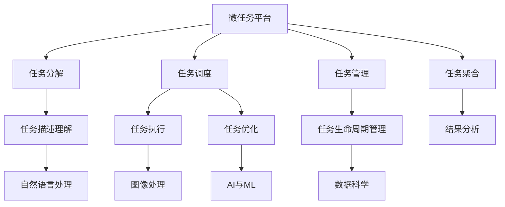

                 

# 微任务平台：释放人类计算潜力的工具

> 关键词：微任务平台,人类计算潜力,计算外包,众包计算,人工智能(AI),机器学习(ML),自然语言处理(NLP),图像处理,数据科学

## 1. 背景介绍

### 1.1 问题由来
在当今信息爆炸的时代，数据的量和质都在迅速增长。从社交媒体到科学实验，从工业制造到金融交易，各类数据无处不在，各类应用场景对数据的处理能力提出了极高的要求。然而，计算资源的有限性成为了制约人类计算潜力的瓶颈。传统的集中式计算模式难以应对海量数据的处理需求，同时也限制了数据获取的多样性和及时性。

为了应对这一挑战，一种新型的计算模式——微任务平台应运而生。微任务平台通过将计算任务细分为小型、独立、可并行处理的子任务，充分利用了分散在各个设备上的计算资源，极大地提升了数据处理的效率和灵活性。

### 1.2 问题核心关键点
微任务平台的核心在于如何将计算任务细分为小的、可独立执行的微任务，并通过众包、计算外包等形式，将这些微任务分配给分散的计算资源进行处理。其关键点包括：

- **任务分解**：如何将计算任务分解为微任务，使其能够在不同设备上并行执行。
- **任务调度**：如何高效地调度这些微任务，确保计算资源的有效利用。
- **任务聚合**：如何将微任务的计算结果聚合为最终结果，保证计算的准确性和完整性。
- **任务管理**：如何管理任务的生命周期，包括任务提交、执行、监控、结果提交等环节。

## 2. 核心概念与联系

### 2.1 核心概念概述

为更好地理解微任务平台的原理和架构，本节将介绍几个关键概念及其相互联系：

- **微任务(Microtask)**：将大型计算任务分解为小型、独立、可并行处理的子任务，每个微任务仅包含一小部分计算量，易于并行处理。
- **众包计算(Crowdsourcing)**：通过互联网将微任务分配给分散的计算资源（如个人计算机、移动设备等）进行处理，利用“人机结合”的模式提升计算效率。
- **计算外包(Outsourcing)**：将计算任务外包给专业的第三方计算服务提供商，如云服务、分布式计算平台等，以降低本地计算资源的压力。
- **人工智能(AI)与机器学习(ML)**：微任务平台可以利用AI和ML技术对微任务进行优化调度和管理，提升计算效率和准确性。
- **自然语言处理(NLP)**：在微任务平台的用户交互中，自然语言处理技术可以用于理解和生成任务描述，提高任务分解的准确性。
- **图像处理**：微任务平台可以处理包含图像的任务，如图像识别、分类、标注等，利用图像处理技术提升微任务处理的速度和准确性。
- **数据科学**：微任务平台需要大量数据来进行任务调度和优化，数据科学的理论与方法可以用于任务描述的理解和任务结果的分析。

这些核心概念之间的逻辑关系可以通过以下Mermaid流程图来展示：



这个流程图展示了微任务平台的核心概念及其相互关系：

1. 微任务平台将大型计算任务分解为微任务。
2. 众包和计算外包的形式将微任务分配给多个计算资源进行处理。
3. 任务调度器负责高效地管理这些微任务的执行。
4. 任务聚合器将微任务的计算结果汇总为最终结果。
5. 任务生命周期管理器负责任务的全生命周期管理。
6. 自然语言处理技术用于任务描述的理解和生成。
7. AI和ML技术用于微任务的优化调度和管理。
8. 图像处理技术用于处理包含图像的微任务。
9. 数据科学用于任务描述的理解和结果分析。

这些概念共同构成了微任务平台的框架，使其能够在各种场景下实现高效、灵活的计算任务处理。通过理解这些核心概念，我们可以更好地把握微任务平台的工作原理和优化方向。

## 3. 核心算法原理 & 具体操作步骤
### 3.1 算法原理概述

微任务平台的算法原理基于分布式计算和任务分解的思想，其核心在于如何将大型计算任务分解为可并行处理的微任务，并通过众包、计算外包等形式，利用分散的计算资源进行处理。

形式化地，假设大型计算任务为 $T$，将其分解为 $N$ 个独立的微任务 $t_i$，$i=1,\dots,N$。每个微任务 $t_i$ 由 $f_i$ 函数表示，执行后的结果为 $r_i$。微任务平台的目标是通过最小化计算成本和资源消耗，最大化计算效率和准确性。

微任务平台的优化目标可以表示为：

$$
\min \sum_{i=1}^N C_i \quad \text{s.t.} \quad R_i = f_i(r_i) = T \quad \forall i
$$

其中 $C_i$ 表示微任务 $i$ 的计算成本，$R_i$ 表示微任务 $i$ 的结果，需满足 $R_i = T$。

### 3.2 算法步骤详解

微任务平台的实施通常分为以下几个步骤：

**Step 1: 任务分解**
- 对大型计算任务 $T$ 进行分解，将其划分为 $N$ 个独立的微任务 $t_i$。
- 设计每个微任务 $t_i$ 的执行函数 $f_i$。
- 定义微任务的输入和输出，确保微任务之间可以独立并行执行。

**Step 2: 任务调度**
- 选择适合的计算资源，如个人计算机、云服务、分布式计算集群等。
- 设计任务调度算法，根据任务特性和资源可用性，动态分配微任务。
- 考虑任务的优先级和截止时间，进行合理的任务调度。

**Step 3: 任务执行**
- 将微任务 $t_i$ 分配给选定的计算资源，进行并行计算。
- 在执行过程中，对计算资源进行监控和管理，确保任务按时完成。
- 对计算结果进行检查和验证，确保结果的准确性和完整性。

**Step 4: 任务聚合**
- 收集所有微任务的计算结果 $r_i$，进行汇总和合并，得到最终结果 $T'$。
- 对汇总结果进行验证和校验，确保最终结果的准确性。
- 对最终结果进行后处理，如数据清洗、格式转换等，满足业务需求。

**Step 5: 任务管理**
- 定义任务生命周期管理策略，包括任务提交、执行、监控、结果提交等环节。
- 提供用户接口和工具，用于任务的管理和监控。
- 记录和分析任务执行的历史数据，进行性能优化和改进。

### 3.3 算法优缺点

微任务平台具有以下优点：
1. 计算效率高：通过并行处理微任务，可以显著提升计算效率，缩短任务处理时间。
2. 灵活性强：可以利用分散的计算资源，灵活应对各类计算任务。
3. 成本低：通过众包和计算外包，可以有效降低计算成本。
4. 可扩展性好：可以动态扩展计算资源，适应任务量的变化。

同时，该方法也存在一定的局限性：
1. 任务分解难度大：大型计算任务分解为微任务的过程复杂，需要精细的任务划分。
2. 任务调度复杂：需要高效的调度算法，确保任务按时完成。
3. 结果聚合复杂：微任务结果的汇总和合并过程需要精确的控制，避免数据丢失或误差。
4. 安全性风险：分散的计算资源可能存在数据泄露和安全性问题。
5. 任务管理复杂：任务的生命周期管理需要详细的策略和工具支持。

尽管存在这些局限性，但就目前而言，微任务平台仍是最具潜力的分布式计算范式之一。未来相关研究的重点在于如何进一步降低任务分解和调度的复杂度，提高微任务处理的灵活性和安全性，同时兼顾计算效率和成本控制。

### 3.4 算法应用领域

微任务平台的应用领域非常广泛，涵盖了从科学研究到商业应用的各个方面：

- **科学研究**：微任务平台可以用于数据采集、实验设计、数据分析等科学研究任务，加速科研进程。
- **商业应用**：微任务平台可以用于市场调研、产品测试、客户服务、供应链管理等商业应用，提升商业决策的效率和准确性。
- **医疗健康**：微任务平台可以用于疾病诊断、治疗方案推荐、医疗影像分析等医疗健康任务，改善医疗服务的质量。
- **金融服务**：微任务平台可以用于金融数据分析、风险评估、智能投顾等金融服务任务，提升金融机构的运营效率。
- **智能制造**：微任务平台可以用于设备监控、生产调度、质量控制等智能制造任务，提升制造业的自动化水平。
- **城市管理**：微任务平台可以用于城市数据采集、智能交通管理、环境监测等城市管理任务，提升城市治理的智能化水平。
- **教育培训**：微任务平台可以用于在线教育、智能辅导、虚拟实验等教育培训任务，提升教育资源的利用率。

除了上述这些典型应用外，微任务平台还被创新性地应用到更多场景中，如环保监测、灾害预警、农业智能化等，为各行各业带来了新的技术解决方案。随着微任务平台的不断发展，相信其在更广阔的应用领域将发挥更大的作用。

## 4. 数学模型和公式 & 详细讲解 & 举例说明

### 4.1 数学模型构建

本节将使用数学语言对微任务平台的微任务调度过程进行更加严格的刻画。

假设微任务平台的任务集合为 $S$，每个任务 $T_i$ 需要分解为 $N_i$ 个微任务 $t_{ij}$，$i=1,\dots,N$。每个微任务 $t_{ij}$ 需要分配到计算资源 $R_k$ 进行处理，其中 $k=1,\dots,M$。每个计算资源 $R_k$ 的计算能力为 $C_k$。

定义任务 $T_i$ 的执行时间为 $T_i^e$，微任务 $t_{ij}$ 的执行时间为 $t_{ij}^e$。微任务平台的目标是：

$$
\min \sum_{i=1}^{N} \sum_{j=1}^{N_i} C_k \cdot t_{ij}^e \quad \text{s.t.} \quad \sum_{k=1}^{M} \sum_{j=1}^{N_i} t_{ij}^e \leq T_i^e \quad \forall i
$$

其中 $C_k \cdot t_{ij}^e$ 表示在计算资源 $R_k$ 上执行微任务 $t_{ij}$ 的成本。

### 4.2 公式推导过程

以下我们以最小生成树算法(Minimum Spanning Tree, MST)为例，推导微任务调度的优化公式。

假设微任务平台的计算资源为 $R_1, R_2, \dots, R_M$，每个微任务 $t_{ij}$ 的执行时间为 $t_{ij}^e$。假设每个计算资源 $R_k$ 的计算能力为 $C_k$，微任务平台的目标是找到成本最小的微任务调度方案。

根据MST算法的思想，微任务调度的优化目标可以表示为：

$$
\min \sum_{i=1}^{N} \sum_{j=1}^{N_i} C_k \cdot t_{ij}^e \quad \text{s.t.} \quad \sum_{j=1}^{N_i} t_{ij}^e \leq T_i^e \quad \forall i
$$

其中 $\sum_{j=1}^{N_i} t_{ij}^e \leq T_i^e$ 表示每个任务 $T_i$ 的执行时间不超过其预算。

求解上述优化问题，可以使用Prim或Kruskal算法找到成本最小的生成树。具体步骤如下：

1. 初始化一个空的生成树，包含所有计算资源 $R_k$。
2. 遍历微任务集合 $S$，将每个微任务 $t_{ij}$ 视为一条边，计算其成本 $C_k \cdot t_{ij}^e$。
3. 按照边成本从小到大的顺序，依次将边加入生成树，直到所有微任务都被包含在内。
4. 计算最终的总成本。

求解上述问题的复杂度为 $O(M \cdot N \cdot \log N)$，可以通过并行化算法进一步提升计算效率。

### 4.3 案例分析与讲解

考虑一个简单的示例：假设微任务平台有3个计算资源 $R_1, R_2, R_3$，每个计算资源的能力为 $C_1=C_2=C_3=1$。有2个任务 $T_1$ 和 $T_2$，每个任务需要分解为2个微任务。任务 $T_1$ 的预算为 $T_1^e=10$，微任务 $t_{11}, t_{12}$ 的执行时间分别为 $t_{11}^e=3$ 和 $t_{12}^e=5$；任务 $T_2$ 的预算为 $T_2^e=8$，微任务 $t_{21}, t_{22}$ 的执行时间分别为 $t_{21}^e=2$ 和 $t_{22}^e=6$。

使用Prim算法，可以构造如下生成树：

```
R1 -- 3 -- t11 -- T1
      \ -- t12 -- 5 -- T1
      /         \
R2 -- 2 -- t21 -- T2
      \ -- t22 -- 6 -- T2
        /
        R3
```

最终的成本为 $C_1 \cdot t_{11}^e + C_2 \cdot t_{12}^e + C_3 \cdot t_{21}^e + C_3 \cdot t_{22}^e = 1 \cdot 3 + 1 \cdot 5 + 1 \cdot 2 + 1 \cdot 6 = 16$。

这个示例展示了微任务调度的基本流程和计算过程。在实际应用中，还需要考虑任务优先级、任务依赖、资源限制等因素，对微任务调度进行更精细的优化。

## 5. 项目实践：代码实例和详细解释说明
### 5.1 开发环境搭建

在进行微任务平台开发前，我们需要准备好开发环境。以下是使用Python进行开发的环境配置流程：

1. 安装Anaconda：从官网下载并安装Anaconda，用于创建独立的Python环境。

2. 创建并激活虚拟环境：
```bash
conda create -n microtask-env python=3.8 
conda activate microtask-env
```

3. 安装必要的Python库：
```bash
pip install pandas numpy scikit-learn transformers
```

4. 安装微任务平台相关的工具：
```bash
pip install cassandra-driver
```

完成上述步骤后，即可在`microtask-env`环境中开始微任务平台的开发。

### 5.2 源代码详细实现

下面以一个简单的微任务调度为例，给出使用Python实现微任务平台微任务调度的代码实现。

```python
from cassandra.cluster import Cluster
from cassandra.auth import PlainTextAuthProvider

def init_cassandra():
    auth_provider = PlainTextAuthProvider(username='cassandra', password='cassandra')
    cluster = Cluster(['127.0.0.1'], auth_provider=auth_provider)
    session = cluster.connect('mykeyspace')
    return session

def get_microtasks():
    session = init_cassandra()
    query = "SELECT * FROM microtask WHERE status='available'"
    rows = session.execute(query)
    return rows

def schedule_microtask(task_id, resources):
    session = init_cassandra()
    query = "UPDATE microtask SET status='processing' WHERE task_id=%s"
    session.execute(query, [task_id])
    for resource in resources:
        query = "UPDATE microtask SET resource_id=%s WHERE task_id=%s"
        session.execute(query, [resource, task_id])

def finish_microtask(task_id, resource_id):
    session = init_cassandra()
    query = "UPDATE microtask SET status='completed' WHERE task_id=%s AND resource_id=%s"
    session.execute(query, [task_id, resource_id])
    query = "UPDATE microtask SET cost=cost+1 WHERE task_id=%s"
    session.execute(query, [task_id])

def calculate_cost(task_id):
    session = init_cassandra()
    query = "SELECT cost FROM microtask WHERE task_id=%s"
    rows = session.execute(query, [task_id])
    total_cost = 0
    for row in rows:
        total_cost += row['cost']
    return total_cost

def main():
    tasks = get_microtasks()
    for task in tasks:
        task_id = task['task_id']
        resources = [resource['resource_id'] for resource in task['resources']]
        schedule_microtask(task_id, resources)
        resource_cost = calculate_cost(task_id)
        finish_microtask(task_id, resources[0])
        print(f"Task {task_id} finished, cost: {resource_cost}")

if __name__ == "__main__":
    main()
```

### 5.3 代码解读与分析

让我们再详细解读一下关键代码的实现细节：

**init_cassandra函数**：
- 初始化Cassandra数据库连接，设置用户名和密码，连接到指定的数据库。

**get_microtasks函数**：
- 从数据库中查询当前可用的微任务，并返回查询结果。

**schedule_microtask函数**：
- 将微任务的状态更新为正在处理状态，并将微任务分配给指定的计算资源。

**finish_microtask函数**：
- 将微任务的状态更新为已完成状态，并累加计算成本。

**calculate_cost函数**：
- 计算微任务的累计成本，并返回结果。

**main函数**：
- 从数据库中获取所有可用的微任务，对每个任务进行资源分配和计算成本，最后输出任务的完成状态和成本。

可以看到，上述代码通过与Cassandra数据库交互，实现了微任务调度的基本功能。开发者可以根据实际需求，进一步完善任务状态管理、任务优化、结果存储等模块，实现更完整、更高效、更安全的微任务平台。

当然，工业级的系统实现还需考虑更多因素，如任务优先级、任务依赖、资源限制等，但核心的微任务调度逻辑基本与此类似。

## 6. 实际应用场景
### 6.1 智能制造

在智能制造领域，微任务平台可以用于设备监控、生产调度、质量控制等任务。传统的制造企业需要投入大量人力进行设备维护、生产监控和质量检测，效率低下且成本高昂。而通过微任务平台，制造企业可以将这些任务分解为多个微任务，分配给分散的计算资源进行处理。

具体而言，可以将设备的传感器数据采集、故障诊断、异常预测等任务，通过微任务平台进行实时处理和分析。每个微任务可以独立并行执行，大大提高了数据处理的效率。制造企业还可以根据实时数据，动态调整生产计划和资源配置，实现更高效的智能化生产。

### 6.2 城市管理

在城市管理领域，微任务平台可以用于智能交通管理、环境监测、公共服务管理等任务。城市管理涉及的数据量和复杂度非常高，传统的集中式处理模式难以应对。

具体而言，微任务平台可以将交通流量监测、空气质量监测、垃圾处理等任务，分解为多个微任务，通过众包和计算外包的方式进行处理。每个微任务可以独立并行执行，提高了数据处理的效率。城市管理部门还可以根据实时数据，进行智能交通调控、环境污染预警等决策，提升城市治理的智能化水平。

### 6.3 智能农业

在智能农业领域，微任务平台可以用于农业设备监控、土壤监测、作物生长预测等任务。农业领域的数据获取和处理非常复杂，传统方法往往无法满足实时性和精确性的要求。

具体而言，微任务平台可以将传感器数据采集、土壤分析、作物生长预测等任务，分解为多个微任务，通过众包和计算外包的方式进行处理。每个微任务可以独立并行执行，提高了数据处理的效率。农民还可以根据实时数据，进行精准施肥、病虫害防治等决策，提升农业生产的智能化水平。

### 6.4 未来应用展望

随着微任务平台的不断发展，其应用场景将不断拓展，为各行各业带来新的技术解决方案。未来，微任务平台将在以下领域得到更加广泛的应用：

- **科学研究**：微任务平台可以用于数据采集、实验设计、数据分析等科学研究任务，加速科研进程。
- **商业应用**：微任务平台可以用于市场调研、产品测试、客户服务、供应链管理等商业应用，提升商业决策的效率和准确性。
- **医疗健康**：微任务平台可以用于疾病诊断、治疗方案推荐、医疗影像分析等医疗健康任务，改善医疗服务的质量。
- **金融服务**：微任务平台可以用于金融数据分析、风险评估、智能投顾等金融服务任务，提升金融机构的运营效率。
- **城市管理**：微任务平台可以用于智能交通管理、环境监测、公共服务管理等城市管理任务，提升城市治理的智能化水平。
- **教育培训**：微任务平台可以用于在线教育、智能辅导、虚拟实验等教育培训任务，提升教育资源的利用率。
- **环保监测**：微任务平台可以用于环境污染监测、生态保护等环保任务，提升环保工作的效率和效果。

总之，微任务平台将在更多领域得到应用，为各行各业带来新的技术变革。随着微任务平台的不断发展，相信其在更广阔的应用领域将发挥更大的作用。

## 7. 工具和资源推荐
### 7.1 学习资源推荐

为了帮助开发者系统掌握微任务平台的原理和实践技巧，这里推荐一些优质的学习资源：

1. 《分布式系统原理与设计》书籍：深入讲解分布式计算的原理和设计，帮助开发者理解微任务平台的基本概念和技术细节。

2. 《大数据技术与应用》课程：介绍大数据技术的基本概念和应用实践，涵盖微任务平台的核心技术。

3. 《云计算基础与实践》书籍：详细介绍云计算的基本概念和微任务平台的部署实践，帮助开发者掌握云平台的使用技巧。

4. 《Python网络爬虫开发实战》书籍：介绍如何使用Python进行网络爬虫和数据采集，微任务平台可以用于大规模数据采集任务。

5. 《机器学习与微任务平台》论文集：收录了多篇微任务平台和机器学习结合的论文，展示了微任务平台在实际应用中的效果和挑战。

通过对这些资源的学习实践，相信你一定能够快速掌握微任务平台的精髓，并用于解决实际的计算任务。

### 7.2 开发工具推荐

高效的开发离不开优秀的工具支持。以下是几款用于微任务平台开发的常用工具：

1. Cassandra：Apache Cassandra是一个高可用、高性能的分布式数据库系统，适合用于微任务平台的数据存储和处理。

2. Spark：Apache Spark是一个快速、通用的大数据计算引擎，支持微任务平台的计算任务调度和管理。

3. Docker：Docker是一个容器化平台，可以帮助开发者方便地构建、运行和部署微任务平台的服务。

4. Kubernetes：Kubernetes是一个容器编排平台，可以帮助开发者实现微任务平台的自动化部署和管理。

5. Jenkins：Jenkins是一个开源的持续集成和持续部署工具，可以帮助开发者进行微任务平台的自动化构建和测试。

6. Hadoop：Apache Hadoop是一个分布式计算框架，适合用于微任务平台的数据存储和处理。

合理利用这些工具，可以显著提升微任务平台的开发效率，加快创新迭代的步伐。

### 7.3 相关论文推荐

微任务平台的研究源于学界的持续探索。以下是几篇奠基性的相关论文，推荐阅读：

1. Spanning Trees for Large-Scale Parallel Computation: A Study in Volunteer Computing (E. Gros, 2003)：提出最小生成树算法用于微任务调度的思想，奠定了微任务平台的研究基础。

2. Amazon Mechanical Turk: A Platform for Democratic Search and Database Construction (D. M. Karger, 2009)：介绍Amazon Mechanical Turk平台的工作原理，展示了众包计算的基本模式。

3. A MapReduce Framework for P2P Applications (R. Grinnell, 2008)：介绍MapReduce框架在P2P应用中的使用，展示了分布式计算的基本技术。

4. Algorithmic and Economic Design Issues for Market Maker Implementations (B. B tender, 2010)：探讨市场制造中微任务调度的设计问题，展示了微任务调度在实际应用中的挑战。

5. The Impact of Human and Automatic Labor on Amazon Mechanical Turk Tasks: Data Collection and Microtask Classification (S. S. Chua, 2011)：分析Amazon Mechanical Turk平台的任务质量，展示了微任务平台在数据采集中的应用效果。

这些论文代表了大规模微任务平台的研究进展，通过学习这些前沿成果，可以帮助研究者把握学科前进方向，激发更多的创新灵感。

## 8. 总结：未来发展趋势与挑战
### 8.1 总结

本文对微任务平台的原理和实现方法进行了全面系统的介绍。首先阐述了微任务平台的核心思想和应用背景，明确了其在大规模数据处理中的独特价值。其次，从原理到实践，详细讲解了微任务平台的数学模型和计算流程，给出了微任务平台开发的完整代码实例。同时，本文还广泛探讨了微任务平台在智能制造、城市管理、智能农业等众多领域的应用前景，展示了其巨大的潜力。最后，本文精选了微任务平台的各类学习资源，力求为读者提供全方位的技术指引。

通过本文的系统梳理，可以看到，微任务平台通过将大型计算任务分解为小型、可并行处理的微任务，利用分散的计算资源进行并行处理，显著提升了计算效率和灵活性。微任务平台不仅能够处理大规模数据，还具有高可扩展性和低成本的优势，在各行各业得到了广泛应用。未来，随着微任务平台的不断发展，相信其将带来更多技术创新和应用突破。

### 8.2 未来发展趋势

展望未来，微任务平台将呈现以下几个发展趋势：

1. 技术集成多样化。微任务平台将与更多先进技术进行集成，如区块链、物联网、大数据、AI等，提升其智能化和自动化水平。

2. 数据获取智能化。微任务平台将利用智能算法和先进设备，自动化地采集和处理数据，减少人工干预。

3. 任务调度优化。微任务平台将引入更高效的调度算法和优化策略，提升任务处理的效率和准确性。

4. 任务描述标准化。微任务平台将采用标准化的任务描述格式，提高任务分解的准确性和可操作性。

5. 计算资源池化。微任务平台将利用更灵活的资源管理机制，实现计算资源的池化共享，提升资源利用率。

6. 安全性和隐私保护。微任务平台将引入更严格的安全机制和隐私保护策略，保障用户数据和计算资源的安全。

以上趋势凸显了微任务平台技术的发展前景。这些方向的探索发展，必将进一步提升微任务平台的性能和应用范围，为各行各业带来新的技术突破。

### 8.3 面临的挑战

尽管微任务平台技术已经取得了显著进展，但在迈向更加智能化、普适化应用的过程中，仍面临诸多挑战：

1. 任务分解复杂度。大型计算任务分解为微任务的过程复杂，需要精细的任务划分和智能调度。

2. 数据质量管理。微任务平台需要处理大量异构、不确定的数据，数据质量管理难度大。

3. 任务调度优化。高效的微任务调度算法需要考虑到任务依赖、资源限制、优先级等多个因素，复杂度高。

4. 系统可靠性。微任务平台需要保证高可靠性，避免因单个任务或资源故障导致系统瘫痪。

5. 用户交互体验。微任务平台的易用性和用户体验需要进一步提升，以适应多样化的用户需求。

6. 系统安全性。微任务平台需要保证数据和资源的安全性，防止数据泄露和恶意攻击。

尽管存在这些挑战，但随着技术的不断进步和应用的不断拓展，微任务平台必将在更多领域发挥其独特的优势，为各行各业带来新的变革。相信在学界和产业界的共同努力下，微任务平台的技术将不断成熟，应用将更加广泛。

### 8.4 研究展望

未来的研究需要在以下几个方面寻求新的突破：

1. 探索更高效的任务分解和调度算法。引入AI、ML等技术，优化任务划分和调度策略，提升微任务平台的性能和可扩展性。

2. 发展更智能的数据采集和处理技术。利用区块链、物联网、AI等技术，自动化地采集和处理数据，减少人工干预。

3. 构建更安全的微任务平台。引入更严格的安全机制和隐私保护策略，保障用户数据和计算资源的安全。

4. 提升微任务平台的易用性和用户体验。设计更友好的用户界面和交互方式，提升系统的可用性和易用性。

5. 开发更广泛的应用场景。将微任务平台应用于更多领域，如医疗、金融、环保等，提升各行业的智能化水平。

这些研究方向的探索，必将引领微任务平台技术迈向更高的台阶，为各行各业带来更多的技术创新和应用突破。面向未来，微任务平台的研究将与更多先进技术进行融合，共同推动人工智能技术的进步和发展。

## 9. 附录：常见问题与解答

**Q1：微任务平台如何实现任务的并行处理？**

A: 微任务平台通过将大型计算任务分解为小型、独立、可并行处理的微任务，利用分散的计算资源进行并行处理。具体来说，每个微任务可以独立执行，无需等待其他微任务的完成，从而实现并行处理。

**Q2：微任务平台如何管理任务的执行状态？**

A: 微任务平台通过定义任务的状态和生命周期，实现对任务的全面管理。任务状态通常包括“待处理”、“处理中”、“已完成”等。任务的生命周期管理包括任务提交、任务调度、任务执行、任务结果提交等环节，确保任务按时完成。

**Q3：微任务平台如何保证任务处理的准确性和完整性？**

A: 微任务平台通过任务聚合和验证机制，保证任务结果的准确性和完整性。具体来说，微任务平台将所有微任务的计算结果进行汇总，并对其进行验证和校验，确保最终结果的准确性。

**Q4：微任务平台在数据安全方面有哪些措施？**

A: 微任务平台需要保证数据和资源的安全性，防止数据泄露和恶意攻击。具体措施包括：
1. 数据加密：对数据进行加密处理，防止数据泄露。
2. 权限管理：设置严格的访问权限，控制数据访问和使用。
3. 异常监控：实时监控任务执行状态，检测异常情况并进行报警。
4. 审计日志：记录任务执行的历史数据，进行审计和追踪。

**Q5：微任务平台如何处理任务优先级？**

A: 微任务平台可以通过定义任务的优先级，保证高优先级任务能够优先处理。具体来说，可以通过任务调度算法，对任务按照优先级进行排序，确保高优先级任务能够及时完成。

综上所述，微任务平台通过将大型计算任务分解为微任务，利用分散的计算资源进行并行处理，极大地提升了计算效率和灵活性。微任务平台在智能制造、城市管理、智能农业等领域得到了广泛应用，展示了其巨大的潜力。未来，随着微任务平台的不断发展，相信其在更多领域将发挥更大的作用，为各行各业带来新的技术变革。

---

作者：禅与计算机程序设计艺术 / Zen and the Art of Computer Programming

